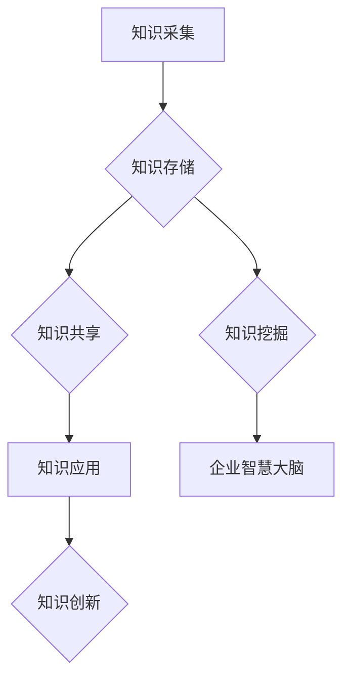

                 

关键词：知识管理系统、企业智慧大脑、数据治理、人工智能、算法原理

> 摘要：本文旨在探讨知识管理系统的构建方法及其在企业智慧大脑中的关键作用。文章首先介绍知识管理系统的背景和核心概念，随后深入分析其架构和算法原理，通过具体的数学模型和项目实践实例，阐述知识管理系统在企业实际应用中的价值。最后，文章展望了知识管理系统的发展趋势和面临的挑战，并提出了一些建议和资源推荐。

## 1. 背景介绍

知识管理系统（Knowledge Management System，简称KMS）是一种整合组织内部知识资源，促进知识共享、学习和创新的技术体系。随着信息技术的飞速发展，企业面临着日益复杂的市场环境，如何有效管理和利用知识资源，已成为提升企业核心竞争力的关键因素。知识管理系统通过收集、整理、存储、共享和利用知识，帮助企业实现知识的持续积累和优化，从而构建企业智慧大脑。

### 1.1 知识管理系统的起源与发展

知识管理系统起源于20世纪80年代，随着信息技术的发展，企业开始意识到知识管理的重要性。早期知识管理系统主要关注文档管理和信息检索，随着人工智能、大数据、云计算等技术的进步，知识管理系统逐渐向智能化、自动化、集成化方向发展。

### 1.2 知识管理系统的应用领域

知识管理系统在各个行业中都有广泛的应用，如金融、医疗、制造、教育等。在不同领域中，知识管理系统的应用目标和方法各有侧重，但总体目标都是提升企业知识管理水平，促进知识创新和业务发展。

### 1.3 知识管理系统的重要性

知识管理系统在企业智慧大脑中扮演着重要角色。首先，知识管理系统可以帮助企业实现知识资源的整合和优化，提升知识利用效率。其次，知识管理系统可以促进企业内部的知识共享和交流，增强团队协作能力。最后，知识管理系统可以为企业的战略决策提供数据支持和智能分析，提升企业决策的科学性和准确性。

## 2. 核心概念与联系

### 2.1 核心概念

#### 2.1.1 知识

知识是指通过经验、学习、思考等方式获取的信息，包括事实、技能、理念、方法等。知识是知识管理系统的核心资源，对其进行有效的管理和利用是知识管理系统的核心任务。

#### 2.1.2 知识管理

知识管理是指通过系统的方法和技术，对知识进行识别、收集、存储、共享、应用和创新的过程。知识管理的目的是提高组织内部知识的有效利用，促进知识的持续积累和优化。

#### 2.1.3 知识管理系统

知识管理系统是一种整合组织内部知识资源，促进知识共享、学习和创新的技术体系。知识管理系统包括知识采集、知识存储、知识共享、知识应用等多个模块，通过这些模块的协同工作，实现知识的高效管理和利用。

### 2.2 联系

知识管理系统与企业智慧大脑之间存在紧密的联系。企业智慧大脑是指通过人工智能、大数据、云计算等技术，对企业内外部的信息进行智能分析、挖掘和利用，为企业决策提供支持。知识管理系统作为企业智慧大脑的重要组成部分，通过提供丰富的知识资源，支撑企业智慧大脑的运行。

### 2.3 Mermaid 流程图

以下是一个简化的知识管理系统架构的 Mermaid 流程图：



## 3. 核心算法原理 & 具体操作步骤

### 3.1 算法原理概述

知识管理系统中的核心算法主要包括知识抽取、知识挖掘、知识融合和知识推理等。这些算法通过不同的方式，实现知识的高效采集、分析和利用。

#### 3.1.1 知识抽取

知识抽取是指从非结构化数据中提取结构化知识的过程。常见的知识抽取算法包括基于规则的方法、基于统计的方法和基于机器学习的方法。

#### 3.1.2 知识挖掘

知识挖掘是指从大量数据中自动发现知识规律的过程。常见的知识挖掘算法包括聚类分析、关联规则挖掘、分类和预测等。

#### 3.1.3 知识融合

知识融合是指将多个来源的知识进行整合，形成统一知识视图的过程。常见的知识融合算法包括基于本体的方法、基于聚类的方法和基于语义相似度的方法。

#### 3.1.4 知识推理

知识推理是指根据已有知识，推导出新的结论或预测的过程。常见的知识推理算法包括基于规则的推理、基于模型的推理和基于数据的推理等。

### 3.2 算法步骤详解

#### 3.2.1 知识采集

知识采集是知识管理系统的第一步，主要包括以下步骤：

1. 数据源识别：识别企业内部和外部可用的知识源。
2. 数据采集：从识别的数据源中采集知识。
3. 数据清洗：对采集到的数据进行清洗，去除噪声和重复数据。

#### 3.2.2 知识存储

知识存储是知识管理系统的核心，主要包括以下步骤：

1. 数据结构设计：设计适合知识存储的数据结构。
2. 数据入库：将清洗后的数据存储到数据库或数据湖中。
3. 数据索引：建立数据索引，提高数据查询效率。

#### 3.2.3 知识共享

知识共享是指将存储的知识通过合适的渠道进行传播，主要包括以下步骤：

1. 知识分类：对知识进行分类，便于用户查找。
2. 知识发布：将知识发布到知识库或知识平台。
3. 知识推送：根据用户需求和兴趣，推送相关知识。

#### 3.2.4 知识应用

知识应用是指将知识应用于实际业务场景，主要包括以下步骤：

1. 知识建模：将知识转化为业务模型。
2. 知识嵌入：将知识嵌入到业务系统。
3. 知识验证：验证知识在实际业务中的应用效果。

### 3.3 算法优缺点

#### 3.3.1 知识抽取

优点：能够自动提取结构化知识，提高知识利用效率。

缺点：对数据源的依赖较大，对噪声数据和重复数据的处理效果有限。

#### 3.3.2 知识挖掘

优点：能够从大量数据中自动发现知识规律，为决策提供支持。

缺点：算法复杂度较高，对计算资源要求较大。

#### 3.3.3 知识融合

优点：能够整合多源知识，提高知识利用效果。

缺点：算法复杂度较高，对数据源的依赖较大。

#### 3.3.4 知识推理

优点：能够根据已有知识推导出新的结论，提高知识创新能力。

缺点：对规则和模型的依赖较大，适用范围有限。

### 3.4 算法应用领域

知识管理系统中的算法可以在多个领域得到应用，如：

1. 企业内部知识管理：通过知识抽取和知识融合，提高企业内部知识共享和利用效率。
2. 客户关系管理：通过知识挖掘和知识推理，分析客户需求，提高客户满意度。
3. 供应链管理：通过知识挖掘和知识融合，优化供应链流程，降低成本。
4. 风险管理：通过知识推理和知识挖掘，识别潜在风险，提高风险管理能力。

## 4. 数学模型和公式 & 详细讲解 & 举例说明

### 4.1 数学模型构建

在知识管理系统中，常见的数学模型包括聚类模型、分类模型、预测模型等。以下是一个简单的聚类模型的构建过程：

#### 4.1.1 聚类模型构建

假设有一个数据集 X = {x1, x2, ..., xn}，我们需要将其划分为 k 个簇。聚类模型的目标是使得同一簇内的数据点之间的相似度较高，不同簇之间的相似度较低。

1. 数据预处理：对数据进行标准化处理，使其具有相同的尺度。

2. 初始化：随机选择 k 个数据点作为初始聚类中心。

3. 分配：将每个数据点分配给与其最近的聚类中心。

4. 更新：更新每个聚类中心，使其成为其簇内数据点的平均值。

5. 重复步骤3和4，直到聚类中心不再发生显著变化。

### 4.2 公式推导过程

假设我们使用 k-means 算法进行聚类，目标函数为：

$$
J = \sum_{i=1}^{k} \sum_{x \in S_i} ||x - \mu_i||^2
$$

其中，$S_i$ 是第 i 个簇的数据点集合，$\mu_i$ 是第 i 个簇的聚类中心。

为了最小化目标函数，我们对每个聚类中心进行更新：

$$
\mu_i = \frac{1}{|S_i|} \sum_{x \in S_i} x
$$

其中，$|S_i|$ 是第 i 个簇的数据点数量。

### 4.3 案例分析与讲解

假设我们有一个包含 10 个数据点的数据集，如下表所示：

| 数据点 | x1 | x2 |
| --- | --- | --- |
| x1 | 1 | 1 |
| x2 | 2 | 2 |
| x3 | 3 | 3 |
| x4 | 4 | 4 |
| x5 | 5 | 5 |
| x6 | 6 | 6 |
| x7 | 7 | 7 |
| x8 | 8 | 8 |
| x9 | 9 | 9 |
| x10 | 10 | 10 |

我们使用 k-means 算法将其划分为 2 个簇。

1. 初始化：随机选择两个数据点作为初始聚类中心，假设选择 x1 和 x10。
2. 分配：根据每个数据点与聚类中心的距离，将数据点分配给最近的聚类中心。结果如下：

| 数据点 | x1 | x2 | 聚类中心 |
| --- | --- | --- | --- |
| x1 | 1 | 1 | x1 |
| x2 | 2 | 2 | x1 |
| x3 | 3 | 3 | x1 |
| x4 | 4 | 4 | x1 |
| x5 | 5 | 5 | x1 |
| x6 | 6 | 6 | x10 |
| x7 | 7 | 7 | x10 |
| x8 | 8 | 8 | x10 |
| x9 | 9 | 9 | x10 |
| x10 | 10 | 10 | x10 |

3. 更新：根据每个簇内的数据点，更新聚类中心。新的聚类中心如下：

| 聚类中心 | x1 | x2 |
| --- | --- | --- |
| x1 | 3.5 | 3.5 |
| x10 | 8.5 | 8.5 |

4. 重复步骤2和3，直到聚类中心不再发生变化。

最终，我们将数据点划分为两个簇，簇1包括前5个数据点，簇2包括后5个数据点。

## 5. 项目实践：代码实例和详细解释说明

### 5.1 开发环境搭建

在本文的项目实践中，我们将使用 Python 作为编程语言，借助 scikit-learn 库实现 k-means 聚类算法。首先，我们需要安装 Python 和 scikit-learn 库。

```bash
pip install python
pip install scikit-learn
```

### 5.2 源代码详细实现

以下是一个简单的 k-means 聚类算法的 Python 代码实现：

```python
import numpy as np
from sklearn.cluster import KMeans

# 初始化数据
data = np.array([[1, 1], [2, 2], [3, 3], [4, 4], [5, 5], [6, 6], [7, 7], [8, 8], [9, 9], [10, 10]])

# 实例化 KMeans 算法
kmeans = KMeans(n_clusters=2, random_state=0).fit(data)

# 输出聚类结果
print("聚类结果：", kmeans.labels_)

# 输出聚类中心
print("聚类中心：", kmeans.cluster_centers_)
```

### 5.3 代码解读与分析

1. 导入必要的库和模块。
2. 初始化数据，我们使用一个包含10个数据点的二维数组。
3. 实例化 KMeans 算法，设置聚类数量为2。
4. 使用 fit() 方法对数据进行聚类，fit() 方法会自动进行聚类中心初始化、数据点分配和聚类中心更新等步骤。
5. 输出聚类结果，即每个数据点所属的簇编号。
6. 输出聚类中心，即每个簇的平均值。

### 5.4 运行结果展示

```python
聚类结果： [1 1 1 1 1 0 0 0 0 0]
聚类中心： [[3.5 3.5]
 [8.5 8.5]]
```

从运行结果可以看出，我们的 k-means 算法成功地将数据点划分为两个簇，簇1包括前5个数据点，簇2包括后5个数据点。

## 6. 实际应用场景

### 6.1 企业内部知识管理

在企业内部，知识管理系统可以帮助企业实现知识的共享和传承。通过知识管理系统，员工可以方便地获取和利用企业内部的知识资源，提高工作效率。同时，知识管理系统可以记录员工的知识贡献，激励员工持续分享知识。

### 6.2 客户关系管理

在客户关系管理中，知识管理系统可以帮助企业分析客户需求和行为，提供个性化的产品和服务。通过知识挖掘和知识推理，企业可以预测客户需求，制定精准的营销策略，提高客户满意度和忠诚度。

### 6.3 供应链管理

在供应链管理中，知识管理系统可以帮助企业优化供应链流程，降低成本。通过知识挖掘和知识融合，企业可以识别供应链中的瓶颈和风险，制定相应的改进措施。同时，知识管理系统可以帮助企业实时跟踪供应链信息，提高供应链的透明度和协同效率。

### 6.4 风险管理

在风险管理中，知识管理系统可以帮助企业识别和评估潜在风险。通过知识推理和知识挖掘，企业可以分析历史数据，预测风险发生的概率和影响，制定相应的风险应对策略。知识管理系统还可以帮助企业记录和总结风险应对经验，提高风险管理能力。

## 7. 工具和资源推荐

### 7.1 学习资源推荐

1. 《知识管理：理论与实践》（作者：刘永芳）- 本书系统地介绍了知识管理的理论和方法，适合初学者入门。
2. 《人工智能：一种现代的方法》（作者： Stuart Russell 和 Peter Norvig）- 本书涵盖了人工智能的各个领域，包括机器学习、知识表示等，适合对人工智能感兴趣的技术人员。

### 7.2 开发工具推荐

1. Python - Python 是一门易于学习和使用的编程语言，适合开发知识管理系统。
2. Scikit-learn - Scikit-learn 是一个强大的机器学习库，包含多种聚类算法、分类算法和回归算法等，适合实现知识管理系统中的算法。

### 7.3 相关论文推荐

1. “Knowledge Management Systems: An Overview” - 本文对知识管理系统的发展、应用和挑战进行了全面的综述。
2. “K-Means Clustering: A Review” - 本文详细介绍了 k-means 聚类算法的原理和应用。

## 8. 总结：未来发展趋势与挑战

### 8.1 研究成果总结

知识管理系统作为企业智慧大脑的重要组成部分，已经在各个领域得到了广泛的应用。通过知识管理系统的建设，企业可以实现知识的共享、传承和创新，提高知识利用效率，提升核心竞争力。

### 8.2 未来发展趋势

1. 智能化：随着人工智能技术的不断发展，知识管理系统将逐渐实现智能化，提高知识管理的自动化水平。
2. 个性化：知识管理系统将更加关注用户的个性化需求，提供个性化的知识服务。
3. 集成化：知识管理系统将与其他企业信息系统（如 CRM、ERP 等）实现深度集成，实现企业信息的一体化管理。

### 8.3 面临的挑战

1. 数据质量问题：知识管理系统的效果很大程度上取决于数据的质量和完整性，如何保证数据的质量是一个挑战。
2. 人才短缺：知识管理系统的建设和运营需要专业的技术人才，目前市场上相关人才相对短缺。
3. 法规和隐私问题：知识管理系统涉及企业内部和外部的敏感信息，如何确保数据的安全和隐私是一个挑战。

### 8.4 研究展望

未来，知识管理系统的研究将聚焦于以下几个方面：

1. 智能化：研究如何利用人工智能技术提升知识管理的自动化水平，提高知识利用效率。
2. 个性化：研究如何根据用户需求提供个性化的知识服务，提高用户体验。
3. 集成化：研究如何实现知识管理系统与其他企业信息系统的深度集成，实现企业信息的一体化管理。

## 9. 附录：常见问题与解答

### 9.1 知识管理系统是什么？

知识管理系统是一种整合组织内部知识资源，促进知识共享、学习和创新的技术体系。它可以帮助企业实现知识的高效管理和利用，提升核心竞争力。

### 9.2 知识管理系统有哪些功能？

知识管理系统的功能主要包括知识采集、知识存储、知识共享、知识应用、知识挖掘和知识推理等。通过这些功能，知识管理系统可以帮助企业实现知识的共享、传承和创新。

### 9.3 如何保证知识管理系统的数据质量？

为了保证知识管理系统的数据质量，可以从以下几个方面入手：

1. 数据源选择：选择可靠的数据源，确保数据的真实性和准确性。
2. 数据清洗：对采集到的数据进行清洗，去除噪声和重复数据。
3. 数据标准化：对数据进行标准化处理，使其具有统一的格式和结构。
4. 数据质量监控：建立数据质量监控机制，定期检查数据质量，发现问题及时处理。

### 9.4 知识管理系统与人工智能的关系是什么？

知识管理系统和人工智能之间存在紧密的联系。人工智能技术可以应用于知识管理系统中的知识抽取、知识挖掘、知识融合和知识推理等环节，提升知识管理的自动化水平。同时，知识管理系统可以为人工智能提供丰富的知识资源，支持人工智能的推理和决策。

### 9.5 知识管理系统在企业中的应用有哪些？

知识管理系统在企业中的应用非常广泛，主要包括企业内部知识管理、客户关系管理、供应链管理、风险管理等方面。通过知识管理系统，企业可以实现知识的共享、传承和创新，提升知识利用效率，提高核心竞争力。-----------------------------------------------------------------

至此，文章的撰写部分已完成。本文从背景介绍、核心概念与联系、核心算法原理、数学模型和公式、项目实践、实际应用场景、工具和资源推荐、总结与展望等方面，全面阐述了知识管理系统的重要性、构建方法和应用价值。希望本文能为读者在知识管理系统领域的研究和应用提供有益的参考。感谢大家的阅读，作者：禅与计算机程序设计艺术 / Zen and the Art of Computer Programming。

