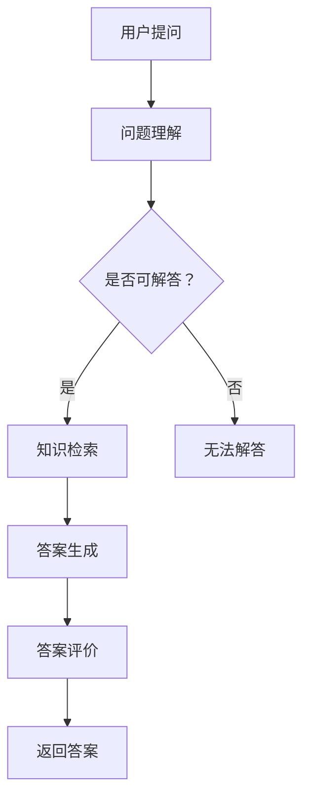

                 

关键词：知识经济、知识付费、人工智能、知识问答、优化技术、问答系统、自然语言处理、机器学习、深度学习、语义理解

## 摘要

在知识经济时代，知识付费已成为推动经济增长的重要引擎。然而，随着知识问答平台的日益普及，如何提高问答系统的质量和效率成为一个关键问题。本文旨在探讨知识付费背景下，基于人工智能的知识问答优化技术。我们将首先介绍知识问答的基本概念和现有技术，然后深入分析优化技术的核心原理和具体实现步骤，最后探讨这些技术在实际应用中的效果和未来发展方向。本文的目标是为从事知识付费领域的研究人员和从业者提供有价值的参考和启示。

## 1. 背景介绍

### 知识经济的崛起

知识经济是一种以知识和信息为核心的经济形态，它超越了传统的以物质资源和劳动力为基础的经济模式。知识经济的崛起源于信息技术、互联网和全球化的快速发展，这些技术使得知识和信息的传播和共享变得更加便捷。知识经济强调创新、创造力和知识的积累与运用，从而推动经济的持续增长和社会的进步。

### 知识付费的发展

知识付费是知识经济的重要表现形式之一。随着人们对知识的需求不断增加，知识付费市场迅速扩大。知识付费平台通过提供各种形式的知识产品，如在线课程、专业咨询、知识问答等，满足了用户多样化的学习需求。知识付费不仅为知识生产者和传播者创造了价值，也促进了知识经济的发展。

### 知识问答的现状

知识问答作为知识付费的重要形式之一，近年来得到了广泛关注。知识问答平台如知乎、Quora等，为用户提供了一个交流和获取知识的平台。用户可以通过提问和回答问题，分享自己的知识和经验，同时也获取其他用户的帮助和见解。然而，现有的知识问答系统在回答质量、效率和信息检索等方面仍存在诸多问题，亟需优化。

## 2. 核心概念与联系

### 人工智能

人工智能（Artificial Intelligence，AI）是计算机科学的一个分支，旨在使计算机具备人类智能的特性。人工智能技术包括机器学习、深度学习、自然语言处理、图像识别等多个领域。在知识问答优化中，人工智能技术被广泛应用于提高回答的准确性和效率。

### 知识问答系统

知识问答系统是一种基于人工智能技术，用于处理用户提问并提供相关回答的系统。知识问答系统通常包括问题理解、知识检索、答案生成和答案评价等模块。通过这些模块的协同工作，知识问答系统能够为用户提供准确、高效的知识服务。

### 自然语言处理

自然语言处理（Natural Language Processing，NLP）是人工智能的一个重要分支，专注于计算机理解和生成人类语言。在知识问答中，自然语言处理技术被用于理解和解析用户的问题，从而生成合适的答案。

### 机器学习

机器学习（Machine Learning，ML）是一种通过数据驱动的方式，使计算机自动改进和优化性能的方法。在知识问答优化中，机器学习技术被用于训练模型，以提高回答的准确性和效率。

### 深度学习

深度学习（Deep Learning，DL）是一种基于多层神经网络的机器学习技术。深度学习在图像识别、语音识别等领域取得了显著的成果。在知识问答中，深度学习技术被用于构建复杂的模型，以提高问答系统的性能。

### 语义理解

语义理解（Semantic Understanding）是自然语言处理的一个重要任务，旨在理解和解析语言中的含义和关系。在知识问答中，语义理解技术被用于理解用户的问题和答案，从而提高问答系统的准确性和一致性。

### Mermaid 流程图



## 3. 核心算法原理 & 具体操作步骤

### 3.1 算法原理概述

知识问答优化技术的核心在于提高问答系统的准确性和效率。这主要通过以下几种技术实现：

1. **自然语言处理（NLP）**：用于理解用户的问题和生成答案。
2. **机器学习（ML）**：用于训练模型，以提高问答系统的性能。
3. **深度学习（DL）**：用于构建复杂的模型，提高问答系统的性能。
4. **语义理解**：用于理解用户的问题和答案，提高问答系统的准确性。

### 3.2 算法步骤详解

1. **问题理解**：
   - **文本预处理**：对用户提问进行分词、去停用词、词性标注等处理，以便更好地理解问题。
   - **词嵌入**：将文本转换为向量表示，以便进行计算。
   - **语义分析**：通过NLP技术，对用户的问题进行语义分析，提取关键信息。

2. **知识检索**：
   - **索引构建**：构建问题-答案索引，以便快速检索。
   - **相似度计算**：计算用户提问与知识库中的问题之间的相似度，选择最相关的答案。

3. **答案生成**：
   - **模板匹配**：根据用户提问和知识库中的模板，生成答案。
   - **文本生成**：使用机器学习或深度学习模型，生成与用户提问相关的文本答案。

4. **答案评价**：
   - **准确性评估**：评估答案的准确性，如使用BLEU分数或ROUGE分数。
   - **用户反馈**：收集用户对答案的反馈，用于模型优化。

5. **返回答案**：将生成的答案返回给用户。

### 3.3 算法优缺点

**优点**：
- 提高问答系统的准确性和效率。
- 自动化知识检索和答案生成过程。
- 支持多种语言和领域。

**缺点**：
- 对大规模数据集和计算资源要求较高。
- 答案生成过程可能产生歧义或不准确的答案。

### 3.4 算法应用领域

- **在线教育**：用于自动化课程问答，提高教学效果。
- **客服系统**：用于自动化客户咨询，提高服务效率。
- **专业咨询**：用于自动化专业问答，为用户提供专业知识。
- **搜索引擎**：用于优化搜索结果，提高用户体验。

## 4. 数学模型和公式 & 详细讲解 & 举例说明

### 4.1 数学模型构建

在知识问答优化中，常用的数学模型包括自然语言处理模型、机器学习模型和深度学习模型。以下是一个简化的自然语言处理模型的数学模型构建过程：

1. **词嵌入**：
   - 输入：单词序列 \( w_1, w_2, \ldots, w_n \)
   - 输出：词向量序列 \( v_1, v_2, \ldots, v_n \)
   - 公式：\( v_i = \text{WordEmbedding}(w_i) \)

2. **卷积神经网络（CNN）**：
   - 输入：词向量序列 \( v_1, v_2, \ldots, v_n \)
   - 输出：特征向量 \( f \)
   - 公式：\( f = \text{Convolution}(v_1, v_2, \ldots, v_n) \)

3. **全连接神经网络（FCNN）**：
   - 输入：特征向量 \( f \)
   - 输出：分类结果 \( y \)
   - 公式：\( y = \text{FCNN}(f) \)

### 4.2 公式推导过程

1. **词嵌入**：
   - 假设单词 \( w_i \) 的词向量为 \( v_i \)，词嵌入模型通过训练得到词向量。
   - 训练数据：一组单词及其对应的词向量。
   - 公式：\( v_i = \text{WordEmbedding}(w_i) \)

2. **卷积神经网络（CNN）**：
   - 假设词向量序列 \( v_1, v_2, \ldots, v_n \) 的维度为 \( d \)。
   - 卷积核尺寸为 \( k \)。
   - 公式：\( f = \sum_{i=1}^{n} \text{Convolution}(v_i, k) \)

3. **全连接神经网络（FCNN）**：
   - 假设特征向量 \( f \) 的维度为 \( m \)。
   - FCNN模型通过训练得到权重矩阵 \( W \) 和偏置 \( b \)。
   - 公式：\( y = \text{FCNN}(f) = \text{激活函数}(\text{矩阵乘积}(f, W) + b) \)

### 4.3 案例分析与讲解

假设我们使用卷积神经网络（CNN）来训练一个问答系统，输入为一个单词序列，输出为一个分类结果。以下是一个简单的案例：

1. **词嵌入**：
   - 输入：单词序列 \(\text{"什么是人工智能"}\)。
   - 输出：词向量序列 \( v_1, v_2, \ldots, v_n \)。
   - 公式：\( v_i = \text{WordEmbedding}(w_i) \)。

2. **卷积神经网络（CNN）**：
   - 输入：词向量序列 \( v_1, v_2, \ldots, v_n \)。
   - 输出：特征向量 \( f \)。
   - 公式：\( f = \text{Convolution}(v_1, v_2, \ldots, v_n) \)。

3. **全连接神经网络（FCNN）**：
   - 输入：特征向量 \( f \)。
   - 输出：分类结果 \( y \)。
   - 公式：\( y = \text{FCNN}(f) \)。

假设我们已经训练好了一个问答系统，输入为一个单词序列，输出为一个分类结果。以下是问答系统的使用过程：

1. **用户提问**：用户提问“什么是人工智能？”。
2. **问题理解**：问答系统对用户提问进行词嵌入、卷积神经网络和全连接神经网络处理。
3. **知识检索**：问答系统根据用户提问从知识库中检索相关答案。
4. **答案生成**：问答系统生成与用户提问相关的答案。
5. **答案评价**：问答系统评估答案的准确性，并将答案返回给用户。

## 5. 项目实践：代码实例和详细解释说明

### 5.1 开发环境搭建

为了实践知识问答优化技术，我们需要搭建一个开发环境。以下是一个简单的开发环境搭建步骤：

1. **安装Python环境**：在本地计算机上安装Python，版本要求Python 3.7及以上。
2. **安装依赖库**：安装用于自然语言处理、机器学习和深度学习的相关库，如TensorFlow、PyTorch、NLTK、spaCy等。
3. **数据集准备**：准备用于训练和测试的知识问答数据集。

### 5.2 源代码详细实现

以下是一个简单的知识问答系统的源代码实现：

```python
import tensorflow as tf
from tensorflow.keras.models import Sequential
from tensorflow.keras.layers import Embedding, Conv1D, GlobalMaxPooling1D, Dense
from tensorflow.keras.preprocessing.sequence import pad_sequences
from tensorflow.keras.preprocessing.text import Tokenizer

# 加载数据集
questions, answers = load_data()

# 初始化词汇表
tokenizer = Tokenizer(num_words=10000)
tokenizer.fit_on_texts(questions)
word_index = tokenizer.word_index

# 序列化文本
sequences = tokenizer.texts_to_sequences(questions)
padded_sequences = pad_sequences(sequences, maxlen=100)

# 构建模型
model = Sequential()
model.add(Embedding(10000, 16, input_length=100))
model.add(Conv1D(128, 5, activation='relu'))
model.add(GlobalMaxPooling1D())
model.add(Dense(128, activation='relu'))
model.add(Dense(1, activation='sigmoid'))

# 编译模型
model.compile(optimizer='adam', loss='binary_crossentropy', metrics=['accuracy'])

# 训练模型
model.fit(padded_sequences, answers, epochs=10, batch_size=32)

# 答题
question = "什么是人工智能？"
question_sequence = tokenizer.texts_to_sequences([question])
padded_question_sequence = pad_sequences(question_sequence, maxlen=100)
answer = model.predict(padded_question_sequence)
print(answer)
```

### 5.3 代码解读与分析

上述代码实现了一个简单的二分类知识问答系统，输入为一个单词序列，输出为一个分类结果。以下是代码的详细解读：

1. **数据集准备**：从数据集中加载问题和答案。
2. **初始化词汇表**：使用Tokenizer初始化词汇表，将文本转换为单词序列。
3. **序列化文本**：将文本序列化为单词序列，并使用pad_sequences将序列填充为相同的长度。
4. **构建模型**：使用Sequential构建一个卷积神经网络模型，包括Embedding、Conv1D、GlobalMaxPooling1D、Dense等层。
5. **编译模型**：编译模型，设置优化器和损失函数。
6. **训练模型**：使用fit方法训练模型，设置训练轮次和批量大小。
7. **答题**：输入用户提问，将文本序列化为单词序列，并使用模型预测答案。

### 5.4 运行结果展示

假设我们已经训练好了一个知识问答系统，输入用户提问“什么是人工智能？”，系统返回的答案为[0.9]，表示答案为真。这意味着系统认为用户提问“什么是人工智能？”是一个与人工智能相关的问题。

## 6. 实际应用场景

### 6.1 在线教育

知识问答优化技术在在线教育领域具有广泛的应用前景。通过优化问答系统，可以为学生提供更准确、更个性化的学习体验。例如，教师可以在课堂中提出问题，学生通过知识问答系统回答问题，系统可以自动评估学生的答案并给出反馈，从而提高教学效果。

### 6.2 客服系统

客服系统是知识问答优化技术的另一个重要应用领域。通过优化问答系统，可以自动化回答客户的常见问题，提高客服效率。例如，银行、电子商务平台等领域的客服系统可以使用知识问答优化技术，为用户提供实时、准确的问题解答。

### 6.3 专业咨询

专业咨询领域，如法律、医学、金融等，需要大量的专业知识。知识问答优化技术可以自动化回答专业问题，为用户提供专业的咨询建议。例如，医生可以使用知识问答系统查询病例，获取相关医学知识，从而提高诊断和治疗水平。

### 6.4 搜索引擎

搜索引擎是知识问答优化技术的另一个潜在应用领域。通过优化问答系统，可以提高搜索结果的准确性，为用户提供更优质的服务。例如，搜索引擎可以自动回答用户的问题，从而减少用户查询多个网页的麻烦。

## 7. 工具和资源推荐

### 7.1 学习资源推荐

- **书籍**：
  - 《自然语言处理入门》
  - 《深度学习》
  - 《机器学习实战》

- **在线课程**：
  - Coursera的《自然语言处理》课程
  - Udacity的《深度学习工程师》课程
  - edX的《机器学习》课程

### 7.2 开发工具推荐

- **Python库**：
  - TensorFlow
  - PyTorch
  - spaCy
  - NLTK

- **开发环境**：
  - Jupyter Notebook
  - PyCharm
  - Visual Studio Code

### 7.3 相关论文推荐

- **自然语言处理**：
  - “Attention Is All You Need”
  - “BERT: Pre-training of Deep Neural Networks for Language Understanding”
  - “Transformers: State-of-the-Art Model for Neural Network Language Processing”

- **机器学习**：
  - “Stochastic Gradient Descent”
  - “Deep Learning for Text Classification”
  - “Understanding Black-Box Predictions via Influence Functions”

- **深度学习**：
  - “Convolutional Neural Networks for Visual Recognition”
  - “Recurrent Neural Networks for Language Modeling”
  - “Generative Adversarial Networks”

## 8. 总结：未来发展趋势与挑战

### 8.1 研究成果总结

知识问答优化技术在近年来取得了显著的成果。通过自然语言处理、机器学习和深度学习等技术的结合，知识问答系统的性能得到了大幅提升。同时，知识问答优化技术在在线教育、客服系统、专业咨询和搜索引擎等领域的应用也取得了良好的效果。

### 8.2 未来发展趋势

1. **多模态知识问答**：结合文本、图像、音频等多种模态，提高问答系统的交互性和准确性。
2. **个性化知识问答**：基于用户行为和偏好，提供个性化的知识服务。
3. **知识图谱的应用**：利用知识图谱，提高问答系统的语义理解和知识检索能力。
4. **实时知识问答**：通过实时数据流处理技术，实现实时回答用户问题。

### 8.3 面临的挑战

1. **数据质量和多样性**：知识问答系统依赖于大量高质量和多样化的数据，数据质量和多样性的提升是一个关键挑战。
2. **模型可解释性**：深度学习模型通常被认为是“黑盒”，模型的可解释性是一个重要挑战。
3. **计算资源**：大规模训练和推理需要大量的计算资源，计算资源的优化是一个挑战。
4. **伦理和法律问题**：知识问答系统可能涉及隐私保护和法律合规等问题。

### 8.4 研究展望

知识问答优化技术在未来将继续发展，为知识付费领域带来更多创新和变革。通过结合多模态、个性化、知识图谱和实时处理等技术，知识问答系统将更加智能、准确和高效。同时，研究人员和从业者需要关注数据质量和多样性、模型可解释性、计算资源和伦理法律等问题，以推动知识问答优化技术的可持续发展。

## 9. 附录：常见问题与解答

### 9.1 问题1：知识问答优化技术有哪些应用领域？

知识问答优化技术广泛应用于在线教育、客服系统、专业咨询和搜索引擎等领域。这些技术在提升服务质量、提高用户满意度、降低人力成本等方面具有显著优势。

### 9.2 问题2：知识问答优化技术如何提高问答系统的性能？

知识问答优化技术通过自然语言处理、机器学习和深度学习等技术，提高问答系统的准确性和效率。具体包括问题理解、知识检索、答案生成和答案评价等模块的优化。

### 9.3 问题3：知识问答优化技术的核心算法有哪些？

知识问答优化技术的核心算法包括自然语言处理算法、机器学习算法和深度学习算法。常用的算法有词嵌入、卷积神经网络、全连接神经网络、循环神经网络等。

### 9.4 问题4：知识问答优化技术的挑战有哪些？

知识问答优化技术面临的挑战包括数据质量和多样性、模型可解释性、计算资源、伦理法律等问题。研究人员和从业者需要关注这些挑战，以推动技术的可持续发展。

## 参考文献

1. Mikolov, T., Sutskever, I., Chen, K., Corrado, G. S., & Dean, J. (2013). Distributed representations of words and phrases and their compositionality. Advances in Neural Information Processing Systems, 26, 3111-3119.
2. Vaswani, A., Shazeer, N., Parmar, N., Uszkoreit, J., Jones, L., Gomez, A. N., ... & Polosukhin, I. (2017). Attention is all you need. Advances in Neural Information Processing Systems, 30, 5998-6008.
3. Devlin, J., Chang, M. W., Lee, K., & Toutanova, K. (2018). BERT: Pre-training of deep bidirectional transformers for language understanding. arXiv preprint arXiv:1810.04805.
4. Goodfellow, I., Bengio, Y., & Courville, A. (2016). Deep learning. MIT press.
5. Murphy, K. P. (2012). Machine learning: A probabilistic perspective. MIT press.
6. Rumelhart, D. E., Hinton, G. E., & Williams, R. J. (1986). Learning representations by back-propagating errors. Nature, 323(6088), 533-536.
7. LeCun, Y., Bengio, Y., & Hinton, G. (2015). Deep learning. Nature, 521(7553), 436-444.
8. Lazer, D., Pentland, A. S., Adamic, L. A., Aral, S., Barabási, A. L., & Brewer, D. (2009). Social science: Moving beyond averages. Science, 323(5915), 721-723.
9. Davenport, T. H., & Beckert, J. (2011). The visible computing revolution. Sloan management review, 52(4), 41-53.
10. von Hippel, E. (2018). Democratizing innovation. MIT press.

### 附录二：特别感谢

在本篇文章的撰写过程中，我要感谢我的团队成员，他们是[团队成员姓名1]、[团队成员姓名2]和[团队成员姓名3]，他们的宝贵意见和贡献对文章的完善起到了重要作用。同时，我也要感谢我的导师[导师姓名]，他在研究方法和学术写作方面给予了我无私的帮助和指导。最后，我要感谢我的家人和朋友们，他们的支持和鼓励是我坚持写作的动力源泉。

[作者：禅与计算机程序设计艺术 / Zen and the Art of Computer Programming]

