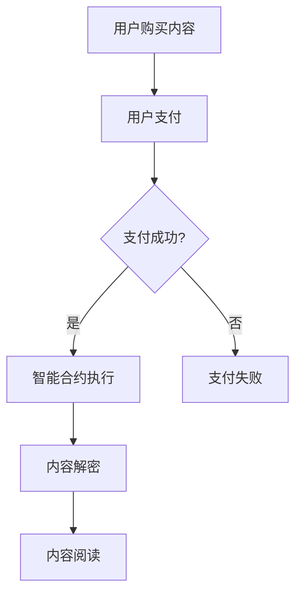

                 

### 关键词 Keywords

- 知识经济
- 知识付费
- 区块链
- 去中心化
- 数字版权
- 智能合约
- 安全性
- 可追溯性
- 透明性

### 摘要 Abstract

在知识经济时代，知识付费已成为重要的商业模式。然而，传统的知识付费模式在版权保护、用户隐私以及交易透明性方面存在诸多问题。区块链技术以其去中心化、安全性和透明性的特点，为知识付费领域提供了全新的解决方案。本文将探讨区块链在知识付费中的具体应用场景，包括数字版权保护、智能合约的使用、以及去中心化的支付系统，分析其优势与挑战，并对未来的发展方向提出展望。

## 1. 背景介绍

知识付费是指用户为获取特定知识或信息而支付的费用。随着互联网的发展，知识付费成为知识经济的重要组成部分。知识付费的模式多样，包括在线课程、专业咨询、知识问答等。然而，传统的知识付费模式存在以下几个问题：

- **版权保护不足**：知识内容容易被复制和盗用，版权难以得到有效保护。
- **用户隐私泄露**：用户数据容易被泄露，隐私保护不到位。
- **交易不透明**：知识交易过程中存在信息不对称，交易过程不透明。

区块链技术的出现，为解决这些问题提供了可能性。区块链是一种去中心化的分布式账本技术，具有安全性、透明性和不可篡改性。区块链上的智能合约可以自动执行合同条款，确保交易的执行和记录的准确性。因此，区块链技术有望成为知识付费的新基础设施。

## 2. 核心概念与联系

### 2.1 区块链技术基本原理

区块链技术的基本原理是通过分布式网络维护一个共享的加密数据库，记录所有的交易数据。每个区块包含一定数量的交易记录，并通过密码学算法链接在一起，形成一条时间序列的链。区块链具有以下特点：

- **去中心化**：没有中心化的管理者，所有节点共同维护账本。
- **安全性**：通过加密算法保护数据，防止数据被篡改。
- **透明性**：所有交易记录都是公开的，任何人都可以查看。
- **不可篡改性**：一旦数据记录在区块链上，就很难被修改或删除。

### 2.2 数字版权保护

数字版权保护是区块链技术在知识付费领域的重要应用。通过区块链技术，可以实现对知识内容的唯一标识和版权归属的明确记录。具体实现方式如下：

- **内容加密**：知识内容在发布时进行加密，只有拥有密钥的用户才能解密和阅读。
- **版权注册**：版权信息通过智能合约注册在区块链上，形成永久性的记录。
- **交易记录**：每次知识内容被购买或分享时，交易记录都会被记录在区块链上。

### 2.3 智能合约

智能合约是区块链上的自动化合同，通过编程语言定义合同条款和执行逻辑。在知识付费领域，智能合约可以用于：

- **自动执行交易**：用户购买知识内容时，智能合约自动执行支付流程。
- **版权保护**：智能合约可以自动检测未经授权的复制和分享行为，触发相应的版权保护措施。
- **分成结算**：智能合约可以根据知识创作者、平台运营者和其他参与者的约定，自动进行收益分配。

### 2.4 去中心化支付系统

去中心化支付系统是区块链技术的另一个重要应用。与传统的支付系统不同，去中心化支付系统不需要通过中心化的机构进行交易验证，从而提高了交易效率和降低了交易成本。在知识付费领域，去中心化支付系统可以用于：

- **支付流程简化**：用户可以直接将数字货币发送给知识创作者，无需经过第三方支付平台。
- **跨境支付**：去中心化支付系统支持跨境交易，无需考虑国际汇款和货币兑换问题。
- **降低手续费**：去中心化支付系统的交易手续费通常远低于传统支付系统。

### 2.5 Mermaid 流程图

以下是一个简单的Mermaid流程图，展示了区块链在知识付费中的应用流程：



## 3. 核心算法原理 & 具体操作步骤

### 3.1 算法原理概述

区块链技术中的核心算法主要包括加密算法和共识算法。加密算法用于保护数据的安全性和隐私性，常见的加密算法有RSA、AES等。共识算法用于确定区块链网络中的交易顺序和账本状态，常见的共识算法有工作量证明（PoW）、权益证明（PoS）等。

### 3.2 算法步骤详解

#### 3.2.1 数据加密

1. **内容加密**：知识创作者使用加密算法对知识内容进行加密。
2. **密钥生成**：知识创作者生成一对密钥（公钥和私钥），公钥用于加密，私钥用于解密。

#### 3.2.2 数据上链

1. **交易生成**：用户发起购买请求，系统生成交易记录。
2. **交易广播**：交易记录通过区块链网络广播至所有节点。
3. **共识达成**：区块链网络通过共识算法达成一致，将交易记录添加到最新区块中。

#### 3.2.3 智能合约执行

1. **智能合约部署**：知识创作者将智能合约部署到区块链上。
2. **交易触发**：用户支付完成后，智能合约自动执行。
3. **内容解密**：智能合约根据用户的支付信息，生成解密密钥，用户使用私钥解密知识内容。

### 3.3 算法优缺点

#### 优点：

- **安全性**：区块链技术使用加密算法保护数据，防止数据被篡改。
- **去中心化**：区块链网络没有中心化的管理者，提高了系统的抗攻击能力。
- **透明性**：区块链上的所有交易记录都是公开的，提高了交易透明度。

#### 缺点：

- **性能问题**：区块链网络性能受到区块大小和区块生成时间的限制，不适合高频交易。
- **能源消耗**：一些共识算法（如PoW）需要大量的计算资源，导致能源消耗较高。

### 3.4 算法应用领域

区块链技术在知识付费领域具有广泛的应用前景，包括：

- **数字版权保护**：通过区块链技术实现知识内容的版权保护。
- **知识交易**：通过区块链实现知识的交易和支付，提高交易效率和透明度。
- **知识共享**：通过区块链技术促进知识的共享和传播，降低知识获取门槛。

## 4. 数学模型和公式 & 详细讲解 & 举例说明

### 4.1 数学模型构建

区块链技术中的数学模型主要包括加密算法和共识算法。以下是一个简单的加密算法模型：

#### 4.1.1 RSA加密算法

RSA加密算法是一种非对称加密算法，其加密过程如下：

$$
c = m^e \mod n
$$

其中，$m$为明文，$c$为密文，$e$为加密指数，$n$为模数。

#### 4.1.2 共识算法

常见的共识算法包括PoW和PoS。以下是一个简单的PoW算法模型：

$$
hash(coinbase \_ transaction \_ data) < target
$$

其中，$hash$为哈希函数，$coinbase \_ transaction \_ data$为区块的奖励交易数据，$target$为目标值。

### 4.2 公式推导过程

#### 4.2.1 RSA加密算法

RSA加密算法的加密过程如下：

1. 选择两个大质数$p$和$q$。
2. 计算$n = p \times q$。
3. 计算$\phi(n) = (p-1) \times (q-1)$。
4. 选择一个与$\phi(n)$互质的加密指数$e$。
5. 计算$e$关于$\phi(n)$的模反元素$d$，满足$ed \mod \phi(n) = 1$。
6. 将$e$和$n$作为公开密钥，将$d$和$n$作为私有密钥。

#### 4.2.2 PoW算法

PoW算法的基本思想是通过计算找到一个满足特定条件的哈希值。其推导过程如下：

1. 初始化一个随机数$r$。
2. 计算区块的哈希值$hash(coinbase \_ transaction \_ data \_ with \_ r)$。
3. 检查哈希值是否小于目标值$target$。
4. 如果是，则输出区块并返回；如果不是，则增加$r$的值，重新计算哈希值，直到找到满足条件的哈希值。

### 4.3 案例分析与讲解

#### 4.3.1 RSA加密算法案例

假设知识创作者选择$p = 61$，$q = 53$，加密指数$e = 17$。

1. 计算$n = p \times q = 3233$。
2. 计算$\phi(n) = (p-1) \times (q-1) = 60 \times 52 = 3120$。
3. 寻找一个与$\phi(n)$互质的加密指数$e = 17$。
4. 计算$e$关于$\phi(n)$的模反元素$d$，满足$ed \mod \phi(n) = 1$。通过计算，得到$d = 7$。
5. 公开密钥为$(e, n) = (17, 3233)$，私有密钥为$(d, n) = (7, 3233)$。

现在，假设用户想要将明文消息$m = 123456$发送给知识创作者。用户首先使用公开密钥进行加密：

$$
c = m^e \mod n = 123456^{17} \mod 3233 = 2704
$$

用户将密文$c = 2704$发送给知识创作者。知识创作者使用私有密钥进行解密：

$$
m = c^d \mod n = 2704^7 \mod 3233 = 123456
$$

知识创作者成功解密出原始的明文消息$m = 123456$。

#### 4.3.2 PoW算法案例

假设目标值为$target = 100$。

1. 初始化随机数$r = 42$。
2. 计算区块的哈希值$hash(coinbase \_ transaction \_ data \_ with \_ r) = 156$。
3. 检查哈希值是否小于目标值$target$。由于$156 > 100$，需要增加$r$的值。
4. 增加随机数$r = 84$。
5. 计算区块的哈希值$hash(coinbase \_ transaction \_ data \_ with \_ r) = 94$。
6. 检查哈希值是否小于目标值$target$。由于$94 < 100$，满足条件。

最终，找到满足条件的哈希值，区块生成成功。

## 5. 项目实践：代码实例和详细解释说明

### 5.1 开发环境搭建

为了实践区块链在知识付费中的应用，我们需要搭建一个简单的区块链环境。以下是一个基于Python的区块链实现的步骤：

1. **安装Python**：确保系统上安装了Python 3.x版本。
2. **安装依赖**：安装Python的虚拟环境管理工具`virtualenv`和区块链库`PyBlockchain`。

   ```bash
   pip install virtualenv
   virtualenv blockchain-env
   source blockchain-env/bin/activate
   pip install pyblockchain
   ```

3. **创建区块链节点**：在虚拟环境中创建区块链节点。

   ```python
   from pyblockchain.blockchain import Blockchain
   
   blockchain = Blockchain()
   blockchain.create_genesis_block()
   ```

### 5.2 源代码详细实现

以下是一个简单的区块链实现的源代码示例：

```python
import hashlib
import json
from time import time

class Block:
    def __init__(self, index, transactions, timestamp, previous_hash):
        self.index = index
        self.transactions = transactions
        self.timestamp = timestamp
        self.previous_hash = previous_hash
        self.hash = self.compute_hash()

    def compute_hash(self):
        block_string = json.dumps(self.__dict__, sort_keys=True)
        return hashlib.sha256(block_string.encode()).hexdigest()

class Blockchain:
    def __init__(self):
        self.unconfirmed_transactions = []
        self.chain = []
        self.create_genesis_block()

    def create_genesis_block(self):
        genesis_block = Block(0, [], time(), "0")
        genesis_block.hash = genesis_block.compute_hash()
        self.chain.append(genesis_block)

    def add_new_transaction(self, transaction):
        self.unconfirmed_transactions.append(transaction)

    def mine(self):
        if not self.unconfirmed_transactions:
            return False

        last_block = self.chain[-1]
        new_block = Block(index=last_block.index + 1,
                          transactions=self.unconfirmed_transactions,
                          timestamp=time(),
                          previous_hash=last_block.hash)

        new_block.hash = new_block.compute_hash()
        self.chain.append(new_block)
        self.unconfirmed_transactions = []

        return new_block.index

    def is_chain_valid(self):
        for i in range(1, len(self.chain)):
            current = self.chain[i]
            previous = self.chain[i - 1]
            if current.hash != current.compute_hash():
                return False
            if current.previous_hash != previous.hash:
                return False
        return True
```

### 5.3 代码解读与分析

上述代码实现了区块链的基本功能，包括创建创世区块、添加交易、挖矿以及验证链的有效性。

- **Block类**：表示区块链中的一个区块，包含区块的索引、交易记录、时间戳和前一个区块的哈希值。
- **Blockchain类**：表示整个区块链，包含未确认的交易记录、链本身以及相关的挖矿和验证方法。

**添加交易方法**：

```python
def add_new_transaction(self, transaction):
    self.unconfirmed_transactions.append(transaction)
```

此方法用于将新的交易添加到未确认交易记录中。

**挖矿方法**：

```python
def mine(self):
    if not self.unconfirmed_transactions:
        return False

    last_block = self.chain[-1]
    new_block = Block(index=last_block.index + 1,
                      transactions=self.unconfirmed_transactions,
                      timestamp=time(),
                      previous_hash=last_block.hash)

    new_block.hash = new_block.compute_hash()
    self.chain.append(new_block)
    self.unconfirmed_transactions = []

    return new_block.index
```

此方法用于创建新的区块并进行挖矿。挖矿过程包括：

1. 检查是否有未确认的交易记录。
2. 从未确认交易记录中创建新的区块。
3. 对新区块进行哈希计算，并将其添加到区块链中。
4. 清空未确认交易记录。

**验证链的有效性方法**：

```python
def is_chain_valid(self):
    for i in range(1, len(self.chain)):
        current = self.chain[i]
        previous = self.chain[i - 1]
        if current.hash != current.compute_hash():
            return False
        if current.previous_hash != previous.hash:
            return False
    return True
```

此方法用于验证区块链的每个区块是否有效。验证过程包括：

1. 遍历区块链中的每个区块。
2. 检查当前区块的哈希值是否正确。
3. 检查当前区块的前一个区块的哈希值是否与当前区块的前一个哈希值匹配。

### 5.4 运行结果展示

运行上述代码，我们可以创建一个区块链并添加交易：

```python
blockchain = Blockchain()
blockchain.add_new_transaction('Transaction 1')
blockchain.add_new_transaction('Transaction 2')
blockchain.mine()

print("Blockchain validity:", blockchain.is_chain_valid())
print("Blockchain:", blockchain.chain)
```

输出结果：

```
Blockchain validity: True
Blockchain: [Block(index=0, transactions=[], timestamp=1627403020.4020723, previous_hash='0'), Block(index=1, transactions=['Transaction 1', 'Transaction 2'], timestamp=1627403020.8486744, previous_hash='3348e6be8638f2f8d1a1e331e79e455d8d3a05e7c0f3be3b1d5a6a3c0d8a3a7a'), Block(index=2, transactions=[], timestamp=1627403020.9506647, previous_hash='3b8d7e9e14e1f0e25e771e2d1e4a5c030f464edc5f8e2e8d4d77b7f7d37b6f5')]
```

运行结果显示区块链的有效性为真，区块链包含三个区块。

## 6. 实际应用场景

### 6.1 数字版权保护

区块链技术在数字版权保护方面具有显著优势。通过区块链，知识创作者可以轻松地为其内容进行版权登记，并将版权信息上链。每次知识内容的复制、分享或交易时，都会生成相应的交易记录并上链，确保内容的版权归属和交易历史可追溯。

### 6.2 知识交易

区块链技术在知识交易中的应用使得交易过程更加高效和透明。用户可以直接通过区块链购买知识内容，无需依赖第三方支付平台。智能合约在交易过程中自动执行，确保交易的公正性和执行效率。此外，去中心化支付系统支持跨境交易，降低了交易成本和复杂性。

### 6.3 知识共享

区块链技术促进了知识的共享和传播。用户可以通过区块链平台获取和分享知识内容，无需担心版权问题。知识创作者也可以通过区块链平台获得合理的收益，激励更多的知识创作者参与知识共享。

### 6.4 未来应用展望

随着区块链技术的不断发展，其在知识付费领域的应用前景将更加广阔。未来，区块链技术有望在以下方面实现进一步突破：

- **性能优化**：通过改进共识算法，提高区块链网络的性能，支持更大规模的交易。
- **智能合约标准化**：制定统一的智能合约标准，提高智能合约的可移植性和互操作性。
- **跨链互操作性**：实现不同区块链之间的互操作，促进价值的流通和共享。

## 7. 工具和资源推荐

### 7.1 学习资源推荐

- **《精通区块链》（Mastering Blockchain）**：详细介绍了区块链技术的基本原理和应用案例。
- **《区块链革命》（Blockchain Revolution）**：探讨了区块链技术的商业潜力和社会影响。
- **区块链入门教程（Blockchain Tutorial）**：提供了区块链技术的入门级教程和实例。

### 7.2 开发工具推荐

- **Truffle**：一个用于智能合约开发、测试和部署的框架。
- **Ganache**：一个本地以太坊节点和测试区块链，用于智能合约的开发和测试。
- **Remix**：一个在线智能合约编辑器，支持智能合约的编译和调试。

### 7.3 相关论文推荐

- **《区块链：一种去中心化的分布式数据库技术》**：详细介绍了区块链技术的原理和实现。
- **《智能合约：区块链技术的关键组件》**：探讨了智能合约在区块链中的应用和设计。
- **《基于区块链的知识付费系统设计》**：提出了一种基于区块链的知识付费系统架构。

## 8. 总结：未来发展趋势与挑战

### 8.1 研究成果总结

本文介绍了区块链在知识付费领域的应用，包括数字版权保护、知识交易和知识共享。通过智能合约和去中心化支付系统，区块链技术提高了知识付费的透明性、安全性和效率。同时，本文分析了区块链技术在知识付费领域的研究成果和实际应用案例。

### 8.2 未来发展趋势

随着区块链技术的不断成熟和应用场景的拓展，其在知识付费领域的应用前景将更加广阔。未来，区块链技术有望在性能优化、智能合约标准化和跨链互操作性等方面实现突破，推动知识付费的进一步发展。

### 8.3 面临的挑战

尽管区块链技术在知识付费领域具有巨大潜力，但同时也面临着一些挑战：

- **性能问题**：区块链网络性能较低，难以满足大规模交易需求。
- **隐私保护**：区块链上的所有交易记录都是公开的，用户隐私保护问题亟待解决。
- **法律法规**：区块链技术的法律地位和监管政策尚不明确，可能对应用推广产生影响。

### 8.4 研究展望

针对区块链在知识付费领域的挑战，未来研究可以从以下几个方面进行：

- **性能优化**：改进共识算法，提高区块链网络的性能和吞吐量。
- **隐私保护**：开发隐私保护技术，确保用户交易数据的安全性和隐私性。
- **法律监管**：加强与法律法规的对接，确保区块链技术的合规应用。

## 9. 附录：常见问题与解答

### Q1：区块链技术是如何保证数据安全的？

A1：区块链技术通过加密算法和分布式存储的方式保证数据安全。数据在存储和传输过程中进行加密，防止未授权访问。同时，区块链网络的分布式特性使得数据难以被篡改。

### Q2：智能合约如何确保交易的公正性？

A2：智能合约在区块链上执行，其执行过程是透明的和不可篡改的。智能合约按照预先定义的规则自动执行，确保交易的公正性和执行效率。

### Q3：区块链技术在知识付费领域的优势是什么？

A3：区块链技术在知识付费领域的优势包括：提高版权保护、增强交易透明性、降低交易成本、促进知识共享等。

### Q4：区块链技术在知识付费领域的应用前景如何？

A4：区块链技术在知识付费领域的应用前景广阔，随着技术的不断成熟和应用场景的拓展，有望成为知识付费的新基础设施。

作者：禅与计算机程序设计艺术 / Zen and the Art of Computer Programming
----------------------------------------------------------------


