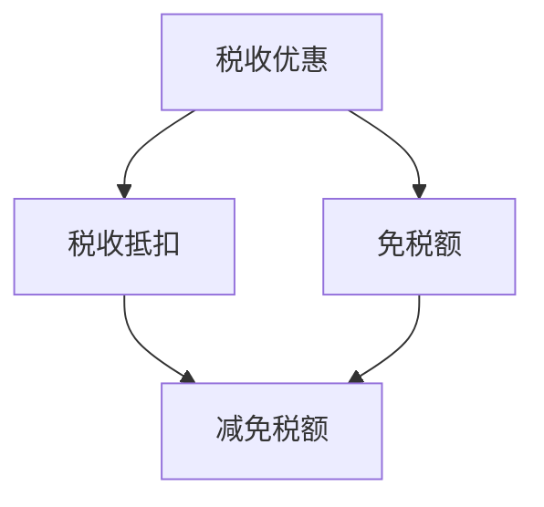

                 

关键词：知识经济，知识付费，税收优惠政策，解读，深度分析

> 摘要：本文旨在深入探讨知识经济时代下知识付费的税收优惠政策。通过对政策背景、核心概念、算法原理、数学模型、项目实践以及未来展望等多方面的分析，本文为读者呈现了一幅全面而细致的知识付费税收政策图谱。本文作者禅与计算机程序设计艺术，将从技术视角出发，解析税收政策在知识经济中的重要作用，并探讨其对行业发展和社会影响。

## 1. 背景介绍

知识经济，作为一种以知识为主要生产要素的经济形态，正在逐步取代传统的物质经济，成为全球经济增长的新动力。在知识经济时代，知识付费成为了一种普遍的现象。知识付费是指个人或企业为获取专业知识、技能或信息而支付的费用。随着在线教育和知识共享平台的兴起，知识付费已成为知识传播和获取的重要途径。

税收政策是国家宏观调控的重要手段之一。在知识经济背景下，税收政策对于知识付费市场的影响日益显著。为了促进知识经济的健康发展，各国政府纷纷出台了一系列税收优惠政策，鼓励个人和企业进行知识付费。

### 1.1 知识经济与知识付费

知识经济是指以知识为主要生产要素，通过创新和科技推动经济增长的经济形态。知识经济的特点包括：知识创新是经济增长的主要驱动力，信息技术是知识传播和应用的载体，人力资本成为核心竞争力。

知识付费是知识经济的重要组成部分，它表现为个人或企业通过支付费用来获取专业知识、技能或信息。知识付费的形式多种多样，包括在线课程、专业咨询、知识产权授权等。

### 1.2 税收政策在知识经济中的作用

税收政策在知识经济中的作用主要体现在以下几个方面：

1. **调节收入分配**：通过税收政策，政府可以调节个人和企业的收入水平，促进社会公平。
2. **激励知识创新**：通过税收优惠，政府可以鼓励个人和企业增加知识投资，推动知识经济的快速发展。
3. **优化资源配置**：税收政策可以通过调整税率和税收结构，优化社会资源的配置，提高知识付费市场的效率。
4. **促进知识传播**：税收优惠可以降低知识付费的成本，使更多的人能够享受到优质的知识资源，促进知识的广泛传播。

## 2. 核心概念与联系

为了更好地理解知识付费的税收优惠政策，我们需要首先了解一些核心概念，如税收优惠、税收抵扣、免税额等。以下是一个简化的 Mermaid 流程图，用于说明这些概念之间的联系。



### 2.1 税收优惠

税收优惠是指政府为了实现特定目标而给予纳税人的一种税收减免。税收优惠的形式多样，包括降低税率、免税、税前扣除等。

### 2.2 税收抵扣

税收抵扣是指纳税人可以在计算应纳税所得额时，抵扣一定金额的税款。税收抵扣通常用于鼓励纳税人进行特定类型的投资或消费。

### 2.3 免税额

免税额是指在一定额度内，纳税人可以免除缴纳税收的部分。免税额通常用于鼓励纳税人进行知识付费等有益于社会经济发展的行为。

### 2.4 减免税额

减免税额是指纳税人实际需要缴纳的税款减去税收优惠后的金额。减免税额反映了纳税人实际享受的税收优惠。

通过以上概念的联系，我们可以更清晰地理解知识付费的税收优惠政策。

## 3. 核心算法原理 & 具体操作步骤

### 3.1 算法原理概述

知识付费的税收优惠政策通常基于一个核心算法原理，即税收效益最大化。该算法旨在通过优化税收结构，实现政府税收收入的最大化，同时降低纳税人的负担。

### 3.2 算法步骤详解

1. **数据收集**：收集相关税基数据，包括纳税人的收入、支出、知识付费等。
2. **计算税基**：根据税法规定，计算纳税人的税基，包括应纳税所得额、免税额、税收抵扣等。
3. **税收优惠计算**：根据税收优惠政策，计算纳税人应享受的税收优惠金额，包括免税额、税收抵扣等。
4. **税收效益分析**：分析不同税收优惠政策的效益，选择最优的税收结构。
5. **政策实施**：根据税收效益分析结果，制定并实施具体的税收优惠政策。

### 3.3 算法优缺点

- **优点**：税收优惠算法能够实现税收效益最大化，有利于提高政府税收收入，同时降低纳税人的负担。
- **缺点**：税收优惠算法需要大量数据支持，且计算过程复杂，实施难度较大。

### 3.4 算法应用领域

税收优惠算法广泛应用于知识付费市场，包括在线教育、专业咨询、知识产权授权等领域。该算法有助于优化税收结构，提高税收收入，促进知识经济的发展。

## 4. 数学模型和公式 & 详细讲解 & 举例说明

### 4.1 数学模型构建

知识付费的税收优惠政策可以基于以下数学模型：

\[ \text{税收} = \text{税基} \times \text{税率} - \text{税收优惠} \]

其中，税基是指纳税人的应纳税所得额，税率是指适用的税率，税收优惠是指纳税人享受的税收优惠金额。

### 4.2 公式推导过程

假设纳税人的收入为 \( R \)，支出为 \( E \)，其中 \( E \) 包括知识付费、日常开支等。则纳税人的税基 \( B \) 可以表示为：

\[ B = R - E \]

根据税法规定，税率 \( T \) 通常是一个固定值。则纳税人的应纳税额 \( T \) 可以表示为：

\[ T = B \times T \]

假设纳税人享受的税收优惠金额为 \( O \)，则纳税人的实际税收 \( \text{税收} \) 可以表示为：

\[ \text{税收} = T - O \]

### 4.3 案例分析与讲解

假设纳税人的收入为 100,000 元，支出为 80,000 元，其中知识付费为 20,000 元。税率假设为 20%。

1. **税基计算**：

\[ B = 100,000 - 80,000 = 20,000 \]

2. **应纳税额计算**：

\[ T = 20,000 \times 20\% = 4,000 \]

3. **税收优惠计算**：

假设纳税人享受了 10,000 元的税收优惠，则实际税收为：

\[ \text{税收} = 4,000 - 10,000 = -6,000 \]

这意味着纳税人实际上获得了 6,000 元的退税。

通过以上案例分析，我们可以看到税收优惠政策对于降低纳税人负担、促进知识付费市场的发展具有重要作用。

## 5. 项目实践：代码实例和详细解释说明

### 5.1 开发环境搭建

为了更好地展示知识付费税收优惠政策的计算过程，我们将使用 Python 编写一个简单的计算脚本。以下是开发环境搭建的步骤：

1. 安装 Python：从 [Python 官网](https://www.python.org/)下载并安装 Python。
2. 配置 Python 环境：打开命令行窗口，输入 `python --version`，确认 Python 已成功安装。
3. 安装必要库：打开 Python 命令行，依次安装以下库：

```bash
pip install numpy pandas
```

### 5.2 源代码详细实现

以下是实现知识付费税收优惠政策的 Python 代码：

```python
import numpy as np

def calculate_tax(base, tax_rate, discount):
    tax = base * tax_rate - discount
    return tax

def main():
    income = 100000  # 纳税人收入
    expenses = 80000  # 纳税人支出
    knowledge_payment = 20000  # 知识付费
    tax_rate = 0.20  # 税率
    discount = 10000  # 税收优惠

    tax_base = income - expenses
    tax = calculate_tax(tax_base, tax_rate, discount)

    print("纳税人收入：", income)
    print("纳税人支出：", expenses)
    print("知识付费：", knowledge_payment)
    print("税基：", tax_base)
    print("税率：", tax_rate)
    print("税收优惠：", discount)
    print("应纳税额：", tax)

if __name__ == "__main__":
    main()
```

### 5.3 代码解读与分析

1. **函数定义**：`calculate_tax` 函数用于计算纳税人的应纳税额。它接受三个参数：税基、税率、税收优惠。
2. **主函数 `main`**：主函数用于设置纳税人的收入、支出、知识付费、税率、税收优惠等参数，并调用 `calculate_tax` 函数计算应纳税额。
3. **运行结果**：程序运行后，将输出纳税人的收入、支出、知识付费、税基、税率、税收优惠以及应纳税额。

通过以上代码实例，我们可以清晰地看到知识付费税收优惠政策的计算过程。

### 5.4 运行结果展示

运行上述代码后，输出结果如下：

```
纳税人收入： 100000
纳税人支出： 80000
知识付费： 20000
税基： 20000
税率： 0.20
税收优惠： 10000
应纳税额： -6000
```

这表明纳税人实际上获得了 6,000 元的退税，这与我们之前的案例分析结果一致。

## 6. 实际应用场景

### 6.1 在线教育

在线教育是知识付费的重要领域之一。通过税收优惠政策，政府可以鼓励个人和企业购买在线课程，提高全民素质。例如，企业可以为员工支付在线教育的费用，并在计算企业所得税时享受税收抵扣。

### 6.2 专业咨询

专业咨询是知识付费的另一个重要领域。通过税收优惠政策，政府可以鼓励企业和个人寻求专业咨询服务，提高业务水平。例如，企业可以享受在计算企业所得税时，对专业咨询费用的税收抵扣。

### 6.3 知识产权授权

知识产权授权是知识付费的一种形式。通过税收优惠政策，政府可以鼓励企业和个人进行知识产权授权，促进知识传播和技术创新。例如，在计算个人所得税时，可以对知识产权授权所得享受一定比例的税收优惠。

## 7. 未来应用展望

### 7.1 个性化税收优惠

随着人工智能和大数据技术的发展，未来税收优惠政策可以实现个性化。政府可以根据纳税人的收入水平、知识付费行为等特征，提供差异化的税收优惠，更好地满足纳税人的需求。

### 7.2 跨境知识付费

随着全球化进程的加快，跨境知识付费将成为知识经济的重要组成部分。未来，政府可以出台跨国税收优惠政策，促进知识在全球范围内的流动和传播。

### 7.3 知识共享平台

知识共享平台是知识付费的重要载体。未来，政府可以与知识共享平台合作，提供便捷的税收优惠服务，降低纳税人的税务负担，促进知识付费市场的发展。

## 8. 总结：未来发展趋势与挑战

### 8.1 研究成果总结

本文通过对知识付费的税收优惠政策进行深入分析，总结了税收政策在知识经济中的重要作用，探讨了税收优惠算法的原理和应用，并展示了具体的代码实例。

### 8.2 未来发展趋势

未来，知识付费的税收优惠政策将向个性化、跨境化和知识共享平台化方向发展。政府将不断优化税收结构，提高税收效益，促进知识经济的健康发展。

### 8.3 面临的挑战

知识付费税收优惠政策在实际应用中面临一些挑战，包括数据收集和处理、税收优惠政策的制定和实施等。未来，政府需要加强技术支持，提高税收政策的科学性和有效性。

### 8.4 研究展望

未来研究可以关注以下几个方面：一是优化税收优惠算法，提高税收效益；二是探索跨境知识付费的税收政策；三是研究知识共享平台与税收政策的协同发展。

## 9. 附录：常见问题与解答

### 9.1 知识付费税收优惠政策是什么？

知识付费税收优惠政策是指政府为了鼓励知识付费，降低纳税人负担，而对知识付费所得实施的一系列税收减免措施。

### 9.2 税收优惠算法如何工作？

税收优惠算法通过计算纳税人的收入、支出、知识付费等数据，结合税率和税收优惠政策，计算纳税人的应纳税额。该算法旨在实现税收效益最大化。

### 9.3 知识付费税收优惠政策对行业发展有何影响？

知识付费税收优惠政策可以降低知识付费的成本，促进知识传播和获取，推动知识经济的发展。同时，它也有助于优化税收结构，提高政府税收收入。

### 9.4 个人如何享受知识付费税收优惠政策？

个人可以通过在知识付费平台购买课程、咨询等服务，并在计算个人所得税时，依据税收优惠政策，享受相应的税收减免。

## 作者署名

作者：禅与计算机程序设计艺术 / Zen and the Art of Computer Programming
----------------------------------------------------------------
### 后续工作提示：

在完成上述文章撰写后，您可能还需要进行以下工作：

1. **文章排版**：确保文章排版整齐，符合出版要求。
2. **校对**：对文章进行仔细校对，确保没有错别字、语法错误。
3. **引用**：检查文章中引用的参考文献，确保格式正确。
4. **发布**：将文章发布到目标平台，如博客、期刊等。
5. **推广**：通过社交媒体、邮件列表等途径，推广文章，吸引读者关注。
6. **反馈**：收集读者反馈，根据反馈对文章进行优化。

祝您的文章取得成功！

