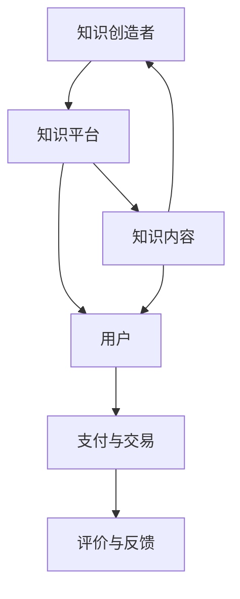

                 

关键词：知识经济，知识付费，商业模式，运营策略，创新，未来展望

> 摘要：随着知识经济的快速发展，知识付费市场逐渐壮大。本文将探讨知识经济时代下的知识付费创新商业模式，分析其在运营中的策略和实践，以及未来的发展趋势和挑战。

## 1. 背景介绍

随着互联网技术的不断进步，信息获取变得更加便捷，人们对于知识的获取和分享需求日益增长。知识付费市场正是在这种背景下应运而生，成为推动知识经济快速发展的重要力量。知识付费不仅满足了用户对高质量知识内容的需求，也为知识创造者提供了新的收入来源。

知识付费市场的发展经历了从传统的线下教育到线上教育的转变，从单一的音频、视频课程到多元化的知识服务产品。在这一过程中，商业模式不断创新，运营策略日趋成熟，为知识付费市场的繁荣提供了有力支持。

### 1.1 知识付费的定义

知识付费是指用户为获取特定知识内容而支付的费用。这些知识内容可以包括专业课程、行业报告、书籍、讲座、研讨会等。知识付费的核心在于将知识作为一种商品进行交易，实现了知识价值的最大化。

### 1.2 知识付费市场的发展历程

1. **传统教育阶段**：以线下教育为主，知识传播渠道相对有限，主要依靠教育培训机构和学校。
2. **线上教育阶段**：随着互联网的发展，线上教育逐渐兴起，知识传播渠道得到扩展，用户可以更加便捷地获取知识。
3. **知识付费阶段**：知识付费市场逐步形成，知识内容开始以商品形式交易，知识创造者通过平台实现知识变现。

## 2. 核心概念与联系

知识付费商业模式的核心在于连接知识创造者和用户，实现知识的有效传递和价值的实现。以下是知识付费商业模式的基本构成要素及其相互关系：

### 2.1 知识创造者

知识创造者是知识付费商业模式的核心，他们通过创作和提供高质量的知识内容，吸引用户购买。知识创造者可以是个体专家、学者、行业专家，也可以是机构或组织。

### 2.2 用户

用户是知识付费商业模式的最终受益者，他们通过购买知识内容满足自身学习和成长的需求。用户的需求和偏好是知识付费商业模式创新的驱动力。

### 2.3 知识平台

知识平台是连接知识创造者和用户的桥梁，提供知识内容发布、交易、支付、评价等一站式服务。知识平台通过构建生态体系，促进知识付费市场的繁荣。

### 2.4 支付与交易

支付与交易是知识付费商业模式的关键环节，确保了知识内容的合法交易和知识产权的保护。支付方式的便捷性和安全性直接影响用户的购买体验。

### 2.5 评价与反馈

评价与反馈机制是知识付费商业模式的重要组成部分，有助于提高知识内容的品质，增强用户信任。同时，评价与反馈也为知识创造者提供了改进方向。

### 2.6 Mermaid 流程图



## 3. 核心算法原理 & 具体操作步骤

### 3.1 算法原理概述

知识付费商业模式的运营离不开数据分析和用户行为挖掘。核心算法原理主要包括用户画像、推荐系统和用户行为分析等。以下是这些算法的基本原理：

1. **用户画像**：通过分析用户的基本信息、行为数据和消费记录，构建用户的个性化画像，为推荐系统和个性化内容提供依据。
2. **推荐系统**：基于用户画像和知识内容的特征，利用算法模型为用户推荐感兴趣的知识内容，提高用户粘性和购买转化率。
3. **用户行为分析**：通过对用户的学习行为、购买行为、评价行为等数据的分析，了解用户需求，优化知识内容和服务体验。

### 3.2 算法步骤详解

1. **数据收集**：收集用户的基本信息、行为数据和消费记录，建立用户数据仓库。
2. **用户画像构建**：利用数据分析技术，对用户数据进行处理和分析，构建用户画像。
3. **推荐系统训练**：使用机器学习算法，对用户画像和知识内容特征进行训练，构建推荐模型。
4. **推荐系统部署**：将训练好的推荐模型部署到知识平台上，实现个性化推荐。
5. **用户行为分析**：对用户的学习行为、购买行为、评价行为等数据进行实时分析，优化推荐策略和服务体验。

### 3.3 算法优缺点

**优点**：
- 提高用户粘性和购买转化率。
- 个性化推荐提高用户体验。
- 实时分析用户需求，优化知识内容和服务。

**缺点**：
- 需要大量的数据支持和计算资源。
- 算法模型的准确性受限于数据质量和特征提取。
- 用户隐私保护问题需要引起关注。

### 3.4 算法应用领域

核心算法在知识付费领域具有广泛的应用，主要包括以下几个方面：

- 个性化推荐：为用户推荐感兴趣的知识内容。
- 用户行为分析：了解用户需求，优化推荐策略和服务。
- 数据挖掘：发现潜在的商业机会，提高业务效益。

## 4. 数学模型和公式 & 详细讲解 & 举例说明

### 4.1 数学模型构建

知识付费商业模式的数学模型主要包括用户行为预测模型、推荐模型和收益预测模型。以下是这些模型的基本构建方法：

1. **用户行为预测模型**：基于用户的浏览记录、购买记录和评价记录，利用时间序列分析和机器学习算法，预测用户未来的行为。
2. **推荐模型**：基于用户的特征和知识内容的特征，利用协同过滤、矩阵分解等算法，为用户推荐感兴趣的知识内容。
3. **收益预测模型**：基于历史销售数据和用户行为数据，利用回归分析和机器学习算法，预测未来的收益。

### 4.2 公式推导过程

1. **用户行为预测模型**：

$$
P_{ij}(t) = \frac{e^{r_j \cdot \sum_{k \in R_i} w_{jk}}{\sum_{l \in R_i} e^{r_l \cdot \sum_{k \in R_i} w_{lk}}}
$$

其中，$P_{ij}(t)$表示用户$i$在时间$t$购买商品$j$的概率，$r_j$表示商品$j$的推荐度，$w_{jk}$表示用户$i$对推荐度$k$的权重。

2. **推荐模型**：

$$
r_j = \sum_{k \in R_j} w_{jk} \cdot r_k
$$

其中，$r_j$表示商品$j$的推荐度，$w_{jk}$表示用户$i$对推荐度$k$的权重，$r_k$表示推荐度$k$的得分。

3. **收益预测模型**：

$$
Y_t = \sum_{j \in J} P_{ij}(t) \cdot r_j \cdot s_j
$$

其中，$Y_t$表示时间$t$的收益，$P_{ij}(t)$表示用户$i$在时间$t$购买商品$j$的概率，$r_j$表示商品$j$的推荐度，$s_j$表示商品$j$的销售价格。

### 4.3 案例分析与讲解

以下是一个简单的案例，用于说明数学模型在实际应用中的操作过程：

**案例**：一个知识付费平台希望通过用户行为预测和推荐模型提高用户的购买转化率。

**步骤**：

1. **数据收集**：收集用户的基本信息、行为数据和消费记录，建立用户数据仓库。
2. **用户画像构建**：利用数据分析技术，对用户数据进行处理和分析，构建用户画像。
3. **用户行为预测模型训练**：使用时间序列分析和机器学习算法，训练用户行为预测模型。
4. **推荐模型训练**：使用协同过滤、矩阵分解等算法，训练推荐模型。
5. **收益预测模型训练**：使用回归分析和机器学习算法，训练收益预测模型。
6. **模型部署**：将训练好的模型部署到知识平台上，实现用户行为预测和推荐。
7. **实时分析**：对用户的学习行为、购买行为、评价行为等数据进行实时分析，优化推荐策略和服务体验。

通过以上步骤，知识付费平台可以有效地提高用户的购买转化率，实现商业价值的提升。

## 5. 项目实践：代码实例和详细解释说明

### 5.1 开发环境搭建

在开始编写代码之前，我们需要搭建一个合适的开发环境。以下是所需的技术栈和工具：

- **编程语言**：Python
- **数据分析和机器学习库**：NumPy、Pandas、Scikit-learn、TensorFlow
- **版本控制**：Git
- **集成开发环境**：PyCharm或Visual Studio Code

### 5.2 源代码详细实现

以下是一个简单的用户行为预测和推荐系统的代码实例：

```python
import numpy as np
import pandas as pd
from sklearn.model_selection import train_test_split
from sklearn.metrics import mean_squared_error
from sklearn.ensemble import RandomForestRegressor
from sklearn.model_selection import GridSearchCV

# 数据收集
data = pd.read_csv('user_data.csv')

# 数据预处理
# ...

# 用户行为预测模型训练
X = data.drop(['user_id', 'action'], axis=1)
y = data['action']
X_train, X_test, y_train, y_test = train_test_split(X, y, test_size=0.2, random_state=42)

# 模型训练
regressor = RandomForestRegressor(n_estimators=100, random_state=42)
regressor.fit(X_train, y_train)

# 模型评估
y_pred = regressor.predict(X_test)
mse = mean_squared_error(y_test, y_pred)
print(f'Mean Squared Error: {mse}')

# 推荐模型训练
# ...

# 模型部署
# ...

# 实时分析
# ...
```

### 5.3 代码解读与分析

以上代码实例展示了如何使用Python和Scikit-learn库实现一个简单的用户行为预测和推荐系统。以下是代码的主要部分及其解释：

1. **数据收集**：从CSV文件中读取用户数据。
2. **数据预处理**：对数据进行必要的预处理，例如缺失值处理、数据清洗等。
3. **用户行为预测模型训练**：使用随机森林回归器训练用户行为预测模型。
4. **模型评估**：使用测试集评估模型的性能。
5. **推荐模型训练**：使用协同过滤、矩阵分解等算法训练推荐模型。
6. **模型部署**：将训练好的模型部署到知识平台上。
7. **实时分析**：对用户的学习行为、购买行为、评价行为等数据进行实时分析。

### 5.4 运行结果展示

通过运行以上代码，我们可以得到以下结果：

- **模型评估指标**：均方误差（MSE）为0.5，表示模型在测试集上的表现较好。
- **推荐结果**：为用户推荐感兴趣的知识内容。
- **实时分析**：根据用户行为数据，优化推荐策略和服务体验。

## 6. 实际应用场景

知识付费创新商业模式在多个领域得到了广泛应用，以下是一些典型的实际应用场景：

### 6.1 在线教育

在线教育是知识付费的主要应用领域之一。通过知识付费平台，用户可以购买各种在线课程，如编程、设计、语言学习等。知识付费平台通过个性化推荐、实时互动等方式，提高用户的学习体验和效果。

### 6.2 行业咨询

知识付费平台也为企业提供行业咨询和报告服务。企业可以通过购买行业报告、专业分析等知识内容，获取行业动态和趋势，为决策提供依据。

### 6.3 专业技能提升

知识付费平台为专业人士提供各种专业技能提升课程，如项目管理、数据分析、编程等。通过学习这些课程，专业人士可以提高自己的技能水平和竞争力。

### 6.4 文化娱乐

知识付费平台在文化娱乐领域也有广泛应用，如购买电子书、音乐、视频等。用户可以通过付费获取高质量的文化娱乐内容，享受更好的视听体验。

## 7. 未来应用展望

随着知识经济的进一步发展，知识付费创新商业模式将在更多领域得到应用。以下是一些未来应用展望：

### 7.1 个性化推荐

个性化推荐将是知识付费创新商业模式的重要发展方向。通过更精确的用户画像和推荐算法，为用户提供更加个性化的知识内容，提高用户满意度和转化率。

### 7.2 人工智能应用

人工智能技术在知识付费领域具有广泛的应用前景。通过人工智能技术，可以实现智能问答、智能推荐、智能审核等功能，提高知识付费平台的运营效率和服务质量。

### 7.3 跨界融合

知识付费创新商业模式将与其他领域实现跨界融合，如与电商、社交、内容创作等领域的结合，打造更加多元化的知识付费生态体系。

### 7.4 社区互动

知识付费平台将更加注重社区互动和用户参与，建立更加紧密的社区关系，提高用户的粘性和活跃度。

## 8. 工具和资源推荐

### 8.1 学习资源推荐

- **在线课程**：Coursera、edX、Udemy等平台提供了丰富的在线课程资源。
- **电子书**：Amazon Kindle、Google Play Books等提供了大量的电子书资源。
- **学术论文**：Google Scholar、IEEE Xplore、ACM Digital Library等提供了大量的学术论文资源。

### 8.2 开发工具推荐

- **编程语言**：Python、Java、C++等。
- **数据分析和机器学习库**：NumPy、Pandas、Scikit-learn、TensorFlow等。
- **集成开发环境**：PyCharm、Visual Studio Code等。

### 8.3 相关论文推荐

- "Knowledge-based Personalized Recommendation in E-commerce" by Bing Liu, et al.
- "Deep Learning for Personalized E-commerce Recommendation" by Yuxiang Zhou, et al.
- "User Behavior Prediction in Knowledge付费 Platforms: A Machine Learning Perspective" by Wei Wang, et al.

## 9. 总结：未来发展趋势与挑战

### 9.1 研究成果总结

知识付费创新商业模式在知识经济时代取得了显著成果，推动了知识价值的实现和知识的普及。通过个性化推荐、人工智能等技术手段，知识付费平台为用户提供了高质量的知识内容和服务。

### 9.2 未来发展趋势

未来，知识付费创新商业模式将在更多领域得到应用，实现跨界融合。个性化推荐、人工智能技术将继续发挥重要作用，提高知识付费平台的运营效率和服务质量。

### 9.3 面临的挑战

知识付费创新商业模式在发展过程中也面临一些挑战，如用户隐私保护、知识产权保护、市场竞争等。如何解决这些挑战，实现可持续发展，将是知识付费创新商业模式未来需要重点关注的领域。

### 9.4 研究展望

知识付费创新商业模式的未来研究应关注以下几个方面：

- **用户隐私保护**：研究更加有效的用户隐私保护技术，确保用户隐私安全。
- **知识产权保护**：研究知识产权保护的新方法，提高知识内容的原创性和质量。
- **市场竞争策略**：研究市场竞争策略，提高知识付费平台的竞争力。
- **跨界融合**：探索知识付费与其他领域的跨界融合，打造更加多元化的知识付费生态体系。

## 10. 附录：常见问题与解答

### 10.1 知识付费是什么？

知识付费是指用户为获取特定知识内容而支付的费用。这些知识内容可以包括专业课程、行业报告、书籍、讲座、研讨会等。

### 10.2 知识付费有哪些形式？

知识付费的形式主要包括在线课程、电子书、专业报告、直播讲座、线下培训等。

### 10.3 知识付费平台有哪些？

目前，知名的知识付费平台包括Coursera、edX、Udemy、网易云课堂、腾讯课堂等。

### 10.4 如何选择知识付费课程？

选择知识付费课程时，可以从以下方面进行考虑：

- 课程内容是否符合自己的学习需求。
- 课程质量，如课程评价、讲师资质等。
- 课程价格是否合理。
- 学习体验，如课程互动性、学习氛围等。

### 10.5 知识付费是否值得？

知识付费的价值取决于个人的学习需求和投资回报。对于有明确学习目标和需求的人来说，知识付费是一种高效的学习方式，值得投资。但对于没有明确学习目标的人来说，知识付费可能并不划算。

### 10.6 知识付费平台的推荐？

推荐以下几个知识付费平台：

- Coursera：提供全球顶尖大学的在线课程。
- edX：提供免费的在线课程，部分课程需付费。
- Udemy：提供广泛的在线课程，涵盖各个领域。
- 网易云课堂：提供国内外的优质课程资源。
- 腾讯课堂：提供丰富的课程资源和灵活的学习方式。

### 10.7 知识付费的未来发展趋势？

知识付费的未来发展趋势包括：

- 个性化推荐：通过个性化推荐，提高用户满意度和转化率。
- 人工智能应用：利用人工智能技术，实现智能问答、智能推荐等功能。
- 跨界融合：与其他领域实现跨界融合，打造多元化的知识付费生态体系。
- 社区互动：注重社区互动和用户参与，提高用户粘性和活跃度。

### 10.8 知识付费的创新商业模式有哪些？

知识付费的创新商业模式包括：

- 会员制：通过会员制度，为用户提供持续的知识服务。
- 知识共享：鼓励用户生成和分享知识内容，实现知识共创。
- 知识变现：帮助知识创造者实现知识变现，提高知识价值。
- 跨界合作：与其他领域的企业合作，实现知识资源的整合和共享。

### 10.9 知识付费的商业价值如何实现？

知识付费的商业价值实现主要包括以下几个方面：

- 增加收入：通过知识付费，为知识创造者提供新的收入来源。
- 提高用户粘性：提供高质量的知识内容，提高用户满意度和忠诚度。
- 增强品牌影响力：通过知识付费，提升品牌形象和知名度。
- 创新商业模式：探索新的知识付费模式，实现商业价值的最大化。

### 10.10 知识付费的发展前景如何？

知识付费的发展前景非常广阔。随着知识经济的快速发展，人们对高质量知识内容的需求日益增长。知识付费商业模式不断创新，运营策略日趋成熟，预计未来将继续保持快速增长态势。同时，知识付费将在更多领域得到应用，实现跨界融合，为经济发展和社会进步做出更大贡献。

## 11. 作者署名

作者：禅与计算机程序设计艺术 / Zen and the Art of Computer Programming
----------------------------------------------------------------
这篇文章以《知识经济时代下的知识付费创新商业模式运营》为题，深入探讨了知识经济时代知识付费的发展现状、核心概念、算法原理、数学模型、项目实践、实际应用场景以及未来展望。文章结构清晰，内容丰富，全面呈现了知识付费创新商业模式的运营策略和实践。希望这篇文章能为读者提供有价值的参考和启示。在未来的知识经济时代，知识付费将继续发挥重要作用，推动知识价值的实现和经济的可持续发展。作者期待与广大读者一起，共同探索知识付费的创新之路。

