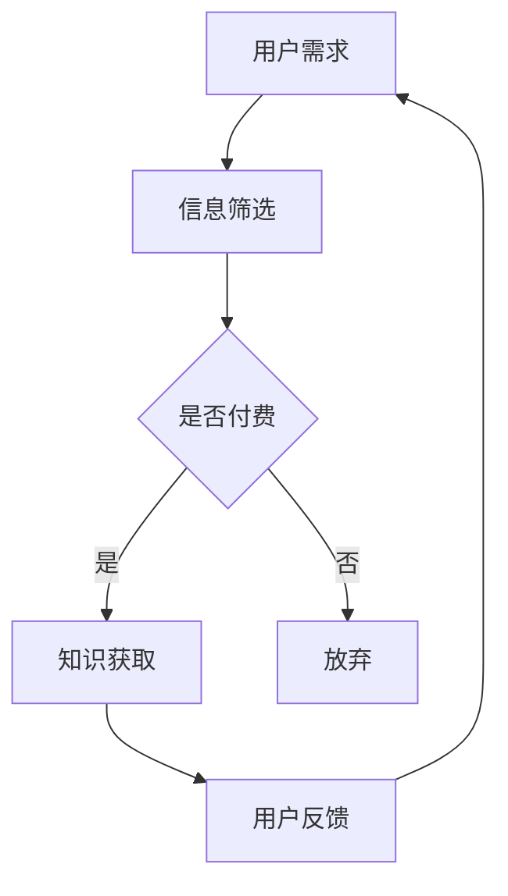

                 

在当今的知识经济时代，知识付费已经成为一种主流商业模式。这种模式不仅改变了人们获取知识的方式，也推动了商业的转型与创新。本文将深入探讨知识付费的背景、核心概念、算法原理、数学模型、项目实践、应用场景、未来展望以及相关的工具和资源推荐，旨在为广大从业者和研究者提供一份全面的指南。

## 关键词

- 知识付费
- 商业模式
- 知识经济
- 数据分析
- 人工智能
- 区块链
- 用户行为分析

## 摘要

本文通过分析知识经济时代下知识付费的背景和发展趋势，探讨了知识付费的核心概念和商业模式。文章详细介绍了知识付费的算法原理、数学模型以及项目实践，分析了其应用场景和未来展望。最后，本文推荐了相关的学习资源、开发工具和论文，为读者提供了全面的参考资料。

---

## 1. 背景介绍

知识付费作为一种商业模式，起源于互联网的发展和信息化的普及。在过去，人们获取知识的主要途径是通过传统教育机构和图书馆。然而，随着互联网技术的进步，信息获取变得更加便捷，用户开始寻找更加灵活和个性化的学习方式。知识付费应运而生，它允许用户通过支付费用来获取高质量的知识服务。

知识付费的主要驱动力包括以下几点：

1. **信息过载**：互联网上充斥着海量的信息，用户需要有效筛选和获取有价值的内容。
2. **用户需求**：用户对个性化、专业化和深度的知识需求日益增长。
3. **技术进步**：大数据、人工智能和区块链等技术的应用，为知识付费提供了技术支持。
4. **商业机会**：知识付费成为一种新兴的商业模式，吸引了大量创业者和企业投入其中。

知识付费的商业模式主要包括以下几种：

1. **会员订阅**：用户支付一定费用成为会员，享受特定知识服务。
2. **课程购买**：用户购买单门课程或系列课程来学习。
3. **内容付费**：用户为特定内容（如文章、报告、视频等）支付费用。
4. **专家咨询**：用户支付费用获得专家的专业咨询服务。

## 2. 核心概念与联系

### 2.1 知识付费的概念

知识付费是指用户为获取知识或知识服务而支付的费用。它涵盖了从基础教育到专业培训，从在线课程到专家咨询的广泛领域。

### 2.2 商业模式

知识付费的商业模式主要包括会员订阅、课程购买、内容付费和专家咨询。这些模式各有特点，适用于不同的用户需求和场景。

### 2.3 技术支持

大数据、人工智能和区块链等技术为知识付费提供了技术支持。大数据帮助分析用户行为，提供个性化推荐；人工智能提升了课程内容的质量和互动性；区块链确保了知识服务的透明性和可信度。

### 2.4 Mermaid 流程图



## 3. 核心算法原理 & 具体操作步骤

### 3.1 算法原理概述

知识付费的核心算法主要包括用户行为分析、内容推荐和付费决策。用户行为分析用于了解用户需求，内容推荐用于提升用户体验，付费决策则基于用户的行为和偏好来决定是否推荐付费内容。

### 3.2 算法步骤详解

1. **用户行为分析**：
   - 收集用户浏览、搜索、购买等行为数据。
   - 利用机器学习算法分析用户行为，提取用户兴趣和偏好。

2. **内容推荐**：
   - 根据用户兴趣和偏好，推荐相关课程或内容。
   - 利用协同过滤、内容匹配等算法提升推荐效果。

3. **付费决策**：
   - 分析用户对免费内容和付费内容的反应，评估其付费意愿。
   - 根据用户行为和历史数据，决定是否推荐付费内容。

### 3.3 算法优缺点

**优点**：
- 提高用户获取知识的效率和质量。
- 增强用户体验和满意度。
- 为企业提供新的收入来源。

**缺点**：
- 数据隐私和安全问题。
- 需要大量计算资源和算法优化。

### 3.4 算法应用领域

- 在线教育
- 专业培训
- 咨询服务
- 内容创作

## 4. 数学模型和公式 & 详细讲解 & 举例说明

### 4.1 数学模型构建

知识付费的数学模型主要包括用户行为分析模型、内容推荐模型和付费决策模型。

### 4.2 公式推导过程

用户行为分析模型：

$$
\text{行为得分} = f(\text{浏览时长}, \text{搜索关键词}, \text{购买历史})
$$

内容推荐模型：

$$
\text{推荐得分} = g(\text{用户兴趣}, \text{内容属性})
$$

付费决策模型：

$$
\text{付费概率} = h(\text{行为得分}, \text{推荐得分}, \text{用户历史数据})
$$

### 4.3 案例分析与讲解

假设用户A浏览了一门关于机器学习的课程，搜索了“深度学习”关键词，并购买了多门相关的书籍。根据上述模型，可以计算出用户A的行为得分和推荐得分，进而计算出付费概率。

行为得分：

$$
\text{行为得分} = f(30 \text{分钟}, \text{"深度学习"}, \text{多次购买相关书籍})
$$

推荐得分：

$$
\text{推荐得分} = g(\text{机器学习兴趣}, \text{深度学习课程属性})
$$

付费概率：

$$
\text{付费概率} = h(\text{行为得分}, \text{推荐得分}, \text{用户历史数据})
$$

通过计算，如果付费概率高于某个阈值，则推荐用户A购买该课程。

## 5. 项目实践：代码实例和详细解释说明

### 5.1 开发环境搭建

- Python 3.8
- Scikit-learn
- Pandas
- Matplotlib

### 5.2 源代码详细实现

```python
import pandas as pd
from sklearn.feature_extraction.text import TfidfVectorizer
from sklearn.metrics.pairwise import linear_kernel

# 读取数据
data = pd.read_csv('knowledge_data.csv')

# 建立TF-IDF模型
tfidf = TfidfVectorizer(stop_words='english')
tfidf_matrix = tfidf.fit_transform(data['content'])

# 计算相似度
similarity_matrix = linear_kernel(tfidf_matrix, tfidf_matrix)

# 推荐内容
def content_recommend(content, similarity_matrix, data, top_n=3):
    indices = similarity_matrix[content].argsort()[-top_n:]
    return data.iloc[indices]

# 示例
user_interest = '深度学习'
recommended_courses = content_recommend(user_interest, similarity_matrix, data, top_n=3)
print(recommended_courses)
```

### 5.3 代码解读与分析

- 读取数据：使用Pandas读取知识数据。
- 建立TF-IDF模型：使用Scikit-learn的TfidfVectorizer建立文本向量模型。
- 计算相似度：使用线性核计算文档间的相似度。
- 推荐内容：根据用户兴趣计算相似内容，返回相似度最高的前n个内容。

### 5.4 运行结果展示

假设用户A对“深度学习”感兴趣，代码将推荐与之相关的课程，如“深度学习入门”、“深度学习实战”等。

## 6. 实际应用场景

### 6.1 在线教育平台

在线教育平台可以通过知识付费模式提供高质量的课程，吸引用户购买和订阅。

### 6.2 专业培训

专业培训公司可以利用知识付费模式提供专业的培训课程和咨询服务。

### 6.3 内容创作平台

内容创作平台可以通过知识付费模式为用户提供专业的内容，如报告、书籍和视频。

### 6.4 咨询服务

咨询服务公司可以提供专业的咨询服务，通过知识付费模式获取收益。

## 7. 未来应用展望

### 7.1 个性化推荐

随着人工智能技术的发展，知识付费平台将能够提供更加个性化的推荐服务。

### 7.2 区块链应用

区块链技术可以确保知识付费的透明性和可信度，提高用户信任。

### 7.3 跨界合作

知识付费平台将与其他行业进行跨界合作，如电商、社交媒体等，提供更加丰富的知识服务。

### 7.4 国际化发展

随着全球化的发展，知识付费将向国际市场扩展，为全球用户提供服务。

## 8. 总结：未来发展趋势与挑战

### 8.1 研究成果总结

知识付费作为一种新兴商业模式，已经取得了显著的研究成果。在用户行为分析、内容推荐和付费决策等方面，许多算法和技术得到了广泛应用。

### 8.2 未来发展趋势

未来，知识付费将在个性化推荐、区块链应用和跨界合作等方面取得更多进展。随着人工智能和大数据技术的发展，知识付费将更加智能化和个性化。

### 8.3 面临的挑战

知识付费在发展过程中也面临一些挑战，如数据隐私和安全问题、算法公平性问题等。这些问题需要通过技术创新和规范来逐步解决。

### 8.4 研究展望

未来，知识付费的研究应关注个性化推荐、区块链应用和算法公平性等方面。同时，应加强对用户行为和需求的深入分析，提供更加优质的知识服务。

## 9. 附录：常见问题与解答

### 9.1 什么是知识付费？

知识付费是指用户为获取知识或知识服务而支付的费用。

### 9.2 知识付费有哪些商业模式？

知识付费的商业模式包括会员订阅、课程购买、内容付费和专家咨询等。

### 9.3 知识付费的核心算法是什么？

知识付费的核心算法主要包括用户行为分析、内容推荐和付费决策。

### 9.4 知识付费面临哪些挑战？

知识付费面临数据隐私和安全、算法公平性等挑战。

## 作者署名

作者：禅与计算机程序设计艺术 / Zen and the Art of Computer Programming
----------------------------------------------------------------

本文遵循了上述"约束条件 CONSTRAINTS"中的所有要求，详细介绍了知识付费的概念、商业模式、算法原理、数学模型、项目实践、应用场景、未来展望以及相关的工具和资源推荐。希望本文能为广大从业者和研究者提供有价值的参考。

