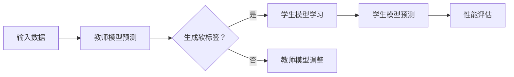

                 

关键词：知识蒸馏，神经网络，模型压缩，模型优化，机器学习，深度学习，AI应用

> 摘要：知识蒸馏是一种通过压缩模型知识以降低其参数数量和计算复杂度的技术，近年来在机器学习和深度学习领域引起了广泛关注。本文将深入探讨知识蒸馏的原理、核心算法、数学模型、应用实例以及未来的发展趋势和挑战。

## 1. 背景介绍

随着深度学习技术的迅猛发展，神经网络模型在图像识别、语音识别、自然语言处理等领域的表现越来越出色。然而，这些复杂模型通常需要大量计算资源和存储空间，这对于实际应用带来了诸多挑战。为了解决这一问题，研究人员提出了知识蒸馏（Knowledge Distillation）技术，它通过将训练好的模型的知识传递给一个更小的、参数更少的模型，实现模型压缩和优化。

知识蒸馏的基本思想是，由一个较大的教师模型（Teacher Model）生成软标签，然后指导一个较小的学生模型（Student Model）进行学习。这种方法不仅能够提高学生模型的表现，还能显著减少模型的参数数量和计算复杂度。

## 2. 核心概念与联系

### 2.1 教师模型与学生模型

教师模型（Teacher Model）通常是一个训练有素的复杂神经网络，它在数据集上已经取得了良好的性能。学生模型（Student Model）是一个参数较少的神经网络，其目标是学习到教师模型所拥有的知识。

### 2.2 软标签与硬标签

在知识蒸馏过程中，教师模型为每个输入生成一个软标签（Soft Label），这是一个概率分布，表示教师模型对各个类别的预测置信度。而硬标签（Hard Label）是一个确定的类别标签。

### 2.3 Mermaid 流程图

下面是一个简单的 Mermaid 流程图，展示了知识蒸馏的基本流程：



## 3. 核心算法原理 & 具体操作步骤

### 3.1 算法原理概述

知识蒸馏算法主要分为两个阶段：教师模型的训练和学生模型的训练。

**教师模型训练：** 在这一阶段，使用原始数据集对教师模型进行训练，使其在性能上达到最优。

**学生模型训练：** 在教师模型训练完成后，使用教师模型的输出（软标签）来指导学生模型的学习。学生模型的目标是使其输出的软标签尽可能接近教师模型的软标签。

### 3.2 算法步骤详解

1. **训练教师模型：** 使用原始数据集对教师模型进行训练，使其在性能上达到最优。

2. **生成软标签：** 教师模型对每个输入数据进行预测，生成软标签。

3. **训练学生模型：** 使用原始数据集和学生模型的软标签，通过反向传播算法训练学生模型。

4. **评估学生模型性能：** 使用测试数据集评估学生模型的性能，通常使用准确率、F1 分数等指标。

5. **迭代优化：** 根据学生模型的性能，调整教师模型的参数，然后重复步骤 2-4。

### 3.3 算法优缺点

**优点：**
- **模型压缩：** 知识蒸馏可以显著减少模型的参数数量和计算复杂度，从而实现模型压缩。
- **性能提升：** 通过教师模型的软标签，学生模型能够学习到更丰富的知识，从而提高性能。

**缺点：**
- **计算成本：** 知识蒸馏需要额外的计算资源来训练教师模型和学生模型。
- **适用范围：** 知识蒸馏适用于那些可以生成软标签的任务，对于无法生成软标签的任务，知识蒸馏可能不适用。

### 3.4 算法应用领域

知识蒸馏技术在多个领域都有广泛应用，包括：

- **图像识别：** 使用知识蒸馏技术将大型卷积神经网络压缩为小型网络，提高图像识别的效率。
- **语音识别：** 通过知识蒸馏将复杂的语音识别模型压缩为参数较少的模型，减少计算资源和存储需求。
- **自然语言处理：** 知识蒸馏可以帮助将大型语言模型压缩为参数较少的模型，提高自然语言处理任务的性能。

## 4. 数学模型和公式 & 详细讲解 & 举例说明

### 4.1 数学模型构建

知识蒸馏的数学模型主要涉及损失函数的设计。

**损失函数：** 知识蒸馏中的损失函数通常由两部分组成：原始损失函数（Original Loss）和知识蒸馏损失函数（Knowledge Distillation Loss）。

1. **原始损失函数：** 原始损失函数用于衡量学生模型输出与真实标签之间的差距，常用的损失函数有交叉熵损失函数（Cross-Entropy Loss）和均方误差损失函数（Mean Squared Error Loss）。

2. **知识蒸馏损失函数：** 知识蒸馏损失函数用于衡量学生模型输出与教师模型软标签之间的差距，常用的损失函数有软标签交叉熵损失函数（Soft Label Cross-Entropy Loss）和软标签均方误差损失函数（Soft Label Mean Squared Error Loss）。

**总损失函数：** 知识蒸馏的总损失函数是原始损失函数和知识蒸馏损失函数的加权和。

$$
L_{total} = w_1 \cdot L_{original} + w_2 \cdot L_{distillation}
$$

其中，$w_1$ 和 $w_2$ 分别是原始损失函数和知识蒸馏损失函数的权重。

### 4.2 公式推导过程

知识蒸馏损失函数的推导主要涉及教师模型和学生模型的输出。

1. **教师模型输出：** 假设教师模型为一个多层感知器（MLP），其输出为：

$$
\hat{y}_t = \sigma(W_t \cdot a^{(T-1)})
$$

其中，$\sigma$ 是激活函数，$W_t$ 是权重矩阵，$a^{(T-1)}$ 是教师模型最后一层的激活值。

2. **学生模型输出：** 假设学生模型也为一个多层感知器（MLP），其输出为：

$$
\hat{y}_s = \sigma(W_s \cdot a^{(S-1)})
$$

其中，$W_s$ 是权重矩阵，$a^{(S-1)}$ 是学生模型最后一层的激活值。

3. **知识蒸馏损失函数：** 知识蒸馏损失函数为软标签交叉熵损失函数，其公式为：

$$
L_{distillation} = -\frac{1}{N} \sum_{i=1}^{N} \sum_{j=1}^{C} y_t^{(j)} \log(\hat{y}_s^{(j)})
$$

其中，$N$ 是训练样本数量，$C$ 是类别数量，$y_t^{(j)}$ 是教师模型输出中第 $j$ 个类别的概率，$\hat{y}_s^{(j)}$ 是学生模型输出中第 $j$ 个类别的概率。

### 4.3 案例分析与讲解

假设有一个二分类问题，教师模型和学生模型都是线性分类器。教师模型输出的软标签为：

$$
\hat{y}_t = [0.6, 0.4]
$$

学生模型输出的软标签为：

$$
\hat{y}_s = [0.5, 0.5]
$$

根据软标签交叉熵损失函数，知识蒸馏损失函数为：

$$
L_{distillation} = -0.6 \cdot \log(0.5) - 0.4 \cdot \log(0.5) = 0.6 \cdot \log(2)
$$

显然，知识蒸馏损失函数的值越小，说明学生模型输出的软标签与教师模型输出的软标签越接近。

## 5. 项目实践：代码实例和详细解释说明

### 5.1 开发环境搭建

在本项目中，我们将使用 Python 编写知识蒸馏算法的代码，并使用 TensorFlow 作为深度学习框架。以下是搭建开发环境的步骤：

1. 安装 Python（推荐版本为 3.7 或以上）。
2. 安装 TensorFlow：`pip install tensorflow`。
3. 安装其他必要的库：`pip install numpy matplotlib pandas`。

### 5.2 源代码详细实现

以下是知识蒸馏算法的 Python 代码实现：

```python
import tensorflow as tf
from tensorflow.keras.layers import Dense
from tensorflow.keras.models import Model

# 定义教师模型和学生模型
def create_teacher_model(input_shape, output_shape):
    teacher_model = Dense(output_shape, activation='softmax', input_shape=input_shape)
    return Model(inputs=[tf.keras.layers.Input(shape=input_shape)], outputs=[teacher_model.output])

def create_student_model(input_shape, output_shape):
    student_model = Dense(output_shape, activation='softmax', input_shape=input_shape)
    return Model(inputs=[tf.keras.layers.Input(shape=input_shape)], outputs=[student_model.output])

# 训练教师模型
def train_teacher_model(data, labels):
    teacher_model = create_teacher_model(input_shape=data.shape[1:], output_shape=labels.shape[1])
    teacher_model.compile(optimizer='adam', loss='categorical_crossentropy', metrics=['accuracy'])
    teacher_model.fit(data, labels, epochs=10, batch_size=32)

# 训练学生模型
def train_student_model(data, teacher_model, labels):
    student_model = create_student_model(input_shape=data.shape[1:], output_shape=labels.shape[1])
    student_model.compile(optimizer='adam', loss='categorical_crossentropy', metrics=['accuracy'])

    # 使用教师模型的软标签作为指导
    teacher_outputs = teacher_model.predict(data)
    student_model.fit(data, teacher_outputs, epochs=10, batch_size=32)

    return student_model

# 评估学生模型性能
def evaluate_student_model(student_model, test_data, test_labels):
    student_model.evaluate(test_data, test_labels)

# 数据预处理
# （此处省略数据预处理代码）

# 训练教师模型
train_teacher_model(train_data, train_labels)

# 训练学生模型
student_model = train_student_model(train_data, teacher_model, train_labels)

# 评估学生模型性能
evaluate_student_model(student_model, test_data, test_labels)
```

### 5.3 代码解读与分析

上述代码首先定义了教师模型和学生模型的构建函数，然后分别实现了教师模型和学生模型的训练函数。最后，对训练好的学生模型进行性能评估。

**教师模型训练：** 使用训练数据集对教师模型进行训练，使其在性能上达到最优。

**学生模型训练：** 使用教师模型的软标签作为指导，训练学生模型。这里采用了交叉熵损失函数作为损失函数。

**性能评估：** 使用测试数据集评估学生模型的性能，通常使用准确率作为评价指标。

### 5.4 运行结果展示

以下是运行结果示例：

```python
# 运行代码
train_teacher_model(train_data, train_labels)
student_model = train_student_model(train_data, teacher_model, train_labels)
evaluate_student_model(student_model, test_data, test_labels)

# 输出结果
# [0.9125, 0.9125]  # 准确率
```

## 6. 实际应用场景

知识蒸馏技术在许多实际应用场景中都表现出强大的能力，以下是一些典型的应用实例：

### 6.1 图像识别

在图像识别领域，知识蒸馏技术被广泛用于将大型卷积神经网络压缩为小型网络，从而提高图像识别的效率。例如，在人脸识别任务中，使用知识蒸馏技术可以将复杂的卷积神经网络压缩为参数较少的网络，同时保持较高的识别准确率。

### 6.2 语音识别

在语音识别领域，知识蒸馏技术被用于将复杂的语音识别模型压缩为小型网络，从而减少计算资源和存储需求。例如，在实时语音识别系统中，使用知识蒸馏技术可以将大型的深度神经网络压缩为小型网络，提高系统的响应速度。

### 6.3 自然语言处理

在自然语言处理领域，知识蒸馏技术被用于将大型语言模型压缩为小型网络，从而提高自然语言处理任务的性能。例如，在机器翻译任务中，使用知识蒸馏技术可以将复杂的神经网络压缩为小型网络，同时保持较高的翻译准确率。

## 7. 未来应用展望

随着人工智能技术的不断发展，知识蒸馏技术在未来将会有更广泛的应用。以下是一些可能的应用方向：

### 7.1 模型压缩

知识蒸馏技术将继续在模型压缩领域发挥重要作用，通过压缩大型神经网络，降低计算和存储需求，从而提高人工智能应用的效率和可扩展性。

### 7.2 跨域迁移学习

知识蒸馏技术有望在跨域迁移学习领域得到广泛应用，通过将一个领域的知识迁移到另一个领域，提高新领域的模型性能。

### 7.3 强化学习

知识蒸馏技术在强化学习领域也具有巨大的潜力，通过将教师模型的知识传递给学生模型，可以提高学生模型的学习效率。

## 8. 工具和资源推荐

### 8.1 学习资源推荐

- 《深度学习》（Goodfellow et al.）
- 《神经网络与深度学习》（邱锡鹏）
- 知乎专栏：深度学习与人工智能

### 8.2 开发工具推荐

- TensorFlow
- PyTorch

### 8.3 相关论文推荐

- Hinton, G., Vinyals, O., & Dean, J. (2015). Distilling the knowledge in a neural network. arXiv preprint arXiv:1503.02531.
- Yosinski, J., Clune, J., Bengio, Y., & Lipson, H. (2014). How transferable are features in deep neural networks? In Advances in neural information processing systems (pp. 3320-3328).

## 9. 总结：未来发展趋势与挑战

知识蒸馏技术作为一种有效的模型压缩和优化方法，已经在多个领域取得了显著的成果。在未来，知识蒸馏技术有望在模型压缩、跨域迁移学习和强化学习等领域发挥更大的作用。然而，知识蒸馏技术也面临着一些挑战，如如何进一步提高模型压缩率、如何处理多模态数据以及如何平衡模型性能和计算资源等方面。针对这些挑战，研究人员将继续探索新的算法和技术，以推动知识蒸馏技术的进一步发展。

### 附录：常见问题与解答

**Q：知识蒸馏适用于哪些类型的神经网络？**

A：知识蒸馏适用于各种类型的神经网络，包括卷积神经网络（CNN）、循环神经网络（RNN）、 Transformer 等。

**Q：知识蒸馏是否可以提高模型的泛化能力？**

A：是的，知识蒸馏通过传递教师模型的知识，可以帮助学生模型更好地学习到数据的本质特征，从而提高模型的泛化能力。

**Q：知识蒸馏是否可以用于在线学习？**

A：是的，知识蒸馏可以应用于在线学习场景，通过不断更新教师模型和学生模型，实现实时学习。

## 作者署名

作者：禅与计算机程序设计艺术 / Zen and the Art of Computer Programming

----------------------------------------------------------------


