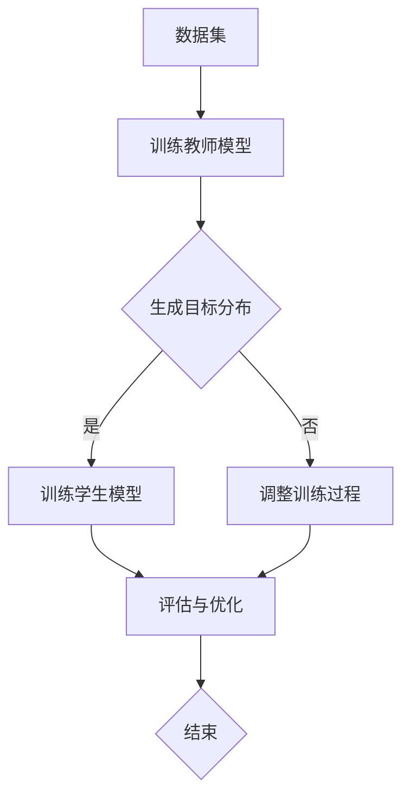

                 

 关键词：知识蒸馏，异构计算，模型压缩，效率优化，性能提升

> 摘要：本文主要探讨了知识蒸馏（Knowledge Distillation）技术在异构计算环境中的应用。知识蒸馏是一种通过将大型复杂模型的知识传递到小型简化模型的过程，旨在降低计算成本，提高计算效率。本文首先介绍了知识蒸馏的基本概念和原理，然后分析了知识蒸馏在异构计算环境中的挑战和优势，最后通过具体案例展示了知识蒸馏在异构计算环境中的实际应用。

## 1. 背景介绍

随着人工智能技术的快速发展，深度学习模型在图像识别、自然语言处理、语音识别等领域取得了显著的成果。然而，这些大型复杂模型往往需要大量的计算资源和时间进行训练和部署，这在一定程度上限制了人工智能技术的实际应用。为了解决这个问题，研究者们提出了模型压缩（Model Compression）技术，通过减小模型的大小、降低模型的计算复杂度，从而实现高效部署。

知识蒸馏（Knowledge Distillation）是模型压缩的一种重要方法，它通过将大型复杂模型的知识传递到小型简化模型，使得简化模型能够保留原模型的性能。知识蒸馏的基本思想是，在训练过程中，除了目标模型需要学习数据分布之外，还将教师模型（通常是大型复杂模型）的输出作为额外的监督信号，引导学生模型（通常是小型简化模型）的学习。通过这种方式，学生模型能够学习到教师模型的知识，从而在保持较高性能的同时，降低模型的复杂度。

异构计算（Heterogeneous Computing）是一种利用不同类型的计算资源（如CPU、GPU、FPGA等）协同工作，以提高计算效率和性能的技术。在异构计算环境中，不同类型的计算资源具有不同的计算能力和能耗特性，因此如何有效地利用这些资源进行模型压缩和部署，成为了一个重要的问题。

本文旨在探讨知识蒸馏在异构计算环境中的应用，分析其面临的挑战和优势，并通过具体案例展示知识蒸馏在实际异构计算环境中的应用效果。

## 2. 核心概念与联系

### 2.1. 知识蒸馏的概念与原理

知识蒸馏是一种通过将教师模型（Teacher Model）的知识传递到学生模型（Student Model）的过程。教师模型通常是大型复杂模型，具有优异的性能，但计算成本较高；学生模型则是小型简化模型，计算成本较低，但性能较差。知识蒸馏的基本过程如下：

1. **训练教师模型**：首先使用大量的数据集对教师模型进行训练，使其达到较高的性能。

2. **生成目标分布**：在训练过程中，教师模型的输出可以作为学生模型的额外目标分布，即除了正常的标签分布外，学生模型还需要学习教师模型的输出分布。

3. **训练学生模型**：使用教师模型生成的目标分布，对学生模型进行训练。学生模型不仅需要学习数据分布，还需要学习教师模型的输出分布，从而保留教师模型的知识。

4. **评估与优化**：通过评估学生模型的性能，调整训练过程，优化学生模型。

### 2.2. 异构计算的概念与原理

异构计算是指利用不同类型的计算资源（如CPU、GPU、FPGA等）协同工作，以提高计算效率和性能的技术。在异构计算环境中，不同类型的计算资源具有不同的计算能力和能耗特性。因此，如何有效地利用这些资源进行模型压缩和部署，是一个重要的问题。

异构计算的基本过程如下：

1. **资源调度**：根据计算任务的特点，将不同的计算任务分配到不同类型的计算资源上，以达到最优的资源利用率。

2. **任务并行化**：将计算任务划分为多个子任务，并分配到不同的计算资源上并行执行。

3. **数据传输**：在计算过程中，需要将数据在不同计算资源之间进行传输，因此如何优化数据传输的效率和成本，也是一个关键问题。

### 2.3. 知识蒸馏与异构计算的联系

知识蒸馏与异构计算有着密切的联系。在异构计算环境中，知识蒸馏技术可以帮助我们有效地利用不同类型的计算资源，实现模型的压缩和优化。

1. **模型压缩**：通过知识蒸馏，可以将大型复杂模型压缩为小型简化模型，从而降低计算成本。

2. **资源调度**：知识蒸馏可以根据不同计算资源的特点，选择合适的教师模型和学生模型，进行资源调度和任务分配，以提高计算效率和性能。

3. **数据传输**：知识蒸馏技术还可以优化数据在不同计算资源之间的传输，降低数据传输的成本和延迟。

下面是一个简单的Mermaid流程图，展示了知识蒸馏在异构计算环境中的应用流程：

## 3. 核心算法原理 & 具体操作步骤

### 3.1. 算法原理概述

知识蒸馏算法的核心思想是将教师模型的输出作为额外的监督信号，引导学生模型的学习。具体来说，知识蒸馏算法包括以下几个步骤：

1. **训练教师模型**：首先使用大量的数据集对教师模型进行训练，使其达到较高的性能。

2. **生成目标分布**：在训练过程中，教师模型的输出可以作为学生模型的额外目标分布，即除了正常的标签分布外，学生模型还需要学习教师模型的输出分布。

3. **训练学生模型**：使用教师模型生成的目标分布，对学生模型进行训练。学生模型不仅需要学习数据分布，还需要学习教师模型的输出分布，从而保留教师模型的知识。

4. **评估与优化**：通过评估学生模型的性能，调整训练过程，优化学生模型。

### 3.2. 算法步骤详解

#### 3.2.1. 训练教师模型

首先，我们需要准备一个大型复杂的数据集，用于训练教师模型。在训练过程中，我们需要关注两个目标：

1. **准确度**：确保教师模型在训练数据上的准确度尽可能高。

2. **泛化能力**：确保教师模型在未见过的数据上也能保持较高的准确度。

为了实现这两个目标，我们通常采用以下策略：

1. **增加训练数据**：使用更多的数据集进行训练，可以提高模型的泛化能力。

2. **数据增强**：通过数据增强（如旋转、缩放、裁剪等）增加训练样本的多样性，从而提高模型的泛化能力。

3. **正则化**：采用正则化方法（如L1、L2正则化）减少模型的过拟合。

4. **优化器**：选择合适的优化器（如Adam、SGD等）和超参数（如学习率、批次大小等），以提高模型的收敛速度和性能。

#### 3.2.2. 生成目标分布

在训练教师模型的过程中，我们需要记录每个样本在教师模型上的输出，这些输出将作为学生模型的目标分布。具体来说，我们可以采用以下方法生成目标分布：

1. **分类输出**：对于分类任务，教师模型的输出是每个类别的概率分布。我们可以将这些概率分布作为目标分布。

2. **回归输出**：对于回归任务，教师模型的输出是每个特征的预测值。我们可以将这些预测值作为目标分布。

3. **注意力机制**：对于某些复杂的任务，如机器翻译、文本生成等，教师模型的输出可能包含了丰富的上下文信息。我们可以利用注意力机制提取关键信息，作为目标分布。

#### 3.2.3. 训练学生模型

使用生成的目标分布，对学生模型进行训练。学生模型的训练过程可以分为以下几个步骤：

1. **初始化学生模型**：通常，我们使用较小的初始化学习率，初始化学生模型的权重。

2. **前向传播**：输入数据，通过学生模型进行前向传播，得到预测输出。

3. **计算损失**：计算学生模型预测输出与目标分布之间的损失，通常使用交叉熵损失。

4. **反向传播**：使用损失函数和梯度下降算法，更新学生模型的权重。

5. **迭代优化**：重复执行前向传播、计算损失和反向传播的过程，直到模型达到预设的迭代次数或性能指标。

#### 3.2.4. 评估与优化

在训练过程中，我们需要定期评估学生模型的性能，并根据评估结果调整训练过程。具体来说，我们可以采用以下方法：

1. **验证集评估**：在训练过程中，使用验证集定期评估学生模型的性能，以避免过拟合。

2. **调整超参数**：根据验证集的性能，调整学习率、批次大小等超参数，以提高模型性能。

3. **增加数据增强**：如果验证集的性能没有达到预期，可以尝试增加数据增强策略，以提高模型的泛化能力。

4. **调整模型结构**：如果验证集的性能仍然不佳，可以考虑调整模型结构，如增加层数、调整激活函数等，以提高模型性能。

### 3.3. 算法优缺点

#### 3.3.1. 优点

1. **提高模型性能**：通过知识蒸馏，学生模型可以学习到教师模型的知识，从而在保持较高性能的同时，降低模型的复杂度。

2. **降低计算成本**：知识蒸馏可以将大型复杂模型压缩为小型简化模型，从而降低计算成本。

3. **提高计算效率**：在异构计算环境中，知识蒸馏可以根据不同计算资源的特点，选择合适的教师模型和学生模型，进行资源调度和任务分配，以提高计算效率和性能。

#### 3.3.2. 缺点

1. **训练时间较长**：知识蒸馏需要同时训练教师模型和学生模型，因此训练时间较长。

2. **对教师模型的要求较高**：知识蒸馏的效果很大程度上取决于教师模型的性能，如果教师模型性能较差，知识蒸馏的效果可能不佳。

### 3.4. 算法应用领域

知识蒸馏技术具有广泛的应用领域，以下是其中几个典型的应用场景：

1. **图像识别**：在图像识别任务中，知识蒸馏可以将大型卷积神经网络压缩为小型网络，从而实现高效部署。

2. **自然语言处理**：在自然语言处理任务中，知识蒸馏可以将大型语言模型压缩为小型模型，从而实现快速推理和部署。

3. **语音识别**：在语音识别任务中，知识蒸馏可以将大型语音模型压缩为小型模型，从而实现实时语音识别。

4. **计算机视觉**：在计算机视觉任务中，知识蒸馏可以将大型视觉模型压缩为小型模型，从而实现高效视频处理和实时监控。

## 4. 数学模型和公式 & 详细讲解 & 举例说明

### 4.1. 数学模型构建

知识蒸馏的数学模型可以表示为以下形式：

$$
L = L_{\text{CE}} + \lambda L_{\text{KD}}
$$

其中，$L$ 是总的损失函数，$L_{\text{CE}}$ 是交叉熵损失函数，$L_{\text{KD}}$ 是知识蒸馏损失函数，$\lambda$ 是调节参数。

#### 4.1.1. 交叉熵损失函数

交叉熵损失函数用于衡量预测分布 $P_{\hat{y}}$ 和真实分布 $P_{y}$ 之间的差异，可以表示为：

$$
L_{\text{CE}} = -\sum_{i=1}^{N} y_i \log P_{\hat{y}}(i)
$$

其中，$N$ 是样本数量，$y_i$ 是第 $i$ 个样本的真实标签，$P_{\hat{y}}(i)$ 是第 $i$ 个样本的预测概率。

#### 4.1.2. 知识蒸馏损失函数

知识蒸馏损失函数用于衡量学生模型的预测分布 $Q_{\hat{y}}$ 和教师模型的输出分布 $T_{\hat{y}}$ 之间的差异，可以表示为：

$$
L_{\text{KD}} = -\sum_{i=1}^{N} \sum_{j=1}^{C} T_{\hat{y}}(j) \log Q_{\hat{y}}(j)
$$

其中，$C$ 是类别数量，$T_{\hat{y}}(j)$ 是第 $i$ 个样本在第 $j$ 个类别上的教师模型输出概率，$Q_{\hat{y}}(j)$ 是第 $i$ 个样本在第 $j$ 个类别上的学生模型输出概率。

### 4.2. 公式推导过程

知识蒸馏的公式推导过程如下：

1. **目标分布 $T_{\hat{y}}$**：

   目标分布 $T_{\hat{y}}$ 是教师模型在训练数据上的输出。假设教师模型为 $f_{\theta_1}$，训练数据集为 $D$，则目标分布可以表示为：

   $$
   T_{\hat{y}} = \frac{1}{|\

