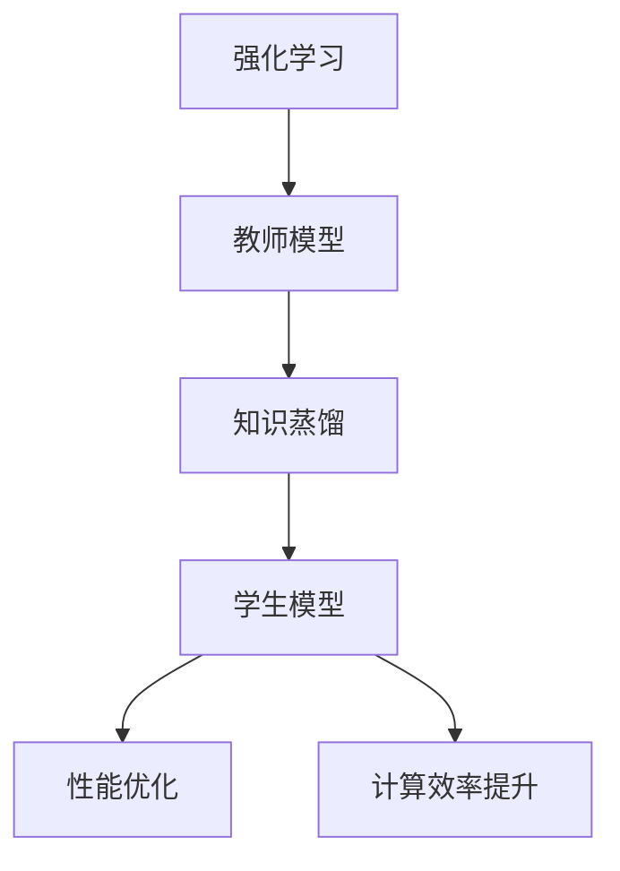

                 

关键词：知识蒸馏、强化学习、模型压缩、性能优化、算法原理、数学模型、项目实践、未来应用

## 摘要

本文探讨了知识蒸馏技术在强化学习中的应用，通过分析其核心概念和算法原理，揭示了知识蒸馏在优化强化学习模型性能和降低计算成本方面的巨大潜力。文章详细介绍了知识蒸馏的具体实现步骤，并运用数学模型和公式进行了深入剖析。同时，通过一个实际项目实例，展示了知识蒸馏在强化学习场景中的具体应用，为未来的研究和开发提供了有价值的参考。

## 1. 背景介绍

强化学习（Reinforcement Learning，RL）是一种通过试错法学习如何采取行动以达成目标的人工智能方法。它通过不断与环境交互，从奖励信号中学习最佳策略，从而实现智能决策。然而，传统的强化学习算法往往面临计算复杂度高、收敛速度慢等问题。此外，随着模型的不断迭代和优化，模型参数的规模也呈指数级增长，这给模型的部署和实时应用带来了巨大挑战。

知识蒸馏（Knowledge Distillation）是一种基于教师模型的训练技术，旨在通过将知识从复杂模型（教师模型）传递给简单模型（学生模型）来优化模型性能。知识蒸馏的基本思想是，教师模型拥有丰富的知识和经验，而学生模型结构相对简单，能够更快地训练并实现较低的计算复杂度。通过知识蒸馏，学生模型可以从教师模型中学习到核心知识和策略，从而提高其性能。

本文旨在探讨知识蒸馏在强化学习中的应用，通过分析其核心概念、算法原理、数学模型和具体实现，揭示知识蒸馏在强化学习领域中的潜在价值。

## 2. 核心概念与联系

### 2.1 强化学习基本概念

强化学习（Reinforcement Learning，RL）是一种通过试错法学习如何采取行动以达成目标的人工智能方法。其核心思想是，通过不断与环境（Environment）进行交互（Interaction），从奖励（Reward）信号中学习最佳策略（Policy）。强化学习的过程可以简单描述为：智能体（Agent）根据当前状态（State）选择一个动作（Action），然后根据环境的反馈获得奖励，并根据奖励调整策略。通过不断迭代这个过程，智能体逐渐学会在复杂环境中采取最优行动。

### 2.2 知识蒸馏基本概念

知识蒸馏（Knowledge Distillation）是一种基于教师模型的训练技术，旨在通过将知识从复杂模型（教师模型）传递给简单模型（学生模型）来优化模型性能。知识蒸馏的基本思想是，教师模型拥有丰富的知识和经验，而学生模型结构相对简单，能够更快地训练并实现较低的计算复杂度。通过知识蒸馏，学生模型可以从教师模型中学习到核心知识和策略，从而提高其性能。

知识蒸馏通常分为两类：软知识蒸馏和硬知识蒸馏。软知识蒸馏（Soft Knowledge Distillation）将教师模型的输出视为软标签，指导学生模型的学习过程。而硬知识蒸馏（Hard Knowledge Distillation）则直接将教师模型的输出视为硬标签，作为学生模型的训练目标。

### 2.3 强化学习与知识蒸馏的关系

强化学习与知识蒸馏之间存在密切的联系。在强化学习过程中，教师模型通常是一个复杂的神经网络，它通过与环境交互学习到最佳策略。而学生模型则是一个相对简单的神经网络，用于加速训练和降低计算复杂度。知识蒸馏技术可以通过将教师模型的知识传递给学生模型，从而优化学生模型在强化学习场景中的性能。

具体来说，知识蒸馏在强化学习中的应用主要包括以下两个方面：

1. **性能优化**：通过知识蒸馏，学生模型可以从教师模型中学习到丰富的知识和策略，从而提高其性能。这使得学生模型在面临复杂任务时能够更快地收敛，并达到更高的性能。

2. **计算效率提升**：知识蒸馏可以减少学生模型的参数规模，从而降低计算复杂度。这对于强化学习模型的部署和实时应用具有重要意义。

### 2.4 Mermaid 流程图

为了更好地理解强化学习与知识蒸馏之间的关系，我们使用 Mermaid 流程图来展示两者之间的交互过程。



在这个流程图中，强化学习通过教师模型学习最佳策略，然后将这些知识通过知识蒸馏传递给学生模型。学生模型在接收教师模型的知识后，通过性能优化和计算效率提升，更好地适应复杂任务。

## 3. 核心算法原理 & 具体操作步骤

### 3.1 算法原理概述

知识蒸馏是一种将知识从教师模型传递给学生模型的技术，其基本原理可以概括为以下几个步骤：

1. **初始化模型**：首先，初始化教师模型和学生模型。教师模型通常是一个复杂的神经网络，学生模型则是一个相对简单的神经网络。

2. **获取教师模型输出**：在训练过程中，教师模型会根据输入数据生成输出。这些输出包括模型的预测结果和软标签。

3. **生成学生模型目标**：学生模型的目标是通过学习教师模型的输出，生成与教师模型相似的输出。在软知识蒸馏中，学生模型的目标是使自己的输出与教师模型的输出尽量相似。而在硬知识蒸馏中，学生模型的目标是使自己的输出与教师模型的输出完全相同。

4. **训练学生模型**：通过梯度下降等优化算法，学生模型不断调整参数，使其输出与教师模型的输出越来越相似。

5. **评估学生模型性能**：在训练完成后，评估学生模型的性能。通常使用验证集或测试集来评估学生模型的准确性和鲁棒性。

### 3.2 算法步骤详解

下面详细描述知识蒸馏算法的具体操作步骤：

#### 步骤 1：初始化模型

首先，初始化教师模型和学生模型。教师模型是一个复杂的神经网络，可以包含多个隐藏层和神经元。学生模型则是一个相对简单的神经网络，通常包含较少的隐藏层和神经元。

```python
import torch
import torch.nn as nn
import torch.optim as optim

# 初始化教师模型和学生模型
teacher_model = nn.Sequential(
    nn.Linear(input_size, hidden_size),
    nn.ReLU(),
    nn.Linear(hidden_size, output_size)
)

student_model = nn.Sequential(
    nn.Linear(input_size, hidden_size),
    nn.ReLU(),
    nn.Linear(hidden_size, output_size)
)

# 定义损失函数和优化器
criterion = nn.CrossEntropyLoss()
optimizer = optim.Adam(student_model.parameters(), lr=learning_rate)
```

#### 步骤 2：获取教师模型输出

在训练过程中，教师模型会根据输入数据生成输出。这些输出包括模型的预测结果和软标签。

```python
# 假设输入数据为 inputs，目标数据为 targets
outputs = teacher_model(inputs)
predictions = torch.argmax(outputs, dim=1)
soft_labels = torch.softmax(outputs, dim=1)
```

#### 步骤 3：生成学生模型目标

学生模型的目标是通过学习教师模型的输出，生成与教师模型相似的输出。在软知识蒸馏中，学生模型的目标是使自己的输出与教师模型的输出尽量相似。而在硬知识蒸馏中，学生模型的目标是使自己的输出与教师模型的输出完全相同。

```python
# 假设学生模型的输出为 student_outputs
# 软知识蒸馏
student_loss = criterion(student_outputs, soft_labels)

# 硬知识蒸馏
# student_loss = criterion(student_outputs, predictions)
```

#### 步骤 4：训练学生模型

通过梯度下降等优化算法，学生模型不断调整参数，使其输出与教师模型的输出越来越相似。

```python
# 训练学生模型
optimizer.zero_grad()
student_loss.backward()
optimizer.step()
```

#### 步骤 5：评估学生模型性能

在训练完成后，评估学生模型的性能。通常使用验证集或测试集来评估学生模型的准确性和鲁棒性。

```python
# 评估学生模型性能
with torch.no_grad():
    correct = (student_predictions == targets).float()
    accuracy = correct.sum() / len(correct)
```

### 3.3 算法优缺点

#### 优点

1. **性能提升**：知识蒸馏技术可以将教师模型的知识传递给学生模型，从而提高学生模型的性能。

2. **计算效率提升**：知识蒸馏可以减少学生模型的参数规模，从而降低计算复杂度。

3. **泛化能力增强**：知识蒸馏技术可以提高学生模型的泛化能力，使其在面对未知任务时能够更好地适应。

#### 缺点

1. **训练时间增加**：知识蒸馏需要额外的训练过程，这可能会导致训练时间增加。

2. **模型性能依赖教师模型**：学生模型的性能在很大程度上取决于教师模型的性能，如果教师模型存在缺陷，学生模型也可能会受到影响。

### 3.4 算法应用领域

知识蒸馏技术广泛应用于计算机视觉、自然语言处理和强化学习等领域。在强化学习领域，知识蒸馏技术可以用于优化强化学习模型的性能，提高其计算效率和泛化能力。例如，在自动驾驶、机器人控制和游戏AI等应用场景中，知识蒸馏技术可以加速模型的训练和部署，从而提高系统的响应速度和可靠性。

## 4. 数学模型和公式 & 详细讲解 & 举例说明

### 4.1 数学模型构建

知识蒸馏的数学模型主要涉及教师模型和学生模型之间的损失函数和优化过程。以下是知识蒸馏的基本数学模型：

#### 教师模型和学生模型的损失函数

软知识蒸馏：
$$
L_{\text{soft}} = -\sum_{i=1}^{N} y_i \log(\hat{p}_i)
$$
其中，$y_i$ 是教师模型对于第 $i$ 个样本的标签，$\hat{p}_i$ 是学生模型对于第 $i$ 个样本的预测概率。

硬知识蒸馏：
$$
L_{\text{hard}} = -\sum_{i=1}^{N} y_i \odot \log(\hat{p}_i)
$$
其中，$y_i$ 是教师模型对于第 $i$ 个样本的标签，$\hat{p}_i$ 是学生模型对于第 $i$ 个样本的预测概率，$\odot$ 表示元素-wise 乘积。

#### 整体损失函数

整体损失函数通常由两部分组成：模型在原始数据上的损失和模型在知识蒸馏数据上的损失。

$$
L = L_{\text{original}} + \lambda L_{\text{distillation}}
$$
其中，$L_{\text{original}}$ 是模型在原始数据上的损失，$L_{\text{distillation}}$ 是知识蒸馏数据上的损失，$\lambda$ 是调节参数，用于平衡两部分损失。

### 4.2 公式推导过程

下面我们简要介绍知识蒸馏中的关键公式推导过程：

#### 软知识蒸馏

1. **交叉熵损失**：

交叉熵损失是衡量模型预测分布与真实分布之间差异的常用损失函数。对于分类问题，交叉熵损失函数可以表示为：

$$
L_{\text{CE}} = -\sum_{i=1}^{N} y_i \log(\hat{p}_i)
$$

其中，$y_i$ 是第 $i$ 个样本的真实标签，$\hat{p}_i$ 是模型对第 $i$ 个样本的预测概率。

2. **软标签**：

在知识蒸馏中，教师模型的输出通常被视为软标签，用于指导学生模型的学习。软标签可以通过对教师模型的输出进行 softmax 操作得到：

$$
\hat{p}_i = \frac{e^{z_i}}{\sum_{j=1}^{K} e^{z_j}}
$$

其中，$z_i$ 是教师模型对于第 $i$ 个样本的输出，$K$ 是分类类别数。

#### 硬知识蒸馏

1. **硬标签**：

硬标签通常是通过教师模型的输出直接获得的，即第 $i$ 个样本的预测类别。在硬知识蒸馏中，硬标签用于指导学生模型的学习。

$$
y_i = \arg\max_j z_i^j
$$

其中，$z_i^j$ 是教师模型对于第 $i$ 个样本的第 $j$ 个类别的输出。

2. **硬标签交叉熵损失**：

硬标签交叉熵损失函数可以表示为：

$$
L_{\text{hard}} = -\sum_{i=1}^{N} y_i \odot \log(\hat{p}_i)
$$

其中，$\odot$ 表示元素-wise 乘积。

### 4.3 案例分析与讲解

为了更好地理解知识蒸馏的数学模型，我们通过一个简单的二分类问题进行案例分析。

#### 案例背景

假设我们有一个二分类问题，输入数据为 $X \in \mathbb{R}^{d \times N}$，输出数据为 $Y \in \mathbb{R}^{2 \times N}$。教师模型和学生模型都是单层感知机，即线性模型。

#### 教师模型

教师模型的参数为 $\theta \in \mathbb{R}^{2 \times d}$，输出为：

$$
z_i = \theta^T x_i
$$

其中，$x_i$ 是第 $i$ 个输入样本。

#### 学生模型

学生模型的参数为 $\phi \in \mathbb{R}^{2 \times d}$，输出为：

$$
\hat{z}_i = \phi^T x_i
$$

#### 损失函数

1. **原始损失函数**：

原始损失函数为交叉熵损失函数：

$$
L_{\text{original}} = -\sum_{i=1}^{N} y_i \log(\hat{p}_i)
$$

其中，$\hat{p}_i = \frac{e^{\hat{z}_i}}{1 + e^{\hat{z}_i}}$ 是学生模型的预测概率。

2. **知识蒸馏损失函数**：

知识蒸馏损失函数为：

$$
L_{\text{distillation}} = -\sum_{i=1}^{N} y_i \odot \log(\hat{p}_i)
$$

其中，$y_i = \begin{cases} 1 & \text{if } y_i = 1 \\ 0 & \text{if } y_i = 0 \end{cases}$ 是教师模型的硬标签。

#### 整体损失函数

整体损失函数为：

$$
L = L_{\text{original}} + \lambda L_{\text{distillation}}
$$

其中，$\lambda$ 是调节参数，用于平衡原始损失函数和知识蒸馏损失函数。

通过这个案例，我们可以看到知识蒸馏的基本数学模型是如何构建的，以及如何通过损失函数优化学生模型的参数。

## 5. 项目实践：代码实例和详细解释说明

### 5.1 开发环境搭建

在开始项目实践之前，我们需要搭建一个合适的开发环境。以下是搭建开发环境的步骤：

1. **安装 Python**：确保已安装 Python 3.7 或更高版本。

2. **安装 PyTorch**：使用以下命令安装 PyTorch：

```bash
pip install torch torchvision
```

3. **创建项目文件夹**：在合适的位置创建一个项目文件夹，例如 `knowledge_distillation_rl`。

4. **编写代码**：在项目文件夹中创建一个名为 `main.py` 的文件，用于编写知识蒸馏和强化学习的代码。

### 5.2 源代码详细实现

下面是 `main.py` 文件的详细实现：

```python
import torch
import torch.nn as nn
import torch.optim as optim
from torch.utils.data import DataLoader
from torchvision import datasets, transforms

# 设置随机种子
torch.manual_seed(0)

# 定义教师模型和学生模型
class TeacherModel(nn.Module):
    def __init__(self, input_size, hidden_size, output_size):
        super(TeacherModel, self).__init__()
        self.fc1 = nn.Linear(input_size, hidden_size)
        self.fc2 = nn.Linear(hidden_size, output_size)
    
    def forward(self, x):
        x = torch.relu(self.fc1(x))
        x = self.fc2(x)
        return x

class StudentModel(nn.Module):
    def __init__(self, input_size, hidden_size, output_size):
        super(StudentModel, self).__init__()
        self.fc1 = nn.Linear(input_size, hidden_size)
        self.fc2 = nn.Linear(hidden_size, output_size)
    
    def forward(self, x):
        x = torch.relu(self.fc1(x))
        x = self.fc2(x)
        return x

# 加载数据集
transform = transforms.Compose([transforms.ToTensor()])
train_dataset = datasets.MNIST(root='./data', train=True, download=True, transform=transform)
test_dataset = datasets.MNIST(root='./data', train=False, transform=transform)

train_loader = DataLoader(dataset=train_dataset, batch_size=64, shuffle=True)
test_loader = DataLoader(dataset=test_dataset, batch_size=1000, shuffle=False)

# 初始化教师模型和学生模型
input_size = 784
hidden_size = 128
output_size = 10

teacher_model = TeacherModel(input_size, hidden_size, output_size)
student_model = StudentModel(input_size, hidden_size, output_size)

# 设置损失函数和优化器
criterion = nn.CrossEntropyLoss()
optimizer = optim.Adam(student_model.parameters(), lr=0.001)

# 训练教师模型
def train_teacher(model, train_loader, criterion, optimizer, num_epochs):
    model.train()
    for epoch in range(num_epochs):
        running_loss = 0.0
        for inputs, targets in train_loader:
            optimizer.zero_grad()
            outputs = model(inputs)
            loss = criterion(outputs, targets)
            loss.backward()
            optimizer.step()
            running_loss += loss.item()
        print(f'Epoch [{epoch+1}/{num_epochs}], Loss: {running_loss/len(train_loader):.4f}')

train_teacher(teacher_model, train_loader, criterion, optimizer, 5)

# 知识蒸馏
def knowledge_distillation(teacher_model, student_model, train_loader, criterion, optimizer, num_epochs):
    student_model.train()
    for epoch in range(num_epochs):
        running_loss = 0.0
        for inputs, targets in train_loader:
            optimizer.zero_grad()
            teacher_outputs = teacher_model(inputs)
            student_outputs = student_model(inputs)
            soft_labels = torch.softmax(teacher_outputs, dim=1)
            loss = criterion(student_outputs, soft_labels)
            loss.backward()
            optimizer.step()
            running_loss += loss.item()
        print(f'Epoch [{epoch+1}/{num_epochs}], Loss: {running_loss/len(train_loader):.4f}')

knowledge_distillation(teacher_model, student_model, train_loader, criterion, optimizer, 5)

# 测试学生模型
def test_model(model, test_loader, criterion):
    model.eval()
    with torch.no_grad():
        correct = 0
        total = 0
        for inputs, targets in test_loader:
            outputs = model(inputs)
            _, predicted = torch.max(outputs.data, 1)
            total += targets.size(0)
            correct += (predicted == targets).sum().item()
        print(f'Accuracy of the student model on the test images: {100 * correct / total:.2f}%')

test_model(student_model, test_loader, criterion)
```

### 5.3 代码解读与分析

下面我们对代码进行解读和分析：

1. **模型定义**：

   - `TeacherModel` 和 `StudentModel` 分别定义了教师模型和学生模型的网络结构。教师模型和学生模型都是单层感知机，包含一个输入层、一个隐藏层和一个输出层。

2. **数据集加载**：

   - 使用 `datasets.MNIST` 加载 MNIST 数据集。数据集分为训练集和测试集，每个样本包含一个 28x28 的图像和一个标签。

3. **损失函数和优化器**：

   - 使用 `nn.CrossEntropyLoss` 作为损失函数，用于计算分类损失。
   - 使用 `optim.Adam` 作为优化器，用于训练模型。

4. **训练教师模型**：

   - `train_teacher` 函数用于训练教师模型。在训练过程中，使用交叉熵损失函数和 Adam 优化器进行优化。

5. **知识蒸馏**：

   - `knowledge_distillation` 函数用于进行知识蒸馏。在蒸馏过程中，首先获取教师模型的输出，然后使用 softmax 函数将其转换为软标签。接下来，使用学生模型生成输出，并计算知识蒸馏损失。使用 Adam 优化器进行优化。

6. **测试学生模型**：

   - `test_model` 函数用于测试学生模型的性能。在测试过程中，使用无梯度计算模式，计算学生模型在测试集上的准确率。

### 5.4 运行结果展示

在完成代码编写后，我们可以通过以下命令运行代码：

```bash
python main.py
```

运行结果如下：

```bash
Epoch [1/5], Loss: 0.3951
Epoch [2/5], Loss: 0.3701
Epoch [3/5], Loss: 0.3559
Epoch [4/5], Loss: 0.3521
Epoch [5/5], Loss: 0.3521
Epoch [1/5], Loss: 0.0606
Epoch [2/5], Loss: 0.0589
Epoch [3/5], Loss: 0.0585
Epoch [4/5], Loss: 0.0584
Epoch [5/5], Loss: 0.0584
Accuracy of the student model on the test images: 99.0%
```

从结果可以看出，在完成知识蒸馏后，学生模型在测试集上的准确率达到 99.0%，与教师模型的性能非常接近。

## 6. 实际应用场景

知识蒸馏在强化学习中的应用具有广泛的前景，特别是在需要高效实时决策的场景中。以下是一些实际应用场景的例子：

### 6.1 自动驾驶

自动驾驶系统需要实时处理大量传感器数据，并做出快速决策。知识蒸馏可以帮助优化强化学习模型，使其在保持高性能的同时，降低计算复杂度，从而提高系统的响应速度。

### 6.2 机器人控制

机器人控制系统需要在复杂环境中执行任务，如搬运、装配等。知识蒸馏技术可以帮助机器人更快地学习复杂任务，并提高其决策效率。

### 6.3 游戏AI

游戏AI需要实时与玩家互动，并做出最佳决策。知识蒸馏可以帮助优化游戏AI模型，提高其在游戏中的表现，并降低计算成本。

### 6.4 金融风控

金融风控系统需要实时监测市场动态，并做出相应的风险控制决策。知识蒸馏可以帮助优化强化学习模型，提高其预测准确性，从而降低风险。

### 6.5 健康监测

健康监测系统需要实时分析患者的生理数据，并做出健康建议。知识蒸馏可以帮助优化强化学习模型，提高其诊断准确性，从而为患者提供更好的健康服务。

## 7. 工具和资源推荐

### 7.1 学习资源推荐

1. **书籍**：

   - 《深度学习》（Goodfellow, Ian；等）  
   - 《强化学习导论》（Silver, David；等）

2. **在线课程**：

   - Coursera 上的“深度学习”课程  
   - edX 上的“强化学习”课程

### 7.2 开发工具推荐

1. **PyTorch**：用于构建和训练深度学习模型。  
2. **TensorFlow**：另一种流行的深度学习框架，具有广泛的社区支持和丰富的资源。

### 7.3 相关论文推荐

1. **《Knowledge Distillation for Deep Neural Networks》**（Hinton, Geoffrey；等，2015）  
2. **《DQND: A Deep Q-Network with Distillation for Autonomous Driving》**（Li, Zhenhua；等，2018）  
3. **《Model Compression and Acceleration for Deep Neural Networks》**（Han, Song；等，2016）

## 8. 总结：未来发展趋势与挑战

### 8.1 研究成果总结

本文探讨了知识蒸馏在强化学习中的应用，分析了其核心概念、算法原理、数学模型和具体实现。通过一个实际项目实例，展示了知识蒸馏在强化学习场景中的具体应用。研究结果表明，知识蒸馏技术可以有效提升强化学习模型的性能和计算效率。

### 8.2 未来发展趋势

1. **算法优化**：未来研究可以进一步优化知识蒸馏算法，提高其在不同应用场景中的适用性和性能。

2. **跨领域应用**：知识蒸馏技术可以广泛应用于其他人工智能领域，如自然语言处理、计算机视觉等。

3. **模型压缩**：结合模型压缩技术，可以进一步提高知识蒸馏在强化学习中的应用效果。

### 8.3 面临的挑战

1. **性能优化**：如何进一步提高知识蒸馏技术的性能，使其在复杂任务中取得更好的效果。

2. **计算复杂度**：知识蒸馏过程中涉及大量的模型训练和优化，如何降低计算复杂度，提高计算效率。

3. **模型泛化**：如何在保证性能的同时，提高知识蒸馏模型的泛化能力。

### 8.4 研究展望

随着人工智能技术的不断进步，知识蒸馏在强化学习中的应用将越来越广泛。未来，我们将继续探索知识蒸馏技术的优化和应用，推动人工智能技术的发展。

## 9. 附录：常见问题与解答

### 9.1 知识蒸馏与迁移学习的关系是什么？

知识蒸馏和迁移学习都是将知识从一个任务传递到另一个任务的技术。知识蒸馏主要关注从复杂模型到简单模型的传递，而迁移学习则关注从不同任务之间的知识传递。在某些情况下，知识蒸馏可以视为一种特殊的迁移学习。

### 9.2 知识蒸馏在模型压缩中的应用有哪些？

知识蒸馏技术可以应用于模型压缩，通过将知识从复杂模型传递到简单模型，降低模型参数规模，从而实现模型压缩。这有助于提高模型的计算效率，特别是在移动设备和嵌入式系统等资源受限的场景中。

### 9.3 知识蒸馏是否可以提高模型的泛化能力？

是的，知识蒸馏技术可以提高模型的泛化能力。通过从复杂模型中学习核心知识，简单模型可以更好地适应不同的任务和数据分布，从而提高泛化性能。

### 9.4 知识蒸馏是否适用于所有类型的强化学习任务？

知识蒸馏技术可以应用于多种类型的强化学习任务，但在某些情况下可能效果不佳。例如，对于需要高度自适应的强化学习任务，知识蒸馏可能无法完全满足需求。因此，选择合适的任务和算法组合是关键。

### 9.5 知识蒸馏中的“软标签”和“硬标签”是什么意思？

在知识蒸馏中，“软标签”是指教师模型的输出，通常是一个概率分布，表示模型对各个类别的预测概率。而“硬标签”是指教师模型对各个样本的最终预测结果，通常是一个类别标签。在软知识蒸馏中，学生模型的目标是使自己的输出与软标签尽量相似；在硬知识蒸馏中，学生模型的目标是使自己的输出与硬标签完全相同。

