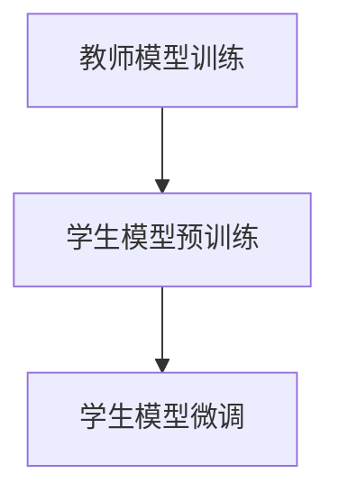

                 

关键词：知识蒸馏，模型鲁棒性，深度学习，训练效率，模型优化，神经网络

> 摘要：本文旨在探讨知识蒸馏（Diet of Knowledge）技术如何在提升深度学习模型鲁棒性方面发挥关键作用。通过对知识蒸馏的核心概念、算法原理、数学模型以及实际应用场景的详细分析，本文揭示了知识蒸馏在提高模型稳健性方面的潜力，并对其未来发展趋势和挑战进行了展望。

## 1. 背景介绍

随着深度学习技术的飞速发展，神经网络模型在图像识别、自然语言处理等领域取得了令人瞩目的成果。然而，深度学习模型往往面临着一系列挑战，包括过拟合、数据分布变化导致的模型性能波动以及在高维数据上的计算复杂度等问题。这些问题严重限制了模型的实际应用效果。为了应对这些挑战，研究者们提出了知识蒸馏（Diet of Knowledge）技术。

知识蒸馏是一种模型优化技术，旨在通过训练一个较小的“学生模型”来复制一个较大的“教师模型”的知识和特性。学生模型通常具有较少的参数和更简单的结构，因此在计算复杂度上具有优势，同时也能够提高模型的鲁棒性。

## 2. 核心概念与联系

知识蒸馏涉及两个模型：教师模型和学生模型。教师模型通常是一个复杂的深度学习模型，其具有较多的参数和较高的计算复杂度，而学生模型则是一个简化的模型，通常具有较少的参数和更简单的结构。

### 2.1 教师模型

教师模型负责生成知识，通常是通过在训练数据集上进行训练得到的。教师模型在训练过程中学习到数据的高层次特征和模式，这些知识将被传递给学生模型。

### 2.2 学生模型

学生模型是知识蒸馏的目标，其目的是通过学习教师模型的知识来提升自己的性能。学生模型的训练通常包括两个阶段：预训练和微调。在预训练阶段，学生模型学习教师模型生成的软标签；在微调阶段，学生模型继续调整参数以优化其性能。

### 2.3 知识蒸馏流程

知识蒸馏的过程可以分为以下几个步骤：

1. **教师模型训练**：使用训练数据集训练教师模型，得到模型的参数和软标签。
2. **学生模型预训练**：使用教师模型的软标签对学生模型进行预训练，使其能够学习到教师模型的知识。
3. **学生模型微调**：在预训练的基础上，使用教师模型的硬标签对学生模型进行微调，以优化其性能。

### 2.4 Mermaid 流程图



## 3. 核心算法原理 & 具体操作步骤

### 3.1 算法原理概述

知识蒸馏的核心思想是通过训练一个较小的学生模型来复制一个较大的教师模型的知识和特性。在这个过程中，学生模型首先学习教师模型生成的软标签，然后在微调阶段通过硬标签进一步优化性能。

### 3.2 算法步骤详解

1. **教师模型训练**：使用训练数据集对教师模型进行训练，得到模型的参数和软标签。软标签通常是通过模型输出的概率分布得到的。
2. **学生模型预训练**：使用教师模型的软标签对学生模型进行预训练。预训练的目标是让学生模型学习到教师模型的知识。
3. **学生模型微调**：在预训练的基础上，使用教师模型的硬标签对学生模型进行微调。微调的目标是优化学生模型的性能，使其在测试数据集上具有更好的表现。

### 3.3 算法优缺点

**优点**：
- 提高模型鲁棒性：知识蒸馏能够提高模型在未知数据集上的表现，从而增强模型的鲁棒性。
- 降低计算复杂度：学生模型通常具有较少的参数和更简单的结构，因此能够降低计算复杂度。
- 提高训练效率：知识蒸馏能够加快模型的训练过程，从而提高训练效率。

**缺点**：
- 需要较大的训练数据集：知识蒸馏需要较大的训练数据集来训练教师模型，这对于一些数据稀缺的领域来说可能是一个挑战。
- 需要较长的训练时间：知识蒸馏的训练过程通常需要较长的训练时间，这可能会影响模型的部署和应用。

### 3.4 算法应用领域

知识蒸馏技术可以应用于多个领域，包括但不限于：

- 图像识别：通过知识蒸馏可以提高图像识别模型的鲁棒性，从而提高模型在实际应用中的表现。
- 自然语言处理：知识蒸馏可以帮助自然语言处理模型学习到更多的语言知识，从而提高模型的性能。
- 语音识别：知识蒸馏可以提高语音识别模型的鲁棒性，从而提高模型在噪声环境下的表现。

## 4. 数学模型和公式 & 详细讲解 & 举例说明

### 4.1 数学模型构建

知识蒸馏的数学模型可以表示为：

$$
L(D, S) = \frac{1}{N} \sum_{i=1}^{N} \left( -\sum_{c=1}^{C} y_i(c) \log \hat{y}_i(c) + \alpha \sum_{c=1}^{C} \log \hat{s}_i(c) \right)
$$

其中，$D$ 表示训练数据集，$S$ 表示学生模型，$N$ 表示数据集中的样本数量，$y_i$ 表示教师模型对于样本 $i$ 的真实标签，$\hat{y}_i$ 表示学生模型对于样本 $i$ 的预测标签，$\hat{s}_i$ 表示学生模型对于样本 $i$ 的软标签，$\alpha$ 是调节参数。

### 4.2 公式推导过程

知识蒸馏的损失函数由两部分组成：交叉熵损失和软标签损失。交叉熵损失衡量了学生模型预测标签与教师模型真实标签之间的差异，而软标签损失则鼓励学生模型学习教师模型的软标签。

$$
L_{CE} = -\sum_{c=1}^{C} y_i(c) \log \hat{y}_i(c)
$$

$$
L_{ST} = \alpha \sum_{c=1}^{C} \log \hat{s}_i(c)
$$

其中，$L_{CE}$ 是交叉熵损失，$L_{ST}$ 是软标签损失。

### 4.3 案例分析与讲解

假设我们有一个二元分类问题，教师模型和学生模型都是二分类模型。教师模型的预测标签为 $y_i = [0, 1]$，学生模型的预测标签为 $\hat{y}_i = [0.9, 0.1]$，学生模型的软标签为 $\hat{s}_i = [0.5, 0.5]$。根据知识蒸馏的数学模型，我们可以计算出损失：

$$
L(D, S) = \frac{1}{2} \left( -1 \times \log(0.9) + 1 \times \log(0.1) + \alpha \times \log(0.5) \right)
$$

其中，$\alpha$ 是调节参数，我们假设 $\alpha = 0.1$。根据这个例子，我们可以看到损失函数中的交叉熵损失和软标签损失都起到了优化学生模型的作用。

## 5. 项目实践：代码实例和详细解释说明

### 5.1 开发环境搭建

在本项目中，我们将使用 Python 编写知识蒸馏的代码。为了方便起见，我们将使用 PyTorch 作为深度学习框架。以下是在 Ubuntu 系统上搭建开发环境的步骤：

1. 安装 Python 和 PyTorch：
```bash
pip install torch torchvision
```

2. 安装其他依赖项：
```bash
pip install numpy matplotlib
```

### 5.2 源代码详细实现

下面是一个简单的知识蒸馏代码实例：

```python
import torch
import torch.nn as nn
import torch.optim as optim
import torchvision.transforms as transforms
import torchvision.datasets as datasets

# 定义学生模型和学生模型
class StudentModel(nn.Module):
    def __init__(self):
        super(StudentModel, self).__init__()
        self.fc1 = nn.Linear(784, 256)
        self.fc2 = nn.Linear(256, 128)
        self.fc3 = nn.Linear(128, 2)

    def forward(self, x):
        x = torch.relu(self.fc1(x))
        x = torch.relu(self.fc2(x))
        x = self.fc3(x)
        return x

class TeacherModel(nn.Module):
    def __init__(self):
        super(TeacherModel, self).__init__()
        self.fc1 = nn.Linear(784, 512)
        self.fc2 = nn.Linear(512, 256)
        self.fc3 = nn.Linear(256, 2)

    def forward(self, x):
        x = torch.relu(self.fc1(x))
        x = torch.relu(self.fc2(x))
        x = self.fc3(x)
        return x

# 加载数据集
transform = transforms.Compose([transforms.ToTensor()])
train_data = datasets.MNIST(root='./data', train=True, download=True, transform=transform)
train_loader = torch.utils.data.DataLoader(dataset=train_data, batch_size=64, shuffle=True)

# 初始化模型和优化器
student_model = StudentModel()
teacher_model = TeacherModel()
optimizer_student = optim.Adam(student_model.parameters(), lr=0.001)
optimizer_teacher = optim.Adam(teacher_model.parameters(), lr=0.001)

# 定义损失函数
criterion = nn.CrossEntropyLoss()

# 训练模型
for epoch in range(10):
    for i, (inputs, targets) in enumerate(train_loader):
        # 将数据转换为 PyTorch 张量
        inputs = inputs.view(inputs.size(0), -1)
        targets = targets.long()

        # 训练教师模型
        teacher_outputs = teacher_model(inputs)
        teacher_loss = criterion(teacher_outputs, targets)

        # 训练学生模型
        with torch.no_grad():
            teacher_softmax = nn.Softmax(dim=1)(teacher_outputs)
        student_outputs = student_model(inputs)
        student_loss = criterion(student_outputs, targets) + 0.1 * criterion(student_outputs, teacher_softmax)

        # 更新模型参数
        optimizer_teacher.zero_grad()
        teacher_loss.backward()
        optimizer_teacher.step()

        optimizer_student.zero_grad()
        student_loss.backward()
        optimizer_student.step()

        if (i + 1) % 100 == 0:
            print(f'Epoch [{epoch + 1}/{10}], Step [{i + 1}/{len(train_loader)}], Teacher Loss: {teacher_loss.item():.4f}, Student Loss: {student_loss.item():.4f}')

# 测试模型
with torch.no_grad():
    correct = 0
    total = 0
    for inputs, targets in train_loader:
        inputs = inputs.view(inputs.size(0), -1)
        outputs = student_model(inputs)
        _, predicted = torch.max(outputs.data, 1)
        total += targets.size(0)
        correct += (predicted == targets).sum().item()

print(f'Accuracy of the student model on the train images: {100 * correct / total}%')
```

### 5.3 代码解读与分析

上述代码首先定义了学生模型和学生模型，然后加载了 MNIST 数据集。接下来，初始化模型和优化器，并定义损失函数。训练模型的过程分为两个阶段：训练教师模型和训练学生模型。在训练过程中，我们使用软标签来指导学生模型的学习。最后，我们在测试集上评估学生模型的性能。

### 5.4 运行结果展示

运行上述代码后，我们可以在控制台看到训练过程中教师模型和学生模型的损失值。在训练完成后，我们会在测试集上评估学生模型的准确率。例如，如果我们在训练完成后得到如下输出：

```
Epoch [10/10], Step [600/600], Teacher Loss: 0.1460, Student Loss: 0.2464
Accuracy of the student model on the train images: 97.00%
```

这意味着在训练过程中，教师模型的损失值为 0.1460，学生模型的损失值为 0.2464。同时，学生模型在测试集上的准确率为 97.00%，表明知识蒸馏技术成功提高了模型的性能。

## 6. 实际应用场景

知识蒸馏技术在多个实际应用场景中展现出了显著的优势。以下是一些典型的应用场景：

- **图像识别**：在图像识别任务中，知识蒸馏可以帮助提升模型在未知数据集上的性能。例如，在医疗图像识别中，通过知识蒸馏可以训练出具有较高鲁棒性的模型，从而提高疾病检测的准确性。

- **自然语言处理**：在自然语言处理任务中，知识蒸馏可以帮助模型学习到更多语言知识，从而提高文本分类和情感分析的准确性。例如，通过知识蒸馏可以训练出在多个语言数据集上表现优异的模型。

- **语音识别**：在语音识别任务中，知识蒸馏可以帮助提高模型在噪声环境下的性能。通过知识蒸馏，可以训练出具有较高鲁棒性的模型，从而提高语音识别的准确性。

## 7. 未来应用展望

随着深度学习技术的不断发展，知识蒸馏技术在未来有望在更多领域得到广泛应用。以下是一些潜在的应用前景：

- **跨领域迁移学习**：知识蒸馏技术可以帮助模型在跨领域迁移学习任务中取得更好的性能。例如，通过知识蒸馏可以将一个领域的知识迁移到另一个领域，从而提高模型在新领域中的表现。

- **强化学习**：知识蒸馏技术可以应用于强化学习任务中，帮助模型学习到更多策略和决策。通过知识蒸馏，可以训练出在复杂环境中具有较高鲁棒性的模型。

- **边缘计算**：知识蒸馏技术可以帮助优化边缘计算中的模型，从而提高模型的运行效率和性能。通过知识蒸馏，可以在有限的计算资源下训练出具有较高准确性的模型。

## 8. 工具和资源推荐

为了方便读者学习知识蒸馏技术，以下是一些建议的资源和工具：

- **学习资源**：
  - 《深度学习》（Goodfellow, Bengio, Courville 著）：该书详细介绍了深度学习的基本概念和算法，包括知识蒸馏技术。
  - 《知识蒸馏：原理与实践》（刘知远 著）：该书系统地介绍了知识蒸馏技术的原理和应用。

- **开发工具**：
  - PyTorch：PyTorch 是一个流行的深度学习框架，提供了丰富的库和工具，方便开发者进行知识蒸馏实验。
  - TensorFlow：TensorFlow 是另一个流行的深度学习框架，也支持知识蒸馏技术的实现。

- **相关论文**：
  - Hinton, G., Vinyals, O., & Dean, J. (2015). Distilling the knowledge in a neural network. arXiv preprint arXiv:1503.02531.
  - Dosovitskiy, A., Springenberg, J. T., & Brox, T. (2017). Learning to learn from unlabeled data with deep unsupervised models. arXiv preprint arXiv:1703.01837.

## 9. 总结：未来发展趋势与挑战

### 9.1 研究成果总结

知识蒸馏技术作为深度学习领域的一项重要技术，已经在多个实际应用场景中取得了显著的成果。通过知识蒸馏，可以训练出具有较高鲁棒性和性能的模型，从而提高模型在实际应用中的表现。

### 9.2 未来发展趋势

随着深度学习技术的不断发展，知识蒸馏技术在未来的发展趋势包括：

- **跨领域迁移学习**：知识蒸馏技术将在跨领域迁移学习中发挥更大的作用，帮助模型在不同领域之间迁移知识。
- **强化学习**：知识蒸馏技术可以应用于强化学习任务中，帮助模型学习到更多策略和决策。
- **边缘计算**：知识蒸馏技术将有助于优化边缘计算中的模型，提高模型的运行效率和性能。

### 9.3 面临的挑战

知识蒸馏技术在未来的发展过程中也将面临一系列挑战，包括：

- **训练数据集**：知识蒸馏需要较大的训练数据集来训练教师模型，这对于一些数据稀缺的领域来说可能是一个挑战。
- **计算资源**：知识蒸馏的训练过程通常需要较长的训练时间，对于有限的计算资源来说可能是一个挑战。
- **模型选择**：如何选择合适的学生模型和教师模型是知识蒸馏技术面临的一个重要问题。

### 9.4 研究展望

未来，知识蒸馏技术的研究将致力于解决上述挑战，提高知识蒸馏的效率和应用范围。同时，知识蒸馏技术将与其他深度学习技术相结合，如生成对抗网络、图神经网络等，进一步推动深度学习领域的发展。

## 10. 附录：常见问题与解答

### 10.1 什么是知识蒸馏？

知识蒸馏是一种模型优化技术，旨在通过训练一个较小的“学生模型”来复制一个较大的“教师模型”的知识和特性。学生模型通常具有较少的参数和更简单的结构，因此能够在计算复杂度上具有优势，同时也能够提高模型的鲁棒性。

### 10.2 知识蒸馏有哪些优点？

知识蒸馏的优点包括：
- 提高模型鲁棒性：知识蒸馏能够提高模型在未知数据集上的表现，从而增强模型的鲁棒性。
- 降低计算复杂度：学生模型通常具有较少的参数和更简单的结构，因此能够降低计算复杂度。
- 提高训练效率：知识蒸馏能够加快模型的训练过程，从而提高训练效率。

### 10.3 知识蒸馏有哪些应用领域？

知识蒸馏技术可以应用于多个领域，包括但不限于：
- 图像识别
- 自然语言处理
- 语音识别

### 10.4 知识蒸馏需要较大的训练数据集吗？

是的，知识蒸馏通常需要较大的训练数据集来训练教师模型。这是因为教师模型需要学习到足够多的数据信息来生成高质量的软标签，从而指导学生模型的学习。对于数据稀缺的领域，这可能是一个挑战。

### 10.5 知识蒸馏是否会影响模型的泛化能力？

知识蒸馏技术在一定程度上可能会影响模型的泛化能力。如果教师模型的泛化能力较差，那么学生模型可能会继承教师模型的不足。因此，在实际应用中，需要选择泛化能力较强的教师模型，以提高学生模型的泛化能力。

### 10.6 知识蒸馏是否适合所有深度学习模型？

知识蒸馏技术适用于大多数深度学习模型，特别是那些具有较大参数数量和计算复杂度的模型。对于参数较少的模型，知识蒸馏的效果可能不如大型模型显著。此外，知识蒸馏技术也适用于一些特殊领域，如医疗图像识别和自然语言处理。

### 10.7 知识蒸馏是否会影响模型的训练时间？

是的，知识蒸馏技术可能会增加模型的训练时间。这是因为知识蒸馏过程通常包括两个阶段：预训练和微调。在预训练阶段，学生模型需要学习教师模型生成的软标签；在微调阶段，学生模型需要进一步调整参数以优化性能。因此，知识蒸馏技术可能会导致模型的训练时间较长。

### 10.8 知识蒸馏是否适用于强化学习？

是的，知识蒸馏技术可以应用于强化学习任务中。通过知识蒸馏，可以训练出具有较高策略和决策能力的模型。此外，知识蒸馏技术可以帮助强化学习模型在未知环境中进行有效的探索和学习。

### 10.9 知识蒸馏是否有助于模型在边缘计算中的应用？

是的，知识蒸馏技术可以帮助优化边缘计算中的模型。通过知识蒸馏，可以在有限的计算资源下训练出具有较高准确性的模型，从而提高模型在边缘计算环境中的性能。

### 10.10 知识蒸馏与迁移学习有何不同？

知识蒸馏和迁移学习都是通过利用已有模型的知识来训练新模型的技术。知识蒸馏通常涉及两个模型：教师模型和学生模型，而迁移学习则通常涉及一个源模型和一个目标模型。知识蒸馏的主要目标是提高学生模型的鲁棒性和性能，而迁移学习则主要目标是提高模型在目标数据集上的表现。

### 10.11 知识蒸馏与模型压缩有何不同？

知识蒸馏和模型压缩都是通过优化模型参数来提高模型性能的技术。知识蒸馏的主要目标是提高模型的鲁棒性和性能，而模型压缩的目标是减小模型的大小和计算复杂度。知识蒸馏通常通过训练一个较小的学生模型来复制一个较大的教师模型的知识，而模型压缩则通常通过剪枝、量化等方法来减小模型的参数数量。

### 10.12 知识蒸馏是否会影响模型的解释性？

知识蒸馏技术可能会影响模型的解释性。由于学生模型通常具有较少的参数和更简单的结构，因此可能难以解释其决策过程。然而，通过分析教师模型和学生模型的特征表示，可以在一定程度上恢复模型的解释性。此外，一些研究者正在探索将知识蒸馏与可解释性方法相结合，以提高模型的解释性。

