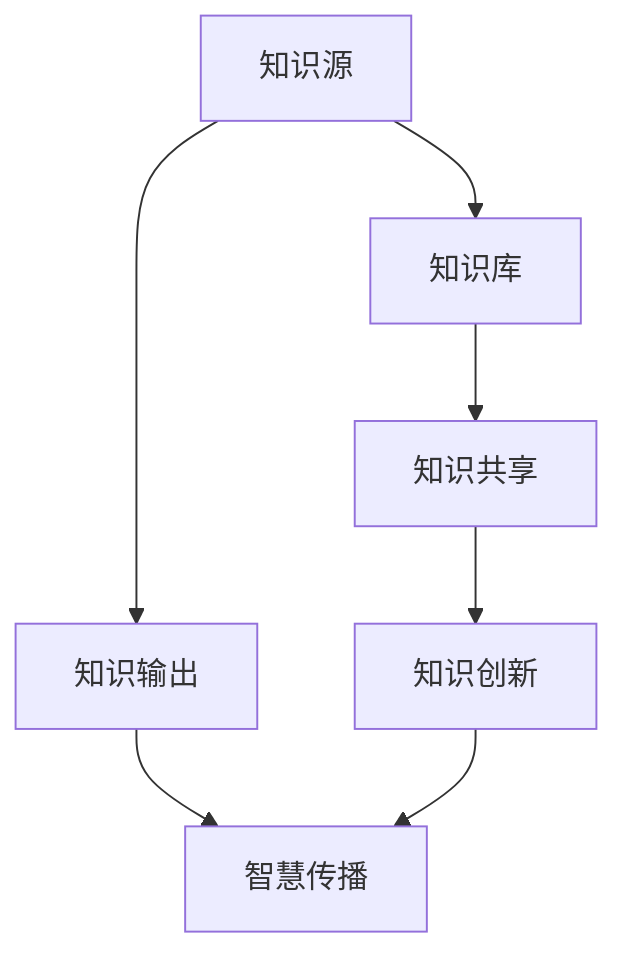

                 

 

> **关键词：** 知识管理、知识输出、智慧传播、信息架构、技术博客、人工智能、教育技术、研究分享。

> **摘要：** 本文探讨了知识输出与管理智慧的积累和传播的重要性，通过分析知识管理的核心概念、方法和技术，提供了一套系统化的知识输出与管理智慧传播的策略。文章旨在为专业人士、教育者和研究者提供指导，帮助他们更有效地分享知识和经验，推动知识的创新与传播。

## 1. 背景介绍

在当今信息爆炸的时代，知识已成为推动社会进步和经济发展的关键因素。知识的积累、管理和传播变得更加重要。知识管理（Knowledge Management, KM）作为一个系统化的过程，旨在通过收集、组织、存储和传播知识来提高组织的效率和创新能力。知识输出（Knowledge Dissemination）作为知识管理的重要环节，是将知识从个体或团队内部传播到更广泛受众的过程。然而，如何有效地进行知识输出与管理智慧的传播仍是一个挑战。

本文将深入探讨知识输出与管理智慧积累与传播的重要性和方法。首先，我们将回顾知识管理的核心概念和方法，然后分析知识输出和智慧传播的技术手段。最后，我们将讨论知识输出的实际应用场景，并提出未来发展的趋势和挑战。

## 2. 核心概念与联系

### 2.1 知识管理

知识管理是一种系统化的过程，旨在通过收集、组织、存储和传播知识来提高组织的效率和创新能力。知识管理包括以下核心概念：

- **知识源**：知识的来源，包括文档、数据、经验等。
- **知识库**：存储和管理知识的数据库或系统。
- **知识共享**：知识在组织内的传播和共享。
- **知识创新**：通过整合新知识和已有知识，产生新的创新和见解。

### 2.2 知识输出

知识输出是知识管理的一个关键环节，涉及将知识从个体或团队内部传播到更广泛受众的过程。知识输出的目标包括：

- **提高知识利用效率**：通过知识共享，减少重复劳动和资源浪费。
- **促进团队协作**：通过共享知识，增强团队内部的沟通和协作。
- **推动知识创新**：通过知识输出，激发新的思考和创新。

### 2.3 智慧传播

智慧传播是知识输出的一种形式，涉及将智慧、经验或洞见分享给他人，以促进知识的普及和传播。智慧传播的目标包括：

- **提升个人和社会的智慧水平**：通过传播智慧，提高个人和社会的整体智慧水平。
- **促进社会进步**：通过传播智慧，推动社会的发展和进步。

### 2.4 Mermaid 流程图

以下是知识输出与管理智慧的积累和传播的Mermaid流程图：



## 3. 核心算法原理 & 具体操作步骤

### 3.1 算法原理概述

知识输出与管理智慧的积累和传播可以被视为一种算法过程，其核心原理包括：

- **知识收集与整理**：从各种来源收集知识，并对其进行分类和整理。
- **知识共享与传播**：通过合适的方法和渠道，将知识共享给相关人员。
- **智慧提取与创新**：从知识中提取智慧，并通过创新产生新的知识。

### 3.2 算法步骤详解

#### 3.2.1 知识收集与整理

1. **确定知识来源**：识别各种知识来源，如文档、数据、经验等。
2. **知识分类**：根据知识的特点和用途，对知识进行分类。
3. **知识整理**：对知识进行整理和编辑，使其更具可读性和易用性。

#### 3.2.2 知识共享与传播

1. **选择合适的渠道**：根据知识的性质和受众，选择合适的共享和传播渠道，如技术博客、研讨会、会议等。
2. **制定共享策略**：制定知识共享的计划和时间表，确保知识的及时和有效传播。
3. **实施共享活动**：通过实际操作，将知识共享给相关人员。

#### 3.2.3 智慧提取与创新

1. **智慧识别**：从知识中提取智慧，识别其中的价值和意义。
2. **智慧创新**：通过整合新知识和已有智慧，产生新的创新和见解。

### 3.3 算法优缺点

#### 优点：

- **提高知识利用效率**：通过知识共享和传播，减少重复劳动和资源浪费。
- **促进团队协作**：通过知识共享，增强团队内部的沟通和协作。
- **推动知识创新**：通过知识输出和智慧传播，激发新的思考和创新。

#### 缺点：

- **知识保密风险**：知识输出可能带来知识泄露的风险。
- **知识质量控制**：确保知识质量和准确性是一个挑战。
- **时间成本**：知识输出和传播需要时间和精力投入。

### 3.4 算法应用领域

知识输出与管理智慧的积累和传播算法广泛应用于以下领域：

- **教育**：通过知识共享，促进教育资源的普及和共享。
- **企业**：通过知识管理，提高企业内部的知识利用效率和创新能力。
- **科研**：通过智慧传播，推动科研领域的发展和进步。
- **社会**：通过知识共享，提升社会整体的智慧水平。

## 4. 数学模型和公式 & 详细讲解 & 举例说明

### 4.1 数学模型构建

知识输出与管理智慧的积累和传播的数学模型可以从以下几个方面构建：

1. **知识共享模型**：基于知识的共享意愿、共享能力和共享渠道，构建知识共享模型。
2. **智慧传播模型**：基于智慧的内容、受众和传播渠道，构建智慧传播模型。
3. **知识创新模型**：基于知识的整合、重构和创新，构建知识创新模型。

### 4.2 公式推导过程

以下是一个简单的知识共享模型的公式推导过程：

设 \( S \) 为知识共享的数量，\( P \) 为知识共享的可能性，\( I \) 为知识共享的意愿，\( C \) 为知识共享的能力，\( H \) 为知识共享的渠道效率。

则知识共享的数量 \( S \) 可以表示为：

\[ S = P \times I \times C \times H \]

其中：

- \( P \)：知识共享的可能性，取决于知识的性质和受众的需求。
- \( I \)：知识共享的意愿，取决于个体的价值观和责任感。
- \( C \)：知识共享的能力，取决于个体的知识储备和表达能力。
- \( H \)：知识共享的渠道效率，取决于渠道的传播效果和覆盖范围。

### 4.3 案例分析与讲解

假设一个企业的研发团队想要通过内部知识共享平台提高知识传播效率，可以采取以下步骤：

1. **确定知识共享的目标和范围**：明确知识共享的目标和范围，如研发成果、经验教训、最佳实践等。
2. **评估知识共享的可能性**：分析团队成员的共享意愿和能力，以及共享渠道的效率。
3. **制定知识共享计划**：制定详细的共享计划，包括共享的内容、时间、方式和责任人。
4. **实施知识共享活动**：按照计划进行知识共享活动，确保知识的有效传播。

通过上述步骤，企业可以建立一个高效的内部知识共享体系，提高知识利用效率和创新能力。

## 5. 项目实践：代码实例和详细解释说明

### 5.1 开发环境搭建

为了实践知识输出与管理智慧的积累和传播，我们可以使用一个简单的知识管理平台。以下是搭建开发环境的基本步骤：

1. **安装Python环境**：确保Python 3.x版本已安装。
2. **安装相关库**：使用pip安装必要的库，如requests、json、markdown等。
3. **配置知识管理平台**：搭建一个简单的知识管理平台，如使用Django或Flask框架。

### 5.2 源代码详细实现

以下是使用Python实现的简单知识管理平台的代码实例：

```python
import requests
import json
from flask import Flask, request, jsonify

app = Flask(__name__)

# 知识库
knowledge_base = []

@app.route('/knowledge', methods=['POST', 'GET'])
def knowledge():
    if request.method == 'POST':
        # 添加新知识
        knowledge_item = request.json
        knowledge_base.append(knowledge_item)
        return jsonify({'status': 'success', 'message': '知识已添加到知识库。'})
    elif request.method == 'GET':
        # 获取所有知识
        return jsonify(knowledge_base)

if __name__ == '__main__':
    app.run(debug=True)
```

### 5.3 代码解读与分析

- **知识库**：使用一个简单的列表 `knowledge_base` 存储所有知识项。
- **知识添加**：使用POST请求向 `/knowledge` 路径添加新知识。
- **知识获取**：使用GET请求从 `/knowledge` 路径获取所有知识。

通过此代码实例，我们可以实现一个简单的知识管理平台，用于知识的收集、存储和共享。

### 5.4 运行结果展示

运行上述代码后，我们可以通过浏览器或API接口进行知识管理操作。以下是运行结果示例：

1. **添加知识**：

```
POST /knowledge
{
    "title": "Python编程基础",
    "content": "Python是一种高级编程语言，广泛应用于Web开发、数据科学等领域。"
}
```

2. **获取所有知识**：

```
GET /knowledge
[
    {
        "title": "Python编程基础",
        "content": "Python是一种高级编程语言，广泛应用于Web开发、数据科学等领域。"
    }
]
```

通过运行结果，我们可以看到知识管理平台的基本功能已实现。

## 6. 实际应用场景

知识输出与管理智慧的积累和传播在实际应用中具有广泛的应用场景，以下列举几个典型场景：

1. **企业内部知识管理**：企业可以通过知识管理平台，收集、整理和共享员工的经验和知识，提高内部知识传播效率，促进创新和协作。

2. **教育领域**：教育机构可以建立在线知识库，为学生和教师提供丰富的学习资源和经验分享，促进教育资源的普及和共享。

3. **科研领域**：科研团队可以通过知识管理平台，记录、共享和传播科研过程中的经验和成果，推动科研创新和知识共享。

4. **社会公益**：公益组织可以通过知识管理平台，传播公益知识和实践经验，提高公众的公益意识和参与度。

5. **政府管理**：政府部门可以通过知识管理平台，收集、整理和传播政策法规、行政管理经验和最佳实践，提高政府工作效率和服务水平。

## 7. 工具和资源推荐

为了更好地进行知识输出与管理智慧的积累和传播，以下是几个推荐的工具和资源：

1. **工具推荐**：

- **知识管理平台**：如Confluence、Trello、Notion等。
- **文档编辑工具**：如Google Docs、Microsoft Word等。
- **演示制作工具**：如PowerPoint、Keynote等。
- **知识共享平台**：如知乎、简书、技术博客等。

2. **学习资源推荐**：

- **在线课程**：如Coursera、edX、Udemy等。
- **电子书**：《黑客与画家》、《深度学习》、《编程珠玑》等。
- **论文库**：如IEEE Xplore、ACM Digital Library等。

3. **相关论文推荐**：

- **知识管理**：《知识管理：理论与实践》、《知识管理与组织创新》等。
- **智慧传播**：《智慧传播：理论、方法与实践》、《社交媒体与智慧传播》等。
- **知识输出**：《知识输出：方法与技术》、《知识输出与团队协作》等。

## 8. 总结：未来发展趋势与挑战

知识输出与管理智慧的积累和传播是一个不断发展的领域。随着技术的进步和社会的发展，未来将呈现以下趋势和挑战：

### 8.1 研究成果总结

- **知识共享与协作**：知识共享和协作将成为知识管理的重要方向，促进个体和组织之间的知识交流与合作。
- **人工智能与知识管理**：人工智能技术将在知识管理中发挥更大作用，如知识挖掘、知识分类、知识推荐等。
- **智慧传播与创新**：智慧传播将成为知识管理的重要目标，通过智慧传播推动知识的创新和普及。

### 8.2 未来发展趋势

- **个性化知识管理**：个性化知识管理将更加普及，根据用户需求和偏好提供个性化的知识服务。
- **知识融合与创新**：知识融合将成为知识管理的重要手段，通过整合不同领域的知识，产生新的创新和见解。
- **智慧传播与普及**：智慧传播将进一步普及，通过多种渠道和形式传播智慧，提高公众的智慧水平。

### 8.3 面临的挑战

- **知识质量与可靠性**：确保知识质量和可靠性是一个挑战，需要建立有效的知识质量控制机制。
- **知识保密与隐私**：知识保密和隐私保护将成为知识管理的重要问题，需要采取有效的措施保护敏感知识。
- **知识更新与维护**：知识更新与维护是一个长期任务，需要建立有效的知识更新和维护机制。

### 8.4 研究展望

未来，知识输出与管理智慧的积累和传播领域将继续深入发展。研究人员和从业者需要关注以下方向：

- **知识共享与协作机制**：探索更有效的知识共享与协作机制，提高知识利用效率和创新能力。
- **智慧传播策略**：研究智慧传播的有效策略和方法，提高智慧传播的效果和覆盖范围。
- **知识融合与创新**：探索知识融合与创新的新方法和技术，促进知识的创新和发展。

通过持续的研究和实践，我们将能够更好地实现知识输出与管理智慧的积累和传播，为个人、组织和社会带来更大的价值。

## 9. 附录：常见问题与解答

### 问题1：知识输出与管理智慧的积累和传播有什么区别？

**回答**：知识输出（Knowledge Dissemination）主要关注将知识从个体或团队内部传播到更广泛受众的过程，而管理智慧的积累和传播（Wisdom Accumulation and Dissemination）则更注重通过知识管理和智慧挖掘，积累智慧并传播给他人，以推动知识的创新和社会进步。

### 问题2：如何确保知识输出的质量和可靠性？

**回答**：确保知识输出的质量和可靠性需要建立有效的知识质量控制机制，包括：

- **知识审核**：对知识内容进行严格审核，确保其准确性和可靠性。
- **知识更新**：定期更新知识库，确保知识的最新性和相关性。
- **用户反馈**：收集用户对知识内容的反馈，及时进行修改和完善。

### 问题3：知识输出与管理智慧的积累和传播在哪个领域应用最广泛？

**回答**：知识输出与管理智慧的积累和传播在多个领域有广泛应用，如企业内部知识管理、教育领域、科研领域、社会公益和政府管理等。其中，企业内部知识管理应用最广泛，通过知识共享和智慧传播，提高企业内部的知识利用效率和创新能力。教育领域则通过知识传播和智慧普及，促进教育资源的普及和共享。科研领域则通过知识管理和智慧传播，推动科研创新和知识进步。社会公益和政府管理领域则通过知识传播，提高公众的智慧水平和社会整体的发展。

### 问题4：知识输出与管理智慧的积累和传播的未来发展趋势是什么？

**回答**：未来，知识输出与管理智慧的积累和传播将继续深入发展，主要趋势包括：

- **个性化知识管理**：根据用户需求和偏好提供个性化的知识服务。
- **知识融合与创新**：通过知识融合，产生新的创新和见解。
- **智慧传播与普及**：通过多种渠道和形式传播智慧，提高公众的智慧水平。
- **技术驱动**：人工智能和大数据等新技术将在知识管理和智慧传播中发挥更大作用。

