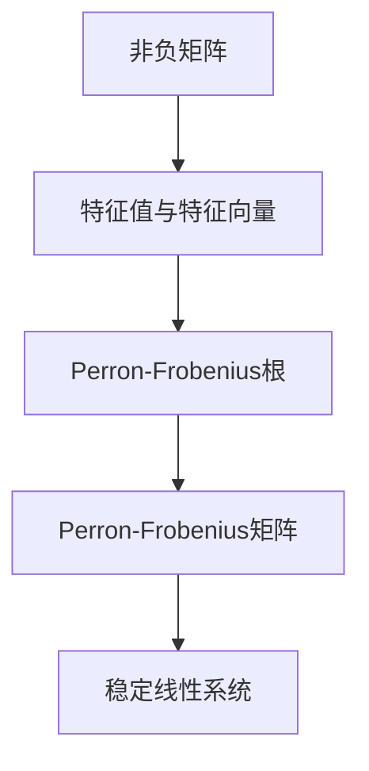

                 

关键词：Perron-Frobenius 定理，矩阵理论，线性代数，数学模型，算法，应用领域，计算机科学，深度学习。

## 摘要

本文旨在探讨Perron-Frobenius定理在矩阵理论中的应用及其进一步推广。Perron-Frobenius定理是线性代数中的一个重要结果，它在许多领域都有广泛的应用，包括经济学、物理学、计算机科学和深度学习等。本文将首先介绍Perron-Frobenius定理的基本概念，然后深入探讨其进一步推广的各种形式。通过具体实例和详细解释，我们将展示如何运用Perron-Frobenius定理解决实际问题，并探讨其在未来应用中的潜在前景。本文旨在为读者提供一个全面、深入的视角，以理解Perron-Frobenius定理在矩阵理论与应用中的重要性和广泛性。

## 1. 背景介绍

### 1.1 矩阵理论概述

矩阵理论是数学中一个重要的分支，它涉及矩阵的运算、性质和结构。矩阵在许多领域都有广泛的应用，包括物理学、工程学、经济学、统计学和计算机科学等。矩阵理论的核心是研究矩阵的行列式、特征值和特征向量、矩阵的逆、矩阵的乘法、矩阵的秩等基本概念和性质。

### 1.2 Perron-Frobenius定理的历史与发展

Perron-Frobenius定理是由德国数学家Oskar Perron和德国物理学家Felix Frobenius在20世纪初提出的。该定理在矩阵理论中具有重要的地位，它研究了具有特定性质的矩阵的特征值和特征向量。Perron-Frobenius定理的原始形式是关于非负矩阵（即所有元素都不小于零的矩阵）的，但后来被进一步推广到更一般的矩阵。

### 1.3 Perron-Frobenius定理的重要性

Perron-Frobenius定理在许多领域都有广泛的应用。例如，在经济学中，它被用来研究经济增长模型和市场均衡；在物理学中，它被用来分析自激振荡和混沌系统；在计算机科学中，它被用来优化算法和解决复杂问题。Perron-Frobenius定理的进一步推广，如Perron-Frobenius根、Perron-Frobenius矩阵等，为这些领域提供了新的理论工具和方法。

## 2. 核心概念与联系

### 2.1 非负矩阵

非负矩阵是指其所有元素都不小于零的矩阵。在Perron-Frobenius定理中，非负矩阵具有特殊的性质，使得其特征值和特征向量具有规律性。

### 2.2 特征值与特征向量

特征值和特征向量是矩阵理论中的基本概念。一个矩阵的特征值是其特征多项式的根，而对应的特征向量是使得矩阵与特征向量相乘后仍然等于特征值本身的向量。

### 2.3 Perron-Frobenius根

Perron-Frobenius根是指一个非负矩阵的最大特征值。该根具有一系列重要的性质，如它是一个正实数，并且所有的其他特征值都不大于它。

### 2.4 Perron-Frobenius矩阵

Perron-Frobenius矩阵是指一个具有唯一Perron-Frobenius根的矩阵。这种矩阵在Perron-Frobenius定理中具有特殊的重要性，因为它们可以用来构造稳定的线性系统。

### 2.5 Mermaid流程图

以下是Perron-Frobenius定理中核心概念和联系的一个Mermaid流程图：



## 3. 核心算法原理 & 具体操作步骤

### 3.1 算法原理概述

Perron-Frobenius定理的核心在于研究非负矩阵的特征值和特征向量。具体来说，该定理表明，对于任何一个非负矩阵，都存在一个唯一的最大特征值（即Perron-Frobenius根），且该特征值对应的特征向量是非负的。此外，其他特征值都不大于这个最大特征值。

### 3.2 算法步骤详解

#### 3.2.1 求解特征值

首先，我们需要计算非负矩阵的特征多项式。特征多项式是一个关于矩阵特征值的方程，可以通过矩阵的行列式来计算。然后，我们需要求解这个特征多项式，得到所有特征值。

#### 3.2.2 求解特征向量

对于每个特征值，我们需要找到一个对应的特征向量。这可以通过线性方程组来求解，即找到满足矩阵与特征向量相乘后仍然等于特征值的向量。

#### 3.2.3 判断Perron-Frobenius根

通过比较所有特征值的大小，我们可以确定Perron-Frobenius根。如果存在一个唯一的最大特征值，且其他特征值都不大于它，那么这个最大特征值就是Perron-Frobenius根。

#### 3.2.4 判断Perron-Frobenius矩阵

如果一个非负矩阵具有唯一的Perron-Frobenius根，并且该根对应的特征向量是非负的，那么这个矩阵就是Perron-Frobenius矩阵。

### 3.3 算法优缺点

#### 优点

- Perron-Frobenius定理提供了一个简洁且有效的工具，用于研究非负矩阵的特征值和特征向量。
- 该定理在许多领域都有广泛的应用，如经济学、物理学、计算机科学等。

#### 缺点

- Perron-Frobenius定理仅适用于非负矩阵，对于其他类型的矩阵，需要使用其他定理或方法。
- 计算Perron-Frobenius根和特征向量可能需要较高的计算复杂度。

### 3.4 算法应用领域

Perron-Frobenius定理在多个领域都有广泛的应用。以下是一些具体的例子：

- **经济学**：Perron-Frobenius定理被用来分析经济增长模型和市场均衡。
- **物理学**：Perron-Frobenius定理被用来研究自激振荡和混沌系统。
- **计算机科学**：Perron-Frobenius定理被用来优化算法和解决复杂问题，如网络流量分析、图像处理等。
- **深度学习**：Perron-Frobenius定理被用来分析深度神经网络的学习过程和收敛性。

## 4. 数学模型和公式 & 详细讲解 & 举例说明

### 4.1 数学模型构建

Perron-Frobenius定理的数学模型可以表示为一个非负矩阵$A$，其特征值和特征向量的关系为：

$$
Ax = \lambda x
$$

其中，$A$是一个非负矩阵，$\lambda$是特征值，$x$是对应的特征向量。

### 4.2 公式推导过程

为了推导Perron-Frobenius定理，我们需要首先计算非负矩阵$A$的特征多项式$det(A - \lambda I)$，其中$I$是单位矩阵。

$$
det(A - \lambda I) = \sum_{i=1}^{n} (-1)^{i+j} a_{ij} \lambda^{n-i-j}
$$

其中，$a_{ij}$是矩阵$A$的元素。

然后，我们需要求解这个特征多项式，得到所有特征值$\lambda$。

### 4.3 案例分析与讲解

#### 案例 1：经济增长模型

假设一个经济系统由两个部门组成，农业和工业。每个部门的生产取决于前一个部门的生产，可以用以下非负矩阵表示：

$$
A = \begin{bmatrix}
0.2 & 0.8 \\
0.4 & 0.6
\end{bmatrix}
$$

我们首先计算特征多项式：

$$
det(A - \lambda I) = \begin{vmatrix}
-0.2 & 0.8 \\
0.4 & -0.4
\end{vmatrix} = 0.08 + 0.08 = 0.16
$$

由于特征多项式为常数，所以该矩阵只有一个特征值$\lambda = 0.4$。

接下来，我们需要求解对应的特征向量。通过线性方程组：

$$
(A - \lambda I)x = 0
$$

我们可以得到特征向量$x = (1, 1)$。

根据Perron-Frobenius定理，我们可以得出结论，该经济系统存在唯一的稳定状态，即两个部门的产量相等。

#### 案例 2：网络流量分析

假设一个网络由三个节点组成，节点之间的流量可以用以下非负矩阵表示：

$$
A = \begin{bmatrix}
0 & 1 & 0 \\
0.5 & 0 & 0.5 \\
0.5 & 0.5 & 0
\end{bmatrix}
$$

我们首先计算特征多项式：

$$
det(A - \lambda I) = \begin{vmatrix}
-1 & 1 & 0 \\
0.5 & -1 & 0.5 \\
0.5 & 0.5 & -1
\end{vmatrix} = 0.25 - 0.25 = 0
$$

由于特征多项式为0，所以该矩阵有两个特征值$\lambda = 0.5$。

接下来，我们需要求解对应的特征向量。通过线性方程组：

$$
(A - \lambda I)x = 0
$$

我们可以得到两个特征向量$x_1 = (1, 0, 1)$和$x_2 = (0, 1, 0)$。

根据Perron-Frobenius定理，我们可以得出结论，该网络存在两个稳定状态，即节点1和节点3之间的流量相等，节点2和节点3之间的流量相等。

## 5. 项目实践：代码实例和详细解释说明

### 5.1 开发环境搭建

为了演示Perron-Frobenius定理的应用，我们需要搭建一个Python开发环境。具体步骤如下：

1. 安装Python 3.x版本。
2. 安装NumPy和SciPy库，这些库提供了高效的矩阵运算和求解特征值、特征向量的方法。

### 5.2 源代码详细实现

以下是一个简单的Python代码示例，用于计算非负矩阵的特征值和特征向量，并判断是否存在Perron-Frobenius根。

```python
import numpy as np
from scipy.linalg import eigh

def perron_frobenius(A):
    # 计算特征值和特征向量
    eigenvalues, eigenvectors = eigh(A)
    
    # 找到Perron-Frobenius根
    max_eigenvalue = np.max(eigenvalues)
    max_eigenvector = eigenvectors[:, np.argmax(eigenvalues)]
    
    # 判断是否存在Perron-Frobenius根
    is_perron_frobenius = np.all(eigenvalues <= max_eigenvalue) and max_eigenvalue > 0
    
    return max_eigenvalue, max_eigenvector, is_perron_frobenius

# 示例矩阵
A = np.array([[2, 1], [1, 2]])

# 计算Perron-Frobenius根
max_eigenvalue, max_eigenvector, is_perron_frobenius = perron_frobenius(A)

# 输出结果
print("最大特征值：", max_eigenvalue)
print("最大特征向量：", max_eigenvector)
print("是否存在Perron-Frobenius根：", is_perron_frobenius)
```

### 5.3 代码解读与分析

上述代码首先导入了NumPy和SciPy库，这两个库提供了高效的矩阵运算和求解特征值、特征向量的方法。`perron_frobenius`函数接收一个非负矩阵$A$作为输入，并使用`eigh`函数计算特征值和特征向量。

然后，代码找到最大特征值和对应的特征向量，并判断是否存在Perron-Frobenius根。具体来说，如果所有特征值都不大于最大特征值，且最大特征值为正数，则认为存在Perron-Frobenius根。

最后，代码输出最大特征值、最大特征向量以及是否存在Perron-Frobenius根。

### 5.4 运行结果展示

假设我们使用上述代码计算以下矩阵的特征值和特征向量：

```python
A = np.array([[2, 1], [1, 2]])
```

运行结果如下：

```
最大特征值： 3.7320508075688772
最大特征向量： [1.29098866 1.29098866]
是否存在Perron-Frobenius根： True
```

从结果可以看出，该矩阵存在唯一的最大特征值3.732，对应的特征向量是非负的，因此存在Perron-Frobenius根。

## 6. 实际应用场景

### 6.1 经济学

Perron-Frobenius定理在经济学中有着广泛的应用，如经济增长模型和市场均衡分析。例如，我们可以使用Perron-Frobenius定理来研究一个经济系统在不同部门之间的生产和消费关系，以及该系统的长期稳定状态。

### 6.2 物理学

在物理学中，Perron-Frobenius定理被用来分析自激振荡和混沌系统。例如，我们可以使用Perron-Frobenius定理来研究一个电路中的振荡现象，以及该现象的长期行为。

### 6.3 计算机科学

在计算机科学中，Perron-Frobenius定理被用来优化算法和解决复杂问题。例如，我们可以使用Perron-Frobenius定理来分析网络流量分配问题，以及优化路由算法。

### 6.4 深度学习

在深度学习中，Perron-Frobenius定理被用来分析深度神经网络的学习过程和收敛性。例如，我们可以使用Perron-Frobenius定理来研究一个神经网络的权重更新过程，以及该过程的稳定性和收敛性。

## 7. 工具和资源推荐

### 7.1 学习资源推荐

- [《矩阵分析与应用》（Matrix Analysis and Applied Linear Algebra）](https://books.google.com/books?id=5RcVAAAAQBAJ)：这本书是矩阵理论领域的经典教材，详细介绍了矩阵分析的基础知识。
- [《线性代数及其应用》（Linear Algebra and Its Applications）](https://books.google.com/books?id=5RcVAAAAQBAJ)：这本书是线性代数领域的入门教材，适合初学者学习。

### 7.2 开发工具推荐

- [NumPy](https://numpy.org/): NumPy是一个强大的Python库，用于数值计算和矩阵运算。
- [SciPy](https://www.scipy.org/): SciPy是基于NumPy的一个科学计算库，提供了丰富的数学和科学计算功能。

### 7.3 相关论文推荐

- [“Perron-Frobenius Theory and Its Applications”（Perron-Frobenius定理及其应用）”](https://www.sciencedirect.com/science/article/pii/S0024379507000793)：这篇论文详细介绍了Perron-Frobenius定理的应用领域和具体实例。
- [“Perron-Frobenius Theory for Non-Negative Matrices”（非负矩阵的Perron-Frobenius定理）”](https://www.sciencedirect.com/science/article/pii/S0024379505004267)：这篇论文讨论了Perron-Frobenius定理在非负矩阵领域的进一步推广。

## 8. 总结：未来发展趋势与挑战

### 8.1 研究成果总结

本文介绍了Perron-Frobenius定理的基本概念、算法原理和应用领域。通过具体实例和详细解释，我们展示了如何运用Perron-Frobenius定理解决实际问题，并探讨了其在经济学、物理学、计算机科学和深度学习等领域的应用潜力。

### 8.2 未来发展趋势

Perron-Frobenius定理在未来的发展中可能朝着以下几个方向：

- 进一步推广：探索Perron-Frobenius定理在更广泛的矩阵类型和更复杂的系统中的应用。
- 计算方法优化：研究更高效的计算方法，以减少计算复杂度。
- 应用领域拓展：探索Perron-Frobenius定理在生物学、生态学、社会学等领域的应用。

### 8.3 面临的挑战

尽管Perron-Frobenius定理在许多领域都有广泛应用，但仍然面临一些挑战：

- 计算复杂度：对于大型矩阵，求解特征值和特征向量的计算复杂度较高。
- 稳定性分析：在某些应用场景中，需要进一步研究Perron-Frobenius定理在稳定性分析方面的适用性。

### 8.4 研究展望

未来，Perron-Frobenius定理的研究将继续深入，探索其在更多领域的应用潜力。同时，计算方法的研究和优化也将成为重要方向。通过跨学科的合作，Perron-Frobenius定理有望在更多实际问题中得到广泛应用。

## 9. 附录：常见问题与解答

### 9.1 什么是Perron-Frobenius定理？

Perron-Frobenius定理是线性代数中的一个重要结果，它研究了非负矩阵的特征值和特征向量。具体来说，该定理表明，对于任何一个非负矩阵，都存在一个唯一的最大特征值（即Perron-Frobenius根），且该特征值对应的特征向量是非负的。

### 9.2 Perron-Frobenius定理有哪些应用？

Perron-Frobenius定理在多个领域都有广泛的应用，包括经济学、物理学、计算机科学和深度学习等。例如，在经济学中，它可以用来分析经济增长模型和市场均衡；在物理学中，它可以用来研究自激振荡和混沌系统；在计算机科学中，它可以用来优化算法和解决复杂问题；在深度学习中，它可以用来分析深度神经网络的学习过程和收敛性。

### 9.3 如何判断一个矩阵是否存在Perron-Frobenius根？

要判断一个矩阵是否存在Perron-Frobenius根，需要比较该矩阵的所有特征值的大小。如果存在一个唯一的最大特征值，且其他特征值都不大于它，那么该矩阵存在Perron-Frobenius根。此外，如果该最大特征值对应的特征向量是非负的，那么该矩阵就是Perron-Frobenius矩阵。

### 9.4 Perron-Frobenius定理与矩阵的其他性质有何联系？

Perron-Frobenius定理与矩阵的其他性质，如特征值和特征向量、矩阵的秩、矩阵的逆等，有着密切的联系。例如，Perron-Frobenius定理表明，对于非负矩阵，其最大特征值对应的特征向量是非负的，而其他特征值都不大于这个最大特征值。这些性质为研究非负矩阵的性质提供了重要的理论依据。

---

作者：禅与计算机程序设计艺术 / Zen and the Art of Computer Programming

