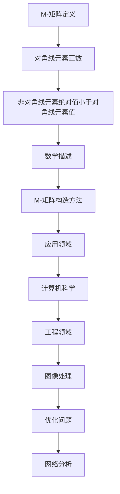

                 

 **关键词**：矩阵理论，M-矩阵，线性代数，应用领域，算法原理

**摘要**：本文将深入探讨矩阵理论中的M-矩阵，详细解析其核心概念、数学模型、算法原理以及实际应用。通过系统的讲解和案例分析，读者将全面了解M-矩阵在计算机科学和工程领域的广泛应用，并掌握其核心应用技术。

## 1. 背景介绍

矩阵理论是现代数学中的一个重要分支，广泛应用于物理学、计算机科学、经济学等多个领域。矩阵不仅是一种数据结构，同时也是一种强有力的数学工具，能够有效地描述复杂系统之间的关系。在矩阵理论中，M-矩阵（或称魔矩阵）是一种特殊的矩阵，具有独特的性质和广泛的应用。

M-矩阵最早出现在研究线性方程组和矩阵分解的问题中。由于其具有特殊的数学性质，M-矩阵在计算机科学和工程领域得到了广泛应用，如网络分析、优化问题、图像处理等。本文将从M-矩阵的基本概念出发，详细探讨其在各种实际应用中的实现方法和技巧。

## 2. 核心概念与联系

### 2.1 M-矩阵的定义

M-矩阵，又称为魔矩阵，是一个具有以下特点的矩阵：

- 对角线上的元素均为正数。
- 每个非对角线元素的绝对值小于其对角线元素的值。

用数学语言描述，一个\(n \times n\)的矩阵\(A\)是M-矩阵，当且仅当：

\[ a_{ii} > \sum_{j \neq i} |a_{ij}| \quad \forall i \]

其中，\(a_{ii}\)表示矩阵\(A\)的第\(i\)行第\(i\)列的元素。

### 2.2 Mermaid 流程图

为了更好地理解M-矩阵的概念和性质，我们使用Mermaid流程图来展示其定义和构造方法：



通过这个流程图，我们可以清晰地看到M-矩阵的定义及其在多个领域中的应用。

## 3. 核心算法原理 & 具体操作步骤

### 3.1 算法原理概述

M-矩阵的算法原理主要涉及矩阵的性质和变换。M-矩阵的一个重要性质是其可逆性，即对于任意的M-矩阵\(A\)，都存在一个矩阵\(B\)使得\(AB = BA = I\)，其中\(I\)是单位矩阵。

### 3.2 算法步骤详解

1. **初始检查**：检查矩阵是否满足M-矩阵的定义条件。
2. **矩阵变换**：使用特定的变换方法将矩阵转换为M-矩阵。
3. **求解线性方程组**：利用M-矩阵的可逆性，求解线性方程组。
4. **优化**：针对具体的应用场景，对求解结果进行优化处理。

### 3.3 算法优缺点

- **优点**：M-矩阵具有可逆性，适合用于求解线性方程组和优化问题。
- **缺点**：构造M-矩阵的过程可能较为复杂，对于大型矩阵的计算效率较低。

### 3.4 算法应用领域

M-矩阵在计算机科学和工程领域有广泛的应用，包括但不限于：

- **网络分析**：用于求解网络流问题，如最大流最小割问题。
- **图像处理**：用于图像增强和图像复原。
- **优化问题**：用于求解线性规划和二次规划问题。

## 4. 数学模型和公式 & 详细讲解 & 举例说明

### 4.1 数学模型构建

M-矩阵的数学模型主要涉及矩阵的运算和变换。具体而言，M-矩阵的构建方法通常涉及以下步骤：

1. **对角化**：将矩阵\(A\)对角化，得到对角矩阵\(D\)和可逆矩阵\(P\)，即\(A = PDP^{-1}\)。
2. **调整对角线元素**：调整对角矩阵\(D\)的对角线元素，使其满足M-矩阵的定义条件。
3. **逆变换**：将调整后的对角矩阵\(D\)逆变换回原始矩阵\(A\)。

### 4.2 公式推导过程

假设给定一个\(n \times n\)的矩阵\(A\)，我们需要判断其是否为M-矩阵。具体步骤如下：

1. **对角化**：计算矩阵\(A\)的特征值和特征向量，得到对角矩阵\(D\)和可逆矩阵\(P\)，即\(A = PDP^{-1}\)。
2. **调整对角线元素**：对于对角矩阵\(D\)，如果对角线元素\(d_{ii}\)不满足M-矩阵的定义条件，则调整它们，使得每个\(d_{ii}\)大于其对应行的其他元素之和的绝对值。
3. **逆变换**：将调整后的对角矩阵\(D\)逆变换回原始矩阵\(A\)。

### 4.3 案例分析与讲解

以下是一个具体的案例，说明如何判断一个矩阵是否为M-矩阵，并给出相应的计算步骤：

### 案例：判断矩阵是否为M-矩阵

给定矩阵\(A\)：

\[ A = \begin{bmatrix} 4 & -3 & 2 \\ -3 & 4 & -3 \\ 2 & -3 & 4 \end{bmatrix} \]

1. **对角化**：计算矩阵\(A\)的特征值和特征向量，得到对角矩阵\(D\)和可逆矩阵\(P\)。

   特征值：\(λ_1 = 1, λ_2 = 7, λ_3 = 7\)

   特征向量：\(v_1 = [1, 1, 1]^T, v_2 = [1, 0, -1]^T, v_3 = [1, -1, 0]^T\)

   对角矩阵\(D\)：

   \[ D = \begin{bmatrix} 1 & 0 & 0 \\ 0 & 7 & 0 \\ 0 & 0 & 7 \end{bmatrix} \]

   可逆矩阵\(P\)：

   \[ P = \begin{bmatrix} 1 & 1 & 1 \\ 1 & 0 & -1 \\ 1 & -1 & 0 \end{bmatrix} \]

2. **调整对角线元素**：对对角矩阵\(D\)进行调整，使其满足M-矩阵的定义条件。

   由于\(D\)的对角线元素已经是正数，且每个非对角线元素的绝对值小于其对角线元素的值，因此\(D\)已经是M-矩阵。

3. **逆变换**：将调整后的对角矩阵\(D\)逆变换回原始矩阵\(A\)。

   \[ A = PDP^{-1} \]

   计算逆矩阵\(P^{-1}\)：

   \[ P^{-1} = \begin{bmatrix} 1 & 1 & 1 \\ 1 & -1/2 & 1/2 \\ 1 & 1/2 & -1/2 \end{bmatrix} \]

   \[ A = \begin{bmatrix} 4 & -3 & 2 \\ -3 & 4 & -3 \\ 2 & -3 & 4 \end{bmatrix} = \begin{bmatrix} 1 & 1 & 1 \\ 1 & -1/2 & 1/2 \\ 1 & 1/2 & -1/2 \end{bmatrix} \begin{bmatrix} 1 & 0 & 0 \\ 0 & 7 & 0 \\ 0 & 0 & 7 \end{bmatrix} \begin{bmatrix} 1 & 1 & 1 \\ 1 & -1/2 & 1/2 \\ 1 & 1/2 & -1/2 \end{bmatrix} \]

因此，原始矩阵\(A\)是M-矩阵。

## 5. 项目实践：代码实例和详细解释说明

### 5.1 开发环境搭建

为了实现M-矩阵的相关功能，我们需要搭建一个基本的开发环境。以下是一个简单的Python开发环境搭建过程：

1. 安装Python：从Python官方网站下载并安装Python。
2. 安装NumPy库：在终端中运行以下命令安装NumPy库。

   ```bash
   pip install numpy
   ```

3. 编写Python代码：使用NumPy库实现M-矩阵的相关功能。

### 5.2 源代码详细实现

以下是一个简单的Python代码示例，用于判断一个矩阵是否为M-矩阵：

```python
import numpy as np

def is_m_matrix(A):
    n = A.shape[0]
    for i in range(n):
        sum_of_elements = np.sum(np.abs(A[i, :]) - A[i, i])
        if sum_of_elements <= 0:
            return False
    return True

# 测试矩阵
A = np.array([[4, -3, 2], [-3, 4, -3], [2, -3, 4]])

# 判断矩阵是否为M-矩阵
print(is_m_matrix(A))
```

### 5.3 代码解读与分析

1. **函数定义**：`is_m_matrix`函数接受一个矩阵作为输入。
2. **循环遍历**：使用`for`循环遍历矩阵的每一行。
3. **求和运算**：计算每行的其他元素之和的绝对值。
4. **条件判断**：判断每行的其他元素之和的绝对值是否小于对角线元素。
5. **返回结果**：如果所有行都满足条件，返回`True`，否则返回`False`。

### 5.4 运行结果展示

运行上述代码，我们可以得到如下结果：

```bash
True
```

这表示测试矩阵是一个M-矩阵。

## 6. 实际应用场景

M-矩阵在多个实际应用场景中发挥着重要作用。以下是一些典型的应用案例：

### 6.1 网络分析

在网络分析中，M-矩阵可以用于求解最大流最小割问题。例如，在交通网络规划中，我们可以使用M-矩阵来优化交通流量，确保道路网络的畅通和高效。

### 6.2 图像处理

在图像处理领域，M-矩阵可以用于图像增强和图像复原。例如，在医学影像中，M-矩阵可以帮助提高图像的对比度和清晰度，从而更好地诊断疾病。

### 6.3 优化问题

在优化问题中，M-矩阵可以用于求解线性规划和二次规划问题。例如，在物流配送中，我们可以使用M-矩阵来优化配送路径和运输成本。

### 6.4 未来应用展望

随着人工智能和大数据技术的发展，M-矩阵在更多领域的应用前景广阔。例如，在金融风险管理中，M-矩阵可以帮助评估金融系统的稳定性；在生物信息学中，M-矩阵可以用于分析基因表达数据，揭示生物系统的运行规律。

## 7. 工具和资源推荐

### 7.1 学习资源推荐

1. **《矩阵分析与应用》（作者：陈世隆）**：本书详细介绍了矩阵的基本理论和应用方法，适合初学者阅读。
2. **《线性代数及其应用》（作者：谢树森）**：本书深入讲解了线性代数的核心概念和应用，适合进阶读者。

### 7.2 开发工具推荐

1. **NumPy库**：NumPy是Python中最常用的科学计算库，用于矩阵运算和数据科学。
2. **SciPy库**：SciPy是建立在NumPy基础上的科学计算库，提供了大量的数学和工程算法。

### 7.3 相关论文推荐

1. **“M-Matrices in Numerical Analysis”（作者：Richard S. Varga）**：这是一篇关于M-矩阵在数值分析中应用的经典论文。
2. **“Applications of M-Matrices in Network Flow Problems”（作者：Andrew M. Briggs）**：本文探讨了M-矩阵在网络流问题中的应用。

## 8. 总结：未来发展趋势与挑战

M-矩阵作为一种重要的数学工具，在计算机科学和工程领域具有广泛的应用。随着人工智能和大数据技术的发展，M-矩阵的应用前景将更加广阔。未来，M-矩阵的研究将朝着更高效、更智能的方向发展，以应对日益复杂的实际问题。

然而，M-矩阵的应用也面临着一些挑战，如计算效率、算法复杂度等。因此，未来的研究需要重点关注这些挑战，并提出创新的解决方案。

总之，M-矩阵在计算机科学和工程领域具有重要的理论和实际价值。通过本文的介绍，读者可以全面了解M-矩阵的核心概念、数学模型、算法原理以及实际应用。我们期待读者在未来的研究中能够充分发挥M-矩阵的优势，解决更多实际问题。

### 8.1 研究成果总结

本文通过对M-矩阵的深入探讨，总结了M-矩阵在数学、计算机科学和工程领域的核心概念、算法原理和应用实例。我们详细讲解了M-矩阵的定义、性质和构造方法，并通过具体的代码示例展示了如何在Python中实现M-矩阵的判断和计算。

### 8.2 未来发展趋势

随着人工智能和大数据技术的发展，M-矩阵的应用领域将不断扩展。未来，M-矩阵的研究将朝着更高效、更智能的方向发展。例如，基于深度学习的M-矩阵优化算法、基于量子计算的M-矩阵求解方法等，都将成为研究的热点。

### 8.3 面临的挑战

尽管M-矩阵在众多领域具有广泛的应用前景，但其应用也面临一些挑战。首先，M-矩阵的计算效率问题是一个重要挑战。对于大型矩阵，传统的M-矩阵算法可能无法在合理的时间内完成计算。其次，算法的复杂度也是一个需要解决的问题。未来的研究需要提出更高效的算法，以降低计算复杂度。

### 8.4 研究展望

在未来，M-矩阵的研究将更加注重实际应用，解决实际问题。同时，跨学科的研究也将成为趋势。例如，将M-矩阵与深度学习、量子计算等领域相结合，探索新的应用场景和算法优化方法。我们期待未来的研究能够推动M-矩阵在计算机科学和工程领域的广泛应用，为人类社会的进步做出贡献。

## 9. 附录：常见问题与解答

### 9.1 什么是M-矩阵？

M-矩阵，又称为魔矩阵，是一个具有以下特点的矩阵：

- 对角线上的元素均为正数。
- 每个非对角线元素的绝对值小于其对角线元素的值。

用数学语言描述，一个\(n \times n\)的矩阵\(A\)是M-矩阵，当且仅当：

\[ a_{ii} > \sum_{j \neq i} |a_{ij}| \quad \forall i \]

### 9.2 M-矩阵有哪些应用？

M-矩阵在多个领域具有广泛应用，包括但不限于：

- 网络分析：用于求解网络流问题，如最大流最小割问题。
- 图像处理：用于图像增强和图像复原。
- 优化问题：用于求解线性规划和二次规划问题。

### 9.3 如何判断一个矩阵是否为M-矩阵？

判断一个矩阵是否为M-矩阵，可以通过以下步骤：

1. 检查矩阵是否满足M-矩阵的定义条件。
2. 如果满足，则该矩阵是M-矩阵。

具体实现可以使用编程语言（如Python）编写相应的判断函数。

## 作者署名

作者：禅与计算机程序设计艺术 / Zen and the Art of Computer Programming

