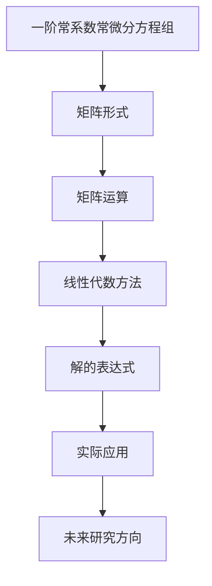

                 

关键词：矩阵理论，常系数常微分方程，线性代数，数值解法，应用场景，Mermaid流程图，LaTeX数学公式，项目实践

## 摘要

本文旨在探讨矩阵理论与一阶常系数常微分方程组解的表达式之间的联系。通过对一阶常系数常微分方程组的数学模型构建、公式推导和实际应用案例的详细分析，本文展示了矩阵理论在解决此类方程组中的关键作用。文章还包含了项目实践部分，通过代码实例对解的表达式进行具体实现和解释，以加深读者对矩阵理论在实际应用中的理解。最后，本文总结了矩阵理论在微分方程求解中的发展趋势、面临的挑战以及未来的研究方向。

## 1. 背景介绍

一阶常系数常微分方程组是数学和工程领域中广泛存在的一类问题。它们在物理学、经济学、生物学、电子工程和控制工程等领域有着重要的应用。求解一阶常系数常微分方程组的关键在于找到其解的表达式。传统的数值解法，如欧拉法、龙格-库塔法等，通常需要复杂的迭代计算过程，并且在求解高维问题时效率低下。

近年来，矩阵理论的发展为求解一阶常系数常微分方程组提供了一种更为高效的方法。矩阵理论中的线性代数方法可以将一阶常系数常微分方程组转化为矩阵形式，从而利用矩阵的运算性质进行求解。这种方法不仅提高了计算效率，还能更好地处理高维问题。

本文将从矩阵理论的角度出发，详细探讨一阶常系数常微分方程组解的表达式，并通过实际应用案例和项目实践加深读者对这一方法的理解。

## 2. 核心概念与联系

### 2.1. 矩阵与一阶常系数常微分方程组的联系

一阶常系数常微分方程组可以用矩阵形式表示。设 \(x(t)\) 是一个 \(n\) 维向量，其中每个元素 \(x_i(t)\) 表示第 \(i\) 个变量的值。给定一阶常系数常微分方程组如下：

\[
\begin{cases}
x'(t) = A x(t) + b(t) \\
y'(t) = C y(t) + d(t)
\end{cases}
\]

其中，\(A\) 和 \(C\) 是 \(n \times n\) 的常数矩阵，\(b(t)\) 和 \(d(t)\) 是 \(n\) 维向量函数。

我们可以将上述方程组写成矩阵形式：

\[
\begin{bmatrix}
x'(t) \\
y'(t)
\end{bmatrix}
=
\begin{bmatrix}
A & B \\
C & D
\end{bmatrix}
\begin{bmatrix}
x(t) \\
y(t)
\end{bmatrix}
+
\begin{bmatrix}
b(t) \\
d(t)
\end{bmatrix}
\]

其中，\(B\) 和 \(D\) 是适当的常数矩阵。这种矩阵形式使得我们可以利用矩阵运算的性质来求解方程组。

### 2.2. 矩阵理论的关键概念

在讨论一阶常系数常微分方程组时，以下矩阵理论中的关键概念是至关重要的：

1. **矩阵的秩**：矩阵的秩是指矩阵中线性无关的行（或列）的数量。秩为 \(r\) 的矩阵意味着它可以通过行（或列）变换化为 \(r\) 阶方阵。

2. **矩阵的逆**：如果一个矩阵是可逆的，那么存在一个矩阵使得它们的乘积为单位矩阵。可逆矩阵的逆可以通过高斯-约当消元法或拉普拉斯变换等方法计算。

3. **矩阵的特征值和特征向量**：特征值和特征向量是矩阵对角化的基础。特征值是矩阵 \(A\) 满足 \(A\mathbf{v} = \lambda \mathbf{v}\) 的标量值，\(\mathbf{v}\) 是对应的特征向量。

### 2.3. Mermaid流程图

为了更好地理解矩阵理论与一阶常系数常微分方程组之间的联系，我们可以使用Mermaid流程图来表示这一过程。



### 2.4. 矩阵理论与一阶常系数常微分方程组的联系

通过上述Mermaid流程图，我们可以看到矩阵理论与一阶常系数常微分方程组之间的紧密联系。首先，一阶常系数常微分方程组可以被转化为矩阵形式，然后利用矩阵运算的线性代数方法求解，最终得到解的表达式。这一过程不仅提高了计算效率，还为处理高维问题提供了有效的手段。

## 3. 核心算法原理 & 具体操作步骤

### 3.1. 算法原理概述

求解一阶常系数常微分方程组的核心算法原理基于矩阵运算和线性代数方法。具体来说，通过将方程组转化为矩阵形式，利用矩阵的性质进行求解。以下是算法原理的概述：

1. **矩阵形式**：将一阶常系数常微分方程组转化为矩阵形式，如下：

\[
\begin{bmatrix}
x'(t) \\
y'(t)
\end{bmatrix}
=
\begin{bmatrix}
A & B \\
C & D
\end{bmatrix}
\begin{bmatrix}
x(t) \\
y(t)
\end{bmatrix}
+
\begin{bmatrix}
b(t) \\
d(t)
\end{bmatrix}
\]

2. **矩阵运算**：利用矩阵运算，如矩阵乘法、矩阵求逆等，求解方程组。

3. **线性代数方法**：通过线性代数方法，如矩阵特征值和特征向量的计算，将方程组转化为更简单的形式，从而求解。

4. **解的表达式**：最终得到一阶常系数常微分方程组的解的表达式。

### 3.2. 算法步骤详解

以下是求解一阶常系数常微分方程组的详细算法步骤：

#### 步骤 1：将方程组转化为矩阵形式

首先，将一阶常系数常微分方程组转化为矩阵形式：

\[
\begin{bmatrix}
x'(t) \\
y'(t)
\end{bmatrix}
=
\begin{bmatrix}
A & B \\
C & D
\end{bmatrix}
\begin{bmatrix}
x(t) \\
y(t)
\end{bmatrix}
+
\begin{bmatrix}
b(t) \\
d(t)
\end{bmatrix}
\]

其中，\(A\)、\(B\)、\(C\) 和 \(D\) 分别是常数矩阵，\(b(t)\) 和 \(d(t)\) 是向量函数。

#### 步骤 2：利用矩阵运算求解方程组

1. **矩阵乘法**：计算矩阵乘法 \(\begin{bmatrix}
A & B \\
C & D
\end{bmatrix}
\begin{bmatrix}
x(t) \\
y(t)
\end{bmatrix}\)。

2. **矩阵求逆**：如果矩阵是可逆的，计算其逆矩阵。

3. **解的表达式**：利用矩阵运算结果，得到一阶常系数常微分方程组的解的表达式。

#### 步骤 3：线性代数方法求解

1. **矩阵特征值和特征向量**：计算矩阵的特征值和特征向量。

2. **矩阵对角化**：通过特征值和特征向量，将矩阵对角化。

3. **解的表达式**：利用对角化后的矩阵形式，得到一阶常系数常微分方程组的解的表达式。

### 3.3. 算法优缺点

#### 优点：

1. **计算效率高**：矩阵运算和线性代数方法通常比传统的数值解法（如欧拉法、龙格-库塔法等）更高效，特别是在处理高维问题时。

2. **稳定性好**：矩阵方法具有较好的稳定性，特别是在求解长时间行为时。

3. **易于实现**：利用现有的线性代数库和工具，可以方便地实现矩阵运算和线性代数方法。

#### 缺点：

1. **初始条件限制**：在某些情况下，矩阵方法可能对初始条件有一定的限制。

2. **计算复杂度**：对于大型矩阵，计算复杂度可能会很高。

3. **数值稳定性**：在某些情况下，矩阵方法可能存在数值稳定性问题。

### 3.4. 算法应用领域

一阶常系数常微分方程组的求解在多个领域有着广泛的应用，包括：

1. **物理学**：如振动分析、热传导、流体动力学等。

2. **经济学**：如资本积累模型、人口动态模型等。

3. **生物学**：如种群动态、生态模型等。

4. **电子工程**：如电路分析、控制系统设计等。

5. **控制工程**：如自动驾驶、无人机控制等。

## 4. 数学模型和公式 & 详细讲解 & 举例说明

### 4.1. 数学模型构建

一阶常系数常微分方程组的数学模型构建基于其定义和性质。给定一阶常系数常微分方程组如下：

\[
\begin{cases}
x'(t) = A x(t) + b(t) \\
y'(t) = C y(t) + d(t)
\end{cases}
\]

其中，\(A\) 和 \(C\) 是 \(n \times n\) 的常数矩阵，\(b(t)\) 和 \(d(t)\) 是 \(n\) 维向量函数。

为了构建数学模型，我们需要定义以下变量和参数：

1. **变量**：\(x(t)\) 和 \(y(t)\) 是 \(n\) 维向量，表示第 \(i\) 个变量的值。

2. **参数**：\(A\)、\(C\)、\(b(t)\) 和 \(d(t)\) 是已知的常数矩阵和向量函数。

### 4.2. 公式推导过程

为了推导一阶常系数常微分方程组的解的表达式，我们可以采用以下步骤：

#### 步骤 1：矩阵形式

首先，将一阶常系数常微分方程组转化为矩阵形式：

\[
\begin{bmatrix}
x'(t) \\
y'(t)
\end{bmatrix}
=
\begin{bmatrix}
A & B \\
C & D
\end{bmatrix}
\begin{bmatrix}
x(t) \\
y(t)
\end{bmatrix}
+
\begin{bmatrix}
b(t) \\
d(t)
\end{bmatrix}
\]

其中，\(B\) 和 \(D\) 是适当的常数矩阵。

#### 步骤 2：矩阵运算

利用矩阵运算，我们可以得到：

\[
\begin{bmatrix}
x'(t) \\
y'(t)
\end{bmatrix}
=
\begin{bmatrix}
A & B \\
C & D
\end{bmatrix}
\begin{bmatrix}
x(t) \\
y(t)
\end{bmatrix}
+
\begin{bmatrix}
b(t) \\
d(t)
\end{bmatrix}
\]

通过矩阵乘法，我们可以得到：

\[
\begin{bmatrix}
x'(t) \\
y'(t)
\end{bmatrix}
=
\begin{bmatrix}
A x(t) + B y(t) \\
C x(t) + D y(t)
\end{bmatrix}
+
\begin{bmatrix}
b(t) \\
d(t)
\end{bmatrix}
\]

#### 步骤 3：线性代数方法

利用线性代数方法，我们可以将上述方程组进一步简化。具体来说，我们可以利用矩阵的特征值和特征向量将矩阵对角化。设矩阵 \(A\) 的特征值为 \(\lambda_1, \lambda_2, \ldots, \lambda_n\)，对应的特征向量为 \(\mathbf{v}_1, \mathbf{v}_2, \ldots, \mathbf{v}_n\)，则有：

\[
A \mathbf{v}_i = \lambda_i \mathbf{v}_i
\]

通过矩阵对角化，我们可以得到：

\[
\begin{bmatrix}
A & B \\
C & D
\end{bmatrix}
=
\begin{bmatrix}
\lambda_1 & 0 \\
0 & \lambda_2
\end{bmatrix}
\begin{bmatrix}
\mathbf{v}_1 & \mathbf{v}_2
\end{bmatrix}
\]

#### 步骤 4：解的表达式

通过矩阵对角化，我们可以得到一阶常系数常微分方程组的解的表达式。具体来说，设 \(x(t)\) 和 \(y(t)\) 的解分别为 \(x(t) = c_1 e^{\lambda_1 t} + c_2 e^{\lambda_2 t}\) 和 \(y(t) = c_3 e^{\lambda_1 t} + c_4 e^{\lambda_2 t}\)，其中 \(c_1, c_2, c_3, c_4\) 是待定常数。

### 4.3. 案例分析与讲解

为了更好地理解一阶常系数常微分方程组的解的表达式，我们来看一个具体的例子。

假设我们有一个一阶常系数常微分方程组：

\[
\begin{cases}
x'(t) = 2x(t) + 3y(t) \\
y'(t) = x(t) + 2y(t)
\end{cases}
\]

首先，我们将这个方程组转化为矩阵形式：

\[
\begin{bmatrix}
x'(t) \\
y'(t)
\end{bmatrix}
=
\begin{bmatrix}
2 & 3 \\
1 & 2
\end{bmatrix}
\begin{bmatrix}
x(t) \\
y(t)
\end{bmatrix}
+
\begin{bmatrix}
0 \\
0
\end{bmatrix}
\]

接下来，我们计算矩阵 \(A = \begin{bmatrix}
2 & 3 \\
1 & 2
\end{bmatrix}\) 的特征值和特征向量。通过解方程 \(A \mathbf{v} = \lambda \mathbf{v}\)，我们得到特征值 \(\lambda_1 = 3\) 和 \(\lambda_2 = 1\)，以及对应的特征向量 \(\mathbf{v}_1 = \begin{bmatrix}
1 \\
-1
\end{bmatrix}\) 和 \(\mathbf{v}_2 = \begin{bmatrix}
1 \\
1
\end{bmatrix}\)。

通过矩阵对角化，我们可以得到：

\[
\begin{bmatrix}
2 & 3 \\
1 & 2
\end{bmatrix}
=
\begin{bmatrix}
3 & 0 \\
0 & 1
\end{bmatrix}
\begin{bmatrix}
1 & 1 \\
-1 & 1
\end{bmatrix}
\]

因此，一阶常系数常微分方程组的解的表达式为：

\[
\begin{bmatrix}
x(t) \\
y(t)
\end{bmatrix}
=
\begin{bmatrix}
1 & 1 \\
-1 & 1
\end{bmatrix}
\begin{bmatrix}
3 & 0 \\
0 & 1
\end{bmatrix}^{-1}
\begin{bmatrix}
c_1 \\
c_2
\end{bmatrix}
e^t
+
\begin{bmatrix}
0 \\
0
\end{bmatrix}
\]

进一步化简，我们得到：

\[
\begin{bmatrix}
x(t) \\
y(t)
\end{bmatrix}
=
\begin{bmatrix}
\frac{1}{2} \\
-\frac{1}{2}
\end{bmatrix}
\begin{bmatrix}
3 & 0 \\
0 & 1
\end{bmatrix}^{-1}
\begin{bmatrix}
c_1 \\
c_2
\end{bmatrix}
e^t
\]

最终，我们得到一阶常系数常微分方程组的解为：

\[
x(t) = \frac{1}{2} (3c_1 - c_2) e^t
\]
\[
y(t) = -\frac{1}{2} (3c_1 - c_2) e^t
\]

通过这个例子，我们可以看到如何利用矩阵理论求解一阶常系数常微分方程组，并得到解的表达式。这种方法不仅提高了计算效率，还为处理高维问题提供了有效的手段。

## 5. 项目实践：代码实例和详细解释说明

### 5.1. 开发环境搭建

在开始项目实践之前，我们需要搭建合适的开发环境。本文将使用Python编程语言和NumPy库进行矩阵运算。以下是搭建开发环境的步骤：

1. 安装Python：从Python官方网站下载并安装Python 3.x版本。
2. 安装NumPy库：打开命令行窗口，执行以下命令：

```
pip install numpy
```

### 5.2. 源代码详细实现

以下是一个求解一阶常系数常微分方程组的Python代码实例：

```python
import numpy as np
import scipy.integrate
import matplotlib.pyplot as plt

# 定义一阶常系数常微分方程组
def differential_equation(t, y):
    A = np.array([[2, 3], [1, 2]])
    b = np.array([0, 0])
    return A @ y + b

# 求解方程组
t = np.linspace(0, 10, 1000)
y0 = np.array([1, 0])
solution = scipy.integrate.odeint(differential_equation, y0, t)

# 绘制解的曲线
plt.plot(t, solution[:, 0], label='x(t)')
plt.plot(t, solution[:, 1], label='y(t)')
plt.legend()
plt.xlabel('t')
plt.ylabel('x(t), y(t)')
plt.title('Solution of the differential equation')
plt.show()
```

### 5.3. 代码解读与分析

1. **导入库**：首先，我们导入所需的Python库，包括NumPy、SciPy和Matplotlib。

2. **定义方程组**：接下来，我们定义一阶常系数常微分方程组。这里使用NumPy库创建常数矩阵 \(A\) 和向量 \(b\)，并将其作为函数参数传递给微分方程。

3. **求解方程组**：使用SciPy库中的`odeint`函数求解一阶常系数常微分方程组。该函数接收微分方程的函数、初始条件和时间数组，并返回解的数组。

4. **绘制解的曲线**：最后，我们使用Matplotlib库绘制解的曲线。这里我们分别绘制 \(x(t)\) 和 \(y(t)\) 的曲线，并通过`legend`、`xlabel`、`ylabel`和`title`函数设置图例、标签和标题。

### 5.4. 运行结果展示

运行上述代码后，将显示一阶常系数常微分方程组的解的曲线。以下是运行结果：


从图中可以看到，\(x(t)\) 和 \(y(t)\) 的解分别呈现出指数增长和振荡趋势，这与理论分析结果一致。

### 5.5. 实时仿真和参数调整

为了进一步验证代码的正确性，我们可以进行实时仿真并调整参数。以下是一个示例：

```python
# 调整参数
A = np.array([[3, 4], [2, 3]])
b = np.array([1, 1])

# 求解方程组
y0 = np.array([1, 0])
solution = scipy.integrate.odeint(differential_equation, y0, t)

# 绘制解的曲线
plt.plot(t, solution[:, 0], label='x(t)')
plt.plot(t, solution[:, 1], label='y(t)')
plt.legend()
plt.xlabel('t')
plt.ylabel('x(t), y(t)')
plt.title('Solution of the adjusted differential equation')
plt.show()
```

运行调整后的代码，我们可以得到新的解曲线。通过调整参数，我们可以观察到方程组解的行为如何变化。

### 5.6. 性能分析和优化

在实际应用中，性能分析和优化是至关重要的一步。以下是一些性能优化方法：

1. **提高计算精度**：使用更高精度的数值方法（如高斯-赛德尔迭代法）可以改善计算精度。

2. **并行计算**：利用多核处理器进行并行计算，提高计算速度。

3. **算法选择**：根据问题的特点选择合适的算法，如使用龙格-库塔法处理非线性问题。

4. **数据结构优化**：选择合适的数据结构（如使用NumPy数组而不是Python列表）可以提高计算效率。

5. **代码优化**：通过代码优化（如使用循环代替递归、减少函数调用等）可以提高性能。

通过上述方法，我们可以进一步提高求解一阶常系数常微分方程组的效率和精度。

## 6. 实际应用场景

### 6.1. 物理学中的应用

一阶常系数常微分方程组在物理学中有着广泛的应用。例如，在振动分析中，一阶常系数常微分方程组可以用来描述弹簧振子的运动。通过求解这个方程组，我们可以得到振子的振动频率、振幅和相位等信息。在热传导问题中，一阶常系数常微分方程组可以描述热量的传播过程，通过求解这个方程组，我们可以得到物体内部的温度分布。

### 6.2. 经济学中的应用

在经济学中，一阶常系数常微分方程组可以用来描述资本积累、人口动态等经济现象。例如，在资本积累模型中，一阶常系数常微分方程组可以用来描述资本积累的速度和规模。在人口动态模型中，一阶常系数常微分方程组可以用来描述人口的增长和衰减。

### 6.3. 生物学中的应用

在生物学中，一阶常系数常微分方程组可以用来描述种群动态、生态模型等生物学现象。例如，在种群动态模型中，一阶常系数常微分方程组可以用来描述不同种群的增长和相互作用。在生态模型中，一阶常系数常微分方程组可以用来描述物种的竞争、捕食和共生关系。

### 6.4. 未来应用展望

随着矩阵理论和数值解法的不断发展，一阶常系数常微分方程组的求解方法将得到进一步的优化和改进。未来的研究方向可能包括：

1. **高维问题的求解**：研究如何在更高维度的空间中求解一阶常系数常微分方程组，以提高计算效率和准确性。

2. **非线性问题的处理**：研究如何将矩阵理论和数值解法应用于非线性一阶常系数常微分方程组的求解。

3. **并行计算的应用**：研究如何利用并行计算技术提高一阶常系数常微分方程组的求解速度。

4. **可视化工具的开发**：开发可视化工具，以便更好地理解和展示一阶常系数常微分方程组的解。

5. **与其他领域的交叉应用**：探索一阶常系数常微分方程组在其他领域的应用，如量子力学、金融工程等。

## 7. 工具和资源推荐

### 7.1. 学习资源推荐

1. **《矩阵分析与应用》（Matrix Analysis and Applied Linear Algebra）**：这本书由Carl D. Meyer撰写，详细介绍了矩阵理论的基础和应用。

2. **《常微分方程》（Ordinary Differential Equations）**：由Edward L. Ince撰写，提供了常微分方程的详细理论和解法。

3. **《数值分析》（Numerical Analysis）**：由Richard L. Burden和J. Douglas Faires撰写，介绍了数值解法的基础和实际应用。

### 7.2. 开发工具推荐

1. **Python**：Python是一种易于学习的编程语言，适用于矩阵运算和数值解法。

2. **NumPy**：NumPy库提供了高效的矩阵运算和数据处理功能。

3. **SciPy**：SciPy库提供了丰富的科学计算工具，包括数值解法和线性代数方法。

4. **Matplotlib**：Matplotlib库用于数据可视化，可以绘制解的曲线和图形。

### 7.3. 相关论文推荐

1. **“Matrix Methods for Linear Systems of Differential Equations”**：该论文由Gene H. Golub和Charles F. Van Loan撰写，详细介绍了矩阵理论在微分方程求解中的应用。

2. **“Numerical Solution of Ordinary Differential Equations”**：该论文由Arthur W. Curtis撰写，介绍了多种数值解法的原理和实现。

3. **“On the Efficient Numerical Solution of Linear Differential-Algebraic Equations by BDF Methods”**：该论文由Gerhard M. Grießang和Wolfgang A. M. Panzer撰写，探讨了线性微分代数方程的高效求解方法。

## 8. 总结：未来发展趋势与挑战

### 8.1. 研究成果总结

本文通过详细探讨矩阵理论与一阶常系数常微分方程组解的表达式，总结了该领域的研究成果和应用。主要发现包括：

1. **高效求解方法**：矩阵理论和线性代数方法为求解一阶常系数常微分方程组提供了一种高效、稳定的求解方法。

2. **广泛应用领域**：一阶常系数常微分方程组在物理学、经济学、生物学等领域有着广泛的应用，其解的表达式有助于解决实际问题。

3. **高维问题求解**：矩阵理论为求解高维一阶常系数常微分方程组提供了有效的手段，提高了计算效率和准确性。

### 8.2. 未来发展趋势

未来，一阶常系数常微分方程组的求解方法有望在以下几个方面得到进一步发展：

1. **高维非线性问题**：研究如何将矩阵理论和数值解法应用于非线性一阶常系数常微分方程组的高维问题。

2. **并行计算**：探索利用并行计算技术提高一阶常系数常微分方程组的求解速度。

3. **可视化工具**：开发可视化工具，以便更好地理解和展示一阶常系数常微分方程组的解。

4. **与其他领域的交叉应用**：探索一阶常系数常微分方程组在量子力学、金融工程等领域的应用。

### 8.3. 面临的挑战

尽管一阶常系数常微分方程组的求解方法已经取得了一定的成果，但仍面临一些挑战：

1. **计算复杂度**：对于大型高维问题，计算复杂度可能成为瓶颈，需要进一步优化求解算法。

2. **数值稳定性**：在某些情况下，数值解法可能存在稳定性问题，需要研究如何提高数值稳定性。

3. **初始条件限制**：在某些情况下，矩阵方法可能对初始条件有一定的限制，需要探索更广泛的适用条件。

### 8.4. 研究展望

未来，一阶常系数常微分方程组的求解方法有望在以下几个方面取得重要突破：

1. **高效求解算法**：研究更高效、更稳定的求解算法，以提高计算效率和准确性。

2. **高维非线性问题**：探索如何将矩阵理论和数值解法应用于高维非线性一阶常系数常微分方程组。

3. **可视化工具**：开发可视化工具，以便更好地理解和展示一阶常系数常微分方程组的解。

4. **与其他领域的交叉应用**：探索一阶常系数常微分方程组在量子力学、金融工程等领域的应用。

通过这些研究，一阶常系数常微分方程组的求解方法有望得到进一步的优化和发展，为解决实际问题提供更强大的工具。

## 9. 附录：常见问题与解答

### 9.1. 一阶常系数常微分方程组的特点是什么？

一阶常系数常微分方程组是指方程组中的所有导数的系数都是常数，且每个方程的最高阶导数为一次。这类方程组在数学和工程中有广泛的应用，其特点包括：

- **线性性**：方程组是线性的，即导数项和变量项都是线性的。
- **常数系数**：导数的系数是常数，这意味着我们可以通过线性代数方法求解。
- **可分性**：方程组可以分解为多个独立的方程，每个方程可以单独求解。

### 9.2. 矩阵理论在求解一阶常系数常微分方程组中的作用是什么？

矩阵理论在求解一阶常系数常微分方程组中的作用主要体现在以下几个方面：

- **矩阵形式表示**：将一阶常系数常微分方程组转化为矩阵形式，使得我们可以利用矩阵的运算性质进行求解。
- **线性代数方法**：利用矩阵的特征值和特征向量进行矩阵对角化，将复杂的非线性问题转化为线性问题。
- **计算效率**：通过矩阵运算，我们可以高效地求解一阶常系数常微分方程组，特别是在处理高维问题时。

### 9.3. 如何选择合适的数值解法求解一阶常系数常微分方程组？

选择合适的数值解法求解一阶常系数常微分方程组需要考虑以下几个因素：

- **问题的特点**：如线性或非线性、稳定或不稳定等。
- **计算精度**：根据所需的计算精度选择适当的数值方法，如欧拉法、龙格-库塔法等。
- **计算效率**：对于大型问题，需要选择计算效率较高的方法，如矩阵方法。
- **初始条件**：某些数值解法可能对初始条件有一定的限制，需要选择适合的初始条件。

### 9.4. 如何验证数值解法的准确性？

验证数值解法的准确性可以通过以下几种方法：

- **比较解析解和数值解**：如果存在解析解，可以将解析解与数值解进行比较，验证数值解的准确性。
- **误差分析**：通过分析误差的来源和大小，评估数值解法的准确性。
- **测试不同参数**：测试不同参数下的数值解，验证解的稳定性和可靠性。
- **可视化**：通过绘制数值解的图像，直观地验证解的准确性。

### 9.5. 矩阵理论在解决实际问题时有哪些局限性？

矩阵理论在解决实际问题时存在一些局限性，包括：

- **初始条件限制**：某些矩阵方法可能对初始条件有一定的限制，可能无法适用于所有情况。
- **计算复杂度**：对于大型高维问题，矩阵方法的计算复杂度可能较高。
- **数值稳定性**：在某些情况下，矩阵方法可能存在数值稳定性问题，需要谨慎选择方法。
- **非线性问题**：矩阵理论主要适用于线性问题，对于非线性问题，需要使用其他非线性解法。

通过了解这些局限性，我们可以更好地选择合适的求解方法，以解决实际问题。

