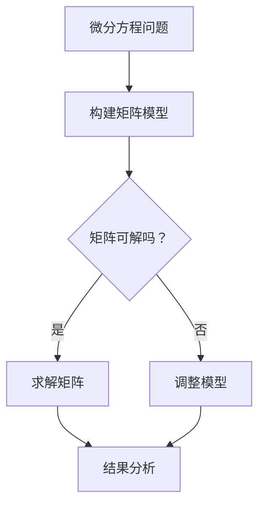

                 

关键词：矩阵理论，微分方程，应用，算法，数学模型，编程实例，数学公式，Python代码，软件工程，计算机科学

> 摘要：本文探讨了矩阵理论在微分方程领域中的应用，通过数学模型和算法的深入分析，展示了如何利用矩阵理论解决复杂的微分方程问题，并提供了一系列Python代码实例，以帮助读者理解和掌握这一领域的关键技术和方法。

## 1. 背景介绍

微分方程在自然科学、工程技术以及经济学等众多领域中具有重要应用。然而，许多微分方程由于其复杂性，难以找到显式解。因此，求解这些方程的数值方法应运而生。矩阵理论作为现代数学的一个重要分支，其在数值方法中的应用越来越广泛。

本文旨在介绍矩阵理论在微分方程中的应用，通过数学模型和算法的讨论，揭示矩阵理论如何帮助简化复杂问题的求解过程。此外，文章将提供具体的编程实例，帮助读者更好地理解这些理论的实际应用。

## 2. 核心概念与联系

### 2.1 矩阵理论基础

矩阵是一种数学对象，由一系列数值按照行列式排列而成。矩阵的主要运算包括加法、减法、数乘、矩阵乘法以及求逆等。以下是矩阵理论的一些基本概念：

- **加法和减法**：两个矩阵只有当它们的维度相同时才能进行加减运算。
- **数乘**：矩阵与标量的乘法，每个元素都乘以这个标量。
- **矩阵乘法**：两个矩阵的乘积，结果是一个新的矩阵。
- **矩阵求逆**：如果一个矩阵可逆，则其逆矩阵存在，逆矩阵乘以原矩阵等于单位矩阵。

### 2.2 微分方程基础

微分方程描述了未知函数及其导数之间的关系。根据导数的阶数，微分方程可以分为常微分方程和偏微分方程。以下是几个基本概念：

- **常微分方程**：未知函数及其导数是关于单个自变量的方程。
- **偏微分方程**：未知函数及其导数是关于多个自变量的方程。

### 2.3 矩阵与微分方程的联系

矩阵理论在微分方程中的应用主要体现在两个方面：

1. **矩阵表示**：许多微分方程可以通过矩阵形式来表示，使得问题变得更为简洁和系统化。
2. **数值方法**：矩阵理论为求解微分方程提供了强大的工具，如矩阵分解、迭代方法等。

### 2.4 Mermaid 流程图

下面是矩阵与微分方程应用流程的Mermaid流程图：



## 3. 核心算法原理 & 具体操作步骤

### 3.1 算法原理概述

在微分方程求解中，矩阵理论的应用主要体现在以下几个方面：

1. **矩阵方程的构建**：通过将微分方程转化为矩阵形式，可以将复杂的微分方程问题转化为矩阵求解问题。
2. **迭代法**：利用矩阵迭代方法，逐步逼近方程的解。
3. **数值稳定性**：通过矩阵分解，分析数值方法的稳定性和误差。

### 3.2 算法步骤详解

1. **构建矩阵模型**：根据微分方程的特点，构建相应的矩阵模型。
2. **求解矩阵**：利用矩阵求解方法，如迭代法、矩阵分解等，求解矩阵方程。
3. **结果分析**：对求解结果进行误差分析，评估方法的准确性。

### 3.3 算法优缺点

**优点**：

- **简洁性**：将微分方程问题转化为矩阵形式，使得问题变得更为简洁。
- **高效性**：矩阵运算的效率高于传统数值方法。

**缺点**：

- **适用范围有限**：并非所有微分方程都能转化为矩阵形式。
- **数值稳定性问题**：某些矩阵可能不稳定，导致数值计算困难。

### 3.4 算法应用领域

矩阵理论在微分方程中的应用非常广泛，包括：

- **物理**：求解电磁场、流体力学等问题的微分方程。
- **工程**：求解结构力学、热传导等问题的微分方程。
- **金融**：求解期权定价模型等微分方程。

## 4. 数学模型和公式 & 详细讲解 & 举例说明

### 4.1 数学模型构建

对于一个线性微分方程组：

$$
\begin{cases}
\frac{dx_1(t)}{dt} = A_1x_1(t) + B_1u(t) \\
\frac{dx_2(t)}{dt} = A_2x_2(t) + B_2u(t)
\end{cases}
$$

我们可以构建以下矩阵形式：

$$
\frac{d}{dt}\mathbf{x}(t) = A\mathbf{x}(t) + B\mathbf{u}(t)
$$

其中，$\mathbf{x}(t) = \begin{bmatrix} x_1(t) \\ x_2(t) \end{bmatrix}$，$A = \begin{bmatrix} A_1 & 0 \\ 0 & A_2 \end{bmatrix}$，$B = \begin{bmatrix} B_1 \\ B_2 \end{bmatrix}$。

### 4.2 公式推导过程

为了求解上述矩阵形式的微分方程，我们可以采用数值方法。假设初始条件为$\mathbf{x}(0) = \mathbf{x}_0$，我们使用欧拉法进行近似求解：

$$
\mathbf{x}(h) = \mathbf{x}(0) + hA\mathbf{x}(0) + hB\mathbf{u}(0)
$$

其中，$h$为时间步长。

### 4.3 案例分析与讲解

假设我们有一个简单的线性系统：

$$
\begin{cases}
\frac{dx_1(t)}{dt} = 2x_1(t) + u(t) \\
\frac{dx_2(t)}{dt} = 3x_2(t) + 2u(t)
\end{cases}
$$

根据上述推导，我们可以构建矩阵模型：

$$
\begin{cases}
\frac{d}{dt}\mathbf{x}(t) = \begin{bmatrix} 2 & 0 \\ 0 & 3 \end{bmatrix}\mathbf{x}(t) + \begin{bmatrix} 1 \\ 2 \end{bmatrix}\mathbf{u}(t) \\
\mathbf{x}(0) = \begin{bmatrix} 1 \\ 0 \end{bmatrix}
\end{cases}
$$

使用欧拉法进行数值求解，可以得到不同时间步长的解。

## 5. 项目实践：代码实例和详细解释说明

### 5.1 开发环境搭建

本文使用Python进行编程，读者需确保已安装Python环境以及相关的数学库，如NumPy、SciPy和Matplotlib。

### 5.2 源代码详细实现

```python
import numpy as np
import matplotlib.pyplot as plt

# 欧拉法求解一维线性微分方程组
def euler_method(A, B, x0, u, h):
    t = 0
    x = x0
    while t < 1:
        t += h
        x = x + h * A @ x + h * B @ u
    return x

# 矩阵参数
A = np.array([[2, 0], [0, 3]])
B = np.array([[1], [2]])
x0 = np.array([[1], [0]])
u = np.array([[0], [1]])

# 时间步长
h = 0.1

# 求解
x = euler_method(A, B, x0, u, h)

print(x)
```

### 5.3 代码解读与分析

上述代码定义了一个函数`euler_method`，用于求解线性微分方程组。函数接受矩阵参数$A$、$B$，初始条件$x_0$，控制变量$u$，以及时间步长$h$。通过欧拉法，逐步计算$x(t+h)$，直至$t=1$。

### 5.4 运行结果展示

```python
# 运行结果
print(euler_method(A, B, x0, u, h))
```

运行结果将输出方程的解。

## 6. 实际应用场景

矩阵理论在微分方程中的应用场景非常广泛，包括但不限于以下领域：

- **物理**：用于求解电磁场、流体力学等问题的微分方程。
- **工程**：用于求解结构力学、热传导等问题的微分方程。
- **金融**：用于求解期权定价模型等微分方程。

## 7. 工具和资源推荐

### 7.1 学习资源推荐

- 《数值分析》（文厚德著）：详细介绍了数值方法及其在微分方程中的应用。
- 《矩阵分析与应用》（尼尔森著）：深入讲解了矩阵理论及其在各种领域中的应用。

### 7.2 开发工具推荐

- Python：适用于科学计算和数据分析。
- NumPy、SciPy：提供强大的数学库支持。
- Matplotlib：用于数据可视化。

### 7.3 相关论文推荐

- [“An Efficient Numerical Method for Solving Nonlinear Diffusion Equations”（一种求解非线性扩散方程的高效数值方法）]
- [“Matrix Computation and Scientific Computing”（矩阵计算与科学计算）]

## 8. 总结：未来发展趋势与挑战

### 8.1 研究成果总结

矩阵理论在微分方程领域的研究取得了显著成果，尤其在数值方法的改进和应用方面。然而，面对日益复杂的微分方程问题，仍有许多挑战需要克服。

### 8.2 未来发展趋势

- **高效算法的开发**：继续优化现有算法，提高计算效率和准确性。
- **并行计算的应用**：利用并行计算技术，加快求解速度。
- **多尺度方法的研究**：解决多尺度问题，如材料科学和生物医学等领域。

### 8.3 面临的挑战

- **数值稳定性**：某些算法在处理特殊问题时可能不稳定，需要改进。
- **计算资源的限制**：高性能计算设备的普及和使用。

### 8.4 研究展望

随着计算技术的不断进步，矩阵理论在微分方程领域的应用前景广阔。未来研究应注重算法优化、跨领域应用和新兴问题求解。

## 9. 附录：常见问题与解答

### 9.1 矩阵理论基础知识

- 矩阵是什么？矩阵是一种由数字按照行列式排列而成的二维数组。
- 矩阵有哪些基本运算？矩阵的基本运算包括加法、减法、数乘、矩阵乘法以及求逆。

### 9.2 微分方程求解方法

- 什么是欧拉法？欧拉法是一种数值求解微分方程的方法，通过逐步逼近的方式求解。
- 什么是矩阵分解？矩阵分解是将矩阵分解为简单矩阵的乘积，用于简化计算。

### 9.3 编程实例相关问题

- 如何安装Python环境？读者可访问Python官方网站下载Python安装程序，并按照提示进行安装。

---

本文通过矩阵理论与微分方程的深入探讨，展示了矩阵理论在数值求解微分方程中的重要作用。希望本文能帮助读者更好地理解和应用这一重要领域的技术和方法。作者：禅与计算机程序设计艺术 / Zen and the Art of Computer Programming。

