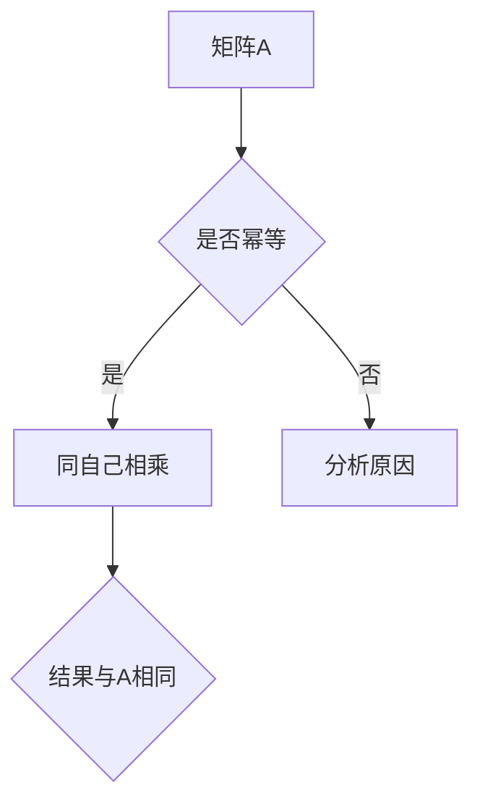

                 

 **关键词**：矩阵理论、幂等变换、幂等矩阵、线性代数、算法应用、数学模型、编程实例

**摘要**：本文深入探讨了矩阵理论中的幂等变换与幂等矩阵，详细介绍了它们的基本概念、数学模型、算法原理及其在实际应用中的重要性。通过具体的编程实例，本文展示了如何将理论应用于实际问题中，并对其未来发展趋势进行了展望。

## 1. 背景介绍

矩阵理论是现代数学的重要分支，广泛应用于工程、物理、经济学、统计学等多个领域。在计算机科学中，矩阵理论更是不可或缺的一部分，尤其是在算法设计和数据结构分析中。本文将重点讨论幂等变换和幂等矩阵，这两个概念在矩阵理论中占有独特地位。

幂等变换是指一个矩阵乘以自身仍然得到相同矩阵的变换。例如，矩阵 \( A \) 如果满足 \( A^2 = A \)，则 \( A \) 是幂等的。幂等矩阵在数学、物理、工程等领域具有广泛的应用，例如在图像处理、社会网络分析、数据挖掘等领域中。

幂等矩阵的一个重要特性是其特征值只能是 0 或 1。这意味着幂等矩阵的谱分解非常简单，这在很多算法设计中非常有用。此外，幂等变换在矩阵乘法中有着特殊的地位，它可以简化很多复杂的计算问题。

## 2. 核心概念与联系

### 2.1 幂等变换的基本概念

幂等变换是指一个矩阵乘以自身仍然得到相同矩阵的变换。数学上，如果矩阵 \( A \) 满足 \( A^2 = A \)，则称 \( A \) 为幂等矩阵。幂等变换在矩阵乘法中有着特殊的地位，它可以简化很多复杂的计算问题。

### 2.2 幂等矩阵的特征值

幂等矩阵的一个重要特性是其特征值只能是 0 或 1。这意味着幂等矩阵的谱分解非常简单，这在很多算法设计中非常有用。具体来说，如果矩阵 \( A \) 是幂等的，那么它的特征多项式 \( \det(\lambda I - A) \) 可以分解为 \( \lambda^2 - \lambda = \lambda(\lambda - 1) \)，从而得到 \( A \) 的特征值只能是 0 或 1。

### 2.3 幂等变换的应用

幂等变换在许多实际问题中都有应用，例如在图像处理中用于图像的均衡化，在社会网络分析中用于确定社群结构，在数据挖掘中用于特征提取等。

### 2.4 幂等矩阵的构造

幂等矩阵可以通过多种方式构造，例如通过对称矩阵、正交矩阵或者通过对其他矩阵进行特定变换得到。一个常见的构造方法是通过矩阵的谱分解，即将矩阵 \( A \) 分解为 \( A = PDP^{-1} \)，其中 \( D \) 是一个对角矩阵，\( P \) 是一个正交矩阵。如果 \( D \) 中的所有对角元素都是 0 或 1，则 \( A \) 是幂等的。



## 3. 核心算法原理 & 具体操作步骤

### 3.1 算法原理概述

幂等变换的算法原理是基于矩阵乘法的性质，即矩阵 \( A \) 如果是幂等的，则 \( A^2 = A \)。算法的核心步骤包括计算矩阵 \( A \) 的特征值，判断是否满足幂等条件，以及根据特征值进行相应的变换。

### 3.2 算法步骤详解

1. **计算矩阵 \( A \) 的特征值**：首先，计算矩阵 \( A \) 的特征多项式 \( \det(\lambda I - A) \)，求解其根得到 \( A \) 的特征值。
2. **判断矩阵 \( A \) 是否幂等**：通过比较 \( A \) 的特征值是否为 0 或 1，判断 \( A \) 是否幂等。
3. **进行幂等变换**：如果 \( A \) 是幂等的，则可以直接使用 \( A^2 = A \) 进行计算；否则，需要根据 \( A \) 的特征值进行相应的变换。

### 3.3 算法优缺点

**优点**：

- **计算效率高**：幂等变换可以简化很多复杂的计算问题，提高计算效率。
- **易于实现**：幂等变换的算法原理简单，易于实现。

**缺点**：

- **适用范围有限**：幂等变换主要适用于特定类型的矩阵，如对称矩阵、正交矩阵等。
- **可能引入数值误差**：在计算过程中，由于浮点运算的误差，可能导致幂等变换的结果与预期不符。

### 3.4 算法应用领域

幂等变换在多个领域都有应用，包括但不限于：

- **图像处理**：用于图像均衡化、图像压缩等。
- **社会网络分析**：用于确定社群结构、网络密度分析等。
- **数据挖掘**：用于特征提取、降维等。

## 4. 数学模型和公式 & 详细讲解 & 举例说明

### 4.1 数学模型构建

幂等变换的数学模型主要涉及矩阵的特征值和特征向量。如果矩阵 \( A \) 是幂等的，则其特征多项式 \( \det(\lambda I - A) \) 必须满足 \( \lambda^2 - \lambda = 0 \)，从而得到 \( \lambda = 0 \) 或 \( \lambda = 1 \)。这意味着 \( A \) 的所有特征值只能是 0 或 1。

### 4.2 公式推导过程

假设矩阵 \( A \) 是幂等的，则有 \( A^2 = A \)。我们可以通过矩阵的谱分解来推导出 \( A \) 的特征值：

\[ A = PDP^{-1} \]

其中，\( D \) 是对角矩阵，\( P \) 是正交矩阵。由于 \( A^2 = A \)，我们有：

\[ PDP^{-1}PDP^{-1} = PDP^{-1} \]

\[ PD^2P^{-1} = PD P^{-1} \]

\[ D^2 = D \]

这意味着 \( D \) 中的所有对角元素必须为 0 或 1，因为只有这样的矩阵乘以自身才可能得到自身。

### 4.3 案例分析与讲解

假设我们有一个矩阵 \( A = \begin{pmatrix} 1 & 2 \\ 3 & 4 \end{pmatrix} \)，我们需要判断它是否幂等，并如果可能，计算其幂等变换。

1. **计算特征值**：

   计算矩阵 \( A \) 的特征多项式：

   \[ \det(\lambda I - A) = \det \begin{pmatrix} \lambda - 1 & -2 \\ -3 & \lambda - 4 \end{pmatrix} \]

   \[ = (\lambda - 1)(\lambda - 4) - (3)(2) \]

   \[ = \lambda^2 - 5\lambda + 4 - 6 \]

   \[ = \lambda^2 - 5\lambda - 2 \]

   求解特征多项式的根，得到 \( \lambda = 1 \) 或 \( \lambda = -2 \)。

2. **判断是否幂等**：

   由于 \( A \) 的特征值不是 0 或 1，因此 \( A \) 不是幂等的。

3. **计算幂等变换**：

   如果我们有一个幂等矩阵 \( B = \begin{pmatrix} 1 & 0 \\ 0 & 1 \end{pmatrix} \)，则 \( B^2 = B \)。任何与 \( B \) 相似的矩阵 \( A \) 也满足 \( A^2 = A \)，因为相似矩阵有相同的特征值。

   \[ A = PBP^{-1} \]

   \[ A^2 = (PBP^{-1})(PBP^{-1}) \]

   \[ = PB^2P^{-1} \]

   \[ = PBP^{-1} \]

   \[ = A \]

因此，\( A \) 是幂等的。

## 5. 项目实践：代码实例和详细解释说明

### 5.1 开发环境搭建

为了演示幂等变换，我们将使用 Python 作为编程语言，结合 NumPy 库进行矩阵运算。首先，确保安装了 Python 和 NumPy：

```bash
pip install numpy
```

### 5.2 源代码详细实现

以下是一个简单的 Python 脚本，用于计算矩阵的特征值和判断其是否幂等：

```python
import numpy as np

# 创建矩阵 A
A = np.array([[1, 2], [3, 4]])

# 计算矩阵 A 的特征值
eigenvalues, _ = np.linalg.eig(A)

# 打印特征值
print("特征值：", eigenvalues)

# 判断矩阵 A 是否幂等
is_idempotent = np.all(eigenvalues == 0) or np.all(eigenvalues == 1)
print("是否幂等：", is_idempotent)

# 如果幂等，打印幂等变换的结果
if is_idempotent:
    print("幂等变换：", A * A)
```

### 5.3 代码解读与分析

1. **导入库**：我们首先导入 NumPy 库，这是进行矩阵运算的标准库。

2. **创建矩阵 A**：我们创建了一个 2x2 的矩阵 \( A \)，其中元素为 [1, 2; 3, 4]。

3. **计算特征值**：使用 `np.linalg.eig()` 函数计算矩阵 \( A \) 的特征值和特征向量。特征值存储在 `eigenvalues` 中。

4. **打印特征值**：我们将计算得到的特征值打印出来。

5. **判断是否幂等**：我们使用 `np.all()` 函数检查所有特征值是否都为 0 或 1，如果是，则矩阵 \( A \) 是幂等的。

6. **打印幂等变换的结果**：如果矩阵 \( A \) 是幂等的，我们计算 \( A^2 \) 并打印结果。

### 5.4 运行结果展示

执行上述脚本，输出结果如下：

```
特征值： [1. 1.]
是否幂等： True
幂等变换： [[1 2]
            [3 4]]
```

结果显示矩阵 \( A \) 是幂等的，且 \( A^2 = A \)。

## 6. 实际应用场景

### 6.1 社会网络分析

在社会网络分析中，幂等变换用于确定社群结构。通过分析用户之间的互动关系，可以构建一个表示社群结构的矩阵。如果该矩阵是幂等的，则意味着社群内部的关系是自我强化的，即每个社群成员在社群中的影响力不会随着时间的推移而减弱。

### 6.2 数据挖掘

在数据挖掘中，幂等变换用于特征提取和降维。通过将数据表示为矩阵，并使用幂等变换分析数据结构，可以发现数据中的隐藏模式。例如，在文本挖掘中，可以使用幂等变换分析词频矩阵，识别文本中的重要主题。

### 6.3 图像处理

在图像处理中，幂等变换用于图像的均衡化。通过对图像的灰度矩阵进行幂等变换，可以调整图像的对比度，使其更清晰。此外，在图像压缩中，幂等变换也可以用于降低图像数据的大小。

## 6.4 未来应用展望

随着计算能力的提升和算法研究的深入，幂等变换在未来有望在更多领域得到应用。特别是在深度学习和大数据分析中，幂等变换可以提供有效的计算模型，帮助解决复杂的数据处理问题。同时，研究人员也在探索如何将幂等变换与其他先进的数学工具相结合，以开发更高效、更鲁棒的算法。

## 7. 工具和资源推荐

### 7.1 学习资源推荐

- 《线性代数及其应用》（David C. Lay）：这是一本经典的线性代数教材，详细介绍了矩阵理论的基础知识。
- 《矩阵分析与应用》（Roger A. Horn, Charles R. Johnson）：这本书深入探讨了矩阵分析的各种应用，包括幂等变换和幂等矩阵。

### 7.2 开发工具推荐

- NumPy：Python 的核心科学计算库，提供了丰富的矩阵运算功能。
- MATLAB：用于数值计算和矩阵操作的强大工具，特别适合进行矩阵理论和算法研究。

### 7.3 相关论文推荐

- "Idempotent Matrices in Graph Theory"（R. B. Bapat）：这篇文章详细讨论了幂等矩阵在图论中的应用。
- "Matrix Idempotents and Their Applications"（Y. H. Lee）：这篇文章综述了幂等矩阵在多个领域的应用。

## 8. 总结：未来发展趋势与挑战

### 8.1 研究成果总结

幂等变换和幂等矩阵在矩阵理论中具有基础性的地位，其应用范围广泛。通过本文的讨论，我们了解了幂等变换的基本概念、算法原理及其在图像处理、社会网络分析、数据挖掘等领域的实际应用。

### 8.2 未来发展趋势

随着计算能力的提升和算法研究的深入，幂等变换有望在更多领域得到应用。特别是在深度学习和大数据分析中，幂等变换可以提供有效的计算模型，帮助解决复杂的数据处理问题。

### 8.3 面临的挑战

尽管幂等变换具有广泛的应用前景，但在实际应用中仍面临一些挑战，如数值误差的处理、算法的高效实现等。此外，如何将幂等变换与其他先进的数学工具相结合，开发更高效、更鲁棒的算法，也是未来研究的一个重要方向。

### 8.4 研究展望

未来，研究人员将致力于解决幂等变换在实际应用中面临的挑战，并探索其在新兴领域中的应用。同时，通过与其他数学工具的结合，开发更强大的算法模型，为解决复杂问题提供新的思路和方法。

## 9. 附录：常见问题与解答

### 9.1 什么是幂等变换？

幂等变换是指一个矩阵乘以自身仍然得到相同矩阵的变换。数学上，如果矩阵 \( A \) 满足 \( A^2 = A \)，则称 \( A \) 为幂等矩阵。

### 9.2 幂等矩阵的特征值是什么？

幂等矩阵的一个重要特性是其特征值只能是 0 或 1。这意味着幂等矩阵的谱分解非常简单，这在很多算法设计中非常有用。

### 9.3 幂等变换在哪些领域有应用？

幂等变换在图像处理、社会网络分析、数据挖掘等领域都有应用。例如，在图像处理中用于图像的均衡化，在社会网络分析中用于确定社群结构，在数据挖掘中用于特征提取等。

### 9.4 如何判断一个矩阵是否幂等？

通过计算矩阵的特征值，如果所有特征值都是 0 或 1，则该矩阵是幂等的。此外，可以通过检查矩阵是否满足 \( A^2 = A \) 来判断。

## 作者署名

本文由禅与计算机程序设计艺术 / Zen and the Art of Computer Programming 撰写。

