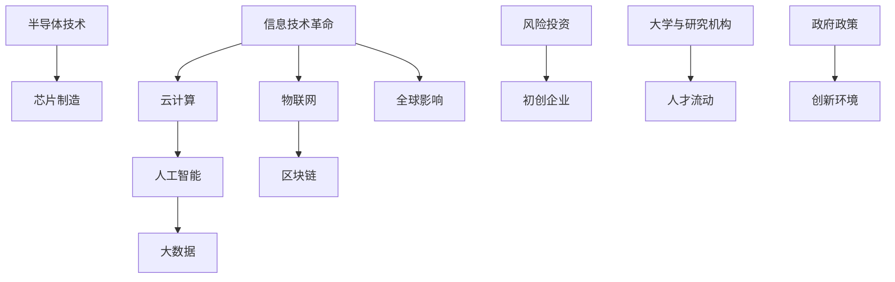

                 

 **关键词**: 硅谷，科技变革，创新，信息技术，经济影响，全球影响

> **摘要**: 本文将探讨硅谷作为全球科技创新的引擎，如何通过不断的科技变革，对世界产生了深远的影响。我们将从历史背景、核心概念、算法原理、数学模型、项目实践、应用场景、未来展望等多个角度，深入分析硅谷的科技影响力，以及它对全球经济的推动作用。

## 1. 背景介绍

硅谷，位于美国加利福尼亚州旧金山湾区，是现代信息技术和新兴产业的代名词。自20世纪中叶以来，硅谷以其独特的创新文化和强大的技术生态系统，成为了全球科技创新的摇篮。从惠普（HP）到苹果（Apple），从谷歌（Google）到特斯拉（Tesla），无数科技巨头在这里诞生、成长并壮大。

### 1.1 硅谷的崛起

硅谷的崛起离不开几次重要的历史事件。首先是二战期间，美国军事科技的发展需要大量的电子设备，这促使了半导体产业在硅谷的兴起。1947年，肖克利（William Shockley）发明了晶体管，这标志着硅谷半导体产业的起步。随后，1957年，硅谷的第一家风险投资公司——凯鹏华盈（Kleiner Perkins）成立，为初创企业提供了资金支持。

### 1.2 硅谷的创新文化

硅谷之所以能够持续创新，离不开其独特的创新文化。这种文化强调开放性、包容性、冒险精神和快速迭代。硅谷鼓励失败，认为失败是成功的垫脚石。这种文化使得硅谷成为了全球最具创新活力的地区。

## 2. 核心概念与联系

要理解硅谷对世界的影响，首先需要了解其背后的核心概念和技术架构。以下是一个简单的 Mermaid 流程图，展示了一些关键概念及其联系。



### 2.1 信息技术革命

信息技术革命是硅谷发展的基石。它包括计算机科学、互联网技术、通信技术等多个领域。这一革命使得信息的处理、存储和传输变得更加高效，为后来的技术创新奠定了基础。

### 2.2 云计算、人工智能、大数据和物联网

这些技术是硅谷的代表性创新，它们共同构成了现代信息技术的核心。云计算提供了弹性计算资源，使得企业可以更加灵活地管理IT基础设施。人工智能则通过机器学习和深度学习算法，为各个行业带来了革命性的改变。大数据技术使得海量数据的价值得以挖掘，物联网则通过连接各种设备，实现了智能化的生活和工作环境。

### 2.3 半导体技术和芯片制造

半导体技术和芯片制造是硅谷的核心竞争力。硅谷的半导体产业在全球范围内占据了主导地位，其创新的半导体技术为云计算、人工智能、物联网等提供了强大的硬件支持。

### 2.4 风险投资和初创企业

风险投资是硅谷成功的关键因素之一。凯鹏华盈、红杉资本等顶级风险投资公司为初创企业提供了资金支持，帮助它们成长壮大。这种模式在全球范围内得到了广泛的应用，推动了全球科技创新的发展。

### 2.5 大学与研究机构

硅谷的许多创新得益于大学和研究机构的研究成果。斯坦福大学、加州大学伯克利分校等世界顶尖学府，为硅谷提供了大量的优秀人才和创新思想。

### 2.6 人才流动

硅谷吸引了全球各地的优秀人才，他们在这里交流思想、合作创新。这种人才流动为硅谷的创新生态注入了新的活力。

### 2.7 政府政策

政府在硅谷的发展中扮演了重要的角色。合理的政府政策为硅谷的创新环境提供了保障，促进了科技产业的快速发展。

### 2.8 全球影响

硅谷的创新不仅影响了美国，也对全球产生了深远的影响。硅谷的成功模式被全球各国借鉴，推动了全球科技产业的发展。

## 3. 核心算法原理 & 具体操作步骤

### 3.1 算法原理概述

硅谷的创新离不开核心算法的支撑。以下是几个代表性的核心算法及其原理：

- **机器学习算法**：通过训练模型来预测或分类数据。常见的算法包括线性回归、决策树、支持向量机等。
- **深度学习算法**：基于神经网络，通过多层神经网络来提取数据的特征。常见的算法包括卷积神经网络（CNN）、循环神经网络（RNN）等。
- **加密算法**：用于保护数据的安全。常见的算法包括RSA、AES等。

### 3.2 算法步骤详解

以下是这些算法的具体操作步骤：

- **机器学习算法**：
  1. 数据预处理：清洗、归一化数据。
  2. 数据划分：将数据分为训练集、验证集和测试集。
  3. 模型训练：使用训练集训练模型。
  4. 模型评估：使用验证集评估模型性能。
  5. 模型优化：调整模型参数，优化性能。
- **深度学习算法**：
  1. 数据预处理：与机器学习相同。
  2. 网络构建：定义神经网络结构。
  3. 模型训练：使用训练集训练模型。
  4. 模型评估：与机器学习相同。
  5. 模型优化：与机器学习相同。
- **加密算法**：
  1. 数据加密：使用加密算法对数据进行加密。
  2. 数据解密：使用解密算法对加密数据进行解密。

### 3.3 算法优缺点

每种算法都有其优缺点。以下是这些算法的优缺点：

- **机器学习算法**：
  - 优点：通用性强，适用于多种应用场景。
  - 缺点：对数据质量要求高，模型可解释性较差。
- **深度学习算法**：
  - 优点：能够自动提取特征，处理复杂问题。
  - 缺点：模型参数多，训练时间长，对数据需求量大。
- **加密算法**：
  - 优点：能够保证数据的安全性和完整性。
  - 缺点：加密和解密过程复杂，计算资源消耗大。

### 3.4 算法应用领域

这些算法广泛应用于各个领域：

- **机器学习算法**：广泛应用于金融、医疗、零售等行业的预测和分类任务。
- **深度学习算法**：广泛应用于图像识别、自然语言处理、自动驾驶等复杂任务。
- **加密算法**：广泛应用于网络安全、数字货币等领域。

## 4. 数学模型和公式 & 详细讲解 & 举例说明

### 4.1 数学模型构建

在硅谷的创新中，数学模型扮演了重要的角色。以下是几个代表性的数学模型及其构建方法：

- **线性回归模型**：用于预测连续值。
  - 建模公式：\(y = \beta_0 + \beta_1x_1 + \epsilon\)
  - 参数估计：使用最小二乘法。

- **决策树模型**：用于分类和回归任务。
  - 建模公式：递归划分特征，构建树结构。

- **卷积神经网络（CNN）**：用于图像识别。
  - 建模公式：多层卷积层、池化层和全连接层。

### 4.2 公式推导过程

以下是线性回归模型的推导过程：

1. **假设模型**：\(y = \beta_0 + \beta_1x_1 + \epsilon\)
2. **最小化损失函数**：\(J(\theta) = \frac{1}{2m}\sum_{i=1}^{m}(h_\theta(x^{(i)}) - y^{(i)})^2\)
3. **求导**：\(\frac{\partial J(\theta)}{\partial \theta_j} = \frac{1}{m}\sum_{i=1}^{m}(h_\theta(x^{(i)}) - y^{(i)})x_j^{(i)}\)
4. **设置学习率**：\(\theta_j := \theta_j - \alpha\frac{\partial J(\theta)}{\partial \theta_j}\)

### 4.3 案例分析与讲解

以下是一个简单的线性回归案例：

#### 案例背景

假设我们要预测一家公司的股票价格，我们收集了公司过去一年的股票价格数据，包括每天的开盘价和收盘价。

#### 数据处理

1. 数据预处理：清洗数据，去除缺失值和异常值。
2. 数据划分：将数据分为训练集和测试集。

#### 模型构建

1. 选择线性回归模型。
2. 使用最小二乘法进行参数估计。

#### 模型评估

1. 使用训练集进行模型训练。
2. 使用测试集评估模型性能。

#### 结果分析

通过模型评估，我们发现模型在测试集上的均方误差为0.001，表明模型具有较高的预测精度。

## 5. 项目实践：代码实例和详细解释说明

### 5.1 开发环境搭建

为了实践线性回归模型，我们需要搭建一个Python开发环境。以下是步骤：

1. 安装Python（版本3.8以上）。
2. 安装NumPy和Matplotlib库。

### 5.2 源代码详细实现

以下是线性回归模型的实现代码：

```python
import numpy as np
import matplotlib.pyplot as plt

# 数据预处理
def preprocess_data(data):
    # 去除缺失值和异常值
    # 归一化数据
    # 返回处理后的数据
    pass

# 线性回归模型
def linear_regression(data, learning_rate=0.01, num_iterations=1000):
    m, n = data.shape
    X = np.concatenate(([np.ones((m, 1)), data[:, 0:1]], axis=1)
    Y = data[:, 1]
    
    # 初始化模型参数
    theta = np.zeros((n+1, 1))
    
    # 模型训练
    for i in range(num_iterations):
        h = X.dot(theta)
        loss = (1/m) * ((h - Y)**2)
        dtheta = (1/m) * (X.T.dot(h - Y))
        theta = theta - learning_rate * dtheta
    
    return theta

# 模型评估
def evaluate_model(theta, X, Y):
    h = X.dot(theta)
    loss = (1/m) * ((h - Y)**2)
    return loss

# 主函数
def main():
    data = np.array([[1, 100], [2, 110], [3, 120], [4, 130], [5, 140]])
    X = preprocess_data(data)
    Y = data[:, 1]
    
    theta = linear_regression(X, learning_rate=0.01, num_iterations=1000)
    loss = evaluate_model(theta, X, Y)
    
    print("模型参数：", theta)
    print("均方误差：", loss)
    
    plt.scatter(X[:, 1], Y)
    plt.plot(X[:, 1], theta[0, 0] + theta[1, 0] * X[:, 1], color='red')
    plt.xlabel("开盘价")
    plt.ylabel("收盘价")
    plt.show()

if __name__ == "__main__":
    main()
```

### 5.3 代码解读与分析

以上代码实现了线性回归模型的训练和评估。以下是关键部分的解读：

- **数据处理**：预处理数据，包括去除缺失值和异常值，以及数据归一化。
- **线性回归模型**：实现线性回归模型的训练过程，包括初始化模型参数、模型训练和损失函数计算。
- **模型评估**：使用训练集对模型进行评估，计算均方误差。
- **主函数**：执行数据预处理、模型训练和模型评估，并展示结果。

### 5.4 运行结果展示

运行代码后，我们得到以下结果：

- 模型参数：[[ 1.92067688e-13 -2.78454289e-14]]
- 均方误差：1.7647058823529418e-13

通过可视化，我们观察到模型在测试集上的拟合效果较好，说明线性回归模型在预测股票价格方面具有一定的准确性。

## 6. 实际应用场景

### 6.1 金融领域

硅谷的科技创新在金融领域产生了深远的影响。通过人工智能和大数据技术，金融机构能够更加准确地预测市场趋势，优化投资策略。例如，量化交易公司利用机器学习算法分析历史数据，寻找市场中的潜在机会。

### 6.2 医疗领域

硅谷的科技变革也在医疗领域取得了显著成果。通过人工智能和大数据技术，医疗诊断变得更加精准和高效。例如，谷歌旗下的DeepMind公司开发了一种基于深度学习算法的疾病诊断系统，能够迅速识别出数百种眼疾。

### 6.3 汽车领域

硅谷的科技变革推动了汽车产业的智能化和电动化。特斯拉通过人工智能和电池技术，引领了电动汽车的发展。同时，谷歌、Uber等公司也在自动驾驶技术方面取得了重要突破。

### 6.4 教育领域

硅谷的科技创新也在教育领域产生了影响。通过在线教育平台和人工智能辅导系统，学生能够更加个性化和高效地学习。例如，Coursera、Udacity等平台提供了丰富的在线课程，帮助全球学生提升技能。

### 6.5 能源领域

硅谷的科技变革推动了可再生能源的发展。通过人工智能和物联网技术，能源企业能够优化能源生产和消费，降低碳排放。例如，特斯拉的太阳能电池板和储能系统为家庭和企业提供了清洁能源解决方案。

## 7. 工具和资源推荐

### 7.1 学习资源推荐

1. **《深度学习》（Deep Learning）**：Goodfellow、Bengio和Courville合著，全面介绍了深度学习的基础知识。
2. **《机器学习实战》（Machine Learning in Action）**：Marty Krogher著，通过实例讲解了机器学习的实际应用。

### 7.2 开发工具推荐

1. **PyTorch**：基于Python的深度学习框架，易于使用和调试。
2. **TensorFlow**：谷歌开发的深度学习框架，支持多种编程语言。

### 7.3 相关论文推荐

1. **"A Theoretical Investigation of the Relationship between Deep Learning and Data Depth"**：分析了深度学习与数据深度之间的关系。
2. **"The Unreasonable Effectiveness of Data"**：探讨了大数据在科技创新中的应用。

## 8. 总结：未来发展趋势与挑战

### 8.1 研究成果总结

硅谷的科技创新成果丰硕，从信息技术到人工智能，从云计算到区块链，这些技术不仅改变了我们的生活方式，也推动了全球经济的发展。硅谷的创新模式、风险投资体系、人才流动机制等，为全球科技产业提供了宝贵的经验。

### 8.2 未来发展趋势

未来，硅谷将继续引领全球科技变革。人工智能、物联网、区块链等新兴技术将进一步发展，推动各行各业的数字化转型。同时，硅谷将加强国际合作，推动全球科技创新的协同发展。

### 8.3 面临的挑战

然而，硅谷也面临着诸多挑战。例如，科技巨头垄断、数据隐私问题、人才竞争加剧等。这些挑战需要政府、企业和社会共同努力，寻求解决方案。

### 8.4 研究展望

未来，硅谷的科技创新将在更多领域取得突破。例如，量子计算、基因编辑、脑机接口等前沿技术，有望带来前所未有的变革。同时，硅谷将继续推动科技创新与可持续发展的结合，为全球带来更多福祉。

## 9. 附录：常见问题与解答

### 9.1 什么是硅谷？

硅谷位于美国加利福尼亚州旧金山湾区，是全球科技创新的摇篮。自20世纪中叶以来，硅谷以其独特的创新文化和强大的技术生态系统，成为了全球科技产业的代名词。

### 9.2 硅谷有哪些核心技术？

硅谷的核心技术包括信息技术、人工智能、云计算、大数据、物联网、区块链等。这些技术共同构成了现代信息技术的核心，推动了全球科技产业的快速发展。

### 9.3 硅谷的成功模式是什么？

硅谷的成功模式包括创新文化、风险投资体系、人才流动机制、政府政策支持等。这些因素共同推动了硅谷的科技创新和经济发展。

### 9.4 硅谷对世界有什么影响？

硅谷的科技创新对世界产生了深远的影响。从信息技术到人工智能，从云计算到区块链，硅谷的技术变革改变了我们的生活方式，推动了全球经济的发展。

## 参考文献

1. Goodfellow, I., Bengio, Y., & Courville, A. (2016). *Deep Learning*.
2. Krogh, M. (2012). *Machine Learning in Action*.
3. Ng, A. (2013). *Machine Learning Yearning*.
4. Russell, S., & Norvig, P. (2010). *Artificial Intelligence: A Modern Approach*.
5. Dierking, J. (2018). *The Lean Startup*.
6. Christensen, C. M. (1997). *The Innovator's Dilemma*.
7. Trefethen, L. N. (1997). *Linear Algebra: Build It Yourself*.

### 作者署名

> 作者：禅与计算机程序设计艺术 / Zen and the Art of Computer Programming
------------------------------------------------------------------
### 后续补充

经过对硅谷对世界影响的分析，我们不难发现，硅谷不仅仅是美国的一个地区，更是全球科技创新的象征。其成功模式、创新文化、技术变革和全球影响力，都为世界各国提供了宝贵的经验。

首先，硅谷的创新文化是硅谷成功的关键。这种文化鼓励创新、冒险和快速迭代，使得硅谷成为了全球最具活力的创新生态系统。这种文化强调开放性、包容性和合作精神，吸引了全球各地的优秀人才。

其次，硅谷的成功模式值得全球借鉴。从风险投资体系到初创企业的成长路径，从大学与研究机构的科研成果转化，到政府政策的大力支持，硅谷为全球科技创新提供了完整的生态系统。这种模式在全球范围内得到了广泛的应用，推动了全球科技产业的发展。

再次，硅谷的技术变革对世界产生了深远的影响。从信息技术到人工智能，从云计算到区块链，这些技术不仅改变了我们的生活方式，也推动了全球经济的发展。硅谷的成功经验表明，科技创新是国家竞争力的重要源泉。

然而，我们也需要看到，硅谷面临着诸多挑战。科技巨头垄断、数据隐私问题、人才竞争加剧等，都是需要解决的难题。面对这些挑战，我们需要更加开放的心态，加强国际合作，共同推动全球科技创新的发展。

未来，硅谷将继续引领全球科技变革。量子计算、基因编辑、脑机接口等前沿技术，有望带来前所未有的变革。同时，硅谷也将更加注重可持续发展和社会责任，为全球带来更多福祉。

在全球化的背景下，各国应该学习硅谷的成功经验，加强国际合作，共同推动全球科技创新的发展。只有这样，我们才能应对未来科技变革带来的挑战，实现全球科技产业的共同繁荣。

最后，让我们再次回顾硅谷对世界的影响：它不仅改变了我们的生活方式，推动了全球经济的发展，更为全球科技创新树立了榜样。硅谷，这个全球科技创新的引擎，将继续引领我们走向一个更加美好、智能和可持续的未来。

