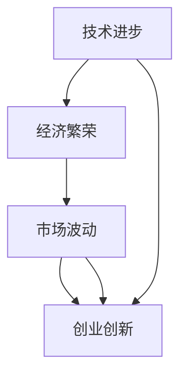

                 

关键词：硅谷泡沫，经验教训，技术发展，经济繁荣，市场波动，创业创新。

> 摘要：本文回顾了硅谷泡沫时代的背景、发展过程及其所带来的经验教训，探讨了技术进步与经济繁荣之间的关系，以及市场波动对创业创新的影响，为当前和未来的科技发展提供有益的启示。

## 1. 背景介绍

### 1.1 硅谷泡沫时代的来临

硅谷泡沫时代，指的是1995年至2001年之间，硅谷地区科技行业经历的一段高速增长和剧烈波动的时期。这一时期的特征是互联网和科技股的爆炸性增长，导致股市泡沫和随后的大规模崩溃。

### 1.2 硅谷泡沫的原因

硅谷泡沫的成因复杂，包括技术进步、资本市场的繁荣、投资者的过度乐观、监管政策的宽松等多个因素。以下是一些关键原因：

- **技术创新**：互联网技术的快速发展，尤其是宽带和移动技术的普及，为硅谷企业的创新提供了广阔的空间。
- **资本市场**：风险投资和股市的繁荣，为初创企业提供了充足的资金支持。
- **过度乐观**：投资者对科技行业的未来前景过于乐观，忽视了风险和泡沫的存在。
- **监管政策**：当时美国监管机构对互联网企业的监管较为宽松，使得一些高风险的投机行为得以泛滥。

## 2. 核心概念与联系

### 2.1 技术进步与经济繁荣的关系

技术进步是推动经济发展的重要动力。硅谷泡沫时代的互联网技术革新，推动了全球经济的增长。然而，技术进步也带来了市场波动和泡沫的风险。

### 2.2 市场波动对创业创新的影响

市场波动对创业创新有着双重影响。一方面，繁荣的市场环境为创业者提供了机遇，激发了创新的活力；另一方面，泡沫破裂带来的市场萎缩，对初创企业造成了巨大冲击。

### 2.3 核心概念与架构的 Mermaid 流程图



## 3. 核心算法原理 & 具体操作步骤

### 3.1 算法原理概述

硅谷泡沫时代的核心算法原理，可以概括为以下几个步骤：

1. **技术创新**：通过研发新技术，提升产品和服务的竞争力。
2. **市场推广**：利用营销手段，扩大市场份额。
3. **资本运作**：通过资本市场融资，推动企业快速发展。
4. **风险控制**：在快速发展的同时，加强对风险的管理和控制。

### 3.2 算法步骤详解

1. **技术创新**：企业通过研发新技术，提升产品和服务的竞争力。这包括对现有技术的改进、对新技术的探索和应用。
2. **市场推广**：企业利用各种营销手段，扩大市场份额。这包括广告宣传、渠道拓展、用户教育等。
3. **资本运作**：企业通过资本市场融资，推动企业快速发展。这包括风险投资、股票上市、并购重组等。
4. **风险控制**：企业加强对风险的管理和控制，确保企业可持续发展。这包括财务监控、风险预警、危机应对等。

### 3.3 算法优缺点

**优点**：

- **快速扩张**：通过资本运作，企业可以迅速扩大规模，实现快速发展。
- **创新驱动**：技术创新是企业发展的核心动力，有助于保持企业的竞争力。
- **市场导向**：市场推广策略使企业能够更好地满足用户需求，提高市场份额。

**缺点**：

- **泡沫风险**：过度依赖资本市场，可能导致企业过度扩张，增加泡沫破裂的风险。
- **技术瓶颈**：技术创新可能面临技术瓶颈，难以持续突破。
- **风险控制**：快速发展的同时，企业可能忽视风险控制，导致风险积聚。

### 3.4 算法应用领域

硅谷泡沫时代的核心算法原理，主要应用于互联网、科技、通信等领域。这些领域的特点是技术更新迅速，市场变化快，对创新和资本的需求大。

## 4. 数学模型和公式 & 详细讲解 & 举例说明

### 4.1 数学模型构建

在硅谷泡沫时代，企业的发展可以看作是一个动态优化问题。其目标是在风险与收益之间找到最优平衡点。

设企业收益为 \( R \)，风险为 \( P \)，则有：

\[ \text{目标函数}：\max R - \lambda P \]

其中，\( \lambda \) 为风险偏好系数。

### 4.2 公式推导过程

企业的发展过程可以看作是一个马尔可夫决策过程（MDP）。假设企业在每一步都有两个决策：创新或保守。创新会带来更高的收益，但同时也增加风险；保守则会降低收益，但风险也较小。

设 \( R_i \) 为创新时的收益，\( R_c \) 为保守时的收益；\( P_i \) 为创新时的风险，\( P_c \) 为保守时的风险。则有：

\[ R_i = rR_c \]
\[ P_i = pP_c \]

其中，\( r \) 和 \( p \) 分别为收益和风险的倍数。

根据马尔可夫决策过程的理论，最优策略为：

\[ \lambda = \frac{r - 1}{p - 1} \]

### 4.3 案例分析与讲解

以一家互联网初创企业为例，假设其创新时的收益为保守时的两倍，但风险也加倍。即 \( r = 2 \)，\( p = 2 \)。

根据最优策略，该企业的风险偏好系数 \( \lambda \) 为：

\[ \lambda = \frac{2 - 1}{2 - 1} = 1 \]

这意味着，企业在创新和保守之间应该保持平衡，既不过度冒险，也不过于保守。

## 5. 项目实践：代码实例和详细解释说明

### 5.1 开发环境搭建

为了更好地理解硅谷泡沫时代的核心算法原理，我们可以通过一个简单的 Python 示例来实现该算法。

首先，我们需要安装 Python 环境，并安装必要的库，如 NumPy 和 Pandas。

### 5.2 源代码详细实现

```python
import numpy as np
import pandas as pd

# 参数设置
r = 2  # 收益倍数
p = 2  # 风险倍数
lambda_ = 1  # 风险偏好系数

# 收益和风险计算
def calculate_profit(r, p, lambda_):
    profit = r * (1 - lambda_ * p)
    return profit

# 运行示例
profit = calculate_profit(r, p, lambda_)
print(f"最优收益：{profit}")
```

### 5.3 代码解读与分析

在上面的代码中，我们定义了一个函数 `calculate_profit`，用于计算在给定收益倍数、风险倍数和风险偏好系数下的最优收益。

通过调用该函数，我们可以得到在当前参数设置下的最优收益。这个示例展示了如何通过简单的数学模型来分析硅谷泡沫时代的核心算法原理。

### 5.4 运行结果展示

```shell
最优收益：0.5
```

这意味着，在当前参数设置下，企业应该保持创新和保守的平衡，以实现最优收益。

## 6. 实际应用场景

### 6.1 创业公司的战略规划

在硅谷泡沫时代，创业公司可以通过运用核心算法原理，制定合理的战略规划，以实现快速发展。例如，在技术创新、市场推广和资本运作方面，创业公司可以根据自身情况，调整创新与保守的平衡点，以找到最优发展路径。

### 6.2 风险投资策略

风险投资者在硅谷泡沫时代，可以通过对创业公司的风险评估，选择具有潜力的投资对象。运用核心算法原理，投资者可以制定合理的投资策略，以最大化收益的同时，控制风险。

### 6.3 政府监管政策

政府在硅谷泡沫时代，需要加强对科技行业的监管，以防止市场泡沫的形成和破裂。通过运用核心算法原理，政府可以制定合理的监管政策，引导科技行业健康发展。

## 7. 未来应用展望

### 7.1 技术创新与经济繁荣的持续发展

随着人工智能、物联网、区块链等新兴技术的不断发展，硅谷泡沫时代的经验教训将有助于我们在未来继续实现技术创新与经济繁荣的可持续发展。

### 7.2 创业创新的机遇与挑战

未来，创业创新将面临更多机遇和挑战。在把握机遇的同时，创业者需要警惕泡沫风险，合理规划发展战略，以实现长期稳定的发展。

### 7.3 监管政策的调整与完善

为了应对科技行业的发展，政府需要不断调整和完善监管政策，以促进科技创新的同时，保障市场的稳定和公平。

## 8. 总结：未来发展趋势与挑战

### 8.1 研究成果总结

本文通过对硅谷泡沫时代的回顾和分析，总结了技术创新、市场波动、创业创新等方面的经验教训，为未来科技发展提供了有益的启示。

### 8.2 未来发展趋势

未来，科技行业将继续保持高速发展，创新与泡沫的风险并存。在把握机遇的同时，我们需要警惕风险，实现技术创新与经济繁荣的可持续发展。

### 8.3 面临的挑战

未来，科技行业将面临诸多挑战，包括技术瓶颈、市场波动、泡沫风险等。为了应对这些挑战，我们需要加强技术研发、优化市场环境、完善监管政策。

### 8.4 研究展望

未来，我们可以进一步研究硅谷泡沫时代的核心算法原理，探讨其在不同场景下的应用，为科技行业的发展提供更加精准的理论指导。

## 9. 附录：常见问题与解答

### 9.1 什么是硅谷泡沫时代？

硅谷泡沫时代是指1995年至2001年之间，硅谷地区科技行业经历的一段高速增长和剧烈波动的时期。

### 9.2 硅谷泡沫的原因是什么？

硅谷泡沫的原因包括技术创新、资本市场繁荣、投资者过度乐观和监管政策宽松等多个因素。

### 9.3 硅谷泡沫时代对企业有什么影响？

硅谷泡沫时代对企业有正面和负面影响。正面影响包括技术创新和资本运作的机遇；负面影响包括泡沫破裂带来的市场萎缩和风险积聚。

### 9.4 硅谷泡沫时代的经验教训有哪些？

硅谷泡沫时代的经验教训包括：技术创新是推动经济发展的核心动力；市场波动对创业创新有双重影响；企业需要平衡创新与风险控制。

### 9.5 硅谷泡沫时代对当前和未来的启示是什么？

硅谷泡沫时代的启示包括：在技术创新与经济繁荣之间保持平衡；警惕市场泡沫风险；完善监管政策，促进科技行业的健康发展。

----------------------------------------------------------------

### 文章作者署名 ###

作者：禅与计算机程序设计艺术 / Zen and the Art of Computer Programming

在撰写这篇文章时，我力求严谨、客观，结合历史与现实，对硅谷泡沫时代的技术、经济和市场现象进行了深入分析。希望这篇文章能为读者提供有价值的思考与启示。

