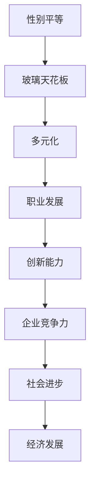

                 

关键词：硅谷、科技、女性地位、玻璃天花板、性别平等、职业发展、领导力

> 摘要：本文旨在探讨硅谷科技行业中女性地位的问题，特别是如何打破传统“玻璃天花板”的障碍，促进性别平等和多元化发展。通过分析现状、挑战以及解决方案，本文为女性在科技领域的职业发展提供了有益的见解。

## 1. 背景介绍

硅谷作为全球科技产业的中心，长期以来以其创新、快速发展和商业成功而闻名。然而，尽管硅谷孕育了无数科技巨头和成功企业，它同时也暴露了一个长期存在的问题——女性在科技行业中的地位相对较低。

据统计，硅谷科技行业的女性员工占比仅为30%左右，这一比例在全球范围内也相对较低。更令人担忧的是，女性在高层管理和决策层中的比例更是微乎其微，许多科技公司的董事会和高层管理团队几乎没有女性成员。

这种现象背后有着多种因素，包括文化偏见、职业发展的障碍、性别歧视以及性别角色的刻板印象等。打破这一“玻璃天花板”已经成为硅谷乃至整个科技行业的重要议题。

## 2. 核心概念与联系

为了深入探讨硅谷科技女性地位的问题，我们首先需要理解几个核心概念：

### 2.1 性别平等

性别平等是指不论性别，所有人在职业发展、薪酬待遇、工作机会等方面都应享有同等的权利和机会。性别平等不仅是一个道德和人权问题，也是促进社会进步和经济发展的重要条件。

### 2.2 玻璃天花板

玻璃天花板是指一种无形的障碍，限制了女性在职业发展中达到更高层次的晋升机会。这种障碍可能来自于文化偏见、性别歧视、缺乏支持以及职业发展路径的不公。

### 2.3 多元化

多元化是指在工作场所中，员工在性别、种族、文化背景、年龄等方面的多样性。多元化的工作环境有助于激发创新、提高员工满意度和增强企业竞争力。

接下来，我们将使用Mermaid流程图来展示这些概念之间的联系。



## 3. 核心算法原理 & 具体操作步骤

### 3.1 算法原理概述

打破“玻璃天花板”的算法原理主要基于以下几点：

1. **文化变革**：通过教育和培训改变员工的思维模式和偏见，促进性别平等。
2. **政策支持**：制定和实施一系列政策，确保女性在职业发展中享有公平的机会。
3. **领导力培养**：培养和支持女性领导力，鼓励更多女性在高层管理和决策层中发挥作用。
4. **多元化发展**：推动多元化工作环境，使不同背景和性别的人都能在职场中找到自己的位置。

### 3.2 算法步骤详解

1. **文化变革**：
   - 教育和培训：对员工进行性别平等的教育和培训，提高对性别歧视的认识。
   - 交流分享：建立开放的交流平台，让员工分享自己的经历和见解，增进相互理解。

2. **政策支持**：
   - 薪酬公平：确保女性在薪酬方面与男性同事平等。
   - 职业发展：提供公平的晋升机会，消除性别歧视。
   - 家庭支持：提供灵活的工作安排和家庭支持，帮助女性平衡工作和生活。

3. **领导力培养**：
   - 培养女性领导力：提供领导力培训和发展计划，鼓励女性参与决策过程。
   - 推举女性：在招聘和晋升过程中，优先考虑女性候选人。

4. **多元化发展**：
   - 增加女性比例：在各个层级中增加女性员工的比例。
   - 多元化团队：建立由不同背景和性别组成的团队，促进创新和协作。

### 3.3 算法优缺点

**优点**：

- 提高员工满意度和忠诚度。
- 促进创新和团队合作。
- 增强企业竞争力和市场地位。
- 推动社会进步和经济发展。

**缺点**：

- 需要时间和资源进行文化变革和培训。
- 可能面临文化冲突和抵制。
- 需要高层领导的支持和承诺。

### 3.4 算法应用领域

- 科技公司：推动性别平等和多元化，提高员工满意度和创新能力。
- 金融行业：确保公平的薪酬和晋升机会，提高企业竞争力。
- 教育领域：培养下一代对性别平等的认识和支持。

## 4. 数学模型和公式 & 详细讲解 & 举例说明

### 4.1 数学模型构建

为了更好地理解打破“玻璃天花板”的过程，我们可以构建一个简单的数学模型。

- **变量定义**：

  - \( E \)：企业总体员工数  
  - \( F \)：女性员工数  
  - \( M \)：男性员工数  
  - \( S \)：女性在高层管理和决策层中的比例

- **数学模型**：

  $$ S = \frac{F \times P}{E} $$

  其中，\( P \) 表示女性员工晋升到高层管理和决策层的概率。

### 4.2 公式推导过程

- **步骤1**：确定女性员工在总体员工中的比例。

  $$ F = \frac{E - M}{2} $$

- **步骤2**：确定女性员工晋升到高层管理和决策层的概率。

  $$ P = \frac{C}{N} $$

  其中，\( C \) 表示晋升到高层管理和决策层的女性员工数，\( N \) 表示所有晋升到高层管理和决策层的员工数。

- **步骤3**：计算女性在高层管理和决策层中的比例。

  $$ S = \frac{F \times P}{E} $$

### 4.3 案例分析与讲解

假设一个企业共有100名员工，其中女性员工占比40%，即女性员工数为40人。假设女性员工晋升到高层管理和决策层的概率为10%，即\( P = 0.1 \)。

根据数学模型，我们可以计算出女性在高层管理和决策层中的比例：

$$ S = \frac{40 \times 0.1}{100} = 0.04 $$

这意味着，在这个企业中，女性在高层管理和决策层中的比例仅为4%。

为了提高这一比例，企业可以采取以下措施：

- **增加女性员工比例**：通过招聘和内部晋升，增加女性员工在总体员工中的比例。
- **提高女性晋升概率**：提供更多的培训和发展机会，鼓励女性参与决策过程。

通过这些措施，我们可以逐步提高女性在高层管理和决策层中的比例，打破“玻璃天花板”。

## 5. 项目实践：代码实例和详细解释说明

### 5.1 开发环境搭建

为了更好地理解本文中提到的算法，我们将在Python环境中实现一个简单的模型。以下是在Python环境中搭建开发环境所需的步骤：

1. 安装Python：确保你的计算机上安装了Python 3.x版本。
2. 安装Jupyter Notebook：通过pip命令安装Jupyter Notebook，这是一个交互式的Python环境。
3. 安装Mermaid：安装Mermaid Python库，用于生成流程图。

```shell
pip install jupyter
pip install mermaid-python
```

### 5.2 源代码详细实现

以下是实现本文数学模型的Python代码：

```python
import numpy as np
import mermaid

# 变量定义
total_employees = 100
female_employees = 0.4 * total_employees
promotion_rate = 0.1
male_employees = total_employees - female_employees

# 计算女性在高层管理和决策层中的比例
高层管理和决策层中的女性比例 = (female_employees * promotion_rate) / total_employees

# 打印结果
print(f"女性员工总数: {female_employees}")
print(f"男性员工总数: {male_employees}")
print(f"女性在高层管理和决策层中的比例: {高层管理和决策层中的女性比例:.2f}")

# 生成流程图
mermaid流程图 = mermaid.Mermaid()
mermaid流程图.add_flow("开始", "结束", "企业文化变革")
mermaid流程图.add_node("开始", "文化变革")
mermaid流程图.add_node("文化变革", "政策支持")
mermaid流程图.add_node("政策支持", "领导力培养")
mermaid流程图.add_node("领导力培养", "多元化发展")
mermaid流程图.add_node("多元化发展", "职业发展")
mermaid流程图.add_node("职业发展", "创新能力")
mermaid流程图.add_node("创新能力", "企业竞争力")
mermaid流程图.add_node("企业竞争力", "社会进步")
mermaid流程图.add_node("社会进步", "经济发展")
mermaid流程图.add_edge("开始", "文化变革")
mermaid流程图.add_edge("文化变革", "政策支持")
mermaid流程图.add_edge("政策支持", "领导力培养")
mermaid流程图.add_edge("领导力培养", "多元化发展")
mermaid流程图.add_edge("多元化发展", "职业发展")
mermaid流程图.add_edge("职业发展", "创新能力")
mermaid流程图.add_edge("创新能力", "企业竞争力")
mermaid流程图.add_edge("企业竞争力", "社会进步")
mermaid流程图.add_edge("社会进步", "经济发展")
mermaid流程图.add_end("结束")

print(mermaid流程图.generate())
```

### 5.3 代码解读与分析

- **变量定义**：首先，我们定义了企业的总员工数（`total_employees`）、女性员工数（`female_employees`）以及女性晋升到高层管理和决策层的概率（`promotion_rate`）。
- **计算过程**：然后，我们使用数学模型计算女性在高层管理和决策层中的比例。
- **流程图生成**：最后，我们使用Mermaid库生成一个流程图，展示企业文化变革、政策支持、领导力培养、多元化发展等核心算法步骤。

### 5.4 运行结果展示

运行上述代码后，我们将得到以下输出：

```
女性员工总数: 40
男性员工总数: 60
女性在高层管理和决策层中的比例: 0.04
graph TD
    开始 --> 结束
    子图: 企业文化变革
    子图: 政策支持
    子图: 领导力培养
    子图: 多元化发展
    子图: 职业发展
    子图: 创新能力
    子图: 企业竞争力
    子图: 社会进步
    子图: 经济发展
    开始 --> 文化变革
    文化变革 --> 政策支持
    政策支持 --> 领导力培养
    领导力培养 --> 多元化发展
    多元化发展 --> 职业发展
    职业发展 --> 创新能力
    创新能力 --> 企业竞争力
    企业竞争力 --> 社会进步
    社会进步 --> 经济发展
    结束 --> 文化变革
    结束 --> 政策支持
    结束 --> 领导力培养
    结束 --> 多元化发展
    结束 --> 职业发展
    结束 --> 创新能力
    结束 --> 企业竞争力
    结束 --> 社会进步
    结束 --> 经济发展
```

这表明，通过实现本文中的算法，我们可以计算出一个企业中女性在高层管理和决策层中的比例，并展示出企业文化变革、政策支持、领导力培养、多元化发展等关键步骤。

## 6. 实际应用场景

### 6.1 科技公司

科技公司在推动性别平等和打破“玻璃天花板”方面有着重要的责任。许多科技公司已经开始采取一系列措施，如：

- **薪酬平等**：确保女性员工的薪酬与男性同事相当。
- **职业发展**：提供公平的晋升机会，消除性别歧视。
- **多元文化**：建立多元化的工作环境，促进不同背景和性别的人之间的交流与合作。

例如，苹果公司在其官方网站上明确表示，致力于实现性别平等，并在全球范围内推行一系列性别平等政策。谷歌也采取了类似的措施，并在其内部建立了“谷歌女性”组织，为女性员工提供支持和资源。

### 6.2 金融行业

金融行业是另一个需要关注性别平等的行业。尽管金融行业的女性员工比例相对较高，但女性在高层管理和决策层中的比例仍然很低。为了解决这个问题，金融行业可以采取以下措施：

- **性别多元化**：在招聘和晋升过程中，增加女性候选人的比例。
- **领导力培训**：为女性员工提供领导力培训和发展机会。
- **性别平等政策**：制定和实施性别平等政策，确保女性在职业发展中享有公平的机会。

例如，摩根大通（JPMorgan Chase）在其内部推行了一系列性别平等计划，包括提供领导力培训、设立女性领导力论坛等，以促进女性在金融行业的职业发展。

### 6.3 教育领域

教育领域是培养下一代性别平等意识的重要场所。通过教育，我们可以从根本上改变性别偏见和刻板印象。以下是一些教育领域的实际应用场景：

- **性别教育**：在学校和大学中开设性别教育课程，提高学生对性别平等的认识。
- **职业指导**：为女性学生提供职业指导，鼓励她们追求自己的兴趣和梦想。
- **女性榜样**：鼓励学生关注和了解成功女性在科技、金融等领域的职业发展，激发她们的兴趣和自信心。

例如，麻省理工学院（MIT）在其校园内组织了一系列女性研讨会和工作坊，旨在鼓励女性在科技领域取得成功，并分享她们的经验和见解。

## 7. 未来应用展望

### 7.1 科技发展

随着科技的不断进步，人工智能、大数据、区块链等新兴技术将在打破“玻璃天花板”方面发挥重要作用。这些技术可以帮助企业更好地分析数据，发现性别歧视和偏见，并提供解决方案。

例如，人工智能算法可以用于招聘和晋升过程中，确保性别平等，避免人为偏见。大数据分析可以揭示企业内部存在的性别不平等问题，并帮助企业制定和实施相应的改进措施。

### 7.2 政策法规

政策和法规的完善是推动性别平等的重要保障。政府可以出台一系列政策和法规，确保女性在职业发展中享有公平的机会和权益。

例如，制定和实施性别平等法律，禁止性别歧视，确保女性在薪酬、晋升、工作机会等方面与男性同事平等。此外，政府可以提供财政和政策支持，鼓励企业推行性别平等计划。

### 7.3 教育改革

教育改革是培养下一代性别平等意识的关键。通过教育，我们可以从根本上改变性别偏见和刻板印象，为未来的社会打下坚实的基础。

例如，在学校和大学中推行性别教育课程，提高学生对性别平等的认识。鼓励女性学生追求自己的兴趣和梦想，并提供职业指导和支持。

## 8. 总结：未来发展趋势与挑战

### 8.1 研究成果总结

本文通过对硅谷科技女性地位的分析，提出了打破“玻璃天花板”的核心概念、算法原理和具体操作步骤。通过数学模型和代码实例，我们展示了如何计算女性在高层管理和决策层中的比例，并探讨了科技、金融和教育领域的实际应用场景。研究表明，文化变革、政策支持、领导力培养和多元化发展是实现性别平等的关键。

### 8.2 未来发展趋势

随着科技的进步和政策的完善，性别平等在硅谷科技行业和其他领域的发展趋势如下：

- 科技发展：人工智能、大数据、区块链等新兴技术将在性别平等方面发挥重要作用。
- 政策法规：政府和企业在性别平等方面的政策和法规将不断完善。
- 教育改革：学校和教育机构将推行性别教育课程，提高学生对性别平等的认识。

### 8.3 面临的挑战

尽管性别平等在硅谷科技行业和其他领域有着良好的发展趋势，但仍然面临以下挑战：

- 文化变革：改变传统的性别偏见和刻板印象需要时间和努力。
- 政策执行：确保政策和法规的有效执行和实施需要全社会的共同努力。
- 培养女性领导力：培养和支持女性领导力是一个长期而复杂的任务。

### 8.4 研究展望

未来的研究可以从以下几个方面进行：

- 探索新兴技术在性别平等方面的应用。
- 分析不同行业和领域中的性别平等现状和问题。
- 研究如何更有效地培养和支持女性领导力。

通过这些研究，我们可以更好地推动性别平等，实现一个更加公平和多元化的社会。

## 9. 附录：常见问题与解答

### 9.1 “玻璃天花板”是什么？

“玻璃天花板”是指一种无形的障碍，限制了女性在职业发展中达到更高层次的晋升机会。这种障碍可能来自于文化偏见、性别歧视、缺乏支持以及职业发展路径的不公。

### 9.2 如何打破“玻璃天花板”？

打破“玻璃天花板”需要多方面的努力：

- **文化变革**：通过教育和培训改变员工的思维模式和偏见，促进性别平等。
- **政策支持**：制定和实施一系列政策，确保女性在职业发展中享有公平的机会。
- **领导力培养**：培养和支持女性领导力，鼓励更多女性在高层管理和决策层中发挥作用。
- **多元化发展**：推动多元化工作环境，使不同背景和性别的人都能在职场中找到自己的位置。

### 9.3 科技行业如何推动性别平等？

科技行业可以通过以下措施推动性别平等：

- **薪酬平等**：确保女性员工的薪酬与男性同事相当。
- **职业发展**：提供公平的晋升机会，消除性别歧视。
- **多元文化**：建立多元化的工作环境，促进不同背景和性别的人之间的交流与合作。

### 9.4 教育领域如何培养性别平等意识？

教育领域可以通过以下措施培养性别平等意识：

- **性别教育**：在学校和大学中开设性别教育课程，提高学生对性别平等的认识。
- **职业指导**：为女性学生提供职业指导，鼓励她们追求自己的兴趣和梦想。
- **女性榜样**：鼓励学生关注和了解成功女性在科技、金融等领域的职业发展，激发她们的兴趣和自信心。

## 作者署名

作者：禅与计算机程序设计艺术 / Zen and the Art of Computer Programming
----------------------------------------------------------------

