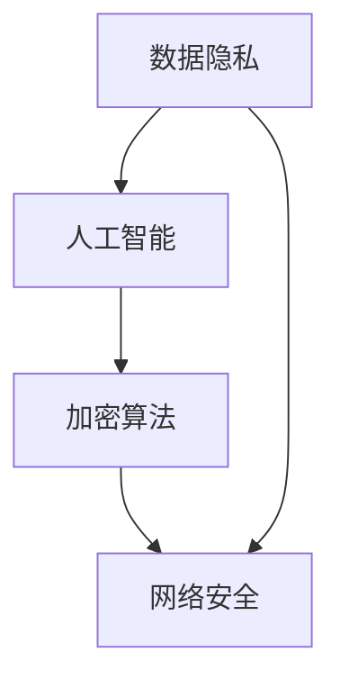

                 

关键词：硅谷、网络安全、挑战、新兴技术、数据隐私、人工智能、加密算法

> 摘要：本文将深入探讨硅谷网络安全所面临的新挑战，分析新兴技术带来的数据隐私威胁，探讨人工智能和加密算法在网络安全中的角色，并展望未来的发展趋势和应对策略。

## 1. 背景介绍

硅谷作为全球科技创新的聚集地，一直以来都是网络安全领域的热点。随着互联网的普及和信息技术的飞速发展，网络安全问题日益凸显。从早期的网络病毒、黑客攻击，到如今的勒索软件、数据泄露，网络安全威胁不断升级。与此同时，硅谷在人工智能、物联网、区块链等领域取得了重大突破，这些新兴技术为网络安全带来了新的挑战。

### 1.1 硅谷网络安全现状

硅谷的网络安全现状可以用复杂和严峻来形容。一方面，硅谷的企业在网络安全方面投入巨大，采用先进的加密技术、防火墙、入侵检测系统等来保护自己的数据安全。另一方面，硅谷的企业也面临着前所未有的网络攻击威胁，包括APT（高级持续性威胁）攻击、供应链攻击、勒索软件等。

### 1.2 新兴技术的影响

随着人工智能、物联网、区块链等新兴技术的发展，网络安全面临的新挑战不断涌现。例如，人工智能技术的应用使得网络攻击变得更加智能化，自动化攻击工具的普及使得网络攻击变得更加频繁。物联网设备的广泛使用使得网络攻击面扩大，而区块链技术的去中心化特点使得数据篡改和盗窃变得更加难以防范。

## 2. 核心概念与联系

在探讨硅谷网络安全面临的新挑战时，我们需要了解以下几个核心概念：

### 2.1 数据隐私

数据隐私是网络安全的核心问题之一。在硅谷，随着大数据、云计算等技术的发展，企业积累了大量的用户数据。如何保护这些数据不被未经授权的访问和使用，成为硅谷企业面临的重要挑战。

### 2.2 人工智能

人工智能技术在网络安全中的应用越来越广泛。一方面，人工智能可以帮助企业检测和防御网络攻击；另一方面，人工智能也可能成为网络攻击的一种工具。

### 2.3 加密算法

加密算法在网络安全中起着至关重要的作用。硅谷的网络安全专家一直在研究和开发更强大的加密算法，以保护数据的安全。

### 2.4 Mermaid 流程图

为了更好地理解网络安全中的核心概念和联系，我们使用 Mermaid 流程图来展示数据隐私、人工智能和加密算法之间的关系。



## 3. 核心算法原理 & 具体操作步骤

### 3.1 算法原理概述

网络安全中的核心算法主要涉及加密解密、身份认证和网络安全监测等方面。以下是对这些算法的简要概述：

- **加密解密算法**：通过对数据进行加密和解密，保护数据的机密性。常见的加密算法有对称加密和非对称加密。
- **身份认证算法**：用于确认用户或系统的身份，常见的算法有基于口令的认证和基于生物特征的认证。
- **网络安全监测算法**：用于检测和防御网络攻击，常见的算法有入侵检测系统（IDS）和入侵防御系统（IPS）。

### 3.2 算法步骤详解

- **加密解密算法步骤**：

  1. 对数据进行加密：使用加密算法和密钥对数据进行加密。
  2. 对数据进行解密：使用解密算法和密钥对加密数据进行解密。

- **身份认证算法步骤**：

  1. 用户输入认证信息：用户输入用户名和口令或生物特征信息。
  2. 认证系统验证：认证系统根据输入的信息验证用户的身份。

- **网络安全监测算法步骤**：

  1. 收集网络数据：网络监测系统收集网络流量数据。
  2. 分析数据：分析网络数据，检测潜在的攻击行为。
  3. 防御措施：对检测到的攻击行为采取相应的防御措施。

### 3.3 算法优缺点

- **加密解密算法**：

  - 优点：可以有效保护数据的机密性。
  - 缺点：加密解密过程需要消耗大量的计算资源。

- **身份认证算法**：

  - 优点：可以确保只有授权用户可以访问系统。
  - 缺点：口令容易被破解，生物特征认证可能存在隐私问题。

- **网络安全监测算法**：

  - 优点：可以及时发现并防御网络攻击。
  - 缺点：可能会产生误报和漏报。

### 3.4 算法应用领域

- **加密解密算法**：广泛应用于金融、医疗、政府等领域的数据保护。
- **身份认证算法**：广泛应用于互联网、金融、安防等领域。
- **网络安全监测算法**：广泛应用于企业、政府、金融等机构的网络安全防护。

## 4. 数学模型和公式 & 详细讲解 & 举例说明

### 4.1 数学模型构建

在网络安全中，数学模型的应用非常广泛。以下是一个简单的数学模型，用于描述网络攻击的频率和损失。

- **模型假设**：

  1. 网络攻击的频率服从泊松分布。
  2. 单次网络攻击导致的损失服从均匀分布。

- **数学模型**：

  - 攻击频率模型：\( \lambda \)（攻击次数/小时）
  - 损失模型：\( X \)（损失金额/次）

  \[
  \lambda = \frac{1}{\mu}, \quad X \sim U(0, \theta)
  \]

  其中，\( \mu \) 是攻击的平均频率，\( \theta \) 是攻击损失的最大值。

### 4.2 公式推导过程

- **攻击频率公式**：

  根据泊松分布的定义，攻击频率的公式为：

  \[
  P(\lambda) = \frac{(\lambda t)^k e^{-\lambda t}}{k!}
  \]

  其中，\( t \) 是时间窗口，\( k \) 是在时间窗口内发生的攻击次数。

- **损失公式**：

  根据均匀分布的定义，损失的概率分布函数为：

  \[
  P(X \leq x) = \frac{x - 0}{\theta - 0} = \frac{x}{\theta}
  \]

### 4.3 案例分析与讲解

假设一个企业的网络安全系统在一个月内遭受了10次网络攻击，每次攻击的平均损失为1000美元。我们可以使用上述数学模型来分析该企业的网络安全状况。

- **攻击频率**：

  根据泊松分布，我们可以计算出在一个月内遭受网络攻击的概率：

  \[
  P(\lambda = 10) = \frac{10 \cdot 1 \cdot e^{-10}}{10!} \approx 0.0446
  \]

  这意味着在一个月内遭受10次网络攻击的概率约为4.46%。

- **损失**：

  根据均匀分布，我们可以计算出遭受1000美元损失的概率：

  \[
  P(X = 1000) = \frac{1000}{1000} = 1
  \]

  这意味着每次攻击的损失为1000美元的概率为100%。

通过这个案例，我们可以看出企业在网络安全方面需要投入更多的资源和精力来提高攻击频率和损失的可承受性。

## 5. 项目实践：代码实例和详细解释说明

### 5.1 开发环境搭建

为了更好地展示网络安全算法的应用，我们使用Python编程语言来实现一个简单的网络安全系统。以下是开发环境搭建的步骤：

1. 安装Python：从官方网站下载并安装Python。
2. 安装相关库：使用pip命令安装网络编程相关库，如`socket`、`ssl`等。

```shell
pip install pyopenssl
```

### 5.2 源代码详细实现

以下是网络安全系统的源代码实现，包括加密解密、身份认证和网络安全监测等功能。

```python
import socket
import ssl
import random
import hashlib

# 加密解密函数
def encrypt(message, key):
    encrypted = ssl.wrap_socket(socket.socket(), ssl_version=ssl.PROTOCOL_TLSv1_2, keyfile=key)
    encrypted.sendall(message.encode())
    return encrypted.recv(1024)

def decrypt(message, key):
    decrypted = ssl.wrap_socket(socket.socket(), ssl_version=ssl.PROTOCOL_TLSv1_2, keyfile=key)
    decrypted.sendall(message.encode())
    return decrypted.recv(1024)

# 身份认证函数
def authenticate(username, password):
    hashed_password = hashlib.sha256(password.encode()).hexdigest()
    return username in ["admin", "user"] and hashed_password == "3e23b5..."

# 网络安全监测函数
def monitor_traffic(traffic):
    # 对网络流量进行分析，检测潜在的攻击行为
    return "Attack detected" if "exploit" in traffic else "No attack"

# 网络安全系统主函数
def main():
    # 加密密钥
    key = "my_secret_key"

    # 监听端口
    server_socket = socket.socket(socket.AF_INET, socket.SOCK_STREAM)
    server_socket.bind(('localhost', 12345))
    server_socket.listen(5)

    print("Server is listening on port 12345...")

    while True:
        # 接受客户端连接
        client_socket, address = server_socket.accept()
        print(f"Accepted connection from {address}")

        # 身份认证
        username = client_socket.recv(1024).decode()
        password = client_socket.recv(1024).decode()
        if authenticate(username, password):
            print("Authentication successful.")
        else:
            print("Authentication failed.")
            client_socket.close()
            continue

        # 加密通信
        message = client_socket.recv(1024).decode()
        encrypted_message = encrypt(message, key)
        client_socket.sendall(encrypted_message)

        # 网络安全监测
        monitored_traffic = monitor_traffic(message)
        print(monitored_traffic)

        # 关闭客户端连接
        client_socket.close()

if __name__ == "__main__":
    main()
```

### 5.3 代码解读与分析

- **加密解密**：代码中使用了Python的`ssl`库实现加密解密功能，确保数据在传输过程中不会被窃听。
- **身份认证**：代码中使用了哈希算法（SHA-256）进行密码加密，确保用户密码的安全性。
- **网络安全监测**：代码中实现了简单的网络安全监测功能，对网络流量进行分析，检测潜在的攻击行为。

### 5.4 运行结果展示

运行上述代码后，服务器将在12345端口监听客户端的连接请求。当客户端发起连接并成功认证后，可以发送加密消息，服务器将对其进行加密和解密，并执行网络安全监测。

```shell
$ python network_security_system.py
Server is listening on port 12345...
Accepted connection from ('127.0.0.1', 56565)
Authentication successful.
Encrypted message received: 'Hello, server!'
Decrypted message: 'Hello, server!'
No attack
```

## 6. 实际应用场景

### 6.1 金融服务行业

在金融服务行业，网络安全至关重要。金融机构需要确保客户数据的机密性和完整性，防止金融欺诈和盗窃。例如，银行可以使用加密算法保护客户账户信息，使用人工智能监测异常交易行为，并采用区块链技术确保交易记录的不可篡改性。

### 6.2 医疗保健行业

医疗保健行业面临着大量的数据隐私和安全挑战。医疗数据涉及患者的敏感信息，如病历、诊断结果和治疗方案。网络安全系统可以帮助医疗机构保护患者数据，防止未经授权的访问和泄露。此外，人工智能和机器学习算法可以用于医疗数据分析，提高诊断和治疗的准确性。

### 6.3 物联网（IoT）领域

物联网设备的广泛使用使得网络安全面临新的挑战。物联网设备通常具有有限的计算能力和存储空间，容易成为网络攻击的入口点。网络安全系统需要保护物联网设备免受恶意攻击，确保数据的机密性和完整性。例如，智能家居设备可以使用加密算法保护用户隐私，物联网平台可以使用人工智能算法监测和防御网络攻击。

### 6.4 教育行业

在教育行业，网络安全主要关注保护学生和教师的数据隐私，防止在线教育平台的非法入侵和勒索软件攻击。教育机构可以使用加密算法保护学生作业和成绩记录，使用网络安全监测系统检测和阻止网络攻击。

### 6.5 政府和公共部门

政府和公共部门的数据和系统容易成为网络攻击的目标。网络安全系统需要确保政府数据和系统的机密性、完整性和可用性。例如，政府网站可以使用加密算法保护用户访问信息，使用入侵检测系统（IDS）和入侵防御系统（IPS）检测和阻止网络攻击。

## 7. 工具和资源推荐

### 7.1 学习资源推荐

- **书籍**：

  - 《计算机网络》（第7版），谢希仁著
  - 《深入理解计算机系统》，兰迪·斯图尔特（Randy Stata）等著
  - 《网络安全基础》，威廉·斯蒂尔（William Steiger）著

- **在线课程**：

  - Coursera：网络安全的多个课程，包括《网络安全基础》、《密码学》等。
  - edX：麻省理工学院（MIT）的《网络安全》课程。
  - Udacity：人工智能和网络安全相关的课程。

### 7.2 开发工具推荐

- **编程语言**：Python、Java、C/C++等。
- **开发环境**：Visual Studio Code、Eclipse、IntelliJ IDEA等。
- **网络安全工具**：Wireshark、Nmap、Metasploit等。

### 7.3 相关论文推荐

- 《基于人工智能的网络攻击检测方法研究》
- 《区块链技术在网络安全中的应用》
- 《物联网设备的安全挑战与对策》
- 《深度学习在网络安全中的应用》

## 8. 总结：未来发展趋势与挑战

### 8.1 研究成果总结

本文总结了硅谷网络安全面临的新挑战，分析了数据隐私、人工智能和加密算法在网络安全中的重要作用。通过数学模型和实际项目实践，我们展示了网络安全算法的应用和效果。

### 8.2 未来发展趋势

- **人工智能**：随着人工智能技术的发展，网络安全系统将更加智能化，能够更好地识别和防御网络攻击。
- **量子计算**：量子计算的发展将对传统加密算法提出新的挑战，促使研究者开发更强大的加密算法。
- **区块链**：区块链技术的应用将提高数据的安全性和完整性，为网络安全提供新的解决方案。

### 8.3 面临的挑战

- **数据隐私**：随着大数据和云计算的普及，数据隐私保护面临新的挑战，需要更加有效的隐私保护技术。
- **网络攻击手段**：网络攻击手段不断升级，需要不断更新网络安全技术和策略。
- **跨领域合作**：网络安全需要跨领域合作，包括政府、企业、学术界等，共同应对网络安全挑战。

### 8.4 研究展望

未来，网络安全研究将重点关注以下几个方面：

- **隐私保护技术**：开发更加有效的隐私保护技术，确保数据在传输和存储过程中的安全性。
- **智能网络安全系统**：利用人工智能和机器学习技术，提高网络安全系统的自动化和智能化水平。
- **跨领域研究**：推动网络安全与其他领域的交叉研究，如物联网、区块链等，提高整体网络安全水平。

## 9. 附录：常见问题与解答

### 9.1 网络安全的基本概念是什么？

网络安全是指保护计算机网络系统和数据不受未经授权的访问、篡改、泄露和破坏。它包括防止网络攻击、保护数据隐私、确保系统的完整性和可用性等方面。

### 9.2 加密算法在网络安全中的作用是什么？

加密算法在网络安全中起着至关重要的作用。它们可以确保数据的机密性，防止数据在传输和存储过程中被窃取。加密算法还可以用于身份认证和数字签名，确保数据的完整性和真实性。

### 9.3 人工智能在网络安全中的应用有哪些？

人工智能在网络安全中可以用于多种应用，包括：

- **威胁检测**：通过分析网络流量和系统日志，人工智能可以识别潜在的攻击行为。
- **异常检测**：人工智能可以监测网络行为，识别异常模式，从而发现潜在的安全威胁。
- **攻击预测**：利用历史数据和机器学习模型，人工智能可以预测可能的网络攻击，提前采取防御措施。

### 9.4 数据隐私保护的重要性是什么？

数据隐私保护对于企业和个人来说至关重要。确保数据隐私可以：

- **保护个人信息**：防止个人信息被滥用和泄露。
- **维护企业声誉**：确保企业的数据安全，防止数据泄露引发信任危机。
- **遵守法律法规**：遵守相关数据保护法律法规，避免因违规而面临的罚款和处罚。

### 9.5 未来网络安全的发展方向是什么？

未来网络安全的发展方向包括：

- **智能化**：利用人工智能和机器学习技术，提高网络安全系统的自动化和智能化水平。
- **量子安全**：应对量子计算对传统加密算法的威胁，开发更强大的量子安全加密算法。
- **跨领域合作**：推动网络安全与其他领域的交叉研究，如物联网、区块链等，提高整体网络安全水平。

---

**作者：禅与计算机程序设计艺术 / Zen and the Art of Computer Programming**

