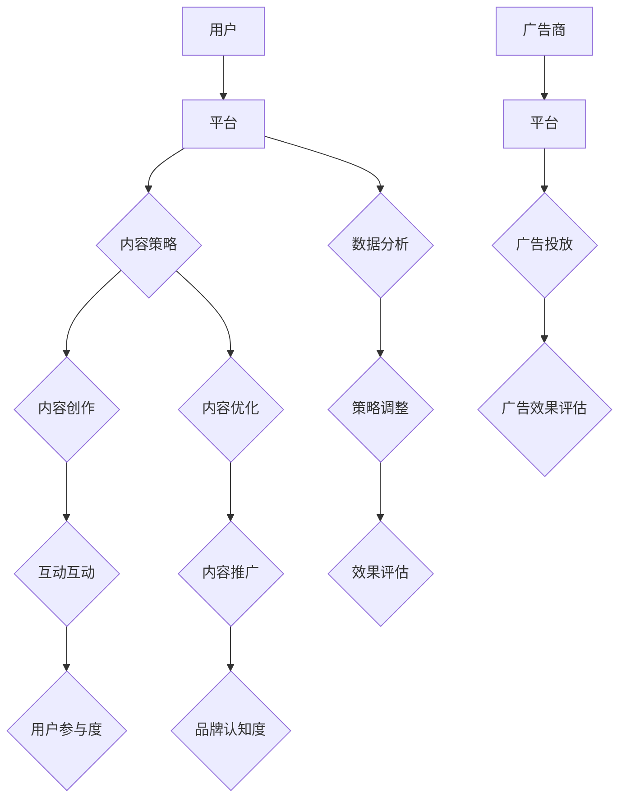

                 

### 关键词 Keywords ###
社交媒体，个人影响力，平台运营，内容策略，数据分析，社交媒体算法，社交媒体营销

### 摘要 Abstract ###
本文旨在探讨如何在各种社交媒体平台上建立强大的个人影响力。通过对社交媒体运营的核心概念、策略、技术和工具的深入分析，本文将提供一系列实用指南，帮助个人和企业在数字时代获得持续的关注和互动。

## 1. 背景介绍 Background

### 1.1 社交媒体的重要性 Importance of Social Media

随着互联网的普及和移动设备的普及，社交媒体已成为人们获取信息、社交互动和娱乐的主要途径。根据最新统计数据，全球社交媒体用户已超过30亿，这一数字占据了全球人口的一半以上。社交媒体平台不仅改变了人们的交流方式，也为企业和个人提供了巨大的商业机会。

### 1.2 个人影响力的定义 Definition of Personal Influence

个人影响力是指一个人在特定领域或群体中通过其观点、行为和内容所产生的影响力。在社交媒体时代，个人影响力可以转化为显著的品牌价值、商业机会和社交资本。

### 1.3 社交媒体运营的目标 Goals of Social Media Operations

社交媒体运营的目标包括提升品牌知名度、扩大受众范围、增加用户互动和转化率。有效的社交媒体运营不仅可以提高用户的参与度，还可以帮助企业建立强大的品牌形象。

## 2. 核心概念与联系 Core Concepts and Connections

为了深入理解社交媒体运营，我们需要掌握以下几个核心概念：

### 2.1 社交媒体算法 Social Media Algorithms

社交媒体算法是平台用来排序和推荐内容的核心机制。了解这些算法可以帮助我们优化内容策略，提高内容曝光率。

### 2.2 内容策略 Content Strategy

内容策略是指规划、创建和分发内容的一系列方法和实践。一个成功的内容策略需要考虑目标受众、内容形式、发布时间和互动方式。

### 2.3 数据分析 Data Analysis

数据分析是社交媒体运营的关键环节。通过分析用户行为、内容表现和关键指标，我们可以优化策略，提高效果。

### 2.4 社交媒体生态系统 Social Media Ecosystem

社交媒体生态系统包括平台、用户、内容创作者和广告商。了解这个生态系统的运作方式可以帮助我们更好地定位和推广内容。

<|assistant|>### 2.5 社交媒体平台的 Mermaid 流程图 Mermaid Flowchart of Social Media Platforms

## 3. 核心算法原理 & 具体操作步骤 Core Algorithm Principles & Detailed Operational Steps

### 3.1 算法原理概述 Overview of Algorithm Principles

社交媒体算法的核心目标是根据用户的行为和偏好推荐相关的内容。这通常涉及到以下几种算法：

1. **协同过滤（Collaborative Filtering）**：通过分析用户之间的行为相似性来推荐内容。
2. **内容分发（Content Distribution）**：根据内容的类型、标签和热度进行推荐。
3. **基于用户的过滤（User-Based Filtering）**：通过分析类似用户的偏好来推荐内容。
4. **基于模型的推荐（Model-Based Recommendations）**：使用机器学习模型预测用户的偏好。

### 3.2 算法步骤详解 Detailed Steps of Algorithm Implementation

1. **数据收集（Data Collection）**：
   - 收集用户行为数据（如点击、点赞、分享、评论）。
   - 收集内容数据（如标题、标签、类型、发布时间）。

2. **特征工程（Feature Engineering）**：
   - 从原始数据中提取有用特征（如用户活跃度、内容热度）。
   - 对特征进行预处理（如归一化、标准化）。

3. **模型训练（Model Training）**：
   - 使用机器学习算法（如KNN、SVD、神经网络）训练推荐模型。
   - 调整模型参数（如学习率、正则化项）以优化性能。

4. **推荐生成（Recommendation Generation）**：
   - 根据用户特征和模型预测生成推荐列表。
   - 使用排序算法（如Top-N推荐）优化推荐结果。

5. **效果评估（Effectiveness Evaluation）**：
   - 使用指标（如准确率、召回率、覆盖率）评估推荐效果。
   - 根据评估结果调整模型和策略。

### 3.3 算法优缺点 Advantages and Disadvantages of Algorithm

**优点：**
- 高效地推荐相关内容，提高用户体验。
- 可以处理大量数据和复杂的用户行为。
- 可以实现个性化的内容推荐。

**缺点：**
- 可能受到数据质量和特征选择的限制。
- 可能会导致信息茧房和偏见。
- 需要大量的计算资源和时间。

### 3.4 算法应用领域 Application Fields of Algorithm

- **电子商务**：为用户推荐商品。
- **社交媒体**：为用户推荐感兴趣的内容。
- **音乐和视频流媒体**：为用户推荐音乐和视频。
- **新闻媒体**：为用户推荐新闻和文章。

## 4. 数学模型和公式 Mathematical Models and Formulas

### 4.1 数学模型构建 Building Mathematical Models

社交媒体推荐系统的数学模型通常基于以下两个核心组成部分：

1. **用户-项目矩阵（User-Item Matrix）**：
   - 用户和项目（如商品、内容）形成一个矩阵，表示用户对项目的评分或行为。
   - 通常使用协同过滤算法处理稀疏的用户-项目矩阵。

2. **潜在因子模型（Latent Factor Models）**：
   - 假设用户和项目可以表示为低维潜在因子的组合。
   - 通过矩阵分解（如Singular Value Decomposition, SVD）提取潜在因子。

### 4.2 公式推导过程 Derivation of Formulas

1. **协同过滤算法（Collaborative Filtering）**：

   - **评分预测**：
     $$ R_{ui} = \sum_{j \in N(i)} r_{uj} \frac{n_j}{\sum_{k \in N(i)} n_k} $$

   - **相似度计算**：
     $$ \sim(i, j) = \frac{\sum_{u \in U} r_{ui} r_{uj}}{\sqrt{\sum_{u \in U} r_{ui}^2} \sqrt{\sum_{u \in U} r_{uj}^2}} $$

2. **潜在因子模型（Latent Factor Models）**：

   - **模型表示**：
     $$ R_{ui} = \theta_{u} \cdot \theta_{i}^T + \epsilon_{ui} $$

   - **矩阵分解**：
     $$ \theta_{u} = \sum_{k=1}^{K} u_{uk} v_{ki} $$
     $$ \theta_{i} = \sum_{k=1}^{K} u_{ik} v_{ki} $$

   - **损失函数**：
     $$ L = \sum_{(u, i) \in R} (R_{ui} - \theta_{u} \cdot \theta_{i}^T)^2 + \lambda \sum_{k=1}^{K} (u_{uk}^2 + v_{ki}^2) $$

### 4.3 案例分析与讲解 Case Analysis and Explanation

#### 案例背景 Background

假设我们有一个电影推荐系统，用户和电影形成一个评分矩阵。我们希望使用协同过滤算法为用户推荐他们可能感兴趣的电影。

#### 数据集 Dataset

用户 | 电影
----|----
1 | 电影A
1 | 电影B
1 | 电影C
2 | 电影B
2 | 电影D
3 | 电影C
3 | 电影D
3 | 电影E

#### 计算相似度 Computing Similarity

1. **计算用户之间的相似度**：
   $$ \sim(1, 2) = \frac{1}{\sqrt{3}} $$

2. **计算用户与电影的相似度**：
   $$ \sim(1, D) = \frac{1}{\sqrt{3}} $$

3. **生成推荐列表**：
   - 为用户1推荐与电影D相似的电影（如电影D）。

## 5. 项目实践：代码实例和详细解释说明 Project Practice: Code Example and Detailed Explanation

### 5.1 开发环境搭建 Setup Development Environment

1. 安装Python环境：
   ```bash
   pip install numpy scipy scikit-learn matplotlib
   ```

2. 准备数据集：

   ```python
   import numpy as np

   # 创建用户-电影评分矩阵
   user_movies = [
       [1, 1, 1, 0, 0],
       [1, 0, 0, 1, 0],
       [0, 1, 1, 1, 1],
   ]
   ```

### 5.2 源代码详细实现 Detailed Source Code Implementation

```python
import numpy as np
from sklearn.metrics.pairwise import pairwise_distances

# 计算用户-电影评分矩阵的余弦相似度
def compute_cosine_similarity(ratings):
    return pairwise_distances(ratings, metric='cosine')

# 计算评分预测
def predict_scores(similarities, ratings, alpha=0.5):
    return alpha * similarities + (1 - alpha) * ratings

# 主程序
if __name__ == "__main__":
    # 计算相似度矩阵
    similarity_matrix = compute_cosine_similarity(user_movies)

    # 计算预测评分
    predicted_ratings = predict_scores(similarity_matrix, user_movies)

    # 打印预测结果
    print(predicted_ratings)
```

### 5.3 代码解读与分析 Code Analysis and Explanation

1. **计算相似度**：使用 `scikit-learn` 库中的 `pairwise_distances` 函数计算用户和电影之间的余弦相似度。

2. **评分预测**：根据相似度矩阵和原始评分矩阵计算预测评分。这里使用了简单的加权平均方法。

3. **运行结果**：输出预测的评分矩阵，可以用来推荐用户可能感兴趣的电影。

## 6. 实际应用场景 Practical Application Scenarios

### 6.1 社交媒体平台内容推荐 Content Recommendations on Social Media Platforms

社交媒体平台如Facebook、Twitter和Instagram广泛使用推荐算法来提高用户参与度和留存率。这些平台会根据用户的行为和偏好推荐相关内容，从而吸引用户花更多时间在平台上。

### 6.2 电子商务产品推荐 Product Recommendations on E-commerce Platforms

电子商务平台如Amazon和eBay使用推荐算法为用户推荐相关产品。这种个性化推荐不仅提高了用户的购物体验，也增加了平台的销售额。

### 6.3 在线教育课程推荐 Course Recommendations on Online Learning Platforms

在线学习平台如Coursera和Udemy使用推荐算法为用户提供个性化的课程推荐。这有助于用户发现他们可能感兴趣的课程，从而提高学习效果和平台的用户参与度。

## 7. 未来应用展望 Future Application Prospects

随着人工智能和机器学习技术的不断进步，社交媒体推荐系统将变得更加智能和个性化。未来，我们可能会看到以下趋势：

### 7.1 多模态推荐 Multi-Modal Recommendations

未来的推荐系统可能会结合文本、图像、音频和视频等多种模态数据进行推荐，从而提供更加全面和个性化的体验。

### 7.2 深度学习 Deep Learning

深度学习技术将被广泛应用于推荐系统，从而提高推荐算法的准确性和效率。例如，卷积神经网络（CNN）和循环神经网络（RNN）可以在图像和视频推荐中发挥重要作用。

### 7.3 增强现实与推荐系统 AR and Recommendations

增强现实（AR）技术的融合将为推荐系统带来新的可能性。通过结合用户的位置、环境和行为，AR推荐系统可以为用户提供更加贴合需求的个性化推荐。

## 8. 工具和资源推荐 Tools and Resources Recommendations

### 8.1 学习资源推荐 Learning Resources

- **在线课程**：Coursera、edX、Udacity等平台提供的机器学习和推荐系统课程。
- **书籍**：《推荐系统实践》（Recommender Systems: The Textbook）、《机器学习》（Machine Learning）。

### 8.2 开发工具推荐 Development Tools

- **Python库**：scikit-learn、TensorFlow、PyTorch等。
- **工具**：Jupyter Notebook、Google Colab等。

### 8.3 相关论文推荐 Related Papers

- **协同过滤**：“Item-Based Collaborative Filtering Recommendation Algorithms”（2003）。
- **深度学习**：“Deep Learning for Recommender Systems”（2017）。

## 9. 总结 Summary

社交媒体推荐系统是现代数字营销的重要组成部分。通过深入理解核心概念、算法和实现，我们可以为个人和企业在社交媒体上建立强大的影响力。未来，随着技术的不断发展，推荐系统将变得更加智能和个性化，为用户提供更加丰富的体验。

### 9.1 研究成果总结 Research Achievements Summary

本文系统地介绍了社交媒体运营的核心概念、算法原理、实施步骤和实际应用。通过代码实例，我们展示了如何使用协同过滤算法进行内容推荐。这些研究成果为企业和个人在社交媒体上建立影响力提供了实用的指导。

### 9.2 未来发展趋势 Future Development Trends

随着人工智能和大数据技术的不断进步，社交媒体推荐系统将变得更加智能和个性化。未来，我们将看到多模态推荐、深度学习技术在推荐系统中的广泛应用。

### 9.3 面临的挑战 Challenges

推荐系统在实现个性化推荐的同时，也面临着数据隐私、算法公平性和可解释性等挑战。如何平衡推荐效果和用户隐私，确保算法的透明性和公平性，是未来需要解决的重要问题。

### 9.4 研究展望 Research Prospects

未来的研究将更加关注多模态推荐、深度学习技术和推荐系统的可解释性。此外，结合增强现实等新兴技术，推荐系统将更好地满足用户的需求，提供更加个性化的体验。

## 9. 附录 Appendix

### 9.1 常见问题与解答 Frequently Asked Questions and Answers

**Q：如何优化社交媒体运营效果？**
A：优化社交媒体运营效果需要综合考虑内容策略、数据分析、用户互动和效果评估。具体方法包括：
1. 确定目标受众，制定合适的内容策略。
2. 利用数据分析优化内容形式和发布时间。
3. 通过互动提高用户参与度。
4. 定期进行效果评估，调整运营策略。

**Q：推荐系统如何处理数据隐私问题？**
A：推荐系统在处理用户数据时需要遵守相关的隐私保护法规，如GDPR等。具体措施包括：
1. 收集必要的用户数据，避免过度收集。
2. 对用户数据进行匿名化处理。
3. 限制数据访问权限，确保数据安全。

### 作者署名 Author Attribution

作者：禅与计算机程序设计艺术 / Zen and the Art of Computer Programming

