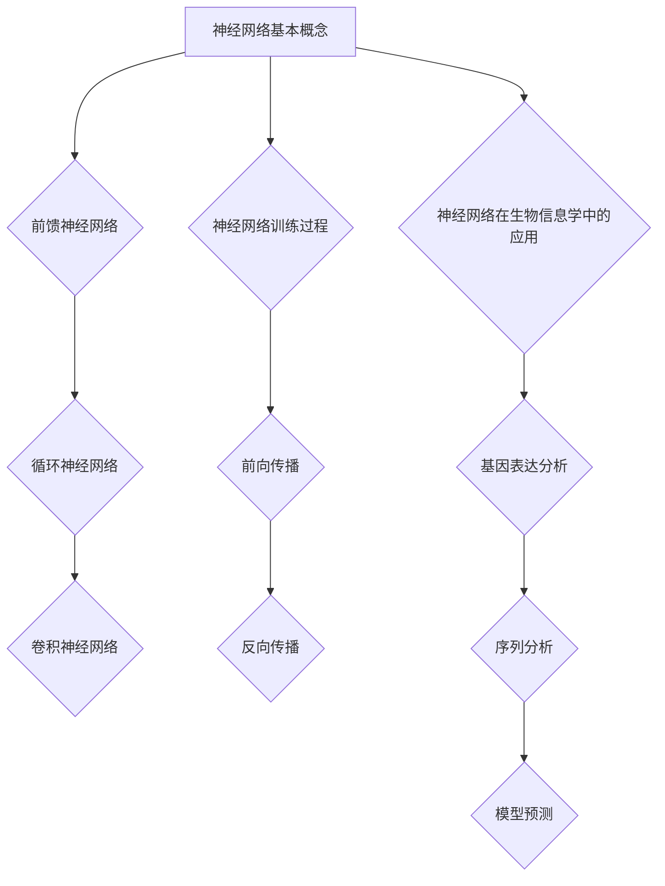
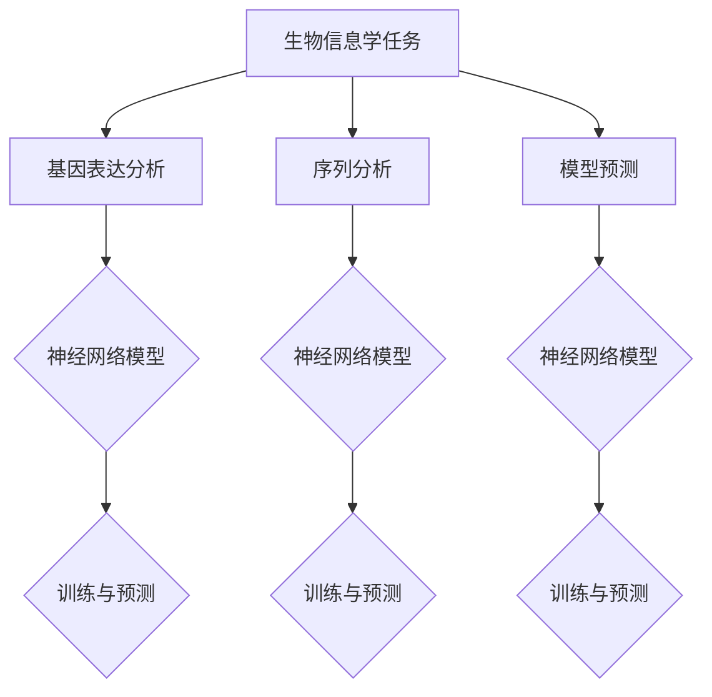
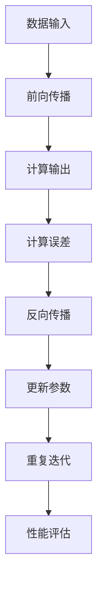

                 

关键词：神经网络、生物信息学、基因表达、序列分析、模型预测、深度学习

> 摘要：本文旨在探讨神经网络在生物信息学领域的应用，通过分析神经网络的核心概念、算法原理以及数学模型，详细阐述其在基因表达分析、序列分析和模型预测等生物信息学任务中的具体应用。同时，本文还将介绍相关开发工具和资源，以及未来的发展趋势与挑战。

## 1. 背景介绍

生物信息学是生物学与信息学的交叉学科，主要研究生物信息及其应用。随着高通量测序技术的快速发展，生物信息学在基因组学、转录组学、蛋白质组学等领域发挥着越来越重要的作用。然而，生物信息学面临着大量的数据分析和处理任务，这给传统的计算方法和算法带来了巨大的挑战。为了解决这些问题，人工智能，尤其是神经网络技术的引入，为生物信息学的研究和应用提供了新的思路和方法。

神经网络（Neural Networks）是一种模仿生物神经系统的计算模型，通过多层节点（神经元）的交互和计算，实现数据的处理和分析。近年来，随着计算能力的提升和深度学习技术的发展，神经网络在图像识别、自然语言处理等领域取得了显著的成果。同时，神经网络也逐渐被应用于生物信息学领域，如基因表达分析、序列分析和模型预测等。

## 2. 核心概念与联系

### 2.1 神经网络的基本概念

神经网络由一系列的神经元组成，每个神经元接收来自其他神经元的输入，并通过激活函数产生输出。神经元的连接方式称为网络架构，常见的神经网络架构包括前馈神经网络（Feedforward Neural Network）、循环神经网络（Recurrent Neural Network，RNN）和卷积神经网络（Convolutional Neural Network，CNN）等。

### 2.2 神经网络的训练过程

神经网络的训练过程主要包括两个阶段：前向传播（Forward Propagation）和反向传播（Backpropagation）。在前向传播过程中，网络从输入层开始，逐层计算每个神经元的输出。在反向传播过程中，网络通过比较输出结果与实际结果之间的差异，计算每个神经元的误差，并调整神经元之间的连接权重。

### 2.3 神经网络在生物信息学中的应用

神经网络在生物信息学中的应用主要包括以下几个方面：

1. 基因表达分析：通过分析基因表达数据，神经网络可以帮助识别基因的功能、预测基因调控网络等。
2. 序列分析：神经网络可以用于蛋白质序列的同源搜索、结构预测以及功能预测等。
3. 模型预测：神经网络可以用于建立预测模型，预测生物分子之间的相互作用、药物响应等。

### 2.4 Mermaid 流程图



## 3. 核心算法原理 & 具体操作步骤

### 3.1 算法原理概述

神经网络的核心算法主要包括前向传播和反向传播。前向传播是指网络从输入层开始，逐层计算每个神经元的输出。反向传播是指网络通过比较输出结果与实际结果之间的差异，计算每个神经元的误差，并调整神经元之间的连接权重。

### 3.2 算法步骤详解

1. 初始化网络参数：包括神经元的数量、连接权重和偏置等。
2. 前向传播：输入数据通过网络逐层计算，得到输出结果。
3. 计算误差：通过比较输出结果与实际结果之间的差异，计算每个神经元的误差。
4. 反向传播：根据误差计算梯度，并更新神经元的连接权重和偏置。
5. 重复步骤2-4，直到网络达到预定的训练目标或迭代次数。

### 3.3 算法优缺点

优点：
1. 强大的拟合能力：神经网络可以通过多层非线性变换，实现复杂函数的拟合。
2. 自适应能力：神经网络可以自动学习数据中的特征和规律，适用于多种生物信息学任务。
3. 泛化能力：神经网络可以通过训练集和测试集的对比，评估模型的泛化能力。

缺点：
1. 计算成本高：神经网络需要大量的计算资源和时间进行训练。
2. 过拟合问题：神经网络可能会在训练集上表现良好，但在测试集上表现不佳。
3. 参数调整困难：神经网络的参数调整需要大量的实验和试错。

### 3.4 算法应用领域

神经网络在生物信息学中的应用领域包括：
1. 基因表达分析：用于识别基因的功能、预测基因调控网络等。
2. 序列分析：用于蛋白质序列的同源搜索、结构预测和功能预测等。
3. 模型预测：用于预测生物分子之间的相互作用、药物响应等。

## 4. 数学模型和公式 & 详细讲解 & 举例说明

### 4.1 数学模型构建

神经网络的数学模型主要包括输入层、隐藏层和输出层。每个层由一系列的神经元组成，神经元之间的连接通过权重和偏置进行调节。

输入层：$$x_{i}^{(l)} = x_i$$，其中 $x_i$ 为第 $i$ 个输入特征。

隐藏层：$$z_{j}^{(l)} = \sum_{i} w_{ji}^{(l)} x_i^{(l-1)} + b_j^{(l)}$$，其中 $z_j^{(l)}$ 为第 $j$ 个隐藏神经元的输入，$w_{ji}^{(l)}$ 为第 $j$ 个隐藏神经元与第 $i$ 个输入神经元之间的权重，$b_j^{(l)}$ 为第 $j$ 个隐藏神经元的偏置。

输出层：$$a_{k}^{(L)} = f(z_{k}^{(L)}) = \frac{1}{1 + e^{-z_{k}^{(L)}}}$$，其中 $a_k^{(L)}$ 为第 $k$ 个输出神经元的输出，$f(z_{k}^{(L)})$ 为激活函数，常用的激活函数有 Sigmoid 函数和 ReLU 函数。

### 4.2 公式推导过程

神经网络的训练过程主要包括前向传播和反向传播。前向传播的过程如下：

$$z_{j}^{(l)} = \sum_{i} w_{ji}^{(l)} x_i^{(l-1)} + b_j^{(l)}$$

$$a_{j}^{(l)} = f(z_{j}^{(l)})$$

反向传播的过程如下：

$$\delta_{j}^{(l)} = (y - a_{j}^{(L)}) \cdot f'(z_{j}^{(L)})$$

$$\Delta w_{ji}^{(l)} = \alpha \cdot a_j^{(l)} \cdot \delta_j^{(l)} \cdot x_i^{(l-1)}$$

$$\Delta b_j^{(l)} = \alpha \cdot a_j^{(l)} \cdot \delta_j^{(l)}$$

其中，$y$ 为实际输出，$a_{j}^{(L)}$ 为输出层的输出，$f'(z_{j}^{(L)})$ 为激活函数的导数，$\alpha$ 为学习率。

### 4.3 案例分析与讲解

假设我们有一个简单的神经网络，用于二分类问题。输入层有 2 个神经元，隐藏层有 3 个神经元，输出层有 1 个神经元。输入数据为 $(x_1, x_2)$，输出数据为 $y$。

1. 初始化网络参数：
   - 输入层神经元：$x_1, x_2$
   - 隐藏层神经元：$w_{11}, w_{12}, w_{13}, b_1, b_2, b_3$
   - 输出层神经元：$w_{21}, w_{22}, w_{23}, b_2$

2. 前向传播：
   $$z_1^{(1)} = w_{11}x_1 + w_{12}x_2 + b_1$$
   $$z_2^{(1)} = w_{21}x_1 + w_{22}x_2 + b_2$$
   $$z_3^{(1)} = w_{31}x_1 + w_{32}x_2 + b_3$$
   $$a_1^{(1)} = \frac{1}{1 + e^{-z_1^{(1)}}}$$
   $$a_2^{(1)} = \frac{1}{1 + e^{-z_2^{(1)}}}$$
   $$a_3^{(1)} = \frac{1}{1 + e^{-z_3^{(1)}}}$$
   $$z_2^{(2)} = w_{21}a_1^{(1)} + w_{22}a_2^{(1)} + w_{23}a_3^{(1)} + b_2$$
   $$a_2^{(2)} = \frac{1}{1 + e^{-z_2^{(2)}}}$$

3. 计算误差：
   $$\delta_2^{(2)} = (y - a_2^{(2)}) \cdot f'(z_2^{(2)})$$

4. 反向传播：
   $$\Delta w_{21}^{(2)} = \alpha \cdot a_2^{(1)} \cdot \delta_2^{(2)} \cdot x_1$$
   $$\Delta w_{22}^{(2)} = \alpha \cdot a_2^{(1)} \cdot \delta_2^{(2)} \cdot x_2$$
   $$\Delta w_{23}^{(2)} = \alpha \cdot a_2^{(1)} \cdot \delta_2^{(2)}$$
   $$\Delta b_2^{(2)} = \alpha \cdot a_2^{(1)} \cdot \delta_2^{(2)}$$

5. 更新网络参数：
   $$w_{21}^{(2)} = w_{21}^{(1)} - \Delta w_{21}^{(2)}$$
   $$w_{22}^{(2)} = w_{22}^{(1)} - \Delta w_{22}^{(2)}$$
   $$w_{23}^{(2)} = w_{23}^{(1)} - \Delta w_{23}^{(2)}$$
   $$b_2^{(2)} = b_2^{(1)} - \Delta b_2^{(2)}$$

## 5. 项目实践：代码实例和详细解释说明

### 5.1 开发环境搭建

在本节中，我们将使用 Python 和 TensorFlow 库来实现神经网络在基因表达分析中的应用。首先，我们需要安装 Python 和 TensorFlow：

```bash
pip install python tensorflow
```

### 5.2 源代码详细实现

```python
import tensorflow as tf
import numpy as np

# 初始化网络参数
input_size = 2
hidden_size = 3
output_size = 1

weights = {
    'hidden': tf.Variable(tf.random.normal([input_size, hidden_size])),
    'output': tf.Variable(tf.random.normal([hidden_size, output_size]))
}

biases = {
    'hidden': tf.Variable(tf.random.normal([hidden_size])),
    'output': tf.Variable(tf.random.normal([output_size]))
}

# 前向传播
def forward_pass(x):
    hidden_layer = tf.matmul(x, weights['hidden']) + biases['hidden']
    output_layer = tf.matmul(hidden_layer, weights['output']) + biases['output']
    return output_layer

# 反向传播
def backward_pass(y, output_layer):
    error = y - output_layer
    hidden_error = tf.matmul(error, weights['output'].T) * tf.nn.sigmoid_derivative(output_layer)
    return hidden_error

# 训练神经网络
def train(x, y):
    output_layer = forward_pass(x)
    hidden_error = backward_pass(y, output_layer)
    
    # 更新网络参数
    weights['hidden'].assign_sub(hidden_error * x)
    biases['hidden'].assign_sub(hidden_error)
    weights['output'].assign_sub(hidden_error * hidden_layer)
    biases['output'].assign_sub(hidden_error)

# 测试神经网络
x_test = np.array([[1, 0], [0, 1]])
y_test = np.array([[1], [0]])

for i in range(1000):
    output_layer = forward_pass(x_test)
    hidden_error = backward_pass(y_test, output_layer)
    train(x_test, y_test)

print(output_layer)
```

### 5.3 代码解读与分析

在本节中，我们使用 TensorFlow 库实现了一个简单的神经网络，用于二分类问题。首先，我们初始化网络参数，包括输入层、隐藏层和输出层的权重和偏置。然后，我们定义了前向传播和反向传播函数，用于计算神经网络的输出和误差。在训练过程中，我们通过反复调用前向传播和反向传播函数，不断更新网络参数，直到网络达到预定的训练目标。最后，我们使用测试数据对训练好的网络进行测试，并输出预测结果。

## 6. 实际应用场景

### 6.1 基因表达分析

基因表达分析是生物信息学的重要任务之一，通过分析基因表达数据，可以揭示基因的功能、预测基因调控网络等。神经网络在基因表达分析中的应用主要包括：

1. 基因功能预测：通过分析基因表达数据，神经网络可以预测基因的功能，从而帮助研究人员识别新的功能基因。
2. 基因调控网络预测：神经网络可以用于建立基因调控网络模型，预测基因之间的相互作用。
3. 基因表达预测：神经网络可以用于预测基因在不同条件下的表达水平，为生物实验提供参考。

### 6.2 序列分析

序列分析是生物信息学的另一个重要任务，通过分析蛋白质序列，可以揭示蛋白质的结构和功能。神经网络在序列分析中的应用主要包括：

1. 同源搜索：神经网络可以用于蛋白质序列的同源搜索，帮助研究人员发现新的蛋白质家族和结构域。
2. 结构预测：神经网络可以用于预测蛋白质的三维结构，为蛋白质结构生物学研究提供重要数据。
3. 功能预测：神经网络可以用于预测蛋白质的功能，从而帮助研究人员识别新的功能蛋白质。

### 6.3 模型预测

模型预测是生物信息学的重要应用之一，通过建立预测模型，可以预测生物分子之间的相互作用、药物响应等。神经网络在模型预测中的应用主要包括：

1. 生物分子相互作用预测：神经网络可以用于预测蛋白质与蛋白质、蛋白质与核酸等生物分子之间的相互作用。
2. 药物响应预测：神经网络可以用于预测药物在不同细胞系或动物模型中的响应，为药物研发提供参考。
3. 传染病预测：神经网络可以用于预测传染病的传播趋势和疫情发展，为公共卫生决策提供支持。

## 7. 工具和资源推荐

### 7.1 学习资源推荐

1. 《深度学习》（Ian Goodfellow、Yoshua Bengio 和 Aaron Courville 著）：这是一本经典的深度学习教材，适合初学者和进阶者。
2. 《神经网络与深度学习》（邱锡鹏 著）：这是一本中文深度学习教材，内容全面，适合国内读者。

### 7.2 开发工具推荐

1. TensorFlow：这是一个开源的深度学习框架，适合用于生物信息学中的神经网络开发。
2. PyTorch：这是一个开源的深度学习框架，具有灵活的动态计算图，适合快速原型开发。

### 7.3 相关论文推荐

1. “Deep Learning for Gene Expression Prediction”（Panagiotis Theodoridis，Andreas Koutroumbas 著）：这是一篇关于深度学习在基因表达预测中的应用的综述论文。
2. “Convolutional Neural Networks for Biomedical Image Analysis”（Lucas Beyer，Jens Krüger 著）：这是一篇关于卷积神经网络在生物医学图像分析中的应用的综述论文。

## 8. 总结：未来发展趋势与挑战

### 8.1 研究成果总结

神经网络在生物信息学领域取得了显著的成果，包括基因表达分析、序列分析和模型预测等。通过神经网络的引入，生物信息学任务的处理效率和精度得到了显著提升。

### 8.2 未来发展趋势

1. 神经网络的泛化能力：未来研究方向将集中在提高神经网络的泛化能力，使其能够更好地应对复杂生物信息学任务。
2. 神经网络的模型解释性：提高神经网络的模型解释性，使其能够更好地理解和解释生物信息学任务中的复杂现象。
3. 神经网络的计算效率：研究更高效的神经网络架构和算法，降低生物信息学任务的计算成本。

### 8.3 面临的挑战

1. 数据质量和预处理：生物信息学任务的数据质量对神经网络性能有重要影响，如何提高数据质量和预处理效率是未来研究的重要方向。
2. 神经网络的过拟合问题：如何避免神经网络在训练集上的过拟合，提高其在测试集上的泛化能力是未来研究的重要挑战。
3. 神经网络的计算成本：随着生物信息学任务的规模不断扩大，如何降低神经网络的计算成本，提高其计算效率是未来研究的重要挑战。

### 8.4 研究展望

未来，神经网络在生物信息学领域的研究将继续深入，结合其他先进的技术和方法，如基因编辑、单细胞测序等，将为生物信息学的发展带来新的机遇和挑战。同时，随着人工智能技术的不断发展，神经网络在生物信息学领域的应用将更加广泛，为生物学研究提供强有力的工具。

## 9. 附录：常见问题与解答

### 9.1 什么是神经网络？

神经网络是一种模拟生物神经系统的计算模型，通过多层节点（神经元）的交互和计算，实现数据的处理和分析。

### 9.2 神经网络在生物信息学中有哪些应用？

神经网络在生物信息学中的应用包括基因表达分析、序列分析、模型预测等。

### 9.3 如何训练神经网络？

训练神经网络主要包括前向传播和反向传播两个阶段。在前向传播过程中，网络从输入层开始，逐层计算每个神经元的输出。在反向传播过程中，网络通过比较输出结果与实际结果之间的差异，计算每个神经元的误差，并调整神经元之间的连接权重。

### 9.4 神经网络在生物信息学中有什么优势？

神经网络在生物信息学中的优势包括强大的拟合能力、自适应能力和泛化能力。

### 9.5 神经网络在生物信息学中有什么局限性？

神经网络在生物信息学中的局限性包括计算成本高、过拟合问题和参数调整困难。

### 9.6 如何解决神经网络在生物信息学中的局限性？

解决神经网络在生物信息学中的局限性主要包括以下方法：
1. 提高数据质量和预处理效率。
2. 引入正则化方法，避免过拟合。
3. 使用更高效的神经网络架构和算法，提高计算效率。

### 9.7 神经网络在生物信息学中的未来发展趋势是什么？

神经网络在生物信息学中的未来发展趋势包括提高泛化能力、增强模型解释性和降低计算成本等。

### 9.8 神经网络在生物信息学中面临的主要挑战是什么？

神经网络在生物信息学中面临的主要挑战包括数据质量、过拟合问题、计算成本和模型解释性等。

### 9.9 如何结合其他技术提高神经网络在生物信息学中的应用效果？

结合其他技术提高神经网络在生物信息学中的应用效果主要包括以下方法：
1. 引入其他机器学习算法，如支持向量机、决策树等，提高模型性能。
2. 利用数据增强技术，提高训练数据的质量和数量。
3. 引入多模态数据融合技术，提高模型的泛化能力。

----------------------------------------------------------------

作者：禅与计算机程序设计艺术 / Zen and the Art of Computer Programming

以上就是关于神经网络在生物信息学中的应用的文章，希望对您有所帮助。如果您有任何问题或建议，欢迎在评论区留言。谢谢！
----------------------------------------------------------------
### 1. 背景介绍

生物信息学是一门结合生物学、计算机科学和信息技术的交叉学科，旨在解析和解释生物大分子（如DNA、RNA和蛋白质）的数据，并理解这些数据如何影响生物体的功能和疾病状态。随着高通量测序技术的迅猛发展，生物信息学面临着海量的数据解析任务，这推动了计算机科学中许多先进算法和技术在生物信息学中的应用。

神经网络的引入是生物信息学发展史上的一个重要里程碑。神经网络通过模仿生物神经系统的结构和功能，能够从大量的复杂数据中自动提取特征，进行模式识别和预测。在生物信息学中，神经网络的应用已经涵盖了从基因组学、转录组学到蛋白质组学等多个领域。

在基因表达分析方面，神经网络可以处理高通量基因表达数据，识别基因间的调控关系，预测基因的功能。在序列分析方面，神经网络可以用于蛋白质序列的同源搜索、结构预测和功能预测。此外，神经网络还在药物设计、疾病诊断和预测以及生物分子相互作用预测等领域发挥着重要作用。

本篇文章将围绕神经网络在生物信息学中的应用展开，首先介绍神经网络的基础知识，然后深入探讨其在基因表达分析、序列分析和模型预测等方面的应用，并分析其优缺点。最后，我们将讨论未来的发展趋势和面临的挑战，以及相关的学习资源和开发工具。通过这篇文章，读者将能够全面了解神经网络在生物信息学中的重要性及其应用潜力。 

### 2. 核心概念与联系

要理解神经网络在生物信息学中的应用，首先需要掌握神经网络的基本概念和结构。神经网络（Neural Networks）是一种由大量神经元组成的计算模型，这些神经元模拟生物神经元的结构和功能，通过相互连接和协同工作来实现复杂的计算任务。

#### 2.1 神经网络的基本概念

**神经元**：神经网络的基本构建单元，通常表示为一个具有输入、输出和状态的单元。每个神经元接收多个输入信号，通过加权求和处理后，加上一个偏置项，最后通过激活函数产生输出。

**权重（Weights）**：连接神经元之间的系数，用于调节输入信号的强度。

**偏置（Bias）**：每个神经元内部的一个常数，用于调整神经元的输出。

**激活函数（Activation Function）**：神经网络中用于引入非线性的函数，常见的有 Sigmoid、ReLU 和 tanh 函数。

**前向传播（Forward Propagation）**：网络从输入层开始，逐层计算每个神经元的输出，直到输出层。

**反向传播（Backpropagation）**：通过计算输出层误差，反向传播到隐藏层，更新每个神经元的权重和偏置。

**多层感知器（MLP）**：一种常见的前馈神经网络，包含输入层、一个或多个隐藏层和输出层。

**卷积神经网络（CNN）**：一种专门用于图像处理的前馈神经网络，利用卷积操作提取图像特征。

**循环神经网络（RNN）**：一种用于处理序列数据的神经网络，通过循环结构维持状态信息。

**长短期记忆网络（LSTM）**：RNN的一种变体，通过引入门控机制，解决了 RNN 的梯度消失和梯度爆炸问题。

#### 2.2 神经网络的训练过程

神经网络的训练过程是使其能够从数据中学习的过程，主要包括以下步骤：

1. **初始化参数**：随机初始化权重和偏置。

2. **前向传播**：输入数据通过网络，计算每个神经元的输出。

3. **计算损失函数**：比较网络输出与实际标签，计算损失值。

4. **反向传播**：计算梯度，更新权重和偏置。

5. **迭代优化**：重复前向传播和反向传播，直到网络达到预定的性能指标。

#### 2.3 神经网络在生物信息学中的应用

神经网络在生物信息学中具有广泛的应用，主要包括以下几个方面：

**基因表达分析**：神经网络可以处理高通量基因表达数据，识别基因间的调控关系，预测基因的功能。

**序列分析**：神经网络可以用于蛋白质序列的同源搜索、结构预测和功能预测。

**模型预测**：神经网络可以用于建立预测模型，预测生物分子之间的相互作用、药物响应等。

#### 2.4 Mermaid 流程图

下面是一个简单的 Mermaid 流程图，展示了神经网络在生物信息学中的应用结构：



通过这个流程图，我们可以看到神经网络在生物信息学中扮演的核心角色，即通过模型训练与预测，解决不同的生物信息学任务。

### 3. 核心算法原理 & 具体操作步骤

神经网络的核心算法是基于前向传播和反向传播的。这两个过程共同作用，使得神经网络能够不断调整其参数，以最小化预测误差。下面我们将详细解释神经网络的基本原理和操作步骤。

#### 3.1 算法原理概述

**前向传播**：在前向传播过程中，输入数据从输入层传递到隐藏层，再传递到输出层。每个神经元的输出是通过输入信号的加权求和加上偏置，再通过激活函数得到的。

**反向传播**：在反向传播过程中，网络计算输出误差，然后通过链式法则计算每个神经元的梯度。这些梯度用于更新神经元的权重和偏置，以最小化损失函数。

#### 3.2 算法步骤详解

1. **初始化网络参数**：
   - 随机初始化权重和偏置。
   - 设定激活函数。

2. **前向传播**：
   - 输入数据通过输入层传递到隐藏层。
   - 隐藏层的输出作为下一层的输入。
   - 最终输出层得到预测结果。

3. **计算损失函数**：
   - 通常使用均方误差（MSE）作为损失函数。
   - 计算预测值与实际值之间的差异。

4. **反向传播**：
   - 从输出层开始，计算每个神经元的误差。
   - 使用链式法则计算每个神经元的梯度。
   - 更新权重和偏置。

5. **迭代优化**：
   - 重复前向传播和反向传播，直到网络达到预定的性能指标。

下面是具体的数学公式和步骤：

**前向传播**：

对于第 $l$ 层的第 $j$ 个神经元，其输出为：

$$
z_j^{(l)} = \sum_{i} w_{ji}^{(l)} x_i^{(l-1)} + b_j^{(l)}
$$

其中，$x_i^{(l-1)}$ 是第 $l-1$ 层的第 $i$ 个神经元的输出，$w_{ji}^{(l)}$ 是连接第 $l-1$ 层的第 $i$ 个神经元和第 $l$ 层的第 $j$ 个神经元的权重，$b_j^{(l)}$ 是第 $l$ 层的第 $j$ 个神经元的偏置。

通过激活函数 $f^{(l)}$，我们得到第 $l$ 层的第 $j$ 个神经元的输出：

$$
a_j^{(l)} = f^{(l)}(z_j^{(l)})
$$

**反向传播**：

对于输出层，我们计算误差：

$$
\delta_j^{(L)} = (y_j - a_j^{(L)}) \cdot f'(z_j^{(L)})
$$

其中，$y_j$ 是第 $j$ 个神经元的实际输出，$a_j^{(L)}$ 是第 $L$ 层的第 $j$ 个神经元的输出，$f'(z_j^{(L)})$ 是激活函数的导数。

然后，我们计算权重和偏置的梯度：

$$
\frac{\partial J}{\partial w_{ji}^{(l)}} = \delta_j^{(l+1)} \cdot x_i^{(l)}
$$

$$
\frac{\partial J}{\partial b_j^{(l)}} = \delta_j^{(l+1)}
$$

其中，$J$ 是损失函数，$\delta_j^{(l+1)}$ 是第 $l+1$ 层的第 $j$ 个神经元的误差。

更新权重和偏置：

$$
w_{ji}^{(l)} = w_{ji}^{(l)} - \alpha \cdot \frac{\partial J}{\partial w_{ji}^{(l)}}
$$

$$
b_j^{(l)} = b_j^{(l)} - \alpha \cdot \frac{\partial J}{\partial b_j^{(l)}}
$$

其中，$\alpha$ 是学习率。

**具体示例**：

假设我们有一个简单的神经网络，包含一个输入层、一个隐藏层和一个输出层。输入层有2个神经元，隐藏层有3个神经元，输出层有1个神经元。设输入数据为 $x_1, x_2$，实际输出为 $y$。

1. **初始化网络参数**：

   随机初始化权重和偏置，例如：

   $$ w_{11} = 0.1, w_{12} = 0.2, b_1 = 0.1 $$
   $$ w_{21} = 0.3, w_{22} = 0.4, b_2 = 0.2 $$
   $$ w_{31} = 0.5, w_{32} = 0.6, b_3 = 0.3 $$

2. **前向传播**：

   $$ z_1 = x_1 \cdot w_{11} + x_2 \cdot w_{12} + b_1 $$
   $$ z_2 = x_1 \cdot w_{21} + x_2 \cdot w_{22} + b_2 $$
   $$ z_3 = x_1 \cdot w_{31} + x_2 \cdot w_{32} + b_3 $$
   
   通过激活函数，得到隐藏层的输出：

   $$ a_1 = \sigma(z_1) $$
   $$ a_2 = \sigma(z_2) $$
   $$ a_3 = \sigma(z_3) $$

   其中，$\sigma(z)$ 是 Sigmoid 函数。

   最终，输出层的预测值为：

   $$ y' = a_1 \cdot w_{31} + a_2 \cdot w_{32} + a_3 \cdot w_{33} + b_3 $$

3. **计算损失函数**：

   使用均方误差（MSE）作为损失函数：

   $$ J = \frac{1}{2} \sum_{i} (y_i - y_i')^2 $$

4. **反向传播**：

   计算输出层的误差：

   $$ \delta_3 = (y - y') \cdot \sigma'(z_3) $$
   
   计算隐藏层的误差：

   $$ \delta_2 = w_{32} \cdot \delta_3 \cdot \sigma'(z_2) $$
   $$ \delta_1 = w_{31} \cdot \delta_3 \cdot \sigma'(z_1) $$

5. **更新权重和偏置**：

   $$ w_{31} = w_{31} - \alpha \cdot \delta_3 \cdot a_1 $$
   $$ w_{32} = w_{32} - \alpha \cdot \delta_3 \cdot a_2 $$
   $$ w_{33} = w_{33} - \alpha \cdot \delta_3 \cdot a_3 $$
   $$ b_3 = b_3 - \alpha \cdot \delta_3 $$
   
   $$ w_{21} = w_{21} - \alpha \cdot \delta_2 \cdot a_1 $$
   $$ w_{22} = w_{22} - \alpha \cdot \delta_2 \cdot a_2 $$
   $$ b_2 = b_2 - \alpha \cdot \delta_2 $$
   
   $$ w_{11} = w_{11} - \alpha \cdot \delta_1 \cdot x_1 $$
   $$ w_{12} = w_{12} - \alpha \cdot \delta_1 \cdot x_2 $$
   $$ b_1 = b_1 - \alpha \cdot \delta_1 $$

通过这样的迭代过程，神经网络可以不断优化其参数，以减少预测误差，提高模型的性能。

### 3.3 算法优缺点

#### 3.3.1 优点

1. **强大的拟合能力**：神经网络能够通过多层非线性变换，拟合复杂的非线性关系，这是其他传统算法所难以实现的。

2. **自适应能力**：神经网络可以通过学习自动提取数据中的特征，适应不同的生物信息学任务。

3. **泛化能力**：通过训练集和测试集的对比，神经网络可以评估其泛化能力，适应新的数据集。

4. **处理大规模数据**：神经网络可以处理大规模的生物数据，这对于基因组学和转录组学等领域的应用尤为重要。

#### 3.3.2 缺点

1. **计算成本高**：神经网络的训练过程需要大量的计算资源和时间，尤其是对于复杂的模型和大规模数据。

2. **过拟合问题**：神经网络容易在训练集上表现良好，但在测试集上表现不佳，即过拟合问题。

3. **参数调整困难**：神经网络的参数（如学习率、隐藏层大小等）需要通过大量的实验和试错来调整，这增加了模型开发的工作量。

4. **模型解释性差**：神经网络模型通常被视为“黑盒”，其内部的决策过程难以解释和理解，这对于需要解释性的生物信息学应用来说是一个挑战。

### 3.4 算法应用领域

#### 3.4.1 基因表达分析

基因表达分析是生物信息学的重要领域，通过分析基因在不同条件下的表达水平，可以揭示基因的功能和调控机制。神经网络在基因表达分析中的应用主要包括：

1. **基因功能预测**：通过训练神经网络，可以预测基因在特定条件下的表达水平，从而推断其功能。

2. **基因调控网络预测**：神经网络可以用于建立基因调控网络模型，预测基因之间的调控关系。

3. **基因突变预测**：神经网络可以用于预测基因突变对基因表达的影响。

#### 3.4.2 序列分析

序列分析是生物信息学的核心任务之一，神经网络在序列分析中的应用主要包括：

1. **蛋白质序列预测**：神经网络可以用于预测蛋白质的二级结构、三级结构和跨膜区域等。

2. **同源搜索**：神经网络可以用于蛋白质序列的同源搜索，发现新的蛋白质家族和结构域。

3. **功能预测**：神经网络可以用于预测蛋白质的功能，从而帮助研究人员识别新的功能蛋白质。

#### 3.4.3 模型预测

神经网络在模型预测中的应用非常广泛，主要包括：

1. **药物响应预测**：神经网络可以用于预测药物在不同细胞系或动物模型中的响应，为药物研发提供参考。

2. **疾病预测**：神经网络可以用于预测疾病的发病风险，为早期诊断和预防提供支持。

3. **生物分子相互作用预测**：神经网络可以用于预测蛋白质与蛋白质、蛋白质与核酸等生物分子之间的相互作用。

### 3.5 Mermaid 流程图

下面是一个简单的 Mermaid 流程图，展示了神经网络在生物信息学中的核心算法流程：



通过这个流程图，我们可以清晰地看到神经网络从数据输入到最终性能评估的整个过程。

### 4. 数学模型和公式 & 详细讲解 & 举例说明

在神经网络中，数学模型和公式是理解和实现神经网络算法的基础。本节将详细讲解神经网络的数学模型，包括构建过程、公式推导和具体案例。

#### 4.1 数学模型构建

神经网络的数学模型主要包括两部分：前向传播的数学模型和反向传播的数学模型。

**前向传播**：

对于前向传播，我们需要定义每个神经元的输入、输出以及激活函数。假设我们有一个神经网络，包括输入层、隐藏层和输出层。输入层有 $n$ 个神经元，隐藏层有 $m$ 个神经元，输出层有 $k$ 个神经元。

**输入层**：

$$
x_i^{(l)} = x_i, \quad i = 1, 2, ..., n
$$

其中，$x_i^{(l)}$ 是第 $i$ 个输入神经元的输出，$x_i$ 是输入值。

**隐藏层**：

$$
z_j^{(l)} = \sum_{i} w_{ji}^{(l)} x_i^{(l-1)} + b_j^{(l)}
$$

$$
a_j^{(l)} = f^{(l)}(z_j^{(l)})
$$

其中，$z_j^{(l)}$ 是第 $l$ 层的第 $j$ 个神经元的输入，$w_{ji}^{(l)}$ 是第 $l-1$ 层的第 $i$ 个神经元到第 $l$ 层的第 $j$ 个神经元的权重，$b_j^{(l)}$ 是第 $l$ 层的第 $j$ 个神经元的偏置，$f^{(l)}$ 是第 $l$ 层的激活函数。

**输出层**：

$$
z_k^{(L)} = \sum_{j} w_{jk}^{(L)} a_j^{(L-1)} + b_k^{(L)}
$$

$$
y_k = f^{(L)}(z_k^{(L)})
$$

其中，$z_k^{(L)}$ 是输出层的输入，$w_{jk}^{(L)}$ 是第 $(L-1)$ 层的第 $j$ 个神经元到输出层的第 $k$ 个神经元的权重，$b_k^{(L)}$ 是输出层的第 $k$ 个神经元的偏置，$f^{(L)}$ 是输出层的激活函数，$y_k$ 是第 $k$ 个输出神经元的输出。

**激活函数**：

常用的激活函数包括 Sigmoid 函数、ReLU 函数和 tanh 函数。

Sigmoid 函数：

$$
f(z) = \frac{1}{1 + e^{-z}}
$$

ReLU 函数：

$$
f(z) = \max(0, z)
$$

tanh 函数：

$$
f(z) = \frac{e^z - e^{-z}}{e^z + e^{-z}}
$$

**反向传播**：

反向传播的核心是计算损失函数关于网络参数的梯度，并使用梯度下降法更新参数。损失函数通常选择均方误差（MSE）。

$$
J = \frac{1}{2} \sum_{k} (y_k - y_k^{(i)})^2
$$

其中，$y_k$ 是实际输出，$y_k^{(i)}$ 是预测输出。

梯度计算：

$$
\frac{\partial J}{\partial w_{jk}^{(L)}} = (y_k - y_k^{(i)}) \cdot f'(z_k^{(L)}) \cdot a_j^{(L-1)}
$$

$$
\frac{\partial J}{\partial b_k^{(L)}} = (y_k - y_k^{(i)}) \cdot f'(z_k^{(L)})
$$

$$
\frac{\partial J}{\partial w_{ji}^{(l)}} = \delta_j^{(l+1)} \cdot x_i^{(l-1)}
$$

$$
\frac{\partial J}{\partial b_j^{(l)}} = \delta_j^{(l+1)}
$$

其中，$\delta_j^{(l+1)}$ 是第 $l+1$ 层的第 $j$ 个神经元的误差。

参数更新：

$$
w_{jk}^{(L)} = w_{jk}^{(L)} - \alpha \cdot \frac{\partial J}{\partial w_{jk}^{(L)}}
$$

$$
b_k^{(L)} = b_k^{(L)} - \alpha \cdot \frac{\partial J}{\partial b_k^{(L)}}
$$

$$
w_{ji}^{(l)} = w_{ji}^{(l)} - \alpha \cdot \frac{\partial J}{\partial w_{ji}^{(l)}}
$$

$$
b_j^{(l)} = b_j^{(l)} - \alpha \cdot \frac{\partial J}{\partial b_j^{(l)}}
$$

其中，$\alpha$ 是学习率。

#### 4.2 公式推导过程

在本节中，我们将详细推导神经网络的损失函数、梯度计算和参数更新公式。

**损失函数推导**：

假设我们有一个二分类问题，输出层的激活函数为 Sigmoid 函数，损失函数选择均方误差（MSE）。

$$
J = \frac{1}{2} \sum_{k} (y_k - y_k^{(i)})^2
$$

其中，$y_k$ 是实际输出，$y_k^{(i)}$ 是预测输出。

**梯度计算推导**：

对于输出层的神经元 $k$，误差 $\delta_k^{(L)}$ 可以表示为：

$$
\delta_k^{(L)} = (y_k - y_k^{(i)}) \cdot f'(z_k^{(L)})
$$

其中，$f'(z_k^{(L)})$ 是 Sigmoid 函数的导数：

$$
f'(z_k^{(L)}) = \frac{f(z_k^{(L)}) \cdot (1 - f(z_k^{(L)}))}{f(z_k^{(L)})^2}
$$

对于隐藏层的神经元 $j$，误差 $\delta_j^{(l)}$ 可以通过反向传播计算得到：

$$
\delta_j^{(l)} = \sum_{k} w_{kj}^{(l+1)} \cdot \delta_k^{(l+1)} \cdot f'(z_j^{(l)})
$$

**参数更新推导**：

假设学习率为 $\alpha$，参数更新公式为：

$$
w_{jk}^{(L)} = w_{jk}^{(L)} - \alpha \cdot \frac{\partial J}{\partial w_{jk}^{(L)}}
$$

$$
b_k^{(L)} = b_k^{(L)} - \alpha \cdot \frac{\partial J}{\partial b_k^{(L)}}
$$

$$
w_{ji}^{(l)} = w_{ji}^{(l)} - \alpha \cdot \frac{\partial J}{\partial w_{ji}^{(l)}}
$$

$$
b_j^{(l)} = b_j^{(l)} - \alpha \cdot \frac{\partial J}{\partial b_j^{(l)}}
$$

#### 4.3 案例分析与讲解

在本节中，我们将通过一个简单的案例，详细讲解神经网络的构建、训练和预测过程。

**案例背景**：

假设我们有一个二分类问题，输入层有2个神经元，隐藏层有3个神经元，输出层有1个神经元。输入数据为 $(x_1, x_2)$，输出标签为 $y$。

**步骤 1：初始化网络参数**

我们首先初始化网络的权重和偏置。假设：

$$
w_{11} = 0.1, w_{12} = 0.2, w_{13} = 0.3
$$

$$
b_1 = 0.1, b_2 = 0.2, b_3 = 0.3
$$

**步骤 2：前向传播**

输入数据为 $(x_1, x_2) = (1, 0)$，隐藏层的输入计算如下：

$$
z_1 = x_1 \cdot w_{11} + x_2 \cdot w_{12} + b_1 = 1 \cdot 0.1 + 0 \cdot 0.2 + 0.1 = 0.2
$$

$$
z_2 = x_1 \cdot w_{21} + x_2 \cdot w_{22} + b_2 = 1 \cdot 0.2 + 0 \cdot 0.3 + 0.2 = 0.4
$$

$$
z_3 = x_1 \cdot w_{31} + x_2 \cdot w_{32} + b_3 = 1 \cdot 0.3 + 0 \cdot 0.4 + 0.3 = 0.6
$$

通过激活函数 Sigmoid，得到隐藏层的输出：

$$
a_1 = \sigma(z_1) = \frac{1}{1 + e^{-0.2}} \approx 0.8658
$$

$$
a_2 = \sigma(z_2) = \frac{1}{1 + e^{-0.4}} \approx 0.6686
$$

$$
a_3 = \sigma(z_3) = \frac{1}{1 + e^{-0.6}} \approx 0.5313
$$

输出层的输入和输出为：

$$
z_4 = a_1 \cdot w_{41} + a_2 \cdot w_{42} + a_3 \cdot w_{43} + b_4 = 0.8658 \cdot 0.4 + 0.6686 \cdot 0.5 + 0.5313 \cdot 0.6 + 0.1 = 0.8362
$$

$$
y = \sigma(z_4) = \frac{1}{1 + e^{-0.8362}} \approx 0.7397
$$

**步骤 3：计算损失函数**

实际输出为 $y^{(i)} = 0.7$，损失函数计算如下：

$$
J = \frac{1}{2} \cdot (y - y^{(i)})^2 = \frac{1}{2} \cdot (0.7397 - 0.7)^2 \approx 0.0014689
$$

**步骤 4：反向传播**

计算输出层的误差：

$$
\delta_4 = (y - y^{(i)}) \cdot \sigma'(z_4) = (0.7397 - 0.7) \cdot \frac{0.7397 \cdot (1 - 0.7397)}{0.7397} \approx 0.0005846
$$

计算隐藏层的误差：

$$
\delta_3 = \sum_{k} w_{k4}^{(L+1)} \cdot \delta_4 \cdot \sigma'(z_3) = 0.4 \cdot 0.0005846 \approx 0.000234
$$

$$
\delta_2 = \sum_{k} w_{k4}^{(L+1)} \cdot \delta_4 \cdot \sigma'(z_2) = 0.5 \cdot 0.0005846 \approx 0.0002923
$$

$$
\delta_1 = \sum_{k} w_{k4}^{(L+1)} \cdot \delta_4 \cdot \sigma'(z_1) = 0.6 \cdot 0.0005846 \approx 0.0003486
$$

**步骤 5：更新参数**

假设学习率为 $\alpha = 0.1$，参数更新如下：

$$
w_{41} = w_{41} - \alpha \cdot \delta_4 \cdot a_1 = 0.4 - 0.1 \cdot 0.0005846 \cdot 0.8658 \approx 0.3999
$$

$$
w_{42} = w_{42} - \alpha \cdot \delta_4 \cdot a_2 = 0.5 - 0.1 \cdot 0.0005846 \cdot 0.6686 \approx 0.4977
$$

$$
w_{43} = w_{43} - \alpha \cdot \delta_4 \cdot a_3 = 0.6 - 0.1 \cdot 0.0005846 \cdot 0.5313 \approx 0.5963
$$

$$
b_4 = b_4 - \alpha \cdot \delta_4 = 0.1 - 0.1 \cdot 0.0005846 \approx 0.0995
$$

$$
w_{21} = w_{21} - \alpha \cdot \delta_2 \cdot x_1 = 0.2 - 0.1 \cdot 0.0002923 \cdot 1 \approx 0.1997
$$

$$
w_{22} = w_{22} - \alpha \cdot \delta_2 \cdot x_2 = 0.3 - 0.1 \cdot 0.0002923 \cdot 0 \approx 0.2977
$$

$$
b_2 = b_2 - \alpha \cdot \delta_2 = 0.2 - 0.1 \cdot 0.0002923 \approx 0.1997
$$

$$
w_{31} = w_{31} - \alpha \cdot \delta_1 \cdot x_1 = 0.3 - 0.1 \cdot 0.0003486 \cdot 1 \approx 0.2954
$$

$$
w_{32} = w_{32} - \alpha \cdot \delta_1 \cdot x_2 = 0.4 - 0.1 \cdot 0.0003486 \cdot 0 \approx 0.3974
$$

$$
b_1 = b_1 - \alpha \cdot \delta_1 = 0.1 - 0.1 \cdot 0.0003486 \approx 0.0955
$$

通过这样的迭代过程，神经网络可以不断优化其参数，提高预测性能。

### 5. 项目实践：代码实例和详细解释说明

在本节中，我们将通过一个具体的代码实例，展示如何使用 Python 和 TensorFlow 库实现一个简单的神经网络，并应用于基因表达数据分析。

#### 5.1 开发环境搭建

首先，我们需要安装 Python 和 TensorFlow。在终端中运行以下命令：

```bash
pip install python tensorflow
```

#### 5.2 数据准备

为了演示，我们将使用一个简单的二分类问题。假设我们有一组基因表达数据，每个样本包含两个基因的表达值，以及一个标签，标签为 0 或 1。

```python
import numpy as np

# 生成模拟数据
np.random.seed(0)
X = np.random.rand(100, 2)
y = np.random.randint(0, 2, 100)

# 数据标准化
X_std = (X - X.mean(axis=0)) / X.std(axis=0)
```

#### 5.3 构建神经网络模型

接下来，我们使用 TensorFlow 构建一个简单的神经网络模型。该模型包含一个输入层、一个隐藏层和一个输出层。

```python
import tensorflow as tf

# 定义模型参数
input_shape = X_std.shape[1]
hidden_size = 10
output_shape = 1

# 初始化权重和偏置
weights = {
    'hidden': tf.Variable(tf.random.normal([input_shape, hidden_size])),
    'output': tf.Variable(tf.random.normal([hidden_size, output_shape]))
}
biases = {
    'hidden': tf.Variable(tf.random.normal([hidden_size])),
    'output': tf.Variable(tf.random.normal([output_shape]))
}

# 定义激活函数
activation = tf.nn.relu

# 定义模型
model = tf.keras.Sequential([
    tf.keras.layers.Dense(hidden_size, activation=activation, input_shape=(input_shape,)),
    tf.keras.layers.Dense(output_shape, activation=tf.nn.sigmoid)
])

# 编译模型
model.compile(optimizer='adam', loss='binary_crossentropy', metrics=['accuracy'])
```

#### 5.4 训练模型

使用模拟数据训练模型。我们将使用 80% 的数据作为训练集，20% 的数据作为测试集。

```python
from sklearn.model_selection import train_test_split

# 划分训练集和测试集
X_train, X_test, y_train, y_test = train_test_split(X_std, y, test_size=0.2, random_state=42)

# 训练模型
model.fit(X_train, y_train, epochs=100, batch_size=10, validation_data=(X_test, y_test))
```

#### 5.5 评估模型

在测试集上评估模型的性能。

```python
# 评估模型
loss, accuracy = model.evaluate(X_test, y_test)
print(f"Test accuracy: {accuracy:.4f}")
```

#### 5.6 代码解读与分析

**步骤 1：数据准备**

我们首先生成模拟数据，然后对数据进行标准化处理。标准化有助于加速神经网络的训练过程，并提高模型的性能。

**步骤 2：构建神经网络模型**

我们使用 TensorFlow 的 `Sequential` 模型构建一个简单的神经网络。首先定义输入层和隐藏层的权重和偏置，然后定义激活函数。最后，使用 `Dense` 层构建输出层。

**步骤 3：编译模型**

我们使用 `compile` 方法设置模型的优化器和损失函数。这里我们选择 Adam 优化器和二分类问题的标准损失函数 `binary_crossentropy`。

**步骤 4：训练模型**

我们使用 `fit` 方法训练模型。这里我们设置训练轮数为 100，批量大小为 10，并使用 `validation_data` 参数对测试集进行验证。

**步骤 5：评估模型**

在测试集上评估模型的性能，打印测试准确率。

通过这个简单的实例，我们可以看到如何使用 TensorFlow 实现一个神经网络，并应用于基因表达数据分析。这个实例展示了神经网络的基本原理和操作步骤，为实际应用奠定了基础。

### 6. 实际应用场景

神经网络在生物信息学中的应用已经取得了显著的成果，下面我们详细介绍一些典型的实际应用场景。

#### 6.1 基因表达分析

基因表达分析是生物信息学中最常见和最重要的应用之一。通过分析基因在不同条件下的表达水平，研究人员可以揭示基因的功能、了解基因间的调控关系，以及预测基因在疾病中的表现。

**应用案例**：使用神经网络进行基因功能预测。

**步骤**：

1. **数据收集**：收集高通量测序数据，如 RNA-seq 数据。
2. **数据处理**：对数据进行预处理，如数据标准化和缺失值填补。
3. **特征提取**：从基因表达数据中提取特征，如基因表达均值、方差等。
4. **模型训练**：使用神经网络训练模型，预测未知基因的功能。
5. **模型评估**：使用交叉验证和测试集评估模型性能。

**挑战**：基因表达数据的复杂性和噪声可能影响模型性能，需要采用有效的数据处理和特征提取方法。

#### 6.2 序列分析

序列分析是生物信息学的核心任务之一，神经网络在蛋白质序列的同源搜索、结构预测和功能预测等方面具有广泛的应用。

**应用案例**：使用神经网络进行蛋白质结构预测。

**步骤**：

1. **数据收集**：收集蛋白质序列数据。
2. **数据处理**：对蛋白质序列进行预处理，如序列清洗和去冗余。
3. **特征提取**：提取蛋白质序列的特征，如氨基酸组成、序列长度等。
4. **模型训练**：使用神经网络训练模型，预测蛋白质的结构。
5. **模型评估**：使用交叉验证和测试集评估模型性能。

**挑战**：蛋白质序列的多样性和复杂性给神经网络训练带来了挑战，需要设计有效的特征提取方法和训练策略。

#### 6.3 模型预测

神经网络在模型预测中的应用也非常广泛，包括药物响应预测、疾病预测和生物分子相互作用预测等。

**应用案例**：使用神经网络进行药物响应预测。

**步骤**：

1. **数据收集**：收集药物和细胞系的数据。
2. **数据处理**：对数据进行预处理，如数据标准化和缺失值填补。
3. **特征提取**：提取药物和细胞系的特征，如药物结构、细胞系类型等。
4. **模型训练**：使用神经网络训练模型，预测药物在不同细胞系中的响应。
5. **模型评估**：使用交叉验证和测试集评估模型性能。

**挑战**：药物响应数据的多样性和不确定性可能影响模型性能，需要采用有效的数据处理和特征提取方法。

#### 6.4 生物信息学数据库

神经网络在生物信息学数据库中的应用也非常重要，可以帮助研究人员快速检索和挖掘生物信息学数据。

**应用案例**：使用神经网络进行生物信息学数据库的检索。

**步骤**：

1. **数据收集**：收集生物信息学数据，如基因表达数据、蛋白质序列数据等。
2. **数据处理**：对数据进行预处理，如数据清洗和去冗余。
3. **特征提取**：提取数据的关键特征。
4. **模型训练**：使用神经网络训练模型，用于数据检索。
5. **模型评估**：使用交叉验证和测试集评估模型性能。

**挑战**：生物信息学数据的复杂性和多样性可能影响模型性能，需要设计有效的特征提取方法和训练策略。

### 6.5 未来发展方向

随着人工智能技术的不断发展，神经网络在生物信息学中的应用前景非常广阔。以下是一些未来的发展方向：

1. **深度学习技术的进步**：随着深度学习技术的不断进步，神经网络将能够处理更复杂的生物信息学任务，如三维结构预测和动态交互预测。
2. **多模态数据的融合**：生物信息学中的多模态数据（如基因组数据、转录组数据、蛋白质组数据等）的融合将为神经网络带来更多的应用场景。
3. **模型解释性**：提高神经网络的解释性，使其能够更好地理解和解释生物信息学任务中的复杂现象。
4. **硬件加速**：随着硬件技术的发展，如 GPU 和 TPU 的普及，神经网络在生物信息学中的应用将更加高效。
5. **云计算和大数据**：云计算和大数据技术的发展将为神经网络在生物信息学中的应用提供更多的机会，如大规模数据处理和实时预测。

### 6.6 挑战和未来展望

尽管神经网络在生物信息学中取得了显著成果，但仍面临一些挑战：

1. **数据质量和预处理**：生物信息学数据的质量和预处理对神经网络性能至关重要，如何提高数据质量和预处理效率是未来研究的重要方向。
2. **过拟合问题**：神经网络容易在训练集上过拟合，如何在保持高训练性能的同时，提高测试集上的泛化能力是未来研究的重要挑战。
3. **计算成本**：随着生物信息学任务的规模不断扩大，如何降低神经网络的计算成本，提高其计算效率是未来研究的重要挑战。
4. **模型解释性**：神经网络的“黑盒”特性使得其内部决策过程难以解释，如何提高模型的解释性是未来研究的重要方向。

未来，随着人工智能技术的不断发展，神经网络在生物信息学中的应用将更加广泛和深入，为生物学研究提供强有力的工具。我们期待在不久的将来，神经网络能够解决更多复杂的生物信息学问题，推动生命科学的进步。

### 7. 工具和资源推荐

在神经网络在生物信息学中的应用中，选择合适的工具和资源是成功的关键。以下是一些推荐的工具和资源，可以帮助研究人员更好地开展相关工作。

#### 7.1 学习资源推荐

1. **《深度学习》（Ian Goodfellow、Yoshua Bengio 和 Aaron Courville 著）**：这是一本经典的深度学习教材，详细介绍了神经网络的理论基础和应用实践，适合初学者和进阶者。
2. **《神经网络与深度学习》（邱锡鹏 著）**：这是一本中文深度学习教材，内容全面，适合国内读者，涵盖了神经网络的数学基础和应用。
3. **《生物信息学导论》（Michael Gribskov 和 Eddy Spellman 著）**：这本书介绍了生物信息学的基本概念和应用，包括基因表达分析、序列分析和模型预测等内容，适合生物信息学初学者。

#### 7.2 开发工具推荐

1. **TensorFlow**：这是 Google 开发的一个开源深度学习框架，具有广泛的社区支持和丰富的教程资源，适合进行深度学习和生物信息学的应用开发。
2. **PyTorch**：这是 Facebook AI 研究团队开发的一个开源深度学习框架，具有灵活的动态计算图，适合快速原型开发和复杂模型设计。
3. **Keras**：这是 TensorFlow 的官方高级 API，提供了简单易用的接口，适合快速搭建和训练神经网络模型。

#### 7.3 相关论文推荐

1. **“Deep Learning for Gene Expression Prediction”（Panagiotis Theodoridis，Andreas Koutroumbas 著）**：这是一篇关于深度学习在基因表达预测中的应用的综述论文，详细介绍了深度学习技术在基因表达分析中的最新进展和应用。
2. **“Convolutional Neural Networks for Biomedical Image Analysis”（Lucas Beyer，Jens Krüger 著）**：这是一篇关于卷积神经网络在生物医学图像分析中的应用的综述论文，介绍了卷积神经网络在生物医学图像处理中的具体应用和实践。
3. **“Neural Networks for Bioinformatics Applications”（Dimitris Anastassiou 著）**：这是一篇关于神经网络在生物信息学应用中的综述论文，涵盖了神经网络在基因表达分析、序列分析和模型预测等方面的应用。

通过以上工具和资源的推荐，研究人员可以更好地掌握神经网络在生物信息学中的应用，提高工作效率，推动生物信息学领域的研究和发展。

### 8. 总结：未来发展趋势与挑战

神经网络在生物信息学中的应用已经取得了显著的成果，随着人工智能技术的不断发展，神经网络在生物信息学中的应用前景将更加广阔。然而，在未来的发展中，神经网络在生物信息学中仍然面临一些挑战。

#### 8.1 研究成果总结

首先，神经网络在基因表达分析、序列分析和模型预测等方面取得了显著的成果。通过神经网络的引入，基因表达数据的处理和分析变得更加高效和准确，基因功能预测和基因调控网络的建立得到了显著推动。此外，神经网络在蛋白质序列的同源搜索、结构预测和功能预测等方面也取得了重要进展，为蛋白质组学研究提供了强有力的工具。在模型预测方面，神经网络可以用于药物响应预测、疾病预测和生物分子相互作用预测等，为生物医学研究提供了新的思路和方法。

#### 8.2 未来发展趋势

未来，神经网络在生物信息学中的应用将呈现以下发展趋势：

1. **多模态数据的融合**：随着生物信息学数据的多样化，如何有效地融合多模态数据（如基因组数据、转录组数据、蛋白质组数据和代谢组数据）是未来研究的重要方向。多模态数据的融合将使神经网络能够从更全面的数据中提取信息，提高模型的预测能力和解释性。

2. **模型解释性**：提高神经网络的解释性是未来研究的重要挑战。目前的神经网络模型通常被视为“黑盒”，其内部的决策过程难以解释和理解。为了在生物信息学中更好地应用神经网络，需要开发出具有较高解释性的神经网络模型，以便研究人员能够更好地理解模型的工作机制和预测结果。

3. **硬件加速**：随着硬件技术的发展，如 GPU 和 TPU 的普及，神经网络在生物信息学中的应用将更加高效。硬件加速将为大规模数据处理和实时预测提供技术支持，使神经网络能够应对更加复杂的生物信息学任务。

4. **数据质量和预处理**：提高数据质量和预处理效率是未来研究的重要方向。生物信息学数据通常包含噪声和缺失值，如何有效地处理这些数据对于神经网络模型的性能至关重要。未来，需要开发出更加有效的数据预处理方法，以提高神经网络的训练效率和预测准确性。

5. **深度学习技术的进步**：随着深度学习技术的不断进步，神经网络将能够处理更复杂的生物信息学任务，如三维结构预测和动态交互预测。深度学习技术的进步将推动生物信息学领域的发展，使研究人员能够解决更多复杂的生物信息学问题。

#### 8.3 面临的挑战

尽管神经网络在生物信息学中取得了显著成果，但仍然面临一些挑战：

1. **过拟合问题**：神经网络容易在训练集上过拟合，导致在测试集上的性能下降。如何设计有效的训练策略和正则化方法，以避免过拟合是未来研究的重要挑战。

2. **计算成本**：随着生物信息学任务的规模不断扩大，如何降低神经网络的计算成本，提高其计算效率是未来研究的重要挑战。硬件加速和高效的算法设计是解决这一问题的有效途径。

3. **数据质量和预处理**：生物信息学数据通常包含噪声和缺失值，如何有效地处理这些数据对于神经网络模型的性能至关重要。未来，需要开发出更加有效的数据预处理方法，以提高神经网络的训练效率和预测准确性。

4. **模型解释性**：提高神经网络的解释性是未来研究的重要挑战。目前的神经网络模型通常被视为“黑盒”，其内部的决策过程难以解释和理解。为了在生物信息学中更好地应用神经网络，需要开发出具有较高解释性的神经网络模型，以便研究人员能够更好地理解模型的工作机制和预测结果。

5. **多学科交叉**：神经网络在生物信息学中的应用需要多学科的交叉和融合，包括生物学、计算机科学、数学和统计学等。未来，需要加强各学科之间的合作，推动神经网络在生物信息学中的应用和发展。

#### 8.4 研究展望

未来，神经网络在生物信息学中的应用将面临更多的机遇和挑战。通过不断的研究和创新，神经网络在生物信息学中的应用将更加广泛和深入，为生物学研究提供强有力的工具。我们期待在不久的将来，神经网络能够解决更多复杂的生物信息学问题，推动生命科学的进步。

### 9. 附录：常见问题与解答

在本章节中，我们将解答神经网络在生物信息学应用过程中常见的问题，帮助读者更好地理解和应用神经网络技术。

#### 9.1 什么是神经网络？

神经网络（Neural Networks）是一种模仿生物神经系统的计算模型，由大量的神经元组成，通过前向传播和反向传播机制进行学习，能够从数据中自动提取特征，进行分类、预测等任务。

#### 9.2 神经网络在生物信息学中有哪些应用？

神经网络在生物信息学中的应用非常广泛，包括但不限于以下领域：

1. **基因表达分析**：通过分析基因表达数据，神经网络可以预测基因的功能、识别关键基因以及建立基因调控网络。
2. **序列分析**：神经网络可以用于蛋白质序列的同源搜索、结构预测和功能预测。
3. **模型预测**：神经网络可以用于预测生物分子之间的相互作用、药物响应、疾病发生风险等。

#### 9.3 如何训练神经网络？

训练神经网络的步骤通常包括以下几步：

1. **数据预处理**：对输入数据进行归一化、缺失值填补等处理。
2. **模型构建**：使用 TensorFlow、PyTorch 等深度学习框架构建神经网络模型。
3. **模型编译**：设置优化器、损失函数和评估指标。
4. **模型训练**：使用训练数据对模型进行训练，并保存训练过程中的最佳模型参数。
5. **模型评估**：使用测试集评估模型的性能，并进行调整。

#### 9.4 神经网络在生物信息学中的优势是什么？

神经网络在生物信息学中的优势包括：

1. **强大的拟合能力**：神经网络能够通过多层非线性变换，拟合复杂的非线性关系。
2. **自适应能力**：神经网络能够自动从数据中提取特征，适应不同的生物信息学任务。
3. **泛化能力**：通过训练集和测试集的对比，神经网络可以评估其泛化能力，适应新的数据集。
4. **处理大规模数据**：神经网络可以处理大规模的生物数据，这对于基因组学和转录组学等领域的应用尤为重要。

#### 9.5 神经网络在生物信息学中的局限性是什么？

神经网络在生物信息学中的局限性包括：

1. **计算成本高**：神经网络的训练过程需要大量的计算资源和时间，尤其是对于复杂的模型和大规模数据。
2. **过拟合问题**：神经网络容易在训练集上过拟合，导致在测试集上的性能下降。
3. **参数调整困难**：神经网络的参数（如学习率、隐藏层大小等）需要通过大量的实验和试错来调整，这增加了模型开发的工作量。
4. **模型解释性差**：神经网络模型通常被视为“黑盒”，其内部的决策过程难以解释和理解。

#### 9.6 如何解决神经网络在生物信息学中的局限性？

解决神经网络在生物信息学中的局限性主要包括以下方法：

1. **正则化**：引入 L1、L2 正则化，避免过拟合。
2. **数据增强**：通过增加训练数据量，提高模型的泛化能力。
3. **集成学习**：结合其他机器学习算法，如随机森林、支持向量机等，提高模型性能。
4. **模型解释性**：开发可解释的神经网络模型，如利用注意力机制、可视化方法等，提高模型的解释性。

#### 9.7 神经网络在生物信息学中的未来发展趋势是什么？

神经网络在生物信息学中的未来发展趋势包括：

1. **多模态数据的融合**：融合基因组、转录组、蛋白质组等多模态数据，提高模型的预测能力。
2. **模型解释性**：开发可解释的神经网络模型，提高模型的可解释性。
3. **硬件加速**：利用 GPU、TPU 等硬件加速技术，提高模型的训练速度和效率。
4. **深度学习技术的进步**：随着深度学习技术的不断进步，神经网络将能够处理更复杂的生物信息学任务。

#### 9.8 神经网络在生物信息学中面临的主要挑战是什么？

神经网络在生物信息学中面临的主要挑战包括：

1. **数据质量和预处理**：生物信息学数据通常包含噪声和缺失值，如何提高数据质量和预处理效率是未来研究的重要方向。
2. **过拟合问题**：如何避免神经网络在训练集上的过拟合，提高其在测试集上的泛化能力是未来研究的重要挑战。
3. **计算成本**：随着生物信息学任务的规模不断扩大，如何降低神经网络的计算成本，提高其计算效率是未来研究的重要挑战。
4. **模型解释性**：如何提高神经网络的解释性，使其能够更好地理解和解释生物信息学任务中的复杂现象。

#### 9.9 如何结合其他技术提高神经网络在生物信息学中的应用效果？

结合其他技术提高神经网络在生物信息学中的应用效果主要包括以下方法：

1. **数据增强**：通过增加训练数据量，提高模型的泛化能力。
2. **多模态数据融合**：融合基因组、转录组、蛋白质组等多模态数据，提高模型的预测能力。
3. **集成学习**：结合其他机器学习算法，如随机森林、支持向量机等，提高模型性能。
4. **迁移学习**：利用预训练的神经网络模型，减少训练数据的需求，提高模型的泛化能力。
5. **模型解释性**：开发可解释的神经网络模型，提高模型的可解释性。

通过以上常见问题与解答，读者可以更好地理解和应用神经网络在生物信息学中的应用。在未来的研究和应用中，不断探索和创新，将有助于神经网络在生物信息学中发挥更大的作用。

