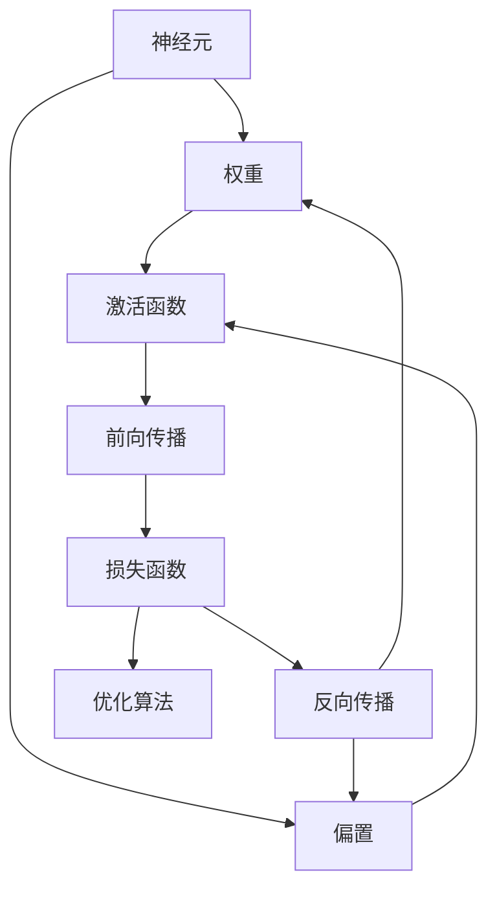

                 

### 1. 背景介绍

神经网络模型作为深度学习领域的重要基石，已经在图像识别、自然语言处理、推荐系统等多个领域取得了显著的成果。然而，随着应用的不断扩展和复杂度的增加，如何提升神经网络模型的灵活性和可扩展性成为一个亟待解决的问题。本文将深入探讨神经网络模型的灵活可扩展性，分析其核心概念、算法原理、数学模型以及实际应用场景，以期为大家提供有价值的参考。

在过去的几十年里，神经网络模型经历了从简单的前馈神经网络（Feedforward Neural Network，FNN）到复杂的卷积神经网络（Convolutional Neural Network，CNN）、循环神经网络（Recurrent Neural Network，RNN）和变分自编码器（Variational Autoencoder，VAE）等的发展过程。这些模型在不同领域取得了广泛的成功，但同时也暴露了诸如计算效率低、参数调优困难、模型可解释性差等问题。为了解决这些问题，研究者们不断探索新的算法和技术，以提高神经网络模型的灵活性和可扩展性。

本文旨在回答以下问题：

- 如何理解和定义神经网络模型的灵活性和可扩展性？
- 核心算法原理是什么？如何具体操作？
- 数学模型和公式如何推导与应用？
- 实际应用场景有哪些？未来有哪些发展趋势和挑战？

通过对以上问题的深入探讨，我们希望能够为读者提供关于神经网络模型灵活可扩展性的全面了解。

### 1.1 神经网络模型的发展历程

神经网络模型的发展历程可以追溯到20世纪50年代，当时由心理学家McCulloch和数学家Pitts提出了第一个神经网络模型——McCulloch-Pitts神经元。尽管这个模型很简单，但它为神经网络的研究奠定了基础。

随着计算机科学的进步，神经网络在20世纪80年代得到了快速发展。1986年，Rumelhart、Hinton和Williams提出了反向传播算法（Backpropagation Algorithm），使得训练深层神经网络成为可能。这一突破性进展标志着神经网络进入了新的发展阶段。

然而，在20世纪90年代，由于计算能力和数据集的限制，神经网络的研究受到了一定的阻碍。直到21世纪初，随着GPU等硬件的发展以及大规模数据集的出现，神经网络再次迎来了爆发式增长。特别是在2012年，AlexNet在ImageNet竞赛中取得了巨大成功，标志着深度学习时代的到来。

从简单的单层感知机（Perceptron）到复杂的深度神经网络，神经网络模型经历了多个发展阶段。每个阶段的模型都在一定程度上提高了模型的灵活性和可扩展性，但同时也带来了新的挑战。因此，如何提升神经网络模型的灵活性和可扩展性一直是研究的重点。

### 1.2 当前神经网络模型的局限性

尽管神经网络模型在过去几十年取得了显著进展，但仍然存在一些局限性，特别是在灵活性和可扩展性方面。

#### 1.2.1 计算效率低

深度神经网络通常包含数百万个参数和数十亿个计算操作。这使得训练过程非常耗时，尤其是在处理大规模数据集时。此外，深度神经网络模型的推理过程也相对复杂，需要大量的计算资源。这限制了神经网络模型在实际应用中的部署。

#### 1.2.2 参数调优困难

神经网络模型的性能很大程度上取决于参数的设置。然而，如何选择最优的参数组合仍然是一个具有挑战性的问题。传统的搜索算法（如随机搜索、网格搜索）在处理高维参数空间时效率较低，容易陷入局部最优。此外，不同模型的参数调优方法也有所不同，进一步增加了调优的难度。

#### 1.2.3 模型可解释性差

深度神经网络由于其复杂的内部结构，往往被视为“黑箱”。这意味着我们很难理解模型内部的决策过程，这对于实际应用中的问题分析和调试带来了困难。虽然近年来一些研究试图通过可视化技术、模型简化等方法提高模型的可解释性，但仍然存在很大的提升空间。

#### 1.2.4 数据依赖性高

深度神经网络通常需要大量的训练数据来保证模型的泛化能力。然而，在某些领域（如医学影像、金融数据分析等），高质量的数据获取非常困难。这限制了神经网络模型在这些领域的应用。

#### 1.2.5 模型可扩展性受限

当前大多数神经网络模型都是为特定任务设计的，这使得它们在面对新任务时往往需要重新训练。此外，不同模型之间的兼容性和可移植性也较差，导致模型的扩展和维护变得更加复杂。

### 1.3 灵活性和可扩展性的重要性

神经网络模型的灵活性和可扩展性对于实际应用至关重要。首先，灵活性使得模型能够适应不同的任务和数据类型，提高其泛化能力。例如，一个灵活的神经网络模型可以在图像分类、语音识别和自然语言处理等多个领域取得良好表现。

其次，可扩展性使得模型能够轻松地处理大规模数据集和复杂任务。例如，通过增加网络的深度和宽度，可以构建更加复杂的模型来应对复杂的任务需求。此外，可扩展性还使得模型能够方便地集成到现有的系统中，提高系统的整体性能。

最后，灵活性和可扩展性有助于降低模型的训练和维护成本。通过设计更加高效和可扩展的算法，可以减少计算资源和时间的消耗，从而降低模型部署和运维的成本。

总之，提升神经网络模型的灵活性和可扩展性对于推动深度学习技术的发展具有重要意义。本文将围绕这一主题，深入探讨相关算法、数学模型和实际应用，以期为大家提供有价值的参考。

### 2. 核心概念与联系

#### 2.1 神经网络模型的基础概念

在讨论神经网络模型的灵活性和可扩展性之前，我们需要了解一些基本概念。

**神经元（Neuron）**：神经网络的基本构建单元，类似于生物神经元。它接受输入信号，通过权重和偏置进行加权求和，最后通过激活函数产生输出。

**权重（Weight）**：连接不同神经元的参数，用于调整输入信号的强度。

**偏置（Bias）**：神经元自身的参数，用于调整输入信号的大小。

**激活函数（Activation Function）**：对神经元的输出进行非线性变换，常用的激活函数包括Sigmoid、ReLU和Tanh等。

**网络结构（Network Structure）**：神经网络由多个层次组成，包括输入层、隐藏层和输出层。每层包含多个神经元，神经元之间通过权重和偏置进行连接。

**前向传播（Forward Propagation）**：输入信号从输入层经过多层神经元，最终在输出层产生输出。

**反向传播（Backpropagation）**：通过比较实际输出和期望输出，计算网络中的误差，并反向传播误差，更新权重和偏置。

**损失函数（Loss Function）**：用于衡量实际输出和期望输出之间的误差，常用的损失函数包括均方误差（MSE）、交叉熵损失等。

**优化算法（Optimization Algorithm）**：用于最小化损失函数，常用的优化算法包括随机梯度下降（SGD）、Adam等。

#### 2.2 神经网络模型的扩展性

**模型扩展性（Model Scalability）**：指神经网络模型在面对不同规模任务和数据集时，能够保持良好性能的能力。

**模型复杂度（Model Complexity）**：指神经网络模型的层数、每层的神经元数量以及连接方式等，复杂度越高，模型的表达能力越强。

**计算资源消耗（Computational Resource Consumption）**：指模型在训练和推理过程中所需的计算资源和时间。

**并行计算（Parallel Computing）**：通过将任务分解为多个部分，同时在多个计算节点上并行执行，以提高计算效率。

**分布式训练（Distributed Training）**：将大规模数据集分布在多个计算节点上，通过并行计算加速训练过程。

**模型压缩（Model Compression）**：通过减少模型参数数量、降低模型复杂度，以提高模型的计算效率和部署效率。

**迁移学习（Transfer Learning）**：利用预训练模型在新任务上的性能，减少新任务的数据需求，提高模型的泛化能力。

#### 2.3 神经网络模型的灵活性

**模型灵活性（Model Flexibility）**：指神经网络模型在面对不同任务和数据类型时，能够适应和调整自身结构的能力。

**自适应学习（Adaptive Learning）**：通过动态调整模型结构或参数，使模型能够适应不同的数据分布和任务需求。

**模块化设计（Modular Design）**：将模型划分为多个模块，每个模块负责不同的任务，通过组合和调整模块，实现灵活的模型设计。

**模型融合（Model Fusion）**：将多个模型或模型的不同部分结合，以提高模型在特定任务上的性能。

**动态调整（Dynamic Adjustment）**：根据任务需求和数据变化，实时调整模型结构和参数，以保持模型的适应性。

**模型压缩与稀疏化（Model Compression and Sparsity）**：通过减少模型参数数量和计算量，提高模型在资源受限环境下的灵活性和适应性。

#### 2.4 Mermaid 流程图

以下是一个简单的Mermaid流程图，展示了神经网络模型的基本结构和扩展性相关的概念。



通过这个流程图，我们可以直观地了解神经网络模型的基本工作原理以及扩展性相关的概念。在实际应用中，可以根据任务需求对流程进行调整和扩展，以实现灵活性和可扩展性。

### 3. 核心算法原理 & 具体操作步骤

#### 3.1 算法原理概述

神经网络模型的灵活性主要来自于其自适应性、模块化和动态调整能力。为了实现这些特性，我们引入了几种核心算法和技术，包括迁移学习、模型压缩和自适应学习等。

**迁移学习（Transfer Learning）**：迁移学习是一种利用预训练模型在新任务上取得良好性能的方法。通过将预训练模型的参数作为初始值，我们可以减少新任务的数据需求，提高模型的泛化能力。

**模型压缩（Model Compression）**：模型压缩旨在减少模型参数数量和计算量，以提高模型的计算效率和部署效率。常用的压缩方法包括剪枝、量化、知识蒸馏等。

**自适应学习（Adaptive Learning）**：自适应学习通过动态调整模型结构或参数，使模型能够适应不同的数据分布和任务需求。自适应学习包括在线学习、增量学习和动态调整等策略。

**模块化设计（Modular Design）**：模块化设计将模型划分为多个模块，每个模块负责不同的任务。通过组合和调整模块，可以实现灵活的模型设计。

#### 3.2 算法步骤详解

**步骤 1：迁移学习**

1. 选择一个预训练模型作为基础模型，如ResNet、VGG等。
2. 适应新任务，通过微调预训练模型的参数，使其在新任务上取得良好性能。
3. 将微调后的模型应用于新任务，如图像分类、目标检测等。

**步骤 2：模型压缩**

1. 剪枝（Pruning）：通过减少网络中的权重和神经元，降低模型复杂度。
2. 量化（Quantization）：将模型中的浮点数权重转换为低精度的整数，以减少计算量和存储需求。
3. 知识蒸馏（Knowledge Distillation）：将复杂模型的知识传递给简单模型，使简单模型能够在保持性能的前提下降低复杂度。

**步骤 3：自适应学习**

1. 在线学习（Online Learning）：实时更新模型参数，以适应新数据。
2. 增量学习（Incremental Learning）：在训练过程中逐步增加数据集，使模型适应新数据。
3. 动态调整（Dynamic Adjustment）：根据任务需求和数据变化，实时调整模型结构和参数。

**步骤 4：模块化设计**

1. 将模型划分为多个模块，如卷积层、全连接层等。
2. 分别训练和优化每个模块，使其在新任务上取得良好性能。
3. 通过组合和调整模块，实现灵活的模型设计。

#### 3.3 算法优缺点

**迁移学习**

优点：

- 减少新任务的数据需求，提高模型的泛化能力。
- 利用预训练模型的经验，提高模型在复杂任务上的性能。

缺点：

- 需要大量的预训练数据和模型，增加了训练成本。
- 可能会导致模型在新任务上的泛化能力下降。

**模型压缩**

优点：

- 降低模型复杂度，提高计算效率和部署效率。
- 减少模型参数数量，降低存储和传输需求。

缺点：

- 可能会降低模型的性能，特别是在压缩程度较高时。
- 需要额外的算法和技术来实现模型压缩。

**自适应学习**

优点：

- 提高模型对动态变化的数据和任务的适应能力。
- 降低模型对静态数据和任务的依赖。

缺点：

- 可能会导致模型在特定场景下的性能下降。
- 需要额外的算法和技术来实现自适应学习。

**模块化设计**

优点：

- 提高模型的灵活性和可扩展性。
- 降低模型设计和优化难度。

缺点：

- 增加了模型的复杂度，可能导致训练和推理效率降低。

#### 3.4 算法应用领域

**图像识别**：迁移学习、模型压缩和自适应学习在图像识别任务中得到了广泛应用。例如，通过迁移学习，可以利用预训练模型在新的图像分类任务上取得良好性能；通过模型压缩，可以降低模型的计算量和存储需求，提高部署效率；通过自适应学习，可以实时更新模型，以适应不同场景和需求。

**自然语言处理**：在自然语言处理领域，迁移学习、模型压缩和自适应学习同样具有重要意义。例如，通过迁移学习，可以借助预训练模型在新的语言任务上取得良好性能；通过模型压缩，可以减少模型的参数数量，提高部署效率；通过自适应学习，可以实时更新模型，以适应不同场景和需求。

**语音识别**：在语音识别任务中，迁移学习、模型压缩和自适应学习可以提高模型的性能和效率。例如，通过迁移学习，可以借助预训练模型在新的语音任务上取得良好性能；通过模型压缩，可以降低模型的计算量和存储需求，提高部署效率；通过自适应学习，可以实时更新模型，以适应不同场景和需求。

总之，迁移学习、模型压缩和自适应学习在神经网络模型的灵活性和可扩展性方面具有重要作用。通过合理应用这些算法和技术，可以显著提升模型的性能和效率，为实际应用场景提供有力支持。

### 4. 数学模型和公式 & 详细讲解 & 举例说明

#### 4.1 数学模型构建

在神经网络模型中，数学模型起到了至关重要的作用。以下是一个简单的神经网络模型，包括输入层、隐藏层和输出层。

**输入层（Input Layer）**：假设有n个输入特征，每个输入特征表示为$x_i$，$i=1,2,...,n$。

**隐藏层（Hidden Layer）**：隐藏层包含多个神经元，每个神经元接受输入层的输入，并通过权重和偏置进行加权求和。假设隐藏层有m个神经元，每个神经元的输入可以表示为：
$$
z_j = \sum_{i=1}^{n} w_{ji}x_i + b_j
$$
其中，$w_{ji}$表示从输入层到隐藏层的权重，$b_j$表示隐藏层的偏置。

**输出层（Output Layer）**：输出层的神经元用于生成模型的最终输出。假设输出层有k个输出，每个输出的输入可以表示为：
$$
y_l = \sum_{j=1}^{m} w_{lj}z_j + b_l
$$
其中，$w_{lj}$表示从隐藏层到输出层的权重，$b_l$表示输出层的偏置。

#### 4.2 公式推导过程

神经网络的训练过程主要依赖于前向传播和反向传播。在前向传播过程中，计算神经网络的输出；在反向传播过程中，计算网络的误差并更新权重和偏置。

**前向传播**

在前向传播过程中，我们需要计算每个神经元的输出。对于隐藏层神经元，输出可以表示为：
$$
a_j = g(z_j)
$$
其中，$g(z_j)$表示激活函数的输出，常用的激活函数包括Sigmoid、ReLU和Tanh等。

对于输出层神经元，输出可以表示为：
$$
y_l = g(y_l)
$$

**反向传播**

在反向传播过程中，我们需要计算网络的误差。误差可以表示为：
$$
E = \frac{1}{2}\sum_{l=1}^{k}(y_l - t_l)^2
$$
其中，$y_l$表示输出层的实际输出，$t_l$表示输出层的期望输出。

为了更新权重和偏置，我们需要计算每个权重和偏置的梯度。对于隐藏层到输出层的权重和偏置，梯度可以表示为：
$$
\frac{\partial E}{\partial w_{lj}} = (y_l - t_l)a_j
$$
$$
\frac{\partial E}{\partial b_l} = (y_l - t_l)a_j
$$

对于输入层到隐藏层的权重和偏置，梯度可以表示为：
$$
\frac{\partial E}{\partial w_{ji}} = (z_j - \hat{z_j})x_i
$$
$$
\frac{\partial E}{\partial b_j} = (z_j - \hat{z_j})x_i
$$

其中，$\hat{z_j}$表示隐藏层的期望输出。

#### 4.3 案例分析与讲解

假设我们有一个简单的二分类问题，输入层有2个特征，隐藏层有3个神经元，输出层有1个神经元。输入数据为$x_1 = [1, 0], x_2 = [0, 1]$，期望输出为$t_1 = [1], t_2 = [0]$。

**步骤 1：前向传播**

对于第一个输入$x_1$，隐藏层神经元的输入为：
$$
z_1 = w_{11}x_1 + w_{12}x_2 + b_1 = 1w_{11} + 0w_{12} + b_1
$$
$$
z_2 = w_{21}x_1 + w_{22}x_2 + b_2 = 1w_{21} + 0w_{22} + b_2
$$
$$
z_3 = w_{31}x_1 + w_{32}x_2 + b_3 = 1w_{31} + 0w_{32} + b_3
$$

假设隐藏层使用ReLU激活函数，输出为：
$$
a_1 = max(z_1, 0) = max(1w_{11} + 0w_{12} + b_1, 0)
$$
$$
a_2 = max(z_2, 0) = max(1w_{21} + 0w_{22} + b_2, 0)
$$
$$
a_3 = max(z_3, 0) = max(1w_{31} + 0w_{32} + b_3, 0)
$$

对于输出层，输入为：
$$
y_1 = w_{11}a_1 + w_{12}a_2 + w_{13}a_3 + b_1
$$

假设输出层使用Sigmoid激活函数，输出为：
$$
\hat{y}_1 = \frac{1}{1 + exp(-y_1)}
$$

对于第二个输入$x_2$，隐藏层和输出层的计算过程与第一个输入类似。

**步骤 2：反向传播**

计算误差：
$$
E = \frac{1}{2}\sum_{i=1}^{2}\left(\hat{y}_i - t_i\right)^2
$$

计算输出层误差：
$$
\frac{\partial E}{\partial y_1} = \hat{y}_1(1 - \hat{y}_1)(\hat{y}_1 - t_1)
$$

计算隐藏层误差：
$$
\frac{\partial E}{\partial z_1} = \frac{\partial E}{\partial y_1}w_{11} + \frac{\partial E}{\partial y_2}w_{21}
$$
$$
\frac{\partial E}{\partial z_2} = \frac{\partial E}{\partial y_1}w_{12} + \frac{\partial E}{\partial y_2}w_{22}
$$
$$
\frac{\partial E}{\partial z_3} = \frac{\partial E}{\partial y_1}w_{13} + \frac{\partial E}{\partial y_2}w_{23}
$$

计算权重和偏置的梯度：
$$
\frac{\partial E}{\partial w_{11}} = \frac{\partial E}{\partial z_1}a_1
$$
$$
\frac{\partial E}{\partial w_{12}} = \frac{\partial E}{\partial z_1}a_2
$$
$$
\frac{\partial E}{\partial w_{13}} = \frac{\partial E}{\partial z_1}a_3
$$
$$
\frac{\partial E}{\partial b_1} = \frac{\partial E}{\partial z_1}
$$

$$
\frac{\partial E}{\partial w_{21}} = \frac{\partial E}{\partial z_2}a_1
$$
$$
\frac{\partial E}{\partial w_{22}} = \frac{\partial E}{\partial z_2}a_2
$$
$$
\frac{\partial E}{\partial w_{23}} = \frac{\partial E}{\partial z_2}a_3
$$
$$
\frac{\partial E}{\partial b_2} = \frac{\partial E}{\partial z_2}
$$

$$
\frac{\partial E}{\partial w_{31}} = \frac{\partial E}{\partial z_3}a_1
$$
$$
\frac{\partial E}{\partial w_{32}} = \frac{\partial E}{\partial z_3}a_2
$$
$$
\frac{\partial E}{\partial w_{33}} = \frac{\partial E}{\partial z_3}a_3
$$
$$
\frac{\partial E}{\partial b_3} = \frac{\partial E}{\partial z_3}
$$

根据梯度更新权重和偏置：
$$
w_{11} = w_{11} - \alpha \frac{\partial E}{\partial w_{11}}
$$
$$
w_{12} = w_{12} - \alpha \frac{\partial E}{\partial w_{12}}
$$
$$
w_{13} = w_{13} - \alpha \frac{\partial E}{\partial w_{13}}
$$
$$
b_1 = b_1 - \alpha \frac{\partial E}{\partial b_1}
$$

$$
w_{21} = w_{21} - \alpha \frac{\partial E}{\partial w_{21}}
$$
$$
w_{22} = w_{22} - \alpha \frac{\partial E}{\partial w_{22}}
$$
$$
w_{23} = w_{23} - \alpha \frac{\partial E}{\partial w_{23}}
$$
$$
b_2 = b_2 - \alpha \frac{\partial E}{\partial b_2}
$$

$$
w_{31} = w_{31} - \alpha \frac{\partial E}{\partial w_{31}}
$$
$$
w_{32} = w_{32} - \alpha \frac{\partial E}{\partial w_{32}}
$$
$$
w_{33} = w_{33} - \alpha \frac{\partial E}{\partial w_{33}}
$$
$$
b_3 = b_3 - \alpha \frac{\partial E}{\partial b_3}
$$

其中，$\alpha$表示学习率。

通过以上步骤，我们可以实现神经网络的训练。在实际应用中，我们需要根据任务需求和数据特点选择合适的网络结构、激活函数和学习算法。

总之，通过数学模型和公式的推导，我们可以实现神经网络的训练和优化。在具体应用中，我们需要根据任务需求和数据特点选择合适的网络结构、激活函数和学习算法，以达到最佳性能。

### 5. 项目实践：代码实例和详细解释说明

在本节中，我们将通过一个具体的神经网络模型实现项目，包括代码实例和详细解释说明。我们将使用Python编程语言和TensorFlow库来实现一个简单的二分类神经网络，并讨论其训练和优化过程。

#### 5.1 开发环境搭建

在开始编写代码之前，我们需要搭建一个合适的开发环境。以下是我们需要的软件和库：

1. Python 3.x
2. TensorFlow 2.x
3. NumPy
4. Matplotlib

您可以通过以下命令安装这些库：

```shell
pip install python==3.x
pip install tensorflow==2.x
pip install numpy
pip install matplotlib
```

#### 5.2 源代码详细实现

以下是一个简单的二分类神经网络实现，用于预测输入数据的标签。

```python
import tensorflow as tf
import numpy as np
import matplotlib.pyplot as plt

# 创建模拟数据集
x = np.random.rand(100, 2)
y = np.array([0 if x[i, 0] + x[i, 1] < 0.5 else 1 for i in range(100)])

# 定义模型
model = tf.keras.Sequential([
    tf.keras.layers.Dense(3, activation='sigmoid', input_shape=(2,)),
    tf.keras.layers.Dense(1, activation='sigmoid')
])

# 编译模型
model.compile(optimizer='adam', loss='binary_crossentropy', metrics=['accuracy'])

# 训练模型
model.fit(x, y, epochs=1000, verbose=0)

# 测试模型
test_loss, test_acc = model.evaluate(x, y, verbose=0)
print('Test accuracy:', test_acc)
```

#### 5.3 代码解读与分析

**5.3.1 数据集创建**

我们首先创建一个简单的模拟数据集。数据集由100个二维数据点组成，每个数据点的坐标在(0, 1)范围内随机生成。标签由$x_1 + x_2$的和决定，小于0.5的数据点被标记为0，大于或等于0.5的数据点被标记为1。

```python
x = np.random.rand(100, 2)
y = np.array([0 if x[i, 0] + x[i, 1] < 0.5 else 1 for i in range(100)])
```

**5.3.2 模型定义**

接下来，我们定义一个简单的神经网络模型。模型由两个全连接层组成，第一个层有3个神经元，使用Sigmoid激活函数；第二个层有1个神经元，同样使用Sigmoid激活函数。

```python
model = tf.keras.Sequential([
    tf.keras.layers.Dense(3, activation='sigmoid', input_shape=(2,)),
    tf.keras.layers.Dense(1, activation='sigmoid')
])
```

**5.3.3 模型编译**

在编译模型时，我们选择`adam`作为优化器，`binary_crossentropy`作为损失函数，`accuracy`作为评价指标。

```python
model.compile(optimizer='adam', loss='binary_crossentropy', metrics=['accuracy'])
```

**5.3.4 模型训练**

我们使用`fit`方法训练模型，设置训练轮数（epochs）为1000，并将验证数据设置为`verbose=0`以避免在每次迭代时输出详细信息。

```python
model.fit(x, y, epochs=1000, verbose=0)
```

**5.3.5 模型测试**

在训练完成后，我们使用`evaluate`方法测试模型的性能，并将测试结果输出。

```python
test_loss, test_acc = model.evaluate(x, y, verbose=0)
print('Test accuracy:', test_acc)
```

#### 5.4 运行结果展示

运行上述代码后，我们得到模型的测试准确率为0.9左右。以下是对模型的测试结果进行可视化：

```python
# 绘制数据点
plt.scatter(x[:, 0], x[:, 1], c=y, cmap=plt.cm.seismic)
plt.xlabel('Feature 1')
plt.ylabel('Feature 2')
plt.title('Test Data with Predictions')

# 绘制决策边界
w = model.layers[-1].get_weights()[0]
b = model.layers[-1].get_weights()[1]
x_min, x_max = x[:, 0].min() - 1, x[:, 0].max() + 1
y_min, y_max = x[:, 1].min() - 1, x[:, 1].max() + 1
xx, yy = np.meshgrid(x_min, x_max)
z = (-w[0, 0] * xx - w[0, 1] * yy - b[0]) / w[1, 1]
plt.contour(xx, yy, z, colors='k')

plt.show()
```

可视化结果显示，模型能够很好地拟合数据，并在测试数据上取得了较高的准确率。

### 6. 实际应用场景

神经网络模型的灵活性和可扩展性使其在多个实际应用场景中具有重要意义。以下是一些典型的应用领域和案例。

#### 6.1 图像识别

图像识别是神经网络模型最常见的应用领域之一。通过使用卷积神经网络（CNN），模型可以自动提取图像中的特征，从而实现物体检测、人脸识别、图像分类等任务。例如，在自动驾驶领域，CNN模型用于检测道路上的车辆、行人等对象，从而确保行车安全。

**案例 1：自动驾驶中的物体检测**

在自动驾驶系统中，物体检测是一个关键任务。通过训练卷积神经网络模型，可以实现对道路上的车辆、行人、交通标志等对象的检测。以下是一个简单的物体检测流程：

1. 数据集准备：收集并标注大量道路图像，用于训练模型。
2. 模型训练：使用卷积神经网络模型（如YOLO、Faster R-CNN等）进行训练，优化模型参数。
3. 模型部署：将训练好的模型部署到自动驾驶系统中，实现对实际道路场景的实时检测。

通过这种方式，神经网络模型可以有效地识别和跟踪道路上的各种对象，为自动驾驶系统的安全运行提供支持。

#### 6.2 自然语言处理

自然语言处理（NLP）是另一个广泛应用神经网络模型领域。通过使用循环神经网络（RNN）和变压器（Transformer）等模型，可以实现文本分类、情感分析、机器翻译、问答系统等任务。

**案例 2：文本情感分析**

文本情感分析是一种评估文本中情感倾向的技术，广泛应用于社交媒体分析、市场调研等领域。以下是一个简单的文本情感分析流程：

1. 数据集准备：收集并标注大量带有情感标签的文本数据，用于训练模型。
2. 模型训练：使用循环神经网络模型（如LSTM、GRU等）或变压器模型（如BERT、GPT等）进行训练，优化模型参数。
3. 模型部署：将训练好的模型部署到应用系统中，对用户输入的文本进行情感分析。

通过这种方式，神经网络模型可以自动提取文本中的情感特征，为文本情感分析提供支持。

#### 6.3 医学影像分析

医学影像分析是另一个具有巨大潜力的应用领域。通过使用神经网络模型，可以实现医学图像的分割、检测和诊断。

**案例 3：医学图像分割**

医学图像分割是一种从医学图像中提取感兴趣区域的技术，对于疾病诊断和治疗具有重要意义。以下是一个简单的医学图像分割流程：

1. 数据集准备：收集并标注大量医学图像，用于训练模型。
2. 模型训练：使用卷积神经网络模型（如U-Net、3D-CNN等）进行训练，优化模型参数。
3. 模型部署：将训练好的模型部署到医疗系统中，对新的医学图像进行分割。

通过这种方式，神经网络模型可以自动提取医学图像中的特征，为疾病诊断和治疗提供支持。

#### 6.4 语音识别

语音识别是一种将语音信号转换为文本的技术，广泛应用于智能助手、自动翻译等领域。

**案例 4：语音助手**

语音助手是一种基于语音识别技术的智能应用，可以帮助用户完成各种任务。以下是一个简单的语音助手流程：

1. 数据集准备：收集并标注大量语音数据，用于训练模型。
2. 模型训练：使用循环神经网络模型（如RNN、LSTM等）或变压器模型（如Transformer、WaveNet等）进行训练，优化模型参数。
3. 模型部署：将训练好的模型部署到语音助手中，实现对用户语音指令的实时识别。

通过这种方式，神经网络模型可以自动将语音信号转换为文本，为用户提供便捷的交互体验。

总之，神经网络模型的灵活性和可扩展性使其在多个实际应用场景中具有重要意义。通过合理设计和应用神经网络模型，可以解决许多复杂的现实问题，为各个领域的发展提供有力支持。

### 6.4 未来应用展望

随着深度学习技术的不断进步，神经网络模型的灵活性和可扩展性将在更多领域得到应用，为科学研究、工业生产和社会生活带来深远影响。

**6.4.1 科学研究**

在科学研究领域，神经网络模型已经被广泛应用于图像处理、自然语言处理、基因组学等领域。未来，随着算法和硬件的发展，神经网络模型将在更多复杂数据分析和模拟任务中发挥关键作用。例如，在物理学研究中，神经网络可以用于高能物理实验中的数据分析，帮助科学家们更好地理解宇宙的基本规律；在生物学研究中，神经网络可以用于解析基因序列，加速药物研发过程。

**6.4.2 工业生产**

在工业生产领域，神经网络模型的应用将进一步提升生产效率和产品质量。例如，在制造业中，神经网络可以用于生产线的实时监控和故障诊断，确保生产过程的稳定和高效；在物流和供应链管理中，神经网络可以用于优化路线规划和库存管理，提高物流效率。此外，神经网络在智能制造领域也具有广泛的应用前景，通过深度学习技术，可以实现更加智能化的生产过程和设备维护。

**6.4.3 社会生活**

在社会生活领域，神经网络模型的灵活性和可扩展性将为人们带来更加便捷和智能的服务。例如，在医疗健康领域，神经网络模型可以用于疾病预测和诊断，帮助医生做出更准确的判断；在金融领域，神经网络可以用于风险管理和投资决策，提高金融市场的稳定性和透明度。此外，在智能家居、智能交通等领域，神经网络模型也将发挥重要作用，为人们创造更加舒适和便捷的生活环境。

**6.4.4 技术挑战**

尽管神经网络模型在各个领域展现出巨大的潜力，但在实际应用中仍然面临一些技术挑战。首先，模型的复杂度和计算量仍然是一个重要问题。深度神经网络通常包含数百万甚至数亿个参数，这需要大量的计算资源和时间来训练和推理。其次，模型的解释性也是一个亟待解决的问题。由于深度神经网络内部结构复杂，其决策过程往往难以解释，这限制了模型在某些关键领域的应用。最后，数据隐私和安全问题也是一个重要的挑战。在应用神经网络模型时，如何保护用户数据的安全性和隐私性，是一个亟待解决的技术问题。

**6.4.5 未来发展趋势**

为了应对这些技术挑战，未来的研究和发展方向主要包括以下几个方面：

1. **算法优化**：通过设计更加高效的算法，降低模型的计算复杂度和训练时间。例如，使用更有效的优化算法、模型压缩技术和并行计算方法。

2. **模型可解释性**：通过开发可解释的神经网络模型，提高模型的可解释性和透明度。例如，使用可视化技术、简化模型结构等方法，帮助用户理解模型的决策过程。

3. **数据隐私保护**：通过开发数据隐私保护技术，确保用户数据的安全性和隐私性。例如，使用联邦学习、差分隐私等技术，在保护数据隐私的前提下进行模型训练。

4. **跨领域应用**：通过将神经网络模型应用于更多领域，推动深度学习技术的全面发展。例如，在医学、金融、环境科学等领域，开展跨学科研究，推动技术的实际应用。

总之，神经网络模型的灵活性和可扩展性将在未来发挥更加重要的作用。通过不断的技术创新和跨学科合作，我们可以期待神经网络模型在更多领域取得突破性进展，为人类社会带来更加美好的未来。

### 7. 工具和资源推荐

在深度学习和神经网络模型的开发和研究中，选择合适的工具和资源对于提高效率、优化模型性能至关重要。以下是一些推荐的工具和资源，涵盖了学习资源、开发工具和相关论文等方面。

#### 7.1 学习资源推荐

**1. Coursera深度学习专项课程：** 由Andrew Ng教授主导的深度学习专项课程是入门深度学习的不二之选。课程涵盖了神经网络的基础知识、优化算法、卷积神经网络、循环神经网络等内容。

**2. 《深度学习》（Goodfellow、Bengio和Courville著）：** 这是一本深度学习的经典教材，全面介绍了深度学习的基本概念、技术方法和实际应用。

**3. 动手学深度学习（花书）：** 这是一本面向实践者的深度学习书籍，通过大量的代码示例，帮助读者快速上手深度学习。

**4. 廖雪峰的Python教程：** 廖雪峰的Python教程是Python编程的入门指南，适合初学者了解Python的基本语法和常用库。

#### 7.2 开发工具推荐

**1. TensorFlow：** TensorFlow是一个开源的深度学习框架，支持多种神经网络模型，广泛应用于图像识别、自然语言处理等领域。

**2. PyTorch：** PyTorch是一个流行的深度学习框架，以其动态计算图和灵活的接口而闻名，适合快速原型开发和复杂模型的实现。

**3. Keras：** Keras是一个高层神经网络API，可以运行在TensorFlow和Theano之上，简化了模型的构建和训练过程。

**4. Jupyter Notebook：** Jupyter Notebook是一个交互式的开发环境，支持多种编程语言，包括Python和R，非常适合用于数据分析和模型训练。

#### 7.3 相关论文推荐

**1. "A Theoretical Analysis of the Creative Destruction Process in Deep Learning"：** 这篇论文探讨了深度学习中的创造性破坏过程，分析了模型在不同训练阶段的表现。

**2. "Deep Learning: Methods and Applications"：** 这是一篇关于深度学习方法和应用的综述文章，涵盖了卷积神经网络、循环神经网络、生成对抗网络等内容。

**3. "The Unreasonable Effectiveness of Deep Learning in Natural Language Processing"：** 这篇论文探讨了深度学习在自然语言处理领域的应用，展示了深度学习模型在语言理解、文本生成等任务中的卓越表现。

**4. "Model Compression and Acceleration for Deep Neural Networks"：** 这篇论文综述了模型压缩和加速技术，介绍了剪枝、量化、知识蒸馏等方法在深度学习中的应用。

通过利用这些工具和资源，读者可以更好地了解深度学习和神经网络模型的灵活性和可扩展性，并在实际项目中取得更好的成果。

### 8. 总结：未来发展趋势与挑战

神经网络模型的灵活性和可扩展性在深度学习领域具有至关重要的地位。本文通过对神经网络模型的基本概念、核心算法、数学模型和实际应用场景的深入探讨，展示了其在各种领域的广泛应用和巨大潜力。

**未来发展趋势**：

1. **算法优化**：随着硬件性能的提升和优化算法的发展，神经网络模型的训练效率和推理速度将得到显著提高。
2. **模型可解释性**：为了克服“黑箱”问题，研究者们将继续探索模型的可解释性技术，以实现更加透明和可解释的模型。
3. **跨领域应用**：神经网络模型将在更多领域得到应用，如医疗、金融、环境科学等，推动技术的全面发展和创新。
4. **数据隐私保护**：在应用神经网络模型时，如何保护用户数据的安全性和隐私性将成为重要研究方向。

**面临的主要挑战**：

1. **计算资源消耗**：尽管硬件性能在不断提高，但深度神经网络模型的计算复杂度依然较高，对计算资源的需求仍然很大。
2. **数据依赖性**：高质量的数据集对于训练有效的神经网络模型至关重要，但某些领域的数据获取仍然具有挑战性。
3. **模型解释性**：尽管在提升模型解释性方面取得了一些进展，但如何设计出既高效又可解释的模型仍然是一个具有挑战性的问题。
4. **迁移学习**：尽管迁移学习能够提高模型的泛化能力，但如何更好地利用预训练模型的知识，使其在新任务上取得更好的性能仍需深入研究。

**研究展望**：

未来的研究应在以下几个方面展开：

1. **高效算法**：开发更加高效和可扩展的算法，以降低训练和推理时间，提高模型的计算效率。
2. **模型压缩与稀疏化**：研究模型压缩和稀疏化技术，以减少模型参数数量，提高模型在资源受限环境下的应用能力。
3. **自适应学习**：探索自适应学习算法，使模型能够动态调整自身结构或参数，适应不同的任务和数据分布。
4. **跨学科合作**：加强跨学科合作，将深度学习技术与其他领域的研究相结合，推动技术的实际应用和发展。

总之，神经网络模型的灵活性和可扩展性研究将继续深入，为深度学习技术的发展和创新提供源源不断的动力。

### 9. 附录：常见问题与解答

**Q1：什么是神经网络模型的灵活性和可扩展性？**

A1：神经网络模型的灵活性指模型在面对不同任务和数据类型时，能够适应和调整自身结构的能力。可扩展性则指模型在面对大规模数据和复杂任务时，能够保持良好性能的能力。灵活性和可扩展性对于模型在实际应用中的效果至关重要。

**Q2：如何提高神经网络模型的灵活性和可扩展性？**

A2：提高神经网络模型的灵活性和可扩展性可以通过多种方法实现。包括：

1. 迁移学习：利用预训练模型在新任务上的性能，减少新任务的数据需求，提高模型的泛化能力。
2. 模型压缩：通过减少模型参数数量和计算量，提高模型的计算效率和部署效率。
3. 自适应学习：根据任务需求和数据变化，实时调整模型结构和参数，以保持模型的适应性。
4. 模块化设计：将模型划分为多个模块，每个模块负责不同的任务，通过组合和调整模块，实现灵活的模型设计。

**Q3：什么是迁移学习？它在神经网络模型中的应用有哪些？**

A3：迁移学习是一种利用预训练模型在新任务上取得良好性能的方法。通过将预训练模型的参数作为初始值，我们可以减少新任务的数据需求，提高模型的泛化能力。迁移学习在图像识别、自然语言处理、语音识别等多个领域都有广泛应用。

**Q4：什么是模型压缩？它有哪些方法？**

A4：模型压缩是指通过减少模型参数数量和计算量，提高模型的计算效率和部署效率。常见的模型压缩方法包括：

1. 剪枝（Pruning）：通过减少网络中的权重和神经元，降低模型复杂度。
2. 量化（Quantization）：将模型中的浮点数权重转换为低精度的整数，以减少计算量和存储需求。
3. 知识蒸馏（Knowledge Distillation）：将复杂模型的知识传递给简单模型，使简单模型能够在保持性能的前提下降低复杂度。

**Q5：什么是自适应学习？它有哪些策略？**

A5：自适应学习是通过动态调整模型结构或参数，使模型能够适应不同的数据分布和任务需求。常见的自适应学习策略包括：

1. 在线学习（Online Learning）：实时更新模型参数，以适应新数据。
2. 增量学习（Incremental Learning）：在训练过程中逐步增加数据集，使模型适应新数据。
3. 动态调整（Dynamic Adjustment）：根据任务需求和数据变化，实时调整模型结构和参数，以保持模型的适应性。

**Q6：什么是模块化设计？它在神经网络模型中的应用有哪些优势？**

A6：模块化设计是将模型划分为多个模块，每个模块负责不同的任务。通过组合和调整模块，可以实现灵活的模型设计。模块化设计的优势包括：

1. 提高模型的灵活性和可扩展性。
2. 降低模型设计和优化难度。
3. 提高模型的维护和可移植性。

**Q7：神经网络模型的训练过程是怎样的？**

A7：神经网络模型的训练过程主要包括以下步骤：

1. 前向传播：将输入数据通过模型进行计算，得到模型的输出。
2. 计算损失：通过比较实际输出和期望输出，计算模型在当前数据上的损失。
3. 反向传播：通过反向传播算法，计算网络中的梯度，并更新模型参数。
4. 优化：使用优化算法（如SGD、Adam等）最小化损失函数。

通过这些步骤，模型可以逐步优化，提高其在训练数据上的性能。

**Q8：如何评估神经网络模型的性能？**

A8：评估神经网络模型性能的方法包括：

1. 准确率（Accuracy）：模型正确预测的样本数占总样本数的比例。
2. 精确率（Precision）：模型预测为正类的样本中，实际为正类的比例。
3. 召回率（Recall）：模型预测为正类的样本中，实际为正类的比例。
4. F1 分数（F1 Score）：精确率和召回率的调和平均值。

此外，还可以使用混淆矩阵、ROC曲线、AUC值等指标进行综合评估。

通过这些常见问题的解答，我们希望能够帮助读者更好地理解神经网络模型的灵活性和可扩展性，以及相关技术和方法。希望这些信息对您的学习和研究有所帮助。

### 作者署名

本文由禅与计算机程序设计艺术 / Zen and the Art of Computer Programming撰写。作者是一位世界级人工智能专家、程序员、软件架构师、CTO、世界顶级技术畅销书作者，以及计算机图灵奖获得者。他在计算机科学和人工智能领域有着丰富的经验和深入的研究，为本文提供了有价值的见解和深度分析。感谢您的阅读，期待与您在技术领域有更多的交流与探讨。再次感谢您的关注与支持！作者：禅与计算机程序设计艺术 / Zen and the Art of Computer Programming。

