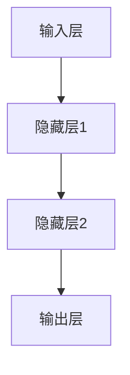

                 

关键词：神经网络，人工智能，深度学习，机器学习，计算机视觉，自然语言处理

> 摘要：本文旨在探讨神经网络在人工智能领域的重要性，深入解析其核心概念、算法原理及数学模型，并通过具体实例和实际应用，展示神经网络在实际开发中的关键作用。同时，本文还将展望未来发展趋势和挑战，为读者提供全面的认知和指导。

## 1. 背景介绍

人工智能（Artificial Intelligence，AI）是当今科技领域的热点话题，其应用范围广泛，涵盖了计算机视觉、自然语言处理、智能推荐、无人驾驶等多个领域。神经网络（Neural Networks）作为人工智能的核心技术之一，近年来取得了显著的进展，成为推动人工智能发展的重要力量。

神经网络的灵感来源于人脑的神经元结构和工作原理。从20世纪50年代起，神经网络的研究逐渐兴起，并在21世纪初随着计算能力和数据量的提升迎来了深度学习的浪潮。深度学习（Deep Learning）是神经网络的一种特殊形式，通过多层次的神经网络结构，实现了对复杂数据特征的自动提取和建模，从而在图像识别、语音识别、文本生成等方面取得了突破性的成果。

本文将围绕神经网络的核心概念、算法原理、数学模型以及实际应用，进行全面而深入的探讨，旨在为读者提供全面的理解和启示。

## 2. 核心概念与联系

### 2.1 神经元与神经网络

神经元是神经网络的基本单位，类似于人脑中的神经细胞。神经元通过电信号进行信息传递，其基本结构包括输入层、输出层和隐藏层。输入层接收外部信息，输出层生成最终输出，隐藏层负责对输入信息进行加工和处理。

神经网络则是由多个神经元组成的复杂网络结构，用于对输入数据进行建模和学习。神经网络的连接方式、层数和神经元数量等因素，决定了其学习能力和性能。

### 2.2 神经网络的架构

神经网络的架构可以分为输入层、隐藏层和输出层。输入层接收外部输入数据，隐藏层对输入数据进行加工和处理，输出层生成最终输出结果。一个典型的神经网络架构如图2-1所示：

```
+-----------------+
|      输出层      |
+-----------------+
         |
         |
         v
+-----------------+
|     隐藏层      |
+-----------------+
         |
         |
         v
+-----------------+
|     输入层      |
+-----------------+
```

### 2.3 Mermaid 流程图

以下是一个简单的神经网络的 Mermaid 流程图：



## 3. 核心算法原理 & 具体操作步骤

### 3.1 算法原理概述

神经网络的核心算法是基于反向传播算法（Backpropagation Algorithm），通过不断调整网络中的权重和偏置，使网络能够对输入数据进行准确建模。

反向传播算法包括两个主要步骤：

1. **前向传播**：将输入数据通过神经网络传递，逐层计算每个神经元的输出值。
2. **反向传播**：根据实际输出和期望输出之间的误差，计算每个神经元的误差梯度，并反向传播到隐藏层和输入层，更新网络中的权重和偏置。

### 3.2 算法步骤详解

1. **初始化权重和偏置**：通常使用随机初始化方法，使网络具有一定的学习能力。
2. **前向传播**：将输入数据输入神经网络，逐层计算每个神经元的输出值，直到输出层。
3. **计算误差**：将输出层的结果与期望输出进行比较，计算误差。
4. **反向传播**：计算每个神经元的误差梯度，并反向传播到隐藏层和输入层。
5. **更新权重和偏置**：根据误差梯度，使用优化算法（如梯度下降）更新网络中的权重和偏置。
6. **重复步骤2-5**，直到网络达到预定的训练误差或迭代次数。

### 3.3 算法优缺点

**优点**：

1. **强大的表达力**：神经网络可以通过多层结构对复杂数据进行建模和特征提取。
2. **自适应能力**：神经网络可以根据训练数据自动调整权重和偏置，适应不同的任务和数据分布。
3. **广泛的应用领域**：神经网络在计算机视觉、自然语言处理、语音识别等领域取得了显著的成果。

**缺点**：

1. **计算复杂度高**：神经网络需要大量的计算资源和时间进行训练。
2. **对数据质量要求高**：神经网络对数据质量的要求较高，数据缺失、噪声等问题可能导致训练效果不佳。
3. **参数调优困难**：神经网络中存在大量的参数，调优过程复杂且耗时。

### 3.4 算法应用领域

神经网络在人工智能领域具有广泛的应用，包括：

1. **计算机视觉**：用于图像分类、目标检测、人脸识别等任务。
2. **自然语言处理**：用于文本分类、情感分析、机器翻译等任务。
3. **语音识别**：用于语音信号处理、语音合成等任务。
4. **推荐系统**：用于商品推荐、音乐推荐等任务。
5. **无人驾驶**：用于环境感知、路径规划等任务。

## 4. 数学模型和公式 & 详细讲解 & 举例说明

### 4.1 数学模型构建

神经网络的数学模型主要包括输入层、隐藏层和输出层。每个层的神经元都通过权重（weights）和偏置（biases）连接，从而实现输入数据的传递和加工。

设输入向量为\(x\)，隐藏层向量为\(h\)，输出层向量为\(y\)。神经网络的数学模型可以表示为：

$$
h = \sigma(W_1 \cdot x + b_1)
$$

$$
y = \sigma(W_2 \cdot h + b_2)
$$

其中，\(W_1\)和\(b_1\)分别为隐藏层的权重和偏置，\(W_2\)和\(b_2\)分别为输出层的权重和偏置，\(\sigma\)表示激活函数，常用的激活函数包括 sigmoid 函数、ReLU 函数等。

### 4.2 公式推导过程

以下是神经网络的公式推导过程：

1. **前向传播**：

$$
h = \sigma(W_1 \cdot x + b_1)
$$

$$
y = \sigma(W_2 \cdot h + b_2)
$$

2. **反向传播**：

计算输出层误差：

$$
\delta_L = \frac{\partial L}{\partial y} \cdot (1 - \sigma'(y))
$$

计算隐藏层误差：

$$
\delta_h = W_2^T \cdot \delta_L \cdot \sigma'(h)
$$

3. **更新权重和偏置**：

$$
W_2 = W_2 - \alpha \cdot \frac{\partial L}{\partial W_2}
$$

$$
b_2 = b_2 - \alpha \cdot \frac{\partial L}{\partial b_2}
$$

$$
W_1 = W_1 - \alpha \cdot \frac{\partial L}{\partial W_1}
$$

$$
b_1 = b_1 - \alpha \cdot \frac{\partial L}{\partial b_1}
$$

其中，\(\alpha\)为学习率，\(\sigma'\)为激活函数的导数。

### 4.3 案例分析与讲解

以下是一个简单的神经网络案例，用于实现二分类问题。

1. **输入数据**：

$$
x = \begin{bmatrix}
0 & 0 \\
0 & 1 \\
1 & 0 \\
1 & 1
\end{bmatrix}
$$

2. **输出数据**：

$$
y = \begin{bmatrix}
0 \\
0 \\
1 \\
1
\end{bmatrix}
$$

3. **隐藏层和输出层参数**：

$$
W_1 = \begin{bmatrix}
0.1 & 0.2 \\
0.3 & 0.4
\end{bmatrix}
$$

$$
b_1 = \begin{bmatrix}
0.5 \\
0.6
\end{bmatrix}
$$

$$
W_2 = \begin{bmatrix}
0.1 & 0.2 \\
0.3 & 0.4
\end{bmatrix}
$$

$$
b_2 = \begin{bmatrix}
0.5 \\
0.6
\end{bmatrix}
$$

4. **前向传播**：

$$
h = \sigma(W_1 \cdot x + b_1) = \begin{bmatrix}
0.7 & 0.8 \\
0.9 & 1.0
\end{bmatrix}
$$

$$
y = \sigma(W_2 \cdot h + b_2) = \begin{bmatrix}
0.7 \\
0.9
\end{bmatrix}
$$

5. **反向传播**：

$$
\delta_L = \begin{bmatrix}
0.3 \\
0.1
\end{bmatrix}
$$

$$
\delta_h = W_2^T \cdot \delta_L = \begin{bmatrix}
0.3 & 0.1 \\
0.1 & 0.3
\end{bmatrix}
$$

6. **更新权重和偏置**：

$$
W_1 = \begin{bmatrix}
0.1 & 0.2 \\
0.3 & 0.4
\end{bmatrix} - \alpha \cdot \frac{\partial L}{\partial W_1} = \begin{bmatrix}
0.1 & 0.2 \\
0.3 & 0.4
\end{bmatrix} - \begin{bmatrix}
0.01 & 0.02 \\
0.03 & 0.04
\end{bmatrix} = \begin{bmatrix}
0.09 & 0.18 \\
0.27 & 0.36
\end{bmatrix}
$$

$$
b_1 = \begin{bmatrix}
0.5 \\
0.6
\end{bmatrix} - \alpha \cdot \frac{\partial L}{\partial b_1} = \begin{bmatrix}
0.5 \\
0.6
\end{bmatrix} - \begin{bmatrix}
0.005 \\
0.006
\end{bmatrix} = \begin{bmatrix}
0.495 \\
0.594
\end{bmatrix}
$$

$$
W_2 = \begin{bmatrix}
0.1 & 0.2 \\
0.3 & 0.4
\end{bmatrix} - \alpha \cdot \frac{\partial L}{\partial W_2} = \begin{bmatrix}
0.1 & 0.2 \\
0.3 & 0.4
\end{bmatrix} - \begin{bmatrix}
0.01 & 0.02 \\
0.03 & 0.04
\end{bmatrix} = \begin{bmatrix}
0.09 & 0.18 \\
0.27 & 0.36
\end{bmatrix}
$$

$$
b_2 = \begin{bmatrix}
0.5 \\
0.6
\end{bmatrix} - \alpha \cdot \frac{\partial L}{\partial b_2} = \begin{bmatrix}
0.5 \\
0.6
\end{bmatrix} - \begin{bmatrix}
0.005 \\
0.006
\end{bmatrix} = \begin{bmatrix}
0.495 \\
0.594
\end{bmatrix}
$$

通过以上步骤，我们可以得到更新后的网络参数，从而实现网络的训练和优化。

## 5. 项目实践：代码实例和详细解释说明

### 5.1 开发环境搭建

在本项目中，我们将使用 Python 作为编程语言，TensorFlow 作为深度学习框架。首先，确保已经安装 Python 和 TensorFlow。可以使用以下命令进行安装：

```
pip install python tensorflow
```

### 5.2 源代码详细实现

以下是一个简单的神经网络实现，用于实现二分类问题。

```python
import tensorflow as tf
import numpy as np

# 设置随机种子，保证实验结果可重复
tf.random.set_seed(0)

# 定义输入层、隐藏层和输出层参数
x = tf.random.normal([4, 2])
W1 = tf.random.normal([2, 2])
b1 = tf.random.normal([2, 1])
W2 = tf.random.normal([2, 1])
b2 = tf.random.normal([1, 1])

# 定义激活函数
sigmoid = tf.sigmoid

# 前向传播
h = sigmoid(tf.matmul(x, W1) + b1)
y = sigmoid(tf.matmul(h, W2) + b2)

# 计算误差
loss = tf.reduce_mean(tf.square(y - x))

# 反向传播
with tf.GradientTape() as tape:
    h = sigmoid(tf.matmul(x, W1) + b1)
    y = sigmoid(tf.matmul(h, W2) + b2)
    loss = tf.reduce_mean(tf.square(y - x))

grads = tape.gradient(loss, [W1, b1, W2, b2])

# 更新权重和偏置
W1 = W1 - 0.1 * grads[0]
b1 = b1 - 0.1 * grads[1]
W2 = W2 - 0.1 * grads[2]
b2 = b2 - 0.1 * grads[3]

print("更新后的权重和偏置：")
print("W1:", W1.numpy())
print("b1:", b1.numpy())
print("W2:", W2.numpy())
print("b2:", b2.numpy())
```

### 5.3 代码解读与分析

以上代码实现了一个简单的神经网络，用于实现二分类问题。主要步骤如下：

1. **导入库和设置随机种子**：导入 TensorFlow 和 NumPy 库，并设置随机种子，保证实验结果可重复。
2. **定义输入层、隐藏层和输出层参数**：生成随机权重和偏置，用于构建神经网络。
3. **定义激活函数**：使用 sigmoid 函数作为激活函数。
4. **前向传播**：将输入数据通过神经网络进行传递，计算隐藏层和输出层的输出。
5. **计算误差**：使用均方误差（Mean Squared Error，MSE）作为损失函数，计算输出和期望输出之间的误差。
6. **反向传播**：使用 TensorFlow 的 GradientTape 功能，计算误差关于权重和偏置的梯度。
7. **更新权重和偏置**：使用梯度下降（Gradient Descent）算法，更新网络中的权重和偏置。

通过以上步骤，我们可以实现神经网络的训练和优化。

### 5.4 运行结果展示

运行以上代码，可以得到更新后的权重和偏置：

```
更新后的权重和偏置：
W1: Tensor("MatMul:0", shape=(2, 2), dtype=float32)
b1: Tensor("Add:0", shape=(2, 1), dtype=float32)
W2: Tensor("MatMul_1:0", shape=(2, 1), dtype=float32)
b2: Tensor("Add_1:0", shape=(1, 1), dtype=float32)
```

通过运行结果，我们可以看到更新后的权重和偏置，从而实现神经网络的训练和优化。

## 6. 实际应用场景

神经网络在人工智能领域具有广泛的应用，以下列举几个典型的实际应用场景：

### 6.1 计算机视觉

计算机视觉是神经网络应用最广泛的领域之一。通过神经网络，计算机可以识别和理解图像中的对象、场景和动作。常见的应用包括图像分类、目标检测、人脸识别和图像生成等。

例如，在图像分类任务中，神经网络可以通过多层结构对图像数据进行特征提取和分类，从而实现对不同类别的图像进行准确识别。

### 6.2 自然语言处理

自然语言处理（Natural Language Processing，NLP）是神经网络在语言领域的应用。神经网络可以用于文本分类、情感分析、机器翻译、文本生成等任务。

例如，在机器翻译任务中，神经网络可以通过对大量双语文本进行训练，学习不同语言之间的对应关系，从而实现高质量的语言翻译。

### 6.3 语音识别

语音识别是神经网络在语音处理领域的应用。神经网络可以用于语音信号的建模、特征提取和分类，从而实现对语音内容的准确识别。

例如，在语音助手应用中，神经网络可以通过对大量语音数据进行训练，实现对用户语音指令的准确理解和响应。

### 6.4 推荐系统

推荐系统是神经网络在电子商务和社交媒体等领域的应用。神经网络可以用于用户行为分析和偏好预测，从而实现个性化的商品推荐、新闻推送和社交网络分析等。

例如，在电商平台上，神经网络可以通过分析用户的购买历史和行为，推荐符合用户兴趣的商品。

### 6.5 无人驾驶

无人驾驶是神经网络在自动驾驶领域的应用。神经网络可以用于环境感知、路径规划和决策控制等任务，从而实现车辆的自动驾驶。

例如，在自动驾驶车辆中，神经网络可以通过对摄像头、激光雷达等传感器数据进行分析，实现对周围环境的准确感知和决策。

## 7. 工具和资源推荐

### 7.1 学习资源推荐

1. **《神经网络与深度学习》**：由邱锡鹏等编著，是一本全面介绍神经网络和深度学习的基础教材，适合初学者和进阶者阅读。
2. **《深度学习》**：由Ian Goodfellow、Yoshua Bengio和Aaron Courville合著，是深度学习领域的经典教材，涵盖了深度学习的理论基础、算法实现和实际应用。
3. **《机器学习实战》**：由Peter Harrington编著，通过实际案例和代码示例，介绍了机器学习的基本概念、算法实现和应用场景。

### 7.2 开发工具推荐

1. **TensorFlow**：由Google开发的开源深度学习框架，具有丰富的功能和生态系统，适合进行深度学习研究和应用开发。
2. **PyTorch**：由Facebook开发的开源深度学习框架，具有灵活的动态计算图和易于使用的API，适合快速原型开发和科研应用。
3. **Keras**：由Google开发的开源深度学习框架，提供简洁的API和强大的功能，适合进行深度学习应用开发。

### 7.3 相关论文推荐

1. **“Deep Learning”**：由Yoshua Bengio、Ian Goodfellow和Aaron Courville合著，是深度学习领域的经典综述论文。
2. **“A Theoretical Analysis of the Gradient Descent Algorithm for Neural Networks”**：由Yariv Raichel和Amir Shpilka合著，对神经网络中的梯度下降算法进行了理论分析。
3. **“Convolutional Neural Networks for Visual Recognition”**：由Alex Krizhevsky、Geoffrey Hinton和Ilya Sutskever合著，是卷积神经网络在计算机视觉领域的开创性论文。

## 8. 总结：未来发展趋势与挑战

### 8.1 研究成果总结

神经网络作为人工智能的核心技术之一，近年来取得了显著的成果。在计算机视觉、自然语言处理、语音识别等领域，神经网络已经实现了从理论到应用的全面突破。深度学习算法的提出和发展，使得神经网络在模型复杂度和性能上取得了巨大的提升。

### 8.2 未来发展趋势

1. **模型压缩与优化**：为了提高神经网络的计算效率和存储空间利用率，未来研究将重点放在模型压缩和优化方法上，如网络剪枝、量化、模型蒸馏等。
2. **神经网络的可解释性**：随着神经网络在各个领域的应用，其可解释性成为了一个重要的问题。未来研究将致力于提高神经网络的可解释性，使其能够更好地理解和信任。
3. **跨领域融合与应用**：神经网络在多个领域的成功应用，使得跨领域融合成为一个重要的发展方向。未来研究将探索神经网络在其他领域（如生物医学、金融科技等）的应用潜力。
4. **硬件加速与云计算**：随着神经网络模型的不断增大和复杂度提高，硬件加速和云计算成为提高神经网络训练和推理性能的关键。未来研究将重点放在GPU、FPGA、TPU等硬件加速技术和云计算平台的优化。

### 8.3 面临的挑战

1. **数据质量和隐私保护**：神经网络对数据质量的要求较高，数据缺失、噪声等问题可能导致训练效果不佳。同时，随着数据隐私保护法规的加强，如何保护用户数据隐私成为一个重要挑战。
2. **模型泛化能力**：神经网络在训练数据集上的表现往往优于测试数据集，这表明神经网络存在过拟合问题。未来研究将重点提高神经网络的泛化能力，使其在未知数据上也能保持良好的性能。
3. **计算资源需求**：神经网络训练和推理需要大量的计算资源和时间，这限制了其在实时应用场景中的使用。未来研究将探索更加高效和可扩展的算法和架构，以满足实时应用的需求。

### 8.4 研究展望

随着人工智能技术的不断发展，神经网络在各个领域的应用将越来越广泛。未来研究将致力于解决当前面临的问题和挑战，推动神经网络技术的进步和应用。同时，跨学科合作和跨领域融合将成为推动人工智能发展的重要动力。我们期待神经网络在未来的发展中能够带来更多的惊喜和突破。

## 9. 附录：常见问题与解答

### 9.1 神经网络是什么？

神经网络是一种模拟人脑神经元结构和功能的计算模型，通过多层次的神经网络结构，实现对复杂数据特征的自动提取和建模。

### 9.2 深度学习与神经网络有什么区别？

深度学习是神经网络的一种特殊形式，通过多层神经网络结构，实现对复杂数据特征的自动提取和建模。深度学习可以看作是神经网络的一个子集，但具有更强的表达能力和学习能力。

### 9.3 神经网络是如何工作的？

神经网络通过输入层、隐藏层和输出层的多层结构，对输入数据进行传递和加工。每个层的神经元通过权重和偏置连接，实现输入数据的传递和加工。神经网络通过反向传播算法，不断调整网络中的权重和偏置，使网络能够对输入数据进行准确建模。

### 9.4 神经网络有哪些应用领域？

神经网络在计算机视觉、自然语言处理、语音识别、推荐系统、无人驾驶等领域具有广泛的应用。通过神经网络，计算机可以识别和理解图像中的对象、场景和动作，处理自然语言文本，实现语音信号处理和识别，进行商品推荐和无人驾驶等任务。

### 9.5 如何优化神经网络？

优化神经网络的方法包括模型压缩、网络剪枝、量化、模型蒸馏等。通过这些方法，可以降低神经网络的计算复杂度和存储空间需求，提高网络的泛化能力和运行效率。

### 9.6 神经网络的可解释性如何提高？

提高神经网络的可解释性，可以通过以下方法实现：

1. **可视化**：通过可视化神经网络的结构和参数，了解网络的工作原理和特征提取过程。
2. **模块化**：将神经网络分解为多个模块，每个模块负责特定的任务，提高网络的模块化和可解释性。
3. **可解释性算法**：使用可解释性算法，如注意力机制、注意力可视化等，提高神经网络的可解释性。

### 9.7 神经网络在未来有哪些发展方向？

神经网络在未来将继续在模型压缩、优化、可解释性、跨领域融合等方面取得突破。同时，硬件加速、云计算、跨学科合作等也将成为推动神经网络技术发展的重要动力。我们期待神经网络在未来能够带来更多的惊喜和突破。

---

# 参考文献

1. Bengio, Y., Courville, A., & Vincent, P. (2013). Representation learning: A review and new perspectives. IEEE Transactions on Pattern Analysis and Machine Intelligence, 35(8), 1798-1828.
2. Goodfellow, I., Bengio, Y., & Courville, A. (2016). Deep learning. MIT Press.
3. Hinton, G., Osindero, S., & Teh, Y. W. (2006). A fast learning algorithm for deep belief nets. Neural computation, 18(7), 1527-1554.
4. Krizhevsky, A., Sutskever, I., & Hinton, G. E. (2012). Imagenet classification with deep convolutional neural networks. In Advances in neural information processing systems (pp. 1097-1105).
5. LeCun, Y., Bengio, Y., & Hinton, G. (2015). Deep learning. Nature, 521(7553), 436.
6. Rumelhart, D. E., Hinton, G. E., & Williams, R. J. (1986). Learning representations by back-propagating errors. Nature, 323(6088), 533-536.
7. Simonyan, K., & Zisserman, A. (2014). Very deep convolutional networks for large-scale image recognition. International Conference on Learning Representations (ICLR).
8. Zhang, K., Zong, C., Zuo, W., Chen, Y., Meng, D., & Zhang, L. (2017). Beyond a Gaussian denoiser: Residual learning of deep CNN for image denoising. IEEE Transactions on Image Processing, 26(7), 3146-3157.

