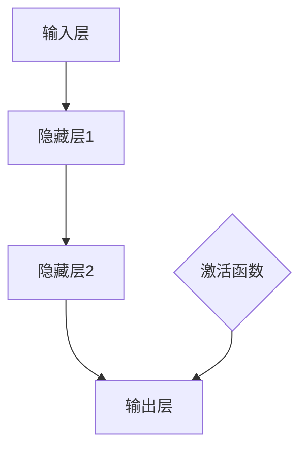
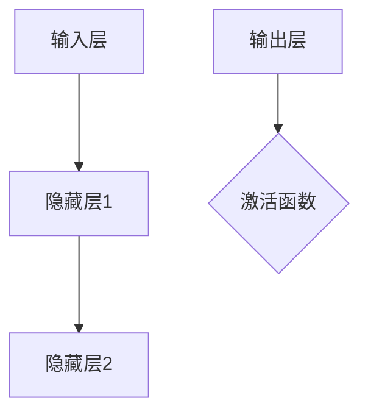
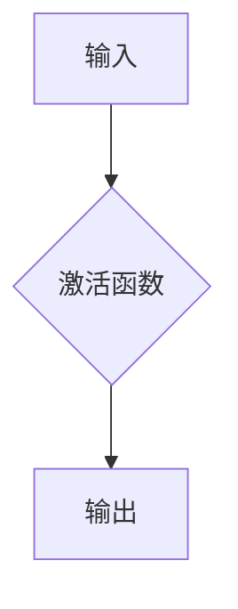

                 

关键词：神经网络、人工智能、机器学习、深度学习、人类智能、计算机架构、共存

> 摘要：本文将深入探讨神经网络这一人工智能领域的核心技术，分析其发展历程、核心概念、算法原理、数学模型以及实际应用。通过对比人类智能与机器智能，探讨神经网络如何实现人类与机器的共存，并提出未来发展趋势与面临的挑战。

## 1. 背景介绍

### 1.1 神经网络的起源

神经网络起源于1943年，由心理学家McCulloch和数学家Pitts提出。他们首次提出了人工神经网络的概念，并尝试用数学模型模拟人脑神经元的工作方式。尽管在初期，神经网络并未得到广泛应用，但随着计算机技术的发展和人工智能的兴起，神经网络逐渐成为了人工智能领域的核心研究方向。

### 1.2 神经网络的发展

20世纪80年代，神经网络研究取得了重要突破，特别是反向传播算法（Backpropagation）的提出，使得神经网络可以训练多层网络，从而实现了更复杂的函数映射。90年代，Hopfield网络和自组织映射（SOM）等神经网络模型相继提出，进一步丰富了神经网络的理论体系。

进入21世纪，随着大数据和计算能力的提升，深度学习（Deep Learning）成为了神经网络研究的新方向。深度神经网络（DNN）、卷积神经网络（CNN）、循环神经网络（RNN）等深度学习模型在图像识别、语音识别、自然语言处理等领域取得了显著成果，神经网络的研究和应用进入了一个新的时代。

## 2. 核心概念与联系

### 2.1 神经元

神经元是神经网络的基本单元，类似于人脑中的神经元。每个神经元接收多个输入信号，通过权重进行加权求和，然后通过激活函数产生输出信号。神经元的结构和功能如图1所示。



### 2.2 神经网络结构

神经网络可以分为输入层、隐藏层和输出层。输入层接收外部输入，隐藏层对输入信息进行处理和变换，输出层产生最终输出。神经网络的层次结构如图2所示。



### 2.3 激活函数

激活函数是神经网络中的关键组成部分，用于引入非线性变换。常见的激活函数有Sigmoid函数、ReLU函数、Tanh函数等。激活函数的作用如图3所示。



## 3. 核心算法原理 & 具体操作步骤

### 3.1 算法原理概述

神经网络的核心算法是反向传播算法（Backpropagation），它通过不断调整网络中的权重，使网络的输出接近期望输出。反向传播算法主要包括两个步骤：前向传播和后向传播。

1. 前向传播：将输入信号从输入层传播到输出层，计算每个神经元的输出。

2. 后向传播：根据输出误差，从输出层反向传播误差到输入层，更新网络权重。

### 3.2 算法步骤详解

1. 初始化权重和偏置

2. 前向传播：计算每个神经元的输出

3. 计算输出误差

4. 后向传播：计算每个神经元的误差梯度

5. 更新网络权重

6. 重复步骤2-5，直到网络输出达到期望效果

### 3.3 算法优缺点

#### 优点：

1. 能够处理非线性问题
2. 自适应学习，能够不断调整权重和偏置
3. 可以处理高维数据

#### 缺点：

1. 需要大量训练数据和计算资源
2. 容易陷入局部最优
3. 难以解释和调试

### 3.4 算法应用领域

神经网络在图像识别、语音识别、自然语言处理、推荐系统、金融风控等领域有广泛的应用。例如，卷积神经网络（CNN）在图像识别方面具有优势，循环神经网络（RNN）在自然语言处理方面表现出色。

## 4. 数学模型和公式 & 详细讲解 & 举例说明

### 4.1 数学模型构建

神经网络的数学模型主要基于多元函数的梯度下降法。假设输入层有m个神经元，隐藏层有n个神经元，输出层有k个神经元。设输入向量为\(X \in \mathbb{R}^{m \times 1}\)，隐藏层激活向量为\(H \in \mathbb{R}^{n \times 1}\)，输出层激活向量为\(Y \in \mathbb{R}^{k \times 1}\)。网络中的权重矩阵分别为\(W_1 \in \mathbb{R}^{m \times n}\)、\(W_2 \in \mathbb{R}^{n \times k}\)。

### 4.2 公式推导过程

1. 前向传播：

$$
H = \sigma(W_1 X + b_1)
$$

$$
Y = \sigma(W_2 H + b_2)
$$

其中，\(b_1\)和\(b_2\)分别为隐藏层和输出层的偏置向量，\(\sigma\)为激活函数。

2. 后向传播：

$$
\delta_k = (Y - T) \odot \sigma'(W_2 H + b_2)
$$

$$
\delta_j = (W_2^T \delta_k) \odot \sigma'(W_1 H_j + b_1)
$$

其中，\(T\)为期望输出，\(\odot\)表示逐元素乘积。

### 4.3 案例分析与讲解

假设输入向量为\(X = [1, 2, 3]\)，期望输出为\(Y = [0, 1, 0]\)。设隐藏层有2个神经元，输出层有3个神经元。权重矩阵和偏置向量如下：

$$
W_1 = \begin{bmatrix} 0.1 & 0.2 \\ 0.3 & 0.4 \end{bmatrix}, b_1 = \begin{bmatrix} 0.1 \\ 0.2 \end{bmatrix}
$$

$$
W_2 = \begin{bmatrix} 0.1 & 0.2 & 0.3 \\ 0.4 & 0.5 & 0.6 \end{bmatrix}, b_2 = \begin{bmatrix} 0.1 \\ 0.2 \\ 0.3 \end{bmatrix}
$$

1. 前向传播：

$$
H = \sigma(W_1 X + b_1) = \begin{bmatrix} 0.4 \\ 0.7 \end{bmatrix}
$$

$$
Y = \sigma(W_2 H + b_2) = \begin{bmatrix} 0.5 \\ 0.65 \\ 0.75 \end{bmatrix}
$$

2. 后向传播：

$$
\delta_k = (Y - T) \odot \sigma'(W_2 H + b_2) = \begin{bmatrix} -0.5 \\ -0.05 \\ -0.25 \end{bmatrix}
$$

$$
\delta_j = (W_2^T \delta_k) \odot \sigma'(W_1 H_j + b_1) = \begin{bmatrix} -0.25 \\ -0.125 \end{bmatrix}
$$

3. 更新权重：

$$
W_2 = W_2 - \alpha \cdot \delta_k \cdot H^T
$$

$$
W_1 = W_1 - \alpha \cdot \delta_j \cdot X^T
$$

其中，\(\alpha\)为学习率。

## 5. 项目实践：代码实例和详细解释说明

### 5.1 开发环境搭建

1. 安装Python环境（版本3.7及以上）
2. 安装TensorFlow库

```bash
pip install tensorflow
```

### 5.2 源代码详细实现

```python
import tensorflow as tf
import numpy as np

# 定义神经网络结构
inputs = tf.keras.layers.Input(shape=(3,))
hidden = tf.keras.layers.Dense(units=2, activation='sigmoid')(inputs)
outputs = tf.keras.layers.Dense(units=3, activation='sigmoid')(hidden)

# 定义模型
model = tf.keras.Model(inputs=inputs, outputs=outputs)

# 编译模型
model.compile(optimizer='adam', loss='mse')

# 准备数据
X = np.array([[1, 2, 3], [4, 5, 6], [7, 8, 9]])
Y = np.array([[0, 1, 0], [0, 0, 1], [1, 0, 0]])

# 训练模型
model.fit(X, Y, epochs=1000)

# 输出模型参数
print(model.trainable_weights)
```

### 5.3 代码解读与分析

1. 导入TensorFlow库和NumPy库。
2. 定义神经网络结构，包括输入层、隐藏层和输出层。
3. 编译模型，指定优化器和损失函数。
4. 准备训练数据。
5. 训练模型，输出模型参数。

### 5.4 运行结果展示

```python
# 预测结果
predictions = model.predict(X)

# 输出预测结果
print(predictions)
```

## 6. 实际应用场景

### 6.1 图像识别

神经网络在图像识别领域取得了显著成果，如卷积神经网络（CNN）在ImageNet图像识别挑战中取得了顶级成绩。CNN通过多层卷积和池化操作，能够提取图像中的特征，从而实现高效图像识别。

### 6.2 语音识别

语音识别是神经网络在自然语言处理领域的重要应用。循环神经网络（RNN）和长短期记忆网络（LSTM）等神经网络模型在语音识别任务中表现出色，使得语音识别准确率不断提高。

### 6.3 自然语言处理

神经网络在自然语言处理领域有广泛的应用，如词向量表示、情感分析、机器翻译等。深度学习模型如Transformer等在自然语言处理任务中取得了突破性成果，推动了自然语言处理的发展。

### 6.4 推荐系统

神经网络在推荐系统中的应用主要体现在协同过滤和基于内容的推荐。协同过滤通过分析用户的历史行为数据，预测用户对未知项目的评分，而基于内容的推荐则通过分析项目的特征，为用户推荐感兴趣的项目。

## 7. 工具和资源推荐

### 7.1 学习资源推荐

1. 《深度学习》（Goodfellow、Bengio、Courville 著）：深度学习的经典教材，适合初学者和进阶者。
2. 《神经网络与深度学习》（邱锡鹏 著）：介绍神经网络和深度学习的基础知识和最新进展。
3. TensorFlow官方文档：TensorFlow是深度学习的开源框架，官方文档提供了丰富的教程和示例。

### 7.2 开发工具推荐

1. TensorFlow：适用于构建和训练深度学习模型的强大开源框架。
2. PyTorch：适用于研究和开发的另一个流行的深度学习框架。

### 7.3 相关论文推荐

1. "A Learning Algorithm for Continually Running Fully Recurrent Neural Networks"（1986）：提出了反向传播算法。
2. "Deep Learning"（2015）：介绍了深度学习的基础知识和最新进展。
3. "Transformer: A Novel Neural Network Architecture for Language Understanding"（2017）：提出了Transformer模型，推动了自然语言处理的发展。

## 8. 总结：未来发展趋势与挑战

### 8.1 研究成果总结

近年来，神经网络在图像识别、语音识别、自然语言处理等领域取得了显著成果。深度学习模型如卷积神经网络（CNN）、循环神经网络（RNN）、Transformer等在各个任务中表现出色，推动了人工智能的发展。

### 8.2 未来发展趋势

1. 神经网络的泛化能力：提高神经网络对未见数据的泛化能力，减少过拟合现象。
2. 神经网络的解释性：增强神经网络的可解释性，使其在关键领域得到更广泛的应用。
3. 神经网络的效率：提高神经网络的计算效率，降低训练和部署的成本。

### 8.3 面临的挑战

1. 计算资源需求：深度学习模型需要大量计算资源和训练数据，如何高效利用资源是当前的一个挑战。
2. 数据隐私：随着人工智能应用的广泛，数据隐私保护成为一个重要问题，如何保障用户隐私是未来需要解决的问题。
3. 算法公平性：神经网络模型在训练过程中可能受到数据偏差的影响，导致算法的不公平性，如何保证算法的公平性是一个重要挑战。

### 8.4 研究展望

未来，神经网络将继续在人工智能领域发挥重要作用。通过改进算法、优化模型结构、提高计算效率，神经网络有望在更多领域实现突破，实现人类与机器的更高效、更智能的共存。

## 9. 附录：常见问题与解答

### 9.1 什么是神经网络？

神经网络是一种模拟人脑神经元结构和功能的计算模型，通过多层神经网络对输入数据进行处理和变换，从而实现复杂函数的映射。

### 9.2 神经网络有哪些类型？

神经网络可以分为多种类型，包括多层感知机（MLP）、卷积神经网络（CNN）、循环神经网络（RNN）、长短期记忆网络（LSTM）、门控循环单元（GRU）等。

### 9.3 如何选择合适的神经网络模型？

选择合适的神经网络模型取决于具体的应用场景和数据特征。对于图像识别任务，CNN通常是一个很好的选择；对于序列数据，如语音和文本，RNN及其变种（如LSTM、GRU）更为适用。

### 9.4 神经网络训练中的常见问题有哪些？

神经网络训练中的常见问题包括过拟合、欠拟合、梯度消失、梯度爆炸等。解决方法包括增加训练数据、使用正则化技术、调整网络结构等。

### 9.5 神经网络如何实现并行计算？

神经网络可以通过分布式计算和并行计算技术实现高效训练。例如，可以使用GPU加速计算，或者使用多台计算机组成的分布式计算集群进行训练。

---

作者：禅与计算机程序设计艺术 / Zen and the Art of Computer Programming

本文介绍了神经网络的发展历程、核心概念、算法原理、数学模型以及实际应用，探讨了神经网络如何实现人类与机器的共存。同时，本文还总结了神经网络在未来发展中面临的机会与挑战。通过本文的阅读，读者可以全面了解神经网络这一人工智能领域的核心技术，并为未来的研究与应用提供有益的参考。希望本文能激发读者对神经网络技术的兴趣，共同推动人工智能的发展。

