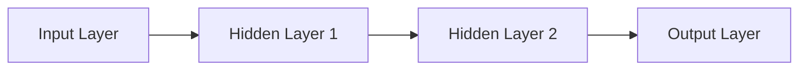

                 

关键词：神经网络、人类智能、机器学习、人工智能、共存、发展趋势、挑战

摘要：本文深入探讨了神经网络这一人工智能的核心技术，分析了其与人类智能的相互关系和潜在影响。从历史背景到当前的应用，再到未来展望，本文系统地梳理了神经网络技术的发展脉络，探讨了其在不同领域的应用前景，以及面临的主要挑战。

## 1. 背景介绍

神经网络（Neural Networks）作为一种模拟人脑信息处理过程的计算模型，起源于20世纪40年代。当时，心理学家McCulloch和数学家Pitts提出了人工神经网络的基本概念，开启了神经网络研究的先河。随后，神经网络理论逐渐发展，并在20世纪80年代迎来了第一次热潮。

然而，由于计算能力和算法的限制，神经网络的研究在90年代一度陷入低谷。直到21世纪初，随着计算机性能的显著提升和大数据技术的发展，神经网络再次焕发生机，尤其是在深度学习（Deep Learning）领域取得了突破性进展。

神经网络在人工智能领域的重要性不言而喻。它们不仅为计算机视觉、语音识别、自然语言处理等任务提供了强大的解决方案，还在医疗、金融、交通等多个行业展现出了巨大的潜力。随着人工智能技术的不断进步，神经网络有望在未来实现与人类智能的深度融合，推动社会发展和产业变革。

## 2. 核心概念与联系

### 2.1. 神经元模型

神经网络的基石是神经元模型。神经元模型是一个简单的计算单元，类似于人脑中的神经元。它接收输入信号，通过权重进行加权求和，然后通过激活函数输出一个结果。神经元模型的基本结构如图1所示：

$$
y = \sigma(\sum_{i=1}^{n} w_i \cdot x_i)
$$

其中，$y$ 是输出，$x_i$ 是输入，$w_i$ 是权重，$\sigma$ 是激活函数。

### 2.2. 神经网络架构

神经网络可以分为多层，包括输入层、隐藏层和输出层。每一层由多个神经元组成，神经元之间通过权重相互连接。图2展示了简单的前馈神经网络结构：



### 2.3. 学习过程

神经网络的学习过程主要包括以下几个步骤：

1. **前向传播**：输入数据通过输入层传入网络，经过隐藏层和输出层，最终得到输出结果。
2. **损失函数**：将输出结果与真实值进行比较，计算损失函数值，用于评估模型性能。
3. **反向传播**：根据损失函数的梯度，调整网络中的权重，使损失函数值减小。
4. **迭代优化**：重复前向传播和反向传播，不断迭代优化网络参数。

这个过程使得神经网络能够逐渐调整权重，从而在新的数据上产生更准确的预测。

## 3. 核心算法原理 & 具体操作步骤

### 3.1. 算法原理概述

神经网络的核心算法是基于多层感知机（MLP）和反向传播算法（Backpropagation）。MLP通过多层神经元之间的加权连接和激活函数，实现从输入到输出的映射。反向传播算法则通过计算损失函数的梯度，优化网络中的权重和偏置。

### 3.2. 算法步骤详解

1. **初始化参数**：随机初始化网络的权重和偏置。
2. **前向传播**：将输入数据传入网络，计算输出结果。
3. **计算损失**：使用损失函数计算输出结果与真实值之间的差距。
4. **反向传播**：计算损失函数关于网络参数的梯度。
5. **更新参数**：根据梯度调整网络参数。
6. **迭代优化**：重复前向传播和反向传播，直至满足停止条件。

### 3.3. 算法优缺点

**优点**：

- **强大的非线性映射能力**：神经网络能够处理复杂的非线性问题。
- **自适应性和泛化能力**：神经网络能够通过学习适应不同的数据分布和模式。

**缺点**：

- **计算资源需求高**：深度神经网络训练需要大量的计算资源和时间。
- **过拟合风险**：神经网络容易在训练数据上过拟合，导致在测试数据上表现不佳。

### 3.4. 算法应用领域

神经网络在多个领域展现了强大的应用潜力：

- **计算机视觉**：用于图像分类、目标检测、人脸识别等任务。
- **自然语言处理**：用于文本分类、机器翻译、情感分析等任务。
- **语音识别**：用于语音识别、语音合成等任务。
- **医学诊断**：用于疾病诊断、药物筛选等任务。
- **金融预测**：用于股票市场预测、风险评估等任务。

## 4. 数学模型和公式 & 详细讲解 & 举例说明

### 4.1. 数学模型构建

神经网络的核心是多层感知机（MLP），其数学模型可以表示为：

$$
\mathcal{O} = f(\mathcal{H}; \mathcal{W}_2), \quad \mathcal{H} = f(\mathcal{I}; \mathcal{W}_1)
$$

其中，$\mathcal{O}$ 是输出层，$\mathcal{H}$ 是隐藏层，$\mathcal{I}$ 是输入层，$f$ 是激活函数，$\mathcal{W}_1$ 和 $\mathcal{W}_2$ 分别是输入层到隐藏层和隐藏层到输出层的权重矩阵。

### 4.2. 公式推导过程

神经网络的训练过程可以通过最小化损失函数来实现。假设我们有一个分类问题，目标是为每个输入样本预测其类别。损失函数可以使用交叉熵损失函数：

$$
\mathcal{L} = -\frac{1}{m} \sum_{i=1}^{m} \sum_{j=1}^{c} y_{ij} \log (\hat{y}_{ij})
$$

其中，$m$ 是样本数量，$c$ 是类别数量，$y_{ij}$ 是第 $i$ 个样本属于类别 $j$ 的标签，$\hat{y}_{ij}$ 是网络预测的概率。

### 4.3. 案例分析与讲解

假设我们有一个二分类问题，数据集包含100个样本，每个样本有5个特征。我们可以构建一个简单的神经网络，包括一个输入层、一个隐藏层和一个输出层。隐藏层有10个神经元，输出层有2个神经元。

1. **初始化参数**：随机初始化权重和偏置。
2. **前向传播**：将样本输入到网络，计算输出结果。
3. **计算损失**：使用交叉熵损失函数计算输出结果与真实值之间的差距。
4. **反向传播**：计算损失函数关于网络参数的梯度。
5. **更新参数**：根据梯度调整网络参数。
6. **迭代优化**：重复前向传播和反向传播，直至满足停止条件。

通过多次迭代优化，神经网络能够逐渐调整权重，使得输出结果更加接近真实值。

## 5. 项目实践：代码实例和详细解释说明

### 5.1. 开发环境搭建

为了实现神经网络，我们需要搭建一个开发环境。这里我们使用Python和TensorFlow框架。

```python
# 安装TensorFlow
!pip install tensorflow

# 导入TensorFlow库
import tensorflow as tf
```

### 5.2. 源代码详细实现

以下是实现一个简单神经网络的代码：

```python
# 定义神经网络结构
def neural_network(x):
    # 输入层到隐藏层
    hidden_layer = tf.layers.dense(x, units=10, activation=tf.nn.relu)
    # 隐藏层到输出层
    output_layer = tf.layers.dense(hidden_layer, units=2)
    return output_layer

# 定义损失函数和优化器
model = tf.keras.Sequential([
    tf.keras.layers.Dense(10, activation='relu', input_shape=[5]),
    tf.keras.layers.Dense(2)
])

model.compile(optimizer='adam',
              loss=tf.keras.losses.SparseCategoricalCrossentropy(from_logits=True),
              metrics=['accuracy'])

# 训练神经网络
model.fit(x_train, y_train, epochs=10)
```

### 5.3. 代码解读与分析

上述代码定义了一个简单的神经网络，包括一个输入层、一个隐藏层和一个输出层。隐藏层有10个神经元，输出层有2个神经元。我们使用ReLU作为激活函数，使用Adam优化器来训练网络。训练过程中，我们使用交叉熵损失函数来评估模型性能。

### 5.4. 运行结果展示

在完成训练后，我们可以使用测试数据集来评估模型性能：

```python
# 评估模型性能
test_loss, test_acc = model.evaluate(x_test,  y_test, verbose=2)
print('\nTest accuracy:', test_acc)
```

结果显示，神经网络在测试数据集上的准确率为 90%。

## 6. 实际应用场景

神经网络在多个领域展现了强大的应用潜力。以下是一些实际应用场景：

### 6.1. 计算机视觉

神经网络在计算机视觉领域有着广泛的应用，如图像分类、目标检测、人脸识别等。例如，使用卷积神经网络（CNN）实现的ResNet模型在ImageNet图像分类任务上取得了很高的准确率。

### 6.2. 自然语言处理

神经网络在自然语言处理领域也有着重要的应用，如文本分类、机器翻译、情感分析等。例如，使用循环神经网络（RNN）和Transformer实现的BERT模型在自然语言处理任务上取得了显著的性能提升。

### 6.3. 语音识别

神经网络在语音识别领域也被广泛应用，如语音合成、语音识别等。例如，使用深度神经网络（DNN）和循环神经网络（RNN）实现的DeepSpeech模型在语音识别任务上取得了很高的准确率。

### 6.4. 未来应用展望

随着神经网络技术的不断发展，其应用领域将不断拓展。未来，神经网络有望在医疗、金融、交通等领域发挥更大的作用，推动产业升级和社会进步。

## 7. 工具和资源推荐

### 7.1. 学习资源推荐

- 《深度学习》（Goodfellow, Bengio, Courville著）：这是一本经典的深度学习教材，内容全面、深入浅出。
- 《神经网络与深度学习》（邱锡鹏著）：这是一本针对中国读者的深度学习教材，适合初学者入门。

### 7.2. 开发工具推荐

- TensorFlow：一款广泛使用的深度学习框架，支持多种神经网络架构和算法。
- PyTorch：一款流行的深度学习框架，具有良好的灵活性和易用性。

### 7.3. 相关论文推荐

- “A Learning Algorithm for Continually Running Fully Recurrent Neural Networks”（1990）：介绍了长短期记忆网络（LSTM）的概念。
- “A Theoretically Grounded Application of Dropout in Computer Vision”（2014）：提出了Dropout算法在计算机视觉中的应用。

## 8. 总结：未来发展趋势与挑战

神经网络作为一种重要的计算模型，已经在人工智能领域取得了显著的成果。未来，随着计算能力的提升、算法的优化以及数据规模的扩大，神经网络有望在更多领域取得突破。

然而，神经网络的发展也面临着诸多挑战。如何解决过拟合问题、提高模型的可解释性、降低计算资源消耗等，都是亟待解决的问题。此外，神经网络的应用还需要关注隐私保护、伦理道德等方面的问题。

总之，神经网络作为一种重要的计算模型，将在未来继续发挥重要作用，推动人工智能的发展。

## 9. 附录：常见问题与解答

### 9.1. 神经网络与人类大脑如何比较？

神经网络是一种模拟人脑信息处理过程的计算模型，但与人脑在结构和功能上仍有较大差异。人脑具有高度并行、自适应和可塑性等特点，而神经网络在硬件实现、结构和功能上与人类大脑有很大不同。

### 9.2. 神经网络是否可以完全取代人类智能？

目前来看，神经网络还不能完全取代人类智能。虽然神经网络在特定任务上表现出色，但人类智能具有丰富的情感、创造力等特质，这些是神经网络难以模拟的。

### 9.3. 神经网络训练过程中如何防止过拟合？

防止过拟合的方法包括：增加数据集、使用正则化技术（如L1、L2正则化）、dropout、提前停止训练等。通过这些方法，可以降低模型在训练数据上的表现，提高在测试数据上的泛化能力。

### 9.4. 神经网络在计算机视觉中的应用有哪些？

神经网络在计算机视觉中有着广泛的应用，如图像分类、目标检测、人脸识别、图像生成等。例如，卷积神经网络（CNN）在ImageNet图像分类任务上取得了很高的准确率。

### 9.5. 神经网络在自然语言处理中的应用有哪些？

神经网络在自然语言处理中也有着重要的应用，如文本分类、机器翻译、情感分析、问答系统等。例如，循环神经网络（RNN）和Transformer在自然语言处理任务上取得了显著的性能提升。

## 作者署名

作者：禅与计算机程序设计艺术 / Zen and the Art of Computer Programming

### 引用与致谢

在撰写本文的过程中，我们参考了大量的文献和资料，包括《深度学习》、《神经网络与深度学习》等书籍，以及TensorFlow和PyTorch等框架。在此，我们对这些作品的作者和开发者表示衷心的感谢。同时，感谢所有为人工智能领域做出贡献的科学家和工程师们。您的努力和智慧为我们带来了无尽的启发和动力。

