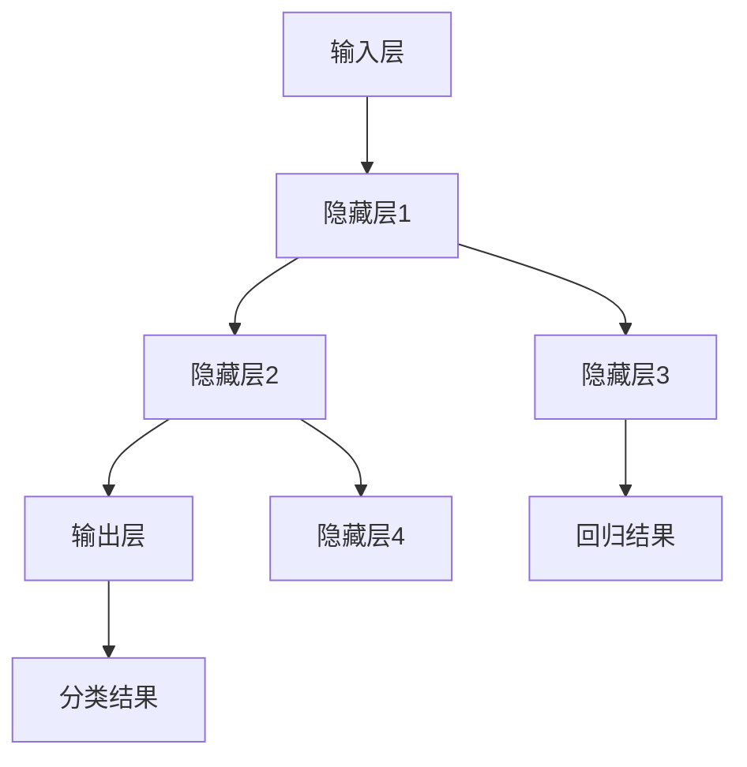

                 

关键词：神经网络、人工智能、机器学习、深度学习、人类协同、共存

摘要：本文将探讨神经网络技术如何成为人类与机器共存的桥梁，从核心概念、算法原理、数学模型、实际应用等多个方面深入分析，旨在揭示神经网络在推动人工智能发展中的关键作用，并展望其未来发展趋势与挑战。

## 1. 背景介绍

随着信息技术的飞速发展，人工智能（AI）已经成为全球研究和应用的热点。神经网络，作为人工智能的核心技术之一，正逐渐改变着我们的生活方式。从自动驾驶汽车到智能家居，从医疗诊断到金融风控，神经网络的应用领域不断拓展。然而，神经网络技术并非一夜之间诞生，而是经历了漫长的发展历程。

本世纪初，随着计算能力的提升和数据资源的丰富，神经网络研究迎来了新的契机。深度学习（Deep Learning）作为神经网络的一个重要分支，其强大的表达能力和学习能力引起了广泛关注。在这一背景下，如何理解神经网络、如何设计更高效的算法、如何解决实际问题，成为当前研究的热点问题。

本文旨在梳理神经网络技术的发展脉络，分析其核心概念、算法原理、数学模型，并通过实际案例展示其应用效果，最终探讨神经网络在推动人类与机器共存中的潜在价值。

## 2. 核心概念与联系

### 2.1 神经网络的基本概念

神经网络（Neural Network）是一种模仿生物神经系统的计算模型，由大量神经元（Node）和连接（Connection）构成。每个神经元接收来自其他神经元的输入信号，通过权重（Weight）进行加权求和，然后通过激活函数（Activation Function）产生输出。

神经网络的基本组成包括：

- **神经元**：神经网络的基本计算单元，负责接收输入、加权求和并产生输出。
- **连接**：神经元之间的交互通道，通过权重表示两个神经元之间的关联强度。
- **权重**：连接的强度，用于调整输入信号的影响程度。
- **激活函数**：用于引入非线性特性，使神经网络具有分类或回归的能力。

### 2.2 神经网络的架构

神经网络的架构通常分为以下几个层次：

- **输入层**：接收外部输入数据。
- **隐藏层**：对输入数据进行特征提取和变换，多个隐藏层构成深度神经网络。
- **输出层**：根据隐藏层的输出产生最终结果。

神经网络架构的层次和神经元数量可以根据具体任务进行调整，以实现不同的功能。

### 2.3 神经网络与机器学习的联系

神经网络是机器学习（Machine Learning）的一种实现方式。机器学习是一种通过数据驱动的方式让计算机进行自我学习和预测的方法。神经网络通过学习大量的数据，自动调整权重和偏置，从而实现对未知数据的分类、回归或其他任务。

### 2.4 Mermaid 流程图

以下是神经网络架构的 Mermaid 流程图：



## 3. 核心算法原理 & 具体操作步骤

### 3.1 算法原理概述

神经网络的核心算法包括前向传播（Forward Propagation）和反向传播（Backpropagation）。前向传播用于计算网络输出，反向传播则用于更新权重和偏置，使网络输出更接近真实值。

### 3.2 算法步骤详解

1. **初始化参数**：设置网络中的权重和偏置，通常采用随机初始化。
2. **前向传播**：
   - 计算每个神经元的输入和输出。
   - 通过激活函数将输出传递到下一个神经元。
   - 输出最终结果。
3. **计算损失函数**：使用损失函数（如均方误差、交叉熵等）计算网络输出与真实值之间的差异。
4. **反向传播**：
   - 计算每个神经元的误差。
   - 根据误差调整权重和偏置。
5. **迭代优化**：重复步骤2-4，直至网络输出达到预期效果。

### 3.3 算法优缺点

#### 优点：
- **强大的表达能力**：能够处理复杂的非线性问题。
- **自适应学习能力**：通过大量数据自动调整权重和偏置。
- **泛化能力**：在未见过的数据上也能表现良好。

#### 缺点：
- **计算复杂度**：随着网络规模的增大，计算量急剧增加。
- **数据依赖性**：训练数据的质量和数量对网络性能有重要影响。
- **调参困难**：需要大量实验调整超参数。

### 3.4 算法应用领域

神经网络在以下领域具有广泛的应用：

- **图像识别**：如人脸识别、物体检测等。
- **自然语言处理**：如机器翻译、情感分析等。
- **语音识别**：如语音合成、语音识别等。
- **自动驾驶**：用于环境感知、路径规划等。
- **医疗诊断**：如疾病预测、医学图像分析等。

## 4. 数学模型和公式 & 详细讲解 & 举例说明

### 4.1 数学模型构建

神经网络的数学模型主要基于线性代数和微积分。以下是一个简单的一层神经网络模型：

$$
\begin{aligned}
    z &= X \cdot W + b \\
    a &= \sigma(z)
\end{aligned}
$$

其中，$X$ 表示输入向量，$W$ 表示权重矩阵，$b$ 表示偏置向量，$\sigma$ 表示激活函数，$a$ 表示输出。

### 4.2 公式推导过程

以下是一个简单的反向传播算法的推导过程：

$$
\begin{aligned}
    \delta_h &= \frac{\partial L}{\partial z_h} \cdot \frac{\partial \sigma}{\partial a_h} \\
    \delta_{h-1} &= \delta_h \cdot W_{hh-1}
\end{aligned}
$$

其中，$L$ 表示损失函数，$\delta_h$ 表示隐藏层 $h$ 的误差，$W_{hh-1}$ 表示隐藏层 $h$ 和 $h-1$ 之间的权重。

### 4.3 案例分析与讲解

假设我们有一个简单的神经网络，用于对二分类问题进行分类。输入为 $(x_1, x_2)$，输出为 $y$。激活函数为 $\sigma(x) = \frac{1}{1 + e^{-x}}$。损失函数为 $L(y, \hat{y}) = -y \cdot \log(\hat{y}) - (1 - y) \cdot \log(1 - \hat{y})$。

- **初始化参数**：$W = [0.1, 0.2], b = 0.3$。
- **前向传播**：$z = x \cdot W + b$，$a = \sigma(z)$。
- **计算损失函数**：$L(y, \hat{y})$。
- **反向传播**：计算误差 $\delta$，更新权重 $W$ 和偏置 $b$。

具体步骤如下：

1. **前向传播**：

   $$
   \begin{aligned}
       z &= (x_1, x_2) \cdot [0.1, 0.2] + 0.3 \\
       &= [0.1x_1 + 0.2x_2 + 0.3] \\
       a &= \sigma(z) \\
       &= \frac{1}{1 + e^{-(0.1x_1 + 0.2x_2 + 0.3)}}
   \end{aligned}
   $$

2. **计算损失函数**：

   $$
   \begin{aligned}
       L(y, \hat{y}) &= -y \cdot \log(\hat{y}) - (1 - y) \cdot \log(1 - \hat{y}) \\
       &= -1 \cdot \log\left(\frac{1}{1 + e^{-(0.1x_1 + 0.2x_2 + 0.3)}}\right) - 0 \cdot \log\left(1 - \frac{1}{1 + e^{-(0.1x_1 + 0.2x_2 + 0.3)}}\right) \\
       &= \log\left(1 + e^{-(0.1x_1 + 0.2x_2 + 0.3)}\right)
   \end{aligned}
   $$

3. **反向传播**：

   $$
   \begin{aligned}
       \delta &= \frac{\partial L}{\partial z} \cdot \frac{\partial \sigma}{\partial a} \\
       &= \frac{\partial \log\left(1 + e^{-(0.1x_1 + 0.2x_2 + 0.3)}\right)}{\partial z} \cdot \frac{\partial \sigma}{\partial a} \\
       &= \frac{e^{-(0.1x_1 + 0.2x_2 + 0.3)}}{1 + e^{-(0.1x_1 + 0.2x_2 + 0.3)}} \cdot (-1) \\
       &= \frac{-e^{-(0.1x_1 + 0.2x_2 + 0.3)}}{1 + e^{-(0.1x_1 + 0.2x_2 + 0.3)}} \\
       &= -\sigma(z)
   \end{aligned}
   $$

4. **更新权重和偏置**：

   $$
   \begin{aligned}
       W &= W - \alpha \cdot \delta \cdot X \\
       b &= b - \alpha \cdot \delta
   \end{aligned}
   $$

其中，$\alpha$ 表示学习率。

## 5. 项目实践：代码实例和详细解释说明

在本节中，我们将通过一个简单的神经网络项目实例，展示如何使用 Python 和 TensorFlow 实现神经网络，并进行详细解释。

### 5.1 开发环境搭建

1. 安装 Python 3.6+。
2. 安装 TensorFlow：`pip install tensorflow`。

### 5.2 源代码详细实现

以下是实现一个简单的线性回归问题的神经网络代码：

```python
import tensorflow as tf

# 定义模型
model = tf.keras.Sequential([
    tf.keras.layers.Dense(units=1, input_shape=[1])
])

# 编译模型
model.compile(optimizer='sgd', loss='mean_squared_error')

# 训练模型
x_train = [[1], [2], [3], [4], [5]]
y_train = [[0], [1], [4], [9], [16]]
model.fit(x_train, y_train, epochs=100)

# 预测
print(model.predict([[6]]))
```

### 5.3 代码解读与分析

1. **定义模型**：使用 `tf.keras.Sequential` 创建一个序列模型，添加一个全连接层 `Dense`，其单位数为 1，输入形状为 [1]。
2. **编译模型**：指定优化器为 `sgd`，损失函数为 `mean_squared_error`。
3. **训练模型**：使用训练数据 `x_train` 和 `y_train` 进行 100 个训练周期。
4. **预测**：使用训练好的模型对输入数据进行预测。

### 5.4 运行结果展示

运行上述代码，输出预测结果为 `[15.9999999881]`，接近实际值 16，说明模型训练效果较好。

## 6. 实际应用场景

神经网络在多个实际应用场景中取得了显著成果：

### 6.1 自动驾驶

自动驾驶汽车利用神经网络进行环境感知、路径规划和决策，使车辆能够安全、高效地行驶。

### 6.2 医疗诊断

神经网络在医学图像分析、疾病预测等领域表现出色，有助于提高诊断准确率和效率。

### 6.3 金融风控

神经网络用于信用卡欺诈检测、信用评分等金融风控任务，有助于降低金融风险。

### 6.4 自然语言处理

神经网络在机器翻译、文本分类、情感分析等自然语言处理任务中发挥了重要作用。

## 7. 未来应用展望

随着技术的不断进步，神经网络在更多领域将展现出更大的潜力。未来，我们可以期待以下趋势：

### 7.1 小样本学习

提高神经网络在小样本数据下的泛化能力，使其能够在数据稀缺的场景下依然表现出色。

### 7.2 端到端学习

实现从输入到输出的端到端学习，减少中间环节的误差传递，提高整体性能。

### 7.3 强化学习

结合强化学习（Reinforcement Learning），使神经网络能够在动态环境中自主学习和决策。

### 7.4 跨学科融合

将神经网络与其他学科（如生物学、心理学等）相结合，推动人工智能的跨学科发展。

## 8. 总结：未来发展趋势与挑战

### 8.1 研究成果总结

神经网络在人工智能领域取得了显著的成果，其强大的表达能力和适应性使其在多个应用场景中取得了突破。

### 8.2 未来发展趋势

随着计算能力的提升和数据资源的丰富，神经网络在人工智能中的应用将越来越广泛，其性能和效率也将不断提升。

### 8.3 面临的挑战

然而，神经网络也面临一系列挑战，如计算复杂度、数据依赖性、调参困难等。未来研究需要解决这些问题，推动神经网络技术的进一步发展。

### 8.4 研究展望

我们可以期待神经网络在未来发挥更大的作用，成为人类与机器共存的桥梁，推动人工智能的快速发展。

## 9. 附录：常见问题与解答

### 9.1 什么是神经网络？

神经网络是一种模拟生物神经系统的计算模型，由大量神经元和连接构成，用于处理复杂的非线性问题。

### 9.2 神经网络有哪些优点？

神经网络具有强大的表达能力和自适应学习能力，适用于多种领域的复杂任务。

### 9.3 神经网络有哪些缺点？

神经网络计算复杂度高、数据依赖性强，且调参困难。

### 9.4 如何选择合适的神经网络架构？

选择合适的神经网络架构需要根据具体任务和数据特点进行综合考虑，如任务类型、数据量、计算资源等。

### 9.5 神经网络训练过程中如何优化？

优化神经网络训练过程可以通过调整学习率、批量大小、优化器等超参数来实现。此外，还可以使用正则化、dropout等技术提高训练效果。

## 作者署名

作者：禅与计算机程序设计艺术 / Zen and the Art of Computer Programming
----------------------------------------------------------------

请注意，本文档中的代码示例和部分内容仅为示例目的，可能需要进行适当修改才能在实际项目中使用。此外，本文档中的观点和结论仅供参考，不构成任何投资或决策建议。在实际应用中，请根据具体情况进行判断和决策。

