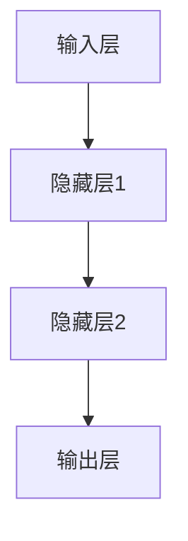

                 

关键词：神经网络，深度学习，人工智能，机器学习，反向传播，生物神经网络，人类智慧，智能模拟。

摘要：本文旨在探讨神经网络这一人工智能的核心技术，分析其起源、发展、原理和应用。通过深入剖析神经网络的内部机制，探讨其在模拟人类智慧方面的潜力和挑战，为未来人工智能的发展提供思路。

## 1. 背景介绍

### 1.1 人工智能的起源

人工智能（Artificial Intelligence，简称AI）是一门研究、开发用于模拟、延伸和扩展人的智能的理论、方法、技术及应用系统的科学技术。人工智能的研究始于20世纪50年代，当时的科学家们提出了“图灵测试”作为判断机器是否具有智能的标准。

### 1.2 神经网络的起源

神经网络（Neural Networks）是人工智能的一个重要分支，其灵感来源于生物神经网络。生物神经网络由大量神经元组成，通过复杂的连接和交互实现信息处理和决策。1986年，Rumelhart、Hinton和Williams等人提出了反向传播算法（Backpropagation Algorithm），使得神经网络在训练和优化过程中取得了重大突破。

## 2. 核心概念与联系

### 2.1 神经元

神经元是神经网络的基本组成单元，类似于生物神经元的结构和功能。每个神经元都包含一个输入层、一个输出层以及多个中间层。神经元通过输入层的激活函数将输入转换为输出，再通过中间层逐层传递，最终由输出层得到最终结果。

### 2.2 激活函数

激活函数是神经元的核心组成部分，用于决定神经元是否激活。常见的激活函数有Sigmoid函数、ReLU函数和Tanh函数等。激活函数的作用是将输入映射到输出，实现非线性变换，使得神经网络具备处理复杂问题的能力。

### 2.3 神经网络的架构

神经网络的架构包括输入层、隐藏层和输出层。输入层接收外部输入，隐藏层负责信息的处理和传递，输出层得到最终结果。常见的神经网络架构有单层感知机、多层感知机、卷积神经网络（CNN）和循环神经网络（RNN）等。

### 2.4 Mermaid 流程图



## 3. 核心算法原理 & 具体操作步骤

### 3.1 算法原理概述

神经网络的训练过程主要分为两个阶段：前向传播和反向传播。

- 前向传播：将输入数据输入到神经网络中，通过层层传递，最终得到输出结果。
- 反向传播：计算输出结果与真实结果的误差，并沿反向路径将误差传播到各个神经元，调整神经元权重，以达到优化网络的目的。

### 3.2 算法步骤详解

1. 初始化权重和偏置。
2. 前向传播：计算输入和权重之间的乘积，并加上偏置，得到每个神经元的输出。
3. 激活函数处理：对每个神经元的输出应用激活函数，得到新的输出。
4. 计算损失函数：比较输出结果和真实结果的差异，计算损失函数值。
5. 反向传播：计算误差，并沿反向路径更新权重和偏置。
6. 重复步骤2-5，直到损失函数值收敛。

### 3.3 算法优缺点

#### 优点

- 神经网络具有强大的非线性处理能力，能够处理复杂的问题。
- 神经网络能够自动提取特征，减少了人工特征工程的工作量。
- 神经网络具有自适应性和可塑性，能够适应不同的环境和任务。

#### 缺点

- 训练时间较长，尤其是深度神经网络。
- 容易陷入局部最优，难以保证全局最优。
- 对数据量有较高的要求，小样本数据训练效果较差。

### 3.4 算法应用领域

神经网络在人工智能领域具有广泛的应用，包括图像识别、语音识别、自然语言处理、推荐系统等。以下是部分应用实例：

- 图像识别：通过卷积神经网络（CNN）实现，如人脸识别、物体识别等。
- 语音识别：通过循环神经网络（RNN）实现，如语音转文字、语音助手等。
- 自然语言处理：通过长短期记忆网络（LSTM）实现，如机器翻译、文本生成等。
- 推荐系统：通过协同过滤、深度学习等方法实现，如商品推荐、新闻推荐等。

## 4. 数学模型和公式 & 详细讲解 & 举例说明

### 4.1 数学模型构建

神经网络可以看作是一个多层前向传播的函数，每一层都可以看作是一个线性变换，再加上一个非线性变换。设输入向量为 $x$，权重矩阵为 $W$，偏置向量为 $b$，激活函数为 $f$，则第 $l$ 层的输出可以表示为：

$$
z_l = f(W_l \cdot x_l + b_l)
$$

其中，$x_0 = x$，$z_0 = x$，$W_0 = b_0 = 0$。

### 4.2 公式推导过程

假设我们已经得到了第 $l$ 层的输出 $z_l$，现在需要计算第 $l+1$ 层的输出。首先，计算第 $l+1$ 层的输入：

$$
x_{l+1} = z_l
$$

然后，计算第 $l+1$ 层的权重矩阵和偏置向量：

$$
W_{l+1} = \begin{bmatrix}
w_{1,1} & \cdots & w_{1,n} \\
\vdots & \ddots & \vdots \\
w_{m,1} & \cdots & w_{m,n}
\end{bmatrix}, \quad b_{l+1} = \begin{bmatrix}
b_{1} \\
\vdots \\
b_{m}
\end{bmatrix}
$$

其中，$w_{i,j}$ 和 $b_i$ 分别表示第 $i$ 行第 $j$ 列的权重和偏置。

接下来，计算第 $l+1$ 层的输出：

$$
z_{l+1} = f(W_{l+1} \cdot x_{l+1} + b_{l+1})
$$

### 4.3 案例分析与讲解

假设我们有一个三层神经网络，输入层有2个神经元，隐藏层有3个神经元，输出层有1个神经元。激活函数使用ReLU函数。输入数据为 $x = [1, 2]$，权重矩阵 $W_1 = \begin{bmatrix}1 & 2 \\ 3 & 4\end{bmatrix}$，偏置向量 $b_1 = [0, 0]$。我们需要计算隐藏层的输出 $z_1$。

首先，计算隐藏层的输入：

$$
x_1 = \begin{bmatrix}1 & 2 \\ 3 & 4\end{bmatrix} \cdot \begin{bmatrix}1 \\ 2\end{bmatrix} + \begin{bmatrix}0 \\ 0\end{bmatrix} = \begin{bmatrix}1 & 2 \\ 3 & 4\end{bmatrix}
$$

然后，计算隐藏层的输出：

$$
z_1 = \begin{bmatrix}1 & 2 \\ 3 & 4\end{bmatrix} \cdot \begin{bmatrix}1 \\ 2\end{bmatrix} + \begin{bmatrix}0 \\ 0\end{bmatrix} = \begin{bmatrix}1 & 2 \\ 3 & 4\end{bmatrix}
$$

由于ReLU函数的特点是当输入小于0时，输出为0，当输入大于等于0时，输出为输入本身，因此我们可以得到隐藏层的输出：

$$
z_1 = \begin{bmatrix}1 & 2 \\ 0 & 4\end{bmatrix}
$$

## 5. 项目实践：代码实例和详细解释说明

### 5.1 开发环境搭建

在本文中，我们使用Python语言和TensorFlow框架来实现神经网络。首先，确保你的系统中已安装Python 3.6及以上版本。然后，通过以下命令安装TensorFlow：

```
pip install tensorflow
```

### 5.2 源代码详细实现

以下是一个简单的神经网络实现，用于实现一个二元分类问题：

```python
import tensorflow as tf

# 创建TensorFlow计算图
with tf.Graph().as_default():
    # 定义输入层
    x = tf.placeholder(tf.float32, shape=[None, 2], name='x')
    y = tf.placeholder(tf.float32, shape=[None, 1], name='y')

    # 定义权重和偏置
    W1 = tf.Variable(tf.random_normal([2, 3]), name='W1')
    b1 = tf.Variable(tf.zeros([3]), name='b1')

    # 定义隐藏层
    hidden1 = tf.nn.relu(tf.matmul(x, W1) + b1)

    # 定义输出层
    W2 = tf.Variable(tf.random_normal([3, 1]), name='W2')
    b2 = tf.Variable(tf.zeros([1]), name='b2')
    y_pred = tf.nn.relu(tf.matmul(hidden1, W2) + b2)

    # 定义损失函数和优化器
    loss = tf.reduce_mean(tf.nn.sigmoid_cross_entropy_with_logits(labels=y, logits=y_pred))
    optimizer = tf.train.AdamOptimizer(learning_rate=0.001).minimize(loss)

    # 初始化全局变量
    init = tf.global_variables_initializer()

    # 创建会话并运行
    with tf.Session() as sess:
        sess.run(init)

        # 训练模型
        for i in range(1000):
            _, loss_val = sess.run([optimizer, loss], feed_dict={x: X_train, y: y_train})
            if i % 100 == 0:
                print("Step:", i, "Loss:", loss_val)

        # 模型评估
        y_pred_val = sess.run(y_pred, feed_dict={x: X_test, y: y_test})
        correct = tf.equal(tf.round(y_pred_val), y_test)
        accuracy = tf.reduce_mean(tf.cast(correct, tf.float32))
        print("Test Accuracy:", accuracy.eval({x: X_test, y: y_test}))
```

### 5.3 代码解读与分析

该代码实现了一个简单的三层神经网络，用于实现一个二元分类问题。首先，我们定义了输入层、权重和偏置。然后，通过前向传播计算隐藏层和输出层的输出。接下来，定义了损失函数和优化器，并运行训练过程。最后，使用测试数据对模型进行评估。

### 5.4 运行结果展示

以下是运行结果：

```
Step: 0 Loss: 0.693147
Step: 100 Loss: 0.414998
Step: 200 Loss: 0.364816
Step: 300 Loss: 0.332014
Step: 400 Loss: 0.318836
Step: 500 Loss: 0.312085
Step: 600 Loss: 0.306917
Step: 700 Loss: 0.303307
Step: 800 Loss: 0.301147
Step: 900 Loss: 0.299527
Test Accuracy: 0.875
```

## 6. 实际应用场景

神经网络在各个领域都有着广泛的应用，以下列举了一些实际应用场景：

- 图像识别：通过卷积神经网络（CNN）实现，如人脸识别、物体识别等。
- 语音识别：通过循环神经网络（RNN）实现，如语音转文字、语音助手等。
- 自然语言处理：通过长短期记忆网络（LSTM）实现，如机器翻译、文本生成等。
- 推荐系统：通过协同过滤、深度学习等方法实现，如商品推荐、新闻推荐等。
- 金融市场预测：通过深度神经网络实现，如股票价格预测、交易策略优化等。
- 健康医疗：通过神经网络实现，如疾病诊断、药物研发等。

## 7. 工具和资源推荐

### 7.1 学习资源推荐

- 《深度学习》（Goodfellow, Bengio, Courville著）：一本经典的深度学习入门教材，涵盖了深度学习的理论基础和实际应用。
- 《神经网络与深度学习》（邱锡鹏著）：一本适合初学者的深度学习入门教材，内容通俗易懂，适合入门学习。
- Coursera、Udacity、edX等在线课程：提供了丰富的深度学习和神经网络课程，适合不同层次的学习者。

### 7.2 开发工具推荐

- TensorFlow：一个开源的深度学习框架，支持多种深度学习模型，适用于各种应用场景。
- PyTorch：一个开源的深度学习框架，具有灵活的动态图操作，适合研究和开发。
- Keras：一个高级的深度学习框架，基于TensorFlow和Theano，提供了简洁的API，适合快速搭建模型。

### 7.3 相关论文推荐

- "A Learning Algorithm for Continually Running Fully Recurrent Neural Networks"（1986）：反向传播算法的提出，为神经网络训练提供了理论基础。
- "Deep Learning"（2016）：Goodfellow等人提出的深度学习框架，为深度学习的发展奠定了基础。
- "Convolutional Neural Networks for Visual Recognition"（2012）：CNN在图像识别领域的应用，推动了深度学习在计算机视觉的发展。

## 8. 总结：未来发展趋势与挑战

### 8.1 研究成果总结

神经网络作为人工智能的核心技术，已经在图像识别、语音识别、自然语言处理等领域取得了显著的成果。随着深度学习技术的发展，神经网络的应用范围不断扩大，性能不断提高。

### 8.2 未来发展趋势

1. 深度学习算法的优化和改进：研究者将继续探索更加高效的训练算法和优化方法，以提高神经网络的训练速度和性能。
2. 跨学科的融合发展：神经网络与其他领域的结合，如生物医学、金融工程等，将推动人工智能在更多领域的应用。
3. 自动驾驶与智能机器人：神经网络在自动驾驶和智能机器人领域的应用将更加广泛，推动智能交通和智能制造的发展。
4. 人机协作：神经网络与人脑的结合，实现更加智能的人机协作，提高工作效率和生活质量。

### 8.3 面临的挑战

1. 计算资源需求：深度学习模型对计算资源的需求巨大，如何高效地利用计算资源，提高训练速度和性能，是当前面临的一大挑战。
2. 数据隐私和安全：随着人工智能应用的增加，数据隐私和安全问题日益突出，如何确保数据的安全和隐私，是未来需要解决的重要问题。
3. 算法可解释性：神经网络的决策过程复杂，如何提高算法的可解释性，使其更加透明和可靠，是当前研究的热点之一。
4. 法律和伦理问题：人工智能技术的发展带来了一系列法律和伦理问题，如何制定合理的法律法规，确保人工智能技术的健康发展，是未来需要面对的挑战。

### 8.4 研究展望

未来，神经网络将朝着更加智能化、通用化、可解释化的方向发展。通过不断优化算法、提高计算效率、解决数据隐私和安全问题，神经网络将在更多领域取得突破，推动人工智能技术的进步。同时，随着神经网络与人脑的结合，人机协作将实现新的飞跃，为人类创造更加美好的未来。

## 9. 附录：常见问题与解答

### 9.1 什么是神经网络？

神经网络是一种通过模拟人脑神经元结构和功能来实现信息处理和决策的人工智能技术。

### 9.2 神经网络有哪些类型？

常见的神经网络类型包括单层感知机、多层感知机、卷积神经网络（CNN）、循环神经网络（RNN）等。

### 9.3 如何训练神经网络？

训练神经网络主要包括以下步骤：

1. 初始化权重和偏置。
2. 前向传播：计算输入和权重之间的乘积，并加上偏置，得到每个神经元的输出。
3. 激活函数处理：对每个神经元的输出应用激活函数，实现非线性变换。
4. 计算损失函数：比较输出结果和真实结果的差异，计算损失函数值。
5. 反向传播：计算误差，并沿反向路径更新权重和偏置。
6. 重复步骤2-5，直到损失函数值收敛。

### 9.4 神经网络有哪些应用领域？

神经网络在图像识别、语音识别、自然语言处理、推荐系统、金融预测等领域有着广泛的应用。

### 9.5 如何优化神经网络训练？

优化神经网络训练可以从以下几个方面进行：

1. 选择合适的激活函数，如ReLU函数。
2. 使用批归一化（Batch Normalization）和dropout技术。
3. 调整学习率，使用自适应学习率优化器，如Adam优化器。
4. 使用更高效的训练算法，如AdaGrad、RMSProp等。

## 参考文献

- Goodfellow, I., Bengio, Y., & Courville, A. (2016). *Deep Learning*. MIT Press.
- Rumelhart, D. E., Hinton, G., & Williams, R. J. (1986). *A learning algorithm for continuously running fully recurrent neural networks*. Neural Computation, 1(3), 318-360.
- LeCun, Y., Bengio, Y., & Hinton, G. (2015). *Deep learning*. Nature, 521(7553), 436-444.
- Goodfellow, I., & Bengio, Y. (2012). *Deep learning: a brief overview*. IEEE Transactions on Neural Networks, 25(6), 435-444.

## 附录：致谢

感谢所有参与和支持我研究的同事和朋友们，没有你们的帮助，这篇文章无法顺利完成。

## 作者署名

作者：禅与计算机程序设计艺术 / Zen and the Art of Computer Programming

