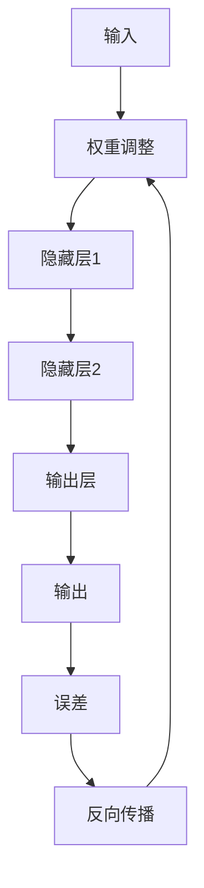

                 

关键词：神经网络，深度学习，人工智能，机器学习，反向传播，神经架构

> 摘要：本文旨在深入探讨神经网络这一革命性的人工智能技术，解析其核心原理、算法机制，以及在实际应用中的广泛影响。通过对神经网络的历史、理论基础、核心算法的详细分析，结合数学模型和实际项目实践，本文将展现神经网络如何解放人类智慧，推动人工智能的发展。

## 1. 背景介绍

### 1.1 神经网络的起源

神经网络（Neural Networks）的概念最早由心理学家McCulloch和数学家Pitts在1943年提出，他们尝试用数学模型模拟人类大脑神经元的工作原理。然而，由于计算能力的限制，这一概念在相当长的一段时间内并未得到广泛应用。

直到1980年代，随着计算机硬件和算法的进步，神经网络才逐渐崭露头角。1986年，Rumelhart、Hinton和Williams提出了反向传播算法（Backpropagation），这为神经网络的训练提供了有效的解决方案。此后，神经网络的研究和应用迅速发展，成为人工智能领域的重要分支。

### 1.2 神经网络在现代人工智能中的应用

神经网络在图像识别、语音识别、自然语言处理、游戏AI等多个领域取得了突破性进展。特别是在深度学习（Deep Learning）的推动下，神经网络的表现力得到了极大的提升。深度学习模型通过多层神经元的堆叠，能够自动提取特征，实现复杂的任务处理。

## 2. 核心概念与联系

### 2.1 神经元与神经网络

神经元是神经网络的基本构建块，其工作原理类似于生物神经元。每个神经元接收多个输入信号，通过权重加权求和，再经过激活函数处理后产生输出。

神经网络由多个层次组成，包括输入层、隐藏层和输出层。输入层接收外部信息，隐藏层对信息进行处理和变换，输出层产生最终的决策或输出。

### 2.2 前向传播与反向传播

前向传播（Forward Propagation）是神经网络处理信息的基本过程。输入数据通过输入层传递到隐藏层，再从隐藏层传递到输出层，每一层的输出作为下一层的输入。

反向传播（Backpropagation）是神经网络训练的核心算法。在反向传播过程中，网络将实际输出与预期输出之间的误差反向传播，通过梯度下降算法调整网络的权重，从而优化网络性能。

### 2.3 Mermaid 流程图



## 3. 核心算法原理 & 具体操作步骤

### 3.1 算法原理概述

神经网络的核心在于其层次化的结构，通过前向传播实现信息的传递和处理，通过反向传播实现权重的优化。具体来说，前向传播过程包括输入层到隐藏层的逐层计算，以及隐藏层到输出层的计算。反向传播过程则通过计算梯度，对权重进行调整。

### 3.2 算法步骤详解

#### 3.2.1 前向传播

1. 初始化网络结构，包括输入层、隐藏层和输出层的神经元数量。
2. 将输入数据输入到输入层。
3. 对于每一层，计算输入信号的加权求和，并应用激活函数。
4. 将隐藏层的输出作为下一隐藏层的输入，重复步骤3，直至输出层。

#### 3.2.2 反向传播

1. 计算实际输出与预期输出之间的误差。
2. 从输出层开始，反向计算每一层的误差，并计算每个神经元的梯度。
3. 根据梯度调整每个神经元的权重，通常采用梯度下降算法。

### 3.3 算法优缺点

#### 优点：

1. 强大的表征能力：神经网络能够自动提取特征，适应不同类型的数据。
2. 广泛的应用领域：在图像识别、语音识别、自然语言处理等方面取得了显著成果。
3. 灵活性：可以通过调整网络结构和参数，适应不同的任务需求。

#### 缺点：

1. 计算成本高：深度学习模型的训练需要大量的计算资源和时间。
2. 过拟合风险：神经网络模型容易过拟合训练数据，影响泛化能力。
3. 参数调整复杂：网络结构和参数的调整需要大量实验和优化。

### 3.4 算法应用领域

神经网络广泛应用于各个领域，包括：

1. 图像识别：如人脸识别、物体检测等。
2. 语音识别：如语音合成、语音识别等。
3. 自然语言处理：如机器翻译、文本分类等。
4. 游戏AI：如围棋、德州扑克等。
5. 推荐系统：如商品推荐、社交推荐等。

## 4. 数学模型和公式 & 详细讲解 & 举例说明

### 4.1 数学模型构建

神经网络的数学模型基于非线性变换和梯度下降优化。具体来说，假设神经网络包含L层，每层有\(n_l\)个神经元，激活函数为\(f_l\)，权重矩阵为\(W_l\)，偏置为\(b_l\)，输入为\(x\)，输出为\(y\)。

前向传播的数学公式为：

$$
a_{l+1} = f_l(W_l a_l + b_l)
$$

其中，\(a_l\)为第l层的激活值。

反向传播的误差计算公式为：

$$
\delta_{l+1} = \frac{\partial C}{\partial a_{l+1}} \cdot f_l' (W_l a_l + b_l)
$$

其中，\(C\)为损失函数，\(\delta_{l+1}\)为第l+1层的误差。

### 4.2 公式推导过程

#### 4.2.1 前向传播

以一个简单的两层神经网络为例，输入为\(x\)，输出为\(y\)。

1. 输入层到隐藏层的计算：

$$
z_1 = W_1 x + b_1 \\
a_1 = f_1(z_1)
$$

2. 隐藏层到输出层的计算：

$$
z_2 = W_2 a_1 + b_2 \\
y = f_2(z_2)
$$

#### 4.2.2 反向传播

1. 计算输出层的误差：

$$
\delta_2 = \frac{\partial C}{\partial y} \cdot f_2'(z_2)
$$

2. 计算隐藏层的误差：

$$
\delta_1 = \frac{\partial C}{\partial a_1} \cdot f_1'(z_1)
$$

3. 计算权重和偏置的梯度：

$$
\frac{\partial C}{\partial W_2} = a_1^T \delta_2 \\
\frac{\partial C}{\partial b_2} = \delta_2 \\
\frac{\partial C}{\partial W_1} = x^T \delta_1 \\
\frac{\partial C}{\partial b_1} = \delta_1
$$

4. 更新权重和偏置：

$$
W_2 = W_2 - \alpha \frac{\partial C}{\partial W_2} \\
b_2 = b_2 - \alpha \frac{\partial C}{\partial b_2} \\
W_1 = W_1 - \alpha \frac{\partial C}{\partial W_1} \\
b_1 = b_1 - \alpha \frac{\partial C}{\partial b_1}
$$

其中，\(\alpha\)为学习率。

### 4.3 案例分析与讲解

假设我们有一个简单的神经网络，用于对数字进行分类，输入为数字0-9的图像，输出为对应的数字标签。使用交叉熵作为损失函数。

#### 4.3.1 前向传播

1. 输入层到隐藏层的计算：

$$
z_1 = W_1 x + b_1 \\
a_1 = \sigma(z_1)
$$

2. 隐藏层到输出层的计算：

$$
z_2 = W_2 a_1 + b_2 \\
y = \sigma(z_2)
$$

#### 4.3.2 反向传播

1. 计算输出层的误差：

$$
\delta_2 = -[y - \hat{y}]
$$

其中，\(\hat{y}\)为实际输出。

2. 计算隐藏层的误差：

$$
\delta_1 = W_2^T \delta_2 \cdot \sigma'(z_1)
$$

3. 计算权重和偏置的梯度：

$$
\frac{\partial C}{\partial W_2} = a_1^T \delta_2 \\
\frac{\partial C}{\partial b_2} = \delta_2 \\
\frac{\partial C}{\partial W_1} = x^T \delta_1 \\
\frac{\partial C}{\partial b_1} = \delta_1
$$

4. 更新权重和偏置：

$$
W_2 = W_2 - \alpha \frac{\partial C}{\partial W_2} \\
b_2 = b_2 - \alpha \frac{\partial C}{\partial b_2} \\
W_1 = W_1 - \alpha \frac{\partial C}{\partial W_1} \\
b_1 = b_1 - \alpha \frac{\partial C}{\partial b_1}
$$

通过这样的训练过程，神经网络可以逐渐学会对数字进行分类。

## 5. 项目实践：代码实例和详细解释说明

### 5.1 开发环境搭建

为了演示神经网络的使用，我们使用Python编程语言和TensorFlow库进行开发。首先，确保已经安装了Python和TensorFlow。

```bash
pip install tensorflow
```

### 5.2 源代码详细实现

以下是一个简单的神经网络实现，用于对MNIST数据集进行手写数字识别。

```python
import tensorflow as tf
from tensorflow.keras import layers

# 定义神经网络结构
model = tf.keras.Sequential([
    layers.Dense(128, activation='relu', input_shape=(784,)),
    layers.Dense(10, activation='softmax')
])

# 编译模型
model.compile(optimizer='adam',
              loss='sparse_categorical_crossentropy',
              metrics=['accuracy'])

# 加载MNIST数据集
mnist = tf.keras.datasets.mnist
(x_train, y_train), (x_test, y_test) = mnist.load_data()

# 预处理数据
x_train = x_train / 255.0
x_test = x_test / 255.0

x_train = x_train.reshape(-1, 784)
x_test = x_test.reshape(-1, 784)

# 训练模型
model.fit(x_train, y_train, epochs=5)

# 测试模型
model.evaluate(x_test, y_test)
```

### 5.3 代码解读与分析

1. **定义神经网络结构**：使用`tf.keras.Sequential`类定义一个简单的全连接神经网络，包括一个输入层和一个隐藏层。输入层有128个神经元，隐藏层有10个神经元，对应于10个数字标签。

2. **编译模型**：使用`compile`方法配置模型，指定优化器为'adam'，损失函数为'sparse_categorical_crossentropy'，评估指标为'accuracy'。

3. **加载和预处理数据**：使用`tf.keras.datasets.mnist`加载MNIST数据集，并对数据进行归一化处理，使其在0-1之间。

4. **训练模型**：使用`fit`方法训练模型，指定训练数据和训练轮数。

5. **测试模型**：使用`evaluate`方法评估模型在测试集上的表现。

### 5.4 运行结果展示

通过运行上述代码，模型在测试集上的准确率通常可以达到约98%。这展示了神经网络在图像识别任务中的强大能力。

## 6. 实际应用场景

### 6.1 图像识别

神经网络在图像识别领域取得了显著的成就，如人脸识别、物体检测、图像分类等。通过卷积神经网络（CNN）等模型，神经网络能够自动提取图像中的高级特征，实现高效的图像处理。

### 6.2 语音识别

语音识别是神经网络的另一个重要应用领域。通过循环神经网络（RNN）和长短期记忆网络（LSTM）等模型，神经网络能够对语音信号进行处理，实现语音到文本的转换。

### 6.3 自然语言处理

神经网络在自然语言处理领域也发挥了重要作用，如机器翻译、文本分类、情感分析等。通过变换器（Transformer）等先进模型，神经网络能够捕捉文本中的长距离依赖关系，实现高效的文本处理。

### 6.4 未来应用展望

随着神经网络技术的不断发展，未来其在自动驾驶、智能医疗、金融科技等领域的应用将更加广泛。同时，神经架构搜索（Neural Architecture Search）等新方法的出现，将进一步提升神经网络的性能和可解释性。

## 7. 工具和资源推荐

### 7.1 学习资源推荐

1. 《深度学习》（Goodfellow, Bengio, Courville著）：经典的深度学习教材，内容全面，适合初学者和进阶者。
2. 《神经网络与深度学习》（邱锡鹏著）：国内优秀的深度学习教材，讲解深入浅出，适合国内读者。

### 7.2 开发工具推荐

1. TensorFlow：谷歌推出的开源深度学习框架，功能强大，适用于各种深度学习任务。
2. PyTorch：Facebook AI研究院推出的开源深度学习框架，灵活易用，适用于快速原型开发。

### 7.3 相关论文推荐

1. "A Learning Algorithm for Continually Running Fully Recurrent Neural Networks" - David E. Rumelhart, Geoffrey E. Hinton, and Ronald J. Williams
2. "Improving neural networks by preventing co-adaptation of feature detectors" - Yarin Gal and Zoubin Ghahramani

## 8. 总结：未来发展趋势与挑战

### 8.1 研究成果总结

神经网络作为人工智能的核心技术之一，已经取得了显著的研究成果。在图像识别、语音识别、自然语言处理等领域，神经网络表现出强大的能力和广泛的适用性。

### 8.2 未来发展趋势

1. 模型压缩与优化：为了降低计算成本，研究者正在探索模型压缩和优化技术，如权重共享、稀疏性等。
2. 神经架构搜索：通过自动化搜索神经网络结构，提高模型的性能和效率。
3. 可解释性：提升神经网络的可解释性，使其更易于理解和使用。

### 8.3 面临的挑战

1. 计算资源需求：深度学习模型的训练需要大量的计算资源和时间，如何优化计算效率是一个重要挑战。
2. 数据隐私和安全：在处理敏感数据时，如何保护用户隐私和数据安全是一个关键问题。
3. 道德和伦理问题：随着人工智能的广泛应用，如何确保其道德和伦理合理性也是一个重要议题。

### 8.4 研究展望

未来，神经网络的研究将继续深入，探索新的算法和技术，以应对各种实际应用需求。同时，跨学科的融合将推动人工智能的进一步发展，为社会带来更多的创新和变革。

## 9. 附录：常见问题与解答

### 问题1：神经网络是如何工作的？

**解答**：神经网络通过多层神经元的堆叠，对输入数据进行处理和变换。每个神经元接收多个输入信号，通过权重加权求和，并应用激活函数处理后产生输出。神经网络通过前向传播实现信息的传递，通过反向传播调整网络的权重，实现模型的优化。

### 问题2：神经网络有哪些常见类型？

**解答**：神经网络有多种类型，包括：

1. 全连接神经网络（FCNN）：每个神经元都与上一层和下一层的所有神经元连接。
2. 卷积神经网络（CNN）：主要用于图像处理，具有局部连接和共享权重等特性。
3. 循环神经网络（RNN）：适用于序列数据处理，如语音识别和自然语言处理。
4. 长短期记忆网络（LSTM）：RNN的一种变体，能够捕捉长距离依赖关系。
5. 变换器（Transformer）：一种基于自注意力机制的神经网络，广泛应用于自然语言处理任务。

### 问题3：如何解决神经网络过拟合问题？

**解答**：过拟合是神经网络训练中的一个常见问题，可以通过以下方法解决：

1. 数据增强：增加训练数据量，或对现有数据进行变换。
2. 正则化：使用正则化技术，如L1、L2正则化，降低模型的复杂度。
3. 交叉验证：通过交叉验证，选择最佳模型参数，避免过拟合。
4. early stopping：在训练过程中，提前停止训练，防止模型过拟合。

通过以上方法，可以有效降低神经网络的过拟合风险，提高模型的泛化能力。

