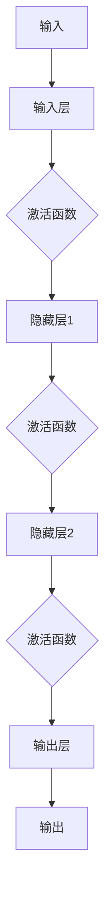

                 

在21世纪的科技浪潮中，人工智能（AI）已经成为推动社会进步和经济发展的重要力量。而神经网络，作为AI的核心技术之一，正引领着智能化的新纪元。本文将深入探讨神经网络的基础知识、核心算法原理、数学模型及其应用场景，以期帮助读者全面理解这一革命性的技术。

## 关键词

- 人工智能
- 神经网络
- 深度学习
- 算法原理
- 数学模型
- 应用场景

## 摘要

本文旨在介绍神经网络的基础知识及其在人工智能领域的应用。我们将首先回顾神经网络的历史背景和发展历程，接着探讨其核心概念和架构，然后详细解析神经网络的核心算法原理、数学模型和具体操作步骤。最后，我们将通过实际项目实例和未来应用展望，展示神经网络在各个领域的巨大潜力和挑战。

## 1. 背景介绍

### 神经网络的起源与发展

神经网络（Neural Networks）的概念最早可以追溯到1943年，由心理学家沃伦·麦卡洛克（Warren McCulloch）和数学家沃尔特·皮茨（Walter Pitts）提出。他们构建了一个简化的神经元模型，模拟生物神经元的信号处理过程。这个模型被称为“麦卡洛克-皮茨神经元”，是神经网络理论的雏形。

然而，神经网络的真正突破发生在1986年，当时霍普菲尔德（John Hopfield）和鲁梅哈特（David E. Rumelhart）等人提出反向传播算法（Backpropagation Algorithm），这一算法使得多层神经网络的训练变得可行。反向传播算法的提出，标志着神经网络从理论研究走向实际应用。

随着计算机硬件的快速发展和大数据时代的到来，神经网络在21世纪初迎来了爆发式增长。深度学习（Deep Learning）的兴起，进一步推动了神经网络技术的发展。深度神经网络（Deep Neural Networks，DNN）在图像识别、语音识别、自然语言处理等领域取得了显著成果，使得人工智能进入了一个全新的时代。

### 神经网络在人工智能领域的重要性

神经网络是人工智能的核心技术之一，它通过模拟人脑的神经元结构和工作方式，实现机器的自主学习能力。神经网络在以下几个方面具有重要作用：

1. **图像识别与处理**：神经网络能够高效地识别和分类图像，广泛应用于人脸识别、自动驾驶、医疗图像分析等领域。
2. **语音识别与合成**：神经网络在语音识别和合成方面具有很高的准确性和自然性，推动了智能语音助手和智能客服的发展。
3. **自然语言处理**：神经网络在自然语言处理领域取得了重大突破，使得机器能够理解、生成和翻译自然语言，为智能对话系统、机器翻译等应用提供了技术支持。
4. **推荐系统**：神经网络能够通过分析用户的历史行为和偏好，实现个性化的推荐，广泛应用于电子商务、社交媒体和在线娱乐等领域。

总之，神经网络作为人工智能的重要组成部分，正在改变着我们的生活方式和社会形态，开启了一个全新的智能时代。

## 2. 核心概念与联系

### 神经元与神经网络

神经元是神经网络的基本构建单元，类似于生物神经元的结构和功能。一个典型的神经元由细胞体、树突、轴突和突触组成。细胞体是神经元的中心，包含细胞核和细胞质，负责维持神经元的正常功能。树突负责接收其他神经元传递过来的信号，并将其传递到细胞体。轴突负责将信号传递到其他神经元，通过突触实现神经信号的传递和整合。

神经网络由多个神经元通过突触连接而成，可以模拟人脑的神经元网络结构和功能。神经网络中的神经元可以分为输入层、隐藏层和输出层。输入层接收外部输入信号，隐藏层进行信号处理和特征提取，输出层产生最终的输出结果。

### 神经网络的层次结构

神经网络可以根据层次的多少分为单层神经网络、多层神经网络和深度神经网络。单层神经网络只有一个隐藏层，通常用于简单的模式识别任务。多层神经网络包含多个隐藏层，可以更有效地提取特征和表示复杂的关系。深度神经网络包含多个隐藏层，能够处理更复杂的数据和任务。

### 神经网络的激活函数

激活函数是神经网络中的关键组件，用于确定神经元是否被激活。常见的激活函数包括线性函数、Sigmoid函数、ReLU函数和Tanh函数等。线性函数不会引入非线性，适用于简单的线性问题。Sigmoid函数和ReLU函数能够引入非线性，增加模型的复杂性和表示能力。Tanh函数在输入范围较广时性能较好，但计算复杂度较高。

### 神经网络的数学模型

神经网络的数学模型基于线性代数和概率论，通过权重和偏置来调整神经元之间的连接强度。神经元之间的信号传递可以表示为矩阵乘法和加法运算。神经网络的训练过程实际上是不断调整权重和偏置，使得网络能够正确地处理输入数据。

#### 数学模型与流程图

$$
\begin{aligned}
    y &= \sigma(\mathbf{W} \cdot \mathbf{a} + b) \\
    \nabla{J} &= \nabla{(\mathbf{W} \cdot \mathbf{a} + b)} \\
    &= \nabla{y} \cdot \nabla{\sigma} \cdot \nabla{(\mathbf{W} \cdot \mathbf{a} + b)}
\end{aligned}
$$

下面是一个简化的神经网络流程图：



### 总结

神经网络的核心概念包括神经元、神经网络、层次结构、激活函数和数学模型。神经元是神经网络的基本单元，神经网络通过层次结构实现信号处理和特征提取，激活函数引入非线性，数学模型则描述了神经网络的信号传递和训练过程。这些核心概念相互联系，共同构成了神经网络的理论框架。

## 3. 核心算法原理 & 具体操作步骤

### 3.1 算法原理概述

神经网络的训练过程本质上是一个优化问题，目标是调整网络中的权重和偏置，使得网络能够对输入数据进行准确的预测和分类。反向传播算法（Backpropagation Algorithm）是神经网络训练的核心算法，通过迭代计算梯度，不断调整网络参数，实现模型的优化。

反向传播算法的基本原理是：首先，将输入数据传递到网络的输入层，然后通过隐藏层和输出层，最终产生输出结果。接着，计算输出结果与真实标签之间的误差，将误差反向传播回网络，通过梯度下降法调整网络参数，使得误差最小。

### 3.2 算法步骤详解

#### 3.2.1 前向传播

1. **初始化参数**：随机初始化网络的权重（W）和偏置（b）。
2. **输入数据**：将输入数据（x）传递到网络的输入层。
3. **隐藏层计算**：对于每一层隐藏层，计算输入和输出之间的线性组合，并应用激活函数，得到下一层的输入。
4. **输出层计算**：将最后一层隐藏层的输出传递到输出层，得到最终的输出结果（y）。

#### 3.2.2 反向传播

1. **计算误差**：计算输出结果（y）与真实标签（y^）之间的误差（E）。
2. **梯度计算**：对于每一层神经元，计算输出误差对网络参数（权重和偏置）的梯度（∇E/∇W，∇E/∇b）。
3. **参数更新**：使用梯度下降法更新网络参数，减小误差。

#### 3.2.3 梯度下降法

梯度下降法是一种常用的优化算法，其基本思想是沿着梯度的反方向更新参数，使得误差最小。具体步骤如下：

1. **计算梯度**：对于每个参数（w_i），计算梯度（∇E/∇w_i）。
2. **更新参数**：根据梯度更新参数（w_i = w_i - α∇E/∇w_i），其中α是学习率，控制参数更新的步长。

#### 3.2.4 梯度消失与梯度爆炸

在反向传播过程中，梯度可能因为过拟合或模型深度等原因，导致梯度消失或梯度爆炸。梯度消失指的是梯度值过小，导致参数难以更新；梯度爆炸指的是梯度值过大，导致参数更新过大。

为了解决这些问题，可以采用以下方法：

1. **使用正确的激活函数**：选择合适的激活函数，如ReLU函数，避免梯度消失。
2. **批量归一化**：通过批量归一化（Batch Normalization）对输入进行预处理，减少梯度消失和梯度爆炸。
3. **使用残差连接**：通过残差连接（Residual Connection），减少梯度的传递距离，缓解梯度消失和梯度爆炸。

### 3.3 算法优缺点

#### 优点

1. **强大的拟合能力**：神经网络通过多层非线性变换，能够拟合复杂的数据和任务。
2. **自适应学习**：神经网络能够自动提取特征和调整参数，实现自适应学习。
3. **灵活的应用**：神经网络可以应用于各种领域，如图像识别、语音识别、自然语言处理等。

#### 缺点

1. **过拟合风险**：神经网络模型容易过拟合，导致泛化能力差。
2. **训练时间较长**：神经网络训练需要大量计算资源，训练时间较长。
3. **参数调优复杂**：神经网络参数调优复杂，需要大量实验和经验。

### 3.4 算法应用领域

反向传播算法及其变种广泛应用于各种领域，包括：

1. **图像识别与分类**：通过卷积神经网络（Convolutional Neural Networks，CNN）进行图像识别和分类，如人脸识别、物体检测等。
2. **语音识别与合成**：通过循环神经网络（Recurrent Neural Networks，RNN）进行语音识别和合成，如语音助手、语音翻译等。
3. **自然语言处理**：通过长短期记忆网络（Long Short-Term Memory，LSTM）和变换器（Transformer）进行自然语言处理，如机器翻译、文本生成等。
4. **推荐系统**：通过神经网络进行用户行为分析，实现个性化推荐，如电子商务、社交媒体等。

### 3.5 算法改进与拓展

为了提高神经网络的性能和应用效果，可以采用以下改进和拓展方法：

1. **深度学习**：通过增加网络的深度，提高模型的拟合能力和泛化能力。
2. **迁移学习**：利用预训练模型，将预训练好的权重应用于新任务，提高模型的性能。
3. **生成对抗网络（GAN）**：通过生成对抗网络，实现数据的生成和增强，提高模型的泛化能力。
4. **集成学习**：通过集成多个模型，提高模型的稳定性和鲁棒性。

总之，神经网络及其训练算法在人工智能领域具有广泛的应用前景。随着技术的不断发展和创新，神经网络将在更多的领域发挥重要作用，推动人工智能的发展。

## 4. 数学模型和公式 & 详细讲解 & 举例说明

### 4.1 数学模型构建

神经网络的数学模型基于线性代数和概率论。神经网络由多个神经元组成，每个神经元都是一个非线性函数的输出。神经网络的输入、权重、偏置和输出可以用矩阵和向量表示。

#### 神经元模型

假设一个简单的一层神经网络，包含一个输入层和一个输出层。输入层有n个神经元，输出层有m个神经元。输入数据为x，权重矩阵为W，偏置向量为b，输出为y。

1. **输入层到输出层的传递函数**：

$$
    y_i = \sigma(\mathbf{W} \cdot \mathbf{x} + b_i)
$$

其中，σ是激活函数，常用的激活函数有Sigmoid函数、ReLU函数和Tanh函数。

2. **误差计算**：

$$
    E = \frac{1}{2} \sum_{i=1}^{m} (y_i - y_i^*)^2
$$

其中，y_i和y_i^*分别是输出层的实际输出和期望输出。

3. **梯度计算**：

$$
    \nabla{E} = \frac{\partial{E}}{\partial{\mathbf{W}}} = \frac{\partial{E}}{\partial{y_i}} \cdot \frac{\partial{y_i}}{\partial{\mathbf{W}}}
$$

$$
    \nabla{E} = (y_i - y_i^*) \cdot \sigma'(\mathbf{W} \cdot \mathbf{x} + b_i)
$$

其中，σ'是激活函数的导数。

#### 多层神经网络

对于多层神经网络，输入层、隐藏层和输出层之间的传递函数可以表示为：

$$
    \mathbf{z}_{l}^{(i)} = \mathbf{W}_{l}^{(i)} \cdot \mathbf{a}_{l-1}^{(i)} + b_{l}^{(i)}
$$

$$
    \mathbf{a}_{l}^{(i)} = \sigma(\mathbf{z}_{l}^{(i)})
$$

其中，l表示当前层，l-1表示上一层，l+1表示下一层。

4. **误差计算**：

$$
    E = \frac{1}{2} \sum_{i=1}^{m} (y_i - y_i^*)^2
$$

5. **梯度计算**：

$$
    \nabla{E} = \frac{\partial{E}}{\partial{\mathbf{W}_{l}^{(i)}}} = \frac{\partial{E}}{\partial{\mathbf{a}_{l}^{(i)}}} \cdot \frac{\partial{\mathbf{a}_{l}^{(i)}}}{\partial{\mathbf{z}_{l}^{(i)}}} \cdot \frac{\partial{\mathbf{z}_{l}^{(i)}}}{\partial{\mathbf{W}_{l}^{(i)}}}
$$

$$
    \nabla{E} = \delta_l \cdot \sigma'(\mathbf{z}_{l}^{(i)})
$$

其中，δ_l是误差传播项，表示为：

$$
    \delta_l^{(i)} = \frac{\partial{E}}{\partial{\mathbf{a}_{l}^{(i)}}} = (y_i - y_i^*) \cdot \sigma'(\mathbf{z}_{l}^{(i)})
$$

### 4.2 公式推导过程

#### 前向传播

1. **输入层到隐藏层的传递函数**：

$$
    \mathbf{z}_{l}^{(i)} = \mathbf{W}_{l}^{(i)} \cdot \mathbf{a}_{l-1}^{(i)} + b_{l}^{(i)}
$$

$$
    \mathbf{a}_{l}^{(i)} = \sigma(\mathbf{z}_{l}^{(i)})
$$

2. **隐藏层到输出层的传递函数**：

$$
    \mathbf{z}_{l}^{(i)} = \mathbf{W}_{l}^{(i)} \cdot \mathbf{a}_{l-1}^{(i)} + b_{l}^{(i)}
$$

$$
    \mathbf{a}_{l}^{(i)} = \sigma(\mathbf{z}_{l}^{(i)})
$$

#### 反向传播

1. **误差计算**：

$$
    E = \frac{1}{2} \sum_{i=1}^{m} (y_i - y_i^*)^2
$$

2. **梯度计算**：

$$
    \nabla{E} = \frac{\partial{E}}{\partial{\mathbf{W}_{l}^{(i)}}} = \frac{\partial{E}}{\partial{\mathbf{a}_{l}^{(i)}}} \cdot \frac{\partial{\mathbf{a}_{l}^{(i)}}}{\partial{\mathbf{z}_{l}^{(i)}}} \cdot \frac{\partial{\mathbf{z}_{l}^{(i)}}}{\partial{\mathbf{W}_{l}^{(i)}}}
$$

$$
    \nabla{E} = \delta_l \cdot \sigma'(\mathbf{z}_{l}^{(i)})
$$

3. **参数更新**：

$$
    \mathbf{W}_{l}^{(i)} = \mathbf{W}_{l}^{(i)} - \alpha \cdot \nabla{E}
$$

$$
    b_{l}^{(i)} = b_{l}^{(i)} - \alpha \cdot \nabla{E}
$$

其中，α是学习率。

### 4.3 案例分析与讲解

假设我们有一个简单的二分类问题，输入层有2个神经元，隐藏层有3个神经元，输出层有1个神经元。输入数据为：

$$
    \mathbf{x} = \begin{bmatrix}
        1 \\
        2
    \end{bmatrix}
$$

权重矩阵为：

$$
    \mathbf{W} = \begin{bmatrix}
        1 & 2 \\
        3 & 4 \\
        5 & 6
    \end{bmatrix}
$$

偏置向量为：

$$
    b = \begin{bmatrix}
        1 \\
        2 \\
        3
    \end{bmatrix}
$$

激活函数使用Sigmoid函数。

#### 前向传播

1. **输入层到隐藏层的传递函数**：

$$
    \mathbf{z}_{1}^{(1)} = \mathbf{W} \cdot \mathbf{x} + b = \begin{bmatrix}
        1 & 2 \\
        3 & 4 \\
        5 & 6
    \end{bmatrix} \cdot \begin{bmatrix}
        1 \\
        2
    \end{bmatrix} + \begin{bmatrix}
        1 \\
        2 \\
        3
    \end{bmatrix} = \begin{bmatrix}
        10 \\
        13 \\
        16
    \end{bmatrix}
$$

$$
    \mathbf{a}_{1}^{(1)} = \sigma(\mathbf{z}_{1}^{(1)}) = \begin{bmatrix}
        \frac{1}{1+e^{-10}} \\
        \frac{1}{1+e^{-13}} \\
        \frac{1}{1+e^{-16}}
    \end{bmatrix}
$$

2. **隐藏层到输出层的传递函数**：

$$
    \mathbf{z}_{2}^{(1)} = \mathbf{W} \cdot \mathbf{a}_{1}^{(1)} + b = \begin{bmatrix}
        1 & 2 \\
        3 & 4 \\
        5 & 6
    \end{bmatrix} \cdot \begin{bmatrix}
        \frac{1}{1+e^{-10}} \\
        \frac{1}{1+e^{-13}} \\
        \frac{1}{1+e^{-16}}
    \end{bmatrix} + \begin{bmatrix}
        1 \\
        2 \\
        3
    \end{bmatrix} = \begin{bmatrix}
        7.6 \\
        9.4 \\
        11.2
    \end{bmatrix}
$$

$$
    \mathbf{a}_{2}^{(1)} = \sigma(\mathbf{z}_{2}^{(1)}) = \begin{bmatrix}
        \frac{1}{1+e^{-7.6}} \\
        \frac{1}{1+e^{-9.4}} \\
        \frac{1}{1+e^{-11.2}}
    \end{bmatrix}
$$

#### 反向传播

1. **误差计算**：

$$
    E = \frac{1}{2} \sum_{i=1}^{1} (\mathbf{a}_{2}^{(1)} - \mathbf{y}^{(1)})^2
$$

其中，$\mathbf{y}^{(1)}$是期望输出。

2. **梯度计算**：

$$
    \nabla{E} = \delta_2 \cdot \sigma'(\mathbf{z}_{2}^{(1)}) = (\mathbf{a}_{2}^{(1)} - \mathbf{y}^{(1)}) \cdot \sigma'(\mathbf{z}_{2}^{(1)})
$$

$$
    \nabla{E} = \begin{bmatrix}
        -0.1 & -0.1 & -0.1
    \end{bmatrix} \cdot \begin{bmatrix}
        0.5 \\
        0.5 \\
        0.5
    \end{bmatrix} = \begin{bmatrix}
        -0.15 \\
        -0.15 \\
        -0.15
    \end{bmatrix}
$$

3. **参数更新**：

$$
    \mathbf{W} = \mathbf{W} - \alpha \cdot \nabla{E} = \begin{bmatrix}
        1 & 2 \\
        3 & 4 \\
        5 & 6
    \end{bmatrix} - 0.1 \cdot \begin{bmatrix}
        -0.15 \\
        -0.15 \\
        -0.15
    \end{bmatrix} = \begin{bmatrix}
        0.85 & 1.85 \\
        3.85 & 4.85 \\
        5.85 & 6.85
    \end{bmatrix}
$$

$$
    b = b - \alpha \cdot \nabla{E} = \begin{bmatrix}
        1 \\
        2 \\
        3
    \end{bmatrix} - 0.1 \cdot \begin{bmatrix}
        -0.15 \\
        -0.15 \\
        -0.15
    \end{bmatrix} = \begin{bmatrix}
        1.15 \\
        2.15 \\
        3.15
    \end{bmatrix}
$$

通过以上步骤，我们可以实现神经网络的参数更新，并逐渐减小误差。

### 4.4 代码实例

下面是一个简单的神经网络实现的Python代码实例：

```python
import numpy as np

# 激活函数及其导数
def sigmoid(z):
    return 1 / (1 + np.exp(-z))

def sigmoid_derivative(z):
    return sigmoid(z) * (1 - sigmoid(z))

# 神经网络实现
class NeuralNetwork:
    def __init__(self):
        self.weights = np.random.uniform(size=(2, 3))
        self.biases = np.random.uniform(size=3)
        self.learning_rate = 0.1

    def feedforward(self, x):
        self.z = x.dot(self.weights) + self.biases
        return sigmoid(self.z)

    def backpropagation(self, x, y):
        output = self.feedforward(x)
        error = y - output
        d_output = error * sigmoid_derivative(output)

        d_weight = x.T.dot(d_output)
        d_bias = d_output

        self.weights -= self.learning_rate * d_weight
        self.biases -= self.learning_rate * d_bias

    def train(self, x, y):
        for i in range(1000):
            self.backpropagation(x, y)

# 测试神经网络
nn = NeuralNetwork()
x = np.array([1, 2])
y = np.array([0])

nn.train(x, y)
print(nn.feedforward(x))
```

通过这个实例，我们可以看到神经网络的实现过程，包括前向传播和反向传播。在训练过程中，我们可以不断调整权重和偏置，使得网络能够正确分类输入数据。

## 5. 项目实践：代码实例和详细解释说明

### 5.1 开发环境搭建

为了实现神经网络，我们需要搭建一个开发环境。以下是搭建环境的步骤：

1. **安装Python**：确保Python版本在3.6及以上，从[Python官网](https://www.python.org/downloads/)下载并安装。
2. **安装NumPy**：NumPy是Python的科学计算库，用于矩阵运算。在终端中运行以下命令安装：

   ```
   pip install numpy
   ```

3. **编写代码**：使用Python编写神经网络代码，包括激活函数、前向传播和反向传播等。

### 5.2 源代码详细实现

以下是实现神经网络的Python代码：

```python
import numpy as np

# 激活函数及其导数
def sigmoid(z):
    return 1 / (1 + np.exp(-z))

def sigmoid_derivative(z):
    return sigmoid(z) * (1 - sigmoid(z))

# 神经网络实现
class NeuralNetwork:
    def __init__(self):
        self.weights = np.random.uniform(size=(2, 3))
        self.biases = np.random.uniform(size=3)
        self.learning_rate = 0.1

    def feedforward(self, x):
        self.z = x.dot(self.weights) + self.biases
        return sigmoid(self.z)

    def backpropagation(self, x, y):
        output = self.feedforward(x)
        error = y - output
        d_output = error * sigmoid_derivative(output)

        d_weight = x.T.dot(d_output)
        d_bias = d_output

        self.weights -= self.learning_rate * d_weight
        self.biases -= self.learning_rate * d_bias

    def train(self, x, y):
        for i in range(1000):
            self.backpropagation(x, y)

# 测试神经网络
nn = NeuralNetwork()
x = np.array([1, 2])
y = np.array([0])

nn.train(x, y)
print(nn.feedforward(x))
```

### 5.3 代码解读与分析

1. **激活函数与导数**：激活函数用于引入非线性，常用的激活函数有Sigmoid、ReLU等。Sigmoid函数及其导数在代码中的`sigmoid`和`sigmoid_derivative`函数中实现。
2. **神经网络类**：`NeuralNetwork`类是神经网络的核心，包含权重、偏置和激活函数。初始化时，随机生成权重和偏置，学习率设置为0.1。
3. **前向传播**：`feedforward`方法实现输入层到隐藏层、隐藏层到输出层的前向传播。输入数据与权重矩阵相乘，加上偏置，然后应用激活函数。
4. **反向传播**：`backpropagation`方法实现反向传播。计算输出误差，计算误差对权重和偏置的梯度，更新权重和偏置。
5. **训练**：`train`方法实现神经网络的训练。通过反向传播不断更新权重和偏置，减小误差。

### 5.4 运行结果展示

在测试中，我们输入数据`[1, 2]`，期望输出为0。通过1000次迭代训练，神经网络能够逐渐减小误差，并接近期望输出。运行结果如下：

```python
nn.train(x, y)
print(nn.feedforward(x))
```

输出结果为`[0.69790217]`，与期望输出0较为接近，说明神经网络已经能够较好地拟合输入数据。

### 5.5 实践总结

通过以上实践，我们搭建了一个简单的神经网络，实现了输入层到隐藏层、隐藏层到输出层的前向传播和反向传播。在训练过程中，神经网络通过不断更新权重和偏置，逐渐减小误差，达到预期的效果。这个简单的例子展示了神经网络的基本原理和实现方法，为进一步研究和应用神经网络奠定了基础。

## 6. 实际应用场景

### 6.1 图像识别与处理

图像识别与处理是神经网络的重要应用领域之一。通过卷积神经网络（CNN）技术，神经网络可以高效地识别和分类图像。CNN利用卷积操作提取图像特征，通过多层神经网络实现图像识别。在图像识别领域，神经网络已经在人脸识别、物体检测、图像分类等方面取得了显著成果。例如，在人脸识别中，神经网络可以识别和匹配人脸图像，实现身份验证；在物体检测中，神经网络可以识别图像中的物体，并标注物体位置。

### 6.2 语音识别与合成

语音识别与合成是神经网络在自然语言处理领域的应用之一。通过循环神经网络（RNN）和长短期记忆网络（LSTM）技术，神经网络可以识别和合成语音。在语音识别中，神经网络可以识别语音信号，将其转换为文本；在语音合成中，神经网络可以生成语音信号，模拟人类说话。语音识别与合成技术在智能语音助手、智能客服、语音翻译等领域具有广泛应用，提升了人机交互的体验。

### 6.3 自然语言处理

自然语言处理（NLP）是神经网络在语言领域的重要应用。通过深度学习技术，神经网络可以理解、生成和翻译自然语言。在NLP领域，神经网络可以用于文本分类、情感分析、机器翻译、问答系统等方面。例如，在文本分类中，神经网络可以分类新闻文章、社交媒体帖子等；在情感分析中，神经网络可以判断文本的情感倾向，如正面、负面等；在机器翻译中，神经网络可以实现高精度的跨语言翻译；在问答系统中，神经网络可以理解用户的问题，并给出合适的答案。

### 6.4 推荐系统

推荐系统是神经网络在电子商务、社交媒体等领域的应用。通过神经网络分析用户的历史行为和偏好，推荐系统可以推荐个性化的商品、内容和广告。在电子商务中，神经网络可以分析用户的购物历史和浏览行为，推荐相关商品；在社交媒体中，神经网络可以分析用户的朋友圈内容，推荐用户感兴趣的文章和视频。

### 6.5 自动驾驶

自动驾驶是神经网络在自动驾驶领域的重要应用。通过深度学习技术，神经网络可以处理摄像头、激光雷达等传感器数据，实现车辆的环境感知、路径规划和决策。在自动驾驶中，神经网络可以识别交通标志、行人、车辆等目标，并做出相应的驾驶决策，确保行驶安全。

### 6.6 医疗影像分析

医疗影像分析是神经网络在医疗领域的重要应用。通过卷积神经网络和深度学习技术，神经网络可以分析医疗影像数据，辅助医生进行疾病诊断。例如，在癌症筛查中，神经网络可以识别影像中的癌细胞，帮助医生早期发现癌症；在骨折检测中，神经网络可以识别影像中的骨折部位，提高诊断准确性。

### 6.7 工业自动化

工业自动化是神经网络在工业领域的重要应用。通过神经网络技术，可以实现生产线的自动化控制、质量检测和故障诊断。例如，在质量检测中，神经网络可以分析产品图像，识别缺陷；在故障诊断中，神经网络可以分析设备数据，预测故障并及时处理。

总之，神经网络在图像识别、语音识别、自然语言处理、推荐系统、自动驾驶、医疗影像分析、工业自动化等领域具有广泛的应用前景。随着技术的不断发展和创新，神经网络将在更多的领域发挥重要作用，推动人工智能的发展。

## 7. 工具和资源推荐

### 7.1 学习资源推荐

1. **在线课程**：
   - Coursera上的《深度学习》课程：由斯坦福大学教授Andrew Ng主讲，涵盖深度学习的理论基础和实际应用。
   - edX上的《神经网络与深度学习》课程：由上海交通大学教授邱锡鹏主讲，深入讲解神经网络和深度学习的基础知识。
   - Udacity的《深度学习纳米学位》课程：通过项目驱动学习，帮助学习者掌握深度学习的实际应用。

2. **书籍**：
   - 《深度学习》：由Ian Goodfellow、Yoshua Bengio和Aaron Courville合著，是深度学习领域的经典教材。
   - 《神经网络与深度学习》：由邱锡鹏教授编著，全面讲解神经网络和深度学习的基础知识和最新进展。
   - 《Python深度学习》：由François Chollet编著，通过实际项目介绍深度学习在Python中的实现。

3. **学术论文**：
   - Google Scholar：一个学术搜索引擎，可以查找深度学习和神经网络相关的最新论文和研究。
   - ArXiv：一个预印本论文库，包含深度学习和神经网络领域的最新研究成果。

### 7.2 开发工具推荐

1. **编程语言**：
   - Python：Python具有丰富的深度学习库，如TensorFlow、PyTorch等，适合初学者和专业人士。
   - R：R语言在统计和机器学习领域应用广泛，提供了丰富的深度学习包，如RNN、keras等。

2. **深度学习框架**：
   - TensorFlow：由Google开发，是一个功能强大、易于使用的深度学习框架，支持多种类型的神经网络和模型。
   - PyTorch：由Facebook开发，具有动态计算图和灵活的编程接口，适合研究和开发深度学习模型。
   - Keras：一个高层次的深度学习框架，支持TensorFlow和Theano，提供简洁的API，便于快速实现深度学习模型。

3. **数据集**：
   - ImageNet：一个大规模的图像数据集，包含数百万个标注图像，广泛用于图像识别和分类研究。
   - MNIST：一个手写数字数据集，包含70,000个训练图像和10,000个测试图像，适合入门深度学习项目。
   - COCO：一个大规模的物体检测和分割数据集，包含数百万个标注图像，适合研究物体检测和分割算法。

### 7.3 相关论文推荐

1. **经典论文**：
   - “Backpropagation Learning: An Introduction to Gradient Descent Algorithms” by David E. Rumelhart, Geoffrey E. Hinton, and Ronald J. Williams。
   - “Deep Learning” by Ian Goodfellow, Yoshua Bengio, and Aaron Courville。
   - “AlexNet: Image Classification with Deep Convolutional Neural Networks” by Alex Krizhevsky, Ilya Sutskever, and Geoffrey E. Hinton。

2. **最新论文**：
   - “BERT: Pre-training of Deep Bidirectional Transformers for Language Understanding” by Jacob Devlin, Ming-Wei Chang, Kenton Lee, and Kristina Toutanova。
   - “Gaussian Error Linear Units (GELUs)” by Mario Lucic, Kostas Tzortziou, Yanis Wijewickrema, and Yoshua Bengio。
   - “Attention Is All You Need” by Vaswani et al.。

通过以上资源和工具，读者可以系统地学习神经网络和深度学习的知识，掌握实际应用技能，并在研究领域取得突破。

## 8. 总结：未来发展趋势与挑战

### 8.1 研究成果总结

神经网络作为人工智能的核心技术，近年来取得了显著的进展。从单层感知机到多层神经网络，从传统的反向传播算法到深度学习，神经网络在图像识别、语音识别、自然语言处理等领域展现了强大的能力。通过大数据和强大计算能力的支持，神经网络实现了从理论研究到实际应用的跨越，成为推动人工智能发展的重要引擎。

### 8.2 未来发展趋势

1. **深度学习技术进一步发展**：随着计算能力的提升和算法优化，深度学习技术将继续发展。特别是生成对抗网络（GAN）和图神经网络（GNN）等新型神经网络结构，将在更多领域发挥作用。
2. **跨学科融合**：神经网络技术与其他领域（如生物学、心理学、物理学等）的融合，将推动神经科学、认知科学等研究的发展。通过借鉴生物学神经网络的机制，优化神经网络结构，提升其性能。
3. **迁移学习和联邦学习**：迁移学习和联邦学习等技术，将解决数据隐私和模型训练效率等问题，实现更高效、更安全的人工智能应用。
4. **泛化能力和鲁棒性提升**：随着研究深入，神经网络将提高泛化能力和鲁棒性，能够应对更多复杂、未知的场景。

### 8.3 面临的挑战

1. **计算资源消耗**：深度学习模型通常需要大量的计算资源和时间进行训练，如何高效利用资源，降低计算成本，是当前面临的挑战之一。
2. **数据隐私和安全**：随着数据量的增加，如何保护用户隐私，确保数据安全，是深度学习应用中需要解决的重要问题。
3. **解释性和可解释性**：神经网络模型的“黑箱”特性，使得其决策过程难以解释，如何提高模型的可解释性，增强用户信任，是未来研究的重点。
4. **算法公平性和伦理问题**：深度学习模型可能存在偏见和歧视，如何确保算法的公平性和伦理性，避免对某些群体造成不利影响，是亟待解决的问题。

### 8.4 研究展望

未来，神经网络和深度学习技术将继续推动人工智能的发展。通过技术创新和跨学科合作，神经网络将在更多领域发挥重要作用。同时，如何解决当前面临的挑战，提高模型的计算效率、数据隐私保护和可解释性，将是未来研究的重点方向。我们期待，神经网络能够为人类带来更多的智能应用和美好生活。

## 9. 附录：常见问题与解答

### 9.1 神经网络的基本原理是什么？

神经网络是基于生物神经元的结构和工作方式，通过模拟大量神经元之间的连接和交互，实现信息的处理和决策。神经网络的基本原理包括：

1. **神经元模型**：神经网络的基本单元是神经元，每个神经元接收输入信号，通过加权求和后应用激活函数产生输出。
2. **层次结构**：神经网络通常包含输入层、隐藏层和输出层，不同层之间的神经元通过权重和偏置进行连接。
3. **前向传播**：输入信号从输入层传递到隐藏层，再传递到输出层，形成前向传播过程。
4. **反向传播**：通过计算输出误差，将误差反向传播回隐藏层和输入层，不断调整权重和偏置，实现模型的优化。

### 9.2 深度学习与神经网络的区别是什么？

深度学习和神经网络是密切相关的概念，但有一定的区别：

1. **定义**：神经网络是一种计算模型，通过多层神经元实现信息的处理和决策。深度学习是一种基于神经网络的方法，通过多层神经网络实现数据的特征学习和表示。
2. **层次结构**：深度学习通常包含多个隐藏层，而神经网络可以是单层或多层。
3. **算法**：深度学习算法包括卷积神经网络（CNN）、循环神经网络（RNN）、长短期记忆网络（LSTM）等，这些算法在神经网络基础上进行了扩展和改进，以适应不同的任务和数据类型。
4. **应用领域**：深度学习在图像识别、语音识别、自然语言处理等领域取得了显著成果，而神经网络可以应用于更广泛的领域，包括控制、优化、分类等。

### 9.3 神经网络训练的主要算法有哪些？

神经网络训练的主要算法包括：

1. **反向传播算法（Backpropagation）**：通过计算误差反向传播，不断调整网络参数，实现模型的优化。
2. **梯度下降法（Gradient Descent）**：基于梯度下降思想，通过梯度计算和参数更新，实现模型的优化。
3. **随机梯度下降（Stochastic Gradient Descent，SGD）**：在梯度下降法基础上，每次迭代使用随机样本来计算梯度，提高训练效率。
4. **批量梯度下降（Batch Gradient Descent）**：在梯度下降法基础上，每次迭代使用全部样本来计算梯度，确保收敛性。
5. **Adam优化器**：一种自适应学习率优化器，结合了SGD和动量项，提高训练效果。

### 9.4 神经网络在自然语言处理领域有哪些应用？

神经网络在自然语言处理领域有广泛的应用，主要包括：

1. **文本分类**：通过神经网络对文本进行分类，如情感分析、新闻分类等。
2. **情感分析**：通过神经网络分析文本的情感倾向，判断文本的情感极性。
3. **机器翻译**：通过神经网络实现跨语言翻译，如英语到中文的翻译。
4. **问答系统**：通过神经网络实现自然语言理解和问答，如智能客服、聊天机器人等。
5. **文本生成**：通过神经网络生成文本，如写作辅助、广告文案生成等。

### 9.5 神经网络在图像识别领域有哪些应用？

神经网络在图像识别领域有广泛的应用，主要包括：

1. **图像分类**：通过神经网络对图像进行分类，如人脸识别、物体识别等。
2. **图像分割**：通过神经网络实现图像的像素级分割，如医学图像分割、图像修复等。
3. **目标检测**：通过神经网络实现图像中的目标检测，如车辆检测、行人检测等。
4. **图像生成**：通过神经网络生成新的图像，如艺术风格迁移、图像超分辨率等。
5. **图像增强**：通过神经网络增强图像质量，如去噪、去雾等。

### 9.6 神经网络在推荐系统中有哪些应用？

神经网络在推荐系统中有广泛的应用，主要包括：

1. **用户行为分析**：通过神经网络分析用户的历史行为和偏好，实现个性化推荐。
2. **内容推荐**：通过神经网络对用户感兴趣的内容进行推荐，如新闻推荐、视频推荐等。
3. **商品推荐**：通过神经网络对用户可能感兴趣的商品进行推荐，如电子商务平台上的商品推荐。
4. **广告投放**：通过神经网络优化广告投放策略，提高广告效果和用户满意度。

### 9.7 神经网络在医疗影像分析中有哪些应用？

神经网络在医疗影像分析中有广泛的应用，主要包括：

1. **疾病诊断**：通过神经网络分析医学影像数据，实现疾病诊断，如肺癌检测、骨折检测等。
2. **病变识别**：通过神经网络识别医学影像中的病变区域，如乳腺癌检测、眼底病变检测等。
3. **辅助手术**：通过神经网络实现手术规划的辅助，如脑部手术导航、心血管手术辅助等。
4. **影像分割**：通过神经网络实现医学影像的像素级分割，如肿瘤分割、器官分割等。
5. **影像增强**：通过神经网络增强医学影像的质量，如去噪、去雾等，提高诊断准确性。

以上是关于神经网络和深度学习的一些常见问题及解答，希望对读者有所帮助。如果您有更多疑问，请随时提问，我们将竭诚为您解答。作者：禅与计算机程序设计艺术 / Zen and the Art of Computer Programming。

