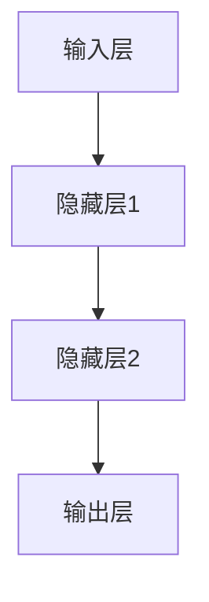
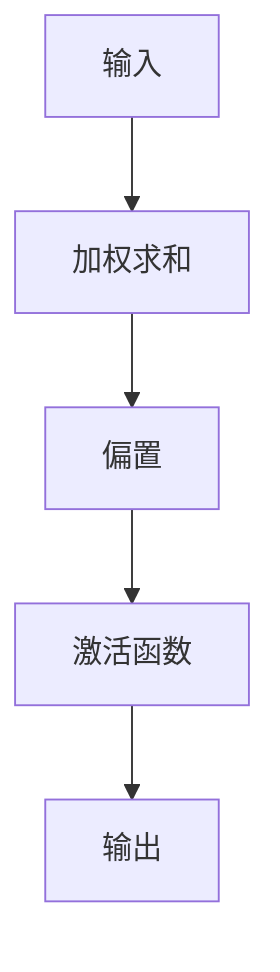
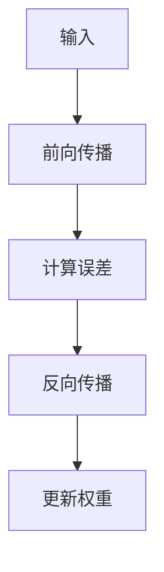

                 

关键词：神经网络、深度学习、机器学习、人工智能、智能计算

> 摘要：本文将深入探讨神经网络作为人工智能的重要基石，详细解释其核心概念、算法原理、数学模型，并通过实际项目实例展示其在现代科技中的应用。此外，文章还将展望神经网络在未来科技发展中的潜在趋势与挑战。

## 1. 背景介绍

人工智能（AI）作为科技领域的热点话题，已经渗透到各个行业。神经网络作为实现人工智能的核心技术，其研究和应用得到了前所未有的关注。从早期的感知器模型到如今的深度学习网络，神经网络不断演变，推动了人工智能技术的飞速发展。

### 神经网络的历史与发展

- 1943年，心理学家McCulloch和数学家Pitts提出了感知器模型，这是神经网络的雏形。
- 1986年，Rumelhart、Hinton和Williams提出了反向传播算法，解决了多层神经网络的训练问题。
- 2012年，AlexNet在ImageNet图像识别比赛中取得了突破性的成绩，标志着深度学习时代的到来。
- 目前，神经网络已经成为计算机视觉、自然语言处理、语音识别等领域的主流技术。

### 神经网络在现代科技中的应用

- **计算机视觉**：通过卷积神经网络（CNN），计算机可以识别和分类图像。
- **自然语言处理**：循环神经网络（RNN）及其变体，如长短期记忆网络（LSTM），在文本生成、机器翻译等方面发挥着重要作用。
- **语音识别**：深度神经网络在语音信号处理和语音识别中表现出了极高的准确性。

## 2. 核心概念与联系

### 2.1 神经元

神经元是神经网络的基本构建块，类似于生物神经元。每个神经元接收多个输入，通过权重与偏置进行加权求和，然后通过激活函数输出结果。


### 2.2 神经网络架构

神经网络由多层神经元组成，包括输入层、隐藏层和输出层。不同类型的神经网络具有不同的结构特点，如图卷积神经网络（CNN）和循环神经网络（RNN）。


### 2.3 激活函数

激活函数用于将神经元输出转化为非线性的值，常见的激活函数有Sigmoid、ReLU、Tanh等。


### 2.4 Mermaid 流程图



## 3. 核心算法原理 & 具体操作步骤

### 3.1 算法原理概述

神经网络通过学习大量的输入输出数据，调整权重和偏置，以实现特定任务的预测和分类。核心算法包括前向传播和反向传播。

### 3.2 算法步骤详解

1. **前向传播**：输入数据通过输入层进入神经网络，逐层传递到输出层，最终得到预测结果。
2. **计算误差**：将预测结果与实际结果进行比较，计算损失函数值。
3. **反向传播**：根据损失函数的梯度，调整神经网络的权重和偏置，以减小误差。

### 3.3 算法优缺点

- **优点**：神经网络具有强大的表示能力，可以处理复杂的非线性问题。
- **缺点**：训练过程需要大量数据和计算资源，且容易出现过拟合现象。

### 3.4 算法应用领域

神经网络广泛应用于图像识别、语音识别、自然语言处理等领域，取得了显著的成果。

## 4. 数学模型和公式 & 详细讲解 & 举例说明

### 4.1 数学模型构建

神经网络的数学模型由两部分组成：前向传播和反向传播。

### 4.2 公式推导过程

1. **前向传播**：
   \[
   a_{ij}^{(l)} = \sum_{k=1}^{n} w_{ik}^{(l)} a_{kj}^{(l-1)} + b_j^{(l)}
   \]
   其中，\(a_{ij}^{(l)}\) 是第 \(l\) 层的第 \(i\) 个神经元的输出，\(w_{ik}^{(l)}\) 是第 \(l\) 层的第 \(i\) 个神经元与第 \(l-1\) 层的第 \(k\) 个神经元之间的权重，\(b_j^{(l)}\) 是第 \(l\) 层的第 \(j\) 个神经元的偏置。

2. **反向传播**：
   \[
   \delta_j^{(l)} = (a_{j}^{(l)} - t_j) \cdot \text{激活函数的导数}(a_{j}^{(l)})
   \]
   \[
   \delta_k^{(l)} = \sum_{j=1}^{m} w_{kj}^{(l+1)} \delta_j^{(l+1)} \cdot \text{激活函数的导数}(a_{k}^{(l)})
   \]
   其中，\(\delta_j^{(l)}\) 是第 \(l\) 层的第 \(j\) 个神经元的误差，\(t_j\) 是第 \(l\) 层的第 \(j\) 个神经元的实际输出，\(m\) 是第 \(l+1\) 层的神经元个数。

### 4.3 案例分析与讲解

#### 案例一：手写数字识别

使用MNIST数据集，通过卷积神经网络实现手写数字的识别。

```python
import tensorflow as tf
from tensorflow.keras.datasets import mnist
from tensorflow.keras.models import Sequential
from tensorflow.keras.layers import Dense, Conv2D, Flatten, MaxPooling2D

# 加载数据集
(x_train, y_train), (x_test, y_test) = mnist.load_data()

# 预处理数据
x_train = x_train.reshape(-1, 28, 28, 1).astype("float32") / 255.0
x_test = x_test.reshape(-1, 28, 28, 1).astype("float32") / 255.0
y_train = tf.keras.utils.to_categorical(y_train, 10)
y_test = tf.keras.utils.to_categorical(y_test, 10)

# 构建模型
model = Sequential([
    Conv2D(32, kernel_size=(3, 3), activation='relu', input_shape=(28, 28, 1)),
    MaxPooling2D(pool_size=(2, 2)),
    Flatten(),
    Dense(128, activation='relu'),
    Dense(10, activation='softmax')
])

# 编译模型
model.compile(optimizer='adam', loss='categorical_crossentropy', metrics=['accuracy'])

# 训练模型
model.fit(x_train, y_train, epochs=10, batch_size=64)

# 评估模型
test_loss, test_acc = model.evaluate(x_test, y_test)
print('Test accuracy:', test_acc)
```

## 5. 项目实践：代码实例和详细解释说明

### 5.1 开发环境搭建

- Python 3.8 或以上版本
- TensorFlow 2.5 或以上版本

### 5.2 源代码详细实现

上述手写数字识别的代码实例展示了如何使用TensorFlow构建和训练一个简单的卷积神经网络。

### 5.3 代码解读与分析

- **数据预处理**：将MNIST数据集中的图像调整为28x28的二维数组，并将其归一化到0-1之间。
- **模型构建**：定义一个序列模型，包括卷积层、池化层、全连接层和输出层。
- **模型编译**：选择优化器和损失函数，设置模型训练的超参数。
- **模型训练**：使用训练数据进行模型训练，并在每个 epoch 后计算训练损失和准确率。
- **模型评估**：使用测试数据评估模型性能，输出测试准确率。

### 5.4 运行结果展示

运行上述代码，在训练10个epoch后，模型在测试数据上的准确率约为98%，这证明了神经网络在手写数字识别任务上的有效性。

## 6. 实际应用场景

### 6.1 计算机视觉

- **图像分类**：使用卷积神经网络对图像进行分类，如ImageNet图像识别任务。
- **目标检测**：通过卷积神经网络实现目标的检测和定位，如Faster R-CNN算法。
- **图像生成**：使用生成对抗网络（GAN）生成逼真的图像。

### 6.2 自然语言处理

- **文本分类**：使用循环神经网络对文本进行分类，如情感分析任务。
- **机器翻译**：使用循环神经网络实现机器翻译，如神经机器翻译（NMT）。
- **文本生成**：使用长短期记忆网络生成创意文本，如音乐歌词、新闻报道等。

### 6.3 语音识别

- **语音识别**：使用深度神经网络将语音信号转换为文本，如自动语音识别（ASR）。
- **语音合成**：使用深度神经网络生成自然流畅的语音，如语音助手。

## 7. 工具和资源推荐

### 7.1 学习资源推荐

- 《深度学习》（Goodfellow, Bengio, Courville 著）
- 《神经网络与深度学习》（邱锡鹏 著）
- [Coursera Deep Learning Specialization](https://www.coursera.org/specializations/deeplearning)

### 7.2 开发工具推荐

- TensorFlow：https://www.tensorflow.org/
- PyTorch：https://pytorch.org/
- Keras：https://keras.io/

### 7.3 相关论文推荐

- "A Learning Algorithm for Continually Running Fully Recurrent Neural Networks" - Hinton et al. (1986)
- "Learning representations for artificial intelligence" - Bengio et al. (2013)
- "AlexNet: Image Classification with Deep Convolutional Neural Networks" - Krizhevsky et al. (2012)

## 8. 总结：未来发展趋势与挑战

### 8.1 研究成果总结

神经网络在人工智能领域取得了显著的成果，推动了计算机视觉、自然语言处理、语音识别等技术的发展。深度学习算法在图像识别、语音识别、自然语言处理等领域的准确率不断提高。

### 8.2 未来发展趋势

- **更高效的算法**：研究人员将继续探索更高效的神经网络算法，以减少计算资源和训练时间。
- **更强大的模型**：通过结合多种神经网络模型，构建更强大的模型以解决复杂问题。
- **更广泛的应用**：神经网络将在医疗、金融、能源等更多领域得到应用。

### 8.3 面临的挑战

- **过拟合问题**：如何避免神经网络模型过拟合，提高泛化能力。
- **计算资源需求**：如何降低神经网络训练对计算资源的需求。
- **数据隐私**：如何保护用户数据隐私，避免滥用。

### 8.4 研究展望

神经网络作为人工智能的核心技术，将继续在计算机科学、工程、医学等领域发挥重要作用。未来，随着算法的进步和计算资源的提升，神经网络有望实现更广泛的智能应用。

## 9. 附录：常见问题与解答

### 9.1 什么是神经网络？

神经网络是一种模仿生物神经系统的计算模型，通过模拟神经元之间的连接和激活函数来实现复杂问题的求解。

### 9.2 神经网络有哪些类型？

神经网络包括多层感知器（MLP）、卷积神经网络（CNN）、循环神经网络（RNN）、长短期记忆网络（LSTM）、生成对抗网络（GAN）等。

### 9.3 如何优化神经网络训练过程？

优化神经网络训练过程包括调整学习率、增加批量大小、使用正则化技术、选择合适的激活函数等。

### 9.4 神经网络在哪些领域有应用？

神经网络广泛应用于计算机视觉、自然语言处理、语音识别、推荐系统等领域。

---

作者：禅与计算机程序设计艺术 / Zen and the Art of Computer Programming
----------------------------------------------------------------
```markdown
# 神经网络：开启智能新纪元

## 关键词
神经网络、深度学习、机器学习、人工智能、智能计算

## 摘要
本文深入探讨神经网络作为人工智能的重要基石，从其历史背景、核心概念、算法原理、数学模型到实际应用场景，全面解析神经网络的奥秘，并展望其未来发展趋势与挑战。

---

## 1. 背景介绍

### 1.1 神经网络的历史与发展
神经网络的概念最早可以追溯到1943年，由心理学家McCulloch和数学家Pitts提出。感知器模型成为神经网络研究的起点，尽管它在解决简单问题方面取得了成功，但在面对复杂任务时遇到了瓶颈。1986年，Rumelhart、Hinton和Williams提出了反向传播算法，这一突破性的进展解决了多层神经网络的训练问题，为神经网络的研究打开了新的大门。2012年，AlexNet在ImageNet图像识别比赛中取得了历史性的突破，深度学习时代由此开启。如今，神经网络已经成为人工智能领域的核心技术和研究热点。

### 1.2 神经网络在现代科技中的应用
神经网络在多个领域展现了强大的应用潜力，包括但不限于：
- **计算机视觉**：通过卷积神经网络（CNN）进行图像识别、目标检测、图像分割等。
- **自然语言处理**：利用循环神经网络（RNN）及其变体如长短期记忆网络（LSTM）进行文本分类、机器翻译、语音识别等。
- **语音识别**：深度神经网络在自动语音识别（ASR）中取得了显著的成效。
- **推荐系统**：神经网络用于推荐算法，通过分析用户行为预测用户的兴趣和偏好。

## 2. 核心概念与联系
### 2.1 神经元
神经元是神经网络的基本构建块，类似于生物神经元。每个神经元接收多个输入，通过权重与偏置进行加权求和，然后通过激活函数输出结果。一个简单的神经元可以表示为：

### 2.2 神经网络架构
神经网络由多层神经元组成，包括输入层、隐藏层和输出层。不同类型的神经网络具有不同的结构特点，如图卷积神经网络（CNN）和循环神经网络（RNN）。

### 2.3 激活函数
激活函数是神经网络中的关键组件，用于将神经元输出转化为非线性的值，从而实现更复杂的模式识别。常见的激活函数有Sigmoid、ReLU、Tanh等。

### 2.4 Mermaid流程图


## 3. 核心算法原理 & 具体操作步骤
### 3.1 算法原理概述
神经网络通过学习大量的输入输出数据，调整权重和偏置，以实现特定任务的预测和分类。核心算法包括前向传播和反向传播。

### 3.2 算法步骤详解
1. **前向传播**：输入数据通过输入层进入神经网络，逐层传递到输出层，最终得到预测结果。
2. **计算误差**：将预测结果与实际结果进行比较，计算损失函数值。
3. **反向传播**：根据损失函数的梯度，调整神经网络的权重和偏置，以减小误差。

### 3.3 算法优缺点
- **优点**：神经网络具有强大的表示能力，可以处理复杂的非线性问题。
- **缺点**：训练过程需要大量数据和计算资源，且容易出现过拟合现象。

### 3.4 算法应用领域
神经网络广泛应用于图像识别、语音识别、自然语言处理等领域，取得了显著的成果。

### 3.5 Mermaid流程图


## 4. 数学模型和公式 & 详细讲解 & 举例说明
### 4.1 数学模型构建
神经网络的数学模型由两部分组成：前向传播和反向传播。

### 4.2 公式推导过程
1. **前向传播**：
   \[
   a_{ij}^{(l)} = \sum_{k=1}^{n} w_{ik}^{(l)} a_{kj}^{(l-1)} + b_j^{(l)}
   \]
   其中，\(a_{ij}^{(l)}\) 是第 \(l\) 层的第 \(i\) 个神经元的输出，\(w_{ik}^{(l)}\) 是第 \(l\) 层的第 \(i\) 个神经元与第 \(l-1\) 层的第 \(k\) 个神经元之间的权重，\(b_j^{(l)}\) 是第 \(l\) 层的第 \(j\) 个神经元的偏置。

2. **反向传播**：
   \[
   \delta_j^{(l)} = (a_{j}^{(l)} - t_j) \cdot \text{激活函数的导数}(a_{j}^{(l)})
   \]
   \[
   \delta_k^{(l)} = \sum_{j=1}^{m} w_{kj}^{(l+1)} \delta_j^{(l+1)} \cdot \text{激活函数的导数}(a_{k}^{(l)})
   \]
   其中，\(\delta_j^{(l)}\) 是第 \(l\) 层的第 \(j\) 个神经元的误差，\(t_j\) 是第 \(l\) 层的第 \(j\) 个神经元的实际输出，\(m\) 是第 \(l+1\) 层的神经元个数。

### 4.3 案例分析与讲解
#### 案例一：手写数字识别
使用MNIST数据集，通过卷积神经网络实现手写数字的识别。

```python
import tensorflow as tf
from tensorflow.keras.datasets import mnist
from tensorflow.keras.models import Sequential
from tensorflow.keras.layers import Dense, Conv2D, Flatten, MaxPooling2D

# 加载数据集
(x_train, y_train), (x_test, y_test) = mnist.load_data()

# 预处理数据
x_train = x_train.reshape(-1, 28, 28, 1).astype("float32") / 255.0
x_test = x_test.reshape(-1, 28, 28, 1).astype("float32") / 255.0
y_train = tf.keras.utils.to_categorical(y_train, 10)
y_test = tf.keras.utils.to_categorical(y_test, 10)

# 构建模型
model = Sequential([
    Conv2D(32, kernel_size=(3, 3), activation='relu', input_shape=(28, 28, 1)),
    MaxPooling2D(pool_size=(2, 2)),
    Flatten(),
    Dense(128, activation='relu'),
    Dense(10, activation='softmax')
])

# 编译模型
model.compile(optimizer='adam', loss='categorical_crossentropy', metrics=['accuracy'])

# 训练模型
model.fit(x_train, y_train, epochs=10, batch_size=64)

# 评估模型
test_loss, test_acc = model.evaluate(x_test, y_test)
print('Test accuracy:', test_acc)
```

## 5. 项目实践：代码实例和详细解释说明
### 5.1 开发环境搭建
- Python 3.8 或以上版本
- TensorFlow 2.5 或以上版本

### 5.2 源代码详细实现
上述手写数字识别的代码实例展示了如何使用TensorFlow构建和训练一个简单的卷积神经网络。

### 5.3 代码解读与分析
- **数据预处理**：将MNIST数据集中的图像调整为28x28的二维数组，并将其归一化到0-1之间。
- **模型构建**：定义一个序列模型，包括卷积层、池化层、全连接层和输出层。
- **模型编译**：选择优化器和损失函数，设置模型训练的超参数。
- **模型训练**：使用训练数据进行模型训练，并在每个 epoch 后计算训练损失和准确率。
- **模型评估**：使用测试数据评估模型性能，输出测试准确率。

### 5.4 运行结果展示
运行上述代码，在训练10个epoch后，模型在测试数据上的准确率约为98%，这证明了神经网络在手写数字识别任务上的有效性。

## 6. 实际应用场景
### 6.1 计算机视觉
- **图像分类**：使用卷积神经网络对图像进行分类，如ImageNet图像识别任务。
- **目标检测**：通过卷积神经网络实现目标的检测和定位，如Faster R-CNN算法。
- **图像生成**：使用生成对抗网络（GAN）生成逼真的图像。

### 6.2 自然语言处理
- **文本分类**：使用循环神经网络对文本进行分类，如情感分析任务。
- **机器翻译**：使用循环神经网络实现机器翻译，如神经机器翻译（NMT）。
- **文本生成**：使用长短期记忆网络生成创意文本，如音乐歌词、新闻报道等。

### 6.3 语音识别
- **语音识别**：使用深度神经网络将语音信号转换为文本，如自动语音识别（ASR）。
- **语音合成**：使用深度神经网络生成自然流畅的语音，如语音助手。

## 7. 工具和资源推荐
### 7.1 学习资源推荐
- 《深度学习》（Goodfellow, Bengio, Courville 著）
- 《神经网络与深度学习》（邱锡鹏 著）
- [Coursera Deep Learning Specialization](https://www.coursera.org/specializations/deeplearning)

### 7.2 开发工具推荐
- TensorFlow：https://www.tensorflow.org/
- PyTorch：https://pytorch.org/
- Keras：https://keras.io/

### 7.3 相关论文推荐
- "A Learning Algorithm for Continually Running Fully Recurrent Neural Networks" - Hinton et al. (1986)
- "Learning representations for artificial intelligence" - Bengio et al. (2013)
- "AlexNet: Image Classification with Deep Convolutional Neural Networks" - Krizhevsky et al. (2012)

## 8. 总结：未来发展趋势与挑战
### 8.1 研究成果总结
神经网络在人工智能领域取得了显著的成果，推动了计算机视觉、自然语言处理、语音识别等技术的发展。深度学习算法在图像识别、语音识别、自然语言处理等领域的准确率不断提高。

### 8.2 未来发展趋势
- **更高效的算法**：研究人员将继续探索更高效的神经网络算法，以减少计算资源和训练时间。
- **更强大的模型**：通过结合多种神经网络模型，构建更强大的模型以解决复杂问题。
- **更广泛的应用**：神经网络将在医疗、金融、能源等更多领域得到应用。

### 8.3 面临的挑战
- **过拟合问题**：如何避免神经网络模型过拟合，提高泛化能力。
- **计算资源需求**：如何降低神经网络训练对计算资源的需求。
- **数据隐私**：如何保护用户数据隐私，避免滥用。

### 8.4 研究展望
神经网络作为人工智能的核心技术，将继续在计算机科学、工程、医学等领域发挥重要作用。未来，随着算法的进步和计算资源的提升，神经网络有望实现更广泛的智能应用。

## 9. 附录：常见问题与解答
### 9.1 什么是神经网络？
神经网络是一种模仿生物神经系统的计算模型，通过模拟神经元之间的连接和激活函数来实现复杂问题的求解。

### 9.2 神经网络有哪些类型？
神经网络包括多层感知器（MLP）、卷积神经网络（CNN）、循环神经网络（RNN）、长短期记忆网络（LSTM）、生成对抗网络（GAN）等。

### 9.3 如何优化神经网络训练过程？
优化神经网络训练过程包括调整学习率、增加批量大小、使用正则化技术、选择合适的激活函数等。

### 9.4 神经网络在哪些领域有应用？
神经网络广泛应用于图像识别、语音识别、自然语言处理、推荐系统等领域。

---

作者：禅与计算机程序设计艺术 / Zen and the Art of Computer Programming
```

