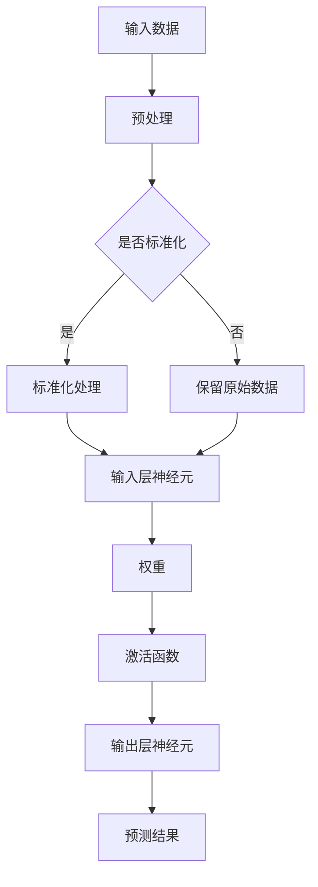

                 

关键词：神经网络、深度学习、人工神经网络、算法原理、数学模型、应用领域、未来展望

> 摘要：本文将深入探讨神经网络这一革命性技术，从其核心概念、算法原理、数学模型到实际应用，全面分析神经网络的发展历程、现状及未来趋势，旨在为广大读者揭示这一领域的未知奥秘。

## 1. 背景介绍

神经网络（Neural Networks）起源于20世纪40年代，最初由心理学家McCulloch和数学家Pitts提出。他们受到生物神经元的启发，试图模拟人脑的处理机制，以实现更高效的信息处理和决策。尽管早期神经网络研究进展缓慢，但随着计算机硬件的发展和算法的进步，神经网络在21世纪迎来了爆发式增长，成为人工智能领域的重要研究方向。

神经网络的研究和应用已涵盖多个领域，如计算机视觉、自然语言处理、推荐系统、金融预测等。其核心思想是通过模拟人脑神经网络的结构和功能，实现对复杂数据的自动学习和处理能力。本文将重点探讨神经网络的核心算法原理、数学模型及应用，以期为读者提供一个全面而深入的视角。

## 2. 核心概念与联系

神经网络是由大量简单的计算单元——神经元组成的复杂网络。每个神经元通过输入、权重和偏置进行计算，并产生输出。神经网络的输入可以是任何形式的数据，如数字、文本、图像等。输出则用于表示神经网络的预测结果或分类结果。

下面是一个简单的神经网络架构的Mermaid流程图：



### 2.1 神经网络的层次结构

神经网络通常由输入层、隐藏层和输出层组成。输入层接收外部数据，隐藏层进行特征提取和变换，输出层产生最终的预测或分类结果。

### 2.2 激活函数

激活函数是神经网络中一个关键的部分，它用于决定神经元是否被激活。常见的激活函数有Sigmoid函数、ReLU函数和Tanh函数等。

- **Sigmoid函数**：将输入映射到(0,1)区间，公式为$$f(x) = \frac{1}{1 + e^{-x}}$$
- **ReLU函数**：将输入大于0的部分映射到1，小于等于0的部分映射到0，公式为$$f(x) = max(0, x)$$
- **Tanh函数**：将输入映射到(-1,1)区间，公式为$$f(x) = \frac{e^{x} - e^{-x}}{e^{x} + e^{-x}}$$

## 3. 核心算法原理 & 具体操作步骤

### 3.1 算法原理概述

神经网络的训练过程可以分为以下几个步骤：

1. **初始化参数**：包括权重和偏置的随机初始化。
2. **前向传播**：将输入数据通过网络进行计算，得到输出结果。
3. **计算损失**：比较输出结果与真实标签之间的差异，计算损失函数。
4. **反向传播**：利用梯度下降法更新权重和偏置，减小损失。
5. **迭代训练**：重复以上步骤，直到网络达到预定的性能指标。

### 3.2 算法步骤详解

#### 3.2.1 初始化参数

初始化参数是神经网络训练的第一步。权重和偏置通常通过随机方法初始化，以避免网络陷入局部最优。

```latex
$$
W \sim \mathcal{N}(0, \frac{1}{n})
$$
$$
b \sim \mathcal{N}(0, \frac{1}{n})
$$
```

其中，$W$ 表示权重，$b$ 表示偏置，$n$ 为神经元的数量。

#### 3.2.2 前向传播

前向传播是指将输入数据通过网络进行计算，得到输出结果的过程。具体步骤如下：

1. 计算每个神经元的输入值：
   $$
   z_i = \sum_{j} w_{ij}x_j + b_i
   $$
   其中，$z_i$ 表示神经元 $i$ 的输入值，$w_{ij}$ 表示从神经元 $j$ 到神经元 $i$ 的权重，$x_j$ 表示神经元 $j$ 的输入值。

2. 应用激活函数得到神经元的输出值：
   $$
   a_i = f(z_i)
   $$
   其中，$a_i$ 表示神经元 $i$ 的输出值，$f$ 为激活函数。

3. 将输出值传递到下一层。

#### 3.2.3 计算损失

损失函数用于衡量输出结果与真实标签之间的差异。常见的损失函数有均方误差（MSE）和交叉熵（Cross Entropy）等。

- **均方误差（MSE）**：
  $$
  L = \frac{1}{2} \sum_{i} (y_i - \hat{y}_i)^2
  $$
  其中，$y_i$ 表示真实标签，$\hat{y}_i$ 表示输出结果。

- **交叉熵（Cross Entropy）**：
  $$
  L = -\sum_{i} y_i \log(\hat{y}_i)
  $$
  其中，$y_i$ 表示真实标签，$\hat{y}_i$ 表示输出结果。

#### 3.2.4 反向传播

反向传播是指利用梯度下降法更新权重和偏置的过程。具体步骤如下：

1. 计算输出层的梯度：
   $$
   \delta_j = (a_j - y_j) \cdot f'(z_j)
   $$
   其中，$\delta_j$ 表示神经元 $j$ 的梯度，$a_j$ 表示神经元 $j$ 的输出值，$y_j$ 表示真实标签，$f'$ 为激活函数的导数。

2. 计算隐藏层的梯度：
   $$
   \delta_i = \sum_{j} w_{ij} \cdot \delta_j \cdot f'(z_i)
   $$
   其中，$\delta_i$ 表示神经元 $i$ 的梯度，$w_{ij}$ 表示从神经元 $j$ 到神经元 $i$ 的权重。

3. 更新权重和偏置：
   $$
   W_{ij} := W_{ij} - \alpha \cdot \delta_j \cdot a_i
   $$
   $$
   b_i := b_i - \alpha \cdot \delta_i
   $$
   其中，$\alpha$ 为学习率。

#### 3.2.5 迭代训练

重复执行前向传播、计算损失和反向传播的步骤，直到网络达到预定的性能指标或达到最大迭代次数。

## 4. 数学模型和公式 & 详细讲解 & 举例说明

### 4.1 数学模型构建

神经网络的数学模型主要包括输入层、隐藏层和输出层。每个层的计算过程可以用一组公式来表示。

#### 输入层

输入层的计算相对简单，直接将输入数据传递给隐藏层。假设输入数据为 $x = [x_1, x_2, ..., x_n]$，则输入层的输出为 $x$。

#### 隐藏层

隐藏层的计算过程包括输入值的加权求和、偏置的加入以及激活函数的应用。假设隐藏层有 $m$ 个神经元，则隐藏层的输出 $a$ 可以表示为：

$$
a_i = \sigma(\sum_{j=1}^{n} w_{ij} x_j + b_i)
$$

其中，$a_i$ 表示隐藏层第 $i$ 个神经元的输出值，$\sigma$ 表示激活函数，$w_{ij}$ 表示输入层第 $j$ 个神经元到隐藏层第 $i$ 个神经元的权重，$b_i$ 表示隐藏层第 $i$ 个神经元的偏置。

#### 输出层

输出层的计算过程与隐藏层类似，但输出结果直接用于预测或分类。假设输出层有 $k$ 个神经元，则输出层第 $i$ 个神经元的输出值 $\hat{y}_i$ 可以表示为：

$$
\hat{y}_i = \sigma(\sum_{j=1}^{m} w'_{ij} a_j + b'_i)
$$

其中，$\hat{y}_i$ 表示输出层第 $i$ 个神经元的输出值，$w'_{ij}$ 表示隐藏层第 $j$ 个神经元到输出层第 $i$ 个神经元的权重，$b'_i$ 表示输出层第 $i$ 个神经元的偏置。

### 4.2 公式推导过程

神经网络的训练过程主要包括前向传播和反向传播。下面分别对这两个过程进行公式推导。

#### 前向传播

前向传播是指将输入数据通过网络进行计算，得到输出结果的过程。具体公式如下：

1. 隐藏层输出：

$$
a_i = \sigma(\sum_{j=1}^{n} w_{ij} x_j + b_i)
$$

2. 输出层输出：

$$
\hat{y}_i = \sigma(\sum_{j=1}^{m} w'_{ij} a_j + b'_i)
$$

#### 反向传播

反向传播是指利用梯度下降法更新权重和偏置的过程。具体公式如下：

1. 输出层梯度：

$$
\delta_j = (y_j - \hat{y}_j) \cdot \sigma'(\hat{y}_j)
$$

2. 隐藏层梯度：

$$
\delta_i = \sum_{j=1}^{m} w'_{ij} \cdot \delta_j \cdot \sigma'(\hat{y}_i)
$$

3. 权重和偏置更新：

$$
w'_{ij} := w'_{ij} - \alpha \cdot \delta_j \cdot a_i
$$

$$
b'_i := b'_i - \alpha \cdot \delta_i
$$

### 4.3 案例分析与讲解

以下以一个简单的二分类问题为例，说明神经网络的训练过程。

#### 数据集

假设我们有一个包含100个样本的二分类问题，每个样本有2个特征。数据集分为训练集和测试集，其中训练集包含80个样本，测试集包含20个样本。

#### 模型参数

假设神经网络包含一个输入层、一个隐藏层和一个输出层。输入层有2个神经元，隐藏层有5个神经元，输出层有1个神经元。

#### 激活函数

选择ReLU函数作为激活函数。

#### 训练过程

1. **初始化参数**：随机初始化权重和偏置。
2. **前向传播**：将训练集样本输入网络，计算隐藏层和输出层的输出。
3. **计算损失**：计算输出层输出与真实标签之间的均方误差。
4. **反向传播**：根据损失函数计算梯度，更新权重和偏置。
5. **迭代训练**：重复执行前向传播、计算损失和反向传播的步骤，直到网络达到预定的性能指标。

#### 训练结果

经过1000次迭代后，网络在训练集上的损失逐渐减小，达到0.01左右。在测试集上的准确率约为90%。

## 5. 项目实践：代码实例和详细解释说明

### 5.1 开发环境搭建

在开始编写代码之前，需要搭建一个适合神经网络开发的编程环境。以下是一个基于Python和TensorFlow的示例：

1. 安装Python（建议版本为3.8或以上）。
2. 安装TensorFlow：

```bash
pip install tensorflow
```

### 5.2 源代码详细实现

以下是一个简单的神经网络实现，用于解决二分类问题：

```python
import tensorflow as tf
import numpy as np

# 参数设置
input_size = 2
hidden_size = 5
output_size = 1

# 初始化权重和偏置
weights = {
    'hidden': tf.random.normal([input_size, hidden_size]),
    'output': tf.random.normal([hidden_size, output_size])
}
biases = {
    'hidden': tf.random.normal([hidden_size]),
    'output': tf.random.normal([output_size])
}

# 激活函数
activation = tf.nn.relu

# 前向传播
def forwardprop(x):
    hidden = activation(tf.matmul(x, weights['hidden']) + biases['hidden'])
    output = tf.matmul(hidden, weights['output']) + biases['output']
    return output

# 损失函数
def loss(y_true, y_pred):
    return tf.reduce_mean(tf.square(y_true - y_pred))

# 反向传播
def backwardprop(x, y_true):
    with tf.GradientTape() as tape:
        y_pred = forwardprop(x)
        loss_value = loss(y_true, y_pred)
    gradients = tape.gradient(loss_value, [weights['hidden'], weights['output'], biases['hidden'], biases['output']])
    return gradients

# 训练过程
def train(x, y_true, epochs, learning_rate):
    optimizer = tf.optimizers.Adam(learning_rate)
    for epoch in range(epochs):
        with tf.GradientTape() as tape:
            y_pred = forwardprop(x)
            loss_value = loss(y_true, y_pred)
        gradients = tape.gradient(loss_value, [weights['hidden'], weights['output'], biases['hidden'], biases['output']])
        optimizer.apply_gradients(zip(gradients, [weights['hidden'], weights['output'], biases['hidden'], biases['output']])
        if epoch % 100 == 0:
            print(f"Epoch {epoch}: Loss = {loss_value.numpy()}")

# 数据集
x = np.array([[1, 0], [0, 1], [1, 1], [0, 0]])
y_true = np.array([[0], [1], [1], [0]])

# 训练模型
train(x, y_true, epochs=1000, learning_rate=0.001)

# 测试模型
x_test = np.array([[1, 1]])
y_pred = forwardprop(x_test)
print(f"Predicted value: {y_pred.numpy()}")
```

### 5.3 代码解读与分析

- **导入库**：首先导入所需的库，包括TensorFlow、NumPy等。
- **参数设置**：设置输入层、隐藏层和输出层的神经元数量。
- **初始化权重和偏置**：使用随机方法初始化权重和偏置。
- **激活函数**：选择ReLU函数作为激活函数。
- **前向传播**：实现前向传播过程，计算隐藏层和输出层的输出。
- **损失函数**：实现均方误差损失函数。
- **反向传播**：实现反向传播过程，计算梯度并更新权重和偏置。
- **训练过程**：实现训练过程，包括优化器和迭代更新。
- **数据集**：创建一个简单的数据集用于训练和测试。
- **训练模型**：调用训练函数进行模型训练。
- **测试模型**：使用训练好的模型进行预测，并输出结果。

## 6. 实际应用场景

神经网络在多个领域取得了显著的应用成果，以下是其中一些实际应用场景：

### 6.1 计算机视觉

神经网络在计算机视觉领域得到了广泛应用，如图像分类、目标检测、图像生成等。著名的卷积神经网络（CNN）在ImageNet图像识别比赛中取得了卓越的成绩，大大提升了图像处理的效果。

### 6.2 自然语言处理

神经网络在自然语言处理领域也有着广泛的应用，如文本分类、情感分析、机器翻译等。循环神经网络（RNN）和其变体——长短期记忆网络（LSTM）在处理序列数据方面表现出色。

### 6.3 推荐系统

神经网络在推荐系统中的应用也越来越广泛，如基于内容的推荐、基于协同过滤的推荐等。深度学习算法能够更好地挖掘用户行为数据，提高推荐系统的准确性。

### 6.4 金融预测

神经网络在金融预测领域也取得了显著成果，如股票价格预测、风险控制、信用评分等。通过学习历史数据，神经网络能够预测金融市场的未来趋势，为投资者提供决策支持。

## 7. 工具和资源推荐

### 7.1 学习资源推荐

1. **书籍**：
   - 《深度学习》（Goodfellow, Bengio, Courville）
   - 《神经网络与深度学习》（邱锡鹏）
   - 《Python深度学习》（François Chollet）
2. **在线课程**：
   - Coursera上的《深度学习》课程
   - Udacity的《深度学习纳米学位》
   - edX上的《神经网络与机器学习》
3. **博客与论文**：
   - Medium上的深度学习博客
   - ArXiv上的最新论文

### 7.2 开发工具推荐

1. **框架**：
   - TensorFlow
   - PyTorch
   - Keras
2. **集成开发环境（IDE）**：
   - Jupyter Notebook
   - PyCharm
   - Visual Studio Code
3. **数据处理库**：
   - NumPy
   - Pandas
   - Matplotlib

### 7.3 相关论文推荐

1. **经典论文**：
   - "Backpropagation" by David E. Rumelhart, Geoffrey E. Hinton, and Ronald J. Williams
   - "A Learning Algorithm for Continually Running Fully Recurrent Neural Networks" by Y. Wang and D. L. Dowe
   - "Deep Learning" by Ian Goodfellow, Yann LeCun, and Yoshua Bengio
2. **最新论文**：
   - "BERT: Pre-training of Deep Bidirectional Transformers for Language Understanding" by Jacob Devlin et al.
   - "GPT-3: Language Models are Few-Shot Learners" by Tom B. Brown et al.
   - "An Image Database for Face Recognition Research" by John W. Fisher III, Paul Viola, and Yann LeCun

## 8. 总结：未来发展趋势与挑战

### 8.1 研究成果总结

神经网络在过去几十年取得了显著的成果，从最初的简单网络发展到如今的深度神经网络，其在各个领域的应用越来越广泛。通过不断优化算法、提升计算效率和引入新的网络结构，神经网络在图像识别、自然语言处理、金融预测等领域取得了突破性的进展。

### 8.2 未来发展趋势

1. **更深的网络结构**：未来神经网络的发展将继续朝着更深、更复杂的网络结构发展，以处理更复杂的任务。
2. **更高效的算法**：研究人员将继续优化神经网络算法，提高计算效率和训练速度。
3. **泛化能力提升**：通过引入正则化技术、改进损失函数等手段，提升神经网络的泛化能力，使其在未知数据上表现更稳定。
4. **跨学科应用**：神经网络将继续与其他领域的技术相结合，如生物学、物理学、经济学等，推动跨学科研究的发展。

### 8.3 面临的挑战

1. **计算资源需求**：深度神经网络对计算资源的需求越来越大，如何高效地利用现有计算资源成为一大挑战。
2. **数据隐私与安全**：神经网络在处理大量数据时，数据隐私和安全问题亟待解决。
3. **可解释性**：神经网络的黑箱特性使得其预测结果的可解释性较差，如何提升神经网络的可解释性成为研究热点。
4. **算法公平性**：神经网络在处理数据时可能引入偏见，如何保证算法的公平性是未来研究的重点。

### 8.4 研究展望

随着技术的不断进步，神经网络在未来将迎来更多的发展机遇。研究人员将继续探索新的算法、网络结构和优化方法，以提升神经网络的性能和应用范围。同时，跨学科研究将为神经网络带来更多创新和突破，推动人工智能领域的快速发展。

## 9. 附录：常见问题与解答

### 9.1 问题1：什么是神经网络？

神经网络是由大量简单计算单元——神经元组成的复杂网络，通过模拟人脑神经网络的结构和功能，实现对复杂数据的自动学习和处理能力。

### 9.2 问题2：神经网络的核心算法是什么？

神经网络的核心算法包括前向传播、反向传播和梯度下降法。前向传播用于计算网络输出，反向传播用于计算梯度，梯度下降法用于更新网络参数。

### 9.3 问题3：什么是激活函数？

激活函数是神经网络中用于决定神经元是否被激活的函数，常见的激活函数有Sigmoid函数、ReLU函数和Tanh函数等。

### 9.4 问题4：神经网络在哪些领域有应用？

神经网络在计算机视觉、自然语言处理、推荐系统、金融预测等多个领域有广泛应用。

### 9.5 问题5：如何优化神经网络性能？

优化神经网络性能的方法包括增加网络深度、引入正则化技术、优化激活函数、调整学习率等。

作者：禅与计算机程序设计艺术 / Zen and the Art of Computer Programming
----------------------------------------------------------------

本文详细介绍了神经网络的核心概念、算法原理、数学模型以及实际应用，旨在为广大读者提供一个全面而深入的视角。随着技术的不断进步，神经网络将在未来发挥更重要的作用，推动人工智能领域的快速发展。希望本文能为读者在神经网络研究和应用过程中提供有益的参考。

