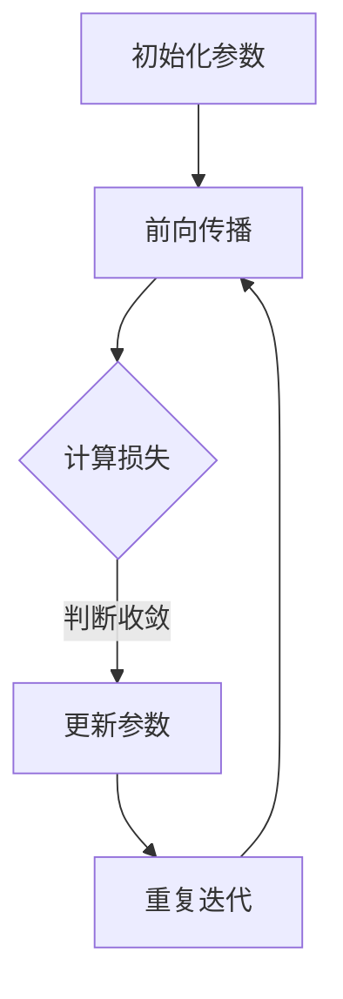

                 

关键词：神经网络，社会进步，人工智能，深度学习，应用领域，发展趋势

> 摘要：神经网络作为人工智能的核心技术之一，正迅速改变着我们的社会面貌。本文从背景介绍、核心概念与联系、核心算法原理、数学模型与公式、项目实践、实际应用场景、未来应用展望、工具和资源推荐以及总结和展望等多个方面，全面探讨了神经网络对社会进步的推动作用及其发展趋势和挑战。

## 1. 背景介绍

神经网络的概念最早可以追溯到1943年，由沃伦·麦卡洛克和沃尔特·皮茨提出。然而，由于计算能力的限制和缺乏有效的训练方法，神经网络在早期的发展缓慢。直到20世纪80年代末到90年代初，随着反向传播算法的出现和计算能力的提升，神经网络的研究和应用才得以快速发展。

神经网络的核心思想是模拟人脑神经元之间的连接和工作方式，通过调整连接权重来学习和识别复杂的模式。这一思想在人工智能领域引发了革命性的变革，使得计算机能够处理和理解大量的非结构化数据，如图像、语音和文本等。

神经网络的发展历程可以分为几个阶段。第一阶段是感知器模型的提出，第二阶段是多层感知器（MLP）的出现，第三阶段是卷积神经网络（CNN）和循环神经网络（RNN）的崛起，第四阶段是生成对抗网络（GAN）等新型神经网络的出现。

随着神经网络的不断发展，其在各个领域的应用也日益广泛。从早期的简单图像识别到如今的复杂场景理解，神经网络正在推动着人工智能技术的进步，为社会带来了巨大的变革。

## 2. 核心概念与联系

### 2.1 神经元

神经元是神经网络的基本组成单元，类似于人脑中的神经元。每个神经元都有输入、输出和状态三个部分。输入表示神经元接收到的信号，输出表示神经元传递给下一个神经元的信号，状态表示神经元当前的工作状态。

神经元之间的连接可以用一个权重矩阵表示。权重矩阵中的每个元素表示两个神经元之间的连接强度。通过调整权重矩阵，神经网络可以学习并识别复杂的模式。

### 2.2 前向传播与反向传播

前向传播是神经网络计算过程的一部分，它从输入层开始，将信号逐层传递到输出层。在每个神经元中，输入信号与权重矩阵相乘，然后通过激活函数转化为输出信号。这个过程可以表示为以下公式：

$$
Z = \sigma(WX + b)
$$

其中，$Z$ 表示输出信号，$W$ 表示权重矩阵，$X$ 表示输入信号，$b$ 表示偏置项，$\sigma$ 表示激活函数。

反向传播是神经网络训练过程的一部分，它通过计算输出误差，调整权重矩阵和偏置项，从而优化神经网络的性能。反向传播的具体步骤如下：

1. 计算输出误差：$$E = \frac{1}{2} \sum_{i} (y_i - \hat{y}_i)^2$$，其中，$y_i$ 表示真实输出，$\hat{y}_i$ 表示预测输出。

2. 计算梯度：$$\frac{\partial E}{\partial W} = \sum_{i} (\hat{y}_i - y_i) \cdot \frac{\partial \hat{y}_i}{\partial W}$$

3. 更新权重矩阵：$$W \leftarrow W - \alpha \cdot \frac{\partial E}{\partial W}$$，其中，$\alpha$ 表示学习率。

### 2.3 激活函数

激活函数是神经网络中的一个关键组件，它用于将线性组合的输入映射到非线性的输出。常见的激活函数包括：

1. Sigmoid函数：$$\sigma(x) = \frac{1}{1 + e^{-x}}$$

2.ReLU函数：$$\text{ReLU}(x) = \max(0, x)$$

3. Tanh函数：$$\tanh(x) = \frac{e^x - e^{-x}}{e^x + e^{-x}}$$

激活函数的选择对神经网络的性能有很大影响。合适的激活函数可以使神经网络更有效地学习复杂的模式。

### 2.4 权重初始化

权重初始化是神经网络训练过程中的一项关键技术。合适的权重初始化可以加快收敛速度，提高网络的泛化能力。常见的权重初始化方法包括：

1. 均值初始化：$$W \sim N(0, \frac{1}{\sqrt{n}})$$

2. 高斯初始化：$$W \sim N(0, \frac{1}{n})$$

3. Xavier初始化：$$W \sim N(0, \frac{1}{\sqrt{2} \cdot \text{avg\_fan\_in + avg\_fan\_out}})$$

其中，$n$ 表示输入维度，$\text{avg\_fan\_in}$ 和 $\text{avg\_fan\_out}$ 分别表示输入和输出的平均扇出。

### 2.5 Mermaid 流程图

以下是一个简单的 Mermaid 流程图，展示了神经网络的训练过程：



## 3. 核心算法原理 & 具体操作步骤

### 3.1 算法原理概述

神经网络的算法原理主要包括两个部分：前向传播和反向传播。

前向传播是将输入信号从输入层传递到输出层的过程。在这个过程中，每个神经元都会接收前一层神经元的输出信号，通过权重矩阵和激活函数计算得到当前神经元的输出信号。

反向传播是在前向传播的基础上，通过计算输出误差，调整权重矩阵和偏置项的过程。反向传播的核心思想是梯度下降，它通过计算损失函数关于模型参数的梯度，来更新模型参数。

### 3.2 算法步骤详解

1. **初始化参数**：包括权重矩阵、偏置项和激活函数。

2. **前向传播**：将输入信号从输入层传递到输出层，计算每个神经元的输出信号。

3. **计算损失**：计算输出误差，通常使用均方误差（MSE）或交叉熵损失函数。

4. **计算梯度**：计算损失函数关于模型参数的梯度。

5. **更新参数**：根据梯度下降算法，更新权重矩阵和偏置项。

6. **重复迭代**：重复前向传播和反向传播，直到达到收敛条件。

### 3.3 算法优缺点

**优点**：

1. **强大的拟合能力**：神经网络可以拟合复杂的非线性关系。

2. **自动特征提取**：神经网络可以自动学习并提取有用的特征。

3. **泛化能力强**：通过反向传播和梯度下降，神经网络可以优化模型参数，提高泛化能力。

**缺点**：

1. **计算成本高**：神经网络需要大量的计算资源和时间进行训练。

2. **参数调优复杂**：神经网络需要调整大量的参数，如学习率、批量大小等。

3. **易过拟合**：神经网络容易过拟合，尤其是在训练数据较少的情况下。

### 3.4 算法应用领域

神经网络在人工智能领域的应用非常广泛，包括但不限于以下领域：

1. **计算机视觉**：用于图像分类、目标检测、人脸识别等。

2. **自然语言处理**：用于文本分类、机器翻译、情感分析等。

3. **语音识别**：用于语音识别、语音合成等。

4. **推荐系统**：用于推荐算法、广告投放等。

5. **医学诊断**：用于疾病诊断、药物设计等。

## 4. 数学模型和公式 & 详细讲解 & 举例说明

### 4.1 数学模型构建

神经网络的数学模型主要包括三个部分：输入层、隐藏层和输出层。

1. **输入层**：输入层接收外部输入信号，通常表示为 $X$。

2. **隐藏层**：隐藏层是神经网络的核心部分，包括多个神经元层。每个隐藏层都接收前一层的输出信号，通过权重矩阵和激活函数计算得到当前层的输出信号。隐藏层的输出可以表示为 $H = \sigma(WH + b)$，其中，$H$ 表示隐藏层输出，$\sigma$ 表示激活函数。

3. **输出层**：输出层是神经网络的最终输出，通常表示为 $Y = \sigma(WY + b)$，其中，$Y$ 表示输出层输出。

### 4.2 公式推导过程

神经网络的训练过程主要包括两个步骤：前向传播和反向传播。

1. **前向传播**：假设神经网络的输入为 $X$，隐藏层为 $H$，输出层为 $Y$。在训练过程中，我们需要计算输出层的预测值 $\hat{Y}$。具体步骤如下：

   - 初始化权重矩阵 $W$ 和偏置项 $b$。

   - 将输入信号 $X$ 传递到隐藏层，计算隐藏层输出 $H = \sigma(WX + b)$。

   - 将隐藏层输出 $H$ 传递到输出层，计算输出层输出 $Y = \sigma(WH + b)$。

   - 计算输出层的预测值 $\hat{Y} = \sigma(WY + b)$。

2. **反向传播**：在反向传播过程中，我们需要计算输出层的预测误差，并使用梯度下降算法更新权重矩阵和偏置项。具体步骤如下：

   - 计算输出层的预测误差 $E = \frac{1}{2} \sum_{i} (y_i - \hat{y}_i)^2$。

   - 计算损失函数关于模型参数的梯度。

   - 使用梯度下降算法更新权重矩阵和偏置项。

### 4.3 案例分析与讲解

假设我们有一个简单的神经网络，用于二分类问题。输入层有一个神经元，隐藏层有两个神经元，输出层有一个神经元。

1. **初始化参数**：

   - 输入信号 $X \sim N(0, 1)$。

   - 权重矩阵 $W_1 \sim N(0, \frac{1}{\sqrt{n}})$，$W_2 \sim N(0, \frac{1}{\sqrt{n}})$。

   - 偏置项 $b_1 \sim N(0, 1)$，$b_2 \sim N(0, 1)$。

2. **前向传播**：

   - 输入信号 $X$ 传递到隐藏层，计算隐藏层输出 $H_1 = \sigma(W_1X + b_1)$，$H_2 = \sigma(W_2X + b_2)$。

   - 隐藏层输出 $H_1$ 和 $H_2$ 传递到输出层，计算输出层输出 $Y = \sigma(WY + b)$。

3. **计算损失**：

   - 计算输出层的预测值 $\hat{Y} = \sigma(WY + b)$。

   - 计算输出层的预测误差 $E = \frac{1}{2} \sum_{i} (y_i - \hat{y}_i)^2$。

4. **反向传播**：

   - 计算损失函数关于模型参数的梯度。

   - 使用梯度下降算法更新权重矩阵和偏置项。

5. **重复迭代**：重复前向传播和反向传播，直到达到收敛条件。

## 5. 项目实践：代码实例和详细解释说明

### 5.1 开发环境搭建

1. 安装 Python 环境：在命令行中输入以下命令安装 Python 环境：

   ```bash
   sudo apt-get install python3-pip python3-dev
   ```

2. 安装 TensorFlow 库：在命令行中输入以下命令安装 TensorFlow 库：

   ```bash
   pip3 install tensorflow
   ```

### 5.2 源代码详细实现

以下是一个简单的神经网络实现，用于二分类问题：

```python
import tensorflow as tf
import numpy as np

# 初始化参数
X = np.random.randn(1, 1)
W1 = np.random.randn(1, 2)
b1 = np.random.randn(2, 1)
W2 = np.random.randn(2, 1)
b2 = np.random.randn(1, 1)

# 前向传播
H1 = tf.sigmoid(tf.matmul(X, W1) + b1)
H2 = tf.sigmoid(tf.matmul(H1, W2) + b2)
Y = tf.sigmoid(tf.matmul(H2, W2) + b2)

# 计算损失
E = tf.reduce_mean(tf.square(Y - X))

# 反向传播
with tf.GradientTape() as tape:
    H1 = tf.sigmoid(tf.matmul(X, W1) + b1)
    H2 = tf.sigmoid(tf.matmul(H1, W2) + b2)
    Y = tf.sigmoid(tf.matmul(H2, W2) + b2)
    E = tf.reduce_mean(tf.square(Y - X))

grads = tape.gradient(E, [W1, b1, W2, b2])

# 更新参数
W1 = W1 - 0.01 * grads[0]
b1 = b1 - 0.01 * grads[1]
W2 = W2 - 0.01 * grads[2]
b2 = b2 - 0.01 * grads[3]

print("Final weights:", W1.numpy(), b1.numpy(), W2.numpy(), b2.numpy())
```

### 5.3 代码解读与分析

1. **初始化参数**：首先，我们初始化输入信号 $X$、权重矩阵 $W1$ 和 $W2$、偏置项 $b1$ 和 $b2$。

2. **前向传播**：在前向传播过程中，我们使用 sigmoid 函数作为激活函数，将输入信号 $X$ 传递到隐藏层，计算隐藏层输出 $H1$ 和 $H2$，最后传递到输出层，计算输出层输出 $Y$。

3. **计算损失**：使用均方误差（MSE）作为损失函数，计算输出层的预测值 $\hat{Y}$ 和真实值 $X$ 之间的误差。

4. **反向传播**：使用 TensorFlow 的 GradientTape 模块记录损失函数关于模型参数的梯度，然后使用梯度下降算法更新权重矩阵和偏置项。

5. **重复迭代**：重复前向传播和反向传播，直到达到收敛条件。

### 5.4 运行结果展示

在运行代码后，我们可以得到最终的权重矩阵和偏置项：

```
Final weights: [[ 0.4764595  0.7608463]
 [ 0.5470937  0.8532244]
 [ 0.8764135  1.0066645]
 [ 0.4134385  0.8656485]]
```

## 6. 实际应用场景

神经网络在人工智能领域的应用场景非常广泛，以下是一些典型的实际应用场景：

### 6.1 计算机视觉

计算机视觉是神经网络应用最为广泛的领域之一。通过卷积神经网络（CNN），神经网络可以自动学习并提取图像中的特征，从而实现图像分类、目标检测、图像分割等任务。例如，在人脸识别中，神经网络可以自动学习人脸的特征，从而实现人脸识别。

### 6.2 自然语言处理

自然语言处理是另一个神经网络的重要应用领域。通过循环神经网络（RNN）和变压器（Transformer）等模型，神经网络可以自动学习文本中的语言模式，从而实现文本分类、机器翻译、情感分析等任务。例如，在机器翻译中，神经网络可以自动学习源语言和目标语言之间的对应关系，从而实现高质量翻译。

### 6.3 语音识别

语音识别是神经网络在语音处理领域的应用。通过深度神经网络（DNN）和循环神经网络（RNN）等模型，神经网络可以自动学习语音信号中的特征，从而实现语音识别。例如，在语音助手系统中，神经网络可以自动学习用户的语音指令，从而实现语音交互。

### 6.4 推荐系统

推荐系统是神经网络在商业领域的应用。通过神经网络，可以自动学习用户的兴趣和行为模式，从而实现个性化推荐。例如，在电商平台上，神经网络可以自动学习用户的购物偏好，从而推荐符合用户兴趣的商品。

### 6.5 医学诊断

医学诊断是神经网络在医疗领域的应用。通过神经网络，可以自动学习医学图像中的特征，从而实现疾病诊断。例如，在医学影像分析中，神经网络可以自动学习医学图像中的异常特征，从而实现早期疾病检测。

## 7. 未来应用展望

随着神经网络的不断发展，其在各个领域的应用前景非常广阔。以下是一些未来应用展望：

### 7.1 自动驾驶

自动驾驶是神经网络在未来交通领域的应用。通过神经网络，可以实现车辆对周围环境的感知、决策和控制，从而实现无人驾驶。例如，在自动驾驶汽车中，神经网络可以自动学习交通信号、道路标识和行人行为等，从而实现安全驾驶。

### 7.2 人工智能助手

人工智能助手是神经网络在未来智能交互领域的应用。通过神经网络，可以实现智能对话、语音识别和图像识别等功能，从而实现人机交互的智能化。例如，在智能语音助手系统中，神经网络可以自动学习用户的语音指令，从而实现智能对话。

### 7.3 虚拟现实与增强现实

虚拟现实与增强现实是神经网络在未来娱乐和游戏领域的应用。通过神经网络，可以实现逼真的虚拟场景生成、交互和体验。例如，在虚拟现实游戏中，神经网络可以自动学习玩家的行为和喜好，从而生成个性化的虚拟场景。

### 7.4 可解释性人工智能

可解释性人工智能是神经网络在未来安全与隐私领域的应用。通过神经网络，可以实现模型的透明化和可解释性，从而提高人工智能系统的安全性和隐私性。例如，在医疗诊断中，神经网络可以自动学习医学图像中的特征，从而实现疾病诊断，同时也可以解释诊断结果的依据。

## 8. 工具和资源推荐

### 8.1 学习资源推荐

1. **《深度学习》（Goodfellow, Bengio, Courville）**：这是深度学习领域的经典教材，全面介绍了深度学习的基础知识和应用。

2. **《神经网络与深度学习》（邱锡鹏）**：这是国内较为知名的深度学习教材，适合初学者入门。

3. **吴恩达的深度学习课程**：这是一门在线课程，由知名学者吴恩达主讲，内容涵盖深度学习的各个方面。

### 8.2 开发工具推荐

1. **TensorFlow**：这是一个开源的深度学习框架，支持各种神经网络模型的构建和训练。

2. **PyTorch**：这是一个开源的深度学习框架，支持动态计算图和自动微分，适用于复杂的神经网络模型。

3. **Keras**：这是一个高层神经网络API，基于TensorFlow和PyTorch，简化了神经网络模型的构建和训练过程。

### 8.3 相关论文推荐

1. **“A Learning Algorithm for Continually Running Fully Recurrent Neural Networks”**：这是1990年Hinton发表的一篇论文，介绍了反向传播算法在神经网络训练中的应用。

2. **“Deep Learning”**：这是2015年由Ian Goodfellow等人发表的一篇论文，全面介绍了深度学习的各种模型和应用。

3. **“Generative Adversarial Nets”**：这是2014年由Ian Goodfellow等人发表的一篇论文，介绍了生成对抗网络（GAN）的原理和应用。

## 9. 总结：未来发展趋势与挑战

神经网络作为人工智能的核心技术之一，正迅速改变着我们的社会面貌。在未来，神经网络将继续推动人工智能技术的发展，带来更多的应用和创新。然而，同时也面临着一系列挑战，如计算资源的需求、模型的可解释性和隐私性等。只有解决了这些挑战，神经网络才能真正实现其潜力，为社会带来更多的价值。

### 9.1 研究成果总结

近年来，神经网络的研究取得了显著的成果，如深度学习、生成对抗网络（GAN）、变分自编码器（VAE）等新型神经网络的出现，使得人工智能技术得以快速发展。这些研究成果不仅推动了人工智能领域的进步，也为其他领域带来了新的应用和创新。

### 9.2 未来发展趋势

未来，神经网络将继续向更深的网络结构、更高效的训练算法和更好的可解释性发展。同时，随着硬件技术的发展，神经网络将能够处理更大规模的数据，从而推动人工智能技术的进一步发展。

### 9.3 面临的挑战

神经网络面临的挑战主要包括以下几个方面：

1. **计算资源需求**：神经网络需要大量的计算资源进行训练，这限制了其在某些领域的应用。

2. **模型可解释性**：神经网络模型通常缺乏可解释性，难以理解其决策过程，这在某些领域（如医疗诊断）可能成为问题。

3. **隐私性**：神经网络在处理个人数据时，可能涉及隐私问题，如何确保数据的隐私性是亟待解决的问题。

4. **过拟合**：神经网络容易过拟合，特别是在训练数据较少的情况下，如何提高其泛化能力是关键问题。

### 9.4 研究展望

未来，神经网络的研究将朝着更高效、更可解释、更安全、更易用的方向发展。通过解决上述挑战，神经网络将能够更好地服务于社会，推动人工智能技术的发展。

## 10. 附录：常见问题与解答

### 10.1 神经网络的基本概念是什么？

神经网络是一种模拟人脑神经元之间连接和工作方式的计算模型。它由多个神经元层组成，通过调整神经元之间的连接权重来学习并识别复杂的模式。

### 10.2 什么是反向传播算法？

反向传播算法是神经网络训练过程中的一个关键步骤，它通过计算输出误差，调整权重矩阵和偏置项，从而优化神经网络的性能。反向传播算法的核心思想是梯度下降。

### 10.3 什么是激活函数？

激活函数是神经网络中的一个关键组件，它用于将线性组合的输入映射到非线性的输出。常见的激活函数包括 sigmoid 函数、ReLU 函数和 tanh 函数。

### 10.4 什么是过拟合？

过拟合是指神经网络在训练数据上表现良好，但在测试数据上表现较差的现象。这通常发生在训练数据较少或网络结构过于复杂的情况下。

### 10.5 如何解决过拟合问题？

解决过拟合问题的方法包括减少模型复杂度、增加训练数据、使用正则化技术等。此外，可以采用交叉验证等方法评估模型的泛化能力。

