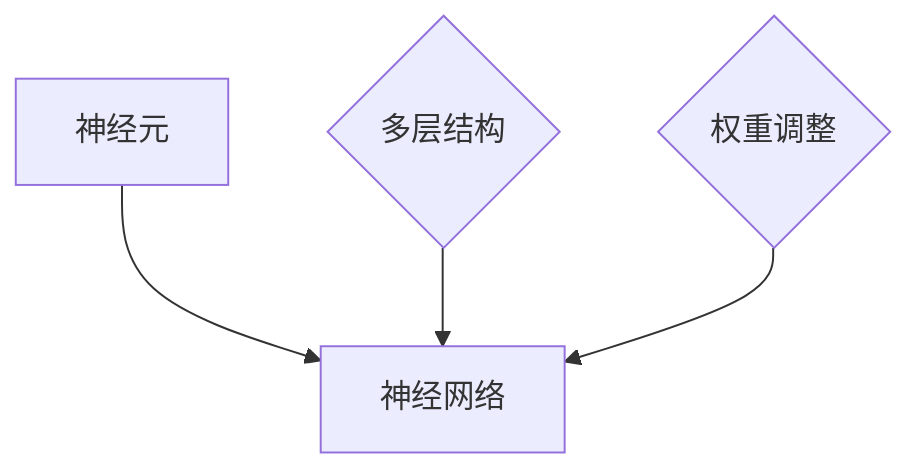
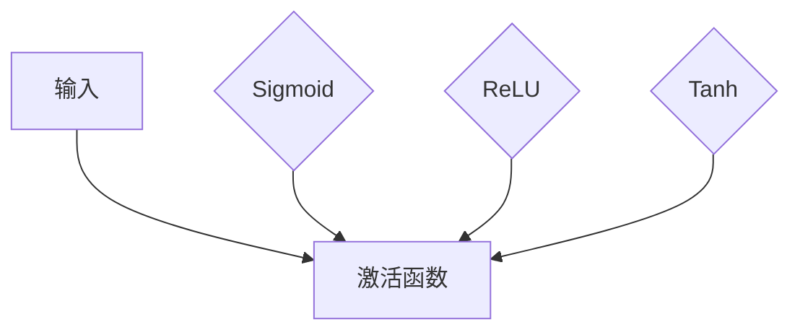
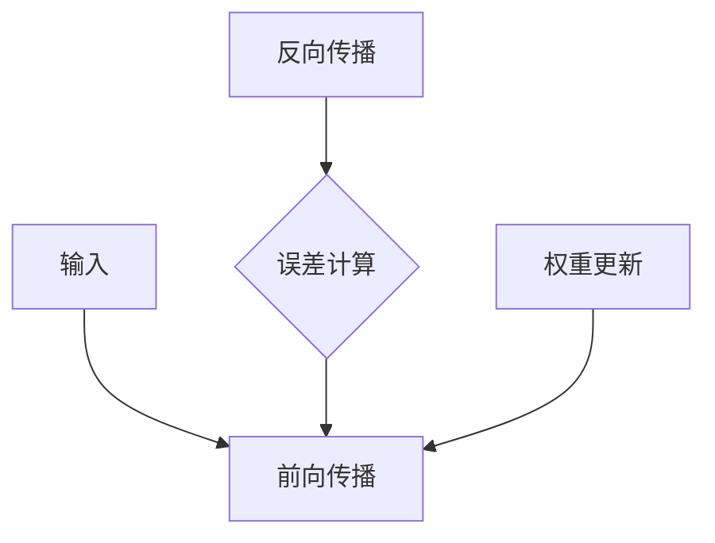

                 

关键词：神经网络、社会进步、技术发展、人工智能

> 摘要：本文将探讨神经网络作为一项技术突破，如何在不同领域中推动社会进步。通过介绍神经网络的核心概念、数学模型、应用实例和未来展望，本文旨在揭示神经网络在科技、医疗、金融等领域的潜力和挑战，以及其对人类生活方式的深远影响。

## 1. 背景介绍

### 神经网络的历史与发展

神经网络（Neural Networks）的概念起源于20世纪40年代，由心理学家McCulloch和数学家Pitts首次提出。他们构建了第一个简单的神经元模型，试图模拟生物大脑的基本功能。此后，随着计算机技术的发展，神经网络逐渐演变为一种重要的机器学习工具。

### 神经网络在社会进步中的作用

神经网络的发展和应用不仅推动了计算机科学的进步，也在多个领域中发挥了重要作用。从早期的模式识别到复杂的自然语言处理，神经网络展示了其在处理复杂数据和任务方面的卓越能力。随着深度学习的崛起，神经网络的应用范围进一步扩大，涉及图像识别、语音识别、自动驾驶等多个领域。

### 神经网络的核心概念

神经网络由大量的神经元（或称为节点）组成，这些神经元通过权重连接形成复杂的网络结构。神经元接收输入信号，通过激活函数进行非线性变换，最终产生输出信号。神经网络通过不断调整权重来优化其性能，以实现对输入数据的准确处理。

## 2. 核心概念与联系

### 神经元与神经网络


**Mermaid 流程图**



### 激活函数

激活函数是神经网络中用于引入非线性特性的关键组件。常见的激活函数包括Sigmoid、ReLU和Tanh等。


**Mermaid 流程图**



### 前向传播与反向传播

神经网络的训练过程主要包括前向传播和反向传播。在前向传播过程中，输入信号从输入层传播到输出层，并在每个神经元上进行计算。反向传播则通过计算输出误差，并反向更新权重，以优化网络性能。


**Mermaid 流程图**



## 3. 核心算法原理 & 具体操作步骤

### 3.1 算法原理概述

神经网络的核心算法是基于多层感知器（MLP）模型，通过前向传播和反向传播不断调整权重，以实现输入到输出的映射。多层感知器模型由输入层、隐藏层和输出层组成，每个层由多个神经元构成。

### 3.2 算法步骤详解

#### 3.2.1 初始化

1. 设定网络结构，包括输入层、隐藏层和输出层的神经元数量。
2. 随机初始化权重和偏置。

#### 3.2.2 前向传播

1. 输入信号从输入层传递到隐藏层，每个神经元进行线性变换，并通过激活函数进行非线性变换。
2. 将隐藏层的输出传递到输出层，进行预测。

#### 3.2.3 反向传播

1. 计算输出层的误差。
2. 通过误差反向传播，更新权重和偏置。

#### 3.2.4 优化

1. 使用优化算法（如梯度下降、Adam等）调整权重和偏置。
2. 重复前向传播和反向传播，直到达到预设的性能指标。

### 3.3 算法优缺点

#### 优点

1. 非线性建模能力：神经网络可以捕捉复杂数据中的非线性关系。
2. 自动特征提取：神经网络可以通过学习自动提取特征，减少人工干预。
3. 广泛应用：神经网络在多个领域（如图像识别、自然语言处理、语音识别等）表现出色。

#### 缺点

1. 过拟合风险：神经网络模型容易过拟合，特别是在训练数据有限的情况下。
2. 计算成本高：深度神经网络训练过程需要大量的计算资源和时间。

### 3.4 算法应用领域

神经网络在多个领域展现出强大的应用潜力：

1. **图像识别**：神经网络可以用于人脸识别、物体识别等任务。
2. **自然语言处理**：神经网络在文本分类、机器翻译、情感分析等领域表现出色。
3. **语音识别**：神经网络可以实现高精度的语音识别和语音合成。
4. **医疗诊断**：神经网络可以帮助医生进行疾病诊断和预测。
5. **金融分析**：神经网络可以用于风险评估、股票预测等金融任务。

## 4. 数学模型和公式 & 详细讲解 & 举例说明

### 4.1 数学模型构建

神经网络的数学模型可以表示为以下形式：

\[ y = \sigma(\omega_1 \cdot x_1 + \omega_2 \cdot x_2 + \cdots + \omega_n \cdot x_n + b) \]

其中，\( y \) 是输出值，\( \sigma \) 是激活函数，\( \omega \) 是权重，\( x \) 是输入值，\( b \) 是偏置。

### 4.2 公式推导过程

神经网络的训练过程主要包括前向传播和反向传播。在前向传播过程中，输入信号从输入层传递到隐藏层和输出层，并在每个神经元上进行计算。在反向传播过程中，通过计算输出误差，并反向更新权重和偏置，以优化网络性能。

### 4.3 案例分析与讲解

假设我们有一个简单的神经网络，用于实现二分类任务。输入层有2个神经元，隐藏层有3个神经元，输出层有1个神经元。激活函数采用ReLU，损失函数采用交叉熵损失。

#### 4.3.1 前向传播

给定输入 \( x_1 = 1 \) 和 \( x_2 = 2 \)，网络的前向传播过程如下：

1. 输入层到隐藏层的计算：
\[ z_1 = \max(0, \omega_{11} \cdot x_1 + \omega_{12} \cdot x_2 + b_1) \]
\[ z_2 = \max(0, \omega_{21} \cdot x_1 + \omega_{22} \cdot x_2 + b_1) \]
\[ z_3 = \max(0, \omega_{31} \cdot x_1 + \omega_{32} \cdot x_2 + b_1) \]

2. 隐藏层到输出层的计算：
\[ y_1 = \max(0, \omega_{11} \cdot z_1 + \omega_{12} \cdot z_2 + \omega_{13} \cdot z_3 + b_2) \]

#### 4.3.2 反向传播

假设输出结果为 \( y = 0 \)，网络的反向传播过程如下：

1. 计算输出误差：
\[ \delta_1 = y - \sigma(\omega_{11} \cdot z_1 + \omega_{12} \cdot z_2 + \omega_{13} \cdot z_3 + b_2) \]

2. 更新权重和偏置：
\[ \Delta \omega_{11} = \eta \cdot \delta_1 \cdot z_1 \]
\[ \Delta \omega_{12} = \eta \cdot \delta_1 \cdot z_2 \]
\[ \Delta \omega_{13} = \eta \cdot \delta_1 \cdot z_3 \]
\[ \Delta b_2 = \eta \cdot \delta_1 \]

## 5. 项目实践：代码实例和详细解释说明

### 5.1 开发环境搭建

1. 安装Python环境。
2. 安装深度学习框架（如TensorFlow或PyTorch）。
3. 准备实验数据集。

### 5.2 源代码详细实现

```python
import tensorflow as tf

# 创建神经网络模型
model = tf.keras.Sequential([
    tf.keras.layers.Dense(units=3, activation='relu', input_shape=(2,)),
    tf.keras.layers.Dense(units=1, activation='sigmoid')
])

# 编译模型
model.compile(optimizer='adam', loss='binary_crossentropy', metrics=['accuracy'])

# 训练模型
model.fit(x_train, y_train, epochs=10, batch_size=32)

# 评估模型
model.evaluate(x_test, y_test)
```

### 5.3 代码解读与分析

1. **创建神经网络模型**：使用 `tf.keras.Sequential` 创建一个顺序模型，并添加多层全连接层（`Dense`）。
2. **编译模型**：配置优化器和损失函数，并编译模型。
3. **训练模型**：使用训练数据集训练模型，设置训练轮次和批量大小。
4. **评估模型**：使用测试数据集评估模型性能。

## 6. 实际应用场景

### 6.1 图像识别

神经网络在图像识别领域取得了巨大成功，如人脸识别、物体检测等。

### 6.2 自然语言处理

神经网络在自然语言处理领域表现出色，如文本分类、机器翻译、情感分析等。

### 6.3 语音识别

神经网络在语音识别领域广泛应用，如语音合成、语音识别等。

### 6.4 医疗诊断

神经网络在医疗诊断领域发挥作用，如疾病预测、影像分析等。

### 6.5 金融分析

神经网络在金融分析领域应用广泛，如风险评估、股票预测等。

## 7. 工具和资源推荐

### 7.1 学习资源推荐

1. **《深度学习》**：Goodfellow, Bengio, Courville著，介绍了深度学习的理论基础和应用实践。
2. **《神经网络与深度学习》**：邱锡鹏著，详细介绍了神经网络和深度学习的基本概念和技术。

### 7.2 开发工具推荐

1. **TensorFlow**：Google开发的深度学习框架，适用于各种规模的深度学习项目。
2. **PyTorch**：Facebook开发的深度学习框架，易于实现和调试。

### 7.3 相关论文推荐

1. **"Deep Learning"**：Goodfellow, Bengio, Courville著，介绍了深度学习的基本概念和技术。
2. **"Neural Networks and Deep Learning"**：Michael Nielsen著，详细介绍了神经网络的原理和应用。

## 8. 总结：未来发展趋势与挑战

### 8.1 研究成果总结

神经网络作为人工智能的核心技术，已经在多个领域取得了显著成果，如图像识别、自然语言处理、语音识别等。深度学习的兴起进一步推动了神经网络的发展和应用。

### 8.2 未来发展趋势

1. **神经网络结构优化**：研究更加高效、可解释性更好的神经网络结构。
2. **多模态融合**：结合多种数据类型（如图像、文本、语音等），实现更全面的信息处理。
3. **增强现实与虚拟现实**：神经网络在增强现实和虚拟现实中的应用前景广阔。

### 8.3 面临的挑战

1. **计算资源消耗**：深度学习模型训练需要大量计算资源和时间，如何优化计算效率成为关键问题。
2. **过拟合问题**：如何设计更加鲁棒的网络结构，避免过拟合问题。

### 8.4 研究展望

神经网络作为推动社会进步的重要力量，在未来将继续发挥重要作用。通过不断优化算法和结构，神经网络将在更多领域中取得突破，为人类社会带来更多便利和效益。

## 9. 附录：常见问题与解答

### 9.1 神经网络是什么？

神经网络是一种模拟生物大脑结构的计算模型，由大量的神经元组成，通过前向传播和反向传播实现数据的处理和优化。

### 9.2 深度学习与神经网络的区别是什么？

深度学习是一种基于神经网络的机器学习技术，通过多层次的神经网络结构实现数据的自动特征提取和模型优化。

### 9.3 神经网络在哪些领域有应用？

神经网络在图像识别、自然语言处理、语音识别、医疗诊断、金融分析等多个领域有广泛应用。

### 9.4 如何优化神经网络模型？

优化神经网络模型可以通过调整网络结构、选择合适的激活函数、优化训练算法等方式实现。同时，合理的预处理和后处理也是提高模型性能的关键。

## 作者署名

作者：禅与计算机程序设计艺术 / Zen and the Art of Computer Programming

---

以上是本文的完整内容，感谢您的阅读。如果您有任何问题或建议，请随时联系。希望本文对您在神经网络领域的学习和研究有所帮助。

