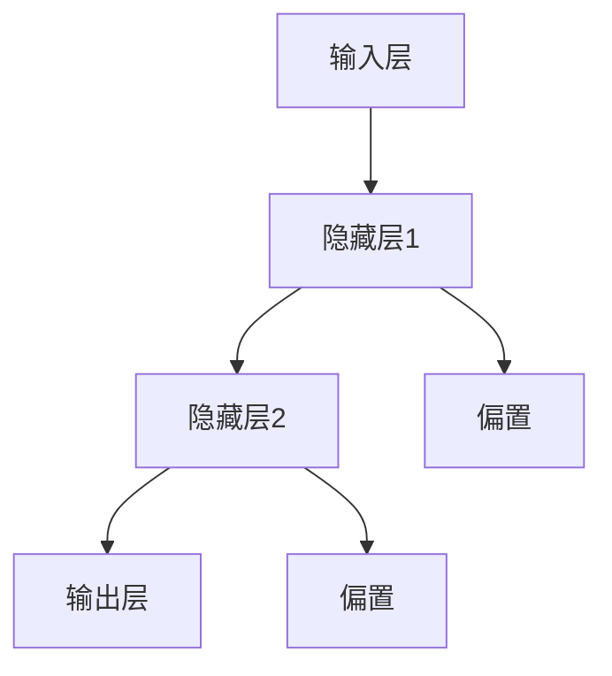

                 

关键词：神经网络，机器学习，深度学习，人工神经网络，反向传播算法，BP算法，AI技术

> 摘要：本文将深入探讨神经网络在机器学习领域的核心作用，解释其基本概念、工作原理以及实际应用。通过详细的算法解析、数学模型推导、实例代码实现，本文旨在为读者提供一个全面且易懂的神经网络指南。

## 1. 背景介绍

### 1.1 神经网络的历史背景

神经网络（Neural Networks）起源于20世纪40年代，最初是由心理学家和数学家提出的模拟人脑神经元之间连接的数学模型。1943年，McCulloch和Pitts提出了首个简化的神经元模型，称为MCP模型，为后来的神经网络研究奠定了基础。1958年，Frank Rosenblatt提出了感知机（Perceptron）模型，这标志着神经网络研究的一个重要里程碑。

然而，由于早期计算能力的限制，神经网络的研究一度陷入低潮。直到20世纪80年代，随着计算机硬件的发展以及反向传播算法（Backpropagation Algorithm）的提出，神经网络研究开始焕发新生。

### 1.2 机器学习与神经网络的关系

机器学习（Machine Learning）是人工智能（Artificial Intelligence, AI）的一个重要分支，旨在通过数据和算法，让计算机从数据中学习和提取规律，进而做出决策。神经网络作为机器学习的一种强大工具，通过模拟人脑的工作机制，实现了对复杂数据的处理和分析。

### 1.3 神经网络在现代科技中的应用

随着深度学习（Deep Learning）的兴起，神经网络在现代科技中得到了广泛应用。从图像识别、语音识别、自然语言处理，到自动驾驶、医疗诊断、金融分析等领域，神经网络都展现了其强大的能力和潜力。

## 2. 核心概念与联系

神经网络由大量简单的处理单元（神经元）组成，通过复杂的网络结构进行信息传递和处理。以下是一个简化的神经网络架构图，用于说明神经网络的基本概念和联系。



### 2.1 输入层（Input Layer）

输入层接收外部信息，并将其传递给隐藏层。每个输入值通常与一个特征相关联。

### 2.2 隐藏层（Hidden Layers）

隐藏层位于输入层和输出层之间，负责对输入信息进行加工和处理。神经网络的多层结构使得它可以处理更加复杂的问题。

### 2.3 输出层（Output Layer）

输出层产生最终结果，可以是分类标签、预测值或其他形式的输出。

### 2.4 偏置（Bias）

偏置是一个独立的变量，用于调整神经元的输出，使其能够更好地适应不同的数据集。

## 3. 核心算法原理 & 具体操作步骤

### 3.1 算法原理概述

神经网络的核心算法是反向传播算法（Backpropagation Algorithm），它通过不断调整网络中的权重和偏置，使网络的输出尽可能接近期望值。反向传播算法包括两个主要步骤：前向传播和反向传播。

### 3.2 算法步骤详解

#### 3.2.1 前向传播（Forward Propagation）

1. 初始化网络权重和偏置。
2. 将输入数据传递给输入层。
3. 通过隐藏层进行信息传递和计算。
4. 将输出层的结果与期望值进行比较。

#### 3.2.2 反向传播（Back Propagation）

1. 计算输出误差。
2. 从输出层开始，逐层反向传播误差。
3. 更新网络中的权重和偏置。

### 3.3 算法优缺点

#### 3.3.1 优点

- **强大的表达能力**：神经网络能够处理各种复杂的问题，如图像识别、语音识别等。
- **自适应能力**：神经网络可以通过学习来自动调整权重和偏置，以适应不同的数据集。

#### 3.3.2 缺点

- **训练时间较长**：特别是对于深层网络，训练时间可能会非常长。
- **过拟合问题**：神经网络可能会在训练数据上表现得非常好，但在新的数据上表现不佳。

### 3.4 算法应用领域

神经网络在多个领域都有广泛应用，包括但不限于：

- **计算机视觉**：图像识别、目标检测等。
- **自然语言处理**：机器翻译、情感分析等。
- **语音识别**：语音识别、语音合成等。
- **推荐系统**：基于用户行为和偏好进行个性化推荐。
- **医疗诊断**：疾病预测、诊断辅助等。

## 4. 数学模型和公式 & 详细讲解 & 举例说明

### 4.1 数学模型构建

神经网络的数学模型主要涉及以下几个核心概念：

- **激活函数**：用于将输入映射到输出。
- **权重和偏置**：用于调整神经元之间的连接强度。
- **梯度下降**：用于优化网络参数。

### 4.2 公式推导过程

神经网络的输出可以通过以下公式计算：

$$
Z = \sigma(W \cdot X + b)
$$

其中，$Z$ 表示输出，$X$ 表示输入，$W$ 表示权重，$b$ 表示偏置，$\sigma$ 表示激活函数。

### 4.3 案例分析与讲解

以一个简单的二分类问题为例，说明如何使用神经网络进行预测。

#### 4.3.1 数据准备

我们准备一组包含两个特征的数据集，每个数据点属于正类或负类。

#### 4.3.2 模型构建

构建一个简单的神经网络，包含一个输入层、一个隐藏层和一个输出层。输入层有2个神经元，隐藏层有3个神经元，输出层有1个神经元。

#### 4.3.3 训练过程

通过反向传播算法，不断更新权重和偏置，使网络输出接近期望值。

## 5. 项目实践：代码实例和详细解释说明

### 5.1 开发环境搭建

确保安装了Python环境以及TensorFlow或PyTorch等深度学习框架。

### 5.2 源代码详细实现

以下是一个简单的神经网络实现的示例代码：

```python
import tensorflow as tf

# 创建模型
model = tf.keras.Sequential([
    tf.keras.layers.Dense(3, activation='relu', input_shape=(2,)),
    tf.keras.layers.Dense(1, activation='sigmoid')
])

# 编译模型
model.compile(optimizer='adam', loss='binary_crossentropy', metrics=['accuracy'])

# 训练模型
model.fit(x_train, y_train, epochs=10, batch_size=32)
```

### 5.3 代码解读与分析

这段代码首先导入了TensorFlow库，然后定义了一个简单的神经网络模型。模型包含一个输入层、一个隐藏层和一个输出层。编译模型时，指定了优化器和损失函数。最后，使用训练数据对模型进行训练。

### 5.4 运行结果展示

运行上述代码后，可以看到训练过程中的损失函数和准确率的变化。在训练完成后，可以使用测试数据集评估模型的性能。

## 6. 实际应用场景

神经网络在实际应用场景中具有广泛的应用，以下是一些典型应用：

- **图像识别**：用于识别和分类图像，如人脸识别、物体检测等。
- **语音识别**：将语音信号转换为文本，如智能助手、实时翻译等。
- **自然语言处理**：用于处理和理解自然语言，如文本分类、情感分析等。
- **推荐系统**：基于用户行为和偏好进行个性化推荐，如电商推荐、内容推送等。

### 6.4 未来应用展望

随着深度学习技术的不断发展，神经网络在未来将会在更多领域得到应用。例如，医疗诊断、智能交通、金融分析等。同时，神经网络也在不断进化，如生成对抗网络（GAN）、变分自编码器（VAE）等新型神经网络结构不断涌现。

## 7. 工具和资源推荐

### 7.1 学习资源推荐

- 《深度学习》（Goodfellow, Bengio, Courville著）
- 《神经网络与深度学习》（邱锡鹏著）
- Coursera上的《Deep Learning Specialization》课程

### 7.2 开发工具推荐

- TensorFlow
- PyTorch
- Keras

### 7.3 相关论文推荐

- “Backpropagation Learning: An Introduction to Gradient Descent Algorithms for Machine Learning” by David E. Rumelhart, George E. Hinton, and Ronald J. Williams
- “A Learning Algorithm for Continually Running Fully Recurrent Neural Networks” by John E. Hopfield

## 8. 总结：未来发展趋势与挑战

### 8.1 研究成果总结

神经网络作为机器学习的重要工具，已经取得了显著的研究成果，并在多个领域得到了广泛应用。

### 8.2 未来发展趋势

未来，神经网络将继续朝着更深、更广、更智能的方向发展。新型神经网络结构、优化算法、应用场景的不断涌现，将推动神经网络技术的进一步发展。

### 8.3 面临的挑战

- **计算资源消耗**：神经网络模型通常需要大量的计算资源，这对硬件性能提出了更高的要求。
- **数据隐私问题**：在处理敏感数据时，如何确保数据隐私和安全仍然是一个重要挑战。

### 8.4 研究展望

随着人工智能技术的不断发展，神经网络将在更多领域得到应用，如自动化决策系统、智能控制系统等。同时，神经网络的理论研究也将继续深入，探索更高效的算法和更优的网络结构。

## 9. 附录：常见问题与解答

### 9.1 什么是神经网络？

神经网络是一种模拟人脑神经元之间连接的数学模型，用于处理和分析复杂数据。

### 9.2 神经网络的核心算法是什么？

神经网络的核心算法是反向传播算法（Backpropagation Algorithm），它通过不断调整网络中的权重和偏置，使网络的输出尽可能接近期望值。

### 9.3 神经网络在哪些领域有应用？

神经网络在计算机视觉、自然语言处理、语音识别、推荐系统、医疗诊断等多个领域都有广泛应用。

### 9.4 如何优化神经网络模型？

优化神经网络模型可以通过调整学习率、增加训练数据、使用正则化技术等多种方法进行。此外，选择合适的神经网络结构也是优化模型的重要一环。


作者：禅与计算机程序设计艺术 / Zen and the Art of Computer Programming

