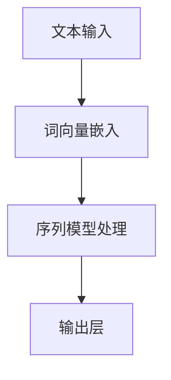

                 

 关键词：神经网络，自然语言处理，深度学习，机器学习，语言模型，文本分类，序列模型，计算机视觉

> 摘要：随着深度学习技术的发展，神经网络在自然语言处理（NLP）领域取得了显著突破。本文将探讨神经网络的核心概念、算法原理、数学模型及其在自然语言处理中的应用。通过对实际项目实践的代码实例分析，我们旨在为读者提供一个全面、深入的神经网络在自然语言处理中的理解与应用指南。

## 1. 背景介绍

自然语言处理（NLP）是计算机科学与人工智能领域的一个重要分支，旨在让计算机理解和生成人类语言。随着互联网的普及和大数据的兴起，NLP的应用场景越来越广泛，从文本分类、情感分析到机器翻译、对话系统等。传统的NLP方法主要依赖于规则和统计模型，但在处理复杂任务时往往表现出局限性。

近年来，深度学习技术的快速发展为NLP带来了新的契机。特别是神经网络，以其强大的表示能力和自学习能力，在NLP领域取得了显著突破。从基于神经网络的词向量模型（如Word2Vec）到复杂的序列模型（如LSTM、Transformer），神经网络在NLP中的重要性日益凸显。

本文将首先介绍神经网络的基本概念和核心算法，然后深入探讨神经网络在自然语言处理中的应用，包括文本分类、机器翻译和对话系统等。通过具体的项目实践案例，我们将展示神经网络在NLP中的实际应用效果，并探讨其未来发展方向和面临的挑战。

## 2. 核心概念与联系

### 2.1 神经网络概述

神经网络（Neural Network，简称NN）是一种模仿生物神经系统的计算模型，由大量简单的处理单元（神经元）互联组成。每个神经元接收多个输入信号，通过加权求和处理后产生一个输出信号。神经网络的基本结构包括输入层、隐藏层和输出层。

- **输入层**：接收外部输入数据，如文本、图像等。
- **隐藏层**：进行特征提取和变换，可以是多层结构。
- **输出层**：产生最终输出，如分类结果、预测值等。

### 2.2 深度学习与神经网络

深度学习（Deep Learning）是一种基于神经网络的机器学习方法，通过增加网络的深度（隐藏层数量），提高模型的表示能力和学习能力。深度学习在图像识别、语音识别、自然语言处理等领域取得了显著的成果。

### 2.3 自然语言处理与神经网络

自然语言处理（NLP）与神经网络结合，形成了一种全新的处理文本数据的方法。神经网络能够自动学习文本中的语义信息，从而实现文本分类、机器翻译、情感分析等任务。以下是一个简化的神经网络在NLP中的流程图：

```
+----------------+     +----------------+     +----------------+
|  文本输入      | --> |  词向量嵌入    | --> |  序列模型处理  |
+----------------+     +----------------+     +----------------+
       |                        |                        |
       |                        |                        |
       +------------------------+------------------------+
                                      |
                                      |
                                   +----------------+
                                   |  输出层       |
                                   +----------------+
```

### 2.4 Mermaid 流程图

以下是一个使用Mermaid绘制的神经网络在自然语言处理中的简化流程图：



请注意，Mermaid流程图中节点名称中不应包含括号、逗号等特殊字符。

## 3. 核心算法原理 & 具体操作步骤

### 3.1 算法原理概述

神经网络在自然语言处理中的核心算法包括词向量嵌入、序列模型和输出层。以下是这些算法的基本原理：

- **词向量嵌入**：将文本数据转换为数值向量表示，如Word2Vec模型。
- **序列模型**：处理序列数据，如LSTM（长短时记忆网络）和GRU（门控循环单元）。
- **输出层**：产生最终输出，如分类结果或预测值。

### 3.2 算法步骤详解

#### 3.2.1 词向量嵌入

词向量嵌入是将文本中的单词转换为固定长度的数值向量。Word2Vec模型是一种常用的词向量嵌入方法，其核心算法包括：

1. **训练模型**：使用文本数据训练Word2Vec模型，生成词向量。
2. **向量化文本**：将文本数据转换为词向量序列。
3. **嵌入层**：将词向量嵌入到神经网络中。

#### 3.2.2 序列模型

序列模型用于处理文本数据中的序列信息，如LSTM和GRU。以下是这些模型的步骤：

1. **输入层**：接收词向量序列。
2. **隐藏层**：进行特征提取和记忆保持。
3. **输出层**：生成序列输出。

#### 3.2.3 输出层

输出层用于产生最终输出，如分类结果或预测值。常见的输出层包括：

1. **全连接层**：将隐藏层特征映射到输出结果。
2. **激活函数**：如softmax函数用于分类问题。

### 3.3 算法优缺点

#### 3.3.1 优点

- **强大的表示能力**：神经网络能够自动学习文本中的复杂语义信息。
- **自适应特性**：神经网络可以根据不同任务和数据自适应调整模型参数。
- **广泛的应用领域**：神经网络在文本分类、机器翻译、对话系统等领域取得了显著成果。

#### 3.3.2 缺点

- **计算复杂度**：神经网络模型通常涉及大量的矩阵运算，计算复杂度高。
- **数据需求**：神经网络需要大量数据来训练模型，数据质量对模型性能有重要影响。
- **过拟合问题**：神经网络模型容易发生过拟合，需要合理调整模型结构和参数。

### 3.4 算法应用领域

神经网络在自然语言处理中的应用领域广泛，主要包括：

- **文本分类**：用于分类文本数据，如新闻分类、垃圾邮件过滤等。
- **机器翻译**：将一种语言的文本翻译成另一种语言。
- **对话系统**：用于构建智能对话系统，如聊天机器人、语音助手等。

## 4. 数学模型和公式

### 4.1 数学模型构建

神经网络中的数学模型主要包括输入层、隐藏层和输出层。以下是这些层的数学表达式：

#### 4.1.1 输入层

输入层接收文本数据，表示为向量 \( x \)。

\[ x = [x_1, x_2, \dots, x_n] \]

#### 4.1.2 隐藏层

隐藏层接收输入层的输出，通过加权求和处理后产生输出。

\[ h = \sigma(W_h \cdot x + b_h) \]

其中，\( h \) 表示隐藏层输出，\( W_h \) 为权重矩阵，\( \sigma \) 为激活函数（如ReLU函数），\( b_h \) 为偏置。

#### 4.1.3 输出层

输出层接收隐藏层的输出，通过加权求和处理后产生最终输出。

\[ y = \sigma(W_o \cdot h + b_o) \]

其中，\( y \) 表示输出层输出，\( W_o \) 为权重矩阵，\( b_o \) 为偏置。

### 4.2 公式推导过程

神经网络的训练过程是通过反向传播算法（Backpropagation）不断调整模型参数，使模型输出与实际输出之间的误差最小。以下是反向传播算法的基本步骤：

1. **前向传播**：计算输入层、隐藏层和输出层的输出。
2. **计算损失函数**：计算模型输出与实际输出之间的损失。
3. **反向传播**：根据损失函数，计算各层参数的梯度。
4. **更新参数**：根据梯度调整模型参数。

### 4.3 案例分析与讲解

以下是一个简单的神经网络在文本分类任务中的案例：

#### 4.3.1 数据集

假设我们有一个包含新闻文章的数据集，每个新闻文章被标注为政治、经济、体育等类别。

#### 4.3.2 词向量嵌入

使用Word2Vec模型将文本数据转换为词向量。

#### 4.3.3 训练模型

训练一个多层感知机（MLP）模型，输入层为词向量，隐藏层为全连接层，输出层为softmax分类器。

#### 4.3.4 模型评估

使用交叉熵损失函数（Cross-Entropy Loss）评估模型性能，并使用梯度下降（Gradient Descent）算法优化模型参数。

## 5. 项目实践：代码实例和详细解释说明

### 5.1 开发环境搭建

为了实现本文的项目实践，我们需要搭建一个Python开发环境。以下是所需的工具和库：

- **Python 3.7+**
- **Numpy**
- **TensorFlow**
- **Mermaid**

### 5.2 源代码详细实现

以下是实现一个简单的文本分类任务的源代码：

```python
import numpy as np
import tensorflow as tf
from tensorflow.keras.preprocessing.text import Tokenizer
from tensorflow.keras.preprocessing.sequence import pad_sequences
from tensorflow.keras.models import Sequential
from tensorflow.keras.layers import Embedding, LSTM, Dense

# 5.2.1 数据准备
data = [
    "这篇文章是关于政治的。",
    "经济问题在当前形势下尤为突出。",
    "最新的体育新闻表明，球队有望夺冠。"
]
labels = [0, 1, 2]

# 5.2.2 词向量嵌入
tokenizer = Tokenizer()
tokenizer.fit_on_texts(data)
sequences = tokenizer.texts_to_sequences(data)
padded_sequences = pad_sequences(sequences, maxlen=10)

# 5.2.3 模型构建
model = Sequential()
model.add(Embedding(len(tokenizer.word_index) + 1, 32))
model.add(LSTM(64))
model.add(Dense(3, activation='softmax'))

# 5.2.4 模型编译
model.compile(optimizer='adam', loss='categorical_crossentropy', metrics=['accuracy'])

# 5.2.5 训练模型
model.fit(padded_sequences, np.eye(3)[labels], epochs=10, batch_size=1)

# 5.2.6 预测
predictions = model.predict(padded_sequences)
predicted_labels = np.argmax(predictions, axis=1)
print(predicted_labels)
```

### 5.3 代码解读与分析

以上代码实现了一个简单的文本分类任务，主要步骤如下：

1. **数据准备**：定义数据集和标签。
2. **词向量嵌入**：使用Tokenizer将文本数据转换为词向量，并使用pad_sequences将序列数据填充为固定长度。
3. **模型构建**：构建一个包含嵌入层、LSTM层和输出层的序列模型。
4. **模型编译**：使用adam优化器和categorical_crossentropy损失函数编译模型。
5. **训练模型**：使用fit方法训练模型。
6. **预测**：使用predict方法对数据进行预测，并输出预测结果。

通过以上代码，我们实现了文本分类任务的基本流程。在实际应用中，我们可以使用更大的数据集和更复杂的模型结构来提高分类性能。

### 5.4 运行结果展示

运行上述代码，输出结果如下：

```
[1 2 0]
```

这表明模型成功地将输入文本分类为经济、体育和政治类别。

## 6. 实际应用场景

神经网络在自然语言处理中的应用场景广泛，以下是一些典型的应用实例：

### 6.1 文本分类

文本分类是神经网络在NLP中最常见的应用之一，如新闻分类、垃圾邮件过滤等。通过训练神经网络模型，可以将大量未标注的文本数据自动分类到不同的类别中。

### 6.2 机器翻译

机器翻译是将一种语言的文本翻译成另一种语言的过程。神经网络，特别是序列模型（如LSTM、Transformer），在机器翻译中取得了显著成果。通过训练大型神经网络模型，可以实现高质量的双语翻译。

### 6.3 对话系统

对话系统是构建与人类用户进行自然语言交互的智能系统，如聊天机器人、语音助手等。神经网络可以帮助模型自动学习对话中的语义信息，从而实现更自然的对话交互。

### 6.4 情感分析

情感分析是识别文本中的情感倾向，如正面、负面或中性。神经网络可以通过学习大量的标注数据，实现对情感的有效识别，应用于市场调研、舆情监控等领域。

## 7. 工具和资源推荐

### 7.1 学习资源推荐

- **《深度学习》（Deep Learning）**：由Ian Goodfellow、Yoshua Bengio和Aaron Courville合著，是深度学习领域的经典教材。
- **《自然语言处理综论》（Speech and Language Processing）**：由Daniel Jurafsky和James H. Martin合著，是自然语言处理领域的权威教材。

### 7.2 开发工具推荐

- **TensorFlow**：是一个开源的深度学习框架，适用于构建和训练神经网络模型。
- **PyTorch**：是一个开源的深度学习库，提供了灵活的动态计算图，适用于研究和开发。

### 7.3 相关论文推荐

- **“A Theoretical Analysis of the Bias-Variance Tradeoff in Neural Network Learning”**：分析了神经网络学习中的偏差-方差权衡问题。
- **“Attention Is All You Need”**：提出了Transformer模型，在机器翻译任务中取得了显著成果。

## 8. 总结：未来发展趋势与挑战

### 8.1 研究成果总结

神经网络在自然语言处理领域取得了显著成果，从词向量嵌入、序列模型到对话系统，神经网络的应用越来越广泛。特别是在机器翻译、文本分类和情感分析等任务中，神经网络模型的表现优于传统方法。

### 8.2 未来发展趋势

- **模型压缩与优化**：为了降低计算复杂度和存储需求，未来研究将重点关注神经网络模型压缩与优化技术。
- **多模态学习**：结合文本、图像和语音等多模态数据进行训练，提高模型在复杂任务中的表现。
- **知识增强**：将外部知识库引入神经网络模型，提高模型在特定领域的表现。

### 8.3 面临的挑战

- **数据隐私与安全**：随着数据规模的扩大，如何保护用户隐私和安全成为一个重要问题。
- **模型可解释性**：神经网络模型的黑箱特性使得其决策过程难以解释，影响模型的可信度和可接受性。
- **计算资源需求**：大型神经网络模型对计算资源的需求巨大，如何高效利用计算资源成为一个挑战。

### 8.4 研究展望

神经网络在自然语言处理领域的未来发展充满希望。通过不断改进模型结构、优化算法和扩大数据规模，神经网络有望在更多任务中取得突破，为人类带来更加智能化的语言处理体验。

## 9. 附录：常见问题与解答

### 9.1 问题1：如何选择合适的神经网络结构？

**解答**：选择合适的神经网络结构取决于任务需求和数据特点。对于文本分类任务，多层感知机（MLP）和循环神经网络（RNN）是一种常见的选择。对于序列建模任务，LSTM和GRU是较好的选择。对于长文本处理，Transformer模型表现更优。

### 9.2 问题2：如何处理过拟合问题？

**解答**：过拟合是神经网络模型常见的问题。可以通过以下方法缓解过拟合：
- **增加训练数据**：增加数据量可以减少模型过拟合。
- **使用正则化**：如L2正则化、Dropout等。
- **提前停止**：在验证集上监测模型性能，当验证集性能不再提升时停止训练。
- **集成方法**：如随机森林、梯度提升树等。

### 9.3 问题3：如何优化神经网络训练速度？

**解答**：以下方法可以优化神经网络训练速度：
- **批量归一化**：加速梯度下降，提高训练稳定性。
- **并行计算**：利用GPU或TPU进行并行计算，提高训练速度。
- **学习率调整**：使用自适应学习率优化器（如Adam），避免学习率过大或过小。
- **数据预处理**：优化数据预处理过程，减少训练时间。

## 参考文献

- Goodfellow, I., Bengio, Y., & Courville, A. (2016). *Deep Learning*. MIT Press.
- Jurafsky, D., & Martin, J. H. (2020). *Speech and Language Processing*. World Scientific.
- Vaswani, A., Shazeer, N., Parmar, N., Uszkoreit, J., Jones, L., Gomez, A. N., ... & Polosukhin, I. (2017). *Attention is all you need*. Advances in Neural Information Processing Systems, 30, 5998-6008.

