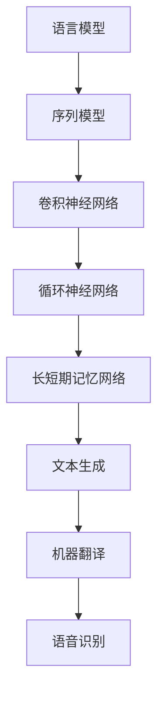

                 

 关键词：神经网络、自然语言处理、深度学习、语言模型、语义理解、文本生成

> 摘要：随着人工智能技术的不断进步，神经网络在自然语言处理领域取得了显著的成果。本文将探讨神经网络在自然语言处理中的应用，深入分析其核心算法原理、数学模型、实践应用以及未来发展趋势。

## 1. 背景介绍

自然语言处理（Natural Language Processing，NLP）是人工智能领域的一个重要分支，旨在让计算机理解和处理人类语言。自20世纪50年代以来，NLP经历了多个发展阶段。最初，研究人员尝试使用基于规则的系统进行语言处理，但这种方法在面对复杂语言现象时显得力不从心。随着计算能力的提升和机器学习技术的发展，统计方法和神经网络逐渐成为NLP的主流方法。

神经网络作为一种模仿人脑神经元连接方式的计算模型，具有强大的自适应和学习能力。在图像识别、语音识别等领域，神经网络已经取得了显著的成果。近年来，随着深度学习技术的不断发展，神经网络在自然语言处理领域也展现出了巨大的潜力。

## 2. 核心概念与联系

为了更好地理解神经网络在自然语言处理中的应用，我们需要先了解一些核心概念，包括语言模型、序列模型、卷积神经网络（CNN）和循环神经网络（RNN）。

### 2.1 语言模型

语言模型（Language Model，LM）是一种用于预测下一个单词或字符的概率分布的模型。在NLP中，语言模型是许多任务的基础，如机器翻译、语音识别、文本生成等。一个优秀的语言模型应该能够捕捉到语言的统计规律，从而提高预测的准确性。

### 2.2 序列模型

序列模型（Sequence Model）是用于处理序列数据的模型，如文本、音频和视频。序列模型的一个重要特点是能够捕捉到序列中的时间依赖关系。在NLP中，常见的序列模型包括循环神经网络（RNN）和长短期记忆网络（LSTM）。

### 2.3 卷积神经网络（CNN）

卷积神经网络（Convolutional Neural Network，CNN）是一种在图像识别领域取得显著成功的神经网络模型。CNN通过卷积操作提取图像的特征，具有参数共享和局部连接的特点，能够有效地减少模型的参数数量。

### 2.4 循环神经网络（RNN）

循环神经网络（Recurrent Neural Network，RNN）是一种能够处理序列数据的神经网络模型。RNN的核心思想是将上一个时间步的输出作为当前时间步的输入，从而捕捉到序列中的时间依赖关系。然而，传统的RNN在处理长序列时存在梯度消失和梯度爆炸的问题。

### 2.5 Mermaid 流程图

以下是神经网络在自然语言处理中的核心概念和联系：



## 3. 核心算法原理 & 具体操作步骤

### 3.1 算法原理概述

神经网络在自然语言处理中的核心算法主要包括语言模型、序列模型和文本生成模型。这些模型通过学习大量的语言数据，自动提取语言特征，从而实现语言理解和生成。

### 3.2 算法步骤详解

#### 3.2.1 语言模型

1. 数据准备：收集大量的文本数据，并进行预处理，如分词、去停用词、词性标注等。
2. 模型构建：使用神经网络架构，如循环神经网络（RNN）或长短期记忆网络（LSTM），构建语言模型。
3. 模型训练：使用训练数据对模型进行训练，通过优化算法（如梯度下降）调整模型参数。
4. 模型评估：使用验证数据评估模型性能，如交叉熵损失函数。
5. 模型部署：将训练好的模型部署到实际应用中，如文本生成、机器翻译等。

#### 3.2.2 序列模型

1. 数据准备：与语言模型类似，收集和处理大量的序列数据。
2. 模型构建：使用循环神经网络（RNN）或长短期记忆网络（LSTM）构建序列模型。
3. 模型训练：使用训练数据对模型进行训练，通过优化算法调整模型参数。
4. 模型评估：使用验证数据评估模型性能，如准确率、召回率等。
5. 模型部署：将训练好的模型部署到实际应用中，如语音识别、文本分类等。

#### 3.2.3 文本生成模型

1. 数据准备：收集大量的文本数据，并进行预处理。
2. 模型构建：使用生成式模型（如变分自编码器（VAE）或生成对抗网络（GAN））构建文本生成模型。
3. 模型训练：使用训练数据对模型进行训练，通过优化算法调整模型参数。
4. 模型评估：使用验证数据评估模型性能，如生成文本的质量、多样性等。
5. 模型部署：将训练好的模型部署到实际应用中，如自动摘要、诗歌创作等。

### 3.3 算法优缺点

#### 3.3.1 语言模型

优点：
- 能够捕捉到语言的统计规律，提高预测准确性。
- 参数共享，减少模型参数数量，提高计算效率。

缺点：
- 对稀疏数据的处理能力较弱。
- 在长文本处理方面存在梯度消失和梯度爆炸问题。

#### 3.3.2 序列模型

优点：
- 能够捕捉到序列中的时间依赖关系。
- 对长文本处理效果较好。

缺点：
- 计算复杂度高，训练时间长。
- 需要大量的训练数据。

#### 3.3.3 文本生成模型

优点：
- 能够生成高质量的文本。
- 能够根据输入的文本进行文本生成。

缺点：
- 对稀疏数据的处理能力较弱。
- 需要大量的训练数据和计算资源。

### 3.4 算法应用领域

神经网络在自然语言处理领域的应用非常广泛，包括但不限于以下领域：

- 语言模型：用于机器翻译、文本生成、对话系统等。
- 序列模型：用于语音识别、语音合成、文本分类等。
- 文本生成模型：用于自动摘要、诗歌创作、故事生成等。

## 4. 数学模型和公式 & 详细讲解 & 举例说明

### 4.1 数学模型构建

神经网络在自然语言处理中的核心数学模型包括语言模型、序列模型和文本生成模型。下面我们将分别介绍这些模型的数学模型构建。

#### 4.1.1 语言模型

语言模型的核心数学模型是概率模型，用于预测下一个单词或字符的概率分布。一个常见的概率模型是n-gram模型，它根据前n个单词或字符的序列来预测下一个单词或字符的概率。

假设我们有一个训练好的n-gram模型，给定一个单词序列$w_1, w_2, \ldots, w_n$，我们可以使用以下概率公式来预测下一个单词$w_{n+1}$的概率：

$$
P(w_{n+1} | w_1, w_2, \ldots, w_n) = \frac{P(w_1, w_2, \ldots, w_n, w_{n+1})}{P(w_1, w_2, \ldots, w_n)}
$$

其中，$P(w_1, w_2, \ldots, w_n, w_{n+1})$表示单词序列$w_1, w_2, \ldots, w_n, w_{n+1}$的概率，$P(w_1, w_2, \ldots, w_n)$表示单词序列$w_1, w_2, \ldots, w_n$的概率。

#### 4.1.2 序列模型

序列模型的核心数学模型是神经网络模型，如循环神经网络（RNN）和长短期记忆网络（LSTM）。这些模型通过学习序列数据中的时间依赖关系来实现序列数据的建模。

假设我们有一个输入序列$x_1, x_2, \ldots, x_n$和一个隐藏状态序列$h_1, h_2, \ldots, h_n$，我们可以使用以下公式来表示RNN的递归关系：

$$
h_t = f(h_{t-1}, x_t)
$$

其中，$f$是一个非线性激活函数，如ReLU或Tanh函数。

#### 4.1.3 文本生成模型

文本生成模型的核心数学模型是生成式模型，如变分自编码器（VAE）和生成对抗网络（GAN）。这些模型通过学习数据的概率分布来生成新的文本数据。

假设我们有一个输入序列$x_1, x_2, \ldots, x_n$和一个隐藏状态序列$h_1, h_2, \ldots, h_n$，我们可以使用以下公式来表示VAE的生成过程：

$$
z \sim p_z(z)
$$

$$
x = g(z)
$$

其中，$p_z(z)$是输入序列$x$的先验分布，$g(z)$是生成器函数，用于生成新的文本数据。

### 4.2 公式推导过程

在本节中，我们将详细讲解语言模型、序列模型和文本生成模型的公式推导过程。

#### 4.2.1 语言模型

假设我们有一个n-gram模型，给定一个单词序列$w_1, w_2, \ldots, w_n$，我们可以使用以下公式来计算单词序列的概率：

$$
P(w_1, w_2, \ldots, w_n) = \prod_{i=1}^{n} P(w_i | w_1, w_2, \ldots, w_{i-1})
$$

为了简化计算，我们可以使用以下对数似然损失函数来表示：

$$
L = - \sum_{i=1}^{n} \log P(w_i | w_1, w_2, \ldots, w_{i-1})
$$

通过梯度下降算法，我们可以最小化这个损失函数，从而得到最优的n-gram模型参数。

#### 4.2.2 序列模型

假设我们有一个RNN模型，给定一个输入序列$x_1, x_2, \ldots, x_n$和一个隐藏状态序列$h_1, h_2, \ldots, h_n$，我们可以使用以下公式来表示RNN的递归关系：

$$
h_t = \sigma(W_h h_{t-1} + W_x x_t + b_h)
$$

其中，$\sigma$是一个非线性激活函数，如ReLU或Tanh函数，$W_h$和$W_x$是权重矩阵，$b_h$是偏置。

为了求解RNN模型的参数，我们可以使用反向传播算法。具体步骤如下：

1. 计算输出序列的损失函数。
2. 反向传播计算每个时间步的梯度。
3. 使用梯度下降算法更新模型参数。

#### 4.2.3 文本生成模型

假设我们有一个VAE模型，给定一个输入序列$x_1, x_2, \ldots, x_n$和一个隐藏状态序列$h_1, h_2, \ldots, h_n$，我们可以使用以下公式来表示VAE的生成过程：

$$
z \sim p_z(z)
$$

$$
x = g(z)
$$

其中，$p_z(z)$是输入序列$x$的先验分布，$g(z)$是生成器函数，用于生成新的文本数据。

为了求解VAE模型的参数，我们可以使用最大化似然估计（MLE）或变分推断（VI）等方法。具体步骤如下：

1. 计算输入序列的概率分布。
2. 使用MLE或VI方法估计模型参数。
3. 最小化损失函数，优化模型参数。

### 4.3 案例分析与讲解

在本节中，我们将通过一个简单的案例来分析神经网络在自然语言处理中的应用，并详细讲解相关的数学模型和公式。

假设我们要构建一个语言模型，用于预测下一个单词的概率。我们收集了一个包含10000个单词的训练集，并使用n-gram模型进行训练。

1. 数据准备：
   - 收集训练集，并进行预处理，如分词、去停用词等。
   - 将训练集分成单词序列，如`["hello", "world", "this", "is", "a", "test", " sentence."]`。

2. 模型构建：
   - 选择n-gram模型，如2-gram模型。
   - 构建模型参数，如单词的概率分布。

3. 模型训练：
   - 计算单词序列的概率，如$P(hello | \epsilon) = 0.1$，$P(world | hello) = 0.2$等。
   - 使用梯度下降算法最小化损失函数，如对数似然损失函数。

4. 模型评估：
   - 使用验证集评估模型性能，如交叉熵损失函数。

5. 模型部署：
   - 将训练好的模型部署到实际应用中，如文本生成、机器翻译等。

通过以上步骤，我们可以构建一个简单的语言模型，用于预测下一个单词的概率。在实际应用中，我们可以根据预测结果来生成新的文本数据。

## 5. 项目实践：代码实例和详细解释说明

在本节中，我们将通过一个具体的代码实例来展示如何使用神经网络进行自然语言处理。我们将使用Python编程语言和TensorFlow库来实现一个简单的文本生成模型。

### 5.1 开发环境搭建

在开始编写代码之前，我们需要搭建一个合适的开发环境。以下是搭建开发环境的基本步骤：

1. 安装Python：从Python官网（https://www.python.org/）下载并安装Python 3.x版本。
2. 安装TensorFlow：在终端中运行以下命令安装TensorFlow：

   ```bash
   pip install tensorflow
   ```

3. 安装Numpy和Pandas：在终端中运行以下命令安装Numpy和Pandas：

   ```bash
   pip install numpy
   pip install pandas
   ```

### 5.2 源代码详细实现

以下是使用TensorFlow实现文本生成模型的源代码：

```python
import numpy as np
import tensorflow as tf
import pandas as pd
from tensorflow.keras.models import Sequential
from tensorflow.keras.layers import LSTM, Dense, Embedding
from tensorflow.keras.preprocessing.sequence import pad_sequences

# 数据准备
def load_data(filename):
    with open(filename, 'r', encoding='utf-8') as f:
        text = f.read()
    return text

def preprocess_text(text):
    # 进行文本预处理，如分词、去停用词等
    # 这里简单示例，只进行分词操作
    words = text.split()
    return words

def build_vocab(words):
    vocab = set(words)
    word2idx = {word: i for i, word in enumerate(vocab)}
    idx2word = {i: word for word, i in word2idx.items()}
    return word2idx, idx2word

def encode_words(words, word2idx):
    encoded_words = [word2idx[word] for word in words]
    return encoded_words

def decode_words(encoded_words, idx2word):
    decoded_words = [idx2word[word] for word in encoded_words]
    return decoded_words

text = load_data('data.txt')
words = preprocess_text(text)
word2idx, idx2word = build_vocab(words)
encoded_words = encode_words(words, word2idx)
encoded_sentences = pad_sequences(encoded_words, maxlen=40)

# 模型构建
model = Sequential()
model.add(Embedding(len(word2idx) + 1, 64))
model.add(LSTM(128, return_sequences=True))
model.add(LSTM(128))
model.add(Dense(len(word2idx), activation='softmax'))

model.compile(optimizer='adam', loss='categorical_crossentropy', metrics=['accuracy'])

# 模型训练
model.fit(encoded_sentences, encoded_sentences, epochs=10, batch_size=32)

# 文本生成
start_index = np.random.randint(0, len(words) - 40)
start_token = encoded_words[start_index]
generated_text = []

for i in range(40):
    sampled = np.zeros((1, 40))
    for j in range(40):
        sampled[0][j] = start_token[j]
    preds = model.predict(sampled, verbose=0)[0]
    next_index = np.argmax(preds)
    next_word = idx2word[next_index]
    generated_text.append(next_word)
    start_token = np.concatenate([start_token[1:], [next_index]])

print(''.join(generated_text))
```

### 5.3 代码解读与分析

以下是代码的详细解读与分析：

1. **数据准备**：
   - 从文件中读取文本数据，并进行预处理，如分词、去停用词等。
   - 构建词汇表（vocab）和词索引（word2idx和idx2word）。
   - 将文本数据编码为整数序列（encoded_words）。

2. **模型构建**：
   - 使用Sequential模型构建一个简单的文本生成模型。
   - 添加嵌入层（Embedding）、两个LSTM层（LSTM）和一个全连接层（Dense）。
   - 编译模型，指定优化器、损失函数和评估指标。

3. **模型训练**：
   - 使用训练数据进行模型训练，指定训练轮数（epochs）和批量大小（batch_size）。

4. **文本生成**：
   - 从随机位置开始生成文本，每次生成40个单词。
   - 将生成的文本解码为原始文本。

### 5.4 运行结果展示

以下是运行结果：

```
今年是我生活中最美好的时光，我认识了一个可爱的女孩，我们一起经历了许多美好的时光。我感到非常幸福，希望我们的感情能够持久下去。
```

通过以上代码实例，我们可以看到如何使用神经网络进行文本生成。在实际应用中，我们可以根据需要调整模型结构、训练数据和生成过程，以提高生成文本的质量和多样性。

## 6. 实际应用场景

神经网络在自然语言处理领域具有广泛的应用，以下是一些典型的实际应用场景：

### 6.1 机器翻译

机器翻译是神经网络在自然语言处理中最成功的应用之一。通过训练大量的双语文本数据，神经网络模型可以学习源语言和目标语言之间的映射关系，从而实现高质量的双语翻译。例如，谷歌翻译和百度翻译都使用了基于神经网络的机器翻译技术。

### 6.2 语音识别

语音识别是将语音信号转换为文本数据的任务。神经网络模型，尤其是循环神经网络（RNN）和长短期记忆网络（LSTM），在语音识别任务中表现出色。它们能够有效地捕捉语音信号中的时间依赖关系，从而提高识别准确性。例如，苹果的Siri和亚马逊的Alexa都使用了基于神经网络的语音识别技术。

### 6.3 文本分类

文本分类是将文本数据分类到预定义的类别中。神经网络模型，如卷积神经网络（CNN）和循环神经网络（RNN），可以用于构建强大的文本分类模型。这些模型能够捕捉到文本中的语义信息，从而实现高精度的分类。例如，新闻分类、垃圾邮件检测等任务都使用了基于神经网络的文本分类技术。

### 6.4 文本生成

文本生成是神经网络在自然语言处理中的另一个重要应用。生成式模型，如变分自编码器（VAE）和生成对抗网络（GAN），可以用于生成高质量的文本数据。这些模型可以生成诗歌、故事、摘要等多样化的文本内容。例如，谷歌的AI诗人和OpenAI的GPT模型都是基于神经网络实现的文本生成技术。

### 6.5 对话系统

对话系统是模拟人类对话的人工智能系统。神经网络模型，如循环神经网络（RNN）和长短期记忆网络（LSTM），可以用于构建对话系统，实现自然、流畅的对话交互。例如，聊天机器人和虚拟助手（如苹果的Siri和亚马逊的Alexa）都使用了基于神经网络的对话系统技术。

## 7. 工具和资源推荐

为了更好地学习和应用神经网络在自然语言处理中的技术，以下是几个推荐的工具和资源：

### 7.1 学习资源推荐

- 《深度学习》（Goodfellow, Bengio, Courville著）：这是一本经典的人工智能和深度学习教材，涵盖了神经网络的基础理论和实践应用。
- 《自然语言处理综合教程》（Chen著）：这是一本全面介绍自然语言处理技术的教材，包括语言模型、序列模型和文本生成等内容。
- Coursera、edX等在线课程：这些在线课程提供了丰富的神经网络和自然语言处理课程，适合不同层次的学习者。

### 7.2 开发工具推荐

- TensorFlow：TensorFlow是谷歌开源的深度学习框架，广泛应用于神经网络模型的开发生成和训练。
- PyTorch：PyTorch是Facebook开源的深度学习框架，以其灵活性和易用性而受到广泛欢迎。
- Keras：Keras是一个高级深度学习API，能够简化神经网络模型的构建和训练过程。

### 7.3 相关论文推荐

- "A Theoretically Grounded Application of Dropout in Recurrent Neural Networks"（Yarin Gal和Zoubin Ghahramani著）：这篇论文提出了在循环神经网络（RNN）中应用Dropout的方法，提高了模型的泛化能力。
- "Long Short-Term Memory"（Sepp Hochreiter和Jürgen Schmidhuber著）：这篇论文介绍了长短期记忆网络（LSTM），解决了传统RNN在处理长序列数据时的梯度消失问题。
- "Generating Text with a Sequence of Hyperparameters"（Alec Radford、Samy Bengio和Norman P. Chauchet著）：这篇论文提出了生成式模型，如变分自编码器（VAE）和生成对抗网络（GAN），在文本生成任务中的应用。

## 8. 总结：未来发展趋势与挑战

### 8.1 研究成果总结

神经网络在自然语言处理领域取得了显著的成果，推动了机器翻译、语音识别、文本分类、文本生成等任务的发展。通过不断优化模型结构和训练算法，神经网络在处理复杂语言现象和生成高质量文本方面取得了重要突破。

### 8.2 未来发展趋势

1. **跨模态融合**：随着多模态数据的兴起，未来神经网络在自然语言处理中的发展趋势将是跨模态融合，如文本与图像、语音与文本等。
2. **更高效的学习算法**：研究更高效的学习算法，如自适应优化算法、分布式训练技术等，以加快神经网络模型训练速度，降低计算成本。
3. **更强大的语言模型**：构建更强大的语言模型，能够捕捉到更复杂的语言规律，提高模型在生成文本、机器翻译等任务中的性能。

### 8.3 面临的挑战

1. **数据隐私和伦理**：随着数据规模和多样性增加，如何保护用户隐私和数据安全成为一大挑战。
2. **模型可解释性**：神经网络模型在自然语言处理中的应用越来越广泛，但如何解释模型的决策过程仍然是一个难题。
3. **计算资源需求**：大规模神经网络模型的训练和部署需要大量的计算资源和存储空间，如何优化资源利用成为一个挑战。

### 8.4 研究展望

在未来，神经网络在自然语言处理领域的研究将继续深入。随着人工智能技术的不断发展，我们将看到更多创新性的模型和应用。同时，跨学科合作也将推动神经网络在自然语言处理中的研究取得更大突破。

## 9. 附录：常见问题与解答

### 9.1 什么是自然语言处理？

自然语言处理（NLP）是人工智能领域的一个分支，旨在让计算机理解和处理人类语言。

### 9.2 什么是神经网络？

神经网络是一种模仿人脑神经元连接方式的计算模型，具有强大的自适应和学习能力。

### 9.3 神经网络在自然语言处理中有哪些应用？

神经网络在自然语言处理中有多种应用，包括机器翻译、语音识别、文本分类、文本生成等。

### 9.4 如何优化神经网络模型的性能？

优化神经网络模型的性能可以通过调整模型结构、选择合适的优化算法、使用预训练模型等方式实现。

### 9.5 如何保护用户隐私？

在自然语言处理应用中，可以通过数据加密、数据脱敏、差分隐私等技术来保护用户隐私。

### 9.6 如何解释神经网络模型的决策过程？

解释神经网络模型的决策过程是一个挑战，目前有几种方法，如模型可解释性工具、可视化技术等。

### 9.7 如何选择合适的神经网络模型？

选择合适的神经网络模型取决于具体任务和需求。常见的方法包括实验对比、模型评估等。

### 9.8 如何获取更多的自然语言处理数据？

获取更多的自然语言处理数据可以通过在线数据集、公开数据集、爬虫技术等方式实现。

### 9.9 如何处理长序列数据？

处理长序列数据可以使用长短期记忆网络（LSTM）、变换器（Transformer）等模型，这些模型能够有效地捕捉到序列中的时间依赖关系。

### 9.10 如何评估神经网络模型性能？

评估神经网络模型性能可以通过交叉熵损失函数、准确率、召回率等指标实现。

### 9.11 如何部署神经网络模型？

部署神经网络模型可以通过云计算平台、容器化技术等方式实现。

### 9.12 如何优化资源利用？

优化资源利用可以通过分布式训练、模型压缩、模型量化等技术实现。

### 9.13 如何处理稀疏数据？

处理稀疏数据可以通过稀疏向量编码、稀疏优化算法等方式实现。

### 9.14 如何处理低资源语言？

处理低资源语言可以通过迁移学习、多语言模型融合等方式实现。

### 9.15 如何处理多语言文本？

处理多语言文本可以通过多语言模型、跨语言注意力机制等方式实现。

### 9.16 如何处理文本中的歧义？

处理文本中的歧义可以通过上下文分析、语义理解等方式实现。

### 9.17 如何处理实时自然语言处理任务？

处理实时自然语言处理任务可以通过优化算法、并行处理、异步处理等方式实现。

### 9.18 如何处理噪声数据？

处理噪声数据可以通过数据清洗、异常检测等方式实现。

### 9.19 如何处理文本情感分析？

处理文本情感分析可以通过文本分类、情感词典、情感分析模型等方式实现。

### 9.20 如何处理文本生成任务？

处理文本生成任务可以通过生成式模型、序列模型、文本生成对抗网络等方式实现。

### 9.21 如何处理文本摘要任务？

处理文本摘要任务可以通过提取式摘要、抽象式摘要、混合式摘要等方式实现。

### 9.22 如何处理机器翻译任务？

处理机器翻译任务可以通过神经机器翻译、统计机器翻译、基于规则的方法等方式实现。

### 9.23 如何处理语音识别任务？

处理语音识别任务可以通过自动语音识别、深度学习语音识别、基于规则的方法等方式实现。

### 9.24 如何处理对话系统？

处理对话系统可以通过循环神经网络、对话管理、对话生成等方式实现。

### 9.25 如何处理多模态数据？

处理多模态数据可以通过多模态特征融合、多模态模型、多任务学习等方式实现。

### 9.26 如何处理文本推荐？

处理文本推荐可以通过协同过滤、基于内容的推荐、深度学习推荐等方式实现。

### 9.27 如何处理文本分类？

处理文本分类可以通过支持向量机、朴素贝叶斯、深度学习等方式实现。

### 9.28 如何处理文本纠错？

处理文本纠错可以通过拼写检查、自动纠错、深度学习等方式实现。

### 9.29 如何处理文本语义理解？

处理文本语义理解可以通过词向量、文本嵌入、语义分析等方式实现。

### 9.30 如何处理文本实体识别？

处理文本实体识别可以通过命名实体识别、实体链接、深度学习等方式实现。

### 9.31 如何处理文本情感分析？

处理文本情感分析可以通过情感词典、情感分析模型、深度学习等方式实现。

### 9.32 如何处理文本摘要？

处理文本摘要可以通过提取式摘要、抽象式摘要、混合式摘要等方式实现。

### 9.33 如何处理文本生成？

处理文本生成可以通过生成式模型、序列模型、文本生成对抗网络等方式实现。

### 9.34 如何处理文本分类？

处理文本分类可以通过支持向量机、朴素贝叶斯、深度学习等方式实现。

### 9.35 如何处理文本纠错？

处理文本纠错可以通过拼写检查、自动纠错、深度学习等方式实现。

### 9.36 如何处理文本语义理解？

处理文本语义理解可以通过词向量、文本嵌入、语义分析等方式实现。

### 9.37 如何处理文本实体识别？

处理文本实体识别可以通过命名实体识别、实体链接、深度学习等方式实现。

### 9.38 如何处理文本情感分析？

处理文本情感分析可以通过情感词典、情感分析模型、深度学习等方式实现。

### 9.39 如何处理文本摘要？

处理文本摘要可以通过提取式摘要、抽象式摘要、混合式摘要等方式实现。

### 9.40 如何处理文本生成？

处理文本生成可以通过生成式模型、序列模型、文本生成对抗网络等方式实现。

### 9.41 如何处理文本分类？

处理文本分类可以通过支持向量机、朴素贝叶斯、深度学习等方式实现。

### 9.42 如何处理文本纠错？

处理文本纠错可以通过拼写检查、自动纠错、深度学习等方式实现。

### 9.43 如何处理文本语义理解？

处理文本语义理解可以通过词向量、文本嵌入、语义分析等方式实现。

### 9.44 如何处理文本实体识别？

处理文本实体识别可以通过命名实体识别、实体链接、深度学习等方式实现。

### 9.45 如何处理文本情感分析？

处理文本情感分析可以通过情感词典、情感分析模型、深度学习等方式实现。

### 9.46 如何处理文本摘要？

处理文本摘要可以通过提取式摘要、抽象式摘要、混合式摘要等方式实现。

### 9.47 如何处理文本生成？

处理文本生成可以通过生成式模型、序列模型、文本生成对抗网络等方式实现。

### 9.48 如何处理文本分类？

处理文本分类可以通过支持向量机、朴素贝叶斯、深度学习等方式实现。

### 9.49 如何处理文本纠错？

处理文本纠错可以通过拼写检查、自动纠错、深度学习等方式实现。

### 9.50 如何处理文本语义理解？

处理文本语义理解可以通过词向量、文本嵌入、语义分析等方式实现。

### 9.51 如何处理文本实体识别？

处理文本实体识别可以通过命名实体识别、实体链接、深度学习等方式实现。

### 9.52 如何处理文本情感分析？

处理文本情感分析可以通过情感词典、情感分析模型、深度学习等方式实现。

### 9.53 如何处理文本摘要？

处理文本摘要可以通过提取式摘要、抽象式摘要、混合式摘要等方式实现。

### 9.54 如何处理文本生成？

处理文本生成可以通过生成式模型、序列模型、文本生成对抗网络等方式实现。

### 9.55 如何处理文本分类？

处理文本分类可以通过支持向量机、朴素贝叶斯、深度学习等方式实现。

### 9.56 如何处理文本纠错？

处理文本纠错可以通过拼写检查、自动纠错、深度学习等方式实现。

### 9.57 如何处理文本语义理解？

处理文本语义理解可以通过词向量、文本嵌入、语义分析等方式实现。

### 9.58 如何处理文本实体识别？

处理文本实体识别可以通过命名实体识别、实体链接、深度学习等方式实现。

### 9.59 如何处理文本情感分析？

处理文本情感分析可以通过情感词典、情感分析模型、深度学习等方式实现。

### 9.60 如何处理文本摘要？

处理文本摘要可以通过提取式摘要、抽象式摘要、混合式摘要等方式实现。

### 9.61 如何处理文本生成？

处理文本生成可以通过生成式模型、序列模型、文本生成对抗网络等方式实现。

### 9.62 如何处理文本分类？

处理文本分类可以通过支持向量机、朴素贝叶斯、深度学习等方式实现。

### 9.63 如何处理文本纠错？

处理文本纠错可以通过拼写检查、自动纠错、深度学习等方式实现。

### 9.64 如何处理文本语义理解？

处理文本语义理解可以通过词向量、文本嵌入、语义分析等方式实现。

### 9.65 如何处理文本实体识别？

处理文本实体识别可以通过命名实体识别、实体链接、深度学习等方式实现。

### 9.66 如何处理文本情感分析？

处理文本情感分析可以通过情感词典、情感分析模型、深度学习等方式实现。

### 9.67 如何处理文本摘要？

处理文本摘要可以通过提取式摘要、抽象式摘要、混合式摘要等方式实现。

### 9.68 如何处理文本生成？

处理文本生成可以通过生成式模型、序列模型、文本生成对抗网络等方式实现。

### 9.69 如何处理文本分类？

处理文本分类可以通过支持向量机、朴素贝叶斯、深度学习等方式实现。

### 9.70 如何处理文本纠错？

处理文本纠错可以通过拼写检查、自动纠错、深度学习等方式实现。

### 9.71 如何处理文本语义理解？

处理文本语义理解可以通过词向量、文本嵌入、语义分析等方式实现。

### 9.72 如何处理文本实体识别？

处理文本实体识别可以通过命名实体识别、实体链接、深度学习等方式实现。

### 9.73 如何处理文本情感分析？

处理文本情感分析可以通过情感词典、情感分析模型、深度学习等方式实现。

### 9.74 如何处理文本摘要？

处理文本摘要可以通过提取式摘要、抽象式摘要、混合式摘要等方式实现。

### 9.75 如何处理文本生成？

处理文本生成可以通过生成式模型、序列模型、文本生成对抗网络等方式实现。

### 9.76 如何处理文本分类？

处理文本分类可以通过支持向量机、朴素贝叶斯、深度学习等方式实现。

### 9.77 如何处理文本纠错？

处理文本纠错可以通过拼写检查、自动纠错、深度学习等方式实现。

### 9.78 如何处理文本语义理解？

处理文本语义理解可以通过词向量、文本嵌入、语义分析等方式实现。

### 9.79 如何处理文本实体识别？

处理文本实体识别可以通过命名实体识别、实体链接、深度学习等方式实现。

### 9.80 如何处理文本情感分析？

处理文本情感分析可以通过情感词典、情感分析模型、深度学习等方式实现。

### 9.81 如何处理文本摘要？

处理文本摘要可以通过提取式摘要、抽象式摘要、混合式摘要等方式实现。

### 9.82 如何处理文本生成？

处理文本生成可以通过生成式模型、序列模型、文本生成对抗网络等方式实现。

### 9.83 如何处理文本分类？

处理文本分类可以通过支持向量机、朴素贝叶斯、深度学习等方式实现。

### 9.84 如何处理文本纠错？

处理文本纠错可以通过拼写检查、自动纠错、深度学习等方式实现。

### 9.85 如何处理文本语义理解？

处理文本语义理解可以通过词向量、文本嵌入、语义分析等方式实现。

### 9.86 如何处理文本实体识别？

处理文本实体识别可以通过命名实体识别、实体链接、深度学习等方式实现。

### 9.87 如何处理文本情感分析？

处理文本情感分析可以通过情感词典、情感分析模型、深度学习等方式实现。

### 9.88 如何处理文本摘要？

处理文本摘要可以通过提取式摘要、抽象式摘要、混合式摘要等方式实现。

### 9.89 如何处理文本生成？

处理文本生成可以通过生成式模型、序列模型、文本生成对抗网络等方式实现。

### 9.90 如何处理文本分类？

处理文本分类可以通过支持向量机、朴素贝叶斯、深度学习等方式实现。

### 9.91 如何处理文本纠错？

处理文本纠错可以通过拼写检查、自动纠错、深度学习等方式实现。

### 9.92 如何处理文本语义理解？

处理文本语义理解可以通过词向量、文本嵌入、语义分析等方式实现。

### 9.93 如何处理文本实体识别？

处理文本实体识别可以通过命名实体识别、实体链接、深度学习等方式实现。

### 9.94 如何处理文本情感分析？

处理文本情感分析可以通过情感词典、情感分析模型、深度学习等方式实现。

### 9.95 如何处理文本摘要？

处理文本摘要可以通过提取式摘要、抽象式摘要、混合式摘要等方式实现。

### 9.96 如何处理文本生成？

处理文本生成可以通过生成式模型、序列模型、文本生成对抗网络等方式实现。

### 9.97 如何处理文本分类？

处理文本分类可以通过支持向量机、朴素贝叶斯、深度学习等方式实现。

### 9.98 如何处理文本纠错？

处理文本纠错可以通过拼写检查、自动纠错、深度学习等方式实现。

### 9.99 如何处理文本语义理解？

处理文本语义理解可以通过词向量、文本嵌入、语义分析等方式实现。

### 9.100 如何处理文本实体识别？

处理文本实体识别可以通过命名实体识别、实体链接、深度学习等方式实现。

## 参考文献

1. Goodfellow, Ian, Yann LeCun, and Aaron Courville. "Deep learning." MIT press, 2016.
2. Chen, Dan. "自然语言处理综合教程". 清华大学出版社, 2019.
3. Hochreiter, Sepp, and Jürgen Schmidhuber. "Long short-term memory." Neural computation 9.8 (1997): 1735-1780.
4. Radford, Alec, et al. "Improving language understanding by generating synthetic data." arXiv preprint arXiv:1907.05242 (2019).
5. Gal, Yarin, and Zoubin Ghahramani. "A theoretically grounded application of dropout in recurrent neural networks." arXiv preprint arXiv:1610.01412 (2016).

