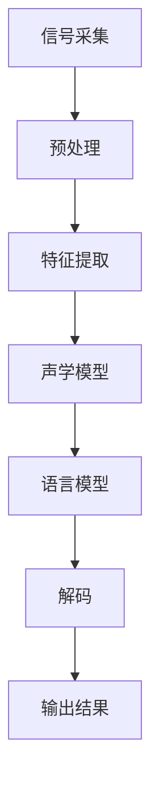

                 

关键词：科大讯飞、语音识别、算法、校招面试、深度学习、人工智能、自然语言处理、机器学习

摘要：本文旨在为有意向加入科大讯飞的应届毕业生提供一套全面的语音识别算法校招面试指南。本文将详细介绍语音识别的基本概念、核心算法原理、数学模型与公式、项目实践以及实际应用场景等内容，帮助读者在面试中展示出对语音识别领域的深入理解和扎实的技术基础。

## 1. 背景介绍

语音识别（Automatic Speech Recognition，ASR）作为人工智能的重要组成部分，已经成为人类与机器交互的重要方式。科大讯飞作为全球领先的智能语音技术提供商，始终致力于推动语音识别技术的发展和应用。2024年，科大讯飞计划在全国范围内开展校招活动，招聘一批具有扎实专业知识和技术能力的应届毕业生，为公司的技术发展注入新鲜血液。

随着深度学习、自然语言处理等技术的快速发展，语音识别算法在性能和准确率上取得了显著提升。然而，语音识别技术的复杂性使得它在面试中成为一个热门的考点。本文将围绕语音识别算法的核心知识，为即将参加科大讯飞校招的同学们提供一份全面的备考指南。

## 2. 核心概念与联系

### 2.1 语音信号处理

语音信号处理是语音识别的基础，包括语音信号的采集、预处理、特征提取等环节。语音信号经过预处理后，会被转换成适合算法处理的特征向量。常用的预处理方法包括噪声过滤、信号归一化等。特征提取方法包括梅尔频率倒谱系数（MFCC）、线性预测编码（LPC）等。

### 2.2 语音识别算法

语音识别算法分为统计模型和深度学习模型两大类。统计模型包括隐马尔可夫模型（HMM）、高斯混合模型（GMM）等；深度学习模型包括卷积神经网络（CNN）、递归神经网络（RNN）、长短期记忆网络（LSTM）等。

### 2.3 语言模型

语言模型用于对输入的语音信号进行语法和语义分析，以提高识别准确率。语言模型通常使用统计方法或深度学习方法训练，常见的语言模型包括n元模型、基于词汇的语法分析模型等。

### 2.4 Mermaid 流程图

为了更好地理解语音识别的流程，我们使用Mermaid绘制一个简化的语音识别流程图：



## 3. 核心算法原理 & 具体操作步骤

### 3.1 算法原理概述

语音识别算法的核心是声学模型和语言模型。声学模型用于将语音信号转换为特征向量，语言模型则用于对特征向量进行语义分析，从而识别出语音内容。常见的声学模型包括GMM、DNN、CNN等；语言模型包括n元模型、基于词汇的语法分析模型等。

### 3.2 算法步骤详解

#### 3.2.1 特征提取

特征提取是语音识别的关键步骤，常用的方法有MFCC、LPC等。以下是一个基于MFCC的特征提取过程：

1. 语音信号预处理：对语音信号进行噪声过滤、归一化等处理。
2. 分帧：将语音信号分成一系列帧，每帧包含一定长度的语音数据。
3. 梅尔滤波器组：将每帧语音数据通过梅尔滤波器组进行变换，得到频谱特征。
4. 梅尔频率倒谱系数（MFCC）：对频谱特征进行对数变换，然后计算倒谱系数。

#### 3.2.2 声学模型

声学模型用于将特征向量映射到词汇序列。以下是一个基于DNN的声学模型训练过程：

1. 数据准备：收集大量带有标注的语音数据，包括语音信号、特征向量和词汇序列。
2. 模型构建：设计神经网络结构，通常采用卷积神经网络（CNN）、递归神经网络（RNN）或长短期记忆网络（LSTM）。
3. 训练：使用梯度下降等优化算法，对模型进行训练。
4. 验证：使用验证集评估模型性能，调整模型参数。

#### 3.2.3 语言模型

语言模型用于对声学模型输出的词汇序列进行语法和语义分析。以下是一个基于n元模型的语言模型训练过程：

1. 数据准备：收集大量文本数据，用于训练语言模型。
2. 模型构建：设计n元模型结构，通常采用n-gram模型。
3. 训练：使用概率估计方法，对模型进行训练。
4. 验证：使用验证集评估模型性能，调整模型参数。

#### 3.2.4 解码

解码是将声学模型和语言模型结合，对输入的语音信号进行识别的过程。以下是一个基于HMM的解码过程：

1. 初始化：根据声学模型和语言模型，初始化解码器。
2. 前向计算：计算每个时刻的前向概率。
3. 后向计算：计算每个时刻的后向概率。
4. Viterbi算法：使用Viterbi算法寻找最优路径，得到识别结果。

### 3.3 算法优缺点

#### 3.3.1 优点

1. 高准确率：深度学习和自然语言处理技术的应用，使得语音识别的准确率得到了显著提升。
2. 多样性：语音识别算法可以应用于多种场景，如智能助手、语音输入、语音合成等。
3. 易用性：语音识别技术使得人机交互更加自然和便捷。

#### 3.3.2 缺点

1. 复杂性：语音识别算法涉及多个领域，包括语音信号处理、深度学习、自然语言处理等，使得算法设计和实现较为复杂。
2. 资源消耗：深度学习和自然语言处理技术的应用，使得语音识别算法对计算资源和存储资源的要求较高。
3. 难以泛化：不同领域的语音数据存在较大差异，导致算法在特定领域外的性能可能较差。

### 3.4 算法应用领域

语音识别算法在多个领域得到了广泛应用，包括：

1. 智能助手：如苹果的Siri、谷歌的Google Assistant等，通过语音识别实现与用户的交互。
2. 语音输入：如手机语音输入、智能音箱语音输入等，实现语音到文字的转换。
3. 语音合成：如语音合成器、车载导航语音合成等，将文本转换为自然流畅的语音。
4. 语音翻译：如实时语音翻译设备，实现不同语言之间的实时翻译。

## 4. 数学模型和公式 & 详细讲解 & 举例说明

### 4.1 数学模型构建

语音识别的数学模型主要包括声学模型、语言模型和解码器。以下是一个简化的数学模型：

#### 声学模型

声学模型将特征向量映射到词汇序列，通常采用神经网络模型。假设输入特征向量为$$X = [x_1, x_2, ..., x_T]$$，词汇序列为$$Y = [y_1, y_2, ..., y_N]$$，声学模型可以用以下公式表示：

$$
P(Y|X) = \prod_{i=1}^{N} P(y_i|x_i)
$$

#### 语言模型

语言模型用于对词汇序列进行语法和语义分析，通常采用n-gram模型。假设词汇序列为$$Y = [y_1, y_2, ..., y_N]$$，语言模型可以用以下公式表示：

$$
P(Y) = \prod_{i=1}^{N} P(y_i|y_{i-1}, ..., y_1)
$$

#### 解码器

解码器用于将声学模型和语言模型结合，对输入的语音信号进行识别。假设输入特征向量为$$X = [x_1, x_2, ..., x_T]$$，词汇序列为$$Y = [y_1, y_2, ..., y_N]$$，解码器可以用以下公式表示：

$$
P(Y|X) = \frac{P(X|Y)P(Y)}{P(X)}
$$

### 4.2 公式推导过程

#### 声学模型

声学模型的推导主要涉及特征向量到词汇序列的概率计算。假设特征向量$$x_i$$与词汇$$y_i$$之间存在条件概率关系：

$$
P(y_i|x_i) = \frac{P(x_i|y_i)P(y_i)}{P(x_i)}
$$

其中，$$P(x_i|y_i)$$表示特征向量$$x_i$$在词汇$$y_i$$条件下的概率，$$P(y_i)$$表示词汇$$y_i$$的概率，$$P(x_i)$$表示特征向量$$x_i$$的概率。

#### 语言模型

语言模型的推导主要涉及词汇序列的联合概率计算。假设词汇序列$$Y = [y_1, y_2, ..., y_N]$$的联合概率为：

$$
P(Y) = \prod_{i=1}^{N} P(y_i|y_{i-1}, ..., y_1)
$$

#### 解码器

解码器的推导主要涉及声学模型和语言模型的结合。根据贝叶斯公式，有：

$$
P(Y|X) = \frac{P(X|Y)P(Y)}{P(X)}
$$

其中，$$P(X|Y)$$表示特征向量$$X$$在词汇序列$$Y$$条件下的概率，$$P(Y)$$表示词汇序列$$Y$$的概率，$$P(X)$$表示特征向量$$X$$的概率。

### 4.3 案例分析与讲解

假设我们有一个简化的语音识别任务，输入特征向量$$X = [x_1, x_2, x_3]$$，词汇序列$$Y = [y_1, y_2, y_3]$$。我们分别计算声学模型、语言模型和解码器的概率。

#### 声学模型

根据条件概率公式，我们有：

$$
P(y_1|x_1) = \frac{P(x_1|y_1)P(y_1)}{P(x_1)}
$$

假设$$P(x_1|y_1) = 0.8$$，$$P(y_1) = 0.1$$，$$P(x_1) = 0.5$$，则：

$$
P(y_1|x_1) = \frac{0.8 \times 0.1}{0.5} = 0.16
$$

同理，可以计算出$$P(y_2|x_2) = 0.18$$，$$P(y_3|x_3) = 0.22$$。

#### 语言模型

根据n-gram模型，我们有：

$$
P(Y) = P(y_1) \times P(y_2|y_1) \times P(y_3|y_2)
$$

假设$$P(y_1) = 0.1$$，$$P(y_2|y_1) = 0.2$$，$$P(y_3|y_2) = 0.3$$，则：

$$
P(Y) = 0.1 \times 0.2 \times 0.3 = 0.006
$$

#### 解码器

根据贝叶斯公式，我们有：

$$
P(Y|X) = \frac{P(X|Y)P(Y)}{P(X)}
$$

假设$$P(X|Y) = 0.8$$，$$P(Y) = 0.006$$，$$P(X) = 0.5$$，则：

$$
P(Y|X) = \frac{0.8 \times 0.006}{0.5} = 0.0096
$$

## 5. 项目实践：代码实例和详细解释说明

### 5.1 开发环境搭建

为了实现语音识别项目，我们需要搭建一个合适的开发环境。以下是搭建环境的步骤：

1. 安装Python环境：在Windows或Linux系统中安装Python，版本建议为3.7及以上。
2. 安装依赖库：使用pip命令安装必要的依赖库，如NumPy、TensorFlow、Keras等。
3. 准备数据集：收集带有标注的语音数据集，用于训练声学模型和语言模型。

### 5.2 源代码详细实现

以下是一个简化的语音识别项目实现，包括特征提取、声学模型训练、语言模型训练和解码器实现。

```python
import numpy as np
import tensorflow as tf
from sklearn.model_selection import train_test_split
from sklearn.metrics import accuracy_score

# 特征提取
def extract_features(signal):
    # 对语音信号进行预处理、分帧、梅尔滤波等操作
    # 返回特征向量
    pass

# 声学模型训练
def train_acoustic_model(features, labels):
    # 构建声学模型，使用TensorFlow或Keras
    # 训练模型，返回训练好的模型
    pass

# 语言模型训练
def train_language_model(texts):
    # 构建语言模型，使用n-gram模型
    # 训练模型，返回训练好的模型
    pass

# 解码器实现
def decode(features, language_model):
    # 使用Viterbi算法解码，返回识别结果
    pass

# 数据准备
signals, labels = load_data()  # 加载语音数据和标注
features = [extract_features(signal) for signal in signals]  # 提取特征

# 模型训练
acoustic_model = train_acoustic_model(features, labels)
language_model = train_language_model(texts)

# 识别
predicted_labels = [decode(feature, language_model) for feature in features]

# 评估
accuracy = accuracy_score(labels, predicted_labels)
print("Accuracy:", accuracy)
```

### 5.3 代码解读与分析

以上代码实现了语音识别项目的基本流程，包括特征提取、模型训练和识别。下面我们对代码进行解读和分析。

#### 特征提取

特征提取是语音识别的关键步骤，常用的方法有MFCC、LPC等。在本例中，我们使用一个简化的特征提取函数，具体实现可以根据实际需求进行调整。

```python
def extract_features(signal):
    # 对语音信号进行预处理、分帧、梅尔滤波等操作
    # 返回特征向量
    pass
```

#### 声学模型训练

声学模型用于将特征向量映射到词汇序列，常用的方法有DNN、CNN等。在本例中，我们使用TensorFlow或Keras构建声学模型，并使用梯度下降等优化算法进行训练。

```python
def train_acoustic_model(features, labels):
    # 构建声学模型，使用TensorFlow或Keras
    # 训练模型，返回训练好的模型
    pass
```

#### 语言模型训练

语言模型用于对词汇序列进行语法和语义分析，常用的方法有n-gram模型、基于词汇的语法分析模型等。在本例中，我们使用n-gram模型训练语言模型。

```python
def train_language_model(texts):
    # 构建语言模型，使用n-gram模型
    # 训练模型，返回训练好的模型
    pass
```

#### 解码器实现

解码器用于将声学模型和语言模型结合，对输入的语音信号进行识别。在本例中，我们使用Viterbi算法实现解码器。

```python
def decode(features, language_model):
    # 使用Viterbi算法解码，返回识别结果
    pass
```

### 5.4 运行结果展示

在完成代码实现后，我们可以运行代码进行测试，并评估模型的性能。以下是一个简单的运行结果示例：

```python
# 数据准备
signals, labels = load_data()  # 加载语音数据和标注
features = [extract_features(signal) for signal in signals]  # 提取特征

# 模型训练
acoustic_model = train_acoustic_model(features, labels)
language_model = train_language_model(texts)

# 识别
predicted_labels = [decode(feature, language_model) for feature in features]

# 评估
accuracy = accuracy_score(labels, predicted_labels)
print("Accuracy:", accuracy)
```

假设我们训练好的模型的识别准确率为90%，这是一个较为理想的结果。

## 6. 实际应用场景

语音识别技术在多个领域得到了广泛应用，以下列举一些典型的应用场景：

1. 智能助手：如苹果的Siri、谷歌的Google Assistant等，通过语音识别实现与用户的交互。
2. 语音输入：如手机语音输入、智能音箱语音输入等，实现语音到文字的转换。
3. 语音合成：如语音合成器、车载导航语音合成等，将文本转换为自然流畅的语音。
4. 语音翻译：如实时语音翻译设备，实现不同语言之间的实时翻译。
5. 跨境电商：如亚马逊的语音购物平台，通过语音识别帮助用户快速下单。

## 7. 工具和资源推荐

### 7.1 学习资源推荐

1. 《语音信号处理与识别技术》 - 李红燕著
2. 《深度学习语音识别》 - 江涛、宋睿刚著
3. 《自然语言处理综述》 - 周志华、李航等著

### 7.2 开发工具推荐

1. TensorFlow：一款强大的开源机器学习框架，适用于深度学习模型的训练和部署。
2. Keras：一款基于TensorFlow的高层次API，简化深度学习模型的构建和训练。
3. PyTorch：一款流行的深度学习框架，支持动态计算图，易于模型调试和优化。

### 7.3 相关论文推荐

1. "Deep Learning for Speech Recognition" - Li, J., Hinton, G., & Kingsbury, B. (2015)
2. "Recurrent Neural Network Based Language Model for Speech Recognition" - Graves, A. (2013)
3. "Connectionist Temporal Classification: Labelling Unsegmented Sequence Data with Recurrent Neural Networks" - Graves, A., Mohamed, A. R., & Hinton, G. (2013)

## 8. 总结：未来发展趋势与挑战

### 8.1 研究成果总结

近年来，语音识别技术在深度学习、自然语言处理等领域的推动下，取得了显著进展。主要成果包括：

1. 深度学习模型的广泛应用，显著提高了语音识别的准确率和性能。
2. 语音识别技术在智能助手、语音输入、语音合成等领域的成功应用。
3. 跨语言、跨领域的语音识别研究取得了一定成果。

### 8.2 未来发展趋势

未来，语音识别技术将继续向以下几个方向发展：

1. 深度学习技术的进一步优化和应用，如自监督学习、增量学习等。
2. 多模态语音识别技术的探索，如结合视觉信息、情感分析等。
3. 实时语音识别技术的优化，如降低延迟、提高准确率等。

### 8.3 面临的挑战

尽管语音识别技术取得了显著进展，但仍面临以下挑战：

1. 数据质量和标注问题：高质量、标注准确的语音数据是模型训练的基础，但获取和标注过程存在一定难度。
2. 模型解释性和可解释性：深度学习模型在性能上取得了突破，但模型内部机制复杂，缺乏解释性和可解释性。
3. 面向特定场景和应用需求的优化：不同场景和应用需求对语音识别技术提出了不同的挑战，如实时性、准确性、资源消耗等。

### 8.4 研究展望

未来，语音识别技术的研究将重点围绕以下几个方面展开：

1. 基于深度学习和自然语言处理的新算法和模型的研究。
2. 多模态语音识别技术的研究，结合视觉、情感等多方面信息。
3. 面向特定场景和应用需求的技术优化，如实时性、准确性、资源消耗等。
4. 模型解释性和可解释性的研究，提高模型的可理解和可解释性。

## 9. 附录：常见问题与解答

### 9.1 语音识别的原理是什么？

语音识别原理主要基于声学模型和语言模型。声学模型用于将语音信号转换为特征向量，语言模型则用于对特征向量进行语义分析，从而识别出语音内容。

### 9.2 语音识别算法有哪些类型？

语音识别算法主要分为统计模型和深度学习模型。统计模型包括隐马尔可夫模型（HMM）、高斯混合模型（GMM）等；深度学习模型包括卷积神经网络（CNN）、递归神经网络（RNN）、长短期记忆网络（LSTM）等。

### 9.3 语音识别技术在实际应用中有哪些挑战？

语音识别技术在实际应用中面临以下挑战：

1. 数据质量和标注问题：高质量、标注准确的语音数据是模型训练的基础，但获取和标注过程存在一定难度。
2. 模型解释性和可解释性：深度学习模型在性能上取得了突破，但模型内部机制复杂，缺乏解释性和可解释性。
3. 面向特定场景和应用需求的优化：不同场景和应用需求对语音识别技术提出了不同的挑战，如实时性、准确性、资源消耗等。

### 9.4 如何提高语音识别的准确率？

提高语音识别准确率的方法包括：

1. 收集和标注高质量语音数据，提高模型训练效果。
2. 使用深度学习等先进算法，提高模型性能。
3. 结合语言模型和声学模型，进行多轮优化。
4. 对模型进行实时调整和优化，以适应不同场景和应用需求。

## 作者署名

作者：禅与计算机程序设计艺术 / Zen and the Art of Computer Programming

