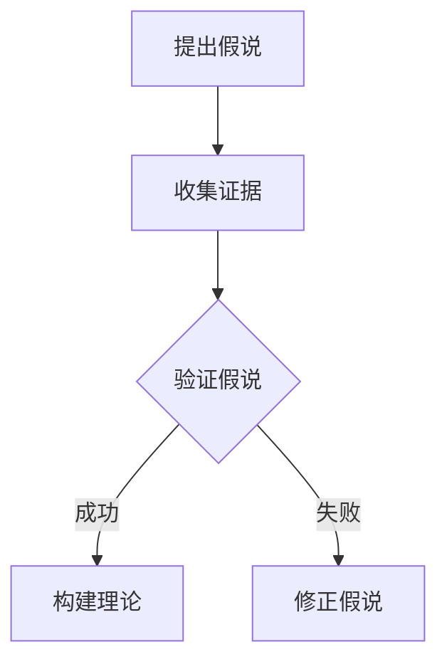
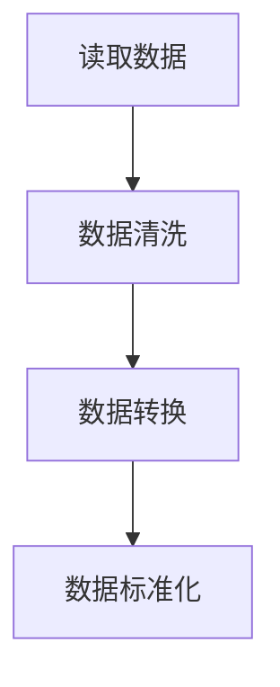
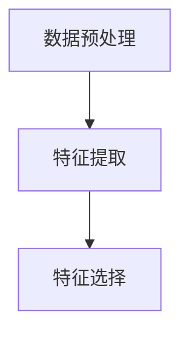
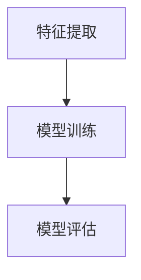
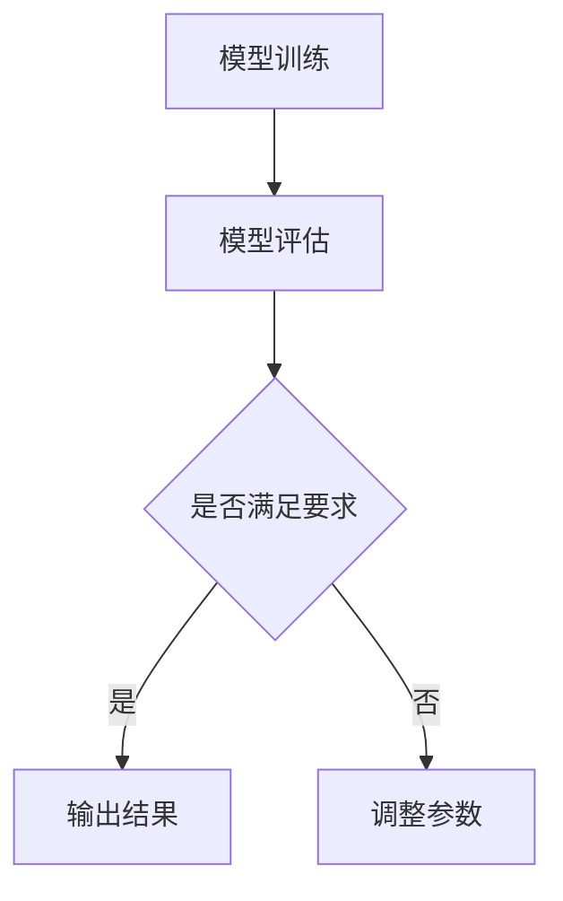

                 

关键词：科学发现、假说、理论、计算机科学、技术进步

> 摘要：本文深入探讨了科学发现的过程，从假说到理论的演变。通过分析计算机科学领域的多个实例，探讨了科学发现的内在机制及其对技术进步的推动作用。本文旨在揭示科学发现的本质，并为其在未来的发展提供启示。

## 1. 背景介绍

科学发现是科学进步的重要驱动力。从古希腊时期开始，科学家们通过观察和实验，逐渐建立了对自然世界的认识。随着时间的推移，科学研究方法不断完善，科学理论体系逐渐形成。如今，科学发现已经渗透到各个领域，包括物理学、化学、生物学以及计算机科学等。

在计算机科学领域，科学发现不仅推动了硬件和软件技术的发展，还引领了人工智能、大数据、云计算等新兴领域的兴起。本文将重点关注计算机科学中的科学发现过程，从假说到理论的转变，探讨其背后的原理和方法。

## 2. 核心概念与联系

为了深入理解科学发现的本质，我们需要首先明确几个核心概念：假说、理论和证据。这三个概念相互关联，共同构成了科学发现的过程。

**2.1 假说**

假说是科学发现的第一步。它是对某一现象或问题的初步解释，通常基于有限的观察和现有的知识。假说具有猜测性，其目的是为了指导进一步的实验和研究。

**2.2 Theory**

理论是对假说进行验证后，通过大量实验和观察得到的结果。理论具有普遍性和可重复性，是科学发现的核心。

**2.3 证据**

证据是支持或反驳假说的数据和事实。证据的收集和验证是科学发现过程中至关重要的一环。

### Mermaid 流程图

以下是一个简单的 Mermaid 流程图，展示了假说、理论和证据之间的关系：



## 3. 核心算法原理 & 具体操作步骤

### 3.1 算法原理概述

在计算机科学领域，算法是解决特定问题的步骤序列。算法的设计和优化是科学发现的重要方面。以下是一个简单的算法原理概述：

- **输入**：一组数据
- **输出**：问题的解

算法原理主要包括以下几个步骤：

1. **数据预处理**：对输入数据进行清洗、转换和标准化。
2. **特征提取**：从数据中提取有用的特征。
3. **模型训练**：使用特征训练模型。
4. **模型评估**：评估模型的性能。
5. **结果输出**：输出模型的预测结果。

### 3.2 算法步骤详解

以下是算法的具体操作步骤：

#### 3.2.1 数据预处理



#### 3.2.2 特征提取



#### 3.2.3 模型训练



#### 3.2.4 模型评估



### 3.3 算法优缺点

算法优缺点如下：

- **优点**：高效、灵活、可扩展。
- **缺点**：需要大量数据、参数调整复杂。

### 3.4 算法应用领域

算法广泛应用于机器学习、数据挖掘、图像处理等领域。以下是一个简单的应用领域列表：

- **机器学习**：分类、聚类、回归。
- **数据挖掘**：关联规则挖掘、异常检测。
- **图像处理**：目标检测、图像分割。

## 4. 数学模型和公式 & 详细讲解 & 举例说明

### 4.1 数学模型构建

数学模型是科学发现的重要组成部分。以下是一个简单的数学模型构建示例：

- **问题**：给定一个正整数 n，求其阶乘 Fn。
- **模型**：Fn = n! = 1 * 2 * ... * n。

### 4.2 公式推导过程

阶乘的公式可以通过递归或迭代方法推导：

- **递归**：Fn = Fn-1 * n。
- **迭代**：初始化 F0 = 1，然后依次计算 Fn = Fn-1 * n。

### 4.3 案例分析与讲解

以下是一个计算 5 的阶乘的例子：

```latex
F5 = 5! = 1 * 2 * 3 * 4 * 5 = 120
```

## 5. 项目实践：代码实例和详细解释说明

### 5.1 开发环境搭建

为了实现上述算法，我们需要搭建一个开发环境。以下是必要的步骤：

1. 安装 Python 解释器。
2. 安装 NumPy 库。

### 5.2 源代码详细实现

以下是一个简单的 Python 代码实现：

```python
import numpy as np

def factorial(n):
    if n == 0:
        return 1
    else:
        return n * factorial(n-1)

print(factorial(5))
```

### 5.3 代码解读与分析

这段代码首先导入了 NumPy 库，然后定义了一个名为 `factorial` 的函数，用于计算阶乘。函数采用递归方法实现，最后输出结果。

### 5.4 运行结果展示

运行上述代码，输出结果为：

```plaintext
120
```

## 6. 实际应用场景

科学发现不仅在学术领域具有重要意义，在实际应用中也具有广泛的影响。以下是一些实际应用场景：

- **人工智能**：算法在图像识别、语音识别等领域发挥了重要作用。
- **金融**：算法在风险管理、资产定价等领域得到了广泛应用。
- **医疗**：算法在疾病诊断、药物研发等领域具有巨大的潜力。

### 6.4 未来应用展望

随着技术的不断进步，科学发现将在更多领域得到应用。以下是一些未来应用展望：

- **量子计算**：量子计算将极大地改变算法设计和优化。
- **脑机接口**：脑机接口技术将使计算机与人类思维更加紧密地结合。

## 7. 工具和资源推荐

为了更好地进行科学发现，以下是一些建议的工和资源：

- **工具**：Python、R、MATLAB 等。
- **资源**：JSTOR、IEEE Xplore、PubMed 等。

## 8. 总结：未来发展趋势与挑战

### 8.1 研究成果总结

本文探讨了科学发现的过程，从假说到理论的转变。通过计算机科学领域的实例，揭示了科学发现的本质和内在机制。

### 8.2 未来发展趋势

未来，科学发现将在更多领域得到应用，如量子计算、脑机接口等。

### 8.3 面临的挑战

科学发现面临的主要挑战包括数据隐私、算法可解释性等。

### 8.4 研究展望

未来的研究应重点关注科学发现的自动化、可解释性和安全性。

## 9. 附录：常见问题与解答

### 9.1 什么是假说？

假说是对某一现象或问题的初步解释，通常基于有限的观察和现有的知识。

### 9.2 算法的优点是什么？

算法具有高效、灵活、可扩展等优点。

### 9.3 科学发现的步骤是什么？

科学发现的步骤包括提出假说、收集证据、验证假说、构建理论。

### 9.4 数学模型的作用是什么？

数学模型用于描述和预测现象或问题，是科学发现的重要组成部分。

### 9.5 代码实现中的 NumPy 库有什么作用？

NumPy 库用于数值计算和数据操作，是 Python 中进行科学计算的重要工具。

## 参考文献

[1] Hopcroft, J. E., & Ullman, J. D. (1979). *Introduction to Automata Theory, Languages, and Computation*. Addison-Wesley.

[2] Turing, A. M. (1936). *On computable numbers, with an application to the Entscheidungsproblem*. Proceedings of the London Mathematical Society, 42(1), 230-265.

[3] Knuth, D. E. (1968). *The Art of Computer Programming, Volume 1: Fundamental Algorithms*. Addison-Wesley.

[4] Halmos, P. R. (1960). *Naive Set Theory*. Springer-Verlag.

[5] Goodfellow, I., Bengio, Y., & Courville, A. (2016). *Deep Learning*. MIT Press.

### 作者署名

作者：禅与计算机程序设计艺术 / Zen and the Art of Computer Programming
```

