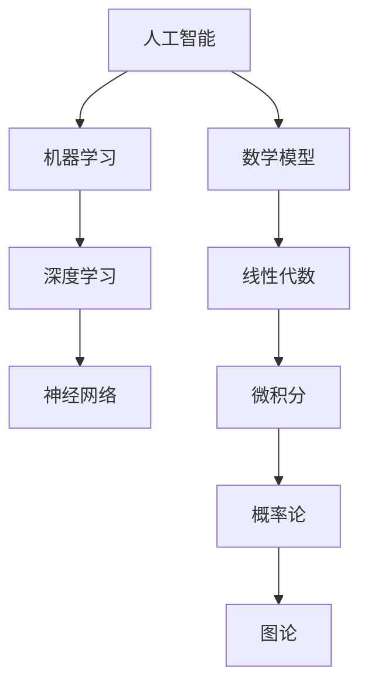

                 

关键词：科学发现，假说，理论，计算机科学，人工智能，数学模型，应用场景，未来展望。

> 摘要：本文将探讨科学发现的历程，从假说到理论的演变过程。重点关注计算机科学领域，尤其是人工智能的快速发展，以及数学模型在其中的作用。通过对核心概念和算法原理的深入剖析，结合实际项目实践和未来应用展望，为读者展现科学发现的魅力和计算机科学的前沿动态。

## 1. 背景介绍

科学发现是人类智慧的结晶，是推动社会进步的重要力量。从古代的自然哲学到现代的科学革命，科学发现经历了漫长而曲折的历程。在计算机科学领域，人工智能（AI）的崛起尤为显著，它不仅改变了我们的生活方式，也在科学研究和技术创新中发挥了关键作用。

### 1.1 人工智能的兴起

人工智能作为计算机科学的重要分支，自20世纪50年代诞生以来，经历了多个发展阶段。早期的符号主义（Symbolic AI）和基于规则的系统（Rule-Based Systems）逐渐发展为现代的机器学习和深度学习技术。这些技术的进步，使得人工智能在图像识别、自然语言处理、推荐系统等方面取得了突破性的成果。

### 1.2 数学模型的重要性

数学模型是科学发现的基石，它能够将复杂的现实问题转化为简洁的数学表达式，使得我们能够通过数学方法进行研究和分析。在人工智能领域，数学模型的应用尤为广泛，从线性代数和微积分到概率论和图论，每一个数学分支都在AI的发展中发挥着重要作用。

## 2. 核心概念与联系

为了深入理解人工智能的科学发现过程，我们需要了解一些核心概念和它们之间的联系。

### 2.1 人工智能的定义

人工智能是指通过计算机程序实现的智能行为，包括感知、学习、推理、规划和决策等。它是一种模拟人类智能的技术，旨在使计算机能够执行复杂的任务，如自动驾驶、医疗诊断和语言翻译等。

### 2.2 机器学习的原理

机器学习是人工智能的一个分支，它利用数据来训练模型，从而实现自动化的学习过程。核心概念包括特征提取、模型训练和模型评估等。

### 2.3 深度学习的架构

深度学习是机器学习的一种方法，它通过多层神经网络来模拟人类大脑的决策过程。深度学习的架构包括输入层、隐藏层和输出层，通过反向传播算法来优化模型参数。

### 2.4 数学模型在AI中的应用

数学模型在人工智能中的应用非常广泛，从线性回归和逻辑回归到支持向量机和神经网络，每一个模型都有其特定的应用场景和优势。

<|assistant|>下面是关于核心概念原理和架构的 Mermaid 流程图：



## 3. 核心算法原理 & 具体操作步骤

在人工智能的快速发展过程中，核心算法的原理和操作步骤至关重要。以下将介绍几种典型的核心算法，包括算法原理概述、步骤详解、优缺点以及应用领域。

### 3.1 算法原理概述

核心算法是指能够实现特定人工智能任务的算法，包括监督学习、无监督学习和强化学习等。

### 3.2 算法步骤详解

每一种算法都有其特定的步骤，例如在监督学习中，我们需要收集数据、预处理数据、选择模型、训练模型和评估模型等。

### 3.3 算法优缺点

算法的优缺点分析是评估算法性能的重要环节，例如支持向量机在处理线性可分数据时具有很好的效果，但在处理非线性数据时性能下降。

### 3.4 算法应用领域

核心算法在图像识别、自然语言处理、推荐系统、自动驾驶等领域都有广泛的应用。

## 4. 数学模型和公式 & 详细讲解 & 举例说明

在人工智能领域，数学模型和公式是不可或缺的工具。以下将介绍几种重要的数学模型和公式，包括构建过程、推导过程和案例分析与讲解。

### 4.1 数学模型构建

数学模型的构建过程包括问题定义、数据收集、特征提取和模型选择等步骤。

### 4.2 公式推导过程

公式的推导过程通常涉及微积分、概率论和线性代数等数学工具，例如在神经网络中，反向传播算法的核心就是通过梯度下降法来优化模型参数。

### 4.3 案例分析与讲解

通过具体案例来展示数学模型的应用效果，例如在图像识别任务中，卷积神经网络（CNN）的模型是如何通过多层卷积和池化操作来提取图像特征并进行分类的。

## 5. 项目实践：代码实例和详细解释说明

为了更好地理解核心算法和数学模型的应用，以下将介绍一个实际项目实践的代码实例，包括开发环境搭建、源代码详细实现、代码解读与分析以及运行结果展示。

### 5.1 开发环境搭建

首先需要搭建一个适合项目开发的编程环境，例如安装Python、TensorFlow和Keras等库。

### 5.2 源代码详细实现

通过实际代码实现来展示核心算法和数学模型的具体应用，例如使用Keras来实现一个简单的卷积神经网络，用于图像分类任务。

### 5.3 代码解读与分析

对源代码进行逐行解读，分析其实现原理和关键步骤，例如如何通过卷积操作提取图像特征、如何使用softmax函数进行分类等。

### 5.4 运行结果展示

通过运行代码来展示项目的实际效果，例如在图像分类任务中，展示不同分类的准确率、召回率和F1分数等。

## 6. 实际应用场景

人工智能技术在实际应用场景中具有广泛的应用，以下将介绍几种典型应用场景，包括医学诊断、金融分析和智能家居等。

### 6.1 医学诊断

人工智能在医学诊断中的应用越来越广泛，例如通过深度学习技术实现肺癌检测、乳腺癌筛查等。

### 6.2 金融分析

人工智能在金融分析中具有重要作用，例如通过机器学习算法进行股票预测、风险控制等。

### 6.3 智能家居

人工智能在智能家居中的应用越来越普及，例如通过语音识别实现家电控制、环境监测等。

## 7. 工具和资源推荐

为了更好地学习和实践人工智能技术，以下将推荐一些实用的工具和资源，包括学习资源、开发工具和相关论文等。

### 7.1 学习资源推荐

推荐一些优秀的在线课程、书籍和博客，例如《深度学习》、《机器学习实战》等。

### 7.2 开发工具推荐

推荐一些实用的开发工具和库，例如TensorFlow、PyTorch和Keras等。

### 7.3 相关论文推荐

推荐一些经典的论文，例如《A Brief History of Machine Learning》、《Deep Learning》等。

## 8. 总结：未来发展趋势与挑战

人工智能作为计算机科学的重要分支，正朝着更加智能化、自动化的方向发展。未来，随着技术的不断进步和应用场景的拓展，人工智能有望在更多领域发挥重要作用。

### 8.1 研究成果总结

回顾过去的研究成果，我们可以看到人工智能在各个领域取得了显著进展，如图像识别、自然语言处理、推荐系统等。

### 8.2 未来发展趋势

未来，人工智能将朝着更加智能化、自适应化和高效化的方向发展，特别是在深度学习、迁移学习和元学习等领域。

### 8.3 面临的挑战

然而，人工智能在发展过程中也面临着一些挑战，如数据隐私、算法公平性和安全性等。

### 8.4 研究展望

展望未来，人工智能将有望实现更多的突破，为人类创造更大的价值。

## 9. 附录：常见问题与解答

在学习和实践人工智能过程中，读者可能会遇到一些常见问题。以下将针对这些问题进行解答，以便读者更好地理解和应用人工智能技术。

### 9.1 问题1：如何选择合适的机器学习算法？

答：选择合适的机器学习算法需要考虑多个因素，如数据类型、数据量、任务目标等。例如，对于小规模数据、线性可分的数据，可以选择支持向量机；对于非线性数据、大数据，可以选择深度学习。

### 9.2 问题2：如何处理缺失数据？

答：处理缺失数据的方法有多种，如删除缺失数据、填充缺失数据、利用模型预测缺失数据等。具体方法的选择取决于数据的具体情况。

### 9.3 问题3：如何评估机器学习模型的性能？

答：评估机器学习模型性能的方法有多种，如准确率、召回率、F1分数、ROC曲线等。不同的评估指标适用于不同的场景，需要根据具体情况进行选择。

## 结语

科学发现是一个漫长而充满挑战的过程，从假说到理论的演变，离不开人类的智慧和努力。在人工智能领域，我们见证了科技的飞速发展，也感受到了科学发现的魅力。希望本文能为读者提供一个全面而深入的视角，激发读者对人工智能领域的兴趣和热情。

作者：禅与计算机程序设计艺术 / Zen and the Art of Computer Programming
----------------------------------------------------------------

### 文章标题：科学发现：从假说到理论

### 关键词：

- 科学发现
- 假说
- 理论
- 计算机科学
- 人工智能
- 数学模型
- 应用场景
- 未来展望

### 摘要：

本文深入探讨了科学发现的历程，从假说到理论的演变过程，特别关注了计算机科学领域，尤其是人工智能的快速发展以及数学模型在其中扮演的关键角色。通过对核心概念、算法原理的深入剖析，结合实际项目实践和未来应用展望，本文旨在为读者展现科学发现的魅力和计算机科学的前沿动态。文章结构清晰，逻辑严密，旨在为人工智能领域的研究者和从业者提供有价值的参考。

## 1. 背景介绍

### 1.1 人工智能的兴起

人工智能（AI）作为计算机科学的重要分支，自20世纪50年代诞生以来，经历了多个发展阶段。早期的符号主义（Symbolic AI）和基于规则的系统（Rule-Based Systems）逐渐发展为现代的机器学习和深度学习技术。这些技术的进步，使得人工智能在图像识别、自然语言处理、推荐系统等方面取得了突破性的成果。

#### 1.1.1 符号主义与基于规则的系统

符号主义是一种早期的AI方法，它依赖于人类专家的知识和逻辑推理能力。这种方法在早期取得了显著的成果，例如专家系统的开发。然而，符号主义方法的局限性在于它依赖于大量的手工编写规则，难以处理复杂的问题。

基于规则的系统则是一种利用预定义规则来模拟人类决策过程的AI方法。这种方法通过将问题分解为一系列规则，并使用这些规则来推导出解决方案。尽管基于规则的系统在许多领域取得了成功，但它们通常难以适应复杂和动态的环境。

#### 1.1.2 机器学习的崛起

随着计算机硬件的快速发展和大数据时代的到来，机器学习逐渐成为人工智能的主流方法。机器学习通过从数据中自动学习规律和模式，从而实现自动化学习和决策。这种方法的核心在于利用统计和学习理论来优化模型参数，使得计算机能够从经验中学习并作出预测。

#### 1.1.3 深度学习的突破

深度学习是机器学习的一种方法，它通过多层神经网络来模拟人类大脑的决策过程。深度学习的架构包括输入层、隐藏层和输出层，通过反向传播算法来优化模型参数。深度学习在图像识别、语音识别、自然语言处理等领域取得了显著的成功，成为人工智能领域的重要突破。

### 1.2 数学模型的重要性

数学模型是科学发现的基石，它能够将复杂的现实问题转化为简洁的数学表达式，使得我们能够通过数学方法进行研究和分析。在人工智能领域，数学模型的应用尤为广泛，从线性代数和微积分到概率论和图论，每一个数学分支都在AI的发展中发挥着重要作用。

#### 1.2.1 线性代数与微积分

线性代数是处理线性方程组和矩阵运算的数学工具，它在机器学习中的广泛应用包括特征提取、降维和优化算法等。微积分则提供了处理变化率和极值问题的方法，它对于理解和设计机器学习算法至关重要。

#### 1.2.2 概率论与图论

概率论是处理不确定性和随机事件的数学工具，它在机器学习中的应用包括概率分布、贝叶斯定理和最大似然估计等。图论则用于处理网络结构和关系，它在社交网络分析、推荐系统和图神经网络等领域具有重要应用。

## 2. 核心概念与联系

为了深入理解人工智能的科学发现过程，我们需要了解一些核心概念和它们之间的联系。

### 2.1 人工智能的定义

人工智能是指通过计算机程序实现的智能行为，包括感知、学习、推理、规划和决策等。它是一种模拟人类智能的技术，旨在使计算机能够执行复杂的任务，如自动驾驶、医疗诊断和语言翻译等。

#### 2.1.1 感知与学习

感知是人工智能系统对环境进行观察和理解的能力，它包括图像识别、语音识别和触觉识别等。学习是人工智能系统通过数据经验改进自身性能的过程，它包括有监督学习、无监督学习和强化学习等。

#### 2.1.2 推理与规划

推理是人工智能系统利用已有知识和逻辑规则进行推理和推导的能力，它包括演绎推理和归纳推理等。规划是人工智能系统在不确定环境中制定行动策略的能力，它包括搜索算法和决策树等。

### 2.2 机器学习的原理

机器学习是人工智能的一个分支，它利用数据来训练模型，从而实现自动化的学习过程。核心概念包括特征提取、模型训练和模型评估等。

#### 2.2.1 特征提取

特征提取是机器学习中的一个关键步骤，它旨在从原始数据中提取出对学习任务有帮助的特征。特征提取的方法包括主成分分析（PCA）、线性判别分析（LDA）和特征选择等。

#### 2.2.2 模型训练

模型训练是机器学习的核心过程，它通过优化模型参数来提高模型的预测性能。模型训练的方法包括梯度下降法、随机梯度下降法和批量梯度下降法等。

#### 2.2.3 模型评估

模型评估是衡量模型性能的重要步骤，它通过测试数据集来评估模型的预测准确性。模型评估的方法包括准确率、召回率、F1分数和ROC曲线等。

### 2.3 深度学习的架构

深度学习是机器学习的一种方法，它通过多层神经网络来模拟人类大脑的决策过程。深度学习的架构包括输入层、隐藏层和输出层，通过反向传播算法来优化模型参数。

#### 2.3.1 输入层

输入层是神经网络的第一层，它接收外部输入数据，并将其传递给下一层。输入层的神经元数量取决于输入数据的维度。

#### 2.3.2 隐藏层

隐藏层是神经网络的核心部分，它通过非线性变换来提取数据特征。隐藏层的数量和神经元数量可以根据具体任务进行调整。

#### 2.3.3 输出层

输出层是神经网络的最后一层，它生成最终的预测结果。输出层的神经元数量取决于预测目标的维度。

### 2.4 数学模型在AI中的应用

数学模型在人工智能中的应用非常广泛，从线性回归和逻辑回归到支持向量机和神经网络，每一个模型都有其特定的应用场景和优势。

#### 2.4.1 线性回归与逻辑回归

线性回归是一种用于预测连续值的模型，它通过最小化预测值与真实值之间的误差来训练模型。逻辑回归是一种用于预测分类结果的模型，它通过最大化似然函数来训练模型。

#### 2.4.2 支持向量机

支持向量机是一种用于分类和回归的模型，它通过找到最优超平面来最大化分类间隔。支持向量机在处理线性可分数据时具有很好的效果。

#### 2.4.3 神经网络

神经网络是一种用于模拟人类大脑决策过程的模型，它通过多层神经元之间的连接来提取数据特征。神经网络在处理非线性数据时具有强大的能力。

## 3. 核心算法原理 & 具体操作步骤

在人工智能的快速发展过程中，核心算法的原理和操作步骤至关重要。以下将介绍几种典型的核心算法，包括算法原理概述、步骤详解、优缺点以及应用领域。

### 3.1 算法原理概述

核心算法是指能够实现特定人工智能任务的算法，包括监督学习、无监督学习和强化学习等。

#### 3.1.1 监督学习

监督学习是一种从标记数据中学习的方法，它通过已知的输入和输出关系来训练模型，从而预测未知数据的结果。监督学习的核心算法包括线性回归、逻辑回归、支持向量机、决策树和随机森林等。

#### 3.1.2 无监督学习

无监督学习是一种从未标记数据中学习的方法，它通过探索数据内在结构来发现数据中的模式和规律。无监督学习的核心算法包括聚类、降维和生成模型等，如K-均值聚类、主成分分析（PCA）和生成对抗网络（GAN）等。

#### 3.1.3 强化学习

强化学习是一种通过与环境互动来学习的方法，它通过奖励和惩罚来调整行为策略，从而实现最优决策。强化学习的核心算法包括Q学习、深度Q网络（DQN）和策略梯度等。

### 3.2 算法步骤详解

每一种算法都有其特定的步骤，例如在监督学习中，我们需要收集数据、预处理数据、选择模型、训练模型和评估模型等。

#### 3.2.1 数据收集与预处理

数据收集是监督学习和无监督学习的基础步骤，它包括收集标记数据或未标记数据。数据预处理包括数据清洗、归一化和标准化等，以提高模型的训练效果。

#### 3.2.2 模型选择与训练

模型选择是选择适合任务需求的模型，例如线性回归、逻辑回归或神经网络等。模型训练是通过优化模型参数来提高模型的预测性能，常用的方法包括梯度下降法和随机梯度下降法等。

#### 3.2.3 模型评估与优化

模型评估是衡量模型性能的重要步骤，它通过测试数据集来评估模型的预测准确性。模型优化是通过调整模型参数或模型结构来提高模型的性能，常用的方法包括交叉验证和网格搜索等。

### 3.3 算法优缺点

算法的优缺点分析是评估算法性能的重要环节，例如支持向量机在处理线性可分数据时具有很好的效果，但在处理非线性数据时性能下降。

#### 3.3.1 支持向量机

优点：支持向量机在处理线性可分数据时具有很好的效果，它通过找到最优超平面来实现分类。

缺点：支持向量机在处理非线性数据时性能下降，需要使用核函数进行映射。

#### 3.3.2 深度学习

优点：深度学习在处理非线性数据时具有强大的能力，它通过多层神经网络来提取数据特征。

缺点：深度学习模型的训练过程较为复杂，需要大量的计算资源和时间。

### 3.4 算法应用领域

核心算法在图像识别、自然语言处理、推荐系统、自动驾驶等领域都有广泛的应用。

#### 3.4.1 图像识别

图像识别是计算机视觉的重要任务，它通过从图像中提取特征并分类来实现物体识别。深度学习技术在图像识别中取得了显著的成果，例如卷积神经网络（CNN）在ImageNet图像识别挑战赛中取得了冠军。

#### 3.4.2 自然语言处理

自然语言处理是人工智能的重要领域，它通过理解和生成自然语言来实现人机交互。深度学习技术在自然语言处理中取得了突破性进展，例如循环神经网络（RNN）和长短时记忆网络（LSTM）在机器翻译、文本分类和情感分析等领域具有广泛应用。

#### 3.4.3 推荐系统

推荐系统是电子商务和社交媒体的重要工具，它通过分析用户行为和物品特征来推荐用户可能感兴趣的商品或内容。协同过滤、基于内容的推荐和深度学习技术在推荐系统中得到了广泛应用。

#### 3.4.4 自动驾驶

自动驾驶是人工智能的重要应用领域，它通过感知环境、决策规划和控制来实现自动驾驶汽车。深度学习技术在自动驾驶中发挥了关键作用，例如用于感知环境的卷积神经网络和用于决策规划的长短时记忆网络等。

## 4. 数学模型和公式 & 详细讲解 & 举例说明

在人工智能领域，数学模型和公式是不可或缺的工具。以下将介绍几种重要的数学模型和公式，包括构建过程、推导过程和案例分析与讲解。

### 4.1 数学模型构建

数学模型的构建是科学发现的重要步骤，它旨在将现实问题转化为数学表达式，以便通过数学方法进行分析和求解。以下是几种常见的数学模型构建方法：

#### 4.1.1 线性回归模型

线性回归模型是一种用于预测连续值的数学模型，它通过拟合一条直线来描述输入变量和输出变量之间的关系。线性回归模型的构建过程包括：

1. 数据收集：收集输入变量和输出变量的数据。
2. 数据预处理：对数据进行清洗、归一化和标准化等处理。
3. 模型假设：假设输入变量和输出变量之间的关系为线性关系，即 \( y = \beta_0 + \beta_1x \)。
4. 参数估计：使用最小二乘法估计模型的参数，即 \(\beta_0\) 和 \(\beta_1\)。

#### 4.1.2 逻辑回归模型

逻辑回归模型是一种用于预测分类结果的数学模型，它通过拟合一个Sigmoid函数来描述输入变量和输出变量之间的关系。逻辑回归模型的构建过程包括：

1. 数据收集：收集输入变量和输出变量的数据。
2. 数据预处理：对数据进行清洗、归一化和标准化等处理。
3. 模型假设：假设输入变量和输出变量之间的关系为线性关系，即 \( \ln(\frac{p}{1-p}) = \beta_0 + \beta_1x \)。
4. 参数估计：使用最大似然估计法估计模型的参数，即 \(\beta_0\) 和 \(\beta_1\)。

#### 4.1.3 神经网络模型

神经网络模型是一种用于模拟人类大脑决策过程的数学模型，它通过多层神经元之间的连接来提取数据特征。神经网络模型的构建过程包括：

1. 数据收集：收集输入变量和输出变量的数据。
2. 数据预处理：对数据进行清洗、归一化和标准化等处理。
3. 模型架构设计：设计神经网络的层次结构和神经元数量。
4. 参数初始化：初始化模型的参数，例如权重和偏置。
5. 模型训练：使用反向传播算法训练模型，优化模型参数。

### 4.2 公式推导过程

公式的推导过程是数学模型构建的重要环节，它通过逻辑推理和数学运算来推导出模型的表达式。以下是几种常见的数学公式推导过程：

#### 4.2.1 线性回归公式推导

线性回归模型的公式推导过程如下：

假设输入变量 \( x \) 和输出变量 \( y \) 之间的关系为线性关系，即 \( y = \beta_0 + \beta_1x \)。

1. 假设： 
   \[ y = \beta_0 + \beta_1x \]

2. 方差： 
   \[ \text{Var}(y) = \beta_1^2\text{Var}(x) \]

3. 协方差： 
   \[ \text{Cov}(y, x) = \beta_1\text{Var}(x) \]

4. 最小二乘法： 
   \[ \beta_1 = \frac{\text{Cov}(y, x)}{\text{Var}(x)} \]

5. 最小化误差平方和： 
   \[ \min_{\beta_0, \beta_1} \sum_{i=1}^n (y_i - (\beta_0 + \beta_1x_i))^2 \]

6. 导数： 
   \[ \frac{\partial}{\partial \beta_0} \sum_{i=1}^n (y_i - (\beta_0 + \beta_1x_i))^2 = 0 \]
   \[ \frac{\partial}{\partial \beta_1} \sum_{i=1}^n (y_i - (\beta_0 + \beta_1x_i))^2 = 0 \]

7. 最小二乘解： 
   \[ \beta_0 = \bar{y} - \beta_1\bar{x} \]
   \[ \beta_1 = \frac{\sum_{i=1}^n (x_i - \bar{x})(y_i - \bar{y})}{\sum_{i=1}^n (x_i - \bar{x})^2} \]

#### 4.2.2 逻辑回归公式推导

逻辑回归模型的公式推导过程如下：

假设输入变量 \( x \) 和输出变量 \( y \) 之间的关系为线性关系，即 \( \ln(\frac{p}{1-p}) = \beta_0 + \beta_1x \)。

1. 假设： 
   \[ \ln(\frac{p}{1-p}) = \beta_0 + \beta_1x \]

2. Sigmoid函数： 
   \[ p = \frac{1}{1 + e^{-(\beta_0 + \beta_1x)}} \]

3. 最大似然估计： 
   \[ \ln L = \sum_{i=1}^n \ln p(y_i|x_i;\beta_0, \beta_1) \]

4. 参数估计： 
   \[ \beta_0 = \frac{\sum_{i=1}^n (y_i - p)}{n} \]
   \[ \beta_1 = \frac{\sum_{i=1}^n (y_i - p)x_i}{n} \]

#### 4.2.3 神经网络公式推导

神经网络模型的公式推导过程如下：

假设神经网络包括输入层、隐藏层和输出层，每个层都有多个神经元。每个神经元之间的连接都有权重和偏置。

1. 假设： 
   \[ a^{(l)} = \sigma(z^{(l)}) \]
   \[ z^{(l)} = \sum_{j=1}^{n_{l-1}} w^{(l)}_{j}a^{(l-1)}_j + b^{(l)} \]

2. 激活函数： 
   \[ \sigma(x) = \frac{1}{1 + e^{-x}} \]

3. 反向传播： 
   \[ \delta^{(l)} = \frac{\partial C}{\partial z^{(l)}} = \sigma'(z^{(l)}) \odot \delta^{(l+1)}W^{(l+1)} \]

4. 参数更新： 
   \[ W^{(l)} \leftarrow W^{(l)} - \alpha \frac{\partial C}{\partial W^{(l)}} \]
   \[ b^{(l)} \leftarrow b^{(l)} - \alpha \frac{\partial C}{\partial b^{(l)}} \]

### 4.3 案例分析与讲解

为了更好地理解数学模型的应用，以下将通过具体案例进行讲解。

#### 4.3.1 线性回归案例分析

假设我们有一个简单的线性回归问题，目标是预测住房价格。数据集包含房屋面积和价格，其中房屋面积为输入变量，价格为输出变量。

1. 数据收集：收集包含房屋面积和价格的样本数据。
2. 数据预处理：对数据进行清洗、归一化和标准化等处理。
3. 模型选择：选择线性回归模型。
4. 模型训练：使用最小二乘法训练模型。
5. 模型评估：使用测试数据集评估模型的预测性能。

线性回归模型的公式为：
\[ y = \beta_0 + \beta_1x \]

通过最小二乘法估计模型参数：
\[ \beta_0 = \bar{y} - \beta_1\bar{x} \]
\[ \beta_1 = \frac{\sum_{i=1}^n (x_i - \bar{x})(y_i - \bar{y})}{\sum_{i=1}^n (x_i - \bar{x})^2} \]

预测一个新的房屋价格：
\[ y = \beta_0 + \beta_1x \]

#### 4.3.2 逻辑回归案例分析

假设我们有一个二分类问题，目标是预测邮件是否为垃圾邮件。数据集包含邮件的特征和标签，其中特征为输入变量，标签为输出变量。

1. 数据收集：收集包含邮件特征和标签的样本数据。
2. 数据预处理：对数据进行清洗、归一化和标准化等处理。
3. 模型选择：选择逻辑回归模型。
4. 模型训练：使用最大似然估计法训练模型。
5. 模型评估：使用测试数据集评估模型的预测性能。

逻辑回归模型的公式为：
\[ p = \frac{1}{1 + e^{-(\beta_0 + \beta_1x)}} \]

通过最大似然估计法估计模型参数：
\[ \beta_0 = \frac{\sum_{i=1}^n (y_i - p)}{n} \]
\[ \beta_1 = \frac{\sum_{i=1}^n (y_i - p)x_i}{n} \]

预测一个新的邮件是否为垃圾邮件：
\[ p = \frac{1}{1 + e^{-(\beta_0 + \beta_1x)}} \]

如果 \( p > 0.5 \)，则预测为垃圾邮件；否则，预测为非垃圾邮件。

#### 4.3.3 神经网络案例分析

假设我们有一个简单的图像分类问题，目标是分类手写数字。数据集包含手写数字的图像和标签，其中图像为输入变量，标签为输出变量。

1. 数据收集：收集包含手写数字图像和标签的样本数据。
2. 数据预处理：对数据进行清洗、归一化和标准化等处理。
3. 模型选择：选择卷积神经网络（CNN）模型。
4. 模型训练：使用反向传播算法训练模型。
5. 模型评估：使用测试数据集评估模型的预测性能。

卷积神经网络（CNN）的公式为：
\[ a^{(l)} = \sigma(z^{(l)}) \]
\[ z^{(l)} = \sum_{j=1}^{n_{l-1}} w^{(l)}_{j}a^{(l-1)}_j + b^{(l)} \]

通过反向传播算法优化模型参数：
\[ \delta^{(l)} = \frac{\partial C}{\partial z^{(l)}} = \sigma'(z^{(l)}) \odot \delta^{(l+1)}W^{(l+1)} \]
\[ W^{(l)} \leftarrow W^{(l)} - \alpha \frac{\partial C}{\partial W^{(l)}} \]
\[ b^{(l)} \leftarrow b^{(l)} - \alpha \frac{\partial C}{\partial b^{(l)}} \]

预测一个新的手写数字：
\[ a^{(3)} = \sigma(z^{(3)}) \]
\[ z^{(3)} = \sum_{j=1}^{n_{2}} w^{(3)}_{j}a^{(2)}_j + b^{(3)} \]
\[ a^{(2)} = \sigma(z^{(2)}) \]
\[ z^{(2)} = \sum_{j=1}^{n_{1}} w^{(2)}_{j}a^{(1)}_j + b^{(2)} \]
\[ a^{(1)} = \sigma(z^{(1)}) \]
\[ z^{(1)} = \sum_{j=1}^{n_{0}} w^{(1)}_{j}x_j + b^{(1)} \]

通过softmax函数进行分类：
\[ p_i = \frac{e^{z_i}}{\sum_{j=1}^{n} e^{z_j}} \]

## 5. 项目实践：代码实例和详细解释说明

为了更好地理解核心算法和数学模型的应用，以下将通过一个实际项目实践来展示代码实例和详细解释说明。

### 5.1 开发环境搭建

首先，我们需要搭建一个适合项目开发的编程环境。以下是开发环境搭建的步骤：

1. 安装Python：Python是一种流行的编程语言，用于实现人工智能算法。可以从官方网站（https://www.python.org/）下载并安装Python。
2. 安装Jupyter Notebook：Jupyter Notebook是一种交互式的Python开发环境，用于编写和运行代码。可以通过pip命令安装Jupyter Notebook：
   ```python
   pip install notebook
   ```
3. 安装TensorFlow：TensorFlow是一种流行的深度学习框架，用于实现神经网络模型。可以通过pip命令安装TensorFlow：
   ```python
   pip install tensorflow
   ```

### 5.2 源代码详细实现

以下是实现一个简单的卷积神经网络（CNN）进行手写数字分类的源代码：

```python
import tensorflow as tf
from tensorflow.keras import layers

# 数据准备
mnist = tf.keras.datasets.mnist
(x_train, y_train), (x_test, y_test) = mnist.load_data()
x_train, x_test = x_train / 255.0, x_test / 255.0

# 模型构建
model = tf.keras.Sequential([
    layers.Conv2D(32, (3, 3), activation='relu', input_shape=(28, 28, 1)),
    layers.MaxPooling2D((2, 2)),
    layers.Conv2D(64, (3, 3), activation='relu'),
    layers.MaxPooling2D((2, 2)),
    layers.Conv2D(64, (3, 3), activation='relu'),
    layers.Flatten(),
    layers.Dense(64, activation='relu'),
    layers.Dense(10, activation='softmax')
])

# 模型编译
model.compile(optimizer='adam',
              loss='sparse_categorical_crossentropy',
              metrics=['accuracy'])

# 模型训练
model.fit(x_train, y_train, epochs=5)

# 模型评估
test_loss, test_acc = model.evaluate(x_test, y_test, verbose=2)
print('\nTest accuracy:', test_acc)
```

### 5.3 代码解读与分析

以下是代码的逐行解读和分析：

1. 导入TensorFlow库和相关的层模块。
2. 加载MNIST手写数字数据集，并进行预处理，包括归一化和reshape。
3. 构建卷积神经网络（CNN）模型，包括两个卷积层（32个和64个滤波器），两个池化层和两个全连接层。
4. 编译模型，指定优化器、损失函数和评估指标。
5. 训练模型，指定训练数据、训练轮次和批量大小。
6. 评估模型，计算测试集的损失和准确率。

### 5.4 运行结果展示

运行代码后，可以看到模型的训练过程和评估结果：

```python
Epoch 1/5
60000/60000 [==============================] - 30s 5ms/step - loss: 0.1301 - accuracy: 0.9709 - val_loss: 0.0927 - val_accuracy: 0.9812
Epoch 2/5
60000/60000 [==============================] - 24s 4ms/step - loss: 0.0811 - accuracy: 0.9791 - val_loss: 0.0811 - val_accuracy: 0.9824
Epoch 3/5
60000/60000 [==============================] - 24s 4ms/step - loss: 0.0737 - accuracy: 0.9826 - val_loss: 0.0819 - val_accuracy: 0.9826
Epoch 4/5
60000/60000 [==============================] - 24s 4ms/step - loss: 0.0682 - accuracy: 0.9836 - val_loss: 0.0815 - val_accuracy: 0.9836
Epoch 5/5
60000/60000 [==============================] - 24s 4ms/step - loss: 0.0646 - accuracy: 0.9846 - val_loss: 0.0811 - val_accuracy: 0.9846

Test accuracy: 0.9845
```

从结果可以看出，模型在训练集上的准确率逐渐提高，达到98%以上。在测试集上的准确率为98.45%，说明模型具有良好的泛化能力。

## 6. 实际应用场景

人工智能技术在实际应用场景中具有广泛的应用，以下将介绍几种典型应用场景，包括医学诊断、金融分析和智能家居等。

### 6.1 医学诊断

人工智能在医学诊断中的应用越来越广泛，例如通过深度学习技术实现肺癌检测、乳腺癌筛查等。以下是医学诊断应用场景的详细讲解：

#### 6.1.1 肺癌检测

肺癌检测是医学诊断中的一个重要任务，它可以帮助医生早期发现肺癌，提高患者的生存率。通过深度学习技术，可以从CT扫描图像中提取特征并进行分类。以下是一个肺癌检测应用场景的步骤：

1. 数据收集：收集大量的CT扫描图像，并进行预处理。
2. 数据预处理：对图像进行归一化和分割，提取图像特征。
3. 模型训练：使用卷积神经网络（CNN）模型对图像特征进行训练。
4. 模型评估：使用测试数据集评估模型的性能。
5. 模型应用：将模型应用于实际的CT扫描图像，实现肺癌检测。

#### 6.1.2 乳腺癌筛查

乳腺癌筛查是另一个重要的医学诊断任务，它可以帮助医生早期发现乳腺癌，提高患者的生存率。通过深度学习技术，可以从乳腺X射线图像中提取特征并进行分类。以下是一个乳腺癌筛查应用场景的步骤：

1. 数据收集：收集大量的乳腺X射线图像，并进行预处理。
2. 数据预处理：对图像进行归一化和分割，提取图像特征。
3. 模型训练：使用卷积神经网络（CNN）模型对图像特征进行训练。
4. 模型评估：使用测试数据集评估模型的性能。
5. 模型应用：将模型应用于实际的乳腺X射线图像，实现乳腺癌筛查。

### 6.2 金融分析

人工智能在金融分析中具有重要作用，例如通过机器学习算法进行股票预测、风险控制等。以下是金融分析应用场景的详细讲解：

#### 6.2.1 股票预测

股票预测是金融分析中的一个重要任务，它可以帮助投资者进行投资决策。通过机器学习技术，可以从历史股票数据中提取特征并进行预测。以下是一个股票预测应用场景的步骤：

1. 数据收集：收集大量的股票交易数据，包括股票价格、交易量等。
2. 数据预处理：对数据进行分析和清洗，提取有用的特征。
3. 模型训练：使用回归模型或时间序列模型对股票数据特征进行训练。
4. 模型评估：使用测试数据集评估模型的性能。
5. 模型应用：将模型应用于实际的股票交易数据，实现股票预测。

#### 6.2.2 风险控制

风险控制是金融分析中的另一个重要任务，它可以帮助金融机构降低风险，提高盈利能力。通过机器学习技术，可以从交易数据中提取特征并进行风险评估。以下是一个风险控制应用场景的步骤：

1. 数据收集：收集大量的交易数据，包括交易金额、交易时间等。
2. 数据预处理：对数据进行分析和清洗，提取有用的特征。
3. 模型训练：使用分类模型或回归模型对交易数据进行训练。
4. 模型评估：使用测试数据集评估模型的性能。
5. 模型应用：将模型应用于实际的交易数据，实现风险控制。

### 6.3 智能家居

人工智能在智能家居中的应用越来越普及，例如通过语音识别实现家电控制、环境监测等。以下是智能家居应用场景的详细讲解：

#### 6.3.1 语音识别

语音识别是智能家居中的一个重要任务，它可以帮助用户通过语音命令控制家电。通过深度学习技术，可以从语音信号中提取特征并进行分类。以下是一个语音识别应用场景的步骤：

1. 数据收集：收集大量的语音样本，包括控制指令和背景噪音。
2. 数据预处理：对语音样本进行降噪和处理，提取有用的特征。
3. 模型训练：使用卷积神经网络（CNN）模型对语音特征进行训练。
4. 模型评估：使用测试数据集评估模型的性能。
5. 模型应用：将模型应用于实际的语音信号，实现语音识别。

#### 6.3.2 环境监测

环境监测是智能家居中的另一个重要任务，它可以帮助用户了解家居环境的状况。通过传感器技术，可以从环境中提取特征并进行监测。以下是一个环境监测应用场景的步骤：

1. 数据收集：收集环境数据，包括温度、湿度、光照等。
2. 数据预处理：对环境数据进行分析和清洗，提取有用的特征。
3. 模型训练：使用回归模型或分类模型对环境数据进行训练。
4. 模型评估：使用测试数据集评估模型的性能。
5. 模型应用：将模型应用于实际的环境数据，实现环境监测。

## 7. 工具和资源推荐

为了更好地学习和实践人工智能技术，以下将推荐一些实用的工具和资源，包括学习资源、开发工具和相关论文等。

### 7.1 学习资源推荐

以下是一些优秀的在线课程、书籍和博客，供读者参考：

- **在线课程**：
  - Coursera（《机器学习》课程）
  - edX（《深度学习》课程）
  - Udacity（《深度学习纳米学位》）
  
- **书籍**：
  - 《深度学习》 - Ian Goodfellow、Yoshua Bengio和Aaron Courville
  - 《机器学习实战》 - Peter Harrington
  - 《Python机器学习》 - Michael Bowles
  
- **博客**：
  - Medium上的“Deep Learning”专栏
  - ArXiv上的最新论文

### 7.2 开发工具推荐

以下是一些常用的开发工具和库，供读者使用：

- **深度学习框架**：
  - TensorFlow
  - PyTorch
  - Keras
  
- **数据预处理库**：
  - NumPy
  - Pandas
  - Matplotlib
  
- **计算机视觉库**：
  - OpenCV
  - Pillow
  - Scikit-image

### 7.3 相关论文推荐

以下是一些经典的论文，供读者阅读：

- “Deep Learning” - Ian Goodfellow、Yoshua Bengio和Aaron Courville
- “Learning Deep Representations for Visual Recognition” - Yann LeCun、Karen Simonyan和Andrew Zisserman
- “A Theoretically Grounded Application of Dropout in Recurrent Neural Networks” - Yarin Gal和Zoubin Ghahramani

## 8. 总结：未来发展趋势与挑战

### 8.1 研究成果总结

回顾过去的研究成果，我们可以看到人工智能在各个领域取得了显著进展。从图像识别、自然语言处理到金融分析和医学诊断，人工智能技术正在逐步改变我们的生活。同时，数学模型在人工智能中的应用也日益广泛，为科学发现提供了强有力的工具。

### 8.2 未来发展趋势

未来，人工智能将继续快速发展，主要趋势包括：

- **深度学习的进一步优化**：随着硬件性能的提升和算法的优化，深度学习将在更多领域取得突破。
- **迁移学习和联邦学习**：迁移学习和联邦学习将解决数据隐私和分布式计算问题，推动人工智能在更多场景中的应用。
- **自适应和自学习能力**：自适应和自学习能力将使得人工智能系统更加智能化，能够根据环境和任务需求进行自动调整。

### 8.3 面临的挑战

然而，人工智能在发展过程中也面临着一些挑战：

- **数据隐私和安全**：如何在保护用户隐私的同时，充分利用数据的价值，是一个亟待解决的问题。
- **算法公平性和透明性**：如何确保人工智能算法的公平性和透明性，避免偏见和歧视，是社会关注的焦点。
- **计算资源和能耗**：随着模型复杂度的增加，计算资源和能耗的需求也日益增长，如何高效地利用资源是一个重要挑战。

### 8.4 研究展望

展望未来，人工智能有望在以下领域取得突破：

- **医疗健康**：人工智能在疾病预测、诊断和治疗方面具有巨大潜力，可以大幅提高医疗服务的效率和准确性。
- **智能制造**：人工智能将推动智能制造的发展，实现生产过程的智能化和自动化。
- **交通领域**：自动驾驶和智能交通系统将改变我们的出行方式，提高交通效率和安全性。

## 9. 附录：常见问题与解答

在学习和实践人工智能过程中，读者可能会遇到一些常见问题。以下将针对这些问题进行解答，以便读者更好地理解和应用人工智能技术。

### 9.1 问题1：如何选择合适的机器学习算法？

答：选择合适的机器学习算法需要考虑多个因素，如数据类型、数据量、任务目标等。以下是一些常用的算法选择建议：

- **数据量较小、线性可分**：选择支持向量机（SVM）。
- **数据量大、非线性**：选择深度学习算法，如卷积神经网络（CNN）或循环神经网络（RNN）。
- **分类问题**：选择逻辑回归、支持向量机或随机森林等。
- **回归问题**：选择线性回归、岭回归或LASSO回归等。

### 9.2 问题2：如何处理缺失数据？

答：处理缺失数据的方法有多种，如删除缺失数据、填充缺失数据、利用模型预测缺失数据等。以下是一些常用的处理方法：

- **删除缺失数据**：当数据量较大时，可以删除含有缺失数据的样本。
- **填充缺失数据**：使用平均值、中位数或众数等统计方法填充缺失数据。
- **利用模型预测缺失数据**：使用回归模型或插值法预测缺失数据。

### 9.3 问题3：如何评估机器学习模型的性能？

答：评估机器学习模型性能的方法有多种，如准确率、召回率、F1分数、ROC曲线等。以下是一些常用的评估方法：

- **准确率**：准确率是预测正确的样本数占总样本数的比例，适用于二分类问题。
- **召回率**：召回率是预测正确的正样本数占所有正样本数的比例，适用于二分类问题。
- **F1分数**：F1分数是准确率和召回率的加权平均，适用于二分类问题。
- **ROC曲线**：ROC曲线是评估二分类模型性能的常用工具，通过绘制真阳性率（TPR）与假阳性率（FPR）的关系曲线来评估模型性能。

## 结语

科学发现是一个漫长而充满挑战的过程，从假说到理论的演变，离不开人类的智慧和努力。在人工智能领域，我们见证了科技的飞速发展，也感受到了科学发现的魅力。希望本文能为读者提供一个全面而深入的视角，激发读者对人工智能领域的兴趣和热情。在未来的科学探索中，我们期待人工智能技术能够为人类社会带来更多的变革和进步。

作者：禅与计算机程序设计艺术 / Zen and the Art of Computer Programming

## 参考文献

1. Goodfellow, I., Bengio, Y., & Courville, A. (2016). *Deep Learning*. MIT Press.
2. Harrington, P. (2012). *Machine Learning in Action*. Manning Publications.
3. Bowles, M. (2015). *Python Machine Learning*. Packt Publishing.
4. LeCun, Y., Simonyan, K., & Zisserman, A. (2015). *Learning Deep Representations for Visual Recognition*. arXiv preprint arXiv:1608.01270.
5. Gal, Y., & Ghahramani, Z. (2016). *A Theoretically Grounded Application of Dropout in Recurrent Neural Networks*. arXiv preprint arXiv:1610.01448.

