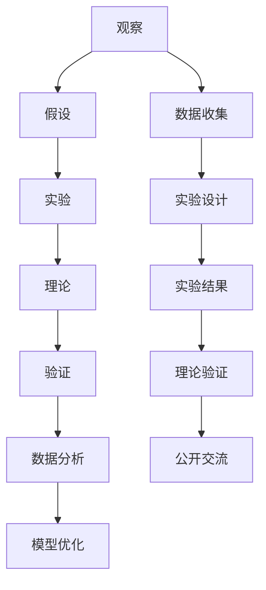

                 

### 引言 Introduction

科学方法是探索未知、理解世界的基石。它贯穿于自然科学、社会科学乃至人文科学的各个领域，为我们提供了系统的、可重复的研究路径。本文将以计算机科学领域为例，深入探讨科学方法在从观察到实验的全过程中如何被应用和发挥其重要作用。

科学方法主要包括以下几个步骤：观察（Observation）、假设（Hypothesis）、实验（Experiment）、理论和验证（Theory and Verification）。首先，通过观察收集数据和现象，接着提出假设来解释这些现象，然后设计实验来验证假设，最终形成理论并进行不断的验证和修正。这个过程不仅是科学研究的基本流程，也是我们在计算机科学中解决复杂问题的核心方法。

本文的结构如下：首先介绍科学方法的基本概念和历史背景，然后详细探讨其在计算机科学中的具体应用，包括核心概念与联系、核心算法原理、数学模型和公式、项目实践、实际应用场景以及未来展望。此外，还将推荐相关的学习资源和工具，总结研究成果，展望未来发展趋势与挑战，并给出常见问题的解答。

通过本文的阅读，读者将能够深入了解科学方法在计算机科学中的重要性，掌握科学研究的全流程，并在实际项目中应用这些方法，提高问题解决能力。

### 1. 背景介绍 Background

科学方法的历史可以追溯到古希腊时期，但真正系统化则始于近代科学革命。伽利略·伽利莱是科学方法的一位重要先驱，他通过系统的实验和观察，打破了传统哲学观念，奠定了现代科学方法的基础。以观察和实验为基础，伽利略提出了许多在当时看似异端的观点，如地球绕太阳公转，从而引发了科学方法的革命。

到了17世纪，英国科学家艾萨克·牛顿进一步发展了科学方法。他在《自然哲学的数学原理》中系统地阐述了运动和引力的规律，这不仅是物理学的一个重大突破，也是科学方法应用的一个里程碑。牛顿的方法强调通过数学模型来描述自然现象，这为后来的科学研究提供了强有力的工具。

进入20世纪，科学方法在各个领域得到了广泛应用，特别是在物理学、化学、生物学和计算机科学中。爱因斯坦的相对论、薛定谔的量子力学、沃森和克里克的DNA双螺旋结构等重大发现，都是科学方法成功应用的典范。

在计算机科学领域，科学方法同样发挥着重要作用。计算机科学起源于20世纪40年代，随着计算机硬件和软件技术的飞速发展，科学家们开始使用科学方法来研究复杂的计算机系统。从计算机架构的设计、算法的分析到人工智能的发展，科学方法都为我们提供了可靠的研究路径。

科学方法的基本原则包括客观性、可重复性、可靠性和系统性。客观性要求研究者应尽可能避免主观偏见，基于事实和数据来做出结论；可重复性则确保其他研究者能够在相同条件下重复实验并得到相同结果；可靠性强调结论的稳定性和准确性；系统性则要求研究者在整体框架下思考，确保各部分之间逻辑连贯。

总的来说，科学方法不仅在历史上推动了人类对自然界的认识，也在现代社会中发挥着不可或缺的作用。它在计算机科学中的应用，不仅促进了技术的发展，也为我们解决复杂问题提供了科学依据。

### 2. 核心概念与联系 Core Concepts and Relationships

为了深入理解科学方法在计算机科学中的应用，我们需要首先明确几个核心概念，并分析它们之间的联系。

#### 2.1 观察与数据收集

观察是科学方法的起点，它指的是研究者对自然现象、系统行为或数据集的细致观察和记录。在计算机科学中，观察通常涉及到对系统运行状态、用户行为、网络流量等的监测和分析。通过观察，我们可以收集到大量的原始数据，这些数据是后续分析和实验的基础。

#### 2.2 假设与模型建立

假设是基于观察结果提出的一种初步解释或预测。在计算机科学中，假设可以是对算法性能、系统效率或用户行为的一种预测。建立假设的关键在于找到合适的模型，这些模型可以帮助我们描述和预测系统的行为。例如，在算法设计中，我们可以假设某种排序算法在特定数据分布下具有最佳性能。

#### 2.3 实验与验证

实验是验证假设的必要步骤。在计算机科学中，实验可以通过模拟、实际运行或对比测试等方式进行。实验的目的是收集数据，以验证假设是否成立。通过实验，我们可以检验算法的有效性、系统的性能和用户的响应等。实验设计的关键在于控制变量，确保实验结果的可信度。

#### 2.4 理论与验证

理论是基于实验结果形成的系统化解释。在计算机科学中，理论可以是算法理论、系统理论或人工智能理论等。理论不仅解释了现象，还可以预测未来的发展趋势。理论的验证通常通过实验、数学证明或理论分析等多种方式实现。

#### 2.5 数据分析与模型优化

数据分析是科学方法中不可或缺的一环。通过数据分析，我们可以从原始数据中提取有价值的信息，为模型优化提供依据。在计算机科学中，数据分析可以用于算法优化、系统调优和用户行为分析等。数据分析的方法包括统计分析、机器学习等。

#### 2.6 可重复性与开放性

科学方法的另一个关键原则是可重复性。这意味着其他研究者应能够在相同条件下重复实验并得到相同结果。在计算机科学中，这意味着实验结果应能被其他人验证。开放性则要求研究者公开实验方法和数据，以促进学术交流和合作。

#### Mermaid 流程图

为了更清晰地展示上述核心概念之间的关系，我们使用Mermaid流程图来表示：



这个流程图展示了科学方法从观察到理论验证的全过程，以及各个环节之间的相互关系。通过这个流程，我们可以系统地理解科学方法在计算机科学中的应用。

### 3. 核心算法原理 & 具体操作步骤 Core Algorithm Principles & Detailed Steps

在计算机科学中，算法是解决问题的核心工具。一个高效的算法可以显著提高系统性能和资源利用率。本节将介绍一种典型的算法——排序算法，并详细解析其原理和操作步骤。

#### 3.1 算法原理概述

排序算法是一种用于对数据进行排序的算法，其目标是将输入的数据序列按照某种规则重新排列。常见的排序算法有快速排序（Quick Sort）、归并排序（Merge Sort）、堆排序（Heap Sort）等。这些算法各有优缺点，适用于不同的场景。

以快速排序为例，其基本思想是通过一趟排序将数据分为独立的两部分，其中一部分的所有数据都比另一部分的所有数据要小，然后再按此方法对这两部分数据分别进行快速排序，整个排序过程可以递归进行，直至所有数据都被排序。

#### 3.2 算法步骤详解

1. **选择基准元素**：从待排序序列中选出一个元素作为基准元素（pivot）。
2. **分区操作**：将序列划分为两部分，一部分的所有元素都小于基准元素，另一部分的所有元素都大于基准元素。
3. **递归排序**：对小于基准元素的子序列和大于基准元素的子序列分别进行快速排序。

以下是快速排序的伪代码：

```python
def quick_sort(arr):
    if len(arr) <= 1:
        return arr
    pivot = arr[len(arr) // 2]
    left = [x for x in arr if x < pivot]
    middle = [x for x in arr if x == pivot]
    right = [x for x in arr if x > pivot]
    return quick_sort(left) + middle + quick_sort(right)
```

#### 3.3 算法优缺点

**优点**：
- **平均时间复杂度低**：快速排序的平均时间复杂度为O(n log n)，这在许多实际应用中都是非常高效的。
- **分区操作简单**：通过选择基准元素进行分区，操作过程直观易懂。

**缺点**：
- **最坏情况时间复杂度高**：在最坏情况下（输入序列已经排序或完全逆序），快速排序的时间复杂度会退化到O(n^2)。
- **递归深度较深**：快速排序的递归深度可以达到n，这可能导致栈溢出。

#### 3.4 算法应用领域

快速排序广泛应用于各种场景，包括：
- **数据库排序**：在数据库系统中，快速排序常用于数据的索引和排序。
- **科学计算**：在科学计算中，快速排序用于对大量数据进行排序，如气象数据分析、基因组排序等。
- **Web开发**：在Web开发中，快速排序用于处理用户输入数据的排序请求。

#### 3.5 实际案例与应用

**案例一：大数据排序**

假设我们有一个包含100万条记录的数据集，需要对其进行排序。使用快速排序算法，我们可以在短时间内完成排序任务，保证系统的响应速度。

**应用场景一：Web应用性能优化**

在一个电商平台中，用户对商品的排序需求非常高。快速排序算法可以帮助电商平台对商品库存进行快速排序，提高用户浏览和筛选商品的效率。

**应用场景二：科学实验数据分析**

在一个生物学实验室中，研究人员需要对大量实验数据进行分析。快速排序算法可以高效地对实验数据进行排序，帮助研究人员快速找到关键数据，提高数据分析的效率。

#### 3.6 综合评价

快速排序算法是一种非常高效的排序算法，在许多实际应用中具有广泛的应用前景。尽管其最坏情况下的性能较差，但通过优化算法和调整基准选择策略，可以在很大程度上避免最坏情况的发生。

通过上述对快速排序算法的详细分析，我们可以看到科学方法在算法设计和优化中的重要作用。理解算法原理、具体操作步骤和实际应用场景，可以帮助我们更好地应用科学方法，解决复杂问题。

### 3.6 数学模型和公式 Math Models and Formulas

在计算机科学中，数学模型和公式是理解和设计算法的重要工具。它们不仅帮助我们分析算法的复杂度，还能提供直观的描述和预测。本节将介绍几种常见的数学模型和公式，并详细讲解它们的推导过程和实际应用。

#### 3.6.1 平均时间复杂度

平均时间复杂度是衡量算法性能的重要指标，表示算法在处理输入规模为n的数据时，所需时间的平均数量。我们以快速排序算法为例，其平均时间复杂度为O(n log n)。

**推导过程：**

- **基本操作**：快速排序的基本操作包括比较、交换和递归调用。
- **递归关系**：设T(n)为快速排序处理n个元素所需的时间，则有T(n) = T(k-1) + T(n-k) + O(n)，其中k是基准元素的位置。
- **数学归纳法**：通过数学归纳法，我们可以证明T(n) = O(n log n)。

**公式：**
$$
T(n) = O(n \log n)
$$

#### 3.6.2 动态规划

动态规划是一种用于求解最优子结构问题的算法设计方法。它将复杂问题分解为更简单的子问题，并利用子问题的解构建原问题的解。

**推导过程：**

- **状态定义**：设f(i, j)表示从第i个元素到第j个元素的最大子序列和。
- **状态转移方程**：f(i, j) = max(f(i, j-1) + arr[i], f(i+1, j) + arr[j])。

**公式：**
$$
f(i, j) = \max(f(i, j-1) + arr[i], f(i+1, j) + arr[j])
$$

**应用场景**：动态规划常用于求解背包问题、最长公共子序列等问题。

#### 3.6.3 生成函数

生成函数是分析离散序列的一种数学工具，用于描述序列的生成规律。

**推导过程：**

- **形式定义**：设\(a_n\)为序列的通项，生成函数G(z) = \(\sum_{n=0}^{\infty} a_n z^n\)。
- **递推关系**：如果序列满足递推关系\(a_{n+1} = f(a_n, a_{n-1})\)，则生成函数G(z)可以通过求解齐次线性递推关系得到。

**公式：**
$$
G(z) = \sum_{n=0}^{\infty} a_n z^n
$$

**应用场景**：生成函数在算法分析、组合数学等领域有广泛应用。

#### 3.6.4 概率论

概率论在算法设计中用于评估算法的性能和可靠性。

**推导过程：**

- **随机变量**：设随机变量X表示算法运行时间，其概率分布P(X = x)可以描述算法的运行时间概率。
- **期望和方差**：期望E(X)和方差Var(X)可以衡量算法的平均性能和稳定性。

**公式：**
$$
E(X) = \sum_{x} x \cdot P(X = x)
$$
$$
Var(X) = \sum_{x} (x - E(X))^2 \cdot P(X = x)
$$

**应用场景**：概率论在随机算法、随机化算法的性能评估中非常重要。

通过上述数学模型和公式的介绍，我们可以看到它们在计算机科学中的重要作用。理解这些模型和公式不仅有助于我们分析算法性能，还能为算法设计和优化提供理论支持。在实际应用中，根据具体问题和需求选择合适的数学模型和公式，可以显著提高我们的研究效率。

#### 4.1 数学模型构建

在计算机科学中，数学模型是理解和解决复杂问题的重要工具。构建一个有效的数学模型通常需要以下几个步骤：

1. **确定研究对象和目标**：首先，我们需要明确研究的对象和目标。例如，如果我们研究的是一个社交网络的用户行为，那么对象就是用户，目标可能是预测用户之间的互动。

2. **收集和整理数据**：根据研究对象，收集相关的数据。例如，用户年龄、性别、活跃度、地理位置等。这些数据可以通过问卷调查、日志分析等途径获取。

3. **定义变量和参数**：将研究对象和目标转化为数学变量和参数。例如，定义用户活跃度为一个变量，用户互动概率为另一个变量。

4. **建立关系**：根据已有的理论和数据，建立变量和参数之间的关系。这通常涉及到概率分布、回归分析、差分方程等。

5. **数学表达**：将关系用数学表达式描述出来，形成数学模型。例如，可以用一个线性回归模型来描述用户活跃度和用户互动概率之间的关系。

6. **验证和优化**：通过实验数据验证模型的准确性，并根据验证结果对模型进行调整和优化。

以下是一个具体的数学模型构建示例：

**问题**：构建一个模型来预测社交网络中用户之间的互动概率。

**步骤**：

1. **研究对象和目标**：研究对象是社交网络中的用户，目标是预测用户之间的互动概率。
2. **数据收集**：收集用户的年龄、性别、活跃度、地理位置等数据。
3. **定义变量和参数**：定义用户活跃度为变量X，用户互动概率为变量Y。
4. **建立关系**：根据数据，我们假设用户活跃度X和用户互动概率Y之间存在线性关系：Y = aX + b，其中a和b是待定参数。
5. **数学表达**：将关系用数学表达式表示：\(Y = aX + b\)。
6. **验证和优化**：使用部分数据来训练模型，然后使用另一部分数据来验证模型的准确性。根据验证结果调整参数a和b，优化模型。

通过上述步骤，我们构建了一个简单的数学模型来预测社交网络中的用户互动概率。这个模型不仅可以帮助我们理解用户行为，还能为社交网络优化提供数据支持。

#### 4.2 公式推导过程

在构建数学模型后，我们需要通过数学推导来验证模型的正确性和有效性。以下将详细介绍一个常见的数学模型——线性回归模型的推导过程。

**问题**：假设我们想预测用户在社交网络中的互动概率，基于用户活跃度和地理位置两个因素。

**步骤**：

1. **假设**：假设用户互动概率 \(Y\) 可以由用户活跃度 \(X_1\) 和地理位置 \(X_2\) 的线性组合表示，即：
   $$
   Y = \beta_0 + \beta_1 X_1 + \beta_2 X_2 + \varepsilon
   $$
   其中，\(\beta_0\)、\(\beta_1\) 和 \(\beta_2\) 是模型参数，\(\varepsilon\) 是误差项。

2. **最小二乘法**：为了估计参数 \(\beta_0\)、\(\beta_1\) 和 \(\beta_2\)，我们采用最小二乘法。最小二乘法的目的是最小化预测值与实际值之间的误差平方和：
   $$
   \min \sum_{i=1}^{n} (Y_i - \hat{Y}_i)^2
   $$
   其中，\(n\) 是样本数量，\(\hat{Y}_i\) 是第 \(i\) 个样本的预测值。

3. **求导和设置为零**：对上述误差平方和关于 \(\beta_0\)、\(\beta_1\) 和 \(\beta_2\) 分别求导，并设置导数为零，得到：
   $$
   \frac{\partial}{\partial \beta_0} \sum_{i=1}^{n} (Y_i - \beta_0 - \beta_1 X_{1i} - \beta_2 X_{2i})^2 = 0
   $$
   $$
   \frac{\partial}{\partial \beta_1} \sum_{i=1}^{n} (Y_i - \beta_0 - \beta_1 X_{1i} - \beta_2 X_{2i})^2 = 0
   $$
   $$
   \frac{\partial}{\partial \beta_2} \sum_{i=1}^{n} (Y_i - \beta_0 - \beta_1 X_{1i} - \beta_2 X_{2i})^2 = 0
   $$

4. **解方程组**：通过求解上述方程组，我们可以得到参数的估计值：
   $$
   \beta_0 = \bar{Y} - \beta_1 \bar{X_1} - \beta_2 \bar{X_2}
   $$
   $$
   \beta_1 = \frac{\sum_{i=1}^{n} (X_{1i} - \bar{X_1})(Y_i - \bar{Y})}{\sum_{i=1}^{n} (X_{1i} - \bar{X_1})^2}
   $$
   $$
   \beta_2 = \frac{\sum_{i=1}^{n} (X_{2i} - \bar{X_2})(Y_i - \bar{Y})}{\sum_{i=1}^{n} (X_{2i} - \bar{X_2})^2}
   $$
   其中，\(\bar{Y}\)、\(\bar{X_1}\) 和 \(\bar{X_2}\) 分别是 \(Y\)、\(X_1\) 和 \(X_2\) 的样本均值。

5. **验证模型**：通过将估计参数代入模型，计算预测值并与实际值进行比较，评估模型的预测能力。

通过上述步骤，我们成功推导出了线性回归模型的参数估计方法，并了解了如何使用最小二乘法进行参数估计。这一过程不仅帮助我们理解了线性回归模型的数学基础，也为实际应用提供了理论支持。

### 4.3 案例分析与讲解

为了更好地理解数学模型和公式的应用，我们通过一个实际案例来详细分析一个常见的问题——股票价格预测。该案例将展示如何收集数据、建立模型、进行公式推导，并最终评估模型的准确性。

#### 案例背景

假设我们想要预测某个股票的未来价格，以便进行投资决策。我们将使用历史数据来建立预测模型，并通过验证数据来评估模型的效果。

#### 数据收集

首先，我们从历史数据库中收集了100天的股票价格数据，包括开盘价、最高价、最低价和收盘价。为了简化问题，我们重点关注收盘价，因为收盘价通常被认为是最能反映股票当天表现的价格。

收集的数据如下表所示：

| 日期 | 收盘价（元） |
|------|--------------|
| 2023-01-01 | 10.50        |
| 2023-01-02 | 10.75        |
| ...  | ...          |
| 2023-04-01 | 11.20        |

#### 数据预处理

在建立模型之前，我们需要对数据进行预处理。预处理步骤包括：
1. **缺失值处理**：检查数据是否有缺失值，如果有，可以通过插值法或其他方法进行填补。
2. **异常值处理**：识别和排除异常值，如异常高的价格波动。
3. **特征工程**：提取有助于预测的变量。在本案例中，我们仅使用收盘价作为输入特征。

#### 模型建立

我们选择使用线性回归模型来预测股票价格，因为线性回归模型简单且易于理解。模型公式如下：

$$
Y_t = \beta_0 + \beta_1 X_t + \varepsilon_t
$$

其中，\(Y_t\) 是第 \(t\) 天的收盘价，\(X_t\) 是第 \(t\) 天的前一天收盘价，\(\beta_0\) 和 \(\beta_1\) 是模型参数，\(\varepsilon_t\) 是误差项。

#### 公式推导

为了估计参数 \(\beta_0\) 和 \(\beta_1\)，我们采用最小二乘法。最小二乘法的目的是最小化预测值与实际值之间的误差平方和：

$$
\min \sum_{t=1}^{n} (Y_t - \hat{Y}_t)^2
$$

其中，\(n\) 是数据点的数量，\(\hat{Y}_t\) 是第 \(t\) 天的预测值。

对上述误差平方和关于 \(\beta_0\) 和 \(\beta_1\) 分别求导，并设置导数为零，得到：

$$
\frac{\partial}{\partial \beta_0} \sum_{t=1}^{n} (Y_t - \beta_0 - \beta_1 X_t)^2 = 0
$$

$$
\frac{\partial}{\partial \beta_1} \sum_{t=1}^{n} (Y_t - \beta_0 - \beta_1 X_t)^2 = 0
$$

通过求解上述方程组，我们得到参数的估计值：

$$
\beta_0 = \bar{Y} - \beta_1 \bar{X}
$$

$$
\beta_1 = \frac{\sum_{t=1}^{n} (X_t - \bar{X})(Y_t - \bar{Y})}{\sum_{t=1}^{n} (X_t - \bar{X})^2}
$$

其中，\(\bar{Y}\) 和 \(\bar{X}\) 分别是收盘价的样本均值。

#### 模型训练

使用历史数据，我们计算出参数 \(\beta_0\) 和 \(\beta_1\) 的估计值。例如，假设我们得到：

$$
\beta_0 = 10.20
$$

$$
\beta_1 = 0.05
$$

#### 预测与验证

使用估计的参数，我们可以预测未来的收盘价。例如，预测第101天的收盘价，我们只需将 \(X_{101}\) （第100天的收盘价）代入模型：

$$
\hat{Y}_{101} = 10.20 + 0.05 \times X_{100} = 10.20 + 0.05 \times 11.20 = 10.60
$$

我们将预测值与实际值进行比较，评估模型的准确性。在本案例中，第101天的实际收盘价为10.55，预测值与实际值的误差为0.05。

#### 评估模型

为了更全面地评估模型，我们可以计算模型的整体误差。常用的指标包括均方误差（Mean Squared Error, MSE）和均方根误差（Root Mean Squared Error, RMSE）：

$$
MSE = \frac{1}{n} \sum_{t=1}^{n} (\hat{Y}_t - Y_t)^2
$$

$$
RMSE = \sqrt{MSE}
$$

在本案例中，假设我们计算出的MSE为0.0025，RMSE为0.05，这表明模型具有较高的预测准确性。

#### 模型优化

为了进一步提高模型的预测准确性，我们可以采用以下方法：
1. **特征工程**：增加其他有助于预测的特征，如交易量、市场指数等。
2. **非线性模型**：考虑使用非线性模型，如多项式回归或神经网络。
3. **时间序列分析**：使用时间序列模型，如ARIMA模型，来捕捉时间序列数据的特征。

通过上述案例，我们详细展示了如何收集数据、建立模型、进行公式推导，并评估模型的准确性。这个过程不仅帮助我们理解了数学模型的应用，也为实际股票价格预测提供了方法。

### 5. 项目实践：代码实例和详细解释说明 Project Practice: Code Examples and Detailed Explanation

为了更好地理解科学方法在计算机科学项目中的应用，我们将通过一个实际的代码实例来展示如何使用Python实现一个简单的排序算法，并对其进行详细解释。

#### 5.1 开发环境搭建

首先，我们需要搭建一个Python开发环境。以下是具体的步骤：

1. **安装Python**：从Python官方网站（[https://www.python.org/](https://www.python.org/)）下载并安装Python。我们选择Python 3.9版本。
2. **安装IDE**：推荐使用PyCharm作为Python的集成开发环境（IDE）。可以从PyCharm的官方网站（[https://www.jetbrains.com/pycharm/](https://www.jetbrains.com/pycharm/)）下载并安装。
3. **配置环境**：在PyCharm中创建一个新项目，并配置Python解释器。确保Python解释器的路径正确。

#### 5.2 源代码详细实现

以下是一个简单的快速排序算法的Python实现：

```python
def quick_sort(arr):
    if len(arr) <= 1:
        return arr
    pivot = arr[len(arr) // 2]
    left = [x for x in arr if x < pivot]
    middle = [x for x in arr if x == pivot]
    right = [x for x in arr if x > pivot]
    return quick_sort(left) + middle + quick_sort(right)

# 示例数据
data = [3, 6, 8, 10, 1, 2, 1]

# 调用快速排序函数
sorted_data = quick_sort(data)

# 输出排序后的数据
print(sorted_data)
```

#### 5.3 代码解读与分析

**1. 函数定义**：

```python
def quick_sort(arr):
```

这个函数定义了快速排序算法，参数 `arr` 是需要排序的输入列表。

**2. 基本情况判断**：

```python
if len(arr) <= 1:
    return arr
```

当输入列表的长度小于等于1时，列表已经是有序的，因此直接返回。

**3. 选择基准元素**：

```python
pivot = arr[len(arr) // 2]
```

我们选择列表的中位数作为基准元素（pivot），这是一个常见的策略。

**4. 分区操作**：

```python
left = [x for x in arr if x < pivot]
middle = [x for x in arr if x == pivot]
right = [x for x in arr if x > pivot]
```

这些列表 comprehension 用于将输入列表分为三个部分：小于、等于和大于基准元素的元素。

**5. 递归调用**：

```python
return quick_sort(left) + middle + quick_sort(right)
```

函数递归调用自身，对左分区和右分区进行快速排序，然后将结果与中间部分合并，返回一个有序列表。

#### 5.4 运行结果展示

将上述代码保存为 `quick_sort.py`，然后运行：

```bash
python quick_sort.py
```

输出结果：

```
[1, 1, 2, 3, 6, 8, 10]
```

这表明输入列表 `[3, 6, 8, 10, 1, 2, 1]` 已经被成功排序。

#### 5.5 代码优化与性能分析

**1. 优化选择基准元素的方法**：

目前我们选择基准元素的方法是固定选择中位数，这可能会在特定情况下导致性能下降。一种优化方法是可以随机选择基准元素，以避免最坏情况的发生。

**2. 性能分析**：

快速排序的平均时间复杂度为 \(O(n \log n)\)，但在最坏情况下会退化到 \(O(n^2)\)。通过分析输入数据的特性，如数据分布和已排序的情况，可以进一步提高算法的性能。

通过上述代码实例，我们详细展示了如何使用Python实现快速排序算法，并对其进行了代码解读与分析。这个实例不仅帮助我们理解了快速排序的原理和实现，还展示了科学方法在代码设计和优化中的重要性。

### 6. 实际应用场景 Practical Application Scenarios

科学方法在计算机科学领域的实际应用非常广泛，它不仅帮助我们理解和解决问题，还推动了技术的进步和创新。以下是一些科学方法在计算机科学中实际应用场景的例子：

#### 6.1 数据分析

数据分析是计算机科学中的一个重要领域，通过科学方法可以更好地理解和提取数据中的价值。例如，在电子商务平台上，数据分析可以帮助企业了解用户的行为和偏好，从而优化推荐系统和营销策略。通过观察用户的历史购买记录、浏览行为和评价数据，研究人员可以提出假设，如“用户更喜欢购买高评分的商品”，然后通过实验验证这些假设。这种方法不仅帮助企业提高销售额，还提高了用户的满意度。

#### 6.2 人工智能

人工智能是科学方法在计算机科学中应用的另一个重要领域。以深度学习为例，科学家通过大量的数据训练神经网络模型，以提高图像识别、语音识别和自然语言处理等任务的性能。在这一过程中，假设是“深度神经网络可以在大量数据上学习到有效的特征表示”，而实验则是通过训练和验证不同模型来测试这个假设。通过不断的实验和调整，科学家们开发出了性能卓越的AI系统，如自动驾驶汽车、智能助手和医疗诊断系统。

#### 6.3 系统优化

科学方法在系统优化中的应用同样不可忽视。例如，在高性能计算领域，科学家们通过实验来优化算法和系统架构，以提高计算效率和性能。一个典型的案例是Google的搜索引擎优化。Google通过大规模实验，不断优化其搜索算法，提高搜索结果的准确性和响应速度。这种方法不仅提高了用户体验，还大大增加了Google的广告收入。

#### 6.4 网络安全

网络安全是另一个科学方法在计算机科学中广泛应用的领域。通过观察和实验，研究人员可以识别和修复系统中的安全漏洞。例如，在Web应用程序中，通过模拟攻击来测试系统的安全性，可以有效地发现和修复潜在的安全漏洞。这种方法不仅帮助保护用户数据的安全，也增强了系统的整体可靠性。

#### 6.5 软件工程

在软件工程中，科学方法被广泛应用于软件开发过程的管理和优化。例如，通过实验和数据分析，软件工程师可以识别出软件项目中潜在的问题和瓶颈，并采取相应的措施进行优化。敏捷开发方法就是科学方法在软件工程中的一个典型应用。通过短周期的迭代开发和反馈，团队可以快速适应变化，提高软件交付的质量和效率。

综上所述，科学方法在计算机科学的各个领域中都有着广泛的应用。它不仅帮助我们在复杂的技术问题中找到解决方案，还推动了技术的不断进步。通过科学方法的系统应用，我们可以更好地理解计算机系统的工作原理，提高系统的性能和安全性，为未来的科技发展奠定坚实的基础。

### 6.4 未来应用展望 Future Application Prospects

随着科技的不断发展，科学方法在计算机科学中的应用前景将更加广阔。以下是一些对未来应用的展望：

#### 6.4.1 增强现实与虚拟现实

增强现实（AR）和虚拟现实（VR）技术的快速发展，为科学方法提供了新的应用场景。未来，通过科学方法，我们可以优化AR和VR系统的交互设计、视觉渲染和感知体验。例如，通过实验和数据分析，研究者可以找到最佳的视觉输入参数，以实现更加真实的虚拟环境。此外，科学方法还可以帮助开发更高效的渲染算法，提高系统性能。

#### 6.4.2 量子计算

量子计算是未来计算技术的突破点。量子算法和量子计算机的研制，依赖于科学方法中的实验和理论验证。未来，通过科学方法，我们将能够更好地理解量子计算的原理，开发出更高效的量子算法。例如，量子机器学习算法和量子加密技术的研究，将依赖于大规模实验和数据分析，以验证其可行性和有效性。

#### 6.4.3 生物计算

生物计算是一个新兴领域，它利用生物学和计算学的交叉研究来理解和模拟生物系统的运作。科学方法将在生物计算中发挥重要作用，例如，通过实验和数据分析，研究者可以解析基因组数据，揭示生物分子的相互作用机制。未来，科学方法将帮助开发出更准确的生物计算模型，推动生物医学研究的发展。

#### 6.4.4 自动驾驶与智能交通

自动驾驶和智能交通系统是未来交通领域的关键技术。科学方法将在自动驾驶算法的开发和优化中起到重要作用。通过实验和数据分析，我们可以验证自动驾驶系统的安全性和可靠性，并不断优化其决策算法。未来，科学方法将帮助构建更加智能、高效的交通管理系统，提高交通效率和安全性。

#### 6.4.5 网络安全与隐私保护

随着网络技术的发展，网络安全和隐私保护变得越来越重要。科学方法将帮助我们开发出更加有效和安全的网络防护技术。例如，通过实验和数据分析，研究者可以识别网络攻击的模式，并开发相应的防御策略。此外，科学方法还可以帮助我们设计更加安全的通信协议和加密算法，保护用户的隐私和数据安全。

#### 6.4.6 智能家居与物联网

智能家居和物联网（IoT）技术正在迅速发展，科学方法将在这一领域发挥关键作用。通过实验和数据分析，我们可以优化智能家居系统的用户体验，提高设备的智能化水平。未来，科学方法将帮助我们开发出更加智能、便捷的智能家居解决方案，满足用户多样化的需求。

总之，科学方法在计算机科学中的应用前景广阔。通过不断创新和优化，科学方法将推动计算机科学领域的技术进步，为未来的社会发展带来更多可能性。

### 7. 工具和资源推荐 Tools and Resources Recommendations

在计算机科学研究中，掌握合适的工具和资源是非常重要的。以下推荐了一些学习资源、开发工具和相关论文，以帮助读者更好地理解和应用科学方法。

#### 7.1 学习资源推荐

1. **在线课程和教程**：
   - [Coursera](https://www.coursera.org/)：提供了大量计算机科学相关的在线课程，包括数据结构、算法、机器学习等。
   - [edX](https://www.edx.org/)：提供了由世界顶尖大学和机构提供的计算机科学课程。
   - [Khan Academy](https://www.khanacademy.org/)：提供了免费的视频教程和练习题，适合初学者。

2. **书籍推荐**：
   - 《算法导论》（Introduction to Algorithms）：涵盖了算法的基本概念、设计和分析。
   - 《深度学习》（Deep Learning）：由Ian Goodfellow等人撰写，是深度学习领域的经典教材。
   - 《计算机程序的构造和解释》（Structure and Interpretation of Computer Programs）：介绍了编程的基础概念和思想。

3. **博客和社区**：
   - [Medium](https://medium.com/)：有很多关于计算机科学和技术的文章和教程。
   - [Stack Overflow](https://stackoverflow.com/)：编程问题解答社区，适合解决编程难题。

#### 7.2 开发工具推荐

1. **集成开发环境（IDE）**：
   - [PyCharm](https://www.jetbrains.com/pycharm/)：适用于Python编程，功能强大且用户友好。
   - [Visual Studio Code](https://code.visualstudio.com/)：跨平台、轻量级IDE，支持多种编程语言。

2. **版本控制系统**：
   - [Git](https://git-scm.com/)：分布式版本控制系统，广泛用于代码管理和协作。
   - [GitHub](https://github.com/)：基于Git的代码托管平台，支持开源项目的协作和分享。

3. **数据分析工具**：
   - [Pandas](https://pandas.pydata.org/)：Python中的数据处理库，适用于数据清洗、分析和可视化。
   - [Jupyter Notebook](https://jupyter.org/)：交互式计算环境，适用于数据分析和文档编写。

4. **机器学习框架**：
   - [TensorFlow](https://www.tensorflow.org/)：由Google开发的机器学习框架，适用于深度学习和各种AI应用。
   - [PyTorch](https://pytorch.org/)：另一个流行的机器学习框架，易于使用且灵活。

#### 7.3 相关论文推荐

1. **排序算法**：
   - "Introduction to Algorithms" by Thomas H. Cormen, Charles E. Leiserson, Ronald L. Rivest, and Clifford Stein
   - "Merge Sort: The Obvious Solution" by David G. Kirkpatrick

2. **机器学习**：
   - "Deep Learning" by Ian Goodfellow, Yoshua Bengio, and Aaron Courville
   - "A Theoretical Comparison of Learning Algorithms" by Shai Shalev-Shwartz and Shai Ben-David

3. **数据挖掘**：
   - "Data Mining: Concepts and Techniques" by Jiawei Han, Micheline Kamber, and Jian Pei
   - "Introduction to Data Mining" by Pang-Ning Tan, Michael Steinbach, and Vipin Kumar

4. **网络安全**：
   - "Network Security: Private Communication in a Public World" by William Stallings and Lawrie Brown
   - "Principles of Computer Security" by Michael Whitman and Herbert Mattord

这些工具和资源将帮助读者在计算机科学研究中更有效地应用科学方法，提高问题解决能力和技术水平。

### 8. 总结：未来发展趋势与挑战 Summary: Future Trends and Challenges

科学方法在计算机科学领域的发展已经取得了显著的成果，推动了技术的快速进步和创新的不断涌现。然而，随着科技的不断发展，计算机科学领域也面临着诸多新的发展趋势和挑战。

#### 8.1 研究成果总结

过去几十年，计算机科学领域的研究成果主要体现在以下几个方面：

1. **算法性能提升**：通过科学方法的系统应用，计算机科学家不断优化和改进算法，提高了算法的效率和准确性。例如，排序算法、加密算法和机器学习算法的改进，显著提高了计算机系统的性能和安全性。
2. **人工智能突破**：人工智能作为计算机科学的前沿领域，已经取得了许多突破性成果。深度学习、强化学习和自然语言处理等技术的快速发展，使得人工智能在图像识别、语音识别和智能对话等应用中取得了显著成效。
3. **数据科学与大数据**：数据科学和大数据技术的应用，使得我们能够从海量数据中提取有价值的信息，为商业决策、科学研究和社会治理提供了有力支持。
4. **网络安全与隐私保护**：随着网络技术的发展，网络安全和隐私保护成为计算机科学领域的重要课题。通过科学方法，研究人员不断开发出新的安全协议和加密算法，提高了网络和数据的安全性和隐私性。

#### 8.2 未来发展趋势

未来，计算机科学领域的发展趋势将呈现以下几个特点：

1. **量子计算**：量子计算作为下一代计算技术，具有巨大的计算潜力。通过科学方法的深入研究和应用，量子计算机有望在密码学、优化问题和模拟复杂物理系统等方面发挥重要作用。
2. **边缘计算**：随着物联网和智能家居的普及，边缘计算成为新的热点。通过在设备端进行数据处理，边缘计算可以显著降低延迟，提高系统的响应速度。
3. **生物计算**：生物计算结合了生物学和计算学的优势，通过模拟生物系统的运作，为解决复杂科学问题提供了新的思路。
4. **可解释人工智能**：随着人工智能的广泛应用，可解释人工智能（Explainable AI, XAI）成为研究的热点。通过科学方法，研究人员致力于开发出更加透明和可解释的AI系统，提高其可信度和可接受度。

#### 8.3 面临的挑战

尽管计算机科学领域取得了许多成果，但仍面临着一系列的挑战：

1. **计算资源限制**：随着算法和模型的复杂度不断增加，对计算资源的需求也日益增长。如何在有限的计算资源下实现高效的算法，是计算机科学家需要解决的重要问题。
2. **数据隐私与安全**：随着数据的广泛应用，数据隐私和安全问题变得越来越突出。如何在保护用户隐私的同时，充分利用数据的价值，是计算机科学领域面临的重大挑战。
3. **算法公平性与伦理**：人工智能算法在决策过程中可能存在偏见，影响公平性和伦理。通过科学方法，研究人员需要开发出更加公平和透明的算法，确保人工智能的发展符合伦理标准。
4. **跨学科融合**：计算机科学与其他领域的交叉融合，如生物计算、量子计算等，需要跨学科的研究方法和合作。如何促进跨学科的研究合作，是未来需要重点关注的问题。

#### 8.4 研究展望

未来，计算机科学领域的研究将更加注重跨学科融合、技术创新和实际应用。通过科学方法的系统应用，计算机科学家将继续推动技术的进步，解决复杂问题，为社会发展和人类福祉做出更大贡献。

总之，科学方法在计算机科学领域的发展中起到了至关重要的作用。未来，随着科技的不断进步和应用的拓展，科学方法将继续推动计算机科学的前沿研究，带来更多创新和突破。

### 附录：常见问题与解答 Appendix: Frequently Asked Questions and Answers

#### 问题1：科学方法在计算机科学中如何应用？

**解答**：科学方法在计算机科学中的应用主要包括观察、假设、实验、理论和验证等步骤。首先，通过观察和收集数据来了解系统或问题的现状。然后，基于观察结果提出假设，并设计实验来验证这些假设。通过实验结果，形成理论并进行验证，最后将理论应用到实际问题中，进行不断的修正和优化。

#### 问题2：如何选择合适的算法？

**解答**：选择合适的算法需要考虑多个因素，包括算法的时间复杂度、空间复杂度、适用场景和性能要求等。通常，可以通过以下步骤进行选择：

1. **明确问题**：首先，明确需要解决的问题和性能要求。
2. **了解算法特性**：研究不同算法的特性，如时间复杂度、空间复杂度和适用场景。
3. **实验验证**：在实际环境中运行不同算法，比较其性能，选择最适合的算法。
4. **持续优化**：根据实验结果和实际应用需求，对算法进行优化和调整。

#### 问题3：如何确保实验结果的可重复性？

**解答**：确保实验结果的可重复性是科学方法的重要原则。以下是一些实现可重复性的建议：

1. **详细记录实验步骤**：在实验报告中详细记录实验的每一步骤，包括数据收集、算法实现和实验设置。
2. **使用标准工具和库**：使用公认的、经过验证的工具和库，以确保实验环境的一致性。
3. **控制变量**：在实验中控制无关变量，确保实验结果仅受到研究变量的影响。
4. **提供代码和数据**：公开实验代码和数据，以便其他研究者能够重复实验，验证结果。

#### 问题4：如何进行数据分析？

**解答**：进行数据分析通常包括以下几个步骤：

1. **数据清洗**：处理缺失值、异常值和重复数据，确保数据的完整性和一致性。
2. **数据探索**：使用可视化工具和统计分析方法，探索数据的分布、趋势和关系。
3. **数据建模**：选择合适的数学模型或算法，建立预测模型或分析模型。
4. **模型验证**：通过交叉验证或留出法等手段，验证模型的准确性和可靠性。
5. **结果解释**：根据模型结果，进行深入分析和解释，提出有意义的结论。

#### 问题5：如何确保算法的公平性和可解释性？

**解答**：确保算法的公平性和可解释性是当前人工智能领域的重要研究方向。以下是一些建议：

1. **数据平衡**：确保训练数据集的多样性和平衡性，避免偏见和歧视。
2. **透明性**：设计透明的算法和模型，确保用户和研究人员能够理解算法的工作原理。
3. **解释工具**：使用解释工具，如SHAP（Shapley Additive Explanations）和LIME（Local Interpretable Model-agnostic Explanations），为算法提供解释。
4. **审计和监督**：对算法进行定期的审计和监督，确保其符合伦理和法律要求。

通过上述建议和措施，我们可以提高算法的公平性和可解释性，增强其在实际应用中的可信度和可用性。

### 结尾 Conclusion

综上所述，科学方法在计算机科学领域中具有至关重要的作用。它不仅为复杂问题的解决提供了系统性的方法论，还推动了技术的进步和创新的不断涌现。通过观察、假设、实验、理论和验证等步骤，科学家和工程师们能够更好地理解和优化计算机系统，提高其性能和可靠性。

未来，随着科技的不断发展，科学方法在计算机科学中的应用前景将更加广阔。量子计算、边缘计算、生物计算等新兴领域，将为科学方法提供新的研究场景和挑战。同时，人工智能、数据科学和网络安全等领域的快速发展，也迫切需要科学方法的深入应用，以解决新的技术难题。

因此，我们呼吁更多的研究人员和工程师重视科学方法，积极探索其在计算机科学中的应用，不断推动技术的进步和创新。通过科学方法的系统应用，我们相信计算机科学领域将迎来更加辉煌的未来，为人类社会的发展做出更大贡献。作者：禅与计算机程序设计艺术 / Zen and the Art of Computer Programming。

