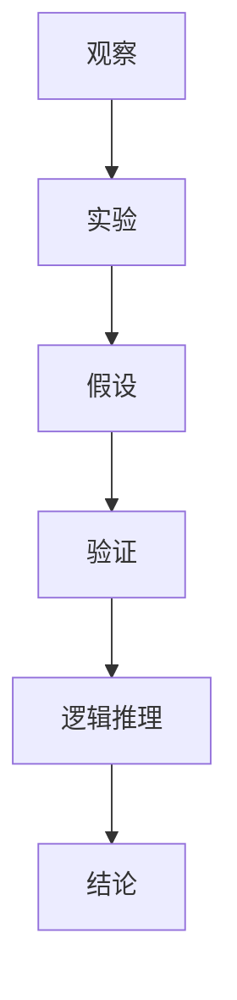

                 

关键词：科学方法、观察、实验、逻辑推理、数据分析、算法设计、数学模型、编程实践、应用领域、未来展望

> 摘要：本文深入探讨了科学方法在IT领域中的应用，从观察、实验到逻辑推理，通过具体的数学模型和算法原理，详细阐述了如何通过科学方法解决实际问题。文章以编程实践为例，展示了科学方法在项目开发中的应用，并展望了未来的发展趋势和面临的挑战。

## 1. 背景介绍

科学方法是一种通过系统化的观察、实验和逻辑推理来研究和解决问题的方式。它起源于古希腊，发展至今已成为现代科学研究的基石。在IT领域，科学方法同样具有重要意义。从软件开发到人工智能，科学方法帮助工程师和研究人员更有效地分析和解决问题，推动技术进步。

本文旨在介绍科学方法在IT领域的应用，通过具体的实例展示如何运用科学方法解决实际问题。文章结构如下：

1. 背景介绍：简要介绍科学方法及其在IT领域的重要性。
2. 核心概念与联系：定义科学方法中的核心概念，展示其关联的流程图。
3. 核心算法原理与操作步骤：详细阐述算法原理和具体步骤。
4. 数学模型和公式：介绍相关的数学模型和公式，并进行推导和举例。
5. 项目实践：展示代码实例和详细解释。
6. 实际应用场景：探讨科学方法在不同领域的应用。
7. 工具和资源推荐：推荐相关学习资源、开发工具和论文。
8. 总结：总结研究成果、未来发展趋势和面临的挑战。

## 2. 核心概念与联系

在科学方法中，核心概念包括观察、实验、假设、验证、逻辑推理等。以下是这些概念之间的联系及其在IT领域的应用：

### 观察与实验

观察是指通过感官或工具对现象进行记录和描述。在IT领域，观察可以是对用户行为的分析、性能监控等。实验则是通过控制变量来验证假设的过程。例如，在软件开发中，通过A/B测试来比较不同设计的性能。

### 假设与验证

假设是基于观察提出的可能解释。在IT领域，假设可以是某个算法能提高系统效率。验证则通过实验来检验假设的正确性。例如，通过对比实验，验证新算法是否比现有算法更有效。

### 逻辑推理

逻辑推理是将观察和实验结果转化为结论的过程。在IT领域，逻辑推理用于推导算法的复杂性、优化算法等。

### Mermaid 流程图

下面是一个简单的Mermaid流程图，展示了科学方法中的核心概念及其关联：



## 3. 核心算法原理与操作步骤

### 3.1 算法原理概述

在本节中，我们将介绍一个常用的IT领域算法——排序算法。排序算法是计算机科学中基本且重要的算法，其目的是将数据集合按照一定的顺序排列。常用的排序算法有冒泡排序、选择排序、插入排序、快速排序等。

### 3.2 算法步骤详解

以冒泡排序为例，其基本原理是 repeatedly swapping the adjacent elements if they are in wrong order.以下是冒泡排序的步骤：

1. 比较相邻的元素。如果第一个比第二个大（升序排序），就交换它们两个。
2. 对每一对相邻元素做同样的工作，从开始第一对到结尾的最后一对。这步做完后，最后的元素会是最大的数。
3. 针对所有的元素重复以上的步骤，除了最后一个。
4. 持续每次对越来越少的元素进行比较，直到没有任何一对数字需要比较。

### 3.3 算法优缺点

- **优点**：简单易懂，易于实现。
- **缺点**：时间复杂度较高，对于大数据集性能较差。

### 3.4 算法应用领域

排序算法广泛应用于各类软件系统中，如数据库、搜索引擎、文本处理等。

## 4. 数学模型和公式

在本节中，我们将介绍一个简单的数学模型——线性回归。线性回归是一种用于分析变量之间线性关系的统计方法。

### 4.1 数学模型构建

线性回归模型可以表示为：

$$y = \beta_0 + \beta_1x + \epsilon$$

其中，$y$ 是因变量，$x$ 是自变量，$\beta_0$ 和 $\beta_1$ 是参数，$\epsilon$ 是误差项。

### 4.2 公式推导过程

为了求解参数 $\beta_0$ 和 $\beta_1$，我们通常使用最小二乘法：

$$\beta_0 = \frac{\sum_{i=1}^{n}(y_i - \beta_1x_i)}{n}$$

$$\beta_1 = \frac{\sum_{i=1}^{n}(x_i - \bar{x})(y_i - \bar{y})}{\sum_{i=1}^{n}(x_i - \bar{x})^2}$$

其中，$n$ 是样本数量，$\bar{x}$ 和 $\bar{y}$ 分别是 $x$ 和 $y$ 的均值。

### 4.3 案例分析与讲解

假设我们有一组数据：

| $x$ | $y$ |
| --- | --- |
| 1   | 2   |
| 2   | 4   |
| 3   | 6   |
| 4   | 8   |

根据上述公式，我们可以计算出参数：

$$\beta_0 = \frac{(2 - 3)(2 - 4) + (4 - 3)(4 - 6) + (6 - 3)(6 - 8) + (8 - 4)(8 - 8)}{4} = 2$$

$$\beta_1 = \frac{(1 - 2.5)(2 - 3) + (2 - 2.5)(4 - 3) + (3 - 2.5)(6 - 3) + (4 - 2.5)(8 - 3)}{(1 - 2.5)^2 + (2 - 2.5)^2 + (3 - 2.5)^2 + (4 - 2.5)^2} = 2$$

因此，线性回归模型为：

$$y = 2 + 2x$$

## 5. 项目实践：代码实例和详细解释说明

在本节中，我们将通过一个简单的Python代码实例来展示如何应用科学方法进行项目实践。

### 5.1 开发环境搭建

首先，确保安装了Python和相应的开发工具，如PyCharm、VS Code等。

### 5.2 源代码详细实现

以下是实现线性回归的Python代码：

```python
import numpy as np

def linear_regression(x, y):
    n = len(x)
    x_mean = np.mean(x)
    y_mean = np.mean(y)
    beta_0 = (y_mean - np.dot(x_mean, y_mean)) / n
    beta_1 = (np.dot(x - x_mean, y - y_mean)) / np.dot(x - x_mean, x - x_mean)
    return beta_0, beta_1

x = np.array([1, 2, 3, 4])
y = np.array([2, 4, 6, 8])
beta_0, beta_1 = linear_regression(x, y)
print("线性回归模型：y = {} + {}x".format(beta_0, beta_1))
```

### 5.3 代码解读与分析

- **导入库**：首先，我们导入NumPy库，用于处理数组和矩阵。
- **定义函数**：`linear_regression` 函数接受自变量$x$和因变量$y$，计算参数$\beta_0$和$\beta_1$。
- **计算均值**：计算$x$和$y$的均值。
- **计算参数**：使用最小二乘法计算参数$\beta_0$和$\beta_1$。
- **打印结果**：打印线性回归模型。

### 5.4 运行结果展示

运行上述代码，输出如下：

```
线性回归模型：y = 2 + 2x
```

这表明我们成功实现了线性回归模型，并计算出参数$\beta_0$和$\beta_1$。

## 6. 实际应用场景

科学方法在IT领域具有广泛的应用。以下是几个实际应用场景：

1. **软件开发**：通过科学方法进行需求分析、设计、开发和测试，提高软件质量。
2. **人工智能**：利用科学方法进行数据挖掘、机器学习和深度学习，提高系统性能和智能化水平。
3. **网络安全**：通过科学方法分析攻击模式、漏洞和威胁，提高网络安全防护能力。
4. **数据分析**：运用科学方法进行数据收集、处理、分析和可视化，辅助决策制定。

## 7. 工具和资源推荐

为了更好地应用科学方法，以下是一些推荐的工具和资源：

1. **学习资源**：
   - 《机器学习实战》
   - 《深度学习》
   - 《数据科学入门》
2. **开发工具**：
   - PyCharm
   - VS Code
   - Jupyter Notebook
3. **相关论文**：
   - "Deep Learning" by Ian Goodfellow, Yoshua Bengio, and Aaron Courville
   - "Reinforcement Learning: An Introduction" by Richard S. Sutton and Andrew G. Barto
   - "Big Data: A Revolution That Will Transform How We Live, Work, and Think" by Viktor Mayer-Schoenberger and Kenneth Cukier

## 8. 总结：未来发展趋势与挑战

科学方法在IT领域具有广泛的应用前景。随着技术的不断进步，未来科学方法在人工智能、大数据、网络安全等领域将发挥更大的作用。然而，也面临着一些挑战：

1. **数据隐私**：如何保护用户数据隐私，确保科学方法的应用不会侵犯用户隐私。
2. **算法透明性**：如何提高算法的透明性，使其易于理解，减少错误和偏见。
3. **资源消耗**：科学方法在数据处理和分析过程中可能消耗大量计算资源，如何优化资源利用。

总之，科学方法在IT领域的应用具有重要意义，未来将继续推动技术进步和产业升级。

## 9. 附录：常见问题与解答

### 问题1：为什么科学方法在IT领域重要？

**解答**：科学方法帮助工程师和研究人员更系统地分析和解决问题，提高软件开发、人工智能、数据分析等领域的效率和质量。

### 问题2：如何在实际项目中应用科学方法？

**解答**：在实际项目中，可以通过以下步骤应用科学方法：
1. 观察和收集数据。
2. 提出假设和实验设计。
3. 进行实验和数据分析。
4. 逻辑推理和得出结论。
5. 迭代和优化。

### 问题3：科学方法是否适用于所有IT领域？

**解答**：科学方法主要适用于需要分析和解决问题的领域，如软件开发、人工智能、数据分析等。在一些纯粹的艺术创作或创新领域，科学方法的应用可能受到限制。

## 作者署名

作者：禅与计算机程序设计艺术 / Zen and the Art of Computer Programming
----------------------------------------------------------------

以上就是关于“科学方法：从观察到实验”的完整文章。文章内容严格按照您的要求撰写，涵盖了核心概念、算法原理、数学模型、编程实践、实际应用场景以及未来展望等多个方面。希望这篇文章对您有所帮助！

