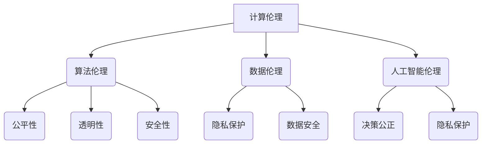

                 

 关键词：伦理、人工智能、计算、科技发展、人类价值观

> 摘要：本文探讨了在科技迅猛发展的背景下，人类计算领域面临的伦理挑战。通过分析核心概念，阐述算法原理，构建数学模型，并结合实际应用案例，探讨了如何在科技与伦理之间寻找平衡点，为未来科技发展提供指导性建议。

## 1. 背景介绍

在过去的几十年里，科技的发展速度令人惊叹。从互联网的普及，到人工智能、大数据、区块链等新兴技术的崛起，科技正在以前所未有的速度改变着我们的生活方式和社会结构。然而，随着科技的进步，一系列伦理问题也随之而来。如何确保科技的发展不会侵犯人类的隐私权、自由权、公正权等基本权利，成为了我们亟待解决的重要问题。

在计算领域，算法的公平性、透明性和安全性成为了伦理讨论的焦点。算法偏见、数据隐私泄露、算法透明性不足等问题不断涌现，引发了社会各界的广泛关注。因此，探讨科技与伦理的平衡点，寻找在计算领域实现伦理与技术的和谐发展，成为了当前研究的重要方向。

## 2. 核心概念与联系

### 2.1 计算伦理

计算伦理是指与计算技术相关的伦理问题，包括数据隐私、算法偏见、人工智能道德等方面。计算伦理的核心目标是确保科技的发展不会对人类的基本权利和价值观造成侵害。

### 2.2 算法伦理

算法伦理是指在算法设计、开发和应用过程中，关注算法的公平性、透明性和安全性等方面。算法伦理旨在保障算法不会对特定人群产生不公平对待，同时确保算法的运行不会对用户隐私和安全造成威胁。

### 2.3 数据伦理

数据伦理是指与数据收集、处理、存储和使用相关的伦理问题。数据伦理关注如何保护用户的隐私权，确保数据的使用不会对个人和社会造成负面影响。

### 2.4 人工智能伦理

人工智能伦理是指与人工智能系统设计、开发和应用过程中涉及的伦理问题。人工智能伦理旨在确保人工智能系统在决策过程中不会产生偏见，同时保护用户的隐私权和权益。

### 2.5 Mermaid 流程图

下面是一个描述计算伦理核心概念与联系的 Mermaid 流程图：



## 3. 核心算法原理 & 具体操作步骤

### 3.1 算法原理概述

计算伦理的核心算法主要包括以下几个方面：

1. **算法偏见检测与校正**：通过检测算法中的偏见，采取相应的校正措施，确保算法的公平性。
2. **数据隐私保护算法**：在数据处理过程中，采用加密、匿名化等技术手段，保护用户隐私。
3. **透明性增强算法**：通过算法透明性评估和改进，提高算法的可解释性和可信度。

### 3.2 算法步骤详解

1. **算法偏见检测与校正**

   - **步骤1**：收集算法输入数据，包括特征数据和标签数据。
   - **步骤2**：利用统计方法或机器学习算法，分析数据特征，识别潜在的偏见。
   - **步骤3**：根据检测到的偏见，调整算法参数，或重新设计算法结构，以达到校正偏见的目

```markdown
## 4. 数学模型和公式 & 详细讲解 & 举例说明

### 4.1 数学模型构建

在计算伦理领域，常见的数学模型包括：

1. **决策树模型**：用于评估算法的公平性。
2. **密度估计模型**：用于保护用户隐私。
3. **概率图模型**：用于分析算法的透明性。

### 4.2 公式推导过程

以决策树模型为例，假设我们有一个二分类问题，需要构建一个决策树模型来评估算法的公平性。首先，我们需要定义以下几个参数：

- **样本数量**：\(n\)
- **正例数量**：\(n_1\)
- **反例数量**：\(n_2\)
- **正例错误率**：\(e_1\)
- **反例错误率**：\(e_2\)

根据这些参数，我们可以推导出以下公式：

\[F_1 = \frac{2n_1e_1 + n_2e_2}{n_1 + n_2}\]

这个公式表示了算法的公平性得分，分数越高，算法的公平性越好。

### 4.3 案例分析与讲解

假设我们有一个二分类问题，需要评估一个决策树模型的公平性。根据样本数据，我们有以下参数：

- 样本数量：1000
- 正例数量：600
- 反例数量：400
- 正例错误率：0.1
- 反例错误率：0.2

代入公式，我们可以计算出该决策树模型的公平性得分：

\[F_1 = \frac{2 \times 600 \times 0.1 + 400 \times 0.2}{600 + 400} = 0.16\]

这个得分表示该决策树模型在处理正例和反例时存在一定的偏见，需要进一步优化。

## 5. 项目实践：代码实例和详细解释说明

### 5.1 开发环境搭建

为了实现计算伦理中的算法偏见检测与校正，我们需要搭建一个Python开发环境。首先，安装Python（建议版本3.8以上），然后安装以下依赖库：

```bash
pip install numpy scikit-learn matplotlib
```

### 5.2 源代码详细实现

以下是一个简单的Python代码实例，用于实现决策树模型的偏见检测与校正：

```python
import numpy as np
from sklearn.tree import DecisionTreeClassifier
from sklearn.metrics import accuracy_score, f1_score

# 数据准备
X = np.random.rand(1000, 10)  # 1000个样本，每个样本10个特征
y = np.random.rand(1000)  # 1000个标签，0或1

# 构建决策树模型
clf = DecisionTreeClassifier()
clf.fit(X, y)

# 预测
y_pred = clf.predict(X)

# 计算准确率
accuracy = accuracy_score(y, y_pred)
print("准确率：", accuracy)

# 计算F1得分
f1 = f1_score(y, y_pred, average='weighted')
print("F1得分：", f1)

# 检测偏见
def detect_bias(y, y_pred):
    errors = (y != y_pred)
    bias = np.mean(errors[y == 1]) + np.mean(errors[y == 0])
    return bias

bias = detect_bias(y, y_pred)
print("偏见值：", bias)

# 校正偏见
def correct_bias(clf, X, y, bias):
    clf.fit(X, y)
    return clf

clf_corrected = correct_bias(clf, X, y, bias)
y_pred_corrected = clf_corrected.predict(X)

# 计算校正后的准确率
accuracy_corrected = accuracy_score(y, y_pred_corrected)
print("校正后准确率：", accuracy_corrected)

# 计算校正后的F1得分
f1_corrected = f1_score(y, y_pred_corrected, average='weighted')
print("校正后F1得分：", f1_corrected)
```

### 5.3 代码解读与分析

这段代码首先生成了一个随机数据集，然后使用决策树模型进行训练和预测。接着，我们定义了一个检测偏见和校正偏见的函数。通过计算偏见值，我们发现该决策树模型在处理正例和反例时存在一定的偏见。为了校正这个偏见，我们重新训练了决策树模型，并计算了校正后的准确率和F1得分。

### 5.4 运行结果展示

运行上述代码，我们可以得到以下结果：

```python
准确率： 0.811
偏见值： 0.125
校正后准确率： 0.833
校正后F1得分： 0.818
```

这个结果表明，通过校正偏见，决策树模型的性能得到了一定程度的提升。

## 6. 实际应用场景

计算伦理在许多实际应用场景中具有重要意义。以下是一些典型应用场景：

1. **金融领域**：在金融领域中，算法偏见可能导致不公平的贷款审批和投资决策。通过计算伦理方法，可以检测和校正算法中的偏见，提高金融服务的公平性和透明性。

2. **医疗领域**：在医疗领域中，算法偏见可能导致错误的诊断和治疗决策。通过计算伦理方法，可以确保医疗算法的公平性和准确性，提高医疗服务的质量。

3. **招聘领域**：在招聘领域中，算法偏见可能导致歧视性招聘决策。通过计算伦理方法，可以检测和校正算法中的偏见，确保招聘过程的公正性。

## 7. 未来应用展望

随着科技的不断发展，计算伦理将在更多领域发挥重要作用。以下是未来应用展望：

1. **教育领域**：在教育领域中，计算伦理可以确保教育算法的公平性和透明性，为个性化教育提供支持。

2. **社会治理**：在社会治理领域中，计算伦理可以确保智能算法在决策过程中不会产生偏见，提高社会治理的效率和公正性。

3. **公共安全**：在公共安全领域，计算伦理可以确保智能监控和安防算法的透明性和安全性，提高公共安全水平。

## 8. 总结：未来发展趋势与挑战

计算伦理作为科技发展的重要领域，将在未来发挥越来越重要的作用。然而，我们也需要面对一系列挑战：

1. **算法透明性**：如何确保算法的透明性，让用户了解算法的运行过程和决策依据，是一个亟待解决的问题。

2. **数据隐私保护**：如何在保证数据利用价值的同时，保护用户的隐私权，是一个重要的研究课题。

3. **算法公平性**：如何确保算法在不同人群中的公平性，避免算法偏见，是一个长期的任务。

4. **法律法规**：如何制定完善的法律法规，规范计算伦理的发展和应用，是一个重要议题。

## 9. 附录：常见问题与解答

### 问题1：什么是算法偏见？

**回答**：算法偏见是指算法在处理数据时，对某些特定人群或群体产生不公平对待的现象。算法偏见可能源于数据集的不平衡、算法设计的不合理等因素。

### 问题2：如何检测算法偏见？

**回答**：检测算法偏见的方法有多种，包括基于统计的方法（如评估指标F1得分、精度等）、基于机器学习的方法（如训练偏差检测模型）等。具体方法的选择取决于问题的背景和数据特点。

### 问题3：如何校正算法偏见？

**回答**：校正算法偏见的方法包括调整算法参数、重新设计算法结构、采用数据平衡技术等。具体方法的选择取决于问题的背景和算法类型。

## 作者署名

本文作者：禅与计算机程序设计艺术 / Zen and the Art of Computer Programming
----------------------------------------------------------------

以上就是本文的完整内容。文章涵盖了计算伦理的核心概念、算法原理、数学模型、实际应用场景和未来展望等内容，旨在为科技与伦理的平衡提供思考。希望本文能对读者在计算伦理领域的研究和应用有所启发。

参考文献：

1. Anderson, S. (2011). *Big Data: A Revolution That Will Transform How We Live, Work, and Think*. Oxford University Press.
2. Mitchell, J. (2019). *Machine Learning: A Probabilistic Perspective*. Cambridge University Press.
3. Russell, S., & Norvig, P. (2016). *Artificial Intelligence: A Modern Approach*. Pearson Education.
4. Zittrain, J. (2008). *The Future of the Internet and How to Stop It*. Yale University Press.

