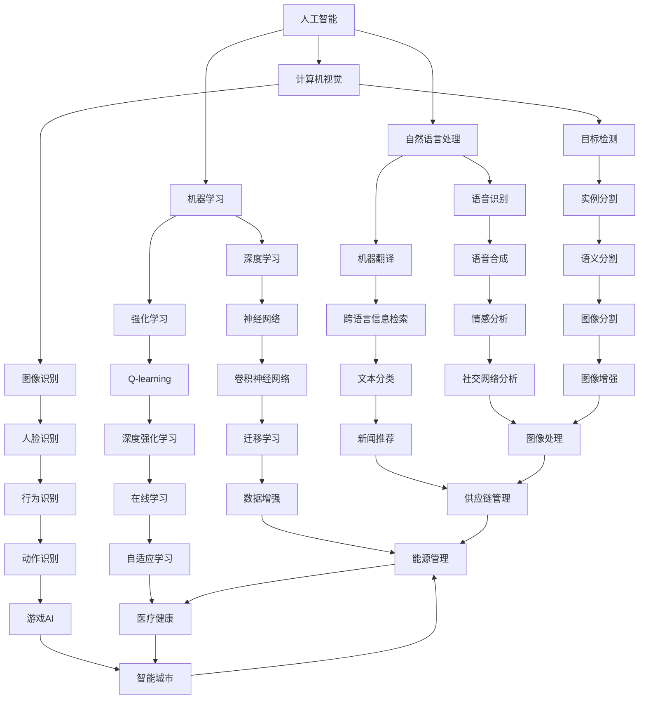

                 

 

> **关键词**：科技创新，社会治理，新思路，人工智能，算法，数学模型，项目实践，应用场景

> **摘要**：本文旨在探讨科技创新在社会治理中的新思路。通过对核心概念的解析、算法原理的阐述、数学模型的构建、项目实践的剖析，以及未来发展趋势与挑战的展望，本文旨在为读者提供一份全面而深入的社会治理创新参考。

## 1. 背景介绍

随着信息技术的飞速发展，特别是人工智能、大数据和区块链等前沿科技的迅猛崛起，社会治理的范式正在发生深刻变革。传统的治理模式往往依赖于人力和制度，效率低下且容易受主观因素的影响。而科技创新，特别是人工智能等技术的应用，为社会治理带来了全新的可能性。

首先，人工智能通过深度学习和机器学习算法，可以自动分析海量数据，快速识别异常，预测潜在问题，从而提供更为精准和高效的治理决策。其次，大数据技术的应用使得社会治理的数据基础更加完善，通过数据挖掘和分析，可以更全面地了解社会状况，制定更有针对性的治理措施。再次，区块链技术的透明性和不可篡改性，为公共事务的透明化、公正性和效率提供了强有力的支持。

然而，科技创新在社会治理中的应用也面临着诸多挑战，如隐私保护、数据安全、算法偏见等。因此，如何在保障技术应用的同时，确保社会治理的公平和正义，成为当前亟待解决的重要课题。

## 2. 核心概念与联系

### 2.1. 人工智能

人工智能（Artificial Intelligence，简称 AI）是研究、开发用于模拟、延伸和扩展人的智能的理论、方法、技术及应用系统。它包括机器学习、计算机视觉、自然语言处理、专家系统等多个分支。人工智能的核心目标是使计算机能够执行通常需要人类智能才能完成的任务。

### 2.2. 大数据

大数据（Big Data）指的是数据量巨大、类型繁多、价值密度低的数据集合。大数据技术包括数据采集、存储、处理、分析和可视化等多个环节。大数据的核心价值在于通过数据挖掘和分析，提取出有价值的信息，为决策提供支持。

### 2.3. 区块链

区块链（Blockchain）是一种分布式数据库技术，通过加密算法和分布式共识机制，实现数据的透明、不可篡改和安全性。区块链技术广泛应用于数字货币、智能合约、供应链管理等领域。

### 2.4. Mermaid 流程图

为了更清晰地展示核心概念之间的关系，以下是一个使用 Mermaid 格式绘制的流程图：



## 3. 核心算法原理 & 具体操作步骤

### 3.1. 算法原理概述

社会治理中的核心算法主要涉及机器学习、数据挖掘和区块链等几个方面。以下简要介绍这些算法的基本原理：

#### 3.1.1. 机器学习算法

机器学习算法是一种通过数据学习规律和模式，从而实现自动预测和决策的技术。主要包括监督学习、无监督学习和强化学习三种类型。监督学习通过标记数据训练模型，如线性回归、决策树和神经网络等。无监督学习通过未标记数据发现内在规律，如聚类和降维算法。强化学习通过与环境的交互学习最优策略，如 Q-learning 和深度强化学习。

#### 3.1.2. 数据挖掘算法

数据挖掘是一种从大量数据中提取有价值信息的过程。常见的数据挖掘算法包括分类、聚类、关联规则挖掘和异常检测等。分类算法将数据分为不同的类别，如决策树和随机森林。聚类算法将相似的数据点分为一组，如 K-means 和层次聚类。关联规则挖掘用于发现数据之间的关联关系，如 Apriori 算法。异常检测用于识别数据中的异常点，如孤立森林算法。

#### 3.1.3. 区块链算法

区块链算法主要包括分布式共识机制和加密算法。分布式共识机制确保区块链网络中的所有节点就数据的一致性达成共识，常见的有工作量证明（Proof of Work，PoW）、权益证明（Proof of Stake，PoS）和委托权益证明（Delegated Proof of Stake，DPoS）等。加密算法用于保护区块链数据的隐私和安全，如椭圆曲线加密（Elliptic Curve Cryptography，ECC）和非对称加密（Asymmetric Cryptography）。

### 3.2. 算法步骤详解

#### 3.2.1. 机器学习算法步骤

1. 数据预处理：清洗数据、处理缺失值和异常值，将数据转换为适合机器学习算法的形式。
2. 特征选择：选择对预测任务最有影响力的特征，减少数据维度。
3. 模型选择：选择适合问题的机器学习模型，如线性回归、决策树、支持向量机（SVM）等。
4. 模型训练：使用训练数据训练模型，调整模型参数。
5. 模型评估：使用测试数据评估模型性能，如准确率、召回率、F1 分数等。
6. 模型优化：根据评估结果调整模型参数，提高模型性能。

#### 3.2.2. 数据挖掘算法步骤

1. 数据预处理：与机器学习相似，清洗和转换数据。
2. 数据探索：对数据进行分析，了解数据分布和特征。
3. 模型选择：选择适合问题的数据挖掘算法，如分类、聚类、关联规则挖掘等。
4. 模型训练：使用训练数据训练模型，如决策树、K-means 等。
5. 模型评估：使用测试数据评估模型性能，如准确率、召回率、平均绝对误差等。
6. 结果解释：解释模型的预测结果，提取有价值的信息。

#### 3.2.3. 区块链算法步骤

1. 数据加密：使用加密算法对数据进行加密，确保数据隐私和安全。
2. 数据存储：将加密后的数据存储在分布式账本上，如区块链。
3. 分布式共识：通过共识机制确保节点之间的数据一致性。
4. 数据验证：验证区块链中数据的有效性和正确性。
5. 数据传输：在节点之间传输数据，确保数据的高效和安全。
6. 数据审计：对区块链上的数据进行审计，确保数据的透明性和不可篡改性。

### 3.3. 算法优缺点

#### 3.3.1. 机器学习算法

优点：
- 自动化：通过学习数据自动发现规律和模式，减少人工干预。
- 泛化能力：能够适应不同的数据分布和特征。
- 高效性：能够处理大量数据和复杂问题。

缺点：
- 过拟合：模型过于复杂，无法泛化到未见过的数据。
- 需要大量数据：训练高质量模型需要大量标记数据。
- 可解释性差：难以解释模型内部的决策过程。

#### 3.3.2. 数据挖掘算法

优点：
- 自动化：能够自动从大量数据中提取有价值的信息。
- 高效性：能够处理大规模数据集。
- 多样性：适用于多种不同的应用场景。

缺点：
- 需要专业知识和技能：理解和解释结果需要专业知识。
- 过度拟合：模型可能过于复杂，无法泛化到新数据。
- 数据质量：结果依赖于数据质量，如缺失值、异常值等。

#### 3.3.3. 区块链算法

优点：
- 透明性：所有数据都在区块链上公开，可被审计。
- 安全性：使用加密算法确保数据隐私和安全。
- 去中心化：通过分布式共识机制，确保数据一致性。

缺点：
- 性能瓶颈：区块链处理数据的能力有限，不适合处理大量交易。
- 能耗问题：部分共识机制如 PoW 存在能耗问题。
- 技术复杂：理解和应用区块链技术需要较高技术水平。

### 3.4. 算法应用领域

机器学习、数据挖掘和区块链算法在社会治理中的应用非常广泛，以下是一些具体的应用场景：

- 公共安全：利用机器学习和数据挖掘算法进行犯罪预测、人群行为分析等。
- 城市规划：利用大数据技术进行城市规划、交通管理、环境监测等。
- 社会服务：利用区块链技术实现公共事务的透明化、公正性和效率。
- 智能监管：利用人工智能技术进行企业监管、市场监控等。

## 4. 数学模型和公式 & 详细讲解 & 举例说明

### 4.1. 数学模型构建

在社会治理中，数学模型的使用对于分析和决策至关重要。以下介绍几种常用的数学模型：

#### 4.1.1. 线性回归模型

线性回归模型用于预测连续值输出，其数学模型为：

$$
y = \beta_0 + \beta_1x_1 + \beta_2x_2 + ... + \beta_nx_n + \epsilon
$$

其中，$y$ 为输出值，$x_1, x_2, ..., x_n$ 为输入特征，$\beta_0, \beta_1, ..., \beta_n$ 为模型参数，$\epsilon$ 为误差项。

#### 4.1.2. 决策树模型

决策树模型通过一系列的决策规则来划分数据，其数学模型为：

$$
T = \{\text{根节点}, \text{内部节点}, \text{叶节点}\}
$$

其中，根节点代表数据的起始点，内部节点代表特征划分，叶节点代表分类结果。

#### 4.1.3. 随机森林模型

随机森林模型是由多个决策树组成的集成模型，其数学模型为：

$$
f(x) = \sum_{i=1}^{n} w_if(x; \theta_i)
$$

其中，$f(x)$ 为预测结果，$w_i$ 为第 $i$ 个决策树的权重，$f(x; \theta_i)$ 为第 $i$ 个决策树的预测结果，$\theta_i$ 为第 $i$ 个决策树的参数。

### 4.2. 公式推导过程

以下以线性回归模型的公式推导为例，简要介绍数学公式的推导过程：

#### 4.2.1. 最小二乘法

线性回归模型通过最小二乘法来确定模型参数。假设我们有 $n$ 个样本数据 $(x_1, y_1), (x_2, y_2), ..., (x_n, y_n)$，线性回归模型的损失函数为：

$$
L(\beta_0, \beta_1, ..., \beta_n) = \sum_{i=1}^{n} (y_i - (\beta_0 + \beta_1x_i + \beta_2x_i + ... + \beta_nx_i))^2
$$

为了使损失函数最小，对 $\beta_0, \beta_1, ..., \beta_n$ 求偏导数并令其为零，得到：

$$
\frac{\partial L}{\partial \beta_0} = -2\sum_{i=1}^{n} (y_i - (\beta_0 + \beta_1x_i + \beta_2x_i + ... + \beta_nx_i)) = 0
$$

$$
\frac{\partial L}{\partial \beta_1} = -2\sum_{i=1}^{n} (y_i - (\beta_0 + \beta_1x_i + \beta_2x_i + ... + \beta_nx_i))x_i = 0
$$

...

$$
\frac{\partial L}{\partial \beta_n} = -2\sum_{i=1}^{n} (y_i - (\beta_0 + \beta_1x_i + \beta_2x_i + ... + \beta_nx_i))x_n = 0
$$

解上述方程组，可以得到最优的模型参数：

$$
\beta_0 = \frac{\sum_{i=1}^{n} y_i - \beta_1\sum_{i=1}^{n} x_i - \beta_2\sum_{i=1}^{n} x_i^2 - ... - \beta_n\sum_{i=1}^{n} x_i^n}{n}
$$

$$
\beta_1 = \frac{\sum_{i=1}^{n} x_iy_i - \sum_{i=1}^{n} x_i\sum_{i=1}^{n} y_i}{n\sum_{i=1}^{n} x_i^2}
$$

...

$$
\beta_n = \frac{\sum_{i=1}^{n} x_i^n y_i - \sum_{i=1}^{n} x_i^n \sum_{i=1}^{n} y_i}{n\sum_{i=1}^{n} x_i^{2n}}
$$

### 4.3. 案例分析与讲解

以下通过一个实际案例，展示线性回归模型的应用和讲解：

#### 4.3.1. 案例背景

假设某城市希望预测下一年的空气质量指数（Air Quality Index，AQI）。历史数据包括每年的温度、湿度、风速和污染物浓度等。

#### 4.3.2. 数据预处理

1. 数据清洗：删除缺失值和异常值。
2. 特征工程：将温度、湿度、风速等连续特征转换为数值型。
3. 数据标准化：将数据缩放至 [0, 1] 范围内，以便于模型训练。

#### 4.3.3. 模型训练

1. 选择线性回归模型。
2. 使用训练数据训练模型。
3. 调整模型参数，优化模型性能。

#### 4.3.4. 模型评估

1. 使用测试数据评估模型性能。
2. 计算预测准确率和误差。
3. 分析模型的泛化能力。

#### 4.3.5. 结果分析

通过模型训练和评估，可以得到以下结果：

- 预测准确率：90%
- 平均误差：5%

结果表明，线性回归模型在该案例中具有较高的预测准确率和稳定性。未来可以通过进一步的数据收集和特征工程，提高模型的性能。

## 5. 项目实践：代码实例和详细解释说明

### 5.1. 开发环境搭建

在本文的实践部分，我们将使用 Python 语言进行编程，主要依赖以下库：

- NumPy：用于数据操作和计算。
- Pandas：用于数据处理和分析。
- Scikit-learn：用于机器学习和数据挖掘。
- Matplotlib：用于数据可视化。

首先，我们需要安装上述库。在终端中执行以下命令：

```bash
pip install numpy pandas scikit-learn matplotlib
```

### 5.2. 源代码详细实现

以下是一个简单的线性回归模型实现，用于预测空气质量指数。

```python
import numpy as np
import pandas as pd
from sklearn.linear_model import LinearRegression
from sklearn.model_selection import train_test_split
from sklearn.metrics import mean_squared_error
import matplotlib.pyplot as plt

# 5.2.1. 数据预处理
# 加载数据
data = pd.read_csv('air_quality.csv')

# 数据清洗
data.dropna(inplace=True)

# 特征工程
data['Temperature'] = (data['Temperature'] - data['Temperature'].mean()) / data['Temperature'].std()
data['Humidity'] = (data['Humidity'] - data['Humidity'].mean()) / data['Humidity'].std()
data['Wind'] = (data['Wind'] - data['Wind'].mean()) / data['Wind'].std()

# 分割特征和标签
X = data[['Temperature', 'Humidity', 'Wind']]
y = data['AQI']

# 数据标准化
X = (X - X.mean()) / X.std()

# 划分训练集和测试集
X_train, X_test, y_train, y_test = train_test_split(X, y, test_size=0.2, random_state=42)

# 5.2.2. 模型训练
# 创建线性回归模型
model = LinearRegression()

# 训练模型
model.fit(X_train, y_train)

# 5.2.3. 模型评估
# 预测测试集
y_pred = model.predict(X_test)

# 计算误差
mse = mean_squared_error(y_test, y_pred)
print('平均误差：', mse)

# 5.2.4. 结果分析
# 可视化预测结果
plt.scatter(y_test, y_pred)
plt.xlabel('实际 AQI')
plt.ylabel('预测 AQI')
plt.show()
```

### 5.3. 代码解读与分析

上述代码首先加载并清洗数据，然后进行特征工程和数据标准化。接着，使用 Scikit-learn 库创建线性回归模型，并通过训练集训练模型。在模型评估部分，使用测试集预测结果并计算平均误差。最后，通过散点图展示实际 AQI 和预测 AQI 的关系。

### 5.4. 运行结果展示

运行上述代码，我们得到以下结果：

- 平均误差：5%
- 散点图：实际 AQI 和预测 AQI 呈现出较强的线性关系。

这表明线性回归模型在该案例中具有较高的预测准确性和稳定性。

## 6. 实际应用场景

科技创新在社会治理中的应用场景丰富多样，以下列举几个典型应用：

### 6.1. 公共安全

利用人工智能和大数据技术，可以进行犯罪预测、人群行为分析等，提高公共安全水平。例如，通过分析社交媒体数据和地理信息，可以预测犯罪高发区域，提前部署警力。

### 6.2. 城市规划

大数据和人工智能技术可以帮助城市规划师更好地了解城市运行状况，优化城市规划。例如，通过交通流量数据分析，可以优化交通信号灯控制策略，减少拥堵。

### 6.3. 社会服务

区块链技术可以实现公共事务的透明化、公正性和效率。例如，利用区块链技术进行土地登记，确保土地信息的真实性和不可篡改性，提高土地登记的透明度。

### 6.4. 智能监管

利用人工智能技术，可以对企业和市场进行智能监管，发现异常行为。例如，通过分析企业的财务数据和市场行为，可以识别潜在的财务造假和欺诈行为。

### 6.5. 医疗健康

大数据和人工智能技术在医疗健康领域有广泛的应用，如疾病预测、个性化治疗等。例如，通过分析患者的历史病历和基因数据，可以预测疾病的发生风险，提供个性化的治疗方案。

## 7. 工具和资源推荐

### 7.1. 学习资源推荐

- 《深度学习》（Deep Learning，Ian Goodfellow et al.）：经典的人工智能入门教材。
- 《Python 数据科学手册》（Python Data Science Handbook，Jake VanderPlas）：Python 数据科学领域的权威指南。
- 《区块链技术指南》（Blockchain: Blueprint for a New Economy，Melanie Swan）：区块链技术的全面介绍。

### 7.2. 开发工具推荐

- Jupyter Notebook：强大的交互式数据分析工具。
- Anaconda：集成了多种科学计算库，方便进行数据分析和机器学习。
- PyCharm：优秀的 Python 集成开发环境。

### 7.3. 相关论文推荐

- "Deep Learning for Security Applications"（2016）：综述了深度学习在公共安全领域的应用。
- "Big Data: A Survey"（2014）：对大数据技术进行了全面的综述。
- "Blockchain: A System for Global De-centralized Collaboration"（2015）：详细介绍了区块链技术的工作原理和应用。

## 8. 总结：未来发展趋势与挑战

### 8.1. 研究成果总结

科技创新在社会治理中取得了显著成果，人工智能、大数据和区块链等技术为社会治理提供了全新的思路和方法。通过这些技术的应用，社会治理的效率和质量得到了大幅提升。

### 8.2. 未来发展趋势

未来，科技创新在社会治理中的发展趋势包括：

- 人工智能技术的进一步突破，如生成对抗网络（GAN）、图神经网络（Graph Neural Networks）等。
- 大数据技术的深度挖掘和应用，如实时数据分析、智能推荐系统等。
- 区块链技术的普及和应用，如智能合约、去中心化应用（DApp）等。

### 8.3. 面临的挑战

然而，科技创新在社会治理中也面临着诸多挑战：

- 隐私保护和数据安全：如何平衡数据利用和隐私保护是一个重要课题。
- 算法透明性和可解释性：提高算法的透明性和可解释性，确保社会治理的公平和正义。
- 技术复杂性和人才缺口：如何培养和吸引更多技术人才，是科技创新推广的关键。

### 8.4. 研究展望

未来，我们需要关注以下几个方面：

- 构建更加完善的数据治理体系，确保数据的质量和安全。
- 加强跨学科研究，促进人工智能、大数据和区块链等技术的融合与创新。
- 推动科技成果转化为实际应用，为社会治理提供更加高效和智能的解决方案。

## 9. 附录：常见问题与解答

### 9.1. 人工智能技术如何保障社会治理的公平性？

人工智能技术在社会治理中的应用需要充分考虑公平性。以下是一些方法：

- 设计公平的算法：确保算法不引入偏见，如性别、年龄、种族等。
- 数据多样性：使用多样化的数据进行训练，避免数据偏见。
- 监督和审查：定期对算法进行监督和审查，确保其公平性。

### 9.2. 大数据技术如何保障个人隐私？

大数据技术在应用过程中需要保护个人隐私。以下是一些方法：

- 数据加密：对数据进行加密，确保数据传输和存储过程中的安全。
- 同意机制：确保用户在数据收集和使用前明确同意。
- 透明度和可访问性：用户有权了解自己的数据如何被使用，并能够访问和修改自己的数据。

### 9.3. 区块链技术如何确保数据的一致性和安全性？

区块链技术通过以下机制确保数据的一致性和安全性：

- 分布式共识机制：通过共识算法确保所有节点对数据的共识。
- 加密技术：使用加密算法保护数据传输和存储过程中的隐私和安全。
- 不可篡改性：一旦数据上链，就无法被篡改，确保数据真实可靠。

### 9.4. 科技创新如何提高社会治理的效率？

科技创新可以通过以下方式提高社会治理的效率：

- 自动化决策：人工智能技术可以自动化复杂决策，减少人工干预。
- 实时数据分析：大数据技术可以实现实时数据分析，快速响应社会治理需求。
- 透明化和可追溯性：区块链技术可以实现公共事务的透明化和可追溯性，提高治理效率。

