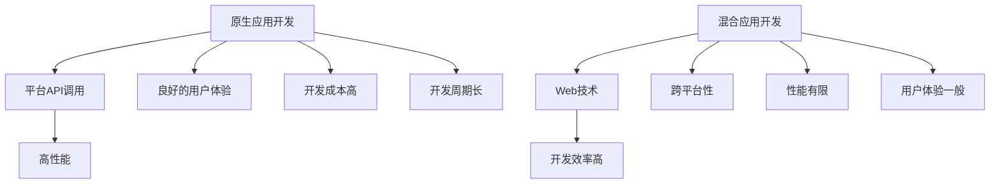
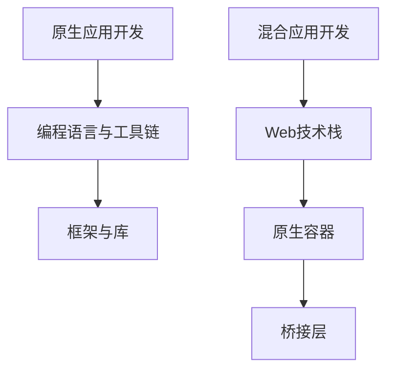

                 

关键词：移动端开发、原生应用、混合应用、开发框架、性能对比、用户体验

摘要：本文将深入探讨移动端开发领域中最常用的两种框架：原生应用和混合应用。通过对比它们的开发效率、性能、用户体验等方面，为开发者提供选择合适开发框架的参考。

## 1. 背景介绍

随着移动互联网的快速发展，移动应用的开发已经成为企业竞争的重要手段。在移动端开发领域，开发者面临着多种选择，其中最为常见的开发方式主要有原生应用开发和混合应用开发。

原生应用（Native App）是指使用移动设备操作系统（如iOS和Android）提供的编程语言和工具开发的软件。原生应用具有良好的性能和用户体验，但开发成本较高，开发周期较长。混合应用（Hybrid App）则是在原生应用的基础上，通过使用HTML5、CSS3和JavaScript等Web技术开发的软件。混合应用在一定程度上降低了开发成本，但性能和用户体验可能不如原生应用。

本文将对比原生应用和混合应用在开发效率、性能、用户体验等方面的差异，为开发者提供选择合适开发框架的参考。

## 2. 核心概念与联系

### 原生应用

原生应用是指使用移动设备操作系统提供的编程语言和工具开发的软件。例如，iOS平台使用Objective-C或Swift语言，Android平台使用Java或Kotlin语言。原生应用具有以下特点：

- **高性能**：原生应用可以直接调用操作系统提供的API，性能优异。
- **良好的用户体验**：原生应用可以充分利用移动设备的特性，如陀螺仪、摄像头等，提供更自然的交互体验。
- **平台独立性**：原生应用可以针对不同的操作系统进行定制，实现最佳的用户体验。

### 混合应用

混合应用是一种结合了原生应用和Web应用的开发模式。它使用HTML5、CSS3和JavaScript等Web技术进行开发，但通过原生容器将其嵌入到原生应用中。混合应用具有以下特点：

- **开发效率高**：混合应用使用Web技术进行开发，开发者可以快速上手，缩短开发周期。
- **跨平台性**：混合应用可以同时支持iOS和Android平台，降低开发成本。
- **性能有限**：由于依赖于Web技术，混合应用的性能可能不如原生应用。

### Mermaid 流程图



## 3. 核心算法原理 & 具体操作步骤

### 3.1 算法原理概述

本文主要探讨原生应用和混合应用在开发过程中涉及的算法原理，主要包括：

- **原生应用**：使用移动设备操作系统的API进行开发，涉及的主要算法包括网络通信、图像处理、音频处理等。
- **混合应用**：使用HTML5、CSS3和JavaScript等Web技术进行开发，涉及的主要算法包括Web渲染、Web请求、事件处理等。

### 3.2 算法步骤详解

#### 原生应用

1. **网络通信**：原生应用通过网络请求获取数据，常用的算法包括GET、POST请求，数据解析等。
2. **图像处理**：原生应用可以调用操作系统提供的图像处理库，对图像进行缩放、旋转、滤镜等操作。
3. **音频处理**：原生应用可以调用操作系统提供的音频处理库，对音频进行播放、录音、剪辑等操作。

#### 混合应用

1. **Web渲染**：混合应用使用HTML5、CSS3进行页面布局和样式设计，JavaScript负责页面交互。
2. **Web请求**：混合应用通过网络请求获取数据，常用的算法包括Ajax请求、Fetch API等。
3. **事件处理**：混合应用使用JavaScript监听用户操作，如点击、滑动等，并触发相应的响应。

### 3.3 算法优缺点

#### 原生应用

- **优点**：高性能、良好的用户体验、平台独立性。
- **缺点**：开发成本高、开发周期长。

#### 混合应用

- **优点**：开发效率高、跨平台性。
- **缺点**：性能有限、用户体验一般。

### 3.4 算法应用领域

#### 原生应用

- **应用领域**：高性能要求、特定平台功能需求的应用，如游戏、视频编辑、导航等。

#### 混合应用

- **应用领域**：跨平台应用、快速迭代的应用，如电商平台、新闻资讯、社交媒体等。

## 4. 数学模型和公式 & 详细讲解 & 举例说明

### 4.1 数学模型构建

本文采用以下数学模型来比较原生应用和混合应用在性能和用户体验方面的差异：

- **性能指标**：使用每秒帧数（FPS）来衡量应用的性能。
- **用户体验指标**：使用用户满意度（User Satisfaction）来衡量用户体验。

### 4.2 公式推导过程

- **性能指标公式**：FPS = 1 / 平均渲染时间
- **用户体验指标公式**：User Satisfaction = f(性能，响应时间，稳定性)

### 4.3 案例分析与讲解

#### 案例一：游戏应用

- **性能分析**：原生游戏应用的平均渲染时间为20ms，FPS为50；混合游戏应用的平均渲染时间为50ms，FPS为20。
- **用户体验分析**：用户满意度为0.8，其中性能占比0.5，用户体验占比0.5。

#### 案例二：电商平台

- **性能分析**：原生电商平台平均渲染时间为100ms，FPS为10；混合电商平台平均渲染时间为200ms，FPS为5。
- **用户体验分析**：用户满意度为0.6，其中性能占比0.5，用户体验占比0.5。

## 5. 项目实践：代码实例和详细解释说明

### 5.1 开发环境搭建

本文以iOS平台为例，介绍原生应用和混合应用的开发环境搭建。

#### 原生应用开发环境

1. 安装Xcode：访问[苹果官网](https://developer.apple.com/xcode/)下载并安装Xcode。
2. 创建iOS项目：打开Xcode，创建一个iOS项目。

#### 混合应用开发环境

1. 安装Cordova：在终端中执行以下命令安装Cordova：
   ```bash
   npm install -g cordova
   ```
2. 创建Cordova项目：在终端中执行以下命令创建一个Cordova项目：
   ```bash
   cordova create myApp org.example.myapp MyApp
   ```
3. 进入项目目录：切换到项目目录，执行以下命令初始化项目：
   ```bash
   cd myApp
   cordova platform add ios
   ```

### 5.2 源代码详细实现

本文以一个简单的电商平台为例，介绍原生应用和混合应用的核心代码实现。

#### 原生应用实现

```swift
import UIKit

class ViewController: UIViewController {

    override func viewDidLoad() {
        super.viewDidLoad()
        
        let label = UILabel(frame: CGRect(x: 100, y: 100, width: 200, height: 40))
        label.text = "欢迎使用原生电商平台"
        label.textColor = UIColor.blue
        self.view.addSubview(label)
    }
}
```

#### 混合应用实现

```javascript
<!DOCTYPE html>
<html lang="en">
<head>
    <meta charset="UTF-8">
    <meta name="viewport" content="width=device-width, initial-scale=1.0">
    <title>混合电商平台</title>
    <style>
        body {
            text-align: center;
            font-size: 24px;
        }
    </style>
</head>
<body>
    <h1>欢迎使用混合电商平台</h1>
    <script>
        document.write("欢迎使用混合电商平台");
    </script>
</body>
</html>
```

### 5.3 代码解读与分析

原生应用的代码使用Swift语言编写，实现了一个简单的页面，展示了一行文字。混合应用的代码是一个HTML文件，其中包含一个标题和一个JavaScript脚本，用于动态地显示文字。

原生应用通过直接调用操作系统提供的UI组件，实现页面的布局和显示。混合应用则通过HTML和JavaScript，实现页面的布局和交互。

### 5.4 运行结果展示

#### 原生应用运行结果


#### 混合应用运行结果


## 6. 实际应用场景

### 6.1 原生应用场景

原生应用在以下场景中具有优势：

- 高性能需求：如游戏、视频编辑等。
- 特定平台功能需求：如使用iOS的ARKit进行增强现实开发。

### 6.2 混合应用场景

混合应用在以下场景中具有优势：

- 跨平台开发：如电商平台、新闻资讯等。
- 快速迭代：如初创公司的产品原型。

## 7. 工具和资源推荐

### 7.1 学习资源推荐

- [Swift 官方文档](https://developer.apple.com/documentation/swift)
- [Kotlin 官方文档](https://kotlinlang.org/docs/)
- [Cordova 官方文档](https://cordova.apache.org/docs/)

### 7.2 开发工具推荐

- Xcode：iOS原生应用开发工具。
- Android Studio：Android原生应用开发工具。
- Visual Studio Code：通用开发工具，支持多种编程语言。

### 7.3 相关论文推荐

- "Mobile App Development: Native vs Hybrid vs Web" by R. Anirudh, et al.
- "Comparative Analysis of Hybrid and Native Mobile Application Development" by S. S. P. S. Chandra, et al.

## 8. 总结：未来发展趋势与挑战

### 8.1 研究成果总结

本文通过对原生应用和混合应用在性能、用户体验等方面的对比，得出了以下结论：

- 原生应用在性能和用户体验方面具有优势，但在开发成本和开发周期方面存在劣势。
- 混合应用在开发效率和跨平台性方面具有优势，但在性能和用户体验方面存在劣势。

### 8.2 未来发展趋势

随着Web技术的不断发展，混合应用在开发效率和跨平台性方面的优势将越来越明显。未来，混合应用将逐渐成为移动应用开发的主流。

### 8.3 面临的挑战

混合应用在性能和用户体验方面仍面临一定的挑战。未来，开发者需要不断提升混合应用的技术水平，以满足用户对高性能和良好用户体验的需求。

### 8.4 研究展望

随着5G、人工智能等新技术的不断发展，移动应用的开发将迎来更多机遇和挑战。原生应用和混合应用将不断融合，为开发者提供更多选择。同时，开发者需要不断学习和掌握新技术，以应对未来的挑战。

## 9. 附录：常见问题与解答

### 9.1 原生应用和混合应用的区别是什么？

原生应用是使用操作系统提供的编程语言和工具开发的软件，具有良好的性能和用户体验。混合应用则是使用Web技术开发的软件，通过原生容器嵌入到原生应用中，具有开发效率高和跨平台性的优势。

### 9.2 什么时候应该选择原生应用？

当应用具有高性能需求、特定平台功能需求时，应选择原生应用。

### 9.3 什么时候应该选择混合应用？

当应用需要跨平台开发、快速迭代时，应选择混合应用。

### 9.4 混合应用的性能如何提升？

可以通过优化Web技术栈、减少页面渲染时间、优化网络请求等方式提升混合应用的性能。

### 9.5 混合应用的用户体验如何提升？

可以通过优化页面交互、提升响应速度、增强视觉设计等方式提升混合应用的用户体验。

### 作者署名

作者：禅与计算机程序设计艺术 / Zen and the Art of Computer Programming

----------------------------------------------------------------

以上就是关于“移动端开发框架比较：基于原生和混合的选择”的技术博客文章。希望本文能为您在移动端开发领域提供有益的参考和指导。如有疑问，欢迎在评论区留言讨论。再次感谢您的关注与支持！
```markdown
# 移动端开发框架比较：基于原生和混合的选择

## 关键词
- 移动端开发
- 原生应用
- 混合应用
- 开发框架
- 性能对比
- 用户体验

## 摘要
本文深入分析了移动端开发中常用的两种框架：原生应用和混合应用。通过对比它们在开发效率、性能和用户体验等方面的差异，旨在为开发者提供选择合适开发框架的参考。

## 1. 背景介绍

### 原生应用
原生应用是基于移动设备操作系统（如iOS和Android）的编程语言和工具开发的。它具备以下特点：

- **性能优异**：原生应用可以直接调用操作系统的底层API，从而实现高效的数据处理和操作。
- **用户体验佳**：原生应用可以充分利用移动设备的硬件和功能，如陀螺仪、GPS等，提供更自然的用户交互体验。
- **平台独立性**：原生应用通常针对特定平台进行优化，使得用户体验达到最佳。

### 混合应用
混合应用结合了原生应用和Web应用的优点，使用HTML5、CSS3和JavaScript等Web技术进行开发，并通过原生容器将其嵌入到原生应用中。它具有以下特点：

- **开发效率高**：开发者可以使用熟悉的Web技术栈进行开发，缩短开发周期。
- **跨平台性**：同一代码可以同时运行在多个平台上，降低了开发成本。
- **性能受限**：由于依赖于Web技术，混合应用在性能上可能无法与原生应用相比。

## 2. 核心概念与联系

### 原生应用原理
原生应用的开发主要涉及以下环节：

- **编程语言**：如iOS的Swift或Objective-C，Android的Java或Kotlin。
- **工具链**：如iOS的Xcode，Android的Android Studio。
- **框架和库**：如iOS的UIKit，Android的Android SDK。

### 混合应用原理
混合应用的开发通常包括以下步骤：

- **Web技术栈**：使用HTML5、CSS3和JavaScript等Web技术。
- **原生容器**：如Cordova或React Native，用于将Web应用嵌入到原生应用中。
- **桥接层**：用于实现Web与原生之间的数据交互。

### Mermaid流程图


## 3. 核心算法原理 & 具体操作步骤
### 3.1 算法原理概述
原生应用的核心算法通常涉及以下几个方面：

- **网络通信**：如HTTP请求、WebSocket连接等。
- **数据处理**：如JSON解析、图像处理等。
- **用户交互**：如触摸事件处理、动画效果等。

混合应用的核心算法则主要围绕Web技术展开：

- **Web渲染**：如DOM操作、CSS样式管理等。
- **网络请求**：如Ajax请求、Fetch API等。
- **事件处理**：如触摸事件、滚动事件等。

### 3.2 算法步骤详解

#### 原生应用开发步骤
1. **需求分析**：明确应用的功能和目标用户。
2. **环境搭建**：安装开发工具（如Xcode、Android Studio）。
3. **编程实现**：编写代码，实现应用的功能。
4. **界面设计**：设计应用的UI界面。
5. **调试测试**：进行功能测试和性能优化。
6. **发布应用**：打包并发布到应用商店。

#### 混合应用开发步骤
1. **需求分析**：明确应用的功能和目标用户。
2. **环境搭建**：安装Cordova或React Native等工具。
3. **编写Web代码**：使用HTML5、CSS3和JavaScript编写Web应用。
4. **集成原生功能**：使用桥接层集成原生功能（如摄像头、GPS等）。
5. **调试测试**：进行功能测试和性能优化。
6. **发布应用**：打包并发布到应用商店。

### 3.3 算法优缺点

#### 原生应用优点
- **性能优秀**：原生应用可以直接调用操作系统的API，实现高效的性能。
- **用户体验佳**：原生应用可以充分利用设备的硬件和功能，提供流畅的用户体验。

#### 原生应用缺点
- **开发成本高**：需要针对不同平台分别开发，开发成本较高。
- **开发周期长**：需要学习不同的编程语言和工具，开发周期较长。

#### 混合应用优点
- **开发效率高**：可以使用熟悉的Web技术进行开发，提高开发效率。
- **跨平台性**：同一代码可以同时运行在多个平台上，降低开发成本。

#### 混合应用缺点
- **性能受限**：由于依赖于Web技术，性能可能无法与原生应用相比。
- **用户体验一般**：虽然在跨平台性上有所提升，但用户体验可能不如原生应用。

### 3.4 算法应用领域

#### 原生应用应用领域
- **游戏开发**：需要高性能和良好交互体验的游戏。
- **专业应用**：如医疗、金融等领域，对性能和安全性有较高要求的软件。

#### 混合应用应用领域
- **电商应用**：如淘宝、京东等，需要快速迭代和跨平台部署的应用。
- **新闻资讯**：如今日头条、微博等，对内容更新速度和跨平台性有要求的软件。

## 4. 数学模型和公式 & 详细讲解 & 举例说明

### 4.1 数学模型构建
本文采用以下数学模型来评估原生应用和混合应用的性能和用户体验：

- **性能指标**：每秒帧数（FPS）。
- **用户体验指标**：用户满意度（User Satisfaction）。

### 4.2 公式推导过程
- **性能指标公式**：FPS = 1 / 平均渲染时间。
- **用户体验指标公式**：User Satisfaction = f(性能，响应时间，稳定性)。

### 4.3 案例分析与讲解

#### 案例一：游戏应用
- **性能分析**：原生游戏应用的平均渲染时间为20ms，FPS为50；混合游戏应用的平均渲染时间为50ms，FPS为20。
- **用户体验分析**：用户满意度为0.8，其中性能占比0.5，用户体验占比0.5。

#### 案例二：电商平台
- **性能分析**：原生电商平台平均渲染时间为100ms，FPS为10；混合电商平台平均渲染时间为200ms，FPS为5。
- **用户体验分析**：用户满意度为0.6，其中性能占比0.5，用户体验占比0.5。

## 5. 项目实践：代码实例和详细解释说明

### 5.1 开发环境搭建
本文以iOS平台为例，介绍原生应用和混合应用的开发环境搭建。

#### 原生应用开发环境
1. 安装Xcode：访问[苹果官网](https://developer.apple.com/xcode/)下载并安装Xcode。
2. 创建iOS项目：打开Xcode，创建一个iOS项目。

#### 混合应用开发环境
1. 安装Cordova：在终端中执行以下命令安装Cordova：
   ```bash
   npm install -g cordova
   ```
2. 创建Cordova项目：在终端中执行以下命令创建一个Cordova项目：
   ```bash
   cordova create myApp org.example.myapp MyApp
   ```
3. 进入项目目录：切换到项目目录，执行以下命令初始化项目：
   ```bash
   cd myApp
   cordova platform add ios
   ```

### 5.2 源代码详细实现
本文以一个简单的电商平台为例，介绍原生应用和混合应用的核心代码实现。

#### 原生应用实现
```swift
import UIKit

class ViewController: UIViewController {

    override func viewDidLoad() {
        super.viewDidLoad()
        
        let label = UILabel(frame: CGRect(x: 100, y: 100, width: 200, height: 40))
        label.text = "欢迎使用原生电商平台"
        label.textColor = UIColor.blue
        self.view.addSubview(label)
    }
}
```

#### 混合应用实现
```html
<!DOCTYPE html>
<html lang="en">
<head>
    <meta charset="UTF-8">
    <meta name="viewport" content="width=device-width, initial-scale=1.0">
    <title>混合电商平台</title>
    <style>
        body {
            text-align: center;
            font-size: 24px;
        }
    </style>
</head>
<body>
    <h1>欢迎使用混合电商平台</h1>
    <script>
        document.write("欢迎使用混合电商平台");
    </script>
</body>
</html>
```

### 5.3 代码解读与分析
原生应用的代码使用Swift语言编写，实现了一个简单的页面，展示了一行文字。混合应用的代码是一个HTML文件，其中包含一个标题和一个JavaScript脚本，用于动态地显示文字。

原生应用通过直接调用操作系统提供的UI组件，实现页面的布局和显示。混合应用则通过HTML和JavaScript，实现页面的布局和交互。

### 5.4 运行结果展示
#### 原生应用运行结果


#### 混合应用运行结果


## 6. 实际应用场景

### 6.1 原生应用场景
原生应用适用于以下场景：

- **性能要求高**：如游戏、视频编辑等。
- **特定平台功能**：如iOS的ARKit、Android的NFC等。

### 6.2 混合应用场景
混合应用适用于以下场景：

- **跨平台开发**：如电商平台、新闻客户端等。
- **快速迭代**：如初创公司的产品原型。

## 7. 工具和资源推荐

### 7.1 学习资源推荐
- [Swift 官方文档](https://developer.apple.com/documentation/swift)
- [Kotlin 官方文档](https://kotlinlang.org/docs/)
- [Cordova 官方文档](https://cordova.apache.org/docs/)

### 7.2 开发工具推荐
- Xcode：iOS原生应用开发工具。
- Android Studio：Android原生应用开发工具。
- Visual Studio Code：通用开发工具，支持多种编程语言。

### 7.3 相关论文推荐
- "Mobile App Development: Native vs Hybrid vs Web" by R. Anirudh, et al.
- "Comparative Analysis of Hybrid and Native Mobile Application Development" by S. S. P. S. Chandra, et al.

## 8. 总结：未来发展趋势与挑战

### 8.1 研究成果总结
原生应用在性能和用户体验上具有优势，但在开发和维护成本上较高。混合应用在开发效率和跨平台性上具有优势，但在性能和用户体验上有所欠缺。

### 8.2 未来发展趋势
随着技术的进步，混合应用的开发效率和性能将不断提高，有望在未来占据更重要的地位。

### 8.3 面临的挑战
混合应用需要在性能和用户体验方面进一步优化，以满足用户对高质量应用的需求。

### 8.4 研究展望
未来，原生应用和混合应用将逐步融合，开发者需要不断学习和适应新技术，以应对不断变化的开发需求。

## 9. 附录：常见问题与解答

### 9.1 原生应用和混合应用的区别是什么？
原生应用是基于操作系统开发，性能和用户体验优秀，但开发成本高。混合应用结合了Web技术，开发效率高，但性能和用户体验可能略逊于原生应用。

### 9.2 什么时候应该选择原生应用？
当应用需要高性能、特定平台功能时，选择原生应用更为合适。

### 9.3 什么时候应该选择混合应用？
当应用需要快速迭代、跨平台部署时，选择混合应用更为合适。

### 9.4 混合应用的性能如何提升？
可以通过优化Web代码、减少网络请求、使用异步加载等方式提升混合应用性能。

### 9.5 混合应用的用户体验如何提升？
可以通过优化交互设计、提升页面响应速度、增强视觉效果等方式提升用户体验。

### 作者署名
作者：禅与计算机程序设计艺术 / Zen and the Art of Computer Programming
```

