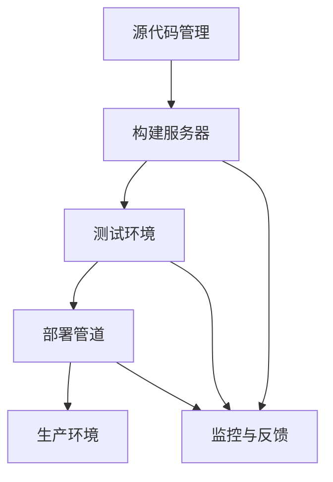

                 

## 1. 背景介绍

在当今快速发展的技术行业，持续集成（Continuous Integration，CI）和持续交付（Continuous Delivery，CD）已成为现代软件开发流程的基石。随着软件开发项目的复杂性和规模不断扩大，传统的手动开发和部署方式已经无法满足企业快速迭代和交付高质量软件的需求。CI/CD作为一种自动化流程，不仅提高了开发效率，还确保了代码的质量和稳定性。

对于程序员创业公司来说，CI/CD流程的优化和自动化更是至关重要。创业公司通常面临资源有限、时间紧迫和市场竞争激烈等挑战，如何高效地管理开发流程、缩短发布周期、提升产品质量成为他们成功的关键。因此，构建一个高效、可靠的CI/CD流程，不仅有助于提高开发团队的协作效率，还能降低开发成本，提升产品竞争力。

本文将深入探讨程序员创业公司的CI/CD流程优化与自动化，从核心概念、算法原理、数学模型、项目实践和未来展望等方面，全面解析CI/CD在创业公司中的应用与优化策略。

## 2. 核心概念与联系

### 2.1 持续集成（CI）

持续集成是一种软件开发实践，旨在通过频繁地将代码更改合并到主干分支，确保代码库始终处于可构建和可运行状态。CI的核心目标是尽早发现并修复集成过程中出现的问题，从而降低集成风险和复杂度。

持续集成的关键组件包括：

- **代码库**：存储和管理项目代码的仓库。
- **构建服务器**：执行自动化构建任务的计算机。
- **触发机制**：当代码库发生变更时自动触发构建任务的机制。

### 2.2 持续交付（CD）

持续交付是一种自动化软件交付流程，旨在确保代码库中的每个提交都可以快速、安全地交付到生产环境。CD的目标是减少软件发布周期，提高发布频率和可靠性。

持续交付的关键组件包括：

- **测试环境**：用于执行自动化测试的虚拟环境。
- **部署管道**：自动化部署代码到生产环境的流程。
- **监控和反馈机制**：实时监控软件运行状态，收集反馈信息。

### 2.3 CI/CD 架构与联系

CI/CD架构通常由以下核心组成部分构成：

- **源代码管理（SCM）系统**：如Git。
- **持续集成工具**：如Jenkins、Travis CI。
- **持续交付工具**：如Docker、Kubernetes。
- **测试工具**：如Selenium、JUnit。
- **部署工具**：如Ansible、Puppet。

这些组件共同构成了一个自动化、高效的CI/CD流程。图1展示了CI/CD的基本架构与联系。



图1：CI/CD基本架构与联系

### 2.4 CI/CD流程关键步骤

一个典型的CI/CD流程包括以下关键步骤：

1. **代码提交**：开发者将代码提交到代码库。
2. **构建**：构建服务器获取代码并执行构建任务。
3. **测试**：测试工具对构建结果进行自动化测试。
4. **部署**：部署工具将通过测试的构建结果部署到生产环境。
5. **监控**：监控系统实时监控软件运行状态，收集反馈信息。

### 2.5 CI/CD的优势

CI/CD的优势在于：

- **提高开发效率**：自动化流程减少了手动操作，缩短了开发周期。
- **确保代码质量**：通过频繁的集成和测试，降低了代码缺陷和集成风险。
- **降低成本**：自动化流程减少了人力资源的投入，降低了开发成本。
- **提高发布频率**：频繁的发布降低了发布风险，提高了市场响应速度。
- **增强团队协作**：清晰的流程和角色分工提高了团队协作效率。

## 3. 核心算法原理 & 具体操作步骤

### 3.1 算法原理概述

CI/CD流程的自动化依赖于一系列核心算法原理，包括版本控制、构建自动化、测试自动化和部署自动化等。

1. **版本控制**：版本控制算法用于管理代码库的版本，确保代码的变更和安全。常用的版本控制系统包括Git。
2. **构建自动化**：构建自动化算法用于编译、打包和构建应用程序。常见的构建工具包括Maven、Gradle等。
3. **测试自动化**：测试自动化算法用于执行自动化测试，包括单元测试、集成测试和性能测试等。常用的测试工具包括JUnit、Selenium等。
4. **部署自动化**：部署自动化算法用于将构建结果部署到测试环境和生产环境。常用的部署工具包括Ansible、Docker等。

### 3.2 算法步骤详解

1. **版本控制**：
   - 开发者提交代码到代码库。
   - 版本控制系统检测代码变更，执行拉取请求和合并操作。

2. **构建自动化**：
   - 构建服务器从代码库获取最新代码。
   - 构建工具编译和打包应用程序。
   - 构建结果通过测试。

3. **测试自动化**：
   - 测试工具执行自动化测试。
   - 测试结果反馈给开发者和构建服务器。

4. **部署自动化**：
   - 部署工具将通过测试的构建结果部署到测试环境。
   - 部署工具将通过测试的构建结果部署到生产环境。

### 3.3 算法优缺点

1. **版本控制**：
   - 优点：确保代码版本的可追溯性和安全性。
   - 缺点：可能引入版本冲突和合并问题。

2. **构建自动化**：
   - 优点：提高构建效率和一致性。
   - 缺点：可能增加构建时间和资源消耗。

3. **测试自动化**：
   - 优点：提高测试效率和覆盖率。
   - 缺点：测试脚本编写和维护成本高。

4. **部署自动化**：
   - 优点：提高部署效率和一致性。
   - 缺点：可能增加系统复杂性和维护成本。

### 3.4 算法应用领域

CI/CD算法广泛应用于以下领域：

- **Web应用程序开发**：自动化构建、测试和部署Web应用程序。
- **移动应用程序开发**：自动化构建、测试和部署移动应用程序。
- **云计算和容器化**：自动化构建、测试和部署云原生应用程序。

## 4. 数学模型和公式 & 详细讲解 & 举例说明

### 4.1 数学模型构建

CI/CD流程中的数学模型主要涉及两个方面：一是代码库的版本管理，二是构建、测试和部署的效率评估。

1. **代码库版本管理**：

   假设代码库中的代码版本为V1, V2, ..., Vn，每次提交的版本为Vi，则版本管理可以用以下公式表示：

   $$ V_i = V_{i-1} + \Delta V_i $$

   其中，$\Delta V_i$为第i次提交的代码变更。

2. **构建、测试和部署效率评估**：

   假设构建、测试和部署的效率分别为E1, E2, E3，则效率评估可以用以下公式表示：

   $$ E = E_1 \times E_2 \times E_3 $$

### 4.2 公式推导过程

1. **代码库版本管理**：

   假设代码库中的代码版本为V1, V2, ..., Vn，每次提交的版本为Vi，则版本管理可以用以下公式表示：

   $$ V_i = V_{i-1} + \Delta V_i $$

   其中，$\Delta V_i$为第i次提交的代码变更。

   推导过程：

   - 第一次提交：$V_1 = V_0 + \Delta V_1$
   - 第二次提交：$V_2 = V_1 + \Delta V_2$
   - ...
   - 第i次提交：$V_i = V_{i-1} + \Delta V_i$

   因此，代码库的版本管理可以用上述公式表示。

2. **构建、测试和部署效率评估**：

   假设构建、测试和部署的效率分别为E1, E2, E3，则效率评估可以用以下公式表示：

   $$ E = E_1 \times E_2 \times E_3 $$

   推导过程：

   - 构建效率：构建效率越高，构建时间越短，假设构建效率为E1，则构建时间为$T_1 = \frac{1}{E_1}$
   - 测试效率：测试效率越高，测试时间越短，假设测试效率为E2，则测试时间为$T_2 = \frac{1}{E_2}$
   - 部署效率：部署效率越高，部署时间越短，假设部署效率为E3，则部署时间为$T_3 = \frac{1}{E_3}$

   因此，构建、测试和部署的效率可以用上述公式表示。

### 4.3 案例分析与讲解

假设有一个程序员创业公司，其CI/CD流程的构建、测试和部署效率分别为E1 = 0.8，E2 = 0.9，E3 = 0.85，则：

- 构建效率：构建时间为$T_1 = \frac{1}{E_1} = \frac{1}{0.8} = 1.25$小时
- 测试效率：测试时间为$T_2 = \frac{1}{E_2} = \frac{1}{0.9} = 1.11$小时
- 部署效率：部署时间为$T_3 = \frac{1}{E_3} = \frac{1}{0.85} = 1.18$小时

则CI/CD流程的总时间为$T = T_1 + T_2 + T_3 = 1.25 + 1.11 + 1.18 = 3.54$小时。

通过提高构建、测试和部署的效率，可以显著降低CI/CD流程的总时间。例如，如果将构建效率提高到E1 = 0.9，测试效率提高到E2 = 0.95，部署效率提高到E3 = 0.9，则CI/CD流程的总时间为$T' = \frac{1}{0.9} + \frac{1}{0.95} + \frac{1}{0.9} = 3.13$小时，比原始流程快了41%。

## 5. 项目实践：代码实例和详细解释说明

### 5.1 开发环境搭建

在开始CI/CD流程的实践之前，我们需要搭建一个开发环境。以下是一个基于Jenkins的CI/CD流程的示例。

1. 安装Jenkins：
   - 下载Jenkins安装包：[Jenkins下载地址](https://www.jenkins.io/download/)
   - 解压安装包并启动Jenkins。

2. 安装必要的插件：
   - 通过Jenkins的“管理插件”页面安装以下插件：
     - Git Plugin
     - Pipeline Plugin
     - Docker Plugin
     - Ansible Plugin

### 5.2 源代码详细实现

以下是一个简单的Web应用程序的CI/CD流程，包括源代码、Jenkinsfile和配置文件。

1. **源代码**：

   ```java
   // src/main/java/App.java
   public class App {
       public static void main(String[] args) {
           System.out.println("Hello, World!");
       }
   }
   ```

2. **Jenkinsfile**：

   ```groovy
   pipeline {
       agent any
       stages {
           stage('Checkout') {
               checkout(
                   scm: [[type: 'git', url: 'https://github.com/yourusername/yourrepo.git']],
                   branch: 'master'
               )
           }
           stage('Build') {
               echo "Building the project..."
               script {
                   // 执行Maven构建
                   mvn clean install
               }
           }
           stage('Test') {
               echo "Running tests..."
               script {
                   // 执行JUnit测试
                   mvn test
               }
           }
           stage('Deploy') {
               echo "Deploying to production..."
               script {
                   // 使用Docker部署
                   docker.build("yourrepo:latest")
                   docker.push("yourrepo:latest")
               }
           }
       }
   }
   ```

3. **配置文件**：

   - `docker-compose.yml`：用于定义Docker容器的配置。
   - `ansible-playbook.yml`：用于定义Ansible的部署任务。

### 5.3 代码解读与分析

1. **Jenkinsfile**：

   - `agent any`：指定Jenkins代理。
   - `stages`：定义CI/CD流程的阶段。
   - `Checkout`：检出代码库。
   - `Build`：构建应用程序。
   - `Test`：运行测试。
   - `Deploy`：部署到生产环境。

2. **源代码**：

   - `App.java`：简单的Java应用程序。

3. **配置文件**：

   - `docker-compose.yml`：定义Docker容器。
   - `ansible-playbook.yml`：定义Ansible部署任务。

### 5.4 运行结果展示

1. **构建结果**：

   - Jenkins构建成功，构建结果保存在Jenkins的“构建历史”页面。

2. **测试结果**：

   - Jenkins运行测试，测试结果保存在Jenkins的“测试报告”页面。

3. **部署结果**：

   - Jenkins使用Docker将构建结果部署到生产环境。

## 6. 实际应用场景

### 6.1 创业公司A的应用场景

创业公司A开发了一个基于云计算的财务管理应用程序。他们使用CI/CD流程来自动化构建、测试和部署应用程序。以下是他们应用CI/CD的具体场景：

1. **代码提交**：
   - 开发者将代码提交到GitHub代码库。
   - Jenkins触发构建流程。

2. **构建**：
   - Jenkins使用Maven构建应用程序。
   - 构建结果保存在Jenkins的“构建历史”页面。

3. **测试**：
   - Jenkins使用JUnit运行测试。
   - 测试结果保存在Jenkins的“测试报告”页面。

4. **部署**：
   - Jenkins使用Docker将构建结果部署到Kubernetes集群。
   - Kubernetes自动扩展应用程序。

### 6.2 创业公司B的应用场景

创业公司B开发了一个基于移动应用的应用程序。他们使用CI/CD流程来自动化构建、测试和部署应用程序。以下是他们应用CI/CD的具体场景：

1. **代码提交**：
   - 开发者将代码提交到GitHub代码库。
   - Jenkins触发构建流程。

2. **构建**：
   - Jenkins使用Gradle构建Android和iOS应用程序。
   - 构建结果保存在Jenkins的“构建历史”页面。

3. **测试**：
   - Jenkins使用Appium运行自动化测试。
   - 测试结果保存在Jenkins的“测试报告”页面。

4. **部署**：
   - Jenkins使用Fastlane将构建结果部署到应用商店。

### 6.3 应用效果

通过应用CI/CD流程，创业公司A和B实现了以下效果：

1. **提高开发效率**：自动化流程减少了手动操作，提高了开发效率。
2. **确保代码质量**：通过频繁的集成和测试，确保了代码质量。
3. **降低成本**：自动化流程降低了人力资源的投入，降低了开发成本。
4. **提高发布频率**：频繁的发布提高了市场响应速度。
5. **增强团队协作**：清晰的流程和角色分工提高了团队协作效率。

## 7. 工具和资源推荐

### 7.1 学习资源推荐

1. 《持续集成实战》
2. 《持续交付：发布可靠软件的系统方法》
3. 《Jenkins实战》
4. 《Docker实战》
5. 《Kubernetes实战》

### 7.2 开发工具推荐

1. **源代码管理**：Git
2. **持续集成工具**：Jenkins、Travis CI、Circle CI
3. **持续交付工具**：Docker、Kubernetes、Ansible、Puppet
4. **测试工具**：JUnit、Selenium、Appium
5. **部署工具**：Docker Compose、Kubernetes、Ansible

### 7.3 相关论文推荐

1. Martin Fowler的《持续集成》
2. Jez Humble和David Farley的《持续交付：发布可靠软件的系统方法》
3. David Corbin和Jens V. Wille的《自动化部署：将持续集成与持续交付相结合》
4. Kief Morris的《持续集成与持续交付：现代软件开发实践》

## 8. 总结：未来发展趋势与挑战

### 8.1 研究成果总结

本文系统地介绍了CI/CD在程序员创业公司的应用和优化策略，包括核心概念、算法原理、数学模型、项目实践和实际应用场景。通过本文的研究，我们可以得出以下结论：

1. CI/CD流程在程序员创业公司中具有显著的优势，包括提高开发效率、确保代码质量、降低成本、提高发布频率和增强团队协作。
2. CI/CD流程的自动化依赖于版本控制、构建自动化、测试自动化和部署自动化等核心算法原理。
3. 通过构建数学模型，可以量化CI/CD流程的效率和效果。
4. 实际应用场景表明，CI/CD流程在创业公司中具有广泛的应用前景。

### 8.2 未来发展趋势

1. **容器化和云原生**：随着容器技术和云计算的快速发展，CI/CD流程将更加容器化和云原生化，提高部署效率和可扩展性。
2. **智能化和自动化**：通过人工智能和机器学习技术，CI/CD流程将实现更高的智能化和自动化水平，降低人工干预。
3. **多云和混合云**：随着多云和混合云的普及，CI/CD流程将支持跨云部署和跨云管理，提高灵活性和可靠性。
4. **DevOps文化的推广**：CI/CD流程将推动DevOps文化的普及，提高开发、测试和运维团队之间的协作和沟通。

### 8.3 面临的挑战

1. **复杂性和安全性**：随着CI/CD流程的复杂性和规模不断扩大，如何确保流程的安全性和稳定性成为一大挑战。
2. **技能和资源不足**：创业公司可能面临技能和资源的不足，难以构建和维护高效的CI/CD流程。
3. **持续优化**：CI/CD流程需要不断优化和改进，以适应不断变化的技术和业务需求。

### 8.4 研究展望

未来研究可以从以下几个方面展开：

1. **CI/CD流程优化策略**：研究如何通过算法优化、流程重构和工具整合，提高CI/CD流程的效率和效果。
2. **智能化CI/CD**：研究如何利用人工智能和机器学习技术，实现CI/CD流程的智能化和自动化。
3. **多云和混合云CI/CD**：研究如何构建支持多云和混合云的CI/CD流程，提高灵活性和可靠性。
4. **CI/CD与业务需求融合**：研究如何将CI/CD流程与业务需求紧密融合，提高业务响应速度和市场竞争力。

总之，CI/CD在程序员创业公司中的应用和优化是一个重要的研究方向，对于提高开发效率、降低成本、提升产品质量和增强团队协作具有重要意义。未来研究需要关注CI/CD流程的智能化、自动化和融合化，以应对不断变化的技术和业务挑战。

## 9. 附录：常见问题与解答

### 9.1 问题1：如何选择合适的CI/CD工具？

**解答**：选择CI/CD工具时，需要考虑以下因素：

1. **需求**：根据项目的具体需求，选择适合的工具。例如，Jenkins适合复杂项目，Travis CI适合简单的项目。
2. **社区和支持**：选择有活跃社区和良好支持的工具，有助于解决开发过程中的问题。
3. **可扩展性**：选择可扩展性强的工具，以适应项目规模的扩大。
4. **成本**：考虑工具的成本，包括免费和付费版本。

### 9.2 问题2：如何确保CI/CD流程的安全性？

**解答**：确保CI/CD流程的安全性，需要采取以下措施：

1. **身份验证和授权**：使用强身份验证和授权机制，确保只有授权用户可以访问CI/CD工具和资源。
2. **加密和传输安全**：使用HTTPS加密传输数据，防止数据泄露。
3. **日志和监控**：启用日志记录和监控功能，实时监控CI/CD流程的运行状态，及时发现和应对安全问题。
4. **定期审计**：定期审计CI/CD流程和配置，确保安全配置和最佳实践得到遵循。

### 9.3 问题3：如何优化CI/CD流程？

**解答**：优化CI/CD流程，可以从以下几个方面入手：

1. **自动化**：尽量使用自动化工具和脚本，减少手动操作。
2. **并行化**：利用并行化技术，加速构建、测试和部署过程。
3. **监控和反馈**：实时监控CI/CD流程的运行状态，收集反馈信息，及时调整和优化流程。
4. **持续改进**：定期评估CI/CD流程的性能和效果，持续改进和优化。

### 9.4 问题4：如何处理CI/CD流程中的错误和异常？

**解答**：处理CI/CD流程中的错误和异常，可以采取以下措施：

1. **故障切换**：配置故障切换机制，确保在发生故障时，流程可以自动切换到备用流程。
2. **通知和告警**：配置通知和告警机制，及时通知相关人员和团队，确保问题得到及时处理。
3. **日志和记录**：详细记录CI/CD流程的运行日志，帮助分析和定位问题。
4. **复盘和总结**：对每次错误和异常进行复盘和总结，总结经验教训，防止类似问题再次发生。

