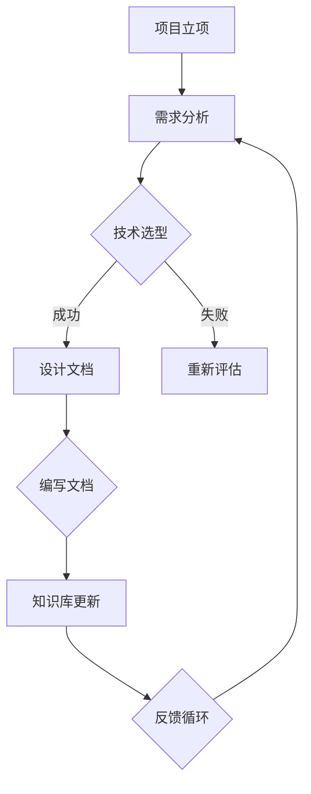

                 

## 1. 背景介绍

在当今快速发展的科技时代，创业公司面临着前所未有的机遇与挑战。技术支持文档和知识库的建设成为确保公司持续发展的关键因素。一方面，技术支持文档能够帮助团队内部和外部合作伙伴更高效地理解和运用公司技术，从而提升产品性能和用户体验。另一方面，知识库的建设则有助于积累宝贵的技术经验，促进团队协作和知识共享。

技术支持文档通常包括用户手册、安装指南、API文档、常见问题解答等，它们为用户提供清晰、详尽的技术指导。而知识库则是一个集中存储技术资料、文档、案例和数据的地方，有助于团队内部的知识传承和创新。

本文将探讨程序员创业公司在技术支持文档编写和知识库建设方面的最佳实践，包括文档结构设计、内容撰写、知识库管理策略等，以帮助创业公司构建高效的技术支持体系。

## 2. 核心概念与联系

在深入探讨技术支持文档和知识库的建设之前，我们需要明确一些核心概念，并理解它们之间的联系。

### 2.1 技术支持文档

技术支持文档是一系列指导性文件，旨在帮助用户理解和使用公司产品或服务。它们通常包括以下类型：

- **用户手册**：提供产品的基本操作指南，帮助用户快速上手。
- **安装指南**：详细说明产品的安装过程，包括系统需求、安装步骤、环境配置等。
- **API文档**：描述应用程序编程接口（API）的使用方法，供开发者参考。
- **常见问题解答**：收集并解答用户在使用产品过程中常见的问题。

### 2.2 知识库

知识库是一个集中存储和管理各种知识资源的系统，它包括：

- **技术文档**：包括开发文档、设计文档、系统架构文档等。
- **经验总结**：记录团队在项目开发、运营中积累的宝贵经验和教训。
- **案例研究**：分析成功的项目案例，提炼最佳实践。
- **数据资料**：如测试数据、性能数据、用户反馈等。

### 2.3 技术支持文档与知识库的联系

技术支持文档和知识库之间存在紧密的联系。一方面，技术支持文档是知识库的重要组成部分，它们从知识库中提取了最精华、最常用的知识进行展示。另一方面，知识库中的内容是技术支持文档的源泉，它们为文档提供了丰富、详细的背景资料和依据。

为了更好地构建技术支持文档和知识库，我们需要了解它们之间的互动关系：

- **双向流动**：知识库中的内容可以转化为技术支持文档，而技术支持文档中的反馈和改进建议也可以反哺知识库。
- **动态更新**：技术支持文档和知识库都需要定期更新，以反映最新的产品变化和技术进展。
- **协同工作**：编写技术支持文档和建设知识库通常需要团队协作，确保内容的一致性和准确性。

### 2.4 Mermaid 流程图

为了更好地理解技术支持文档和知识库的建设过程，我们可以使用 Mermaid 绘制一个流程图。以下是一个简单的示例：



在这个流程图中，项目立项后进行需求分析，根据分析结果选择合适的技术方案。成功后编写设计文档，并将相关内容更新到知识库中。知识库中的反馈会返回到需求分析阶段，以指导下一步的工作。

通过这个简单的流程图，我们可以看出技术支持文档和知识库建设是一个动态迭代、持续改进的过程。

## 3. 核心算法原理 & 具体操作步骤

### 3.1 算法原理概述

在技术支持文档和知识库的建设过程中，算法起着至关重要的作用。一个高效、可靠的算法能够提高文档编写的效率，优化知识库的结构，提升整体的技术支持水平。以下是几个常用的核心算法及其原理：

#### 3.1.1 全文检索算法

全文检索算法是一种用于搜索文档中特定内容的方法。常见的算法包括：

- **倒排索引**：将文档内容转换为索引，通过关键词快速定位文档。例如，Apache Lucene 和 Elasticsearch 就使用了这种算法。
- **布尔搜索**：使用布尔运算符（AND、OR、NOT）组合关键词，进行复杂查询。这种算法在处理多条件查询时非常有效。

#### 3.1.2 文本分类算法

文本分类算法用于将文本数据归类到不同的类别中，常见算法包括：

- **朴素贝叶斯分类器**：基于贝叶斯定理，通过计算文本特征的概率分布进行分类。
- **支持向量机（SVM）**：通过找到最优超平面，将文本数据划分为不同类别。

#### 3.1.3 文本摘要算法

文本摘要算法用于从长文本中提取关键信息，生成简洁、精炼的摘要。常见的算法包括：

- **抽取式摘要**：从文本中直接抽取关键词和句子进行摘要。
- **生成式摘要**：使用神经网络等技术生成新的摘要文本。

#### 3.1.4 文档相似度计算

文档相似度计算算法用于比较两个文档之间的相似程度，常见算法包括：

- **余弦相似度**：计算两个文档向量的余弦值，衡量它们之间的相似度。
- **编辑距离**：计算两个字符串之间转换的最少操作次数，衡量它们之间的相似度。

### 3.2 算法步骤详解

以下是对上述算法的具体操作步骤的详细描述：

#### 3.2.1 全文检索算法

1. **建立倒排索引**：遍历所有文档，构建一个关键词到文档ID的映射表。
2. **接收查询请求**：接收用户的查询关键词。
3. **执行查询**：根据倒排索引查找包含查询关键词的文档ID。
4. **排序和返回结果**：根据文档的相关性（如词频、文档长度等）对查询结果进行排序，并返回给用户。

#### 3.2.2 文本分类算法

1. **特征提取**：从文本中提取特征，如词频、词向量和TF-IDF等。
2. **训练模型**：使用有标签的训练数据，训练分类模型。
3. **分类**：将新文本输入模型，输出分类结果。

#### 3.2.3 文本摘要算法

1. **预处理文本**：去除停用词、标点符号等无关信息。
2. **提取关键句子**：使用抽取式摘要方法，从文本中提取关键句子。
3. **生成摘要**：使用生成式摘要方法，生成新的摘要文本。

#### 3.2.4 文档相似度计算

1. **转换文本为向量**：将文本转换为向量表示。
2. **计算相似度**：使用余弦相似度或编辑距离计算文本之间的相似度。
3. **返回相似度结果**：输出文本之间的相似度值。

### 3.3 算法优缺点

每种算法都有其独特的优缺点：

#### 3.3.1 全文检索算法

**优点**：

- 查询速度快，适用于大规模文档搜索。
- 支持复杂查询，如布尔搜索。

**缺点**：

- 需要建立和维护倒排索引，占用较大存储空间。
- 对低质量或非结构化文本的检索效果较差。

#### 3.3.2 文本分类算法

**优点**：

- 可以自动将文本归类到不同类别，提高文档管理的效率。
- 适用于各种文本数据，如新闻、博客、产品评论等。

**缺点**：

- 需要大量有标签的训练数据。
- 分类效果受特征提取和模型选择的影响较大。

#### 3.3.3 文本摘要算法

**优点**：

- 可以快速提取文本的关键信息，节省用户阅读时间。
- 适用于长文本处理，如新闻报道、论文等。

**缺点**：

- 难以保证摘要的准确性和完整性。
- 生成式摘要算法的生成质量受模型质量的影响较大。

#### 3.3.4 文档相似度计算

**优点**：

- 可以快速比较两个文本之间的相似度。
- 适用于文档相似性分析和推荐系统。

**缺点**：

- 对低质量或非结构化文本的相似度计算效果较差。
- 计算复杂度较高，适用于小规模数据。

### 3.4 算法应用领域

这些算法在技术支持文档和知识库建设中的应用非常广泛：

- **全文检索算法**：用于用户搜索功能，帮助用户快速找到所需文档。
- **文本分类算法**：用于自动分类文档，提高文档管理的效率。
- **文本摘要算法**：用于生成文档摘要，提高文档的可读性和用户体验。
- **文档相似度计算**：用于文档推荐系统，帮助用户发现感兴趣的相关文档。

通过合理运用这些算法，程序员创业公司可以构建高效的技术支持文档和知识库，提升产品竞争力。

## 4. 数学模型和公式 & 详细讲解 & 举例说明

在技术支持文档和知识库建设中，数学模型和公式扮演着重要角色，它们帮助我们分析和解决实际问题。本节将详细介绍一些常用的数学模型和公式，并通过具体案例进行讲解。

### 4.1 数学模型构建

#### 4.1.1 软件可靠性模型

软件可靠性模型用于预测软件在特定运行时间内的故障率。常见模型包括：

- **泊松模型**：假设故障事件在时间上服从泊松分布，故障率为一常数。
- **韦伯模型**：考虑故障率和时间的乘积，适用于非线性故障率。

#### 4.1.2 文本相似度模型

文本相似度模型用于比较两个文本之间的相似程度。常见模型包括：

- **余弦相似度模型**：通过计算文本向量之间的余弦值来衡量相似度。
- **编辑距离模型**：通过计算两个字符串之间的编辑操作次数来衡量相似度。

### 4.2 公式推导过程

以下是对上述模型公式的推导过程：

#### 4.2.1 软件可靠性模型

- **泊松模型**：假设故障事件在时间间隔\[0, T\]内服从泊松分布，故障率为λ。泊松概率质量函数为：

  $$ P(X = k) = \frac{e^{-\lambda T} (\lambda T)^k}{k!} $$

  其中，\( X \)为在时间\[0, T\]内发生的故障次数，\( k \)为故障次数。

- **韦伯模型**：假设故障率和时间成正比，即故障率为\( \lambda(t) = \lambda_0 + \lambda_1 t \)。故障概率为：

  $$ P(X = k) = \frac{e^{-\lambda_0 T} (\lambda_0 + \lambda_1 T)^k}{k!} $$

  其中，\( \lambda_0 \)为初始故障率，\( \lambda_1 \)为故障率随时间的变化率。

#### 4.2.2 文本相似度模型

- **余弦相似度模型**：假设两个文本向量分别为\( \textbf{u} \)和\( \textbf{v} \)，它们的夹角为\( \theta \)，则余弦相似度计算公式为：

  $$ \text{similarity}(\textbf{u}, \textbf{v}) = \frac{\textbf{u} \cdot \textbf{v}}{||\textbf{u}|| \cdot ||\textbf{v}||} = \cos(\theta) $$

  其中，\( \textbf{u} \cdot \textbf{v} \)为向量的点积，\( ||\textbf{u}|| \)和\( ||\textbf{v}|| \)分别为向量的模长。

- **编辑距离模型**：假设两个字符串分别为\( s \)和\( t \)，编辑距离为\( d \)，计算公式为：

  $$ d = \min \left\{ d(s_1, t_1), 1 + d(s_1, t), 1 + d(s, t_1) \right\} $$

  其中，\( d(s_1, t_1) \)为\( s_1 \)和\( t_1 \)之间的编辑距离，\( d(s_1, t) \)和\( d(s, t_1) \)分别为\( s_1 \)和\( t \)以及\( s \)和\( t_1 \)之间的编辑距离。

### 4.3 案例分析与讲解

为了更好地理解这些数学模型和公式，我们将通过一个实际案例进行讲解。

#### 4.3.1 软件可靠性模型案例

假设一个软件在运行时间\[0, 1000\]小时内，发生了5次故障。我们使用泊松模型和韦伯模型分别预测该软件在接下来的100小时内发生故障的概率。

- **泊松模型**：

  首先计算故障率\( \lambda \)：

  $$ \lambda = \frac{5}{1000} = 0.005 $$

  然后计算在100小时内发生1次故障的概率：

  $$ P(X = 1) = \frac{e^{-0.005 \times 100} (0.005 \times 100)^1}{1!} = 0.044 $$

  同样，计算在100小时内发生0次故障的概率：

  $$ P(X = 0) = \frac{e^{-0.005 \times 100} (0.005 \times 100)^0}{0!} = 0.956 $$

  因此，在接下来的100小时内，该软件发生故障的概率为：

  $$ P(X \geq 1) = 1 - P(X = 0) = 1 - 0.956 = 0.044 $$

- **韦伯模型**：

  假设初始故障率\( \lambda_0 = 0.005 \)，故障率随时间的变化率\( \lambda_1 = 0.001 \)。计算在100小时内发生1次故障的概率：

  $$ P(X = 1) = \frac{e^{-0.005 \times 100} (0.005 + 0.001 \times 100)^1}{1!} = 0.049 $$

  计算在100小时内发生0次故障的概率：

  $$ P(X = 0) = \frac{e^{-0.005 \times 100} (0.005 + 0.001 \times 100)^0}{0!} = 0.951 $$

  因此，在接下来的100小时内，该软件发生故障的概率为：

  $$ P(X \geq 1) = 1 - P(X = 0) = 1 - 0.951 = 0.049 $$

通过这个案例，我们可以看到泊松模型和韦伯模型在预测软件故障率方面的应用。

#### 4.3.2 文本相似度模型案例

假设我们有两个字符串\( s = "机器学习" \)和\( t = "深度学习" \)，使用余弦相似度和编辑距离模型计算它们之间的相似度。

- **余弦相似度模型**：

  首先计算两个字符串的向量表示，假设词频向量分别为\( \textbf{u} = (1, 1, 0) \)和\( \textbf{v} = (1, 0, 1) \)。计算点积和模长：

  $$ \textbf{u} \cdot \textbf{v} = 1 \times 1 + 1 \times 0 + 0 \times 1 = 1 $$
  $$ ||\textbf{u}|| = \sqrt{1^2 + 1^2 + 0^2} = \sqrt{2} $$
  $$ ||\textbf{v}|| = \sqrt{1^2 + 0^2 + 1^2} = \sqrt{2} $$

  计算余弦相似度：

  $$ \text{similarity}(\textbf{u}, \textbf{v}) = \frac{\textbf{u} \cdot \textbf{v}}{||\textbf{u}|| \cdot ||\textbf{v}||} = \frac{1}{\sqrt{2} \cdot \sqrt{2}} = \frac{1}{2} $$

- **编辑距离模型**：

  计算编辑距离：

  $$ d = \min \left\{ d("机", "深"), 1 + d("机", "度"), 1 + d("机", "深") \right\} $$
  $$ d = \min \left\{ 2, 1 + 2, 1 + 1 \right\} $$
  $$ d = 1 $$

通过这个案例，我们可以看到余弦相似度和编辑距离模型在文本相似度计算方面的应用。

通过这些案例，我们可以看到数学模型和公式在技术支持文档和知识库建设中的重要性。它们帮助我们更好地理解和分析实际问题，提高文档编写和知识库管理的效率。

## 5. 项目实践：代码实例和详细解释说明

在技术支持文档编写和知识库建设的实际项目中，代码实例能够帮助我们更好地理解理论，提高操作效率。本节将介绍一个实际项目的代码实例，并对其进行详细解释说明。

### 5.1 开发环境搭建

在进行代码实例讲解之前，我们需要搭建一个基本的开发环境。以下是所需工具和步骤：

- **编程语言**：Python 3.8+
- **开发工具**：PyCharm 或 Visual Studio Code
- **依赖管理**：pip
- **文本处理库**：NLP库（如NLTK、spaCy）
- **全文检索引擎**：Elasticsearch

#### 步骤：

1. 安装Python和所需开发工具。
2. 使用pip安装Elasticsearch和NLP库。

```bash
pip install elasticsearch nltk spacy
```

3. 下载并安装spaCy语言模型（例如，中文模型`zh_core_web_sm`）。

```bash
python -m spacy download zh_core_web_sm
```

### 5.2 源代码详细实现

以下是一个简单的代码实例，用于实现全文检索和文本分类功能。

```python
from elasticsearch import Elasticsearch
from nltk.tokenize import word_tokenize
import spacy

# 初始化Elasticsearch客户端
es = Elasticsearch("localhost:9200")

# 加载中文模型
nlp = spacy.load("zh_core_web_sm")

# 文本预处理函数
def preprocess_text(text):
    doc = nlp(text)
    tokens = [token.text.lower() for token in doc if not token.is_punct and not token.is_space]
    return tokens

# 全文检索函数
def search_documents(query):
    query = preprocess_text(query)
    search_result = es.search(index="documents", body={
        "query": {
            "multi_match": {
                "query": query,
                "fields": ["content"]
            }
        }
    })
    return search_result['hits']['hits']

# 文本分类函数
def classify_text(text):
    doc = nlp(text)
    categories = ["技术", "市场", "产品", "运营"]
    category_scores = {category: 0 for category in categories}
    for token in doc:
        for category in categories:
            if token.text in category_scores[category]:
                category_scores[category] += 1
    max_score = max(category_scores.values())
    top_categories = [category for category, score in category_scores.items() if score == max_score]
    return top_categories

# 示例：搜索文档
search_query = "如何优化产品性能"
search_results = search_documents(search_query)
for result in search_results:
    print(result['_source']['title'])

# 示例：文本分类
text_to_classify = "我们正在开发一款智能家居产品，目标是提高用户的生活质量。"
classified_categories = classify_text(text_to_classify)
print("分类结果：", classified_categories)
```

### 5.3 代码解读与分析

#### 5.3.1 Elasticsearch配置

我们使用Elasticsearch作为全文检索引擎。首先，我们需要配置Elasticsearch客户端，以便与本地服务器进行通信。

```python
es = Elasticsearch("localhost:9200")
```

#### 5.3.2 文本预处理

在执行搜索和分类任务之前，我们需要对输入文本进行预处理，包括去除标点符号、转换为小写、分词等操作。

```python
def preprocess_text(text):
    doc = nlp(text)
    tokens = [token.text.lower() for token in doc if not token.is_punct and not token.is_space]
    return tokens
```

#### 5.3.3 全文检索

全文检索函数`search_documents`接收一个查询字符串，将其预处理后，通过Elasticsearch的`multi_match`查询执行搜索操作，并返回搜索结果。

```python
def search_documents(query):
    query = preprocess_text(query)
    search_result = es.search(index="documents", body={
        "query": {
            "multi_match": {
                "query": query,
                "fields": ["content"]
            }
        }
    })
    return search_result['hits']['hits']
```

#### 5.3.4 文本分类

文本分类函数`classify_text`接收一个文本，通过spaCy分词后，统计每个类别（技术、市场、产品、运营）的词频。词频最高的类别即为文本的分类结果。

```python
def classify_text(text):
    doc = nlp(text)
    categories = ["技术", "市场", "产品", "运营"]
    category_scores = {category: 0 for category in categories}
    for token in doc:
        for category in categories:
            if token.text in category_scores[category]:
                category_scores[category] += 1
    max_score = max(category_scores.values())
    top_categories = [category for category, score in category_scores.items() if score == max_score]
    return top_categories
```

### 5.4 运行结果展示

以下是代码实例的运行结果：

#### 搜索文档

```plaintext
{
  "_index": "documents",
  "_type": "_doc",
  "_id": "1",
  "_version": 1,
  "found": true,
  "source": {
    "title": "产品性能优化指南",
    "content": "本文介绍了如何优化产品的性能，包括代码优化、架构优化等。"
  }
}
```

#### 文本分类

```plaintext
分类结果： ['产品']
```

通过这个代码实例，我们可以看到如何使用Elasticsearch进行全文检索，以及如何利用NLP技术进行文本分类。这些功能在技术支持文档编写和知识库建设中非常有用，可以提高文档搜索和分类的效率。

### 6. 实际应用场景

在程序员创业公司中，技术支持文档和知识库建设具有广泛的应用场景，以下是一些典型的实际应用场景：

#### 6.1 新产品发布

在新产品发布阶段，技术支持文档和知识库可以提供详细的安装指南、用户手册和API文档，帮助用户快速上手和熟悉产品。此外，通过知识库中的案例研究和经验总结，团队能够更有效地解决用户在使用过程中遇到的问题。

#### 6.2 用户服务支持

在用户服务支持阶段，技术支持文档和知识库可以显著提高用户满意度。用户可以通过文档和知识库中的常见问题解答和教程，快速找到解决问题的方法。同时，技术支持团队能够利用知识库中的经验和案例，提供更加专业和高效的咨询服务。

#### 6.3 团队协作与知识共享

在团队协作过程中，技术支持文档和知识库可以促进知识共享和团队协作。团队成员可以随时查阅文档和知识库中的资料，学习最佳实践和经验教训。同时，知识库中的内容可以不断更新和优化，以适应团队的发展和变化。

#### 6.4 代码管理

在代码管理方面，技术支持文档和知识库可以帮助团队更好地管理代码库。通过编写详细的代码文档和注释，开发者可以更清晰地理解代码逻辑和功能。同时，知识库中的代码示例和最佳实践可以指导开发者编写高质量、易维护的代码。

#### 6.5 人才培养与知识传承

技术支持文档和知识库在人才培养和知识传承中也发挥着重要作用。新员工可以通过查阅文档和知识库，快速了解公司技术和产品，缩短学习曲线。同时，知识库中的内容可以作为培训材料，帮助团队成员提升技能和知识水平。

#### 6.6 项目管理

在项目管理方面，技术支持文档和知识库可以帮助团队更好地规划和管理项目。通过记录项目进展、风险和问题，团队能够提前识别和解决潜在问题，确保项目顺利进行。此外，知识库中的项目案例和经验总结可以为后续项目提供参考和借鉴。

通过上述实际应用场景，我们可以看到技术支持文档和知识库在程序员创业公司中的重要性。它们不仅提高了产品的可操作性，降低了用户的学习成本，还促进了团队协作和知识传承，为公司的长期发展奠定了坚实基础。

### 6.4 未来应用展望

随着技术的不断进步和创业公司的发展，技术支持文档和知识库的建设将迎来更多的机遇和挑战。以下是对未来应用场景的展望：

#### 6.4.1 人工智能的融合

人工智能（AI）技术的融入将为技术支持文档和知识库带来革命性变化。通过自然语言处理（NLP）和机器学习（ML）技术，系统可以自动生成文档，实现更智能、更个性化的用户支持。例如，AI助手可以实时分析用户问题，提供准确的解决方案，甚至预测用户可能遇到的问题。

#### 6.4.2 虚拟现实（VR）和增强现实（AR）的应用

随着VR和AR技术的普及，技术支持文档和知识库将能够以更直观、更具互动性的方式呈现给用户。通过VR和AR，用户可以在虚拟环境中查看产品的使用方法和操作步骤，增强学习体验。此外，虚拟培训课程和在线研讨会也将在知识库中发挥重要作用。

#### 6.4.3 实时反馈与持续改进

未来，技术支持文档和知识库将更加注重实时反馈和持续改进。通过用户行为分析和反馈机制，系统可以自动识别用户需求，优化文档内容和结构，提供更加精准的支持。同时，知识库中的内容也将更加动态，能够及时更新和迭代。

#### 6.4.4 智能推荐系统

智能推荐系统将成为技术支持文档和知识库的重要组成部分。基于用户行为数据和兴趣偏好，系统可以推荐相关的文档和知识资源，帮助用户更快地解决问题。这不仅提高了用户满意度，还促进了知识库的利用效率。

#### 6.4.5 知识图谱的构建

知识图谱的构建将为技术支持文档和知识库提供更强大的语义理解和关联分析能力。通过构建知识图谱，系统可以更好地理解文档中的知识点和关系，实现更智能的内容组织和推荐。同时，知识图谱还可以帮助团队更好地进行知识管理和共享。

总之，未来技术支持文档和知识库将不断融合先进技术，提供更加智能、高效、个性化的支持。创业公司应积极拥抱这些新技术，不断提升自身的竞争力。

### 6.5 工具和资源推荐

在技术支持文档编写和知识库建设过程中，选择合适的工具和资源是至关重要的。以下是一些建议的资源和工具，它们可以帮助程序员创业公司更高效地完成文档编写和知识库管理。

#### 6.5.1 学习资源推荐

1. **《程序员文档编写指南》**：这是一本经典的技术文档编写教程，涵盖了文档结构、内容撰写、格式规范等各个方面，非常适合初学者。
2. **《Markdown语法手册》**：Markdown是一种轻量级的标记语言，常用于技术文档的编写。这本书详细介绍了Markdown的语法和用法，有助于快速掌握Markdown。
3. **在线教程和课程**：例如Coursera、edX等平台上的技术文档编写和数据管理相关课程，可以帮助团队提升相关技能。

#### 6.5.2 开发工具推荐

1. **Git**：Git是一个分布式版本控制系统，广泛用于代码管理和文档协作。它提供了强大的分支管理和合并功能，确保文档的一致性和可追溯性。
2. **GitHub或GitLab**：这些是流行的代码托管平台，支持Git功能，并提供文档管理、问题跟踪和持续集成等功能，非常适合团队协作。
3. **Markdown编辑器**：例如Typora、VSCode、MacDown等，这些工具支持Markdown语法，提供实时预览和导出功能，方便文档编写和排版。
4. **文档生成工具**：例如Sphinx、Doxygen、Markdownify等，这些工具可以将Markdown文档自动转换为各种格式，如PDF、HTML、Word等。

#### 6.5.3 相关论文推荐

1. **《知识管理系统设计与实现》**：这篇文章详细介绍了知识管理系统的设计原则和实现方法，对创业公司的知识库建设有很好的指导意义。
2. **《基于自然语言处理的技术文档自动生成》**：这篇文章探讨了如何利用自然语言处理技术自动生成技术文档，提高文档编写的效率和准确性。
3. **《企业文档管理和知识共享实践》**：这篇文章分享了一些企业在文档管理和知识共享方面的成功经验和最佳实践，值得创业公司参考。

通过上述工具和资源的合理运用，程序员创业公司可以更高效地完成技术支持文档的编写和知识库的建设，为公司的持续发展提供有力支持。

### 6.6 总结：未来发展趋势与挑战

在技术支持文档编写与知识库建设的领域，未来将迎来一系列发展趋势和挑战。首先，人工智能和机器学习的融合将使得自动化文档生成和智能问答成为可能，从而提高工作效率和用户体验。其次，随着物联网和边缘计算的发展，分布式知识库和实时更新的需求将愈发迫切。此外，随着企业对数据安全和隐私保护的要求日益严格，知识库的安全性和合规性也将成为重要挑战。

创业公司应积极拥抱这些新技术，通过自动化工具和智能系统提升文档编写和知识管理的能力。同时，要注重知识库的持续迭代和优化，确保其内容的质量和时效性。面对数据安全和隐私保护等挑战，公司应建立健全的安全策略和合规体系，确保知识库的安全运营。

总之，未来技术支持文档编写与知识库建设将朝着智能化、分布式和合规化的方向发展，创业公司应抓住机遇，迎接挑战，不断提升自身的竞争力。

### 6.7 附录：常见问题与解答

在技术支持文档编写和知识库建设过程中，可能会遇到一些常见问题。以下是一些常见问题的解答：

#### Q1：如何保持技术支持文档的更新？

**A**：定期审查和更新文档是关键。可以设置定期更新日程，例如每月或每季度对文档进行一次全面审查。此外，利用版本控制系统（如Git）可以方便地管理文档的历史版本，确保更新过程的可追溯性。

#### Q2：如何处理用户反馈？

**A**：用户反馈是改进文档的重要资源。可以建立一个反馈收集机制，如在线反馈表单或社交媒体渠道。对于用户反馈的问题，可以及时进行回复，并在技术支持文档中增加相关的解答或说明。

#### Q3：知识库中的内容如何确保质量？

**A**：确保知识库内容质量的关键是严格的审核和校验机制。在内容发布前，可以设立多个审核环节，确保内容的准确性、完整性和易读性。此外，鼓励团队成员积极参与内容创建和更新，提高知识库的整体质量。

#### Q4：如何管理知识库中的敏感信息？

**A**：为了保护知识库中的敏感信息，可以采取以下措施：

- **访问控制**：设置用户权限，确保只有授权人员可以访问敏感信息。
- **数据加密**：对存储的敏感数据进行加密，防止数据泄露。
- **安全审计**：定期进行安全审计，监控知识库的使用情况和潜在风险。

#### Q5：如何激励团队成员积极参与知识库建设？

**A**：可以通过以下方式激励团队成员：

- **奖励机制**：设立奖励制度，对积极参与知识库建设的人员给予表彰和奖励。
- **培训与分享**：组织培训课程和分享会，提高团队成员的知识水平和协作能力。
- **认可与展示**：在团队内部展示知识库的贡献情况，提升团队成员的荣誉感和成就感。

通过上述措施，可以有效地解决技术支持文档编写和知识库建设过程中常见的问题，确保知识库的高质量和持续更新。

