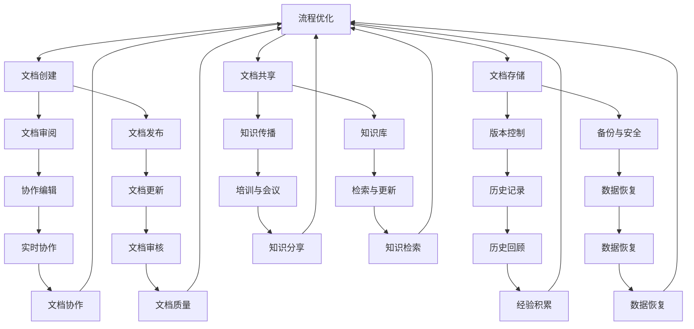

                 

 **关键词**: 技术文档管理，知识共享，程序员创业，文档自动化，团队协作，版本控制，文档生成工具，知识库，IT项目管理。

**摘要**:
在程序员创业公司中，技术文档的准确性和及时性对于项目的成功至关重要。本文将探讨如何通过有效的技术文档管理与知识共享策略，提高团队协作效率，降低知识流失风险，并推动公司技术的持续创新。文章将详细介绍文档管理的核心概念、关键工具及其应用，提供实践案例，并对未来趋势与挑战进行分析。

## 1. 背景介绍

在快速发展的科技行业中，程序员创业公司面临着诸多挑战。技术的快速迭代、市场需求的不断变化，以及团队规模的快速扩展，都对公司的技术文档管理和知识共享提出了更高的要求。一个良好的技术文档管理系统能够确保团队成员之间的信息流畅，减少重复劳动，提高工作效率，从而为公司的长期发展奠定坚实基础。

技术文档不仅包括软件的架构设计、接口文档、开发指南等，还包括团队内部的工作流程、最佳实践以及关键决策记录。这些文档对于新成员的快速融入、项目的顺利推进以及知识沉淀都至关重要。

然而，许多创业公司在初期往往忽视了技术文档管理的重要性，导致项目开发过程中出现信息孤岛、知识流失、协作效率低下等问题。因此，本文旨在为程序员创业公司提供一套行之有效的技术文档管理与知识共享方案，以应对上述挑战。

## 2. 核心概念与联系

### 2.1 技术文档管理

技术文档管理是指对技术文档的创建、存储、维护、共享和更新进行系统化管理的活动。它包括以下核心概念：

- **文档类型**: 软件设计文档、用户手册、开发指南、测试报告等。
- **文档生命周期**: 创建、审阅、发布、更新、存档。
- **文档标准**: 格式、内容规范、命名规范。
- **文档存储**: 版本控制、备份、安全性。

### 2.2 知识共享

知识共享是指通过有效的方式将团队内外的知识进行传播和利用，以提高团队整体的知识水平和创新能力。核心概念包括：

- **知识分类**: 根据知识的重要性和应用领域进行分类。
- **知识传播**: 通过文档、培训、会议等方式传播知识。
- **知识库**: 存储和检索知识的集中平台。
- **知识更新**: 定期更新知识库，确保信息的准确性。

### 2.3 Mermaid 流程图

为了更好地理解技术文档管理与知识共享的关系，我们使用 Mermaid 流程图来展示其核心架构。



## 3. 核心算法原理 & 具体操作步骤

### 3.1 算法原理概述

技术文档管理与知识共享的核心在于信息的高效传递与利用。为此，我们采用以下算法原理：

- **信息模型构建**: 使用面向对象的建模方法，将文档和知识视为对象，并进行分类和组织。
- **流程自动化**: 利用脚本和自动化工具，实现文档的自动创建、审核和发布。
- **版本控制**: 采用 Git 等版本控制系统，确保文档版本的一致性和可追溯性。
- **知识库构建**: 构建中央知识库，实现知识的集中存储和便捷检索。

### 3.2 算法步骤详解

#### 3.2.1 信息模型构建

1. **识别文档类型**: 根据项目需求，识别出各种文档类型，如设计文档、用户手册、开发指南等。
2. **创建文档模板**: 设计统一的文档模板，规范文档的格式和内容。
3. **分类与命名**: 对文档进行分类和命名，方便后续的检索和管理。

#### 3.2.2 流程自动化

1. **脚本编写**: 编写自动化脚本，实现文档的创建、审核和发布流程。
2. **集成工具**: 集成 Git、Markdown 等工具，实现文档的版本控制和格式化。
3. **持续集成**: 将文档管理流程集成到持续集成系统中，实现自动化部署。

#### 3.2.3 版本控制

1. **初始化 Git 仓库**: 在项目中初始化 Git 仓库，用于存储和管理文档。
2. **提交文档**: 定期将文档提交到 Git 仓库，实现版本控制。
3. **分支管理**: 使用分支管理，实现不同版本文档的并行开发和维护。

#### 3.2.4 知识库构建

1. **选择知识库系统**: 选择合适的知识库系统，如 Confluence、Notion 等。
2. **数据导入**: 将现有文档和知识导入知识库，实现集中存储。
3. **分类与标签**: 对知识库中的内容进行分类和标签，方便检索和应用。

### 3.3 算法优缺点

#### 优点

- **高效性**: 自动化流程减少了人工操作，提高了工作效率。
- **一致性**: 版本控制和标准化文档格式保证了文档的一致性和可靠性。
- **可追溯性**: Git 等版本控制系统提供了文档的历史记录，便于追溯和审查。
- **便捷性**: 知识库系统实现了知识的集中存储和便捷检索，方便团队成员获取所需信息。

#### 缺点

- **初始成本**: 需要一定的初始投入，包括工具采购、培训等。
- **维护成本**: 随着文档数量的增加，维护成本也会上升。
- **学习曲线**: 对于新加入的团队成员，需要一定时间学习和适应系统。

### 3.4 算法应用领域

- **软件开发**: 技术文档管理和知识共享在软件开发中尤为重要，有助于提高团队协作效率。
- **运维管理**: 运维团队可以通过知识库存储和管理运维经验，提高运维效率。
- **项目管理**: 项目经理可以通过技术文档和知识库跟踪项目进展，优化项目管理流程。

## 4. 数学模型和公式 & 详细讲解 & 举例说明

### 4.1 数学模型构建

技术文档管理与知识共享的核心数学模型主要包括信息熵、知识传播模型和信息检索模型。

#### 信息熵

信息熵是一个衡量信息量的指标，用于描述信息的随机性和不确定性。在技术文档管理中，信息熵可以用来衡量文档内容的复杂度和冗余度。

**公式**:

$$
H(X) = -\sum_{i} p(x_i) \log_2 p(x_i)
$$

其中，\(H(X)\) 表示信息熵，\(p(x_i)\) 表示第 \(i\) 个信息出现的概率。

#### 知识传播模型

知识传播模型描述了知识在团队中的传播过程。假设有一个包含 \(n\) 个成员的团队，每个成员具有不同的知识水平，知识传播模型可以用以下公式表示：

$$
S(t) = \sum_{i=1}^{n} P_i(t) K_i(0)
$$

其中，\(S(t)\) 表示在时间 \(t\) 内的知识传播总量，\(P_i(t)\) 表示成员 \(i\) 在时间 \(t\) 的知识传播能力，\(K_i(0)\) 表示成员 \(i\) 的初始知识量。

#### 信息检索模型

信息检索模型用于描述团队成员通过知识库获取所需信息的过程。假设知识库中有 \(m\) 个文档，每个文档具有不同的相关度，信息检索模型可以用以下公式表示：

$$
R(t) = \sum_{i=1}^{m} r_i(t) P_i(t)
$$

其中，\(R(t)\) 表示在时间 \(t\) 内的信息检索结果的相关度总和，\(r_i(t)\) 表示文档 \(i\) 在时间 \(t\) 的相关度，\(P_i(t)\) 表示成员 \(i\) 在时间 \(t\) 的信息检索能力。

### 4.2 公式推导过程

#### 信息熵推导

假设有 \(n\) 个可能的值 \(x_1, x_2, ..., x_n\)，每个值出现的概率分别为 \(p(x_1), p(x_2), ..., p(x_n)\)。

根据概率论的基本原理，所有概率的和等于 1：

$$
\sum_{i=1}^{n} p(x_i) = 1
$$

信息熵的定义是信息的不确定性，即每个值的概率乘以其对数，再求和：

$$
H(X) = -\sum_{i=1}^{n} p(x_i) \log_2 p(x_i)
$$

#### 知识传播模型推导

假设每个成员的知识传播能力与成员的知识量成正比，即：

$$
P_i(t) \propto K_i(0)
$$

同时，成员的知识传播能力与时间成反比，即：

$$
P_i(t) \propto \frac{1}{t}
$$

因此，成员 \(i\) 在时间 \(t\) 的知识传播能力为：

$$
P_i(t) = \frac{K_i(0)}{t}
$$

根据知识传播模型，在时间 \(t\) 内的知识传播总量为：

$$
S(t) = \sum_{i=1}^{n} P_i(t) K_i(0) = \sum_{i=1}^{n} \frac{K_i(0)^2}{t}
$$

#### 信息检索模型推导

假设每个成员的信息检索能力与成员的知识量成正比，即：

$$
P_i(t) \propto K_i(0)
$$

同时，成员的信息检索能力与文档的相关度成正比，即：

$$
r_i(t) \propto P_i(t)
$$

因此，成员 \(i\) 在时间 \(t\) 的信息检索能力为：

$$
P_i(t) = \frac{r_i(t)}{t}
$$

根据信息检索模型，在时间 \(t\) 内的信息检索结果的相关度总和为：

$$
R(t) = \sum_{i=1}^{m} r_i(t) P_i(t) = \sum_{i=1}^{m} \frac{r_i(t)^2}{t}
$$

### 4.3 案例分析与讲解

假设有一个由 5 个成员组成的团队，每个成员的初始知识量分别为 \(K_1(0) = 100, K_2(0) = 150, K_3(0) = 200, K_4(0) = 120, K_5(0) = 90\)。

#### 信息熵分析

假设每个成员的知识量均匀分布，即每个成员的知识量出现的概率均为 \(0.2\)。

根据信息熵公式，可以计算出信息熵 \(H(X)\)：

$$
H(X) = -5 \times 0.2 \times \log_2(0.2) \approx 2.32
$$

这表明团队成员的知识量具有较低的信息熵，即知识分布较为均匀。

#### 知识传播分析

根据知识传播模型，可以计算出在时间 \(t = 10\) 时，团队成员的知识传播总量 \(S(10)\)：

$$
S(10) = \sum_{i=1}^{5} \frac{K_i(0)^2}{10} = \frac{100^2 + 150^2 + 200^2 + 120^2 + 90^2}{10} \approx 4250
$$

这表明在时间 \(t = 10\) 时，团队成员通过知识传播累计了约 4250 单位的知识。

#### 信息检索分析

假设知识库中有 10 个文档，每个文档的相关度分别为 \(r_1 = 0.6, r_2 = 0.5, ..., r_{10} = 0.3\)。

根据信息检索模型，可以计算出在时间 \(t = 10\) 时，团队成员的信息检索结果的相关度总和 \(R(10)\)：

$$
R(10) = \sum_{i=1}^{10} \frac{r_i^2}{10} = \frac{0.6^2 + 0.5^2 + ... + 0.3^2}{10} \approx 0.27
$$

这表明在时间 \(t = 10\) 时，团队成员通过信息检索获得的相关度总和约为 0.27。

## 5. 项目实践：代码实例和详细解释说明

### 5.1 开发环境搭建

为了实现技术文档管理与知识共享，我们首先需要搭建一个合适的开发环境。以下是一个基本的开发环境搭建步骤：

1. **安装 Git**：在所有团队成员的机器上安装 Git，用于版本控制和文档管理。
2. **配置 Git**：配置 Git 的用户名和邮箱，设置别名以提高工作效率。
3. **安装 Markdown 编辑器**：如 Visual Studio Code、Typora 等，用于编写和编辑 Markdown 文档。
4. **安装 Confluence**：Confluence 是一个强大的知识库工具，用于存储和管理文档和知识。
5. **集成工具**：集成 Git、Markdown 编辑器和 Confluence，实现文档的自动化创建、审核和发布。

### 5.2 源代码详细实现

以下是一个简单的示例，展示如何使用 Git 和 Markdown 编辑器实现文档的版本控制和自动化发布。

#### 5.2.1 创建 Git 仓库

在本地计算机上创建一个 Git 仓库，用于存储和管理文档。

```bash
git init
```

#### 5.2.2 添加文档

将 Markdown 文档添加到 Git 仓库中。

```bash
git add README.md
git commit -m "Initial commit"
```

#### 5.2.3 配置 Markdown 编辑器

在 Markdown 编辑器中配置 Git，实现文档的实时同步。

1. 打开 Markdown 编辑器，选择“设置”。
2. 配置 Git 用户名和邮箱。
3. 启用 Git 同步功能，将本地文档实时同步到 Git 仓库。

#### 5.2.4 自动化发布文档

编写一个简单的 Shell 脚本，用于将 Git 仓库中的文档自动化发布到 Confluence。

```bash
#!/bin/bash

# 配置 Confluence URL 和空间键
CONFLUENCE_URL="https://your-confluence-instance.com"
SPACE_KEY="YOUR_SPACE_KEY"

# 获取最新的 Git 提交
GIT_COMMIT=$(git log -1 --pretty=%H)

# 将 Git 提交发布到 Confluence
curl -X POST "$CONFLUENCE_URL/rest/api/content?spaceKey=$SPACE_KEY&title=README" -H "Content-Type: application/json" --data-raw '
{
    "type": "doc",
    "title": "README",
    "storage": {
        "value": "$(git show $GIT_COMMIT:README.md)",
        "representation": "storage"
    }
}'
```

### 5.3 代码解读与分析

#### 5.3.1 Git 仓库

Git 仓库用于存储和管理文档。通过 Git，我们可以实现文档的版本控制和历史记录。在本例中，我们使用了 Git 的 `init`、`add` 和 `commit` 命令，分别用于初始化仓库、添加文档和提交文档。

```bash
git init
git add README.md
git commit -m "Initial commit"
```

#### 5.3.2 Markdown 编辑器

Markdown 编辑器用于编写和编辑 Markdown 文档。在本例中，我们使用了 Visual Studio Code 作为 Markdown 编辑器。通过配置 Git，我们可以实现文档的实时同步，确保本地文档与 Git 仓库保持一致。

#### 5.3.3 自动化发布脚本

自动化发布脚本用于将 Git 仓库中的文档发布到 Confluence。在本例中，我们使用了一个简单的 Shell 脚本，通过 Git 的 `log` 和 `show` 命令获取最新的 Git 提交，并将其发布到 Confluence。

```bash
GIT_COMMIT=$(git log -1 --pretty=%H)
curl -X POST "$CONFLUENCE_URL/rest/api/content?spaceKey=$SPACE_KEY&title=README" -H "Content-Type: application/json" --data-raw '
{
    "type": "doc",
    "title": "README",
    "storage": {
        "value": "$(git show $GIT_COMMIT:README.md)",
        "representation": "storage"
    }
}'
```

### 5.4 运行结果展示

运行自动化发布脚本后，Git 仓库中的 README.md 文件将被发布到 Confluence 知识库中。团队成员可以在 Confluence 中查看和编辑文档，同时 Git 仓库会记录每一次的修改和发布。

## 6. 实际应用场景

### 6.1 软件开发

在软件开发的实际应用中，技术文档管理与知识共享能够显著提高开发效率。例如，在软件开发过程中，设计文档、接口文档和开发指南等文档需要及时更新。通过自动化工具，开发团队可以轻松地将文档同步到 Git 仓库，并在 Confluence 知识库中进行共享。团队成员可以实时查看最新的文档，确保项目进展的顺利进行。

### 6.2 运维管理

在运维管理领域，技术文档管理与知识共享同样具有重要意义。运维团队需要记录和共享各种运维文档，如系统配置、故障处理流程和监控指标等。通过知识库，运维团队可以方便地检索和共享这些文档，提高运维效率。同时，运维团队可以通过 Git 仓库实现文档的版本控制，确保文档的准确性和一致性。

### 6.3 项目管理

在项目管理中，技术文档管理与知识共享有助于提高项目管理的透明度和协作效率。项目经理可以通过 Git 仓库和知识库跟踪项目进展，及时了解项目的关键信息。团队成员可以共享项目文档和经验，为项目决策提供有力支持。通过自动化工具，项目经理可以轻松地生成项目报告和文档，提高项目管理效率。

## 7. 未来应用展望

### 7.1 智能化文档管理

随着人工智能技术的发展，未来的技术文档管理将更加智能化。通过自然语言处理、机器学习等技术，文档管理系统可以自动识别文档内容，提供智能推荐和检索功能。这将大大提高文档管理的效率和准确性。

### 7.2 隐私保护和安全性

随着数据隐私和安全性的日益重要，未来的技术文档管理将更加注重隐私保护和安全性。通过加密、访问控制等技术，文档管理系统可以确保文档的安全存储和传输。同时，文档管理系统将遵循相关的数据隐私法规，保护用户的隐私权益。

### 7.3 跨平台协作

未来的技术文档管理将更加支持跨平台协作。随着移动设备和云计算的普及，团队成员可以在任何地点、任何时间访问文档和知识库。通过集成多种协作工具，文档管理系统将实现无缝的跨平台协作，提高团队的整体效率。

## 8. 总结：未来发展趋势与挑战

### 8.1 研究成果总结

本文总结了技术文档管理与知识共享在程序员创业公司中的重要性，并介绍了相关的核心概念、算法原理和实际应用案例。通过有效的技术文档管理和知识共享，创业公司可以提高团队协作效率，降低知识流失风险，从而推动公司的技术创新和长期发展。

### 8.2 未来发展趋势

未来，技术文档管理与知识共享将朝着智能化、安全性和跨平台协作的方向发展。通过人工智能、大数据和云计算等技术，文档管理系统将更加智能化，提供更高效的文档管理和知识共享服务。同时，随着数据隐私和安全性的日益重要，文档管理系统将更加注重隐私保护和安全性。

### 8.3 面临的挑战

尽管技术文档管理与知识共享具有巨大的潜力，但在实际应用中仍面临一些挑战。首先，文档管理和知识共享需要大量的初始投入，包括工具采购、培训等。其次，文档管理和知识共享系统的维护成本较高，需要定期更新和优化。此外，新加入的团队成员可能需要一定时间适应文档管理系统，从而影响团队的协作效率。

### 8.4 研究展望

未来的研究应重点关注以下几个方面：一是优化文档管理和知识共享系统的性能和用户体验；二是探索更加智能化和自动化的文档管理方法；三是加强数据隐私保护和安全性，确保用户数据的隐私和安全。通过不断的研究和改进，技术文档管理与知识共享将为程序员创业公司带来更大的价值。

## 9. 附录：常见问题与解答

### 9.1 为什么需要技术文档管理？

技术文档管理能够确保团队成员之间的信息流畅，减少重复劳动，提高工作效率。良好的技术文档管理有助于项目的顺利推进，降低知识流失风险，为公司的长期发展奠定坚实基础。

### 9.2 技术文档管理与知识共享有什么区别？

技术文档管理主要关注文档的创建、存储、维护和共享。知识共享则更加注重将团队内外的知识进行传播和利用，以提高团队整体的知识水平和创新能力。

### 9.3 如何选择合适的文档管理工具？

选择合适的文档管理工具需要考虑多个因素，包括团队规模、项目需求、预算等。常见的文档管理工具有 Git、Confluence、Notion 等，可以根据具体需求选择合适的工具。

### 9.4 如何确保文档的准确性和一致性？

确保文档的准确性和一致性可以通过以下方法实现：制定统一的文档标准，定期审核和更新文档，使用版本控制系统跟踪文档版本。

### 9.5 技术文档管理与知识共享的未来发展趋势是什么？

未来的技术文档管理与知识共享将朝着智能化、安全性和跨平台协作的方向发展。通过人工智能、大数据和云计算等技术，文档管理系统将提供更高效的文档管理和知识共享服务。同时，随着数据隐私和安全性的日益重要，文档管理系统将更加注重隐私保护和安全性。

