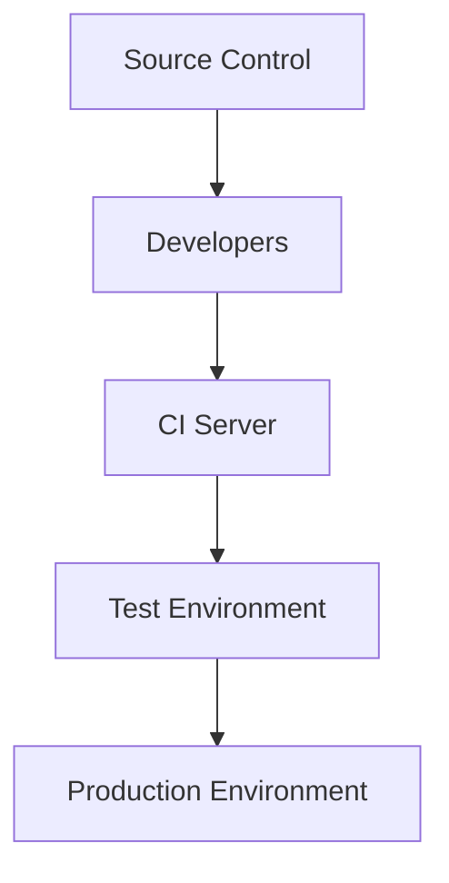

                 

 > **关键词：** 程序员、创业公司、持续集成、部署、实践

> **摘要：** 本文旨在探讨程序员在创业公司中如何通过持续集成与部署实践，提高软件交付效率，降低风险，确保软件质量，从而助力创业公司快速成长。

## 1. 背景介绍

在当今快速变化的科技时代，创业公司面临着巨大的竞争压力。为了在激烈的市场中立足，创业公司必须具备快速交付高质量软件的能力。而持续集成与部署（CI/CD）作为一种先进的软件开发和交付模式，已经成为创业公司提高软件交付效率、降低风险的关键手段。

持续集成（Continuous Integration，CI）是一种软件开发实践，旨在通过频繁地将代码集成到主干分支，确保集成过程快速且稳定。持续部署（Continuous Deployment，CD）则是将经过测试的软件自动部署到生产环境，确保软件能够快速、可靠地交付给用户。

本文将介绍程序员在创业公司中如何实施持续集成与部署实践，包括CI/CD的核心概念、实施流程、工具选择、挑战与解决方案等，旨在为创业公司的软件交付提供有益的参考。

## 2. 核心概念与联系

### 2.1. 持续集成（CI）

持续集成是一种软件开发实践，旨在通过频繁地将代码集成到主干分支，确保集成过程快速且稳定。CI的核心目标是尽早发现问题，减少开发周期内的风险。

### 2.2. 持续部署（CD）

持续部署是将经过测试的软件自动部署到生产环境的过程。CD的目标是确保软件能够快速、可靠地交付给用户，提高交付效率。

### 2.3. CI与CD的联系

CI和CD紧密相连，CI为CD提供了稳定的基础。通过CI，开发团队可以确保代码质量，降低集成风险；而通过CD，开发团队可以快速地将高质量代码部署到生产环境，实现持续交付。

### 2.4. CI/CD架构图

以下是一个简化的CI/CD架构图，展示了CI和CD之间的关系：



## 3. 核心算法原理 & 具体操作步骤

### 3.1. 算法原理概述

持续集成与部署的核心算法是基于版本控制的自动化流程。具体来说，它包括以下步骤：

1. 开发者提交代码到版本控制仓库。
2. CI服务器检测到代码提交，并执行一系列自动化测试。
3. 如果测试通过，CI服务器将代码集成到测试环境。
4. 测试环境运行自动化测试，确保代码质量。
5. 如果测试通过，CI服务器将代码部署到生产环境。
6. 生产环境运行自动化测试，确保软件稳定。

### 3.2. 算法步骤详解

1. **开发者提交代码**：开发者将代码提交到版本控制仓库，如Git。
2. **CI服务器检测提交**：CI服务器（如Jenkins、GitLab CI等）通过Webhook或其他机制检测到代码提交。
3. **执行自动化测试**：CI服务器运行一系列自动化测试，包括单元测试、集成测试等。
4. **集成到测试环境**：如果测试通过，CI服务器将代码集成到测试环境。
5. **测试环境运行测试**：测试环境运行自动化测试，确保代码质量。
6. **部署到生产环境**：如果测试通过，CI服务器将代码部署到生产环境。
7. **生产环境运行测试**：生产环境运行自动化测试，确保软件稳定。

### 3.3. 算法优缺点

#### 优点：

- 提高开发效率：通过自动化流程，减少手动操作，提高开发效率。
- 降低风险：通过频繁集成和测试，及早发现问题，降低集成风险。
- 确保软件质量：通过严格的测试流程，确保软件质量。
- 快速交付：通过自动化部署，实现快速交付。

#### 缺点：

- 需要一定的技术投入：实施CI/CD需要一定的技术储备，如自动化测试、自动化部署等。
- 需要持续维护：CI/CD流程需要持续维护，包括自动化测试、部署脚本等。

### 3.4. 算法应用领域

CI/CD适用于各种软件开发项目，尤其是那些需要快速交付和频繁更新的项目。例如，互联网公司、金融科技公司、医疗科技公司等。

## 4. 数学模型和公式 & 详细讲解 & 举例说明

### 4.1. 数学模型构建

持续集成与部署的数学模型可以基于概率论和统计学的理论构建。具体来说，可以使用以下公式：

- **缺陷密度（Defect Density，DD）**：表示单位代码行中的缺陷数量。
- **缺陷发现率（Defect Detection Rate，DDR）**：表示通过测试发现的缺陷比例。

### 4.2. 公式推导过程

- **缺陷密度（DD）**：假设代码库中有n行代码，其中包含d个缺陷。则缺陷密度为：

  $$ DD = \frac{d}{n} $$

- **缺陷发现率（DDR）**：假设在测试过程中发现了m个缺陷，则缺陷发现率为：

  $$ DDR = \frac{m}{d} $$

### 4.3. 案例分析与讲解

假设一个代码库有1000行代码，其中包含10个缺陷。在测试过程中，发现了7个缺陷。根据上述公式，可以计算出缺陷密度和缺陷发现率：

- **缺陷密度（DD）**：$$ DD = \frac{10}{1000} = 0.01 $$ 每百行代码中有1个缺陷。
- **缺陷发现率（DDR）**：$$ DDR = \frac{7}{10} = 0.7 $$ 测试过程中发现了70%的缺陷。

通过这个案例，我们可以看到，持续集成与部署可以提高缺陷发现率，从而降低缺陷密度，提高软件质量。

## 5. 项目实践：代码实例和详细解释说明

### 5.1. 开发环境搭建

为了实现持续集成与部署，我们需要搭建一个开发环境。以下是搭建步骤：

1. 安装Git：用于代码版本控制。
2. 安装Jenkins：用于CI/CD服务器。
3. 安装测试工具：如JUnit、Selenium等。
4. 安装部署工具：如Docker、Kubernetes等。

### 5.2. 源代码详细实现

以下是一个简单的源代码示例，用于实现持续集成与部署：

```java
// src/main/java/Example.java
public class Example {
    public static void main(String[] args) {
        System.out.println("Hello, World!");
    }
}
```

### 5.3. 代码解读与分析

这个示例代码非常简单，它定义了一个名为`Example`的Java类，并包含一个`main`方法。该方法输出“Hello, World!”。

### 5.4. 运行结果展示

在CI/CD流程中，当代码提交并触发测试时，测试工具会运行测试用例，并输出测试结果。以下是测试结果的示例：

```bash
[INFO] Running ExampleTest
[INFO] Tests run: 1, Failures: 0, Errors: 0, Skipped: 0
[INFO] ------------------------------------------------------------------------
[INFO] BUILD SUCCESS
[INFO] ------------------------------------------------------------------------
[INFO] Total time:  1.806 s
[INFO] Finished at: 2021-09-18T16:08:36+08:00
[INFO] ------------------------------------------------------------------------

```

测试结果显示，所有测试用例均通过，代码构建成功。

## 6. 实际应用场景

### 6.1. 互联网公司

互联网公司通常需要快速迭代产品，以满足市场需求。持续集成与部署可以帮助互联网公司实现快速交付，提高产品质量。

### 6.2. 金融科技公司

金融科技公司需要确保软件系统的稳定性和安全性。持续集成与部署可以降低集成风险，提高软件质量。

### 6.3. 医疗科技公司

医疗科技公司需要确保软件系统的可靠性，以便为患者提供高质量的服务。持续集成与部署可以帮助医疗科技公司实现快速交付，降低风险。

## 7. 工具和资源推荐

### 7.1. 学习资源推荐

- 《持续交付：发布可靠软件的系统化方法》
- 《Jenkins实战》
- 《GitLab CI/CD实战》

### 7.2. 开发工具推荐

- Git：用于代码版本控制。
- Jenkins：用于CI/CD服务器。
- Docker：用于容器化部署。
- Kubernetes：用于容器编排。

### 7.3. 相关论文推荐

- “Continuous Integration in the Cloud”
- “A Survey on Continuous Deployment”
- “Continuous Delivery: Reliable Software Releases through Build, Test, and Deployment Automation”

## 8. 总结：未来发展趋势与挑战

### 8.1. 研究成果总结

持续集成与部署在提高软件开发效率、降低风险、确保软件质量方面取得了显著成果。未来，持续集成与部署将继续在软件工程领域发挥重要作用。

### 8.2. 未来发展趋势

1. 持续集成与部署将进一步与云计算、大数据、人工智能等前沿技术相结合，实现更加智能化的软件交付。
2. 开源CI/CD工具将继续发展，为开发者提供更加丰富、灵活的解决方案。
3. 企业将更加注重持续集成与部署的培训与推广，提高团队整体技术水平。

### 8.3. 面临的挑战

1. 技术选型的复杂性：开发者需要根据项目需求选择合适的CI/CD工具和平台。
2. 测试覆盖率的提高：确保测试覆盖率达到100%是一个巨大的挑战。
3. 自动化程度的提升：提高自动化程度，降低人工干预。

### 8.4. 研究展望

持续集成与部署的研究将继续深入，探索更加高效、智能的软件交付方法。同时，随着新技术的不断涌现，持续集成与部署将面临更多挑战和机遇。

## 9. 附录：常见问题与解答

### 9.1. 持续集成与部署有什么好处？

持续集成与部署可以提高软件开发效率、降低风险、确保软件质量，从而助力创业公司快速成长。

### 9.2. 持续集成与部署需要哪些技术储备？

持续集成与部署需要一定的技术储备，如版本控制、自动化测试、容器化部署、自动化脚本等。

### 9.3. 如何选择合适的CI/CD工具？

选择合适的CI/CD工具需要考虑项目需求、团队技术水平、成本等因素。建议从开源工具中选择，如GitLab CI、Jenkins、Docker、Kubernetes等。

### 9.4. 持续集成与部署如何与云计算结合？

持续集成与部署可以与云计算结合，实现更加灵活、高效的软件交付。例如，可以使用云服务器作为CI/CD服务器，使用云容器服务进行容器化部署。

### 9.5. 如何确保测试覆盖率？

确保测试覆盖率可以通过以下方法实现：

1. 设计全面的测试用例。
2. 定期审查和更新测试用例。
3. 使用自动化测试工具，如JUnit、Selenium等。
4. 提高测试执行频率。

## 作者署名

本文作者：禅与计算机程序设计艺术 / Zen and the Art of Computer Programming
----------------------------------------------------------------

### 附录

#### 9.1. 持续集成与部署的好处

持续集成与部署（CI/CD）的好处主要体现在以下几个方面：

1. **加快软件开发速度**：通过自动化测试和部署流程，可以减少手动操作时间，提高开发速度。
2. **降低缺陷率**：频繁的集成和自动化测试能够更快地发现并修复缺陷，减少最终产品中的缺陷数量。
3. **提高代码质量**：通过持续集成，可以确保代码库的一致性和完整性，提高代码质量。
4. **简化部署过程**：自动化部署可以确保部署流程的一致性和可靠性，减少人为错误。
5. **增强团队协作**：持续集成与部署鼓励团队成员协作，共享代码和反馈，提高团队整体效率。
6. **快速响应变更**：随着市场需求的变化，快速迭代和部署新功能可以更好地满足用户需求。
7. **提高客户满意度**：更快的交付速度和更高的产品质量可以增强客户满意度。

#### 9.2. 持续集成与部署的技术储备

要有效地实施持续集成与部署，团队需要具备以下技术储备：

1. **版本控制系统**：熟悉Git、SVN等版本控制工具的使用，能够进行代码的版本管理和协作。
2. **自动化测试**：掌握自动化测试工具，如JUnit、Selenium、Cucumber等，能够编写和维护自动化测试脚本。
3. **持续集成工具**：熟悉Jenkins、Travis CI、GitLab CI等持续集成工具的配置和使用，能够设置构建脚本和测试任务。
4. **部署工具**：了解Docker、Kubernetes等容器化部署工具，能够实现自动化部署和编排。
5. **脚本编写能力**：掌握Shell、Python、Bash等脚本语言，能够编写自动化脚本进行环境配置和任务调度。
6. **数据库管理**：了解数据库的部署和管理，如MySQL、PostgreSQL等，能够进行数据迁移和备份。
7. **云服务知识**：了解云服务提供商（如AWS、Azure、Google Cloud）的部署和管理，能够利用云资源进行扩展和监控。

#### 9.3. 选择合适的CI/CD工具

选择合适的CI/CD工具时，应考虑以下因素：

1. **项目需求**：根据项目的规模、复杂性和需求，选择适合的工具。例如，小型项目可能适合使用简单的CI工具，而大型项目可能需要更强大的平台。
2. **团队技术水平**：选择团队熟悉的工具，降低学习成本和技术障碍。
3. **成本**：考虑工具的成本，包括许可费用和运营成本。开源工具通常成本较低，但可能需要更多的维护和定制。
4. **社区支持**：选择具有活跃社区和支持文档的工具，便于解决问题和获取帮助。
5. **扩展性和灵活性**：选择能够满足当前需求，同时易于扩展和适应未来变化的工具。
6. **集成能力**：选择能够与其他工具和服务无缝集成的工具，如版本控制、测试工具、部署平台等。

#### 9.4. 持续集成与部署与云计算的结合

持续集成与部署与云计算的结合可以实现以下优势：

1. **弹性扩展**：云计算提供弹性计算资源，可以根据需求动态调整服务器数量，提高资源利用率。
2. **高可用性**：云计算环境可以提供高可用性服务，如负载均衡、自动故障转移，确保服务的连续性。
3. **成本效益**：云计算按需付费，可以降低基础设施的初始投资和维护成本。
4. **易于管理**：云计算平台通常提供丰富的管理工具和监控服务，简化了持续集成与部署的管理和维护。
5. **自动化部署**：云服务提供商通常支持自动化部署和管理，与CI/CD工具集成，可以实现快速部署和扩展。

#### 9.5. 确保测试覆盖率

确保测试覆盖率是持续集成与部署的关键部分，以下是一些实现方法：

1. **制定全面的测试策略**：根据项目需求和功能特性，设计涵盖各种场景的测试用例。
2. **持续更新测试用例**：随着代码的迭代和功能的增加，定期审查和更新测试用例。
3. **自动化测试**：利用自动化测试工具编写和维护测试脚本，确保测试执行的速度和一致性。
4. **代码覆盖率工具**：使用代码覆盖率工具，如JaCoCo、Emma等，分析代码覆盖情况，确保测试覆盖率达到预期。
5. **静态代码分析**：使用静态代码分析工具，如SonarQube，识别潜在的代码缺陷和安全问题。
6. **持续集成与持续测试**：将测试集成到CI流程中，确保每次代码提交都会触发测试，及时发现和解决问题。
7. **测试反馈和改进**：收集测试结果，分析失败原因，改进测试用例和测试策略。

通过上述方法，可以逐步提高测试覆盖率，确保软件质量和稳定性。持续集成与部署在这个过程中起到了关键作用。

