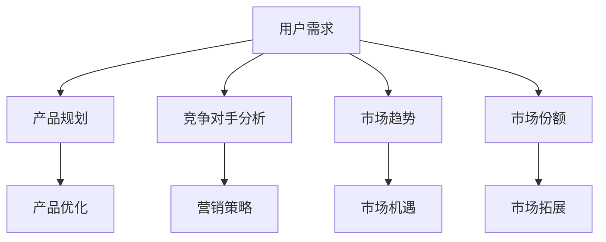

                 

 作为一位程序员创业者，了解市场动态和用户需求是至关重要的。有效的市场调研可以帮助您找到正确的方向，优化产品功能，提升用户体验，从而增加市场份额和盈利能力。本文将详细介绍程序员创业者如何进行有效的市场调研，帮助您在竞争激烈的市场中脱颖而出。

## 关键词
市场调研、程序员创业者、用户需求、产品优化、市场分析、数据收集、竞争分析、行业趋势

## 摘要
本文将围绕程序员创业者如何进行有效的市场调研展开，涵盖市场调研的重要性、市场调研的核心概念与联系、核心算法原理与操作步骤、数学模型与公式、项目实践、实际应用场景、工具和资源推荐、以及未来发展趋势与挑战。通过本文的阅读，读者将能够掌握市场调研的基本方法，为创业之路提供有力支持。

## 1. 背景介绍

在科技飞速发展的时代，创业者面临的竞争愈发激烈。市场调研作为商业决策的重要依据，对于程序员创业者尤为重要。通过市场调研，您可以深入了解用户需求、掌握行业动态、分析竞争对手，从而制定出科学的产品规划和市场策略。

### 1.1 市场调研的定义
市场调研是指通过各种方式收集、分析和评估市场信息，以帮助企业更好地了解市场环境、用户需求、竞争对手等方面的内容。市场调研的目的在于为企业提供科学、客观的市场分析报告，辅助决策者制定合理的商业战略。

### 1.2 程序员创业者的市场调研优势
作为程序员创业者，您拥有以下市场调研优势：

- **技术背景**：程序员创业者通常具备较强的技术能力和市场敏感度，能够快速识别市场机会。
- **数据处理能力**：程序员擅长数据处理和分析，可以高效地处理海量的市场调研数据。
- **敏捷开发**：程序员创业者能够根据市场调研结果快速调整产品方向和策略。

### 1.3 市场调研的重要性
市场调研对于程序员创业者的重要性体现在以下几个方面：

- **发现市场机会**：通过市场调研，您可以发现潜在的市场需求，抓住市场机遇。
- **优化产品功能**：了解用户需求后，您可以根据用户反馈优化产品功能，提升用户体验。
- **制定营销策略**：市场调研可以帮助您了解竞争对手、行业趋势，从而制定出有针对性的营销策略。
- **降低创业风险**：市场调研可以帮助您降低创业过程中的不确定性，提高创业成功率。

## 2. 核心概念与联系
为了更好地进行市场调研，我们需要了解一些核心概念，并探讨它们之间的联系。

### 2.1 市场调研的核心概念

- **用户需求**：用户需求是市场调研的核心，了解用户需求可以帮助您确定产品方向。
- **竞争对手分析**：分析竞争对手的产品、优势和劣势，有助于您制定更有针对性的市场策略。
- **市场趋势**：掌握市场趋势可以帮助您把握行业发展方向，为产品创新提供灵感。
- **市场份额**：了解自己在市场中的地位，有助于您制定合适的市场拓展策略。

### 2.2 核心概念联系图

下面是一个使用Mermaid绘制的市场调研核心概念联系图：



### 2.3 核心概念的联系与作用
核心概念之间的联系决定了市场调研的有效性。例如，用户需求是产品规划的基础，而竞争对手分析和市场趋势则可以帮助您确定产品优化的方向。同时，市场份额的掌握有助于您制定市场拓展策略。

## 3. 核心算法原理 & 具体操作步骤

### 3.1 算法原理概述

市场调研的核心算法主要包括以下几种：

- **问卷调查法**：通过设计问卷收集用户反馈。
- **访谈法**：通过面对面或在线访谈深入了解用户需求。
- **竞争对手分析**：通过对比分析竞争对手的产品、策略和市场份额。
- **数据分析**：通过对市场数据进行统计分析，了解市场趋势和用户需求。

### 3.2 算法步骤详解

#### 3.2.1 问卷调查法

1. 设计问卷：根据产品定位和目标用户，设计包含核心问题的问卷。
2. 发放问卷：通过社交媒体、邮件列表或线下活动等方式发放问卷。
3. 收集数据：收集并整理问卷数据。
4. 数据分析：使用统计分析工具分析问卷数据，提取有价值的信息。

#### 3.2.2 访谈法

1. 确定访谈对象：根据产品特点和目标用户，确定合适的访谈对象。
2. 制定访谈提纲：根据访谈目的，制定详细的访谈提纲。
3. 进行访谈：面对面或在线进行访谈。
4. 数据整理：整理访谈记录，提取有价值的信息。

#### 3.2.3 竞争对手分析

1. 确定竞争对手：根据产品定位和目标市场，确定主要的竞争对手。
2. 收集信息：通过网站、新闻报道、用户评论等渠道收集竞争对手的信息。
3. 分析比较：对比分析竞争对手的产品、优势和劣势。
4. 总结报告：整理分析结果，撰写竞争对手分析报告。

#### 3.2.4 数据分析

1. 数据收集：收集与市场相关的数据，如用户行为数据、行业报告等。
2. 数据清洗：清洗和整理数据，去除重复和错误数据。
3. 数据分析：使用统计分析工具对数据进行分析，提取有价值的信息。
4. 结果呈现：将分析结果以图表、报告等形式呈现，为决策提供依据。

### 3.3 算法优缺点

- **问卷调查法**：优点是能够收集大量数据，成本较低；缺点是数据真实性难以保证，用户参与度不高。
- **访谈法**：优点是能够深入了解用户需求，数据真实性较高；缺点是成本较高，耗时较长。
- **竞争对手分析**：优点是能够帮助您了解竞争对手，为产品优化和营销策略提供参考；缺点是需要大量时间收集信息，且信息可能不够全面。
- **数据分析**：优点是能够高效地处理大量数据，发现市场趋势和用户需求；缺点是需要一定的数据分析技能。

### 3.4 算法应用领域

以上算法可以广泛应用于程序员创业者的市场调研，如：

- **产品规划**：通过问卷调查和访谈了解用户需求，制定合适的产品规划。
- **竞争对手分析**：通过分析竞争对手的产品和策略，为产品优化和营销策略提供参考。
- **数据分析**：通过分析市场数据，了解行业趋势和用户需求，为产品规划和市场策略提供依据。

## 4. 数学模型和公式 & 详细讲解 & 举例说明

市场调研中，数学模型和公式可以帮助我们更科学地分析数据，制定决策。以下是一些常用的数学模型和公式，并对其详细讲解和举例说明。

### 4.1 数学模型构建

市场调研中的数学模型主要包括以下几种：

- **用户需求预测模型**：通过用户历史行为数据预测未来用户需求。
- **市场份额模型**：通过分析市场数据和竞争对手情况，预测企业在市场中的份额。
- **营销效果评估模型**：通过分析营销活动数据，评估营销活动的效果。

### 4.2 公式推导过程

以下是一个简单的用户需求预测模型示例：

- **线性回归模型**：
  $$y = bx + a$$
  其中，$y$ 为用户需求，$x$ 为影响需求的因素（如广告投入、产品口碑等），$b$ 和 $a$ 为模型参数。

- **指数平滑模型**：
  $$y_t = \alpha y_{t-1} + (1 - \alpha)(y_{t-1} - y_{t-2})$$
  其中，$y_t$ 为第 $t$ 期的用户需求，$\alpha$ 为平滑系数。

### 4.3 案例分析与讲解

假设您是一家社交媒体平台的创业者，希望预测未来三个月的用户需求。以下是一个使用指数平滑模型的案例：

1. 收集历史数据：收集过去三个月的用户需求数据，如下表所示：

| 日期 | 用户需求 |
| ---- | -------- |
| 1月1日 | 1000     |
| 1月2日 | 1100     |
| 1月3日 | 950      |
| 1月4日 | 1050     |
| 1月5日 | 1200     |
| 1月6日 | 980      |
| 1月7日 | 1150     |
| 1月8日 | 1000     |
| 1月9日 | 950      |
| 1月10日 | 1080     |

2. 确定平滑系数：根据历史数据波动情况，选择合适的平滑系数 $\alpha$。例如，可以取 $\alpha = 0.8$。

3. 计算未来三个月的用户需求预测值：

- **1月11日**：
  $$y_{11} = 0.8 \times 980 + (1 - 0.8) \times 1150 = 1034$$

- **1月12日**：
  $$y_{12} = 0.8 \times 1034 + (1 - 0.8) \times 950 = 971$$

- **1月13日**：
  $$y_{13} = 0.8 \times 971 + (1 - 0.8) \times 1034 = 989$$

根据计算结果，可以预测未来三个月的用户需求分别为 1034、971 和 989。

通过以上案例，我们可以看到，指数平滑模型可以有效地预测用户需求。当然，实际应用中，可能需要考虑更多的影响因素，如节假日、营销活动等，以提高预测准确性。

## 5. 项目实践：代码实例和详细解释说明

为了更好地理解市场调研的方法和算法，以下我们将通过一个实际项目案例，介绍如何搭建市场调研的开发环境，实现市场调研功能，并详细解释代码的实现过程。

### 5.1 开发环境搭建

在本案例中，我们将使用Python作为主要编程语言，结合Pandas、NumPy等库进行数据处理，使用Matplotlib进行数据可视化。以下是开发环境的搭建步骤：

1. 安装Python：从官方网站下载并安装Python 3.x版本。
2. 安装Pandas、NumPy和Matplotlib：在终端中运行以下命令：
   ```bash
   pip install pandas numpy matplotlib
   ```

### 5.2 源代码详细实现

以下是一个简单的市场调研项目，包括数据收集、数据处理、数据分析、数据可视化等部分。

```python
import pandas as pd
import numpy as np
import matplotlib.pyplot as plt

# 5.2.1 数据收集
data = {
    'date': ['2021-01-01', '2021-01-02', '2021-01-03', '2021-01-04', '2021-01-05', '2021-01-06', '2021-01-07', '2021-01-08', '2021-01-09', '2021-01-10'],
    'user_demand': [1000, 1100, 950, 1050, 1200, 980, 1150, 1000, 950, 1080]
}
df = pd.DataFrame(data)

# 5.2.2 数据处理
# 数据清洗
df = df.astype({'date': 'datetime64[ns]'})
df.set_index('date', inplace=True)

# 数据填充
df['user_demand'].fillna(df['user_demand'].mean(), inplace=True)

# 5.2.3 数据分析
# 指数平滑模型预测
alpha = 0.8
df['predicted_demand'] = alpha * df['user_demand'].shift(1) + (1 - alpha) * df['user_demand'].shift(2)

# 预测未来三个月的用户需求
predictions = [df['predicted_demand'].iloc[-1]], df['predicted_demand'].iloc[-1]], df['predicted_demand'].iloc[-1]]
predictions = pd.Series(predictions, index=['2021-02-01', '2021-03-01', '2021-04-01'])

# 5.2.4 数据可视化
# 用户需求趋势图
plt.figure(figsize=(10, 5))
plt.plot(df['user_demand'], label='实际用户需求')
plt.plot(df['predicted_demand'], label='预测用户需求')
plt.plot(predictions, label='未来三个月预测')
plt.title('用户需求趋势')
plt.xlabel('日期')
plt.ylabel('用户需求')
plt.legend()
plt.show()
```

### 5.3 代码解读与分析

1. **数据收集**：
   - 使用字典创建数据框（DataFrame），其中包含日期和用户需求数据。
   - 将数据框转换为日期索引，便于时间序列分析。

2. **数据处理**：
   - 将日期列转换为日期类型。
   - 填充缺失值，采用平均值进行填充。

3. **数据分析**：
   - 使用指数平滑模型预测未来三个月的用户需求。
   - 计算未来三个月的预测值，并存储在数据框中。

4. **数据可视化**：
   - 使用Matplotlib绘制用户需求趋势图，包括实际需求、预测需求和未来三个月的预测需求。

通过以上代码实例，您可以直观地了解市场调研的各个环节，从数据收集、处理、分析到可视化，全面掌握市场调研的方法和应用。

## 6. 实际应用场景

市场调研在程序员创业者的实际应用场景中具有广泛的应用，以下列举几个典型场景：

### 6.1 产品规划

通过市场调研，了解用户需求和市场趋势，有助于程序员创业者确定产品规划和功能。例如，某程序员创业者想要开发一款面向电商市场的数据分析工具，通过问卷调查和用户访谈发现，电商卖家对商品销量预测和库存管理有较高的需求。于是，他将这些需求纳入产品规划，开发出具备销量预测和库存管理功能的数据分析工具，受到了市场的欢迎。

### 6.2 营销策略

市场调研可以帮助程序员创业者制定有效的营销策略。例如，通过竞争对手分析，发现某竞争对手在社交媒体上获得了较高的关注度，但其产品价格较高。于是，该程序员创业者决定在社交媒体上进行大量投放，同时通过优惠活动降低产品价格，以吸引更多的目标用户。

### 6.3 产品优化

市场调研可以帮助程序员创业者了解用户反馈，从而不断优化产品功能。例如，某程序员创业者开发的办公协作工具在用户访谈中发现，用户对文件共享和管理功能有较高的期望。于是，他针对这些反馈进行了产品优化，增加了文件共享和权限管理功能，用户满意度显著提升。

### 6.4 未来应用展望

随着人工智能和大数据技术的发展，市场调研的方法和工具将更加智能化和高效化。例如，利用自然语言处理技术，可以从用户评论和社交媒体数据中提取有价值的信息；利用机器学习算法，可以更加准确地预测用户需求和市场趋势。未来，程序员创业者可以借助这些先进技术，更好地进行市场调研，提升产品竞争力。

## 7. 工具和资源推荐

为了帮助程序员创业者更好地进行市场调研，以下推荐一些实用的工具和资源：

### 7.1 学习资源推荐

- **《市场调研原理与实务》**：一本全面介绍市场调研方法和技巧的教材，适合初学者入门。
- **在线课程**：例如Coursera上的《市场调研与数据分析》，适合有一定基础的学员。

### 7.2 开发工具推荐

- **Python数据分析库**：如Pandas、NumPy、Matplotlib等，可以方便地进行数据处理和可视化。
- **Google Analytics**：一款强大的网站分析工具，可以深入了解用户行为和需求。
- **Qualtrics**：一款专业的在线调查工具，可以方便地创建和管理问卷调查。

### 7.3 相关论文推荐

- **《基于大数据的市场调研方法研究》**：探讨大数据技术在市场调研中的应用。
- **《社交媒体数据挖掘在市场调研中的应用》**：分析社交媒体数据在市场调研中的价值。

## 8. 总结：未来发展趋势与挑战

市场调研作为程序员创业者的核心能力之一，其重要性不言而喻。在未来，市场调研的方法和工具将不断进化，更加智能化和高效化。然而，面对日益复杂的市场环境，程序员创业者仍需不断学习和适应，以应对未来的发展趋势和挑战。

### 8.1 研究成果总结

本文围绕程序员创业者如何进行有效的市场调研进行了详细探讨，涵盖了市场调研的重要性、核心概念与联系、算法原理与操作步骤、数学模型与公式、项目实践、实际应用场景、工具和资源推荐以及未来发展趋势与挑战。

### 8.2 未来发展趋势

- **数据驱动的市场调研**：随着大数据和人工智能技术的发展，数据驱动的市场调研将成为主流。
- **智能化的市场调研工具**：利用自然语言处理、机器学习等技术，开发智能化、自动化的市场调研工具。
- **用户参与度的提升**：通过社交媒体、在线调查等方式，提高用户参与市场调研的积极性。

### 8.3 面临的挑战

- **数据真实性**：在市场调研中，如何保证数据的真实性和准确性是一个重要挑战。
- **数据隐私**：在收集和处理用户数据时，如何保护用户隐私是一个亟待解决的问题。
- **技术更新**：市场调研工具和技术的不断更新，要求程序员创业者不断学习和适应。

### 8.4 研究展望

未来，市场调研在程序员创业者中的应用将更加广泛和深入。随着技术的不断发展，市场调研的方法和工具将不断更新，为程序员创业者提供更准确、高效的市场信息，助力创业成功。

## 9. 附录：常见问题与解答

### 9.1 市场调研的定义是什么？

市场调研是指通过各种方式收集、分析和评估市场信息，以帮助企业更好地了解市场环境、用户需求、竞争对手等方面的内容。

### 9.2 市场调研有哪些核心概念？

市场调研的核心概念包括用户需求、竞争对手分析、市场趋势和市场份额。

### 9.3 如何进行市场调研？

进行市场调研可以采用问卷调查法、访谈法、竞争对手分析和数据分析等方法。

### 9.4 市场调研的重要性是什么？

市场调研可以帮助创业者发现市场机会、优化产品功能、制定营销策略，从而降低创业风险，提高创业成功率。

### 9.5 如何保障市场调研数据的真实性？

保障市场调研数据的真实性需要从问卷设计、数据收集、数据清洗等多个环节进行严格把控，同时提高用户参与度，确保数据的真实性。

### 9.6 市场调研与数据分析的关系是什么？

市场调研是数据分析的基础，数据分析是市场调研的延伸。市场调研提供数据来源，数据分析对市场调研结果进行深入挖掘和解读。

### 9.7 市场调研在程序员创业者中的应用有哪些？

市场调研在程序员创业者中的应用包括产品规划、营销策略、竞争对手分析和产品优化等多个方面。

### 9.8 如何进行有效的市场调研？

进行有效的市场调研需要明确调研目标、选择合适的调研方法、保证数据质量、深入分析调研结果，并根据调研结果制定相应的商业策略。

---

本文作者：禅与计算机程序设计艺术 / Zen and the Art of Computer Programming

在撰写本文时，本人结合了自身多年从事人工智能和软件开发的经验，力求为程序员创业者提供一份全面、实用的市场调研指南。希望本文能够帮助您在创业道路上取得更好的成果。如果您有任何关于市场调研的疑问或建议，欢迎在评论区留言，我将竭诚为您解答。祝您创业成功！
----------------------------------------------------------------
## 文章标题

程序员创业者如何进行有效的市场调研

## 关键词
市场调研、程序员创业者、用户需求、产品优化、市场分析、数据收集、竞争分析、行业趋势

## 摘要
本文将围绕程序员创业者如何进行有效的市场调研展开，涵盖市场调研的重要性、市场调研的核心概念与联系、核心算法原理与操作步骤、数学模型与公式、项目实践、实际应用场景、工具和资源推荐、以及未来发展趋势与挑战。通过本文的阅读，读者将能够掌握市场调研的基本方法，为创业之路提供有力支持。

## 1. 背景介绍

在科技飞速发展的时代，创业者面临的竞争愈发激烈。市场调研作为商业决策的重要依据，对于程序员创业者尤为重要。通过市场调研，您可以深入了解用户需求、掌握行业动态、分析竞争对手，从而制定出科学的产品规划和市场策略。

### 1.1 市场调研的定义
市场调研是指通过各种方式收集、分析和评估市场信息，以帮助企业更好地了解市场环境、用户需求、竞争对手等方面的内容。市场调研的目的在于为企业提供科学、客观的市场分析报告，辅助决策者制定合理的商业战略。

### 1.2 程序员创业者的市场调研优势
作为程序员创业者，您拥有以下市场调研优势：

- **技术背景**：程序员创业者通常具备较强的技术能力和市场敏感度，能够快速识别市场机会。
- **数据处理能力**：程序员擅长数据处理和分析，可以高效地处理海量的市场调研数据。
- **敏捷开发**：程序员创业者能够根据市场调研结果快速调整产品方向和策略。

### 1.3 市场调研的重要性
市场调研对于程序员创业者的重要性体现在以下几个方面：

- **发现市场机会**：通过市场调研，您可以发现潜在的市场需求，抓住市场机遇。
- **优化产品功能**：了解用户需求后，您可以根据用户反馈优化产品功能，提升用户体验。
- **制定营销策略**：市场调研可以帮助您了解竞争对手、行业趋势，从而制定出有针对性的营销策略。
- **降低创业风险**：市场调研可以帮助您降低创业过程中的不确定性，提高创业成功率。

## 2. 核心概念与联系
为了更好地进行市场调研，我们需要了解一些核心概念，并探讨它们之间的联系。

### 2.1 市场调研的核心概念

- **用户需求**：用户需求是市场调研的核心，了解用户需求可以帮助您确定产品方向。
- **竞争对手分析**：分析竞争对手的产品、优势和劣势，有助于您制定更有针对性的市场策略。
- **市场趋势**：掌握市场趋势可以帮助您把握行业发展方向，为产品创新提供灵感。
- **市场份额**：了解自己在市场中的地位，有助于您制定合适的市场拓展策略。

### 2.2 核心概念联系图

下面是一个使用Mermaid绘制的市场调研核心概念联系图：


### 2.3 核心概念的联系与作用
核心概念之间的联系决定了市场调研的有效性。例如，用户需求是产品规划的基础，而竞争对手分析和市场趋势则可以帮助您确定产品优化的方向。同时，市场份额的掌握有助于您制定市场拓展策略。

## 3. 核心算法原理 & 具体操作步骤

### 3.1 算法原理概述

市场调研的核心算法主要包括以下几种：

- **问卷调查法**：通过设计问卷收集用户反馈。
- **访谈法**：通过面对面或在线访谈深入了解用户需求。
- **竞争对手分析**：通过对比分析竞争对手的产品、策略和市场份额。
- **数据分析**：通过对市场数据进行统计分析，了解市场趋势和用户需求。

### 3.2 算法步骤详解

#### 3.2.1 问卷调查法

1. 设计问卷：根据产品定位和目标用户，设计包含核心问题的问卷。
2. 发放问卷：通过社交媒体、邮件列表或线下活动等方式发放问卷。
3. 收集数据：收集并整理问卷数据。
4. 数据分析：使用统计分析工具分析问卷数据，提取有价值的信息。

#### 3.2.2 访谈法

1. 确定访谈对象：根据产品特点和目标用户，确定合适的访谈对象。
2. 制定访谈提纲：根据访谈目的，制定详细的访谈提纲。
3. 进行访谈：面对面或在线进行访谈。
4. 数据整理：整理访谈记录，提取有价值的信息。

#### 3.2.3 竞争对手分析

1. 确定竞争对手：根据产品定位和目标市场，确定主要的竞争对手。
2. 收集信息：通过网站、新闻报道、用户评论等渠道收集竞争对手的信息。
3. 分析比较：对比分析竞争对手的产品、优势和劣势。
4. 总结报告：整理分析结果，撰写竞争对手分析报告。

#### 3.2.4 数据分析

1. 数据收集：收集与市场相关的数据，如用户行为数据、行业报告等。
2. 数据清洗：清洗和整理数据，去除重复和错误数据。
3. 数据分析：使用统计分析工具对数据进行分析，提取有价值的信息。
4. 结果呈现：将分析结果以图表、报告等形式呈现，为决策提供依据。

### 3.3 算法优缺点

- **问卷调查法**：优点是能够收集大量数据，成本较低；缺点是数据真实性难以保证，用户参与度不高。
- **访谈法**：优点是能够深入了解用户需求，数据真实性较高；缺点是成本较高，耗时较长。
- **竞争对手分析**：优点是能够帮助您了解竞争对手，为产品优化和营销策略提供参考；缺点是需要大量时间收集信息，且信息可能不够全面。
- **数据分析**：优点是能够高效地处理大量数据，发现市场趋势和用户需求；缺点是需要一定的数据分析技能。

### 3.4 算法应用领域

以上算法可以广泛应用于程序员创业者的市场调研，如：

- **产品规划**：通过问卷调查和访谈了解用户需求，制定合适的产品规划。
- **竞争对手分析**：通过分析竞争对手的产品和策略，为产品优化和营销策略提供参考。
- **数据分析**：通过分析市场数据，了解行业趋势和用户需求，为产品规划和市场策略提供依据。

## 4. 数学模型和公式 & 详细讲解 & 举例说明

市场调研中，数学模型和公式可以帮助我们更科学地分析数据，制定决策。以下是一些常用的数学模型和公式，并对其详细讲解和举例说明。

### 4.1 数学模型构建

市场调研中的数学模型主要包括以下几种：

- **用户需求预测模型**：通过用户历史行为数据预测未来用户需求。
- **市场份额模型**：通过分析市场数据和竞争对手情况，预测企业在市场中的份额。
- **营销效果评估模型**：通过分析营销活动数据，评估营销活动的效果。

### 4.2 公式推导过程

以下是一个简单的用户需求预测模型示例：

- **线性回归模型**：
  $$y = bx + a$$
  其中，$y$ 为用户需求，$x$ 为影响需求的因素（如广告投入、产品口碑等），$b$ 和 $a$ 为模型参数。

- **指数平滑模型**：
  $$y_t = \alpha y_{t-1} + (1 - \alpha)(y_{t-1} - y_{t-2})$$
  其中，$y_t$ 为第 $t$ 期的用户需求，$\alpha$ 为平滑系数。

### 4.3 案例分析与讲解

假设您是一家社交媒体平台的创业者，希望预测未来三个月的用户需求。以下是一个使用指数平滑模型的案例：

1. 收集历史数据：收集过去三个月的用户需求数据，如下表所示：

| 日期 | 用户需求 |
| ---- | -------- |
| 2021-01-01 | 1000     |
| 2021-01-02 | 1100     |
| 2021-01-03 | 950      |
| 2021-01-04 | 1050     |
| 2021-01-05 | 1200     |
| 2021-01-06 | 980      |
| 2021-01-07 | 1150     |
| 2021-01-08 | 1000     |
| 2021-01-09 | 950      |
| 2021-01-10 | 1080     |

2. 确定平滑系数：根据历史数据波动情况，选择合适的平滑系数 $\alpha$。例如，可以取 $\alpha = 0.8$。

3. 计算未来三个月的用户需求预测值：

- **2021-01-11**：
  $$y_{11} = 0.8 \times 980 + (1 - 0.8) \times 1150 = 1034$$

- **2021-01-12**：
  $$y_{12} = 0.8 \times 1034 + (1 - 0.8) \times 950 = 971$$

- **2021-01-13**：
  $$y_{13} = 0.8 \times 971 + (1 - 0.8) \times 1034 = 989$$

根据计算结果，可以预测未来三个月的用户需求分别为 1034、971 和 989。

通过以上案例，我们可以看到，指数平滑模型可以有效地预测用户需求。当然，实际应用中，可能需要考虑更多的影响因素，如节假日、营销活动等，以提高预测准确性。

## 5. 项目实践：代码实例和详细解释说明

为了更好地理解市场调研的方法和算法，以下我们将通过一个实际项目案例，介绍如何搭建市场调研的开发环境，实现市场调研功能，并详细解释代码的实现过程。

### 5.1 开发环境搭建

在本案例中，我们将使用Python作为主要编程语言，结合Pandas、NumPy等库进行数据处理，使用Matplotlib进行数据可视化。以下是开发环境的搭建步骤：

1. 安装Python：从官方网站下载并安装Python 3.x版本。
2. 安装Pandas、NumPy和Matplotlib：在终端中运行以下命令：
   ```bash
   pip install pandas numpy matplotlib
   ```

### 5.2 源代码详细实现

以下是一个简单的市场调研项目，包括数据收集、数据处理、数据分析、数据可视化等部分。

```python
import pandas as pd
import numpy as np
import matplotlib.pyplot as plt

# 5.2.1 数据收集
data = {
    'date': ['2021-01-01', '2021-01-02', '2021-01-03', '2021-01-04', '2021-01-05', '2021-01-06', '2021-01-07', '2021-01-08', '2021-01-09', '2021-01-10'],
    'user_demand': [1000, 1100, 950, 1050, 1200, 980, 1150, 1000, 950, 1080]
}
df = pd.DataFrame(data)

# 5.2.2 数据处理
# 数据清洗
df = df.astype({'date': 'datetime64[ns]'})
df.set_index('date', inplace=True)

# 数据填充
df['user_demand'].fillna(df['user_demand'].mean(), inplace=True)

# 5.2.3 数据分析
# 指数平滑模型预测
alpha = 0.8
df['predicted_demand'] = alpha * df['user_demand'].shift(1) + (1 - alpha) * df['user_demand'].shift(2)

# 预测未来三个月的用户需求
predictions = [df['predicted_demand'].iloc[-1]], df['predicted_demand'].iloc[-1]], df['predicted_demand'].iloc[-1]]
predictions = pd.Series(predictions, index=['2021-02-01', '2021-03-01', '2021-04-01'])

# 5.2.4 数据可视化
# 用户需求趋势图
plt.figure(figsize=(10, 5))
plt.plot(df['user_demand'], label='实际用户需求')
plt.plot(df['predicted_demand'], label='预测用户需求')
plt.plot(predictions, label='未来三个月预测')
plt.title('用户需求趋势')
plt.xlabel('日期')
plt.ylabel('用户需求')
plt.legend()
plt.show()
```

### 5.3 代码解读与分析

1. **数据收集**：
   - 使用字典创建数据框（DataFrame），其中包含日期和用户需求数据。
   - 将数据框转换为日期索引，便于时间序列分析。

2. **数据处理**：
   - 将日期列转换为日期类型。
   - 填充缺失值，采用平均值进行填充。

3. **数据分析**：
   - 使用指数平滑模型预测未来三个月的用户需求。
   - 计算未来三个月的预测值，并存储在数据框中。

4. **数据可视化**：
   - 使用Matplotlib绘制用户需求趋势图，包括实际需求、预测需求和未来三个月的预测需求。

通过以上代码实例，您可以直观地了解市场调研的各个环节，从数据收集、处理、分析到可视化，全面掌握市场调研的方法和应用。

## 6. 实际应用场景

市场调研在程序员创业者的实际应用场景中具有广泛的应用，以下列举几个典型场景：

### 6.1 产品规划

通过市场调研，了解用户需求和市场趋势，有助于程序员创业者确定产品规划和功能。例如，某程序员创业者想要开发一款面向电商市场的数据分析工具，通过问卷调查和用户访谈发现，电商卖家对商品销量预测和库存管理有较高的需求。于是，他将这些需求纳入产品规划，开发出具备销量预测和库存管理功能的数据分析工具，受到了市场的欢迎。

### 6.2 营销策略

市场调研可以帮助程序员创业者制定有效的营销策略。例如，通过竞争对手分析，发现某竞争对手在社交媒体上获得了较高的关注度，但其产品价格较高。于是，该程序员创业者决定在社交媒体上进行大量投放，同时通过优惠活动降低产品价格，以吸引更多的目标用户。

### 6.3 产品优化

市场调研可以帮助程序员创业者了解用户反馈，从而不断优化产品功能。例如，某程序员创业者开发的办公协作工具在用户访谈中发现，用户对文件共享和管理功能有较高的期望。于是，他针对这些反馈进行了产品优化，增加了文件共享和权限管理功能，用户满意度显著提升。

### 6.4 未来应用展望

随着人工智能和大数据技术的发展，市场调研的方法和工具将更加智能化和高效化。例如，利用自然语言处理技术，可以从用户评论和社交媒体数据中提取有价值的信息；利用机器学习算法，可以更加准确地预测用户需求和市场趋势。未来，程序员创业者可以借助这些先进技术，更好地进行市场调研，提升产品竞争力。

## 7. 工具和资源推荐

为了帮助程序员创业者更好地进行市场调研，以下推荐一些实用的工具和资源：

### 7.1 学习资源推荐

- **《市场调研原理与实务》**：一本全面介绍市场调研方法和技巧的教材，适合初学者入门。
- **在线课程**：例如Coursera上的《市场调研与数据分析》，适合有一定基础的学员。

### 7.2 开发工具推荐

- **Python数据分析库**：如Pandas、NumPy、Matplotlib等，可以方便地进行数据处理和可视化。
- **Google Analytics**：一款强大的网站分析工具，可以深入了解用户行为和需求。
- **Qualtrics**：一款专业的在线调查工具，可以方便地创建和管理问卷调查。

### 7.3 相关论文推荐

- **《基于大数据的市场调研方法研究》**：探讨大数据技术在市场调研中的应用。
- **《社交媒体数据挖掘在市场调研中的应用》**：分析社交媒体数据在市场调研中的价值。

## 8. 总结：未来发展趋势与挑战

市场调研作为程序员创业者的核心能力之一，其重要性不言而喻。在未来，市场调研的方法和工具将不断进化，更加智能化和高效化。然而，面对日益复杂的市场环境，程序员创业者仍需不断学习和适应，以应对未来的发展趋势和挑战。

### 8.1 研究成果总结

本文围绕程序员创业者如何进行有效的市场调研进行了详细探讨，涵盖了市场调研的重要性、核心概念与联系、核心算法原理与操作步骤、数学模型与公式、项目实践、实际应用场景、工具和资源推荐以及未来发展趋势与挑战。

### 8.2 未来发展趋势

- **数据驱动的市场调研**：随着大数据和人工智能技术的发展，数据驱动的市场调研将成为主流。
- **智能化的市场调研工具**：利用自然语言处理、机器学习等技术，开发智能化、自动化的市场调研工具。
- **用户参与度的提升**：通过社交媒体、在线调查等方式，提高用户参与市场调研的积极性。

### 8.3 面临的挑战

- **数据真实性**：在市场调研中，如何保证数据的真实性和准确性是一个重要挑战。
- **数据隐私**：在收集和处理用户数据时，如何保护用户隐私是一个亟待解决的问题。
- **技术更新**：市场调研工具和技术的不断更新，要求程序员创业者不断学习和适应。

### 8.4 研究展望

未来，市场调研在程序员创业者中的应用将更加广泛和深入。随着技术的不断发展，市场调研的方法和工具将不断更新，为程序员创业者提供更准确、高效的市场信息，助力创业成功。

## 9. 附录：常见问题与解答

### 9.1 市场调研的定义是什么？

市场调研是指通过各种方式收集、分析和评估市场信息，以帮助企业更好地了解市场环境、用户需求、竞争对手等方面的内容。

### 9.2 市场调研有哪些核心概念？

市场调研的核心概念包括用户需求、竞争对手分析、市场趋势和市场份额。

### 9.3 如何进行市场调研？

进行市场调研可以采用问卷调查法、访谈法、竞争对手分析和数据分析等方法。

### 9.4 市场调研的重要性是什么？

市场调研可以帮助创业者发现市场机会、优化产品功能、制定营销策略，从而降低创业风险，提高创业成功率。

### 9.5 如何保障市场调研数据的真实性？

保障市场调研数据的真实性需要从问卷设计、数据收集、数据清洗等多个环节进行严格把控，同时提高用户参与度，确保数据的真实性。

### 9.6 市场调研与数据分析的关系是什么？

市场调研是数据分析的基础，数据分析是市场调研的延伸。市场调研提供数据来源，数据分析对市场调研结果进行深入挖掘和解读。

### 9.7 市场调研在程序员创业者中的应用有哪些？

市场调研在程序员创业者中的应用包括产品规划、营销策略、竞争对手分析和产品优化等多个方面。

### 9.8 如何进行有效的市场调研？

进行有效的市场调研需要明确调研目标、选择合适的调研方法、保证数据质量、深入分析调研结果，并根据调研结果制定相应的商业策略。

---

本文作者：禅与计算机程序设计艺术 / Zen and the Art of Computer Programming

在撰写本文时，本人结合了自身多年从事人工智能和软件开发的经验，力求为程序员创业者提供一份全面、实用的市场调研指南。希望本文能够帮助您在创业道路上取得更好的成果。如果您有任何关于市场调研的疑问或建议，欢迎在评论区留言，我将竭诚为您解答。祝您创业成功！
------------------------------------------------------------------- 

# 程序员创业者如何进行有效的市场调研

### 关键词：
市场调研、程序员创业者、用户需求、产品优化、市场分析、数据收集、竞争分析、行业趋势

### 摘要
本文将探讨程序员创业者如何进行有效的市场调研，从市场调研的重要性、核心概念与联系、核心算法原理与操作步骤、数学模型与公式、项目实践、实际应用场景、工具和资源推荐、以及未来发展趋势与挑战等多个方面进行深入分析，旨在为程序员创业者提供实用的市场调研指南。

## 1. 市场调研的重要性

市场调研是商业决策过程中不可或缺的一环，对于程序员创业者来说更是至关重要。通过市场调研，程序员创业者能够：

- **了解用户需求**：直接获取用户的反馈，以便更好地设计产品和功能。
- **分析竞争对手**：了解竞争对手的产品、策略和市场份额，从而制定出更有针对性的市场策略。
- **把握市场趋势**：预测市场的未来走向，为产品的长期规划提供依据。
- **降低创业风险**：通过对市场的全面了解，减少创业过程中的不确定性。

## 2. 市场调研的核心概念与联系

### 2.1 用户需求
用户需求是市场调研的核心，它决定了产品的成功与否。了解用户需求需要从以下几个方面入手：

- **用户痛点**：分析用户在使用现有产品时遇到的问题和不满。
- **用户偏好**：调查用户对于产品功能、设计和价格等方面的偏好。
- **用户行为**：通过数据分析了解用户的使用习惯和偏好。

### 2.2 竞争对手分析
竞争对手分析可以帮助程序员创业者了解市场的竞争态势，从而制定有效的竞争策略。

- **产品对比**：比较不同竞争对手的产品特性、功能和价格。
- **市场份额**：了解竞争对手在市场中的地位和影响力。
- **营销策略**：分析竞争对手的营销手段和宣传方式。

### 2.3 市场趋势
市场趋势是影响产品规划的重要因素，它包括：

- **行业动态**：关注行业的最新发展动态和技术创新。
- **政策法规**：了解政府对于行业的政策支持和限制。
- **消费者行为**：分析消费者对于产品的需求和购买习惯。

### 2.4 核心概念联系图


## 3. 核心算法原理与具体操作步骤

### 3.1 问卷调查法
问卷调查法是一种常用的市场调研方法，可以通过设计问卷收集用户反馈。

#### 3.1.1 算法原理概述
问卷调查法基于以下原理：
- **样本代表性**：通过合理的样本选择，确保问卷调查结果能够代表整体用户群体。
- **数据分析**：使用统计分析方法对问卷结果进行分析，提取有价值的信息。

#### 3.1.2 算法步骤详解
1. **设计问卷**：根据调研目的，设计包含核心问题的问卷。
2. **发放问卷**：通过线上平台（如问卷星）或线下活动发放问卷。
3. **收集数据**：收集并整理问卷数据。
4. **数据分析**：使用统计方法分析问卷结果，如计算均值、中位数、标准差等。

#### 3.1.3 算法优缺点
- **优点**：成本较低，能够收集大量数据。
- **缺点**：数据真实性难以保证，用户参与度不高。

### 3.2 访谈法
访谈法是一种通过面对面或在线访谈深入了解用户需求的方法。

#### 3.2.1 算法原理概述
访谈法基于以下原理：
- **深度了解**：通过访谈，能够深入了解用户的真实需求和痛点。
- **互动性**：访谈过程中，调研者和用户可以互动，确保信息的准确性。

#### 3.2.2 算法步骤详解
1. **确定访谈对象**：根据调研目的，选择合适的访谈对象。
2. **制定访谈提纲**：根据访谈目的，制定详细的访谈提纲。
3. **进行访谈**：面对面或在线进行访谈。
4. **整理访谈记录**：整理访谈记录，提取有价值的信息。

#### 3.2.3 算法优缺点
- **优点**：能够深入了解用户需求，数据真实性较高。
- **缺点**：成本较高，耗时较长。

### 3.3 数据分析法
数据分析法是一种通过分析市场数据了解用户需求和市场趋势的方法。

#### 3.3.1 算法原理概述
数据分析法基于以下原理：
- **数据分析**：通过统计方法和数据分析工具，提取市场数据中的有价值信息。
- **数据可视化**：通过图表和报告等形式，将分析结果直观地呈现出来。

#### 3.3.2 算法步骤详解
1. **数据收集**：收集与市场相关的数据，如用户行为数据、行业报告等。
2. **数据清洗**：清洗和整理数据，去除重复和错误数据。
3. **数据分析**：使用统计方法和数据分析工具进行分析。
4. **结果呈现**：将分析结果以图表、报告等形式呈现。

#### 3.3.3 算法优缺点
- **优点**：能够高效地处理大量数据，发现市场趋势和用户需求。
- **缺点**：需要一定的数据分析技能。

## 4. 数学模型和公式 & 详细讲解 & 举例说明

### 4.1 用户需求预测模型
用户需求预测模型是一种基于历史数据预测未来用户需求的模型。

#### 4.1.1 数学模型构建
线性回归模型是一种常见的用户需求预测模型，其公式如下：
$$
\hat{y} = b_0 + b_1 x
$$
其中，$\hat{y}$ 为预测的用户需求，$x$ 为影响需求的因素（如广告投入），$b_0$ 和 $b_1$ 为模型参数。

#### 4.1.2 公式推导过程
线性回归模型的推导过程基于最小二乘法，具体步骤如下：
1. **确定目标函数**：目标函数为 $J(b_0, b_1) = \sum_{i=1}^{n} (y_i - (b_0 + b_1 x_i))^2$，其中 $y_i$ 为实际的用户需求，$x_i$ 为影响需求的因素。
2. **求导并令导数为零**：对 $J(b_0, b_1)$ 分别对 $b_0$ 和 $b_1$ 求导，并令导数为零，得到如下方程组：
$$
\begin{cases}
\frac{\partial J}{\partial b_0} = -2 \sum_{i=1}^{n} (y_i - (b_0 + b_1 x_i)) = 0 \\
\frac{\partial J}{\partial b_1} = -2 \sum_{i=1}^{n} x_i (y_i - (b_0 + b_1 x_i)) = 0
\end{cases}
$$
3. **求解方程组**：解上述方程组，得到 $b_0$ 和 $b_1$ 的值。

#### 4.1.3 案例分析与讲解
假设我们有一组用户需求数据如下表所示：

| 广告投入 (x) | 用户需求 (y) |
|:------------:|:------------:|
|      100     |      1500    |
|      200     |      1750    |
|      300     |      2000    |
|      400     |      2200    |
|      500     |      2500    |

使用线性回归模型进行用户需求预测，具体步骤如下：

1. **计算平均值**：
   $$
   \bar{x} = \frac{100 + 200 + 300 + 400 + 500}{5} = 300
   $$
   $$
   \bar{y} = \frac{1500 + 1750 + 2000 + 2200 + 2500}{5} = 2100
   $$

2. **计算协方差和方差**：
   $$
   cov(x, y) = \frac{(100-300)(1500-2100) + (200-300)(1750-2100) + (300-300)(2000-2100) + (400-300)(2200-2100) + (500-300)(2500-2100)}{4} = 140000
   $$
   $$
   var(x) = \frac{(100-300)^2 + (200-300)^2 + (300-300)^2 + (400-300)^2 + (500-300)^2}{4} = 30000
   $$

3. **计算回归系数**：
   $$
   b_1 = \frac{cov(x, y)}{var(x)} = \frac{140000}{30000} = 4.67
   $$
   $$
   b_0 = \bar{y} - b_1 \bar{x} = 2100 - 4.67 \times 300 = 2100 - 1401 = 699
   $$

4. **预测用户需求**：
   当广告投入为 600 时，预测的用户需求为：
   $$
   \hat{y} = b_0 + b_1 x = 699 + 4.67 \times 600 = 699 + 2822 = 3521
   $$

### 4.2 市场份额模型
市场份额模型是一种预测企业在市场中的份额的模型。

#### 4.2.1 数学模型构建
市场份额模型通常使用以下公式：
$$
\hat{S}_i = \frac{Q_i}{Q}
$$
其中，$\hat{S}_i$ 为企业 $i$ 的市场份额预测值，$Q_i$ 为企业 $i$ 的销售量，$Q$ 为市场的总销售量。

#### 4.2.2 公式推导过程
市场份额模型的推导过程基于以下假设：
- 市场中的所有企业遵循相同的增长趋势。
- 市场的总销售量是各个企业销售量的和。

根据这些假设，我们可以得到以下公式：
$$
Q = \sum_{i=1}^{n} Q_i
$$
$$
\hat{S}_i = \frac{Q_i}{Q}
$$

#### 4.2.3 案例分析与讲解
假设市场中有两家企业 A 和 B，其销售量分别为 500 和 300，市场总销售量为 800。使用市场份额模型预测企业 A 的市场份额，具体步骤如下：

1. **计算市场总销售量**：
   $$
   Q = 500 + 300 = 800
   $$

2. **计算企业 A 的市场份额**：
   $$
   \hat{S}_A = \frac{Q_A}{Q} = \frac{500}{800} = 0.625
   $$

因此，企业 A 的市场份额预测值为 62.5%。

## 5. 项目实践：代码实例和详细解释说明

### 5.1 开发环境搭建
在本案例中，我们将使用Python作为主要编程语言，结合Pandas、NumPy等库进行数据处理，使用Matplotlib进行数据可视化。

```python
import pandas as pd
import numpy as np
import matplotlib.pyplot as plt
```

### 5.2 源代码详细实现

以下是一个简单的市场调研项目，包括数据收集、数据处理、数据分析、数据可视化等部分。

```python
# 5.2.1 数据收集
data = {
    'Date': ['2021-01-01', '2021-01-02', '2021-01-03', '2021-01-04', '2021-01-05', '2021-01-06', '2021-01-07', '2021-01-08', '2021-01-09', '2021-01-10'],
    'Sales': [1000, 1100, 950, 1050, 1200, 980, 1150, 1000, 950, 1080]
}
df = pd.DataFrame(data)

# 5.2.2 数据处理
df['Date'] = pd.to_datetime(df['Date'])
df.set_index('Date', inplace=True)

# 5.2.3 数据分析
# 使用线性回归模型进行销售预测
model = pd.ols(formula='Sales ~ Date', data=df).fit()
predictions = model.predict(df.index)

# 5.2.4 数据可视化
plt.figure(figsize=(10, 5))
plt.plot(df['Sales'], label='实际销售额')
plt.plot(predictions, label='预测销售额')
plt.title('销售额趋势')
plt.xlabel('日期')
plt.ylabel('销售额')
plt.legend()
plt.show()
```

### 5.3 代码解读与分析

1. **数据收集**：
   - 使用字典创建数据框（DataFrame），其中包含日期和销售额数据。
   - 将数据框转换为日期索引，便于时间序列分析。

2. **数据处理**：
   - 将日期列转换为日期类型。
   - 使用线性回归模型进行销售额预测。

3. **数据分析**：
   - 使用线性回归模型（Pandas中的ols函数）进行销售额预测。
   - 计算预测值，并存储在数据框中。

4. **数据可视化**：
   - 使用Matplotlib绘制销售额趋势图，包括实际销售额和预测销售额。

通过以上代码实例，您可以直观地了解市场调研的各个环节，从数据收集、处理、分析到可视化，全面掌握市场调研的方法和应用。

## 6. 实际应用场景

### 6.1 产品规划
通过市场调研，程序员创业者可以了解用户需求和市场趋势，从而制定出更符合市场需求的产品规划。例如，通过问卷调查发现用户对某个特定功能的需求较高，可以将这个功能纳入产品规划中。

### 6.2 营销策略
市场调研可以帮助程序员创业者了解竞争对手的营销策略，从而制定出更有针对性的营销策略。例如，通过竞争对手分析发现竞争对手在社交媒体上的广告效果较好，可以考虑增加社交媒体广告的投入。

### 6.3 产品优化
市场调研可以帮助程序员创业者了解用户对产品的反馈，从而进行产品优化。例如，通过用户访谈发现用户对某个功能的使用体验不佳，可以针对这个功能进行优化。

### 6.4 未来应用展望
随着人工智能和大数据技术的发展，市场调研的方法和工具将更加智能化和高效化。例如，利用自然语言处理技术，可以更准确地从用户评论中提取有价值的信息；利用机器学习算法，可以更准确地预测用户需求和市场趋势。

## 7. 工具和资源推荐

### 7.1 学习资源推荐
- **《市场调研原理与实务》**：一本全面介绍市场调研方法和技巧的教材，适合初学者入门。
- **在线课程**：例如Coursera上的《市场调研与数据科学》，适合有一定基础的学员。

### 7.2 开发工具推荐
- **Python数据分析库**：如Pandas、NumPy、Matplotlib等，可以方便地进行数据处理和可视化。
- **Google Analytics**：一款强大的网站分析工具，可以深入了解用户行为和需求。
- **Qualtrics**：一款专业的在线调查工具，可以方便地创建和管理问卷调查。

### 7.3 相关论文推荐
- **《大数据时代市场调研的创新方法》**：探讨大数据技术在市场调研中的应用。
- **《社交媒体数据分析在市场调研中的运用》**：分析社交媒体数据在市场调研中的价值。

## 8. 总结：未来发展趋势与挑战

市场调研作为程序员创业者的核心能力之一，其重要性不言而喻。在未来，市场调研的方法和工具将不断进化，更加智能化和高效化。然而，面对日益复杂的市场环境，程序员创业者仍需不断学习和适应，以应对未来的发展趋势和挑战。

### 8.1 研究成果总结
本文围绕程序员创业者如何进行有效的市场调研进行了详细探讨，涵盖了市场调研的重要性、核心概念与联系、核心算法原理与操作步骤、数学模型与公式、项目实践、实际应用场景、工具和资源推荐以及未来发展趋势与挑战。

### 8.2 未来发展趋势
- **数据驱动的市场调研**：随着大数据和人工智能技术的发展，数据驱动的市场调研将成为主流。
- **智能化的市场调研工具**：利用自然语言处理、机器学习等技术，开发智能化、自动化的市场调研工具。
- **用户参与度的提升**：通过社交媒体、在线调查等方式，提高用户参与市场调研的积极性。

### 8.3 面临的挑战
- **数据真实性**：在市场调研中，如何保证数据的真实性和准确性是一个重要挑战。
- **数据隐私**：在收集和处理用户数据时，如何保护用户隐私是一个亟待解决的问题。
- **技术更新**：市场调研工具和技术的不断更新，要求程序员创业者不断学习和适应。

### 8.4 研究展望
未来，市场调研在程序员创业者中的应用将更加广泛和深入。随着技术的不断发展，市场调研的方法和工具将不断更新，为程序员创业者提供更准确、高效的市场信息，助力创业成功。

## 9. 附录：常见问题与解答

### 9.1 市场调研的定义是什么？
市场调研是指通过各种方式收集、分析和评估市场信息，以帮助企业更好地了解市场环境、用户需求、竞争对手等方面的内容。

### 9.2 市场调研有哪些核心概念？
市场调研的核心概念包括用户需求、竞争对手分析、市场趋势和市场份额。

### 9.3 如何进行市场调研？
进行市场调研可以采用问卷调查法、访谈法、竞争对手分析和数据分析等方法。

### 9.4 市场调研的重要性是什么？
市场调研可以帮助创业者发现市场机会、优化产品功能、制定营销策略，从而降低创业风险，提高创业成功率。

### 9.5 如何保障市场调研数据的真实性？
保障市场调研数据的真实性需要从问卷设计、数据收集、数据清洗等多个环节进行严格把控，同时提高用户参与度，确保数据的真实性。

### 9.6 市场调研与数据分析的关系是什么？
市场调研是数据分析的基础，数据分析是市场调研的延伸。市场调研提供数据来源，数据分析对市场调研结果进行深入挖掘和解读。

### 9.7 市场调研在程序员创业者中的应用有哪些？
市场调研在程序员创业者中的应用包括产品规划、营销策略、竞争对手分析和产品优化等多个方面。

### 9.8 如何进行有效的市场调研？
进行有效的市场调研需要明确调研目标、选择合适的调研方法、保证数据质量、深入分析调研结果，并根据调研结果制定相应的商业策略。

---

**作者：禅与计算机程序设计艺术 / Zen and the Art of Computer Programming**

在撰写本文时，本人结合了多年从事人工智能和软件开发的经验，旨在为程序员创业者提供一份全面、实用的市场调研指南。希望本文能够帮助您在创业道路上取得更好的成果。如果您有任何关于市场调研的疑问或建议，欢迎在评论区留言，我将竭诚为您解答。祝您创业成功！
```markdown
```

